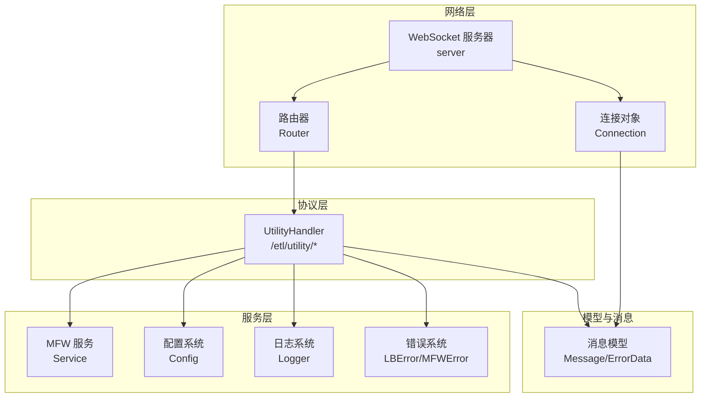
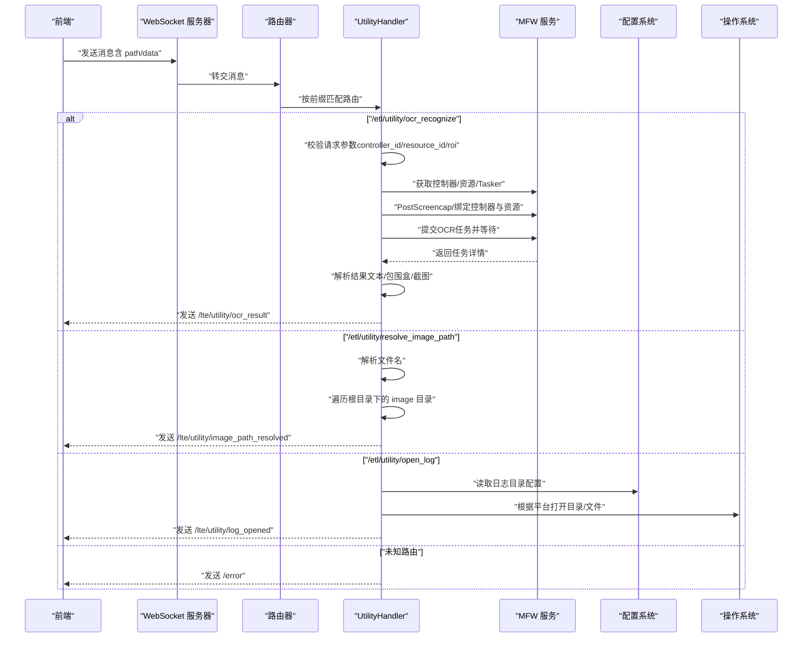
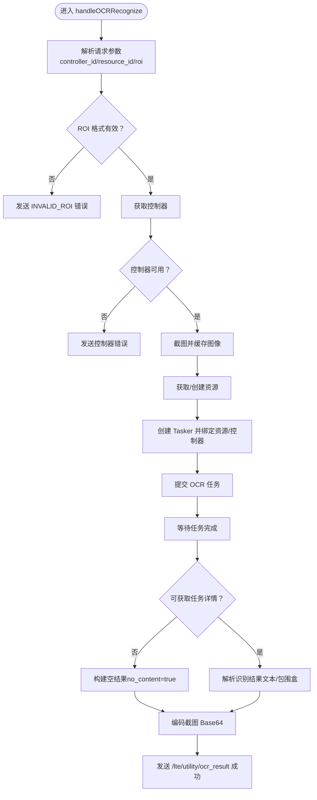
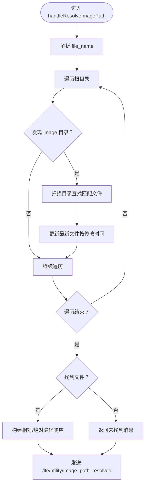
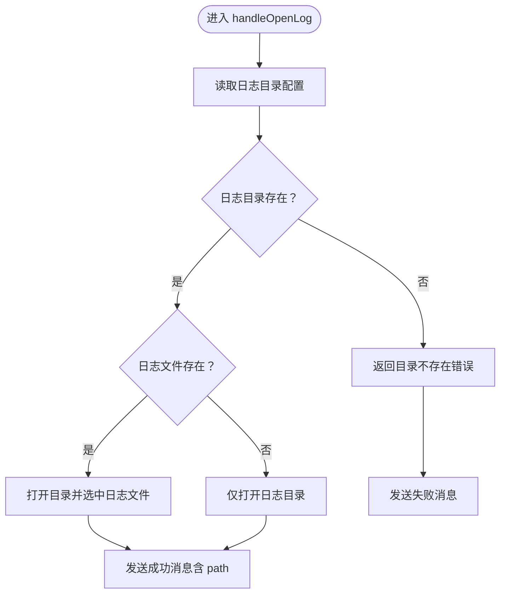
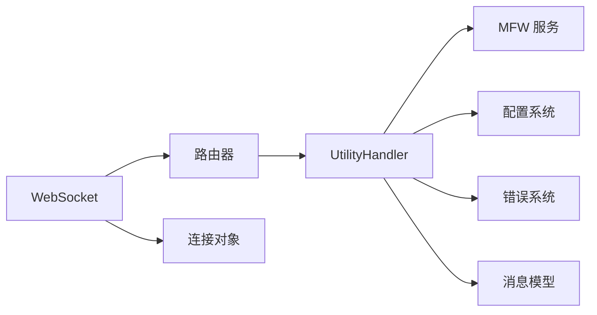

# 工具协议处理器

<cite>
**本文引用的文件**
- [handler.go](file://LocalBridge/internal/protocol/utility/handler.go)
- [message.go](file://LocalBridge/pkg/models/message.go)
- [config.go](file://LocalBridge/internal/config/config.go)
- [service.go](file://LocalBridge/internal/mfw/service.go)
- [errors.go](file://LocalBridge/internal/errors/errors.go)
- [error.go](file://LocalBridge/internal/mfw/error.go)
- [router.go](file://LocalBridge/internal/router/router.go)
- [websocket.go](file://LocalBridge/internal/server/websocket.go)
- [connection.go](file://LocalBridge/internal/server/connection.go)
- [main.go](file://LocalBridge/cmd/lb/main.go)
- [字段快捷工具.md](file://docsite/docs/01.指南/20.本地服务/20.字段快捷工具.md)
</cite>

## 目录
1. [简介](#简介)
2. [项目结构](#项目结构)
3. [核心组件](#核心组件)
4. [架构总览](#架构总览)
5. [详细组件分析](#详细组件分析)
6. [依赖分析](#依赖分析)
7. [性能考虑](#性能考虑)
8. [故障排查指南](#故障排查指南)
9. [结论](#结论)
10. [附录](#附录)

## 简介
工具协议处理器（UtilityHandler）是 LocalBridge 的一部分，负责提供系统工具、实用程序与帮助功能。其主要职责包括：
- OCR 识别：基于 MaaFramework 的原生 OCR 能力，对指定 ROI 区域进行文字识别，并返回文本、包围盒、截图预览等结果。
- 图片路径解析：在项目根目录下搜索 image 目录，解析并返回图片的相对路径与绝对路径。
- 打开日志：根据系统平台，使用系统文件管理器打开日志目录或选中日志文件。

该处理器通过 WebSocket 与前端通信，遵循统一的消息格式与错误处理策略，同时与 MFW 服务、配置系统、日志系统紧密协作。

## 项目结构
UtilityHandler 所在模块与相关依赖的关系如下：

图表来源
- [handler.go:1-694](file://LocalBridge/internal/protocol/utility/handler.go#L1-L694)
- [service.go:1-218](file://LocalBridge/internal/mfw/service.go#L1-L218)
- [config.go:1-339](file://LocalBridge/internal/config/config.go#L1-L339)
- [errors.go:1-141](file://LocalBridge/internal/errors/errors.go#L1-L141)
- [error.go:1-53](file://LocalBridge/internal/mfw/error.go#L1-L53)
- [router.go:1-151](file://LocalBridge/internal/router/router.go#L1-L151)
- [websocket.go:1-179](file://LocalBridge/internal/server/websocket.go#L1-L179)
- [connection.go:1-96](file://LocalBridge/internal/server/connection.go#L1-L96)
- [message.go:1-126](file://LocalBridge/pkg/models/message.go#L1-L126)

章节来源
- [handler.go:1-694](file://LocalBridge/internal/protocol/utility/handler.go#L1-L694)
- [main.go:385-413](file://LocalBridge/cmd/lb/main.go#L385-L413)

## 核心组件
- UtilityHandler：协议处理器，负责路由分发与具体功能实现。
- MFW 服务：封装 MaaFramework 的设备、控制器、资源、任务管理能力。
- 配置系统：提供全局配置（服务器、文件、日志、MaaFramework）读取与校验。
- 错误系统：统一错误码与错误消息格式，支持 MFW 特定错误类型。
- WebSocket 与路由器：负责消息接收、路由分发与响应发送。
- 消息模型：统一的 Message 与 ErrorData 结构，保证前后端一致性。

章节来源
- [handler.go:24-65](file://LocalBridge/internal/protocol/utility/handler.go#L24-L65)
- [service.go:15-34](file://LocalBridge/internal/mfw/service.go#L15-L34)
- [config.go:42-48](file://LocalBridge/internal/config/config.go#L42-L48)
- [errors.go:9-28](file://LocalBridge/internal/errors/errors.go#L9-L28)
- [error.go:33-52](file://LocalBridge/internal/mfw/error.go#L33-L52)
- [router.go:19-26](file://LocalBridge/internal/router/router.go#L19-L26)
- [websocket.go:15-22](file://LocalBridge/internal/server/websocket.go#L15-L22)
- [message.go:3-14](file://LocalBridge/pkg/models/message.go#L3-L14)

## 架构总览
UtilityHandler 的工作流分为“请求接收—路由分发—功能执行—结果返回”四个阶段，结合 MFW 与系统环境交互，形成完整的工具链路。

图表来源
- [handler.go:44-65](file://LocalBridge/internal/protocol/utility/handler.go#L44-L65)
- [handler.go:68-119](file://LocalBridge/internal/protocol/utility/handler.go#L68-L119)
- [handler.go:452-514](file://LocalBridge/internal/protocol/utility/handler.go#L452-L514)
- [handler.go:597-693](file://LocalBridge/internal/protocol/utility/handler.go#L597-L693)
- [router.go:49-76](file://LocalBridge/internal/router/router.go#L49-L76)
- [websocket.go:32-63](file://LocalBridge/internal/server/websocket.go#L32-L63)
- [connection.go:78-95](file://LocalBridge/internal/server/connection.go#L78-L95)

## 详细组件分析

### UtilityHandler 类与路由
- 路由前缀：/etl/utility/*
- 路由分发：根据 path 精确匹配，调用对应处理器。
- 错误处理：未知路由或参数错误时，统一发送 /error 消息。

章节来源
- [handler.go:38-65](file://LocalBridge/internal/protocol/utility/handler.go#L38-L65)
- [router.go:78-93](file://LocalBridge/internal/router/router.go#L78-L93)

### OCR 识别处理流程
- 请求参数：
  - controller_id：控制器标识
  - resource_id：可选资源标识
  - roi：[x, y, w, h] 数组
- 执行步骤：
  1) 获取控制器与资源；若 resource_id 为空则从配置加载 OCR 资源。
  2) 截图并缓存图像。
  3) 创建 Tasker 并绑定控制器与资源。
  4) 提交 OCR 任务并等待结果。
  5) 解析任务详情，构造返回结果（文本、包围盒、截图 Base64、ROI、no_content 标记）。
- 错误处理：
  - 参数校验失败：发送 /error（INVALID_ROI）。
  - MFW 异常：携带 MFW 错误码与消息。
  - 无内容识别：返回 no_content=true，仍视为成功。

图表来源
- [handler.go:68-119](file://LocalBridge/internal/protocol/utility/handler.go#L68-L119)
- [handler.go:122-287](file://LocalBridge/internal/protocol/utility/handler.go#L122-L287)
- [handler.go:289-306](file://LocalBridge/internal/protocol/utility/handler.go#L289-L306)
- [handler.go:308-409](file://LocalBridge/internal/protocol/utility/handler.go#L308-L409)
- [handler.go:422-429](file://LocalBridge/internal/protocol/utility/handler.go#L422-L429)

章节来源
- [handler.go:68-119](file://LocalBridge/internal/protocol/utility/handler.go#L68-L119)
- [handler.go:122-287](file://LocalBridge/internal/protocol/utility/handler.go#L122-L287)
- [handler.go:289-409](file://LocalBridge/internal/protocol/utility/handler.go#L289-L409)
- [handler.go:422-429](file://LocalBridge/internal/protocol/utility/handler.go#L422-L429)

### 图片路径解析处理流程
- 请求参数：file_name（如 "template_123.png"）
- 执行步骤：
  1) 在项目根目录下遍历所有名为 "image" 的子目录。
  2) 在每个 image 目录中查找匹配文件名的文件，按最后修改时间排序。
  3) 返回最新文件的相对路径、绝对路径与消息。
- 错误处理：未找到文件时返回失败消息。

图表来源
- [handler.go:452-514](file://LocalBridge/internal/protocol/utility/handler.go#L452-L514)
- [handler.go:524-562](file://LocalBridge/internal/protocol/utility/handler.go#L524-L562)
- [handler.go:564-595](file://LocalBridge/internal/protocol/utility/handler.go#L564-L595)

章节来源
- [handler.go:452-514](file://LocalBridge/internal/protocol/utility/handler.go#L452-L514)
- [handler.go:524-595](file://LocalBridge/internal/protocol/utility/handler.go#L524-L595)

### 打开日志处理流程
- 执行步骤：
  1) 读取配置的日志目录，若未配置则使用默认路径。
  2) 检查目录是否存在；若不存在，返回失败消息。
  3) 若日志文件存在，尝试选中该文件；否则仅打开目录。
  4) 根据操作系统平台调用相应命令（Windows/explorer、macOS/open、Linux/xdg-open）。
- 错误处理：命令执行失败时返回错误消息。

图表来源
- [handler.go:597-693](file://LocalBridge/internal/protocol/utility/handler.go#L597-L693)
- [config.go:28-33](file://LocalBridge/internal/config/config.go#L28-L33)

章节来源
- [handler.go:597-693](file://LocalBridge/internal/protocol/utility/handler.go#L597-L693)
- [config.go:28-33](file://LocalBridge/internal/config/config.go#L28-L33)

### 与系统环境与权限交互
- MaaFramework 初始化与路径处理：
  - 支持 Windows 中文路径转换（短路径或工作目录切换），避免库加载失败。
  - 日志目录同样进行路径处理，确保跨平台兼容。
- 文件系统：
  - 遍历项目根目录，仅在 "image" 目录中搜索文件，避免无关目录扫描。
  - 路径统一使用正斜杠，便于前端使用。
- 操作系统命令：
  - 根据平台调用系统命令打开目录或选中文件，权限取决于当前用户。

章节来源
- [service.go:67-94](file://LocalBridge/internal/mfw/service.go#L67-L94)
- [service.go:99-105](file://LocalBridge/internal/mfw/service.go#L99-L105)
- [handler.go:524-562](file://LocalBridge/internal/protocol/utility/handler.go#L524-L562)
- [handler.go:597-693](file://LocalBridge/internal/protocol/utility/handler.go#L597-L693)

### 错误处理策略
- 统一错误格式：/error 消息包含 code、message、detail。
- MFW 错误：携带 MFW 错误码与消息，便于前端识别与提示。
- 参数错误：如 ROI 格式错误，返回专用错误码。
- 系统错误：如路径不存在、命令执行失败，返回可读性良好的错误消息。

章节来源
- [errors.go:9-28](file://LocalBridge/internal/errors/errors.go#L9-L28)
- [error.go:5-21](file://LocalBridge/internal/mfw/error.go#L5-L21)
- [handler.go:86-110](file://LocalBridge/internal/protocol/utility/handler.go#L86-L110)
- [handler.go:440-450](file://LocalBridge/internal/protocol/utility/handler.go#L440-L450)

### 与路由器、WebSocket、连接对象的协作
- 路由器：按前缀匹配处理器，找不到时返回通用错误。
- WebSocket：升级 HTTP 连接，维护连接集合，广播日志。
- 连接对象：负责读取与发送消息，处理队列满等场景。

章节来源
- [router.go:49-76](file://LocalBridge/internal/router/router.go#L49-L76)
- [websocket.go:32-63](file://LocalBridge/internal/server/websocket.go#L32-L63)
- [connection.go:31-76](file://LocalBridge/internal/server/connection.go#L31-L76)

## 依赖分析
- 内聚性：UtilityHandler 聚合了 OCR、路径解析、日志打开三大工具功能，职责清晰。
- 耦合性：
  - 与 MFW 服务耦合：OCR 功能强依赖 MFW 控制器与资源。
  - 与配置系统耦合：OCR 资源路径、日志目录来自配置。
  - 与路由器/WebSocket：通过统一消息模型与路由机制解耦。
- 外部依赖：系统命令（explorer/open/xdg-open）、MaaFramework 库、文件系统。

图表来源
- [handler.go:1-22](file://LocalBridge/internal/protocol/utility/handler.go#L1-L22)
- [router.go:19-26](file://LocalBridge/internal/router/router.go#L19-L26)
- [websocket.go:32-63](file://LocalBridge/internal/server/websocket.go#L32-L63)
- [connection.go:78-95](file://LocalBridge/internal/server/connection.go#L78-L95)

章节来源
- [handler.go:1-22](file://LocalBridge/internal/protocol/utility/handler.go#L1-L22)
- [router.go:19-26](file://LocalBridge/internal/router/router.go#L19-L26)
- [websocket.go:32-63](file://LocalBridge/internal/server/websocket.go#L32-L63)
- [connection.go:78-95](file://LocalBridge/internal/server/connection.go#L78-L95)

## 性能考虑
- OCR 资源加载：优先使用已存在的资源；若需创建临时资源，尽量减少重复加载。
- 截图与任务：仅在必要时截图，避免频繁 PostScreencap；任务完成后及时销毁资源。
- 文件搜索：仅在 "image" 目录中搜索，减少 IO 压力；按修改时间排序，提升命中率。
- 日志打开：命令执行失败时快速返回，避免阻塞。

## 故障排查指南
- OCR 识别失败
  - 检查控制器是否连接（控制器不可用错误）。
  - 确认 OCR 资源路径配置正确（OCR 资源未配置错误）。
  - 验证 OCR 模型目录结构（model/ocr/ 下的 det/rec/keys 文件）。
- 图片路径解析失败
  - 确认项目根目录下存在 image 目录。
  - 检查文件名拼写与大小写。
- 打开日志失败
  - 检查日志目录是否存在。
  - 确认当前用户具有打开目录的权限。
- 路由错误
  - 确认前端发送的 path 是否为 /etl/utility/*。
  - 检查路由器是否正确注册处理器。

章节来源
- [handler.go:122-132](file://LocalBridge/internal/protocol/utility/handler.go#L122-L132)
- [handler.go:164-169](file://LocalBridge/internal/protocol/utility/handler.go#L164-L169)
- [handler.go:597-693](file://LocalBridge/internal/protocol/utility/handler.go#L597-L693)
- [router.go:60-65](file://LocalBridge/internal/router/router.go#L60-L65)

## 结论
UtilityHandler 通过清晰的路由分发与统一的消息模型，提供了 OCR 识别、图片路径解析与日志打开三项核心工具能力。其与 MFW 服务、配置系统、日志系统协同工作，既满足了前端工具面板的使用需求，也为扩展更多系统工具与实用程序提供了稳定的基础。

## 附录

### 使用示例与最佳实践
- OCR 识别
  - 在字段面板点击“OCR 识别”，自动截图并框选 ROI，支持前端与原生两种模式。
  - 原生 OCR 需要配置 OCR 资源路径，建议使用前端 OCR 以获得更稳定的体验。
- 图片路径解析
  - 在模板截图或区域选择时，系统会自动在 image 目录中查找匹配文件，减少手工输入。
- 打开日志
  - 一键打开日志目录，若日志文件存在则选中文件，便于快速定位问题。

章节来源
- [字段快捷工具.md:90-128](file://docsite/docs/01.指南/20.本地服务/20.字段快捷工具.md#L90-L128)
- [字段快捷工具.md:157-168](file://docsite/docs/01.指南/20.本地服务/20.字段快捷工具.md#L157-L168)

### 扩展开发指南
- 新增工具路由
  - 在 UtilityHandler 中新增路由前缀与处理器方法。
  - 在路由器中注册处理器，确保前缀唯一。
- 错误处理
  - 使用 sendError 或 sendUtilityError 发送统一错误格式。
  - 对于 MFW 特定错误，包装为 MFWError 并携带错误码。
- 与系统交互
  - 如需调用系统命令，参考 open_log 的实现，按平台分支处理。
  - 对于文件系统操作，遵循路径规范化与安全检查原则。

章节来源
- [handler.go:38-65](file://LocalBridge/internal/protocol/utility/handler.go#L38-L65)
- [router.go:41-47](file://LocalBridge/internal/router/router.go#L41-L47)
- [errors.go:43-50](file://LocalBridge/internal/errors/errors.go#L43-L50)
- [error.go:45-52](file://LocalBridge/internal/mfw/error.go#L45-L52)
- [handler.go:597-693](file://LocalBridge/internal/protocol/utility/handler.go#L597-L693)