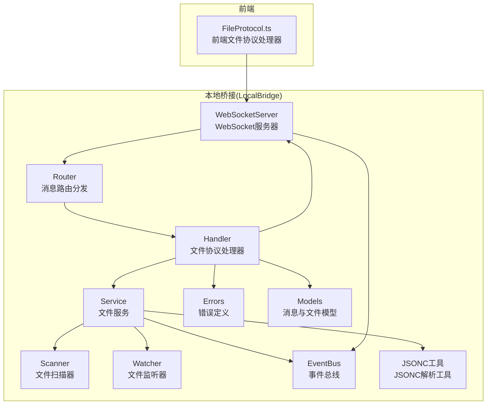
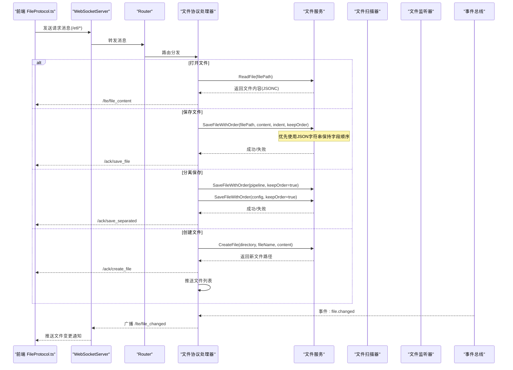
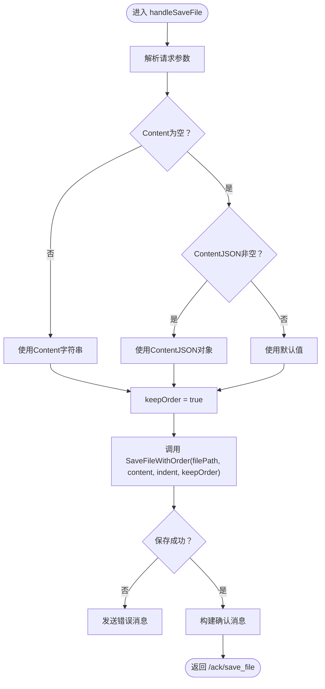
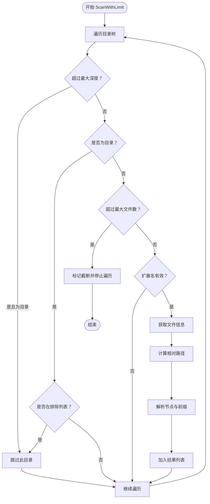
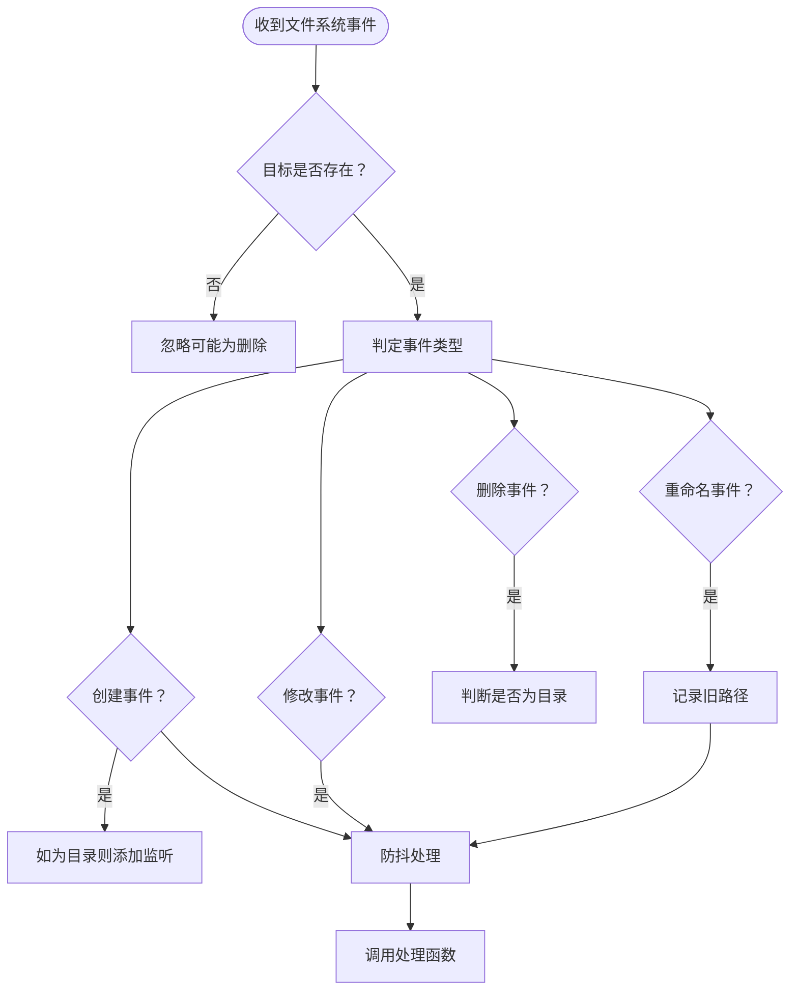
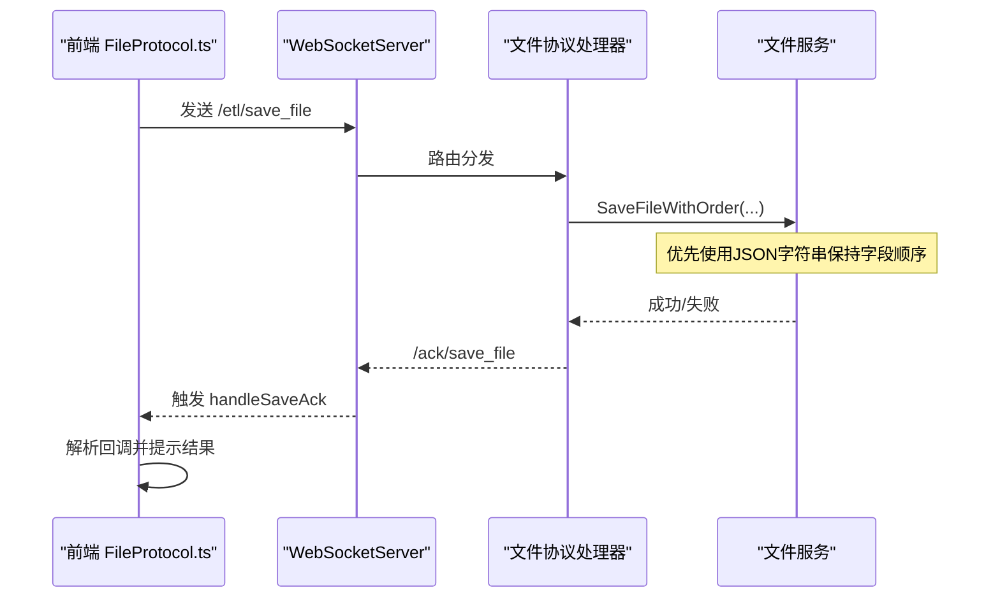
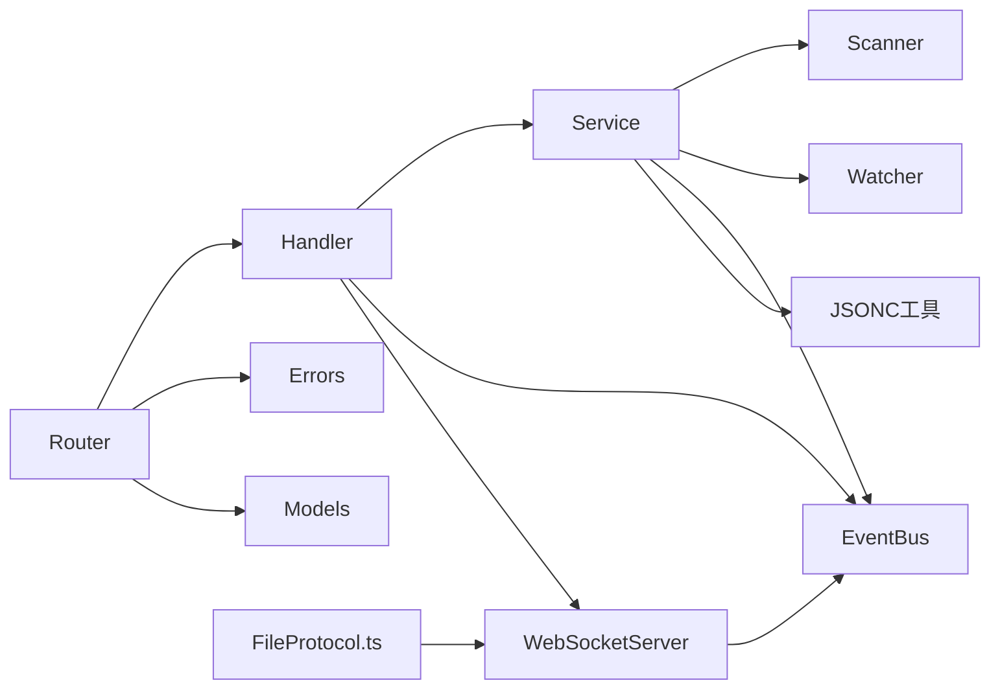

# 文件协议处理器

<cite>
**本文档引用的文件**
- [file_handler.go](file://LocalBridge/internal/protocol/file/file_handler.go)
- [file_service.go](file://LocalBridge/internal/service/file/file_service.go)
- [scanner.go](file://LocalBridge/internal/service/file/scanner.go)
- [watcher.go](file://LocalBridge/internal/service/file/watcher.go)
- [message.go](file://LocalBridge/pkg/models/message.go)
- [file.go](file://LocalBridge/pkg/models/file.go)
- [websocket.go](file://LocalBridge/internal/server/websocket.go)
- [router.go](file://LocalBridge/internal/router/router.go)
- [errors.go](file://LocalBridge/internal/errors/errors.go)
- [eventbus.go](file://LocalBridge/internal/eventbus/eventbus.go)
- [FileProtocol.ts](file://src/services/protocols/FileProtocol.ts)
- [jsonc.go](file://LocalBridge/internal/utils/jsonc.go)
- [default.json](file://LocalBridge/config/default.json)
</cite>

## 更新摘要
**变更内容**
- 新增内容处理机制：支持字符串和对象两种内容表示方式
- 优先使用JSON字符串以保持字段顺序的策略
- 更新保存文件请求模型，新增ContentJSON和PipelineJSON字段
- 增强SaveFileWithOrder方法，支持字段顺序保持功能

## 目录
1. [简介](#简介)
2. [项目结构](#项目结构)
3. [核心组件](#核心组件)
4. [架构总览](#架构总览)
5. [详细组件分析](#详细组件分析)
6. [依赖关系分析](#依赖关系分析)
7. [性能考虑](#性能考虑)
8. [故障排查指南](#故障排查指南)
9. [结论](#结论)
10. [附录](#附录)

## 简介
本文档深入解析文件协议处理器（FileHandler）的实现与功能，涵盖文件读写、创建、保存等核心操作的处理流程；解释文件路径解析、配置文件关联、文件列表管理；阐述错误处理机制、事件订阅与广播机制；并提供文件操作的使用示例与最佳实践。

**更新** 新增内容处理机制，支持字符串和对象两种内容表示方式，优先使用JSON字符串以保持字段顺序，确保配置文件的字段排列一致性。

## 项目结构
文件相关的核心代码分布在以下模块：
- 协议层：负责WebSocket消息路由与协议处理
- 服务层：封装文件系统操作、扫描与监听
- 模型层：定义消息与文件数据结构
- 服务器与路由：提供WebSocket通信与消息分发
- 前端协议适配：对接前端文件协议处理器



**图表来源**
- [FileProtocol.ts:16-68](file://src/services/protocols/FileProtocol.ts#L16-L68)
- [websocket.go:36-58](file://LocalBridge/internal/server/websocket.go#L36-L58)
- [router.go:29-47](file://LocalBridge/internal/router/router.go#L29-L47)
- [file_handler.go:15-20](file://LocalBridge/internal/protocol/file/file_handler.go#L15-L20)
- [file_service.go:20-35](file://LocalBridge/internal/service/file/file_service.go#L20-L35)
- [scanner.go:21-27](file://LocalBridge/internal/service/file/scanner.go#L21-L27)
- [watcher.go:35-41](file://LocalBridge/internal/service/file/watcher.go#L35-L41)
- [eventbus.go:17-27](file://LocalBridge/internal/eventbus/eventbus.go#L17-L27)
- [errors.go:23-28](file://LocalBridge/internal/errors/errors.go#L23-L28)
- [message.go:4-7](file://LocalBridge/pkg/models/message.go#L4-L7)
- [jsonc.go:1-30](file://LocalBridge/internal/utils/jsonc.go#L1-L30)

**章节来源**
- [FileProtocol.ts:16-68](file://src/services/protocols/FileProtocol.ts#L16-L68)
- [websocket.go:36-58](file://LocalBridge/internal/server/websocket.go#L36-L58)
- [router.go:29-47](file://LocalBridge/internal/router/router.go#L29-L47)
- [file_handler.go:15-20](file://LocalBridge/internal/protocol/file/file_handler.go#L15-L20)
- [file_service.go:20-35](file://LocalBridge/internal/service/file/file_service.go#L20-L35)
- [scanner.go:21-27](file://LocalBridge/internal/service/file/scanner.go#L21-L27)
- [watcher.go:35-41](file://LocalBridge/internal/service/file/watcher.go#L35-L41)
- [eventbus.go:17-27](file://LocalBridge/internal/eventbus/eventbus.go#L17-L27)
- [errors.go:23-28](file://LocalBridge/internal/errors/errors.go#L23-L28)
- [message.go:4-7](file://LocalBridge/pkg/models/message.go#L4-L7)
- [jsonc.go:1-30](file://LocalBridge/internal/utils/jsonc.go#L1-L30)

## 核心组件
- 文件协议处理器（Handler）：负责处理前端发起的文件相关请求，包括打开、保存、分离保存、创建文件以及刷新文件列表，并向前端推送文件列表与文件变更通知。
- 文件服务（Service）：封装文件系统操作，提供安全的读取、保存、创建文件能力，维护文件索引，支持扫描与监听文件变化。
- 文件扫描器（Scanner）：扫描指定根目录下的文件，构建文件索引，解析文件节点与前缀。
- 文件监听器（Watcher）：基于fsnotify监听文件系统变化，进行防抖处理并通过事件总线发布文件变更事件。
- WebSocket服务器与路由：提供WebSocket通信，分发消息到对应处理器。
- 错误与事件总线：统一错误定义与事件发布订阅机制。
- 前端文件协议适配（FileProtocol.ts）：前端侧的协议适配器，注册接收路由、处理文件列表、内容、变更通知，以及保存确认回调。
- JSONC解析工具：支持带注释的JSON（JSONC）格式解析，保持字段顺序。

**更新** 新增内容处理机制，支持字符串和对象两种内容表示方式，优先使用JSON字符串以保持字段顺序，确保配置文件的字段排列一致性。

**章节来源**
- [file_handler.go:15-20](file://LocalBridge/internal/protocol/file/file_handler.go#L15-L20)
- [file_service.go:20-35](file://LocalBridge/internal/service/file/file_service.go#L20-L35)
- [scanner.go:21-27](file://LocalBridge/internal/service/file/scanner.go#L21-L27)
- [watcher.go:35-41](file://LocalBridge/internal/service/file/watcher.go#L35-L41)
- [websocket.go:36-58](file://LocalBridge/internal/server/websocket.go#L36-L58)
- [router.go:29-47](file://LocalBridge/internal/router/router.go#L29-L47)
- [errors.go:23-28](file://LocalBridge/internal/errors/errors.go#L23-L28)
- [eventbus.go:17-27](file://LocalBridge/internal/eventbus/eventbus.go#L17-L27)
- [FileProtocol.ts:16-68](file://src/services/protocols/FileProtocol.ts#L16-L68)
- [jsonc.go:1-30](file://LocalBridge/internal/utils/jsonc.go#L1-L30)

## 架构总览
文件协议处理器通过WebSocket与前端交互，后端根据消息路径分发到对应的处理器，处理器调用文件服务执行具体操作，并通过事件总线与WebSocket广播机制向前端推送文件列表与变更通知。



**图表来源**
- [FileProtocol.ts:44-68](file://src/services/protocols/FileProtocol.ts#L44-L68)
- [websocket.go:164-171](file://LocalBridge/internal/server/websocket.go#L164-L171)
- [router.go:50-76](file://LocalBridge/internal/router/router.go#L50-L76)
- [file_handler.go:49-64](file://LocalBridge/internal/protocol/file/file_handler.go#L49-L64)
- [file_handler.go:139-176](file://LocalBridge/internal/protocol/file/file_handler.go#L139-L176)
- [file_handler.go:178-238](file://LocalBridge/internal/protocol/file/file_handler.go#L178-L238)
- [file_service.go:158-213](file://LocalBridge/internal/service/file/file_service.go#L158-L213)
- [eventbus.go:38-51](file://LocalBridge/internal/eventbus/eventbus.go#L38-L51)

**章节来源**
- [FileProtocol.ts:44-68](file://src/services/protocols/FileProtocol.ts#L44-L68)
- [websocket.go:164-171](file://LocalBridge/internal/server/websocket.go#L164-L171)
- [router.go:50-76](file://LocalBridge/internal/router/router.go#L50-L76)
- [file_handler.go:49-64](file://LocalBridge/internal/protocol/file/file_handler.go#L49-L64)
- [file_handler.go:139-176](file://LocalBridge/internal/protocol/file/file_handler.go#L139-L176)
- [file_handler.go:178-238](file://LocalBridge/internal/protocol/file/file_handler.go#L178-L238)
- [file_service.go:158-213](file://LocalBridge/internal/service/file/file_service.go#L158-L213)
- [eventbus.go:38-51](file://LocalBridge/internal/eventbus/eventbus.go#L38-L51)

## 详细组件分析

### 文件协议处理器（Handler）
职责与功能：
- 路由前缀：定义处理的ETL消息路径集合。
- 消息处理：根据消息路径分发到具体处理函数。
- 打开文件：读取文件内容，解析配置文件关联，返回文件内容与配置。
- 保存文件：优先使用JSON字符串保持字段顺序，其次使用JSON对象，序列化并写入文件，返回保存确认。
- 分离保存：同时保存Pipeline与配置文件，优先使用JSON字符串保持字段顺序，返回双确认。
- 创建文件：校验路径与文件名，创建新文件并更新文件索引，推送文件列表。
- 刷新文件列表：主动推送当前文件列表。
- 事件订阅：订阅连接建立与文件变化事件，推送文件列表与变更通知。
- 错误处理：统一解析与发送错误消息。

**更新** 新增内容处理机制，保存文件时优先使用JSON字符串以保持字段顺序，其次使用JSON对象，确保配置文件的字段排列一致性。

关键流程图（保存文件）：


**图表来源**
- [file_handler.go:139-176](file://LocalBridge/internal/protocol/file/file_handler.go#L139-L176)

**章节来源**
- [file_handler.go:38-64](file://LocalBridge/internal/protocol/file/file_handler.go#L38-L64)
- [file_handler.go:67-137](file://LocalBridge/internal/protocol/file/file_handler.go#L67-L137)
- [file_handler.go:139-176](file://LocalBridge/internal/protocol/file/file_handler.go#L139-L176)
- [file_handler.go:178-238](file://LocalBridge/internal/protocol/file/file_handler.go#L178-L238)
- [file_handler.go:240-271](file://LocalBridge/internal/protocol/file/file_handler.go#L240-L271)
- [file_handler.go:273-277](file://LocalBridge/internal/protocol/file/file_handler.go#L273-L277)
- [file_handler.go:279-330](file://LocalBridge/internal/protocol/file/file_handler.go#L279-L330)
- [file_handler.go:332-357](file://LocalBridge/internal/protocol/file/file_handler.go#L332-L357)

### 文件服务（Service）
职责与功能：
- 启动：初始化扫描器与监听器，构建初始文件索引，发布扫描完成事件。
- 停止：关闭文件监听器。
- 文件读取：校验路径安全性，检查文件存在性（允许直接读取.mpe.json），解析JSONC。
- 文件保存：支持字段顺序保持的保存方法，序列化JSON（支持缩进），写入文件，记录最近写入文件以避免自身写入事件干扰，清除防抖。
- 创建文件：校验目录与文件名，写入默认空对象或指定内容，更新索引。
- 文件变化处理：根据变化类型更新索引，发布文件变化事件。
- 路径校验：确保路径在根目录范围内。

**更新** 新增SaveFileWithOrder方法，支持字段顺序保持功能。当keepOrder为true时，如果content是字符串则直接使用（保持字段顺序），否则序列化为JSON。

类关系图：
```mermaid
classDiagram
class Handler {
+GetRoutePrefix() []string
+Handle(msg, conn) *Message
+handleOpenFile(msg, conn) *Message
+handleSaveFile(msg, conn) *Message
+handleSaveSeparated(msg, conn) *Message
+handleCreateFile(msg, conn) *Message
+handleRefreshFileList(msg, conn) *Message
+subscribeEvents() void
+pushFileList() void
+parseData(data, target) *LBError
+sendError(conn, err) void
}
class Service {
+Start() error
+Stop() void
+GetFileList() []FileInfo
+ReadFile(filePath) (interface{}, error)
+SaveFile(filePath, content, indent) error
+SaveFileWithOrder(filePath, content, indent, keepOrder) error
+CreateFile(directory, fileName, content) (string, error)
-handleFileChange(change) void
-validatePath(path) error
-marshalJSON(content, indent) ([]byte, error)
}
class Scanner {
+ScanWithLimit() *ScanResult
+ScanSingle(absPath) *File
-hasValidExtension(path) bool
-shouldExcludeDir(dirName) bool
-parseFileNodes(filePath) ([]FileNode, string)
}
class Watcher {
+Start() error
+Stop() void
+ClearDebounce(filePath) void
-processEvent(event) void
}
Handler --> Service : "依赖"
Service --> Scanner : "使用"
Service --> Watcher : "使用"
Service --> EventBus : "发布事件"
```

**图表来源**
- [file_handler.go:15-20](file://LocalBridge/internal/protocol/file/file_handler.go#L15-L20)
- [file_service.go:20-35](file://LocalBridge/internal/service/file/file_service.go#L20-L35)
- [scanner.go:21-27](file://LocalBridge/internal/service/file/scanner.go#L21-L27)
- [watcher.go:35-41](file://LocalBridge/internal/service/file/watcher.go#L35-L41)

**章节来源**
- [file_service.go:37-95](file://LocalBridge/internal/service/file/file_service.go#L37-L95)
- [file_service.go:105-120](file://LocalBridge/internal/service/file/file_service.go#L105-L120)
- [file_service.go:122-156](file://LocalBridge/internal/service/file/file_service.go#L122-L156)
- [file_service.go:158-213](file://LocalBridge/internal/service/file/file_service.go#L158-L213)
- [file_service.go:215-233](file://LocalBridge/internal/service/file/file_service.go#L215-L233)
- [file_service.go:235-283](file://LocalBridge/internal/service/file/file_service.go#L235-L283)
- [file_service.go:285-375](file://LocalBridge/internal/service/file/file_service.go#L285-L375)
- [file_service.go:377-392](file://LocalBridge/internal/service/file/file_service.go#L377-L392)

### 文件扫描器（Scanner）
职责与功能：
- 支持最大深度与最大文件数量限制。
- 忽略不可访问目录，跳过排除目录。
- 过滤有效扩展名（排除.mpe.json）。
- 解析文件节点列表与前缀（从JSONC内容中提取）。

算法流程（扫描）：


**图表来源**
- [scanner.go:65-147](file://LocalBridge/internal/service/file/scanner.go#L65-L147)

**章节来源**
- [scanner.go:65-147](file://LocalBridge/internal/service/file/scanner.go#L65-L147)
- [scanner.go:177-210](file://LocalBridge/internal/service/file/scanner.go#L177-L210)
- [scanner.go:213-249](file://LocalBridge/internal/service/file/scanner.go#L213-L249)

### 文件监听器（Watcher）
职责与功能：
- 使用fsnotify监听文件系统事件。
- 自动添加新建目录到监听范围。
- 防抖处理，避免频繁触发。
- 识别创建、修改、删除、重命名事件，区分目录与文件。

事件处理流程：


**图表来源**
- [watcher.go:114-188](file://LocalBridge/internal/service/file/watcher.go#L114-L188)

**章节来源**
- [watcher.go:62-92](file://LocalBridge/internal/service/file/watcher.go#L62-L92)
- [watcher.go:114-188](file://LocalBridge/internal/service/file/watcher.go#L114-L188)
- [watcher.go:202-258](file://LocalBridge/internal/service/file/watcher.go#L202-L258)

### 前端文件协议适配（FileProtocol.ts）
职责与功能：
- 注册接收路由：文件列表、文件内容、文件变更通知。
- 注册确认路由：保存文件、分离保存、创建文件确认。
- 处理文件列表：更新本地文件缓存，提示刷新完成。
- 处理文件内容：调用文件存储打开文件，提示打开成功。
- 处理文件变更：根据类型更新本地文件状态，自动重载或弹窗提示。
- 保存确认机制：等待后端确认，超时处理与回调解析。
- 创建文件：提示创建成功并更新当前文件路径与配置路径。

序列图（保存文件确认）：


**图表来源**
- [FileProtocol.ts:364-417](file://src/services/protocols/FileProtocol.ts#L364-L417)
- [FileProtocol.ts:237-267](file://src/services/protocols/FileProtocol.ts#L237-L267)

**章节来源**
- [FileProtocol.ts:44-68](file://src/services/protocols/FileProtocol.ts#L44-L68)
- [FileProtocol.ts:78-103](file://src/services/protocols/FileProtocol.ts#L78-L103)
- [FileProtocol.ts:109-141](file://src/services/protocols/FileProtocol.ts#L109-L141)
- [FileProtocol.ts:147-231](file://src/services/protocols/FileProtocol.ts#L147-L231)
- [FileProtocol.ts:237-315](file://src/services/protocols/FileProtocol.ts#L237-L315)
- [FileProtocol.ts:364-417](file://src/services/protocols/FileProtocol.ts#L364-L417)

### 内容处理机制
**新增功能** 文件协议处理器现在支持内容处理机制，确保字段顺序的一致性。

#### 保存文件请求模型
- Content：JSON字符串，优先使用以保持字段顺序
- ContentJSON：JSON对象，向后兼容
- Indent：JSON缩进空格数

#### 分离保存请求模型
- Pipeline/PipelineJSON：Pipeline内容，优先使用字符串保持顺序
- Config/ConfigJSON：配置内容，优先使用字符串保持顺序
- Indent：JSON缩进空格数

#### 保存文件逻辑
1. **优先级策略**：如果Content不为空，则使用Content字符串（保持字段顺序）
2. **回退策略**：如果Content为空但ContentJSON不为空，则使用ContentJSON对象
3. **字段顺序保持**：当keepOrder为true时，直接使用字符串内容，不重新序列化

**章节来源**
- [message.go:51-68](file://LocalBridge/pkg/models/message.go#L51-L68)
- [file_handler.go:139-176](file://LocalBridge/internal/protocol/file/file_handler.go#L139-L176)
- [file_handler.go:178-238](file://LocalBridge/internal/protocol/file/file_handler.go#L178-L238)
- [file_service.go:163-213](file://LocalBridge/internal/service/file/file_service.go#L163-L213)

## 依赖关系分析
- Handler依赖文件服务、事件总线、WebSocket服务器与根目录路径。
- 文件服务依赖扫描器、监听器、事件总线与工具库。
- WebSocket服务器依赖事件总线与HTTP服务。
- 路由器依赖错误定义与消息模型。
- 前端协议适配依赖WebSocket客户端与状态存储。
- JSONC工具提供带注释JSON解析支持。

**更新** 新增JSONC工具依赖，支持带注释的JSON格式解析。



**图表来源**
- [file_handler.go:15-20](file://LocalBridge/internal/protocol/file/file_handler.go#L15-L20)
- [file_service.go:20-35](file://LocalBridge/internal/service/file/file_service.go#L20-L35)
- [scanner.go:21-27](file://LocalBridge/internal/service/file/scanner.go#L21-L27)
- [watcher.go:35-41](file://LocalBridge/internal/service/file/watcher.go#L35-L41)
- [websocket.go:36-58](file://LocalBridge/internal/server/websocket.go#L36-L58)
- [router.go:29-47](file://LocalBridge/internal/router/router.go#L29-L47)
- [errors.go:23-28](file://LocalBridge/internal/errors/errors.go#L23-L28)
- [message.go:4-7](file://LocalBridge/pkg/models/message.go#L4-L7)
- [FileProtocol.ts:16-68](file://src/services/protocols/FileProtocol.ts#L16-L68)
- [jsonc.go:1-30](file://LocalBridge/internal/utils/jsonc.go#L1-L30)

**章节来源**
- [file_handler.go:15-20](file://LocalBridge/internal/protocol/file/file_handler.go#L15-L20)
- [file_service.go:20-35](file://LocalBridge/internal/service/file/file_service.go#L20-L35)
- [scanner.go:21-27](file://LocalBridge/internal/service/file/scanner.go#L21-L27)
- [watcher.go:35-41](file://LocalBridge/internal/service/file/watcher.go#L35-L41)
- [websocket.go:36-58](file://LocalBridge/internal/server/websocket.go#L36-L58)
- [router.go:29-47](file://LocalBridge/internal/router/router.go#L29-L47)
- [errors.go:23-28](file://LocalBridge/internal/errors/errors.go#L23-L28)
- [message.go:4-7](file://LocalBridge/pkg/models/message.go#L4-L7)
- [FileProtocol.ts:16-68](file://src/services/protocols/FileProtocol.ts#L16-L68)
- [jsonc.go:1-30](file://LocalBridge/internal/utils/jsonc.go#L1-L30)

## 性能考虑
- 扫描限制：通过最大深度与最大文件数量限制控制扫描成本，避免大规模目录导致性能问题。
- 防抖机制：监听器对事件进行防抖，减少频繁触发带来的重复处理。
- 自身写入忽略：记录最近写入文件的时间戳，在窗口期内忽略自身写入事件，避免循环触发。
- 广播优化：仅在必要时推送文件列表与变更通知，降低网络负载。
- JSON序列化：支持自定义缩进，平衡可读性与体积。
- **字段顺序保持**：优先使用JSON字符串避免重新序列化，保持字段原始顺序，提高性能。

**更新** 新增字段顺序保持优化，优先使用JSON字符串避免重新序列化，保持字段原始顺序。

**章节来源**
- [scanner.go:41-48](file://LocalBridge/internal/service/file/scanner.go#L41-L48)
- [scanner.go:65-147](file://LocalBridge/internal/service/file/scanner.go#L65-L147)
- [watcher.go:202-258](file://LocalBridge/internal/service/file/watcher.go#L202-L258)
- [file_service.go:34-48](file://LocalBridge/internal/service/file/file_service.go#L34-L48)
- [file_service.go:180-198](file://LocalBridge/internal/service/file/file_service.go#L180-L198)
- [file_service.go:173-190](file://LocalBridge/internal/service/file/file_service.go#L173-L190)

## 故障排查指南
常见错误与处理：
- 文件不存在：检查文件路径是否在根目录范围内，确认文件是否被排除或过滤。
- 权限不足：确保运行用户对目标路径具有读写权限。
- JSON格式无效：检查文件内容是否符合JSONC规范，必要时启用语法高亮与校验。
- 保存失败：确认文件未被外部程序占用，检查磁盘空间与权限。
- 路由未知：确认前端发送的路径是否正确，后端是否已注册对应处理器。
- 事件未推送：检查事件总线订阅与发布逻辑，确认WebSocket连接状态。
- **字段顺序问题**：确认使用Content字段而非ContentJSON，确保字段顺序保持。

**更新** 新增字段顺序问题排查指导。

定位步骤：
1. 查看后端日志输出，确认错误码与详细信息。
2. 在前端控制台查看WebSocket消息收发情况。
3. 检查配置文件中的根目录与扩展名设置。
4. 验证文件路径合法性与访问权限。
5. **验证内容格式**：确认保存请求使用Content字段以保持字段顺序。

**章节来源**
- [errors.go:10-20](file://LocalBridge/internal/errors/errors.go#L10-L20)
- [errors.go:77-140](file://LocalBridge/internal/errors/errors.go#L77-L140)
- [file_handler.go:318-327](file://LocalBridge/internal/protocol/file/file_handler.go#L318-L327)
- [router.go:95-105](file://LocalBridge/internal/router/router.go#L95-L105)
- [eventbus.go:38-51](file://LocalBridge/internal/eventbus/eventbus.go#L38-L51)

## 结论
文件协议处理器通过清晰的职责划分与完善的错误处理机制，实现了文件读写、创建、保存与文件列表管理的完整闭环。结合事件订阅与广播机制，能够及时响应文件系统变化并向前端推送最新状态。前端协议适配器进一步增强了用户体验，提供了自动重载与手动确认等交互能力。

**更新** 新增内容处理机制显著提升了配置文件的可靠性，通过优先使用JSON字符串保持字段顺序，确保配置文件的字段排列一致性，避免因重新序列化导致的字段顺序变化问题。整体设计具备良好的可扩展性与稳定性。

## 附录

### 数据模型与消息定义
- 文件信息模型：包含绝对路径、相对路径、文件名、最后修改时间、节点列表与前缀。
- 消息模型：统一的WebSocket消息结构，包含路径与数据体。
- 文件相关消息：文件列表、文件内容、文件变更通知、保存/创建确认等。
- **保存文件请求模型**：支持Content和ContentJSON两种格式，优先使用Content保持字段顺序。

**更新** 新增保存文件请求模型的字段顺序保持机制。

**章节来源**
- [file.go:10-28](file://LocalBridge/pkg/models/file.go#L10-L28)
- [message.go:4-7](file://LocalBridge/pkg/models/message.go#L4-L7)
- [message.go:26-44](file://LocalBridge/pkg/models/message.go#L26-L44)
- [message.go:47-91](file://LocalBridge/pkg/models/message.go#L47-L91)
- [message.go:51-68](file://LocalBridge/pkg/models/message.go#L51-L68)

### 配置示例
- 服务器配置：主机与端口设置。
- 文件配置：排除目录与支持的扩展名。
- 日志配置：日志级别与推送至客户端开关。

**章节来源**
- [default.json:1-29](file://LocalBridge/config/default.json#L1-L29)

### 使用示例与最佳实践
**保存文件最佳实践**：
1. 优先使用Content字段传递JSON字符串，确保字段顺序保持
2. 仅在Content为空时使用ContentJSON字段
3. 设置合适的缩进值以平衡可读性与体积
4. 在分离保存模式下，同时使用Pipeline和Config字段保持顺序

**字段顺序保持优势**：
- 避免因重新序列化导致的字段顺序变化
- 确保配置文件的字段排列一致性
- 减少不必要的文件差异
- 提高版本控制的可读性

**章节来源**
- [file_handler.go:139-176](file://LocalBridge/internal/protocol/file/file_handler.go#L139-L176)
- [file_handler.go:178-238](file://LocalBridge/internal/protocol/file/file_handler.go#L178-L238)
- [file_service.go:163-213](file://LocalBridge/internal/service/file/file_service.go#L163-L213)