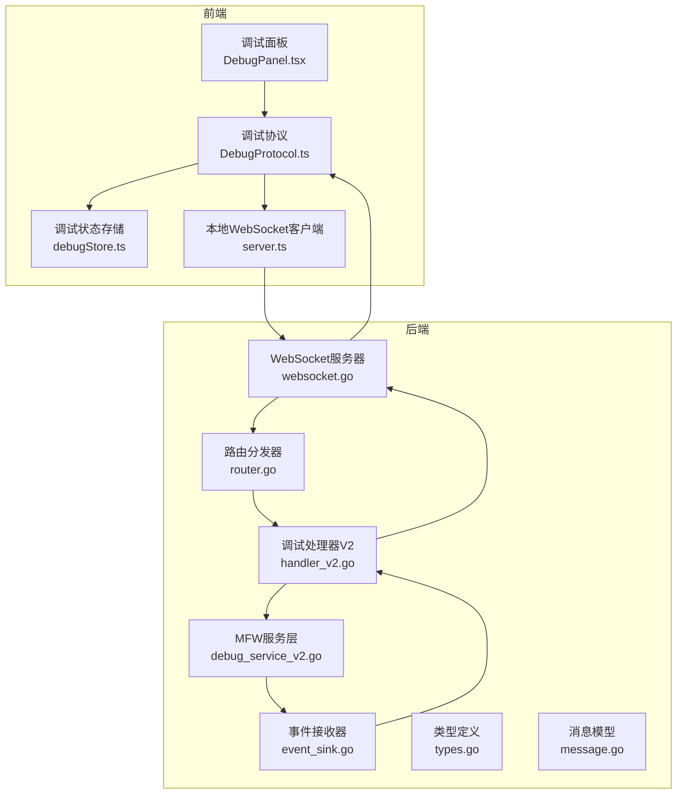
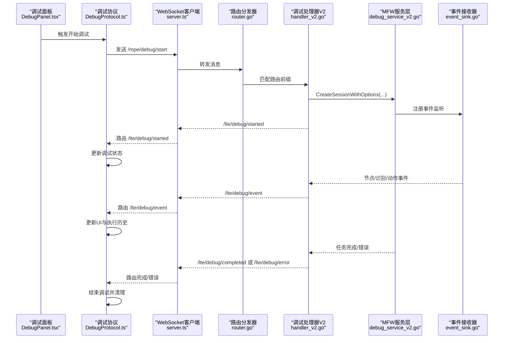
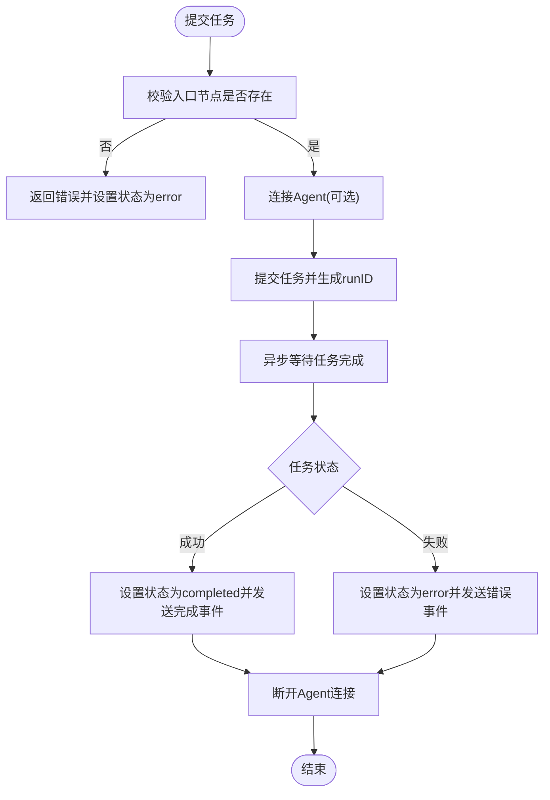
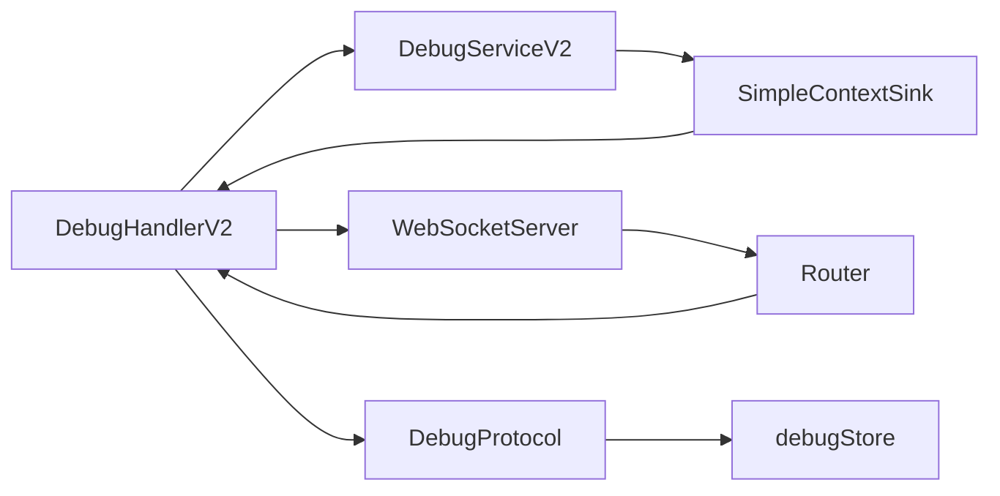

# 调试协议处理器

<cite>
**本文档引用的文件**
- [handler_v2.go](file://LocalBridge/internal/protocol/debug/handler_v2.go)
- [debug_service_v2.go](file://LocalBridge/internal/mfw/debug_service_v2.go)
- [event_sink.go](file://LocalBridge/internal/mfw/event_sink.go)
- [types.go](file://LocalBridge/internal/mfw/types.go)
- [websocket.go](file://LocalBridge/internal/server/websocket.go)
- [router.go](file://LocalBridge/internal/router/router.go)
- [message.go](file://LocalBridge/pkg/models/message.go)
- [DebugProtocol.ts](file://src/services/protocols/DebugProtocol.ts)
- [debugStore.ts](file://src/stores/debugStore.ts)
- [server.ts](file://src/services/server.ts)
- [DebugPanel.tsx](file://src/components/panels/tools/DebugPanel.tsx)
</cite>

## 目录
1. [简介](#简介)
2. [项目结构](#项目结构)
3. [核心组件](#核心组件)
4. [架构总览](#架构总览)
5. [详细组件分析](#详细组件分析)
6. [依赖关系分析](#依赖关系分析)
7. [性能考虑](#性能考虑)
8. [故障排除指南](#故障排除指南)
9. [结论](#结论)
10. [附录](#附录)

## 简介
本文件深入解析调试协议处理器(DebugHandlerV2)的实现与调试功能，涵盖调试会话管理、执行状态跟踪、日志收集、消息格式与状态同步机制、与MFW调试服务的集成以及实时监控机制。同时提供调试流程使用指南与性能分析方法，帮助开发者与使用者高效定位问题、优化流程。

## 项目结构
调试系统由前端协议层、后端处理器层、MFW服务层与事件分发层组成，采用WebSocket进行双向通信，并通过统一路由分发器将消息分发至对应处理器。



**图表来源**
- [DebugPanel.tsx:1-493](file://src/components/panels/tools/DebugPanel.tsx#L1-493)
- [DebugProtocol.ts:1-800](file://src/services/protocols/DebugProtocol.ts#L1-800)
- [debugStore.ts:1-897](file://src/stores/debugStore.ts#L1-897)
- [server.ts:1-373](file://src/services/server.ts#L1-373)
- [router.go:1-151](file://LocalBridge/internal/router/router.go#L1-151)
- [websocket.go:1-179](file://LocalBridge/internal/server/websocket.go#L1-179)
- [handler_v2.go:1-520](file://LocalBridge/internal/protocol/debug/handler_v2.go#L1-520)
- [debug_service_v2.go:1-472](file://LocalBridge/internal/mfw/debug_service_v2.go#L1-472)
- [event_sink.go:1-520](file://LocalBridge/internal/mfw/event_sink.go#L1-520)
- [types.go:1-124](file://LocalBridge/internal/mfw/types.go#L1-124)
- [message.go:1-126](file://LocalBridge/pkg/models/message.go#L1-126)

**章节来源**
- [DebugPanel.tsx:1-493](file://src/components/panels/tools/DebugPanel.tsx#L1-493)
- [DebugProtocol.ts:1-800](file://src/services/protocols/DebugProtocol.ts#L1-800)
- [debugStore.ts:1-897](file://src/stores/debugStore.ts#L1-897)
- [server.ts:1-373](file://src/services/server.ts#L1-373)
- [router.go:1-151](file://LocalBridge/internal/router/router.go#L1-151)
- [websocket.go:1-179](file://LocalBridge/internal/server/websocket.go#L1-179)
- [handler_v2.go:1-520](file://LocalBridge/internal/protocol/debug/handler_v2.go#L1-520)
- [debug_service_v2.go:1-472](file://LocalBridge/internal/mfw/debug_service_v2.go#L1-472)
- [event_sink.go:1-520](file://LocalBridge/internal/mfw/event_sink.go#L1-520)
- [types.go:1-124](file://LocalBridge/internal/mfw/types.go#L1-124)
- [message.go:1-126](file://LocalBridge/pkg/models/message.go#L1-126)

## 核心组件
- 调试协议处理器V2(DebugHandlerV2)：负责路由分发、会话管理、调试控制、数据查询与错误响应。
- 调试服务V2(DebugServiceV2)：封装会话生命周期、任务提交与状态跟踪、事件转发与资源管理。
- 事件接收器(SimpleContextSink)：从MFW框架捕获节点/识别/动作事件，计算耗时并转发给处理器。
- 前端调试协议(DebugProtocol)：注册WebSocket路由、处理事件与错误、驱动UI状态更新。
- 调试状态存储(debugStore)：维护执行历史、识别记录、节点状态与内存限制策略。
- WebSocket与路由：统一消息格式与握手协议，支持版本校验与广播。

**章节来源**
- [handler_v2.go:16-28](file://LocalBridge/internal/protocol/debug/handler_v2.go#L16-28)
- [debug_service_v2.go:60-73](file://LocalBridge/internal/mfw/debug_service_v2.go#L60-73)
- [event_sink.go:61-81](file://LocalBridge/internal/mfw/event_sink.go#L61-81)
- [DebugProtocol.ts:16-75](file://src/services/protocols/DebugProtocol.ts#L16-75)
- [debugStore.ts:143-221](file://src/stores/debugStore.ts#L143-221)
- [websocket.go:36-58](file://LocalBridge/internal/server/websocket.go#L36-58)
- [router.go:29-47](file://LocalBridge/internal/router/router.go#L29-47)

## 架构总览
调试协议采用“前端-后端-框架”的三层架构：
- 前端通过WebSocket向后端发送调试指令，后端根据路由分发到对应处理器。
- 处理器调用MFW服务创建/销毁会话、提交任务、查询节点数据与截图。
- MFW事件通过事件接收器上报，处理器将事件封装为消息回传前端。
- 前端store聚合事件，驱动UI高亮、断点、识别记录与日志面板。



**图表来源**
- [DebugPanel.tsx:288-332](file://src/components/panels/tools/DebugPanel.tsx#L288-332)
- [DebugProtocol.ts:574-666](file://src/services/protocols/DebugProtocol.ts#L574-666)
- [server.ts:285-300](file://src/services/server.ts#L285-300)
- [router.go:49-76](file://LocalBridge/internal/router/router.go#L49-76)
- [handler_v2.go:35-79](file://LocalBridge/internal/protocol/debug/handler_v2.go#L35-79)
- [debug_service_v2.go:97-171](file://LocalBridge/internal/mfw/debug_service_v2.go#L97-171)
- [event_sink.go:108-167](file://LocalBridge/internal/mfw/event_sink.go#L108-167)

**章节来源**
- [DebugPanel.tsx:288-332](file://src/components/panels/tools/DebugPanel.tsx#L288-332)
- [DebugProtocol.ts:574-666](file://src/services/protocols/DebugProtocol.ts#L574-666)
- [server.ts:285-300](file://src/services/server.ts#L285-300)
- [router.go:49-76](file://LocalBridge/internal/router/router.go#L49-76)
- [handler_v2.go:35-79](file://LocalBridge/internal/protocol/debug/handler_v2.go#L35-79)
- [debug_service_v2.go:97-171](file://LocalBridge/internal/mfw/debug_service_v2.go#L97-171)
- [event_sink.go:108-167](file://LocalBridge/internal/mfw/event_sink.go#L108-167)

## 详细组件分析

### 调试协议处理器V2(DebugHandlerV2)
- 路由前缀：/mpe/debug/
- 支持路由：
  - 会话管理：create_session、destroy_session、list_sessions、get_session
  - 调试控制：start、run、stop
  - 数据查询：get_node_data、screencap
- 核心职责：
  - 参数校验与错误响应
  - 事件回调封装与会话ID注入
  - 与MFW服务交互并回传结果

```mermaid
classDiagram
class DebugHandlerV2 {
-service : Service
-debugService : DebugServiceV2
+GetRoutePrefix() []string
+Handle(msg, conn) *Message
-handleCreateSession(conn, msg)
-handleDestroySession(conn, msg)
-handleListSessions(conn, msg)
-handleGetSession(conn, msg)
-handleStart(conn, msg)
-handleRun(conn, msg)
-handleStop(conn, msg)
-handleGetNodeData(conn, msg)
-handleScreencap(conn, msg)
-sendResponse(conn, path, data)
-sendError(conn, errorMsg)
-parseStringArray(raw) []string
-createEventCallbackWithSessionID(conn, sessionIDHolder) DebugEventCallback
}
class DebugServiceV2 {
-service : Service
-sessions : map[string]DebugSessionV2
+CreateSessionWithOptions(opts) (*DebugSessionV2, error)
+GetSession(sessionID) *DebugSessionV2
+DestroySession(sessionID) error
+ListSessions() []*DebugSessionV2
}
class DebugSessionV2 {
+SessionID : string
+Status : DebugSessionStatus
+RunTask(entryNode, override) error
+Stop() error
+GetAdapter() *MaaFWAdapter
+GetNodeJSON(nodeName) (map[string]interface{}, bool)
-handleEvent(event)
-waitForTask(runID)
}
DebugHandlerV2 --> DebugServiceV2 : "创建/管理会话"
DebugServiceV2 --> DebugSessionV2 : "管理多个会话"
```

**图表来源**
- [handler_v2.go:16-28](file://LocalBridge/internal/protocol/debug/handler_v2.go#L16-28)
- [debug_service_v2.go:60-73](file://LocalBridge/internal/mfw/debug_service_v2.go#L60-73)
- [debug_service_v2.go:29-58](file://LocalBridge/internal/mfw/debug_service_v2.go#L29-58)

**章节来源**
- [handler_v2.go:30-79](file://LocalBridge/internal/protocol/debug/handler_v2.go#L30-79)
- [handler_v2.go:85-137](file://LocalBridge/internal/protocol/debug/handler_v2.go#L85-137)
- [handler_v2.go:139-186](file://LocalBridge/internal/protocol/debug/handler_v2.go#L139-186)
- [handler_v2.go:227-294](file://LocalBridge/internal/protocol/debug/handler_v2.go#L227-294)
- [handler_v2.go:296-366](file://LocalBridge/internal/protocol/debug/handler_v2.go#L296-366)
- [handler_v2.go:372-445](file://LocalBridge/internal/protocol/debug/handler_v2.go#L372-445)
- [handler_v2.go:451-520](file://LocalBridge/internal/protocol/debug/handler_v2.go#L451-520)

### 调试服务V2(DebugServiceV2)
- 会话管理：创建/销毁/列举/查询
- 任务控制：RunTask(支持override)、Stop
- 状态跟踪：当前节点、上一节点、执行计数、错误与延迟
- 事件转发：通过SimpleContextSink与回调函数



**图表来源**
- [debug_service_v2.go:220-277](file://LocalBridge/internal/mfw/debug_service_v2.go#L220-277)
- [debug_service_v2.go:380-438](file://LocalBridge/internal/mfw/debug_service_v2.go#L380-438)

**章节来源**
- [debug_service_v2.go:79-171](file://LocalBridge/internal/mfw/debug_service_v2.go#L79-171)
- [debug_service_v2.go:220-299](file://LocalBridge/internal/mfw/debug_service_v2.go#L220-299)
- [debug_service_v2.go:380-438](file://LocalBridge/internal/mfw/debug_service_v2.go#L380-438)

### 事件接收器(SimpleContextSink)
- 节点级事件：node_starting/succeeded/failed
- 识别事件：reco_starting/succeeded/failed
- 动作事件：action_starting/succeeded/failed
- 任务级事件：task_starting/succeeded/failed
- 资源级事件：resource_loading/loaded/loadfail
- 能力：计算节点耗时、记录识别次数、携带reco_id与父节点信息

**章节来源**
- [event_sink.go:15-52](file://LocalBridge/internal/mfw/event_sink.go#L15-52)
- [event_sink.go:108-167](file://LocalBridge/internal/mfw/event_sink.go#L108-167)
- [event_sink.go:169-321](file://LocalBridge/internal/mfw/event_sink.go#L169-321)
- [event_sink.go:323-362](file://LocalBridge/internal/mfw/event_sink.go#L323-362)
- [event_sink.go:418-454](file://LocalBridge/internal/mfw/event_sink.go#L418-454)
- [event_sink.go:487-518](file://LocalBridge/internal/mfw/event_sink.go#L487-518)

### 前端调试协议(DebugProtocol)与状态存储(debugStore)
- 路由注册：/lte/debug/event、/lte/debug/error、/lte/debug/completed、/lte/debug/started、/lte/debug/stopped、/lte/debug/running
- 事件处理：节点执行、识别、动作、任务完成/错误
- 状态同步：执行历史、识别记录、当前节点、阶段、耗时
- 内存限制：识别记录与详情缓存上限与清理策略

**章节来源**
- [DebugProtocol.ts:47-75](file://src/services/protocols/DebugProtocol.ts#L47-75)
- [DebugProtocol.ts:136-232](file://src/services/protocols/DebugProtocol.ts#L136-232)
- [DebugProtocol.ts:444-540](file://src/services/protocols/DebugProtocol.ts#L444-540)
- [DebugProtocol.ts:542-572](file://src/services/protocols/DebugProtocol.ts#L542-572)
- [DebugProtocol.ts:574-708](file://src/services/protocols/DebugProtocol.ts#L574-708)
- [debugStore.ts:10-21](file://src/stores/debugStore.ts#L10-21)
- [debugStore.ts:437-795](file://src/stores/debugStore.ts#L437-795)

### WebSocket与路由
- 协议版本：统一握手与版本校验
- 路由分发：精确匹配与前缀匹配
- 错误处理：统一错误消息格式

**章节来源**
- [websocket.go:15-22](file://LocalBridge/internal/server/websocket.go#L15-22)
- [router.go:49-93](file://LocalBridge/internal/router/router.go#L49-93)
- [router.go:95-105](file://LocalBridge/internal/router/router.go#L95-105)
- [router.go:107-133](file://LocalBridge/internal/router/router.go#L107-133)

## 依赖关系分析
- 调试处理器依赖MFW服务层以创建/销毁会话与提交任务。
- MFW服务层通过事件接收器与MaaFW框架交互，向上游转发事件。
- 前端协议依赖WebSocket客户端与后端路由，驱动UI状态。
- 消息模型统一前后端通信格式，保证路径与数据一致性。



**图表来源**
- [handler_v2.go:16-28](file://LocalBridge/internal/protocol/debug/handler_v2.go#L16-28)
- [debug_service_v2.go:60-73](file://LocalBridge/internal/mfw/debug_service_v2.go#L60-73)
- [event_sink.go:61-81](file://LocalBridge/internal/mfw/event_sink.go#L61-81)
- [websocket.go:36-58](file://LocalBridge/internal/server/websocket.go#L36-58)
- [router.go:29-47](file://LocalBridge/internal/router/router.go#L29-47)
- [DebugProtocol.ts:16-75](file://src/services/protocols/DebugProtocol.ts#L16-75)
- [debugStore.ts:143-221](file://src/stores/debugStore.ts#L143-221)

**章节来源**
- [handler_v2.go:16-28](file://LocalBridge/internal/protocol/debug/handler_v2.go#L16-28)
- [debug_service_v2.go:60-73](file://LocalBridge/internal/mfw/debug_service_v2.go#L60-73)
- [event_sink.go:61-81](file://LocalBridge/internal/mfw/event_sink.go#L61-81)
- [websocket.go:36-58](file://LocalBridge/internal/server/websocket.go#L36-58)
- [router.go:29-47](file://LocalBridge/internal/router/router.go#L29-47)
- [DebugProtocol.ts:16-75](file://src/services/protocols/DebugProtocol.ts#L16-75)
- [debugStore.ts:143-221](file://src/stores/debugStore.ts#L143-221)

## 性能考虑
- 事件噪声控制：SimpleContextSink仅转发关键事件，降低前端渲染压力。
- 内存限制策略：识别记录与详情缓存设置上限与清理比例，避免内存膨胀。
- 异步任务等待：任务完成后断开Agent连接，释放资源。
- 节点耗时统计：事件接收器与会话层分别计算耗时，便于性能分析与瓶颈定位。

[本节为通用指导，无需特定文件引用]

## 故障排除指南
- 资源加载失败：前端检测到资源相关错误时弹窗提示，建议检查资源路径与文件格式。
- 会话不匹配：前端严格校验session_id，避免跨会话事件污染。
- 连接超时：WebSocket连接超时会提示检查本地服务状态与端口。
- 协议版本不匹配：握手失败时提示前端版本与后端版本差异，需按提示更新。

**章节来源**
- [DebugProtocol.ts:466-540](file://src/services/protocols/DebugProtocol.ts#L466-540)
- [DebugProtocol.ts:591-660](file://src/services/protocols/DebugProtocol.ts#L591-660)
- [server.ts:126-159](file://src/services/server.ts#L126-159)
- [router.go:120-128](file://LocalBridge/internal/router/router.go#L120-128)

## 结论
调试协议处理器通过清晰的路由分发、完善的会话管理与事件回传机制，实现了从资源加载、任务执行到实时监控的全链路调试能力。配合前端store的状态聚合与UI高亮，开发者可以直观地定位问题、优化流程并提升调试效率。

[本节为总结性内容，无需特定文件引用]

## 附录

### 调试流程使用指南
- 配置资源路径与控制器，选择入口节点。
- 点击“开始调试”，后端创建会话并提交任务。
- 实时查看执行历史、识别记录与节点耗时。
- “停止调试”清理会话并重置状态。

**章节来源**
- [DebugPanel.tsx:288-332](file://src/components/panels/tools/DebugPanel.tsx#L288-332)
- [DebugProtocol.ts:574-666](file://src/services/protocols/DebugProtocol.ts#L574-666)
- [debugStore.ts:295-398](file://src/stores/debugStore.ts#L295-398)

### 消息格式与状态同步
- 通用消息结构：path与data字段。
- 事件格式：包含事件类型、节点信息、时间戳、耗时与详情。
- 状态同步：前端store根据事件类型更新执行历史与识别记录。

**章节来源**
- [message.go:3-7](file://LocalBridge/pkg/models/message.go#L3-7)
- [event_sink.go:41-52](file://LocalBridge/internal/mfw/event_sink.go#L41-52)
- [DebugProtocol.ts:136-232](file://src/services/protocols/DebugProtocol.ts#L136-232)
- [debugStore.ts:437-795](file://src/stores/debugStore.ts#L437-795)