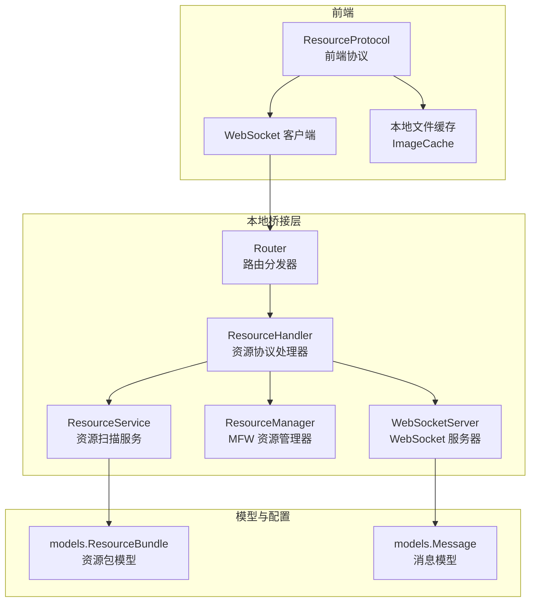
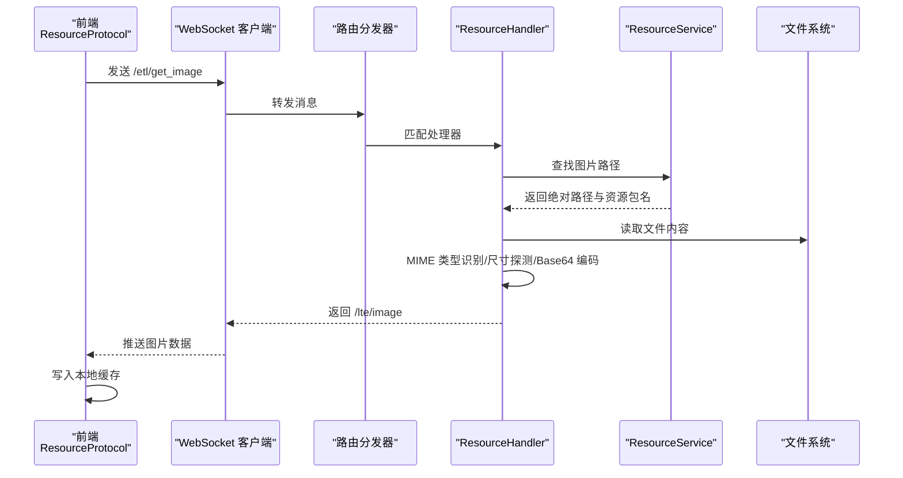
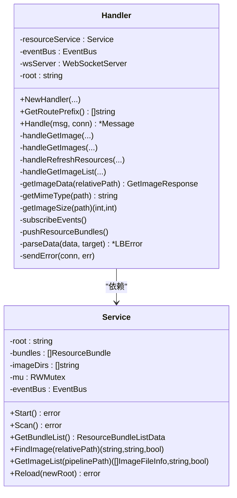
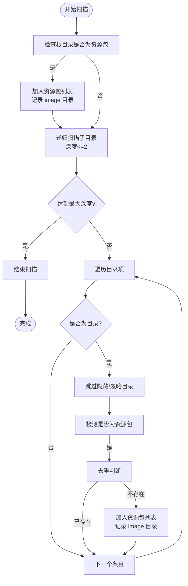
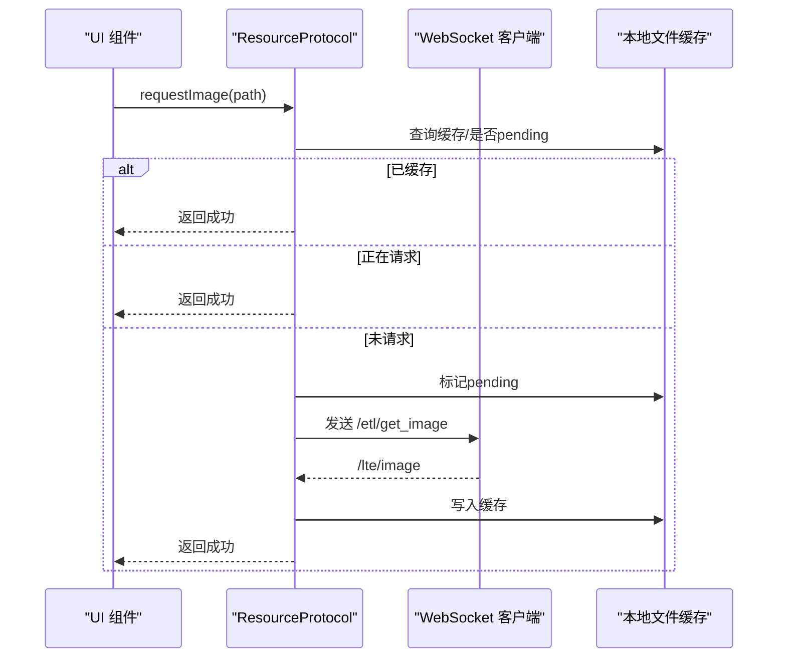
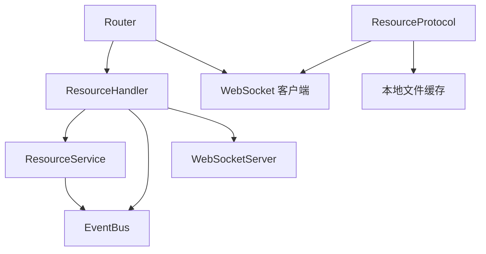

# 资源协议处理器

<cite>
**本文引用的文件**
- [LocalBridge 内部资源协议处理器](file://LocalBridge/internal/protocol/resource/handler.go)
- [LocalBridge 资源服务](file://LocalBridge/internal/service/resource/resource_service.go)
- [前端资源协议](file://src/services/protocols/ResourceProtocol.ts)
- [MFW 资源管理器](file://LocalBridge/internal/mfw/resource_manager.go)
- [路由分发器](file://LocalBridge/internal/router/router.go)
- [WebSocket 服务器](file://LocalBridge/internal/server/websocket.go)
- [资源模型定义](file://LocalBridge/pkg/models/resource.go)
- [协议基类](file://src/services/protocols/BaseProtocol.ts)
- [本地服务初始化](file://src/services/server.ts)
</cite>

## 目录
1. [简介](#简介)
2. [项目结构](#项目结构)
3. [核心组件](#核心组件)
4. [架构总览](#架构总览)
5. [详细组件分析](#详细组件分析)
6. [依赖关系分析](#依赖关系分析)
7. [性能考虑](#性能考虑)
8. [故障排除指南](#故障排除指南)
9. [结论](#结论)
10. [附录](#附录)

## 简介
本文深入解析资源协议处理器（ResourceHandler）的设计与实现，涵盖资源文件管理、缓存机制、访问控制、路径解析、文件类型识别与版本管理等关键能力。同时阐述资源服务的性能优化策略与错误处理机制，并提供配置示例与最佳实践，帮助开发者高效集成与维护资源协议。

## 项目结构
资源协议相关代码分布在本地桥接层（Go）与前端（TypeScript）两部分：
- 本地桥接层负责资源扫描、路径解析、文件读取与推送
- 前端负责缓存管理、请求去重、UI 展示与交互
- 路由分发器协调消息路由与版本握手
- WebSocket 服务器承载协议通信

图表来源
- [LocalBridge 内部资源协议处理器:1-272](file://LocalBridge/internal/protocol/resource/handler.go#L1-L272)
- [LocalBridge 资源服务:1-359](file://LocalBridge/internal/service/resource/resource_service.go#L1-L359)
- [前端资源协议:1-271](file://src/services/protocols/ResourceProtocol.ts#L1-L271)
- [路由分发器:1-151](file://LocalBridge/internal/router/router.go#L1-L151)
- [WebSocket 服务器:1-58](file://LocalBridge/internal/server/websocket.go#L1-L58)
- [资源模型定义:1-67](file://LocalBridge/pkg/models/resource.go#L1-L67)

章节来源
- [LocalBridge 内部资源协议处理器:1-272](file://LocalBridge/internal/protocol/resource/handler.go#L1-L272)
- [LocalBridge 资源服务:1-359](file://LocalBridge/internal/service/resource/resource_service.go#L1-L359)
- [前端资源协议:1-271](file://src/services/protocols/ResourceProtocol.ts#L1-L271)
- [路由分发器:1-151](file://LocalBridge/internal/router/router.go#L1-L151)
- [WebSocket 服务器:1-58](file://LocalBridge/internal/server/websocket.go#L1-L58)
- [资源模型定义:1-67](file://LocalBridge/pkg/models/resource.go#L1-L67)

## 核心组件
- 资源协议处理器（ResourceHandler）
  - 负责处理 /etl/* 前缀的请求，包括获取单张/批量图片、刷新资源列表、获取图片列表
  - 负责订阅连接建立与资源扫描完成事件，向前端推送资源包列表
  - 提供 MIME 类型识别与图片尺寸探测，支持 Base64 编码传输
- 资源扫描服务（ResourceService）
  - 扫描根目录及其子目录，识别符合 MaaFramework 规范的资源包
  - 维护资源包列表与 image 目录集合，提供图片查找与列表扫描能力
  - 支持重载与并发安全（读写锁）
- 前端资源协议（ResourceProtocol）
  - 注册 /lte/* 接收路由，处理资源包列表、图片与图片列表推送
  - 实现请求去重、缓存写入与状态管理
- 路由分发器（Router）
  - 统一路由注册与分发，支持精确与前缀匹配
  - 处理版本握手与错误消息回传
- WebSocket 服务器（WebSocketServer）
  - 提供连接管理、广播与消息发送能力
- 模型定义（models）
  - 定义资源包、图片信息、请求/响应结构体

章节来源
- [LocalBridge 内部资源协议处理器:22-53](file://LocalBridge/internal/protocol/resource/handler.go#L22-L53)
- [LocalBridge 资源服务:14-31](file://LocalBridge/internal/service/resource/resource_service.go#L14-L31)
- [前端资源协议:13-36](file://src/services/protocols/ResourceProtocol.ts#L13-L36)
- [路由分发器:19-38](file://LocalBridge/internal/router/router.go#L19-L38)
- [WebSocket 服务器:35-58](file://LocalBridge/internal/server/websocket.go#L35-L58)
- [资源模型定义:3-67](file://LocalBridge/pkg/models/resource.go#L3-L67)

## 架构总览
资源协议的端到端流程如下：
- 前端通过 ResourceProtocol 发起请求（如 /etl/get_image）
- 路由分发器根据路径匹配到 ResourceHandler
- ResourceHandler 调用 ResourceService 执行资源扫描与查找
- ResourceHandler 读取文件、识别类型与尺寸，进行 Base64 编码
- 通过 WebSocket 广播资源包列表或返回 /lte/* 响应
- 前端将响应写入本地缓存并更新 UI

图表来源
- [前端资源协议:149-173](file://src/services/protocols/ResourceProtocol.ts#L149-L173)
- [路由分发器:49-76](file://LocalBridge/internal/router/router.go#L49-L76)
- [LocalBridge 内部资源协议处理器:56-84](file://LocalBridge/internal/protocol/resource/handler.go#L56-L84)
- [LocalBridge 资源服务:175-193](file://LocalBridge/internal/service/resource/resource_service.go#L175-L193)

## 详细组件分析

### 资源协议处理器（ResourceHandler）
职责与实现要点：
- 路由前缀与消息分发
  - 支持 /etl/get_image、/etl/get_images、/etl/get_image_list、/etl/refresh_resources
  - switch-case 根据 Path 调用对应处理函数
- 单图与批量图处理
  - 单图：解析请求参数，调用 getImageData，封装为 /lte/image 响应
  - 批图：遍历相对路径列表，逐个调用 getImageData，封装为 /lte/images 响应
- 资源刷新与推送
  - 调用 ResourceService.Scan 执行扫描
  - 推送 /lte/resource_bundles 资源包列表
- 资源列表查询
  - 根据 pipeline_path 返回图片列表，支持“过滤模式”标记
- 图片数据组装
  - 文件查找失败：返回失败响应
  - 读取失败：返回错误信息
  - 成功：计算 MIME 类型、尺寸，Base64 编码，返回完整响应
- 辅助能力
  - MIME 类型识别：基于扩展名映射
  - 图片尺寸探测：利用图像解码配置
  - 事件订阅：连接建立与资源扫描完成自动推送资源包列表
  - JSON 解析与错误发送：统一错误包装与日志输出

图表来源
- [LocalBridge 内部资源协议处理器:22-28](file://LocalBridge/internal/protocol/resource/handler.go#L22-L28)
- [LocalBridge 资源服务:14-21](file://LocalBridge/internal/service/resource/resource_service.go#L14-L21)

章节来源
- [LocalBridge 内部资源协议处理器:46-137](file://LocalBridge/internal/protocol/resource/handler.go#L46-L137)
- [LocalBridge 内部资源协议处理器:139-217](file://LocalBridge/internal/protocol/resource/handler.go#L139-L217)
- [LocalBridge 内部资源协议处理器:219-245](file://LocalBridge/internal/protocol/resource/handler.go#L219-L245)
- [LocalBridge 内部资源协议处理器:247-271](file://LocalBridge/internal/protocol/resource/handler.go#L247-L271)

### 资源扫描服务（ResourceService）
职责与实现要点：
- 启动与扫描
  - Start 调用 Scan 并发布扫描完成事件
  - Scan 清空旧数据，检查根目录与递归扫描子目录（最大深度 2）
- 资源包识别
  - 检测 pipeline、image、model、default_pipeline.json 等标志
  - 记录资源包绝对路径、相对路径、名称与 image 目录
- 查找与列表
  - FindImage 按顺序在各资源包的 image 目录中查找
  - GetImageList 支持根据 pipeline_path 定位资源包，返回“过滤模式”标记
  - scanImageDir 使用 Walk 遍历，支持多种图片扩展名
- 并发与重载
  - 读写锁保护共享状态
  - Reload 支持动态更新根目录并重新扫描

图表来源
- [LocalBridge 资源服务:48-119](file://LocalBridge/internal/service/resource/resource_service.go#L48-L119)
- [LocalBridge 资源服务:121-153](file://LocalBridge/internal/service/resource/resource_service.go#L121-L153)
- [LocalBridge 资源服务:297-334](file://LocalBridge/internal/service/resource/resource_service.go#L297-L334)

章节来源
- [LocalBridge 资源服务:33-68](file://LocalBridge/internal/service/resource/resource_service.go#L33-L68)
- [LocalBridge 资源服务:121-153](file://LocalBridge/internal/service/resource/resource_service.go#L121-L153)
- [LocalBridge 资源服务:175-193](file://LocalBridge/internal/service/resource/resource_service.go#L175-L193)
- [LocalBridge 资源服务:240-272](file://LocalBridge/internal/service/resource/resource_service.go#L240-L272)
- [LocalBridge 资源服务:297-334](file://LocalBridge/internal/service/resource/resource_service.go#L297-L334)
- [LocalBridge 资源服务:336-358](file://LocalBridge/internal/service/resource/resource_service.go#L336-L358)

### 前端资源协议（ResourceProtocol）
职责与实现要点：
- 路由注册
  - 注册 /lte/resource_bundles、/lte/image、/lte/images、/lte/image_list 接收路由
- 数据处理
  - handleResourceBundles：更新本地资源包与 image 目录
  - handleImage：成功则写入缓存，失败则清除 pending 状态
  - handleImages：批量转发至 handleImage
  - handleImageList：更新图片列表与过滤状态
- 请求发起
  - requestImage/requestImages：请求去重（已缓存/正在请求），标记 pending 并发送 /etl/* 请求
  - requestRefreshResources：刷新资源列表
  - requestImageList：请求图片列表并标记 loading
- 缓存策略
  - 使用本地文件缓存存储图片 Base64、MIME、尺寸、来源与时间戳
  - 支持按相对路径索引与失效控制

图表来源
- [前端资源协议:149-173](file://src/services/protocols/ResourceProtocol.ts#L149-L173)
- [前端资源协议:76-121](file://src/services/protocols/ResourceProtocol.ts#L76-L121)

章节来源
- [前端资源协议:22-36](file://src/services/protocols/ResourceProtocol.ts#L22-L36)
- [前端资源协议:46-70](file://src/services/protocols/ResourceProtocol.ts#L46-L70)
- [前端资源协议:149-207](file://src/services/protocols/ResourceProtocol.ts#L149-L207)
- [前端资源协议:227-240](file://src/services/protocols/ResourceProtocol.ts#L227-L240)

### 路由分发器与 WebSocket 服务器
- 路由分发器
  - Handler 接口定义 GetRoutePrefix 与 Handle
  - Router.RegisterHandler 注册处理器，支持精确与前缀匹配
  - 统一错误处理与版本握手（/system/handshake）
- WebSocket 服务器
  - 提供连接管理、广播与消息发送
  - 与 Router 协同完成消息路由与响应

章节来源
- [路由分发器:19-93](file://LocalBridge/internal/router/router.go#L19-L93)
- [路由分发器:107-150](file://LocalBridge/internal/router/router.go#L107-L150)
- [WebSocket 服务器:35-58](file://LocalBridge/internal/server/websocket.go#L35-L58)

### 模型与数据结构
- 资源包模型
  - ResourceBundle：资源包元信息（路径、名称、标志位、image 目录）
  - ResourceBundleListData：推送至前端的资源包列表与 image 目录集合
- 图片相关模型
  - GetImageRequest/Response：单图请求/响应
  - GetImagesRequest/Response：批量请求/响应
  - ImageFileInfo：图片文件信息（相对路径、来源资源包）
  - GetImageListRequest/Response：图片列表请求/响应（含过滤标记）

章节来源
- [资源模型定义:3-67](file://LocalBridge/pkg/models/resource.go#L3-L67)

## 依赖关系分析
- 组件耦合
  - ResourceHandler 依赖 ResourceService、EventBus、WebSocketServer
  - ResourceService 依赖 EventBus、文件系统
  - ResourceProtocol 依赖 WebSocket 客户端与本地缓存
- 路由与协议
  - Router 统一分发 /etl/* 请求至 ResourceHandler
  - 协议版本在握手阶段校验，确保前后端兼容
- 循环依赖
  - 未见直接循环依赖；事件通过 EventBus 松耦合传递

图表来源
- [LocalBridge 内部资源协议处理器:14-27](file://LocalBridge/internal/protocol/resource/handler.go#L14-L27)
- [LocalBridge 资源服务:9-21](file://LocalBridge/internal/service/resource/resource_service.go#L9-L21)
- [前端资源协议:1-8](file://src/services/protocols/ResourceProtocol.ts#L1-L8)
- [路由分发器:1-11](file://LocalBridge/internal/router/router.go#L1-L11)

章节来源
- [LocalBridge 内部资源协议处理器:14-27](file://LocalBridge/internal/protocol/resource/handler.go#L14-L27)
- [LocalBridge 资源服务:9-21](file://LocalBridge/internal/service/resource/resource_service.go#L9-L21)
- [前端资源协议:1-8](file://src/services/protocols/ResourceProtocol.ts#L1-L8)
- [路由分发器:1-11](file://LocalBridge/internal/router/router.go#L1-L11)

## 性能考虑
- 资源扫描
  - 限制递归深度（最大 2 层），避免深层目录带来的 IO 压力
  - 跳过常见非资源目录（如 .git、node_modules 等），减少无效扫描
  - 使用读写锁保护共享状态，提高并发安全性
- 图片读取与编码
  - 采用 Base64 编码传输，便于前端直接渲染；注意内存占用与带宽消耗
  - 对于大图建议前端侧进行尺寸压缩或懒加载
- 请求去重
  - 前端对已缓存与正在请求的路径进行去重，降低重复网络开销
- 广播推送
  - 通过 WebSocket 广播资源包列表，避免轮询，提升实时性
- I/O 优化
  - 图片尺寸探测与 MIME 类型识别均基于文件系统访问，建议结合本地缓存与预热策略

[本节为通用性能建议，无需特定文件引用]

## 故障排除指南
- 常见问题与定位
  - 资源包未被识别：确认目录包含 pipeline、image、model 或 default_pipeline.json 标志
  - 图片未找到：检查相对路径是否正确，确认资源包内 image 目录结构
  - MIME 类型异常：检查扩展名是否受支持（png/jpg/jpeg/gif/webp/bmp）
  - 握手失败：确认前端协议版本与后端一致
- 错误处理机制
  - 路由层：未知路由返回 /error，统一错误包装
  - 处理器层：JSON 解析失败、文件读取失败、尺寸探测失败均有明确错误信息
  - 前端层：失败时清除 pending 状态，避免阻塞后续请求
- 日志与监控
  - 详细日志记录扫描结果、推送数量与错误原因，便于排查

章节来源
- [路由分发器:95-105](file://LocalBridge/internal/router/router.go#L95-L105)
- [LocalBridge 内部资源协议处理器:74-77](file://LocalBridge/internal/protocol/resource/handler.go#L74-L77)
- [LocalBridge 内部资源协议处理器:152-161](file://LocalBridge/internal/protocol/resource/handler.go#L152-L161)
- [前端资源协议:109-117](file://src/services/protocols/ResourceProtocol.ts#L109-L117)

## 结论
资源协议处理器通过清晰的职责划分与完善的错误处理机制，实现了对资源包的自动识别、图片的快速检索与传输、以及前端缓存与去重策略的协同。配合路由分发与 WebSocket 服务器，整体具备良好的扩展性与运行稳定性。建议在实际部署中结合业务场景优化扫描深度、缓存策略与网络传输，以获得更佳的用户体验。

[本节为总结性内容，无需特定文件引用]

## 附录

### 资源路径解析与文件类型识别
- 路径解析
  - 相对路径基于资源包内的 image 目录进行拼接与查找
  - 支持跨资源包查找，按注册顺序返回首个匹配项
- 文件类型识别
  - 基于扩展名映射常见图片类型
  - 未识别时返回二进制流类型，交由前端自行处理

章节来源
- [LocalBridge 资源服务:175-193](file://LocalBridge/internal/service/resource/resource_service.go#L175-L193)
- [LocalBridge 内部资源协议处理器:184-201](file://LocalBridge/internal/protocol/resource/handler.go#L184-L201)

### 资源版本管理机制
- 协议版本
  - 通过握手阶段校验前端与后端协议版本一致性
  - 不一致时返回明确提示，指导用户按后端版本更新
- 资源包版本
  - 通过资源包哈希（MFW 资源管理器）标识资源包唯一性
  - 建议在资源包命名或构建流程中引入语义化版本，便于追踪与回滚

章节来源
- [路由分发器:107-133](file://LocalBridge/internal/router/router.go#L107-L133)
- [MFW 资源管理器:85-104](file://LocalBridge/internal/mfw/resource_manager.go#L85-L104)

### 配置示例与最佳实践
- 配置示例
  - 资源根目录：在启动时设置根目录，确保包含多个资源包时可被正确扫描
  - 资源包标志：保证 pipeline、image、model 或 default_pipeline.json 存在，以便被识别
- 最佳实践
  - 将图片统一放置于各资源包的 image 目录，避免跨包引用导致路径复杂化
  - 前端对常用图片进行缓存，减少重复请求
  - 对大图采用懒加载与尺寸压缩策略，优化首屏性能
  - 定期触发刷新资源列表，确保新增资源及时生效

章节来源
- [LocalBridge 资源服务:48-68](file://LocalBridge/internal/service/resource/resource_service.go#L48-L68)
- [前端资源协议:149-173](file://src/services/protocols/ResourceProtocol.ts#L149-L173)