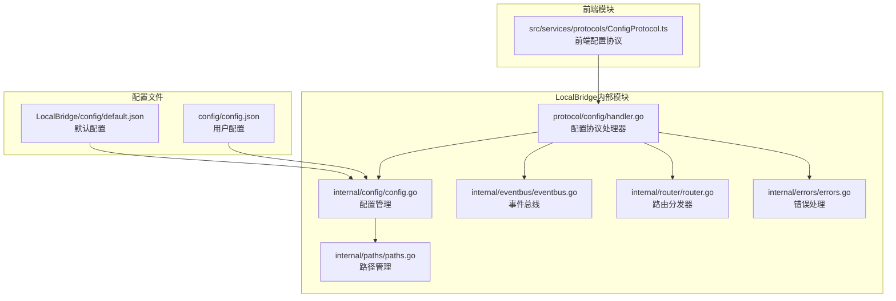
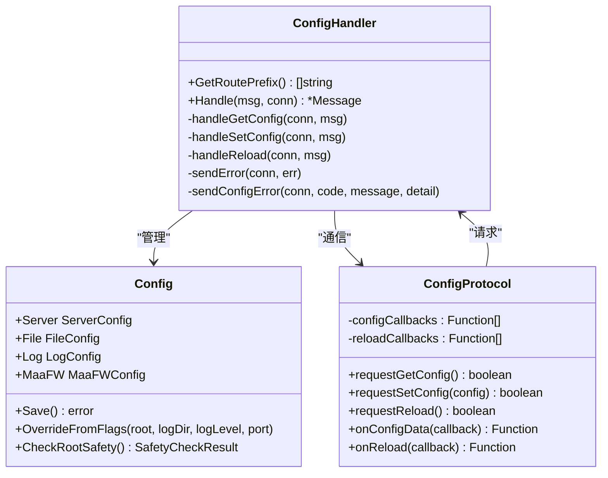
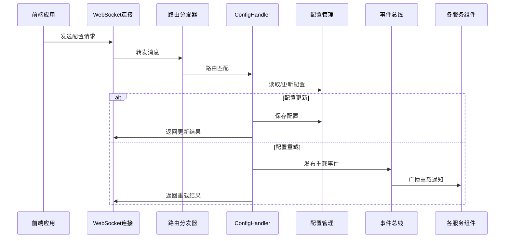
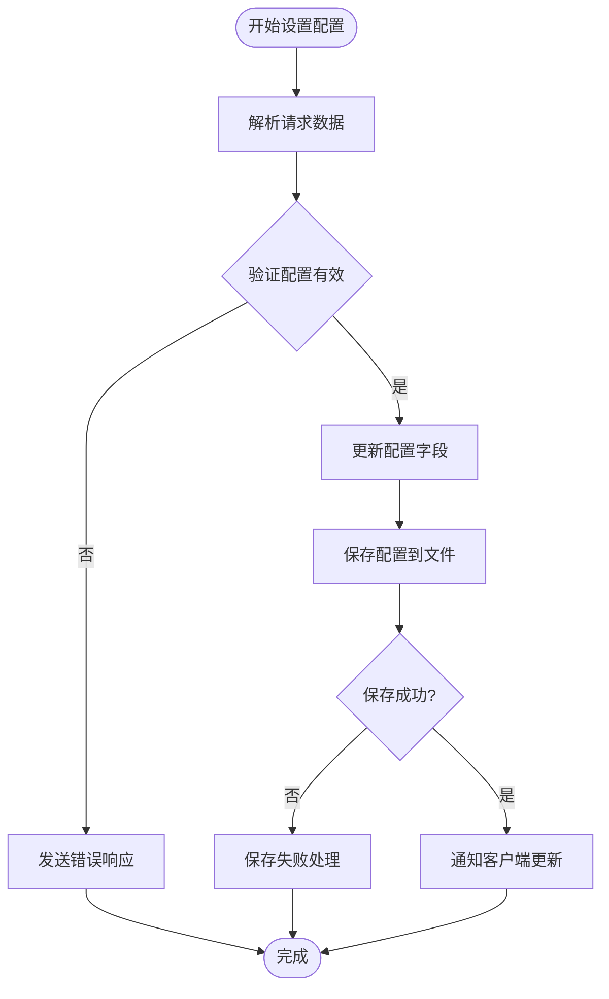
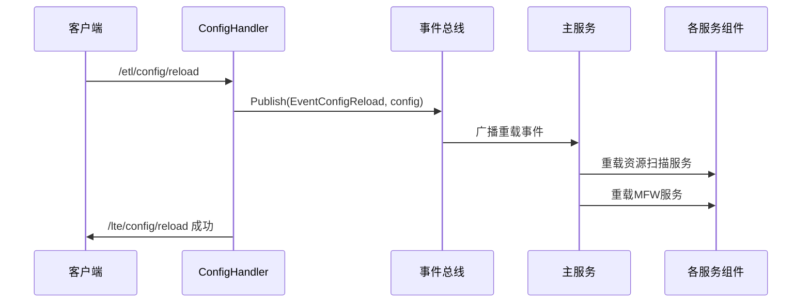
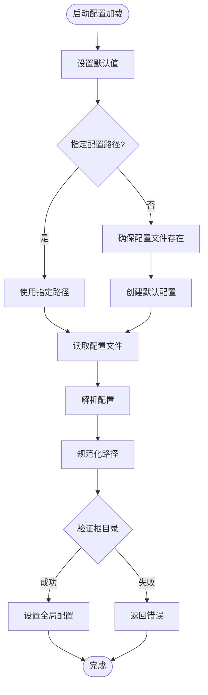
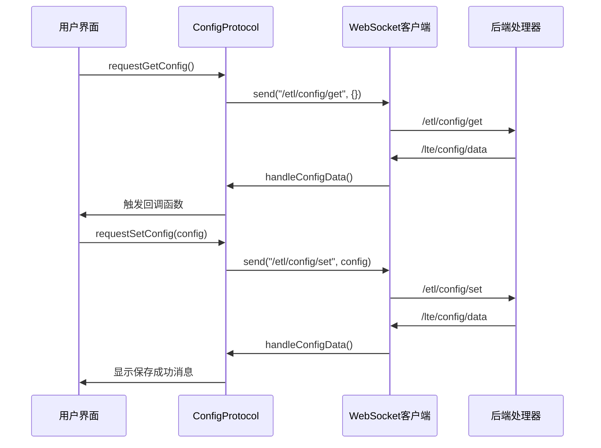
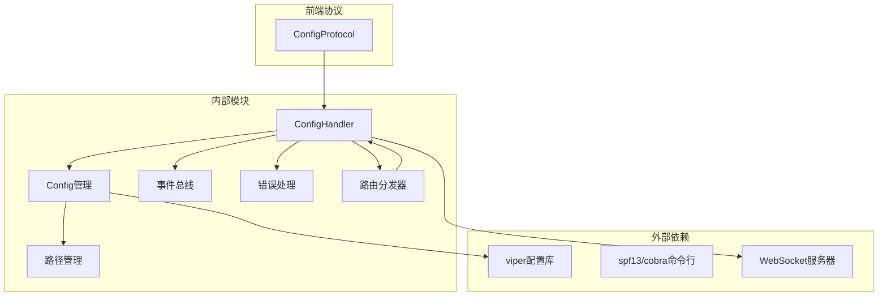

# 配置协议处理器

<cite>
**本文档引用的文件**
- [handler.go](file://LocalBridge/internal/protocol/config/handler.go)
- [config.go](file://LocalBridge/internal/config/config.go)
- [paths.go](file://LocalBridge/internal/paths/paths.go)
- [default.json](file://LocalBridge/config/default.json)
- [ConfigProtocol.ts](file://src/services/protocols/ConfigProtocol.ts)
- [main.go](file://LocalBridge/cmd/lb/main.go)
- [eventbus.go](file://LocalBridge/internal/eventbus/eventbus.go)
- [errors.go](file://LocalBridge/internal/errors/errors.go)
- [router.go](file://LocalBridge/internal/router/router.go)
</cite>

## 目录
1. [简介](#简介)
2. [项目结构](#项目结构)
3. [核心组件](#核心组件)
4. [架构概览](#架构概览)
5. [详细组件分析](#详细组件分析)
6. [依赖关系分析](#依赖关系分析)
7. [性能考虑](#性能考虑)
8. [故障排除指南](#故障排除指南)
9. [结论](#结论)

## 简介

配置协议处理器(ConfigHandler)是MaaPipelineEditor本地桥接服务中的核心组件，负责处理前端与后端之间的配置管理通信。该处理器实现了完整的配置生命周期管理，包括配置的读取、写入、验证、热重载和通知机制。

该处理器采用WebSocket协议与前端进行实时通信，支持配置的动态更新和即时反馈。通过事件总线机制，实现了配置变更的广播通知，确保各个服务能够及时响应配置变化。

## 项目结构

配置协议处理器在项目中的位置和组织结构如下：

**图表来源**
- [handler.go:1-237](file://LocalBridge/internal/protocol/config/handler.go#L1-L237)
- [config.go:1-339](file://LocalBridge/internal/config/config.go#L1-L339)
- [ConfigProtocol.ts:1-197](file://src/services/protocols/ConfigProtocol.ts#L1-L197)

**章节来源**
- [handler.go:1-237](file://LocalBridge/internal/protocol/config/handler.go#L1-L237)
- [config.go:1-339](file://LocalBridge/internal/config/config.go#L1-L339)
- [ConfigProtocol.ts:1-197](file://src/services/protocols/ConfigProtocol.ts#L1-L197)

## 核心组件

### 配置处理器架构

配置处理器采用简洁的架构设计，主要包含以下核心组件：

**图表来源**
- [handler.go:12-47](file://LocalBridge/internal/protocol/config/handler.go#L12-L47)
- [config.go:43-48](file://LocalBridge/internal/config/config.go#L43-L48)
- [ConfigProtocol.ts:46-58](file://src/services/protocols/ConfigProtocol.ts#L46-L58)

### 配置数据结构

系统支持多层配置管理，每层都有明确的职责分工：

| 配置层级 | 数据结构 | 描述 | 默认值 |
|---------|----------|------|--------|
| 服务器配置 | ServerConfig | 网络服务配置 | host: localhost, port: 9066 |
| 文件配置 | FileConfig | 文件扫描配置 | exclude: [node_modules, .git, dist, build], extensions: [.json, .jsonc] |
| 日志配置 | LogConfig | 日志输出配置 | level: INFO, push_to_client: true |
| MaaFramework配置 | MaaFWConfig | OCR识别配置 | enabled: false, lib_dir: "", resource_dir: "" |

**章节来源**
- [config.go:13-48](file://LocalBridge/internal/config/config.go#L13-L48)
- [default.json:1-29](file://LocalBridge/config/default.json#L1-L29)

## 架构概览

配置协议处理器的整体架构采用分层设计，实现了前后端分离和模块化管理：

**图表来源**
- [handler.go:26-47](file://LocalBridge/internal/protocol/config/handler.go#L26-L47)
- [main.go:354-383](file://LocalBridge/cmd/lb/main.go#L354-L383)

**章节来源**
- [handler.go:25-204](file://LocalBridge/internal/protocol/config/handler.go#L25-L204)
- [main.go:385-413](file://LocalBridge/cmd/lb/main.go#L385-L413)

## 详细组件分析

### ConfigHandler组件

ConfigHandler是配置协议的核心处理器，负责处理所有配置相关的WebSocket消息。

#### 路由处理机制

处理器支持三个主要路由：

| 路由 | 方法 | 功能 | 响应消息 |
|------|------|------|----------|
| /etl/config/get | handleGetConfig | 获取当前配置 | /lte/config/data |
| /etl/config/set | handleSetConfig | 设置配置参数 | /lte/config/data |
| /etl/config/reload | handleReload | 触发配置重载 | /lte/config/reload |

#### 配置设置流程

**图表来源**
- [handler.go:70-171](file://LocalBridge/internal/protocol/config/handler.go#L70-L171)

#### 配置重载机制

配置重载通过事件总线实现，确保各服务能够及时响应配置变化：

**图表来源**
- [handler.go:173-204](file://LocalBridge/internal/protocol/config/handler.go#L173-L204)
- [main.go:354-383](file://LocalBridge/cmd/lb/main.go#L354-L383)

**章节来源**
- [handler.go:25-204](file://LocalBridge/internal/protocol/config/handler.go#L25-L204)

### 配置管理组件

配置管理组件提供了完整的配置生命周期管理功能。

#### 配置加载流程

**图表来源**
- [config.go:54-95](file://LocalBridge/internal/config/config.go#L54-L95)

#### 配置验证机制

系统实现了多层次的配置验证：

| 验证类型 | 检查内容 | 风险等级 | 建议措施 |
|----------|----------|----------|----------|
| 路径验证 | 根目录存在性 | 高 | 指定具体项目目录 |
| 系统目录检测 | Windows系统目录 | 高 | 避免扫描系统关键目录 |
| 驱动器根目录 | 根分区扫描 | 高 | 指定子目录而非整个分区 |
| 用户主目录 | 主目录扫描 | 中 | 指定具体项目子目录 |
| 扫描限制 | max_depth/max_files | 低 | 设置合理的扫描限制 |

**章节来源**
- [config.go:125-296](file://LocalBridge/internal/config/config.go#L125-L296)

### 前端通信协议

前端通过ConfigProtocol类与后端进行配置通信，实现了完整的双向数据同步。

#### 消息处理流程

**图表来源**
- [ConfigProtocol.ts:128-161](file://src/services/protocols/ConfigProtocol.ts#L128-L161)

#### 回调机制

前端实现了灵活的回调机制来处理配置变更：

| 回调类型 | 函数名 | 用途 | 返回值 |
|----------|--------|------|--------|
| 配置数据回调 | onConfigData | 处理配置更新 | 注销函数 |
| 重载回调 | onReload | 处理重载响应 | 注销函数 |
| 错误回调 | 内部错误处理 | 处理通信错误 | 无 |

**章节来源**
- [ConfigProtocol.ts:46-196](file://src/services/protocols/ConfigProtocol.ts#L46-L196)

## 依赖关系分析

配置协议处理器的依赖关系体现了清晰的分层架构：

**图表来源**
- [handler.go:3-10](file://LocalBridge/internal/protocol/config/handler.go#L3-L10)
- [config.go:3-11](file://LocalBridge/internal/config/config.go#L3-L11)

### 关键依赖关系

1. **配置解析依赖**: 使用viper库进行配置文件的读取和解析
2. **路径管理依赖**: 通过paths包管理配置文件的存储位置
3. **事件通信依赖**: 通过eventbus实现配置变更的广播通知
4. **错误处理依赖**: 统一的错误码和错误信息格式化

**章节来源**
- [handler.go:3-10](file://LocalBridge/internal/protocol/config/handler.go#L3-L10)
- [config.go:3-11](file://LocalBridge/internal/config/config.go#L3-L11)

## 性能考虑

配置协议处理器在设计时充分考虑了性能优化：

### 内存管理
- 使用单例模式管理全局配置，避免重复加载
- 采用延迟初始化策略，按需创建资源
- 合理的缓存机制减少重复计算

### 网络通信优化
- 异步消息处理，避免阻塞主线程
- 批量配置更新，减少网络往返次数
- 智能重连机制，提高连接稳定性

### 文件系统优化
- 配置文件缓存，减少磁盘I/O操作
- 路径规范化预处理，避免重复计算
- 条件重载机制，只重载必要的服务

## 故障排除指南

### 常见问题及解决方案

#### 配置文件加载失败
**症状**: 启动时出现配置加载错误
**原因**: 配置文件损坏或权限不足
**解决**: 
1. 检查配置文件格式是否正确
2. 确认文件权限设置
3. 重新生成默认配置文件

#### 配置保存失败
**症状**: 修改配置后无法保存
**原因**: 文件写入权限问题或磁盘空间不足
**解决**:
1. 检查目标目录写入权限
2. 确认磁盘空间充足
3. 以管理员权限运行程序

#### 配置重载不生效
**症状**: 修改配置后服务未响应变化
**原因**: 事件总线通信异常或服务未正确订阅
**解决**:
1. 检查事件总线连接状态
2. 验证各服务的订阅情况
3. 重启相关服务组件

#### 路径解析错误
**症状**: 配置中的相对路径无法正确解析
**原因**: 工作目录变化或路径格式问题
**解决**:
1. 使用绝对路径替代相对路径
2. 检查路径分隔符格式
3. 验证路径字符编码

**章节来源**
- [errors.go:9-20](file://LocalBridge/internal/errors/errors.go#L9-L20)
- [handler.go:217-236](file://LocalBridge/internal/protocol/config/handler.go#L217-L236)

## 结论

配置协议处理器(ConfigHandler)作为MaaPipelineEditor本地桥接服务的核心组件，展现了优秀的架构设计和实现质量。通过清晰的分层结构、完善的错误处理机制和高效的事件通信，实现了可靠的配置管理功能。

该处理器的主要优势包括：

1. **模块化设计**: 清晰的职责分离和接口定义
2. **健壮性**: 完善的错误处理和异常恢复机制  
3. **可扩展性**: 灵活的配置结构和插件化设计
4. **用户体验**: 即时的配置反馈和友好的错误提示

未来可以考虑的改进方向：
- 增加配置版本管理和回滚功能
- 实现配置模板和批量导入导出
- 添加配置变更审计日志
- 优化大配置文件的处理性能

通过持续的优化和完善，配置协议处理器将继续为用户提供稳定可靠的配置管理服务。