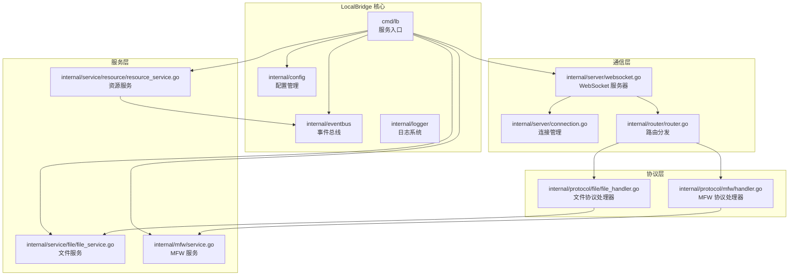
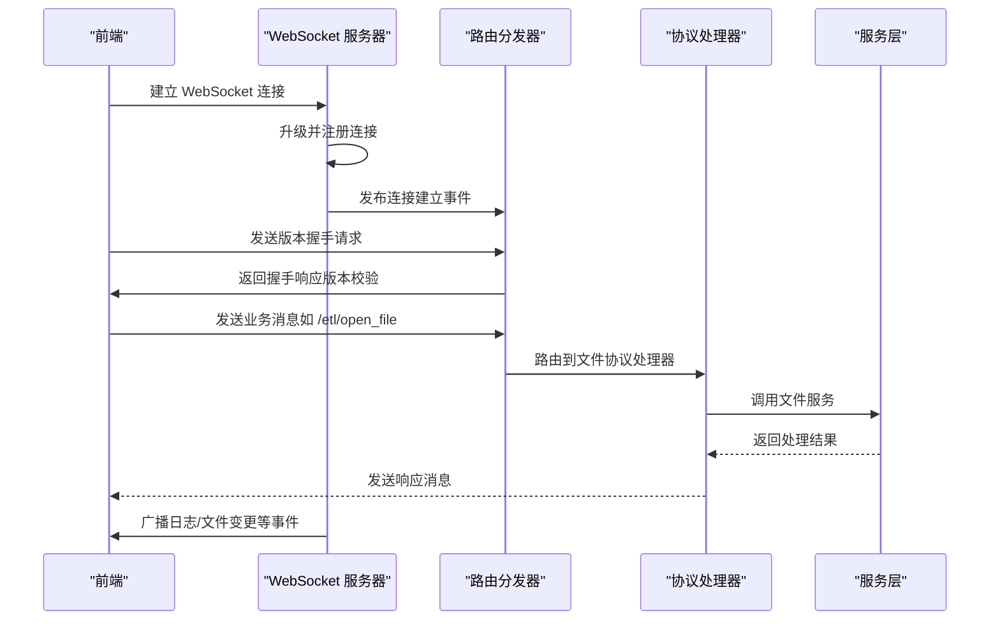
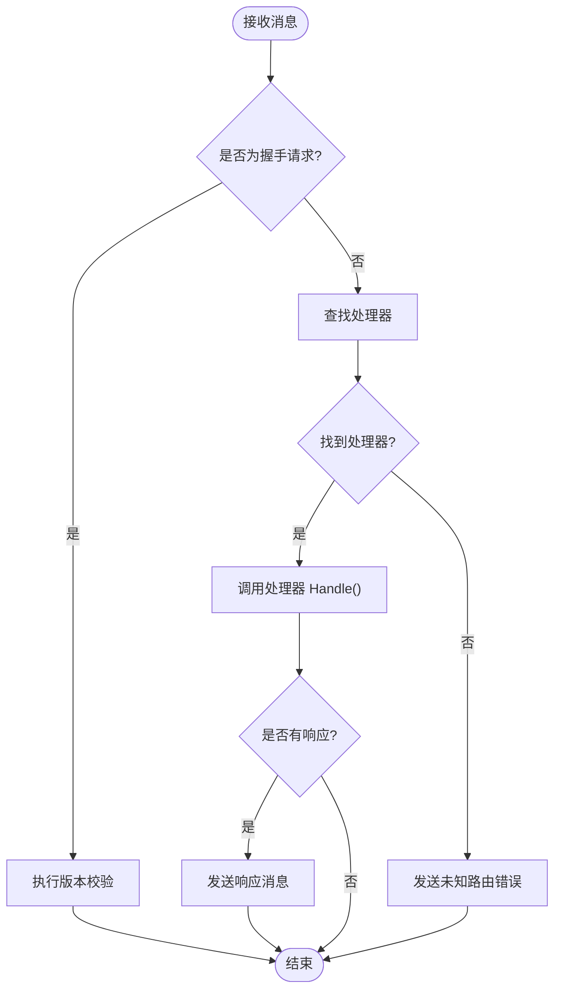
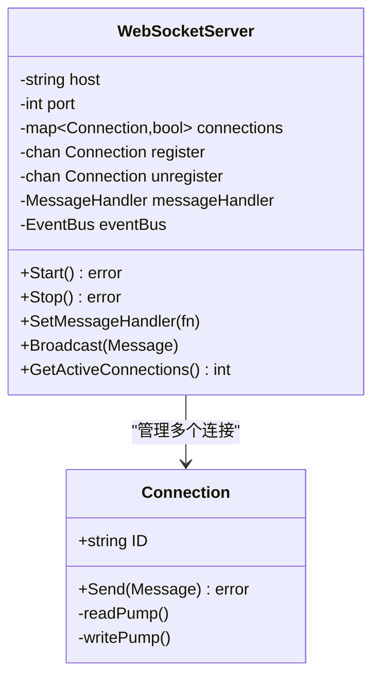
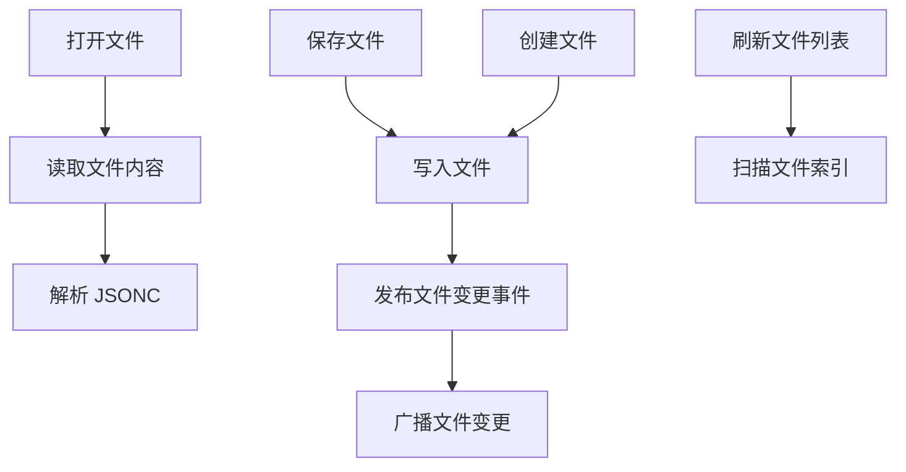
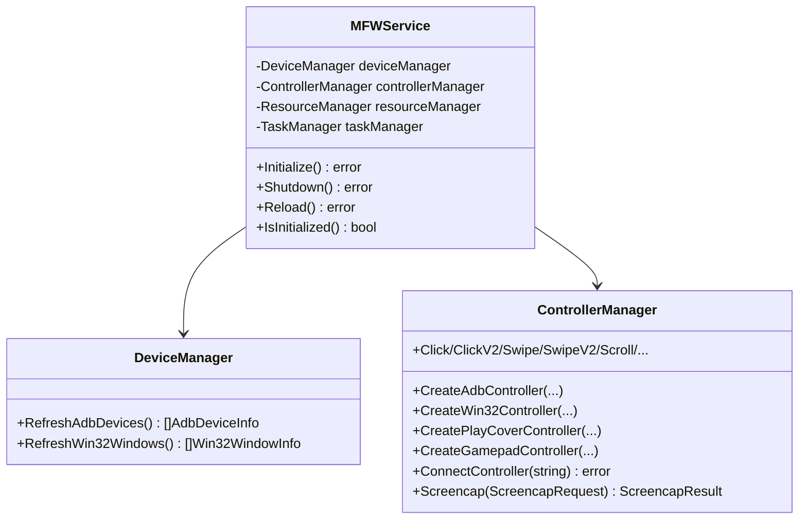
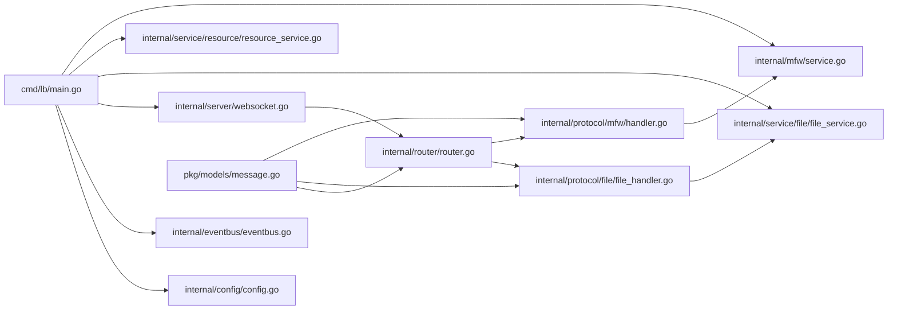

# 后端架构设计

<cite>
**本文档引用的文件**
- [LocalBridge/cmd/lb/main.go](file://LocalBridge/cmd/lb/main.go)
- [LocalBridge/internal/router/router.go](file://LocalBridge/internal/router/router.go)
- [LocalBridge/internal/server/websocket.go](file://LocalBridge/internal/server/websocket.go)
- [LocalBridge/internal/server/connection.go](file://LocalBridge/internal/server/connection.go)
- [LocalBridge/internal/mfw/service.go](file://LocalBridge/internal/mfw/service.go)
- [LocalBridge/internal/mfw/device_manager.go](file://LocalBridge/internal/mfw/device_manager.go)
- [LocalBridge/internal/mfw/controller_manager.go](file://LocalBridge/internal/mfw/controller_manager.go)
- [LocalBridge/internal/protocol/file/file_handler.go](file://LocalBridge/internal/protocol/file/file_handler.go)
- [LocalBridge/internal/protocol/mfw/handler.go](file://LocalBridge/internal/protocol/mfw/handler.go)
- [LocalBridge/internal/service/file/file_service.go](file://LocalBridge/internal/service/file/file_service.go)
- [LocalBridge/internal/service/resource/resource_service.go](file://LocalBridge/internal/service/resource/resource_service.go)
- [LocalBridge/internal/config/config.go](file://LocalBridge/internal/config/config.go)
- [LocalBridge/internal/eventbus/eventbus.go](file://LocalBridge/internal/eventbus/eventbus.go)
- [LocalBridge/pkg/models/message.go](file://LocalBridge/pkg/models/message.go)
- [LocalBridge/go.mod](file://LocalBridge/go.mod)
</cite>

## 目录
1. [简介](#简介)
2. [项目结构](#项目结构)
3. [核心组件](#核心组件)
4. [架构总览](#架构总览)
5. [详细组件分析](#详细组件分析)
6. [依赖关系分析](#依赖关系分析)
7. [性能考虑](#性能考虑)
8. [故障排除指南](#故障排除指南)
9. [结论](#结论)

## 简介
本文件全面阐述 MaaPipelineEditor 后端 LocalBridge 的 Go 服务架构设计。LocalBridge 作为本地桥接服务，负责：
- 提供 WebSocket 通信通道，承载前端与后端之间的消息协议
- 管理文件系统，支持文件读写、目录扫描与变更通知
- 集成 MaaFramework，提供设备发现、控制器管理、任务执行、OCR 等能力
- 管理资源包与图片资源，支持资源扫描与图片解析
- 提供配置管理、日志推送、事件总线等基础设施

LocalBridge 采用模块化设计，通过路由分发器将不同协议的消息分发至对应的处理器，处理器再调用服务层完成具体业务逻辑。

## 项目结构
LocalBridge 采用按功能域划分的包结构：
- cmd/lb：服务入口与 CLI 命令
- internal/config：配置加载与校验
- internal/router：消息路由与协议分发
- internal/server：WebSocket 服务器与连接管理
- internal/protocol：协议处理器（文件、MFW、资源等）
- internal/service：服务层（文件、资源）
- internal/mfw：MaaFramework 集成（设备、控制器、任务、资源）
- internal/eventbus：事件总线
- internal/logger：日志系统
- pkg/models：消息模型定义

**图表来源**
- [LocalBridge/cmd/lb/main.go:183-440](file://LocalBridge/cmd/lb/main.go#L183-L440)
- [LocalBridge/internal/server/websocket.go:35-93](file://LocalBridge/internal/server/websocket.go#L35-L93)
- [LocalBridge/internal/router/router.go:28-76](file://LocalBridge/internal/router/router.go#L28-L76)

**章节来源**
- [LocalBridge/cmd/lb/main.go:183-440](file://LocalBridge/cmd/lb/main.go#L183-L440)
- [LocalBridge/go.mod:1-38](file://LocalBridge/go.mod#L1-L38)

## 核心组件
- 路由分发器：负责根据消息路径将请求分发到对应协议处理器，并处理版本握手与错误响应
- WebSocket 服务器：提供 WebSocket 服务端，管理连接生命周期与广播消息
- 协议处理器：针对不同业务域（文件、MFW、资源等）实现消息处理逻辑
- 服务层：封装具体业务能力（文件读写、资源扫描、MFW 控制器管理等）
- 事件总线：跨模块解耦的事件发布/订阅机制
- 配置管理：Viper 驱动的配置加载、校验与持久化

**章节来源**
- [LocalBridge/internal/router/router.go:19-151](file://LocalBridge/internal/router/router.go#L19-L151)
- [LocalBridge/internal/server/websocket.go:35-179](file://LocalBridge/internal/server/websocket.go#L35-L179)
- [LocalBridge/internal/eventbus/eventbus.go:16-83](file://LocalBridge/internal/eventbus/eventbus.go#L16-L83)

## 架构总览
LocalBridge 的核心控制流如下：
1. 启动阶段：加载配置、初始化日志、创建事件总线、启动文件与资源服务、启动 WebSocket 服务器
2. 连接阶段：客户端建立 WebSocket 连接，服务端升级并注册连接，发布连接事件
3. 握手阶段：客户端发送协议版本，服务端验证并返回握手结果
4. 请求阶段：客户端发送业务消息，路由分发器根据路径选择处理器
5. 处理阶段：处理器调用服务层执行业务逻辑，必要时通过事件总线发布状态变更
6. 响应阶段：处理器构造响应消息或通过广播推送变更通知

**图表来源**
- [LocalBridge/internal/server/websocket.go:144-161](file://LocalBridge/internal/server/websocket.go#L144-L161)
- [LocalBridge/internal/router/router.go:49-76](file://LocalBridge/internal/router/router.go#L49-L76)
- [LocalBridge/internal/protocol/file/file_handler.go:48-64](file://LocalBridge/internal/protocol/file/file_handler.go#L48-L64)

## 详细组件分析

### 路由系统
- 路由器接口：定义处理器注册与消息分发能力
- 路由策略：先精确匹配，再前缀匹配；支持系统握手路由
- 错误处理：未匹配处理器时返回统一错误消息
- 握手处理：校验前端协议版本，不匹配则拒绝并提示更新

**图表来源**
- [LocalBridge/internal/router/router.go:49-151](file://LocalBridge/internal/router/router.go#L49-L151)

**章节来源**
- [LocalBridge/internal/router/router.go:19-151](file://LocalBridge/internal/router/router.go#L19-L151)

### WebSocket 通信机制
- 连接管理：维护连接集合，支持注册/注销、广播、统计活跃连接数
- 读写泵：独立 goroutine 处理读写，异常时自动清理
- 协议版本：统一协议版本常量，握手时严格校验
- 事件集成：连接建立/关闭事件通过事件总线广播

**图表来源**
- [LocalBridge/internal/server/websocket.go:35-179](file://LocalBridge/internal/server/websocket.go#L35-L179)
- [LocalBridge/internal/server/connection.go:12-96](file://LocalBridge/internal/server/connection.go#L12-L96)

**章节来源**
- [LocalBridge/internal/server/websocket.go:35-179](file://LocalBridge/internal/server/websocket.go#L35-L179)
- [LocalBridge/internal/server/connection.go:12-96](file://LocalBridge/internal/server/connection.go#L12-L96)

### 文件管理系统
- 文件服务：扫描、索引、读写、创建、变更监听与事件发布
- 安全性：路径合法性校验，禁止越权访问
- 性能：扫描限制（深度、文件数），防抖避免自身写入触发重复事件
- 协议：提供打开、保存、分离保存、创建、刷新文件列表等接口

**图表来源**
- [LocalBridge/internal/protocol/file/file_handler.go:66-137](file://LocalBridge/internal/protocol/file/file_handler.go#L66-L137)
- [LocalBridge/internal/service/file/file_service.go:122-201](file://LocalBridge/internal/service/file/file_service.go#L122-L201)

**章节来源**
- [LocalBridge/internal/protocol/file/file_handler.go:14-328](file://LocalBridge/internal/protocol/file/file_handler.go#L14-L328)
- [LocalBridge/internal/service/file/file_service.go:19-360](file://LocalBridge/internal/service/file/file_service.go#L19-L360)

### MaaFramework 集成
- 服务管理：统一初始化、重载、关闭流程，捕获 panic 并转换为可处理错误
- 设备管理：ADB 设备与 Win32 窗体发现，提供方法枚举供前端选择
- 控制器管理：支持 ADB、Win32、PlayCover、Gamepad 多种控制器，异步连接与超时控制
- 截图与输入：截图结果编码为 Base64，支持多种输入/截图方法
- 任务与资源：任务提交、状态查询、停止；资源加载与卸载

**图表来源**
- [LocalBridge/internal/mfw/service.go:15-218](file://LocalBridge/internal/mfw/service.go#L15-L218)
- [LocalBridge/internal/mfw/device_manager.go:11-110](file://LocalBridge/internal/mfw/device_manager.go#L11-L110)
- [LocalBridge/internal/mfw/controller_manager.go:20-800](file://LocalBridge/internal/mfw/controller_manager.go#L20-L800)

**章节来源**
- [LocalBridge/internal/mfw/service.go:15-218](file://LocalBridge/internal/mfw/service.go#L15-L218)
- [LocalBridge/internal/mfw/device_manager.go:11-110](file://LocalBridge/internal/mfw/device_manager.go#L11-L110)
- [LocalBridge/internal/mfw/controller_manager.go:20-800](file://LocalBridge/internal/mfw/controller_manager.go#L20-L800)

### 资源服务与图片管理
- 资源扫描：识别资源包（包含 pipeline/image/model/default_pipeline.json），收集 image 目录
- 图片解析：支持多资源包图片查找，统一相对路径格式
- 事件发布：扫描完成与重载完成后发布事件，供前端更新 UI

**章节来源**
- [LocalBridge/internal/service/resource/resource_service.go:14-359](file://LocalBridge/internal/service/resource/resource_service.go#L14-L359)

### 配置管理
- Viper 驱动：默认值、文件读取、路径规范化、命令行覆盖
- 安全检查：根目录风险评估（系统目录、驱动器根、用户主目录等）
- 保存与重载：支持保存配置、重载事件触发服务重载

**章节来源**
- [LocalBridge/internal/config/config.go:13-339](file://LocalBridge/internal/config/config.go#L13-L339)

### 事件总线与日志推送
- 事件总线：同步/异步发布，支持订阅与取消订阅
- 日志推送：将日志广播到客户端，连接建立时推送历史日志
- 配置重载：触发资源扫描与 MFW 服务重载

**章节来源**
- [LocalBridge/internal/eventbus/eventbus.go:16-83](file://LocalBridge/internal/eventbus/eventbus.go#L16-L83)
- [LocalBridge/cmd/lb/main.go:314-383](file://LocalBridge/cmd/lb/main.go#L314-L383)

## 依赖关系分析
LocalBridge 的模块依赖关系清晰，遵循“高层策略、低层实现”的分层原则：
- cmd/lb 依赖 internal/* 与 pkg/models
- internal/protocol 依赖 internal/service 与 internal/mfw
- internal/server 依赖 internal/router 与 pkg/models
- internal/service 依赖 internal/eventbus 与 internal/logger
- internal/mfw 依赖 MaaFramework SDK

**图表来源**
- [LocalBridge/cmd/lb/main.go:17-35](file://LocalBridge/cmd/lb/main.go#L17-L35)
- [LocalBridge/internal/server/websocket.go:35-93](file://LocalBridge/internal/server/websocket.go#L35-L93)
- [LocalBridge/internal/router/router.go:28-76](file://LocalBridge/internal/router/router.go#L28-L76)

**章节来源**
- [LocalBridge/go.mod:5-16](file://LocalBridge/go.mod#L5-L16)

## 性能考虑
- 路由匹配：前缀匹配策略在处理器数量较多时需关注匹配效率
- 文件扫描：通过最大深度与最大文件数限制避免大规模扫描带来的性能问题
- 连接管理：发送队列容量与丢弃策略平衡内存占用与消息丢失
- MFW 截图：Base64 编码增加 CPU 与带宽开销，建议前端按需展示
- 事件发布：异步发布减少阻塞，但需注意事件风暴场景

## 故障排除指南
- 协议版本不匹配：握手阶段会拒绝连接并提示更新，检查前端与后端版本一致性
- MFW 初始化失败：常见于库版本不匹配或路径配置错误，查看日志并重新设置库路径
- 路径安全警告：扫描根目录位于高风险区域时会给出建议，调整根目录或设置扫描限制
- 文件写入失败：检查权限与路径合法性，确认未超出扫描限制
- 控制器连接超时：检查设备/应用状态与连接参数，适当延长超时或重试

**章节来源**
- [LocalBridge/internal/router/router.go:107-151](file://LocalBridge/internal/router/router.go#L107-L151)
- [LocalBridge/internal/mfw/service.go:36-138](file://LocalBridge/internal/mfw/service.go#L36-L138)
- [LocalBridge/internal/config/config.go:234-296](file://LocalBridge/internal/config/config.go#L234-L296)
- [LocalBridge/internal/protocol/file/file_handler.go:317-328](file://LocalBridge/internal/protocol/file/file_handler.go#L317-L328)

## 结论
LocalBridge 通过清晰的模块划分与事件驱动架构，实现了文件管理、MaaFramework 集成与 WebSocket 通信的统一平台。其路由分发、连接管理、协议处理与服务层解耦设计，既保证了功能扩展的灵活性，也为后续增强（如更多协议、更多设备类型、AI 能力）奠定了坚实基础。