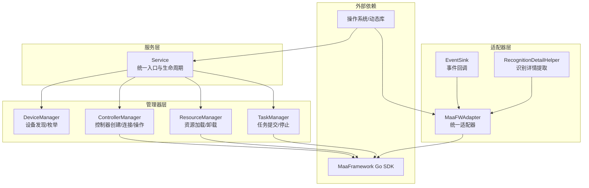
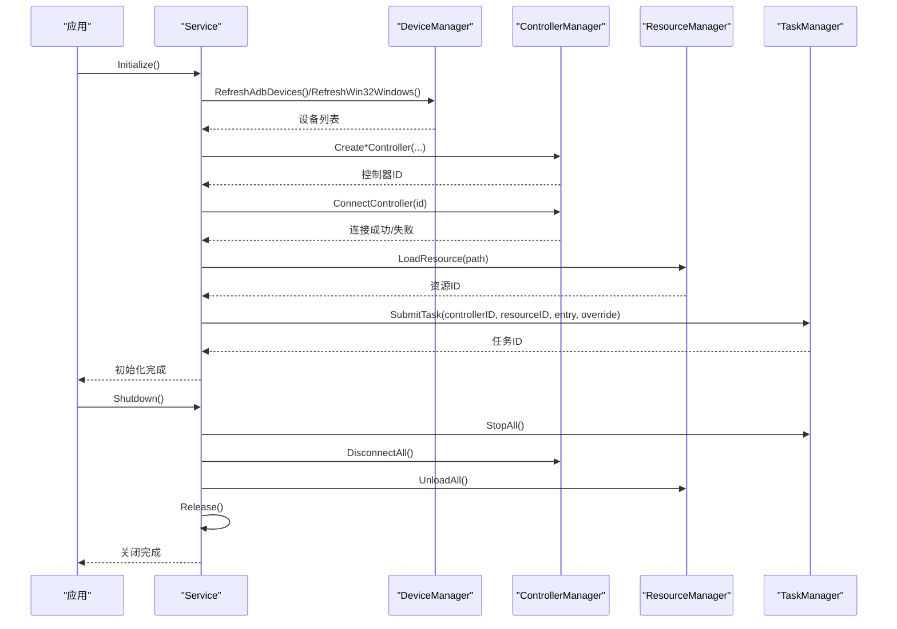
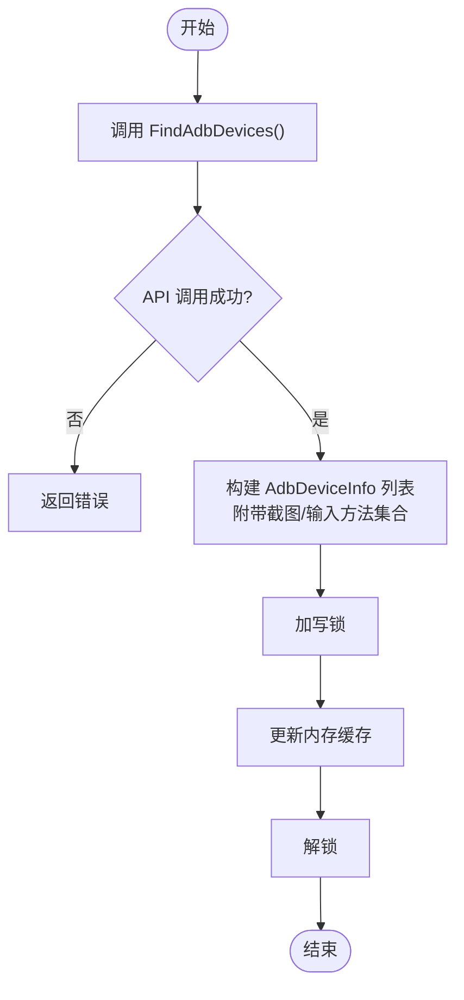
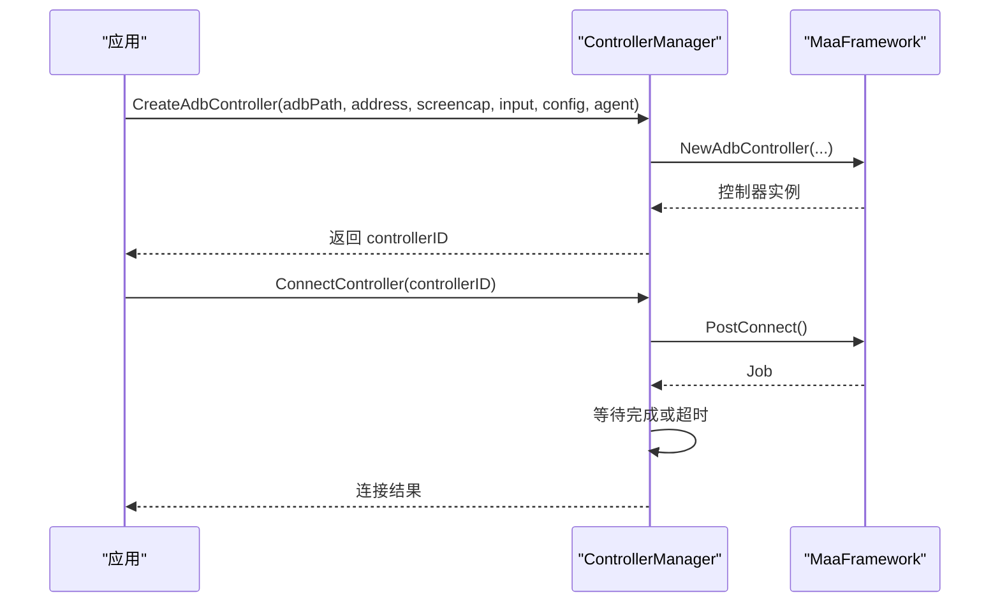
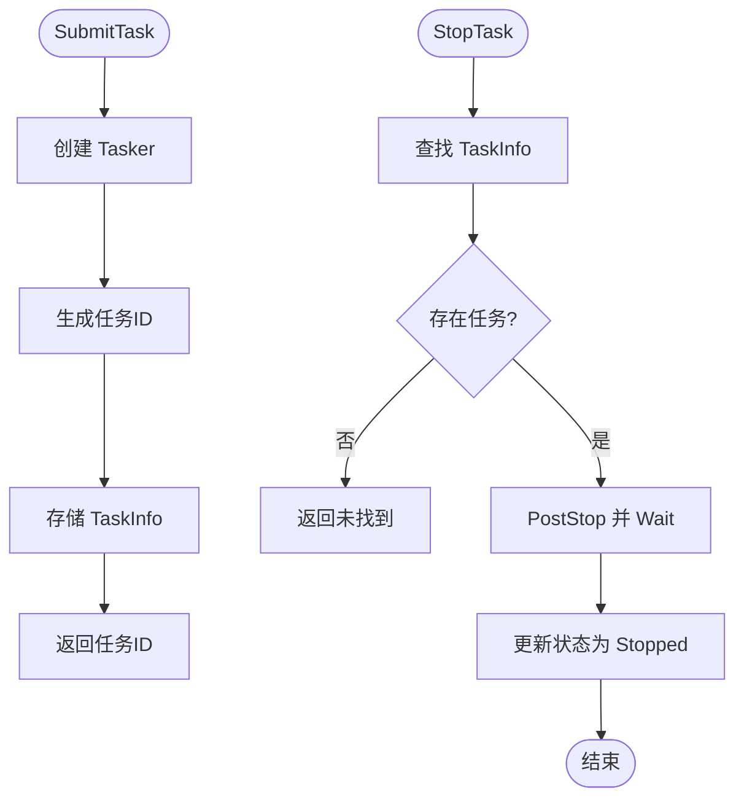
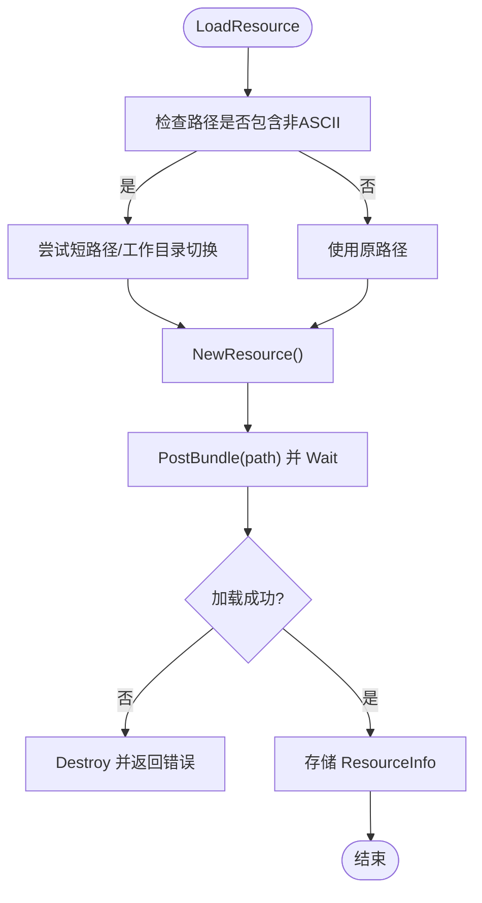
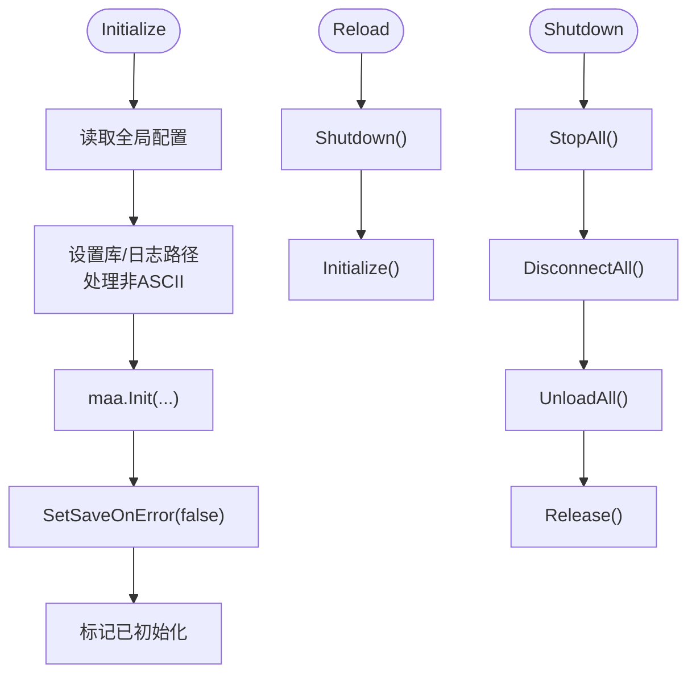
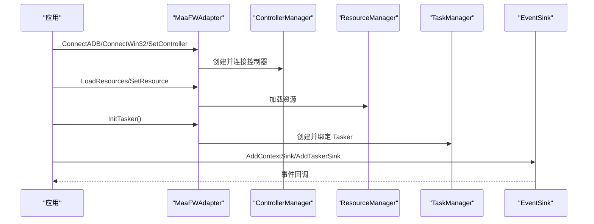
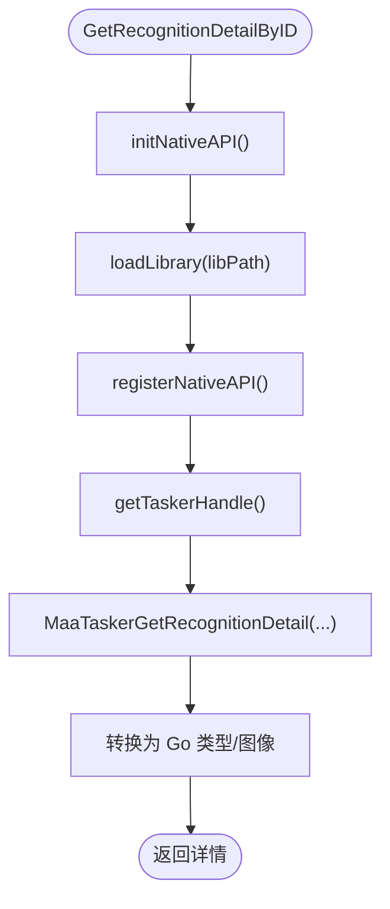
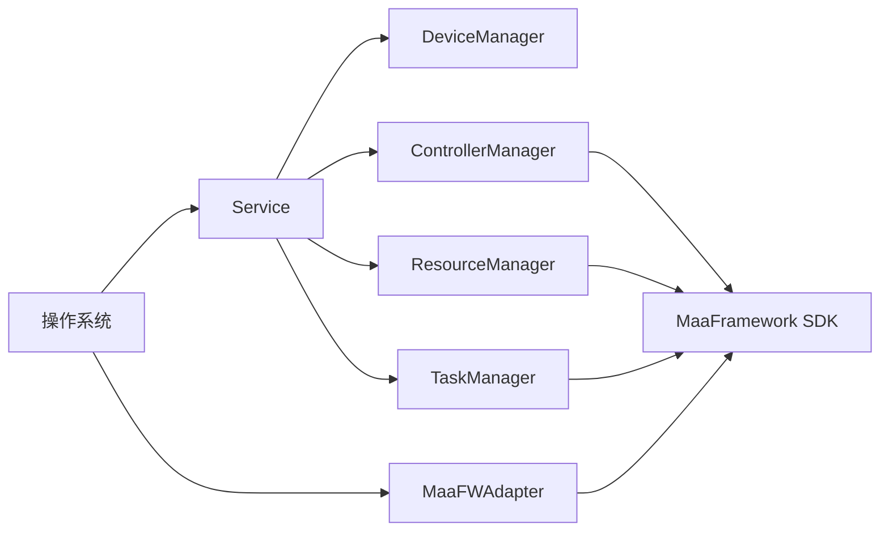

# MFW服务模块

<cite>
**本文档引用的文件**
- [service.go](file://LocalBridge/internal/mfw/service.go)
- [device_manager.go](file://LocalBridge/internal/mfw/device_manager.go)
- [controller_manager.go](file://LocalBridge/internal/mfw/controller_manager.go)
- [task_manager.go](file://LocalBridge/internal/mfw/task_manager.go)
- [types.go](file://LocalBridge/internal/mfw/types.go)
- [resource_manager.go](file://LocalBridge/internal/mfw/resource_manager.go)
- [error.go](file://LocalBridge/internal/mfw/error.go)
- [adapter.go](file://LocalBridge/internal/mfw/adapter.go)
- [event_sink.go](file://LocalBridge/internal/mfw/event_sink.go)
- [reco_detail_helper.go](file://LocalBridge/internal/mfw/reco_detail_helper.go)
- [lib_loader_windows.go](file://LocalBridge/internal/mfw/lib_loader_windows.go)
- [lib_loader_unix.go](file://LocalBridge/internal/mfw/lib_loader_unix.go)
- [path_windows.go](file://LocalBridge/internal/mfw/path_windows.go)
- [path_unix.go](file://LocalBridge/internal/mfw/path_unix.go)
</cite>

## 目录
1. [简介](#简介)
2. [项目结构](#项目结构)
3. [核心组件](#核心组件)
4. [架构总览](#架构总览)
5. [详细组件分析](#详细组件分析)
6. [依赖关系分析](#依赖关系分析)
7. [性能考虑](#性能考虑)
8. [故障排查指南](#故障排查指南)
9. [结论](#结论)

## 简介
本文件全面介绍 MaaFramework 服务（MFWService）的架构设计与实现细节，重点覆盖以下方面：
- 设备管理（DeviceManager）：设备发现、连接建立、状态监控与断开处理
- 控制器管理（ControllerManager）：任务调度、执行状态跟踪、错误处理与重试机制
- 任务管理（TaskManager）：工作流执行、节点调度、参数传递与结果收集
- 生命周期管理：初始化、重载、关闭与资源清理
- 性能监控与异常恢复策略
- 配置选项、API 接口、使用示例与故障排查

## 项目结构
MFW 服务位于 LocalBridge 子模块的 internal/mfw 目录，采用分层职责划分：
- 服务层：统一入口与生命周期管理
- 管理器层：设备、控制器、资源、任务的集中管理
- 适配器层：对 MaaFramework 的统一封装与事件桥接
- 工具与辅助：路径处理、动态库加载、识别详情提取

**图表来源**
- [service.go:15-34](file://LocalBridge/internal/mfw/service.go#L15-L34)
- [device_manager.go:11-24](file://LocalBridge/internal/mfw/device_manager.go#L11-L24)
- [controller_manager.go:20-31](file://LocalBridge/internal/mfw/controller_manager.go#L20-L31)
- [resource_manager.go:13-24](file://LocalBridge/internal/mfw/resource_manager.go#L13-L24)
- [task_manager.go:11-22](file://LocalBridge/internal/mfw/task_manager.go#L11-L22)
- [adapter.go:23-50](file://LocalBridge/internal/mfw/adapter.go#L23-L50)
- [event_sink.go:11-71](file://LocalBridge/internal/mfw/event_sink.go#L11-L71)
- [reco_detail_helper.go:22-41](file://LocalBridge/internal/mfw/reco_detail_helper.go#L22-L41)

**章节来源**
- [service.go:15-34](file://LocalBridge/internal/mfw/service.go#L15-L34)
- [device_manager.go:11-24](file://LocalBridge/internal/mfw/device_manager.go#L11-L24)
- [controller_manager.go:20-31](file://LocalBridge/internal/mfw/controller_manager.go#L20-L31)
- [resource_manager.go:13-24](file://LocalBridge/internal/mfw/resource_manager.go#L13-L24)
- [task_manager.go:11-22](file://LocalBridge/internal/mfw/task_manager.go#L11-L22)
- [adapter.go:23-50](file://LocalBridge/internal/mfw/adapter.go#L23-L50)
- [event_sink.go:11-71](file://LocalBridge/internal/mfw/event_sink.go#L11-L71)
- [reco_detail_helper.go:22-41](file://LocalBridge/internal/mfw/reco_detail_helper.go#L22-L41)

## 核心组件
- Service：MFW 服务的统一入口，负责初始化、重载与关闭，并持有各管理器实例
- DeviceManager：提供 ADB 设备与 Win32 窗口的发现与列表维护
- ControllerManager：创建/连接控制器，执行输入操作、截图与应用控制，管理控制器状态与清理
- ResourceManager：加载/卸载资源包，支持多路径资源合并
- TaskManager：提交任务、查询状态、停止任务
- MaaFWAdapter：对 MaaFramework 的统一适配，封装控制器、资源、任务器与 Agent 的管理
- EventSink：简化版事件回调，输出节点/识别/动作/任务/资源事件
- RecognitionDetailHelper：通过原生 API 提取识别详情（原始图像、绘制图像等）

**章节来源**
- [service.go:15-34](file://LocalBridge/internal/mfw/service.go#L15-L34)
- [types.go:7-124](file://LocalBridge/internal/mfw/types.go#L7-L124)

## 架构总览
MFW 服务通过 Service 统一协调各管理器，对外暴露稳定的接口；内部以 MaaFramework Go SDK 为核心，结合适配器层实现跨平台与事件集成。

**图表来源**
- [service.go:36-138](file://LocalBridge/internal/mfw/service.go#L36-L138)
- [device_manager.go:26-95](file://LocalBridge/internal/mfw/device_manager.go#L26-L95)
- [controller_manager.go:33-192](file://LocalBridge/internal/mfw/controller_manager.go#L33-L192)
- [resource_manager.go:26-105](file://LocalBridge/internal/mfw/resource_manager.go#L26-L105)
- [task_manager.go:24-53](file://LocalBridge/internal/mfw/task_manager.go#L24-L53)

## 详细组件分析

### 设备管理（DeviceManager）
职责与能力：
- ADB 设备发现：调用底层 API 获取设备列表，附带可用截图与输入方法集合
- Win32 窗体发现：枚举桌面窗口，提供截图与输入方法集合
- 线程安全：内部使用读写锁保护设备列表
- 结果缓存：刷新后更新内存中的设备快照

关键流程（ADB 设备刷新）：

**图表来源**
- [device_manager.go:26-60](file://LocalBridge/internal/mfw/device_manager.go#L26-L60)

实现要点：
- 截图与输入方法集合来源于 MaaFramework 支持的枚举，便于用户选择最优方案
- Win32 窗口信息包含句柄、类名、窗口名与方法集合
- 列表获取通过读锁保证并发安全

**章节来源**
- [device_manager.go:11-110](file://LocalBridge/internal/mfw/device_manager.go#L11-L110)

### 控制器管理（ControllerManager）
职责与能力：
- 控制器创建：支持 ADB、Win32、PlayCover、Gamepad 等多种类型
- 连接与断开：异步连接并带超时控制，断开时销毁实例
- 输入操作：点击、滑动、文本输入、应用启停、滚动、按键等
- 截图：支持目标尺寸与原始尺寸控制，返回 Base64 PNG
- 状态管理：连接状态、UUID、最后活跃时间
- 清理策略：按活跃度超时清理非活跃控制器

控制器创建与连接序列：

**图表来源**
- [controller_manager.go:33-75](file://LocalBridge/internal/mfw/controller_manager.go#L33-L75)
- [controller_manager.go:249-300](file://LocalBridge/internal/mfw/controller_manager.go#L249-L300)

实现要点：
- ADB 控制器支持多截图/输入方法组合，自动解析并聚合
- Win32 控制器支持映射与伪最小化截图变体
- 操作均通过 Job 异步执行并等待完成，确保状态一致性
- 截图支持缓存与尺寸控制，避免频繁 IO

**章节来源**
- [controller_manager.go:20-994](file://LocalBridge/internal/mfw/controller_manager.go#L20-L994)
- [types.go:40-124](file://LocalBridge/internal/mfw/types.go#L40-L124)

### 任务管理（TaskManager）
职责与能力：
- 任务提交：创建 Tasker，生成任务 ID，记录控制器、资源、入口与覆盖参数
- 状态查询：返回任务状态字符串
- 停止任务：向 Tasker 发送停止信号并等待

任务提交与停止流程：

**图表来源**
- [task_manager.go:24-90](file://LocalBridge/internal/mfw/task_manager.go#L24-L90)

**章节来源**
- [task_manager.go:11-114](file://LocalBridge/internal/mfw/task_manager.go#L11-L114)

### 资源管理（ResourceManager）
职责与能力：
- 资源加载：支持多路径资源包合并加载
- 资源卸载：销毁资源实例并清理缓存
- 路径兼容：Windows 下处理非 ASCII 路径（短路径或工作目录切换）

资源加载流程：

**图表来源**
- [resource_manager.go:26-105](file://LocalBridge/internal/mfw/resource_manager.go#L26-L105)

**章节来源**
- [resource_manager.go:13-158](file://LocalBridge/internal/mfw/resource_manager.go#L13-L158)

### 服务生命周期（Service）
职责与能力：
- 初始化：设置库与日志目录，处理 Windows 非 ASCII 路径，初始化 MaaFramework
- 重载：关闭现有服务并重新初始化
- 关闭：停止任务、断开控制器、卸载资源、释放框架

初始化与关闭流程：

**图表来源**
- [service.go:36-138](file://LocalBridge/internal/mfw/service.go#L36-L138)
- [service.go:140-170](file://LocalBridge/internal/mfw/service.go#L140-L170)

**章节来源**
- [service.go:15-218](file://LocalBridge/internal/mfw/service.go#L15-L218)

### 适配器与事件（MaaFWAdapter 与 EventSink）
职责与能力：
- MaaFWAdapter：统一管理控制器、资源、任务器与 Agent，提供截图缓存、事件回调注册、状态查询与销毁
- EventSink：简化节点/识别/动作/任务/资源事件，输出结构化事件数据

适配器初始化与事件注册：

**图表来源**
- [adapter.go:63-118](file://LocalBridge/internal/mfw/adapter.go#L63-L118)
- [adapter.go:205-260](file://LocalBridge/internal/mfw/adapter.go#L205-L260)
- [adapter.go:308-357](file://LocalBridge/internal/mfw/adapter.go#L308-L357)
- [event_sink.go:576-637](file://LocalBridge/internal/mfw/event_sink.go#L576-L637)

**章节来源**
- [adapter.go:23-824](file://LocalBridge/internal/mfw/adapter.go#L23-L824)
- [event_sink.go:11-520](file://LocalBridge/internal/mfw/event_sink.go#L11-L520)

### 识别详情提取（RecognitionDetailHelper）
职责与能力：
- 通过原生 API 获取识别详情：命中框、算法、原始图像、绘制图像列表
- 跨平台动态库加载：Windows 使用 LoadLibrary，Unix 使用 purego.Dlopen
- 路径兼容：根据配置自动定位库文件

原生 API 流程：

**图表来源**
- [reco_detail_helper.go:85-129](file://LocalBridge/internal/mfw/reco_detail_helper.go#L85-L129)
- [reco_detail_helper.go:168-267](file://LocalBridge/internal/mfw/reco_detail_helper.go#L168-L267)

**章节来源**
- [reco_detail_helper.go:1-345](file://LocalBridge/internal/mfw/reco_detail_helper.go#L1-L345)

## 依赖关系分析
- 内部耦合
  - Service 持有各管理器实例，形成高层协调
  - 各管理器之间低耦合，通过 MaaFramework SDK 间接交互
- 外部依赖
  - MaaFramework Go SDK：控制器、资源、任务器、Agent、事件系统
  - 操作系统：动态库加载、路径处理（Windows 短路径、工作目录切换）
- 平台差异
  - Windows：LoadLibrary、GetShortPathName、非 ASCII 路径处理
  - Unix：purego Dlopen、短路径直接返回

**图表来源**
- [service.go:15-34](file://LocalBridge/internal/mfw/service.go#L15-L34)
- [adapter.go:23-50](file://LocalBridge/internal/mfw/adapter.go#L23-L50)
- [lib_loader_windows.go:11-21](file://LocalBridge/internal/mfw/lib_loader_windows.go#L11-L21)
- [lib_loader_unix.go:11-19](file://LocalBridge/internal/mfw/lib_loader_unix.go#L11-L19)
- [path_windows.go:22-56](file://LocalBridge/internal/mfw/path_windows.go#L22-L56)
- [path_unix.go:17-22](file://LocalBridge/internal/mfw/path_unix.go#L17-L22)

**章节来源**
- [service.go:15-218](file://LocalBridge/internal/mfw/service.go#L15-L218)
- [adapter.go:23-824](file://LocalBridge/internal/mfw/adapter.go#L23-L824)
- [lib_loader_windows.go:1-21](file://LocalBridge/internal/mfw/lib_loader_windows.go#L1-L21)
- [lib_loader_unix.go:1-19](file://LocalBridge/internal/mfw/lib_loader_unix.go#L1-L19)
- [path_windows.go:1-57](file://LocalBridge/internal/mfw/path_windows.go#L1-L57)
- [path_unix.go:1-22](file://LocalBridge/internal/mfw/path_unix.go#L1-L22)

## 性能考虑
- 截图缓存：适配器与截图器提供 TTL 缓存，减少频繁截图带来的性能损耗
- 异步作业：控制器操作与任务执行均通过 Job 异步进行，主线程不阻塞
- 资源加载：多资源包顺序加载，失败即销毁并返回错误，避免部分加载导致的状态不一致
- 路径处理：Windows 非 ASCII 路径优先短路径，否则工作目录切换，降低库加载失败概率
- 事件降噪：简化事件回调仅输出关键事件，减少前端渲染与传输压力

[本节为通用性能建议，无需特定文件引用]

## 故障排查指南
常见错误与处理：
- 初始化失败
  - 症状：库路径未配置或加载失败
  - 处理：使用配置命令设置库路径，确认路径可访问且无非 ASCII 字符（必要时转换为短路径）
  - 参考
    - [service.go:60-65](file://LocalBridge/internal/mfw/service.go#L60-L65)
    - [path_windows.go:22-56](file://LocalBridge/internal/mfw/path_windows.go#L22-L56)
- 控制器连接失败
  - 症状：连接超时或状态异常
  - 处理：检查设备/窗口可用性、方法选择是否正确、权限与驱动
  - 参考
    - [controller_manager.go:249-300](file://LocalBridge/internal/mfw/controller_manager.go#L249-L300)
- 资源加载失败
  - 症状：资源包加载失败或哈希不一致
  - 处理：检查资源路径、权限与完整性，必要时重新加载
  - 参考
    - [resource_manager.go:26-105](file://LocalBridge/internal/mfw/resource_manager.go#L26-L105)
- 任务执行异常
  - 症状：任务状态停滞或失败
  - 处理：停止任务并重试，检查入口与覆盖参数
  - 参考
    - [task_manager.go:24-90](file://LocalBridge/internal/mfw/task_manager.go#L24-L90)
- 识别详情获取失败
  - 症状：无法获取原始图像或绘制图像
  - 处理：确认原生 API 初始化成功、库路径正确
  - 参考
    - [reco_detail_helper.go:85-129](file://LocalBridge/internal/mfw/reco_detail_helper.go#L85-L129)

**章节来源**
- [error.go:5-53](file://LocalBridge/internal/mfw/error.go#L5-L53)
- [service.go:36-138](file://LocalBridge/internal/mfw/service.go#L36-L138)
- [controller_manager.go:249-300](file://LocalBridge/internal/mfw/controller_manager.go#L249-L300)
- [resource_manager.go:26-105](file://LocalBridge/internal/mfw/resource_manager.go#L26-L105)
- [task_manager.go:24-90](file://LocalBridge/internal/mfw/task_manager.go#L24-L90)
- [reco_detail_helper.go:85-129](file://LocalBridge/internal/mfw/reco_detail_helper.go#L85-L129)

## 结论
MFW 服务模块通过清晰的分层设计与统一适配器，实现了对 MaaFramework 的稳定封装。设备管理、控制器管理、资源管理与任务管理各司其职，配合事件系统与识别详情提取，满足复杂自动化场景的需求。生命周期管理与平台兼容性处理确保了服务在不同环境下的可靠性与可维护性。