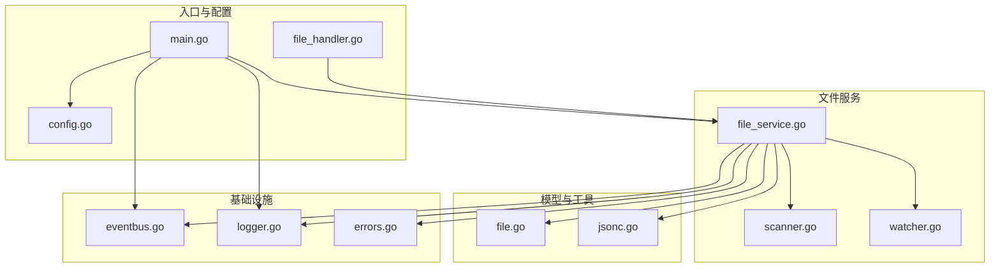
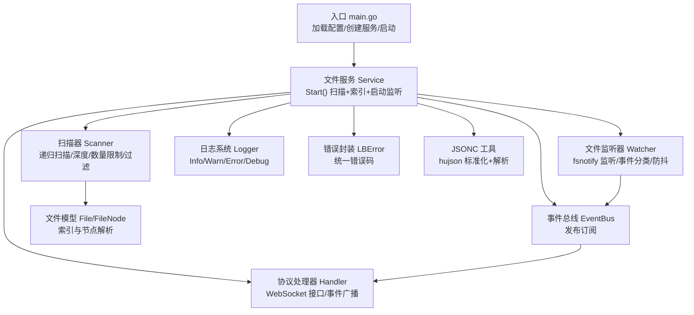
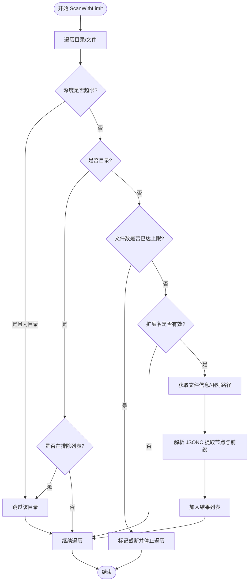
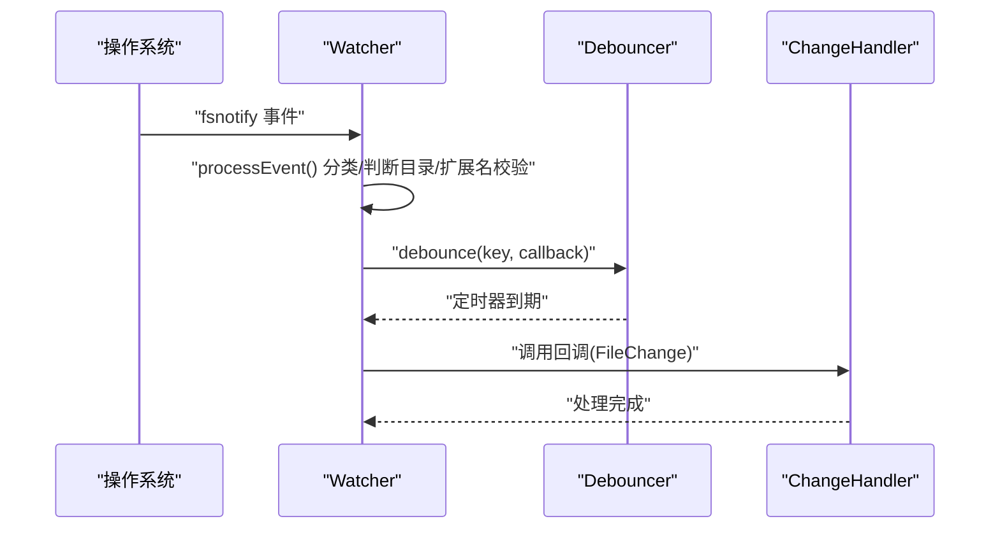
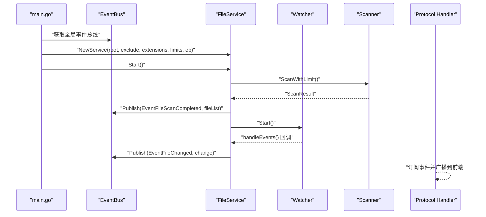
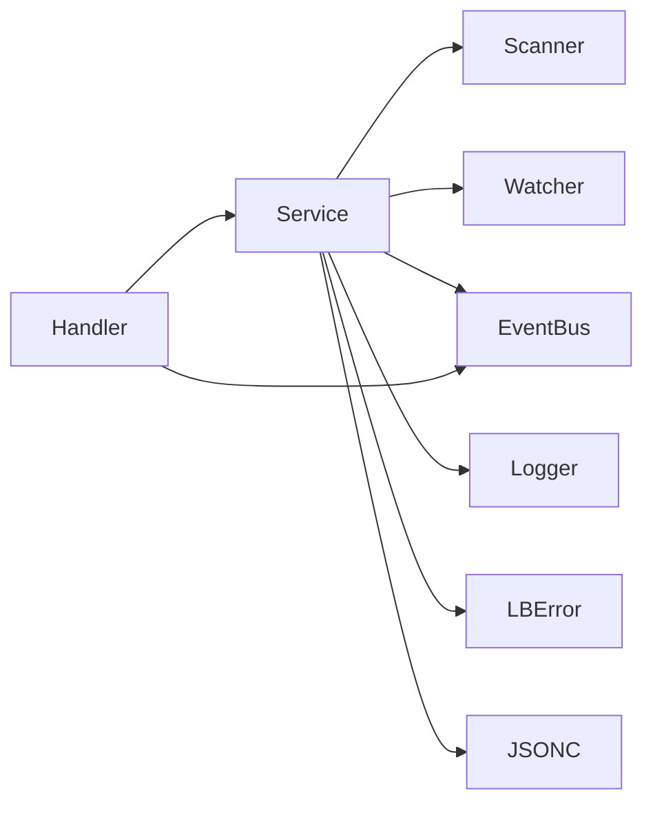

# 文件服务模块

<cite>
**本文引用的文件**
- [file_service.go](file://LocalBridge/internal/service/file/file_service.go)
- [scanner.go](file://LocalBridge/internal/service/file/scanner.go)
- [watcher.go](file://LocalBridge/internal/service/file/watcher.go)
- [file.go](file://LocalBridge/pkg/models/file.go)
- [jsonc.go](file://LocalBridge/internal/utils/jsonc.go)
- [eventbus.go](file://LocalBridge/internal/eventbus/eventbus.go)
- [logger.go](file://LocalBridge/internal/logger/logger.go)
- [errors.go](file://LocalBridge/internal/errors/errors.go)
- [main.go](file://LocalBridge/cmd/lb/main.go)
- [config.go](file://LocalBridge/internal/config/config.go)
- [file_handler.go](file://LocalBridge/internal/protocol/file/file_handler.go)
</cite>

## 目录
1. [简介](#简介)
2. [项目结构](#项目结构)
3. [核心组件](#核心组件)
4. [架构总览](#架构总览)
5. [组件详解](#组件详解)
6. [依赖关系分析](#依赖关系分析)
7. [性能考量](#性能考量)
8. [故障排查指南](#故障排查指南)
9. [结论](#结论)
10. [附录](#附录)

## 简介
本文件服务模块提供对本地文件系统的递归扫描、实时监听、索引管理、并发安全、错误处理与日志记录能力，并支持安全的文件读写、JSONC 解析与缩进格式化。模块采用事件总线进行发布订阅，结合防抖机制降低高频变更带来的影响，同时通过路径安全校验与限制策略保障系统稳定性。

## 项目结构
文件服务相关代码集中在 LocalBridge 内部，主要文件分布如下：
- 服务层：文件服务、扫描器、文件监听器
- 数据模型：文件与节点模型
- 工具层：JSONC 解析
- 事件与日志：事件总线、日志系统
- 错误封装：统一错误类型
- 入口与协议：命令行入口、文件协议处理器



**图表来源**
- [file_service.go:1-360](file://LocalBridge/internal/service/file/file_service.go#L1-L360)
- [scanner.go:1-250](file://LocalBridge/internal/service/file/scanner.go#L1-L250)
- [watcher.go:1-258](file://LocalBridge/internal/service/file/watcher.go#L1-L258)
- [file.go:1-29](file://LocalBridge/pkg/models/file.go#L1-L29)
- [jsonc.go:1-30](file://LocalBridge/internal/utils/jsonc.go#L1-L30)
- [eventbus.go:1-83](file://LocalBridge/internal/eventbus/eventbus.go#L1-L83)
- [logger.go:1-251](file://LocalBridge/internal/logger/logger.go#L1-L251)
- [errors.go:1-141](file://LocalBridge/internal/errors/errors.go#L1-L141)
- [main.go:260-459](file://LocalBridge/cmd/lb/main.go#L260-L459)
- [config.go:1-339](file://LocalBridge/internal/config/config.go#L1-L339)
- [file_handler.go:1-328](file://LocalBridge/internal/protocol/file/file_handler.go#L1-L328)

**章节来源**
- [file_service.go:1-360](file://LocalBridge/internal/service/file/file_service.go#L1-L360)
- [scanner.go:1-250](file://LocalBridge/internal/service/file/scanner.go#L1-L250)
- [watcher.go:1-258](file://LocalBridge/internal/service/file/watcher.go#L1-L258)
- [file.go:1-29](file://LocalBridge/pkg/models/file.go#L1-L29)
- [jsonc.go:1-30](file://LocalBridge/internal/utils/jsonc.go#L1-L30)
- [eventbus.go:1-83](file://LocalBridge/internal/eventbus/eventbus.go#L1-L83)
- [logger.go:1-251](file://LocalBridge/internal/logger/logger.go#L1-L251)
- [errors.go:1-141](file://LocalBridge/internal/errors/errors.go#L1-L141)
- [main.go:260-459](file://LocalBridge/cmd/lb/main.go#L260-L459)
- [config.go:1-339](file://LocalBridge/internal/config/config.go#L1-L339)
- [file_handler.go:1-328](file://LocalBridge/internal/protocol/file/file_handler.go#L1-L328)

## 核心组件
- 文件服务 Service：负责初始化、启动/停止、文件读写、索引维护、事件发布与安全校验。
- 扫描器 Scanner：递归扫描、深度与数量限制、文件过滤、单文件扫描与节点解析。
- 文件监听器 Watcher：基于 fsnotify 的文件系统监听、事件分类、防抖与扩展名校验。
- 事件总线 EventBus：发布订阅模式，支持同步/异步发布与全局实例。
- 日志系统 Logger：控制台与文件双通道、历史日志缓存、推送钩子。
- 错误封装 LBError：统一错误码与包装，便于协议层透传。
- JSONC 工具：hujson 标准化后使用标准 JSON 解析器。
- 协议处理器 Handler：将服务能力暴露为 WebSocket 协议接口，订阅事件并广播。

**章节来源**
- [file_service.go:19-360](file://LocalBridge/internal/service/file/file_service.go#L19-L360)
- [scanner.go:20-250](file://LocalBridge/internal/service/file/scanner.go#L20-L250)
- [watcher.go:34-258](file://LocalBridge/internal/service/file/watcher.go#L34-L258)
- [eventbus.go:16-83](file://LocalBridge/internal/eventbus/eventbus.go#L16-L83)
- [logger.go:13-251](file://LocalBridge/internal/logger/logger.go#L13-L251)
- [errors.go:22-141](file://LocalBridge/internal/errors/errors.go#L22-L141)
- [jsonc.go:9-30](file://LocalBridge/internal/utils/jsonc.go#L9-L30)
- [file_handler.go:14-328](file://LocalBridge/internal/protocol/file/file_handler.go#L14-L328)

## 架构总览
文件服务的整体架构围绕“扫描—索引—监听—事件—协议”的闭环展开。启动时先扫描并构建索引，随后启动监听器捕获文件系统变化；所有变更通过事件总线广播，协议层将变更推送给前端；读写操作均进行路径安全校验与 JSONC 解析，保证一致性与安全性。



**图表来源**
- [main.go:260-459](file://LocalBridge/cmd/lb/main.go#L260-L459)
- [file_service.go:64-102](file://LocalBridge/internal/service/file/file_service.go#L64-L102)
- [scanner.go:58-147](file://LocalBridge/internal/service/file/scanner.go#L58-L147)
- [watcher.go:61-111](file://LocalBridge/internal/service/file/watcher.go#L61-L111)
- [eventbus.go:22-83](file://LocalBridge/internal/eventbus/eventbus.go#L22-L83)
- [file_handler.go:22-328](file://LocalBridge/internal/protocol/file/file_handler.go#L22-L328)
- [logger.go:164-201](file://LocalBridge/internal/logger/logger.go#L164-L201)
- [errors.go:52-141](file://LocalBridge/internal/errors/errors.go#L52-L141)
- [jsonc.go:9-30](file://LocalBridge/internal/utils/jsonc.go#L9-L30)
- [file.go:3-29](file://LocalBridge/pkg/models/file.go#L3-L29)

## 组件详解

### 文件服务 Service
- 初始化与配置
  - 接收根目录、排除目录、扩展名、最大深度、最大文件数与事件总线。
  - 设置扫描限制并创建 Watcher 实例，绑定变更回调。
- 启动流程
  - 执行扫描并构建文件索引，发布扫描完成事件。
  - 启动监听器，开始接收文件系统事件。
- 停止流程
  - 关闭监听器，释放资源。
- 并发安全
  - 使用读写锁保护文件索引与最近写入记录。
- 事件发布
  - 在文件创建/修改/删除/重命名时发布事件，携带变更类型、路径与是否目录。
- 安全校验
  - validatePath 将路径转为绝对路径并校验是否在根目录范围内。
- 读写操作
  - ReadFile：安全校验、索引存在性检查（允许特定配置文件绕过）、JSONC 解析。
  - SaveFile：安全校验、缩进格式化、写入文件、清理防抖、记录日志。
  - CreateFile：安全校验目录、校验文件名合法性、写入默认内容、更新索引。

```mermaid
classDiagram
class Service {
-string root
-Scanner scanner
-Watcher watcher
-map~string,*File~ fileIndex
-RWMutex mu
-EventBus eventBus
-int maxDepth
-int maxFiles
-map~string,int64~ recentlyWrittenFiles
-RWMutex writtenMu
-duration selfWriteIgnoreWindow
+NewService(root, exclude, extensions, maxDepth, maxFiles, eb) Service
+Start() error
+Stop() void
+GetFileList() []FileInfo
+ReadFile(filePath) interface{}, error
+SaveFile(filePath, content, indent) error
+CreateFile(directory, fileName, content) string, error
-validatePath(path) error
-handleFileChange(change) void
}
```

**图表来源**
- [file_service.go:19-360](file://LocalBridge/internal/service/file/file_service.go#L19-L360)

**章节来源**
- [file_service.go:37-102](file://LocalBridge/internal/service/file/file_service.go#L37-L102)
- [file_service.go:122-201](file://LocalBridge/internal/service/file/file_service.go#L122-L201)
- [file_service.go:203-251](file://LocalBridge/internal/service/file/file_service.go#L203-L251)
- [file_service.go:253-360](file://LocalBridge/internal/service/file/file_service.go#L253-L360)

### 扫描器 Scanner
- 递归扫描
  - 使用 WalkDir 遍历目录树，计算相对深度，按需跳过目录。
- 深度限制
  - 通过 maxDepth 控制最大递归深度，超过则跳过目录或提前终止。
- 数量限制
  - 通过 maxFiles 控制最大文件数量，达到上限后截断并返回详细原因。
- 文件过滤
  - 排除指定目录名称；过滤非目标扩展名；特殊处理以“.”开头的“.mpe.json”配置文件。
- 单文件扫描
  - 校验扩展名与文件类型，计算相对路径，解析节点与前缀。
- 节点解析
  - 读取文件内容，尝试 JSONC 解析，提取顶层键作为节点名，$mpe.prefix 作为前缀。



**图表来源**
- [scanner.go:64-147](file://LocalBridge/internal/service/file/scanner.go#L64-L147)
- [scanner.go:176-210](file://LocalBridge/internal/service/file/scanner.go#L176-L210)
- [scanner.go:212-249](file://LocalBridge/internal/service/file/scanner.go#L212-L249)

**章节来源**
- [scanner.go:58-147](file://LocalBridge/internal/service/file/scanner.go#L58-L147)
- [scanner.go:149-174](file://LocalBridge/internal/service/file/scanner.go#L149-L174)
- [scanner.go:176-210](file://LocalBridge/internal/service/file/scanner.go#L176-L210)
- [scanner.go:212-249](file://LocalBridge/internal/service/file/scanner.go#L212-L249)

### 文件监听器 Watcher
- 监听机制
  - 使用 fsnotify 递归添加根目录及其子目录到监听集合。
- 事件处理
  - 分类处理 Create/Write/Remove/Rename 事件，区分目录与文件。
  - 对删除/重命名事件通过扩展名判断是否为文件。
- 防抖机制
  - 使用 debouncer 对同一路径的事件进行去抖，避免高频写入导致的重复处理。
  - 支持清除指定键的防抖定时器，用于写入完成后立即生效。
- 安全与健壮性
  - 对监听错误进行日志记录；对新建目录动态加入监听。



**图表来源**
- [watcher.go:94-188](file://LocalBridge/internal/service/file/watcher.go#L94-L188)
- [watcher.go:201-257](file://LocalBridge/internal/service/file/watcher.go#L201-L257)

**章节来源**
- [watcher.go:61-111](file://LocalBridge/internal/service/file/watcher.go#L61-L111)
- [watcher.go:113-188](file://LocalBridge/internal/service/file/watcher.go#L113-L188)
- [watcher.go:201-257](file://LocalBridge/internal/service/file/watcher.go#L201-L257)

### 文件索引管理与并发安全
- 索引结构
  - 以文件绝对路径为键，存储文件元信息与节点列表。
- 并发控制
  - 读多写少场景使用 RWMutex 保护索引访问。
  - 写入/删除/重命名时加写锁，保证一致性。
- 索引更新
  - 初始扫描后一次性重建索引。
  - 监听器回调中按事件类型增删改索引项。
- 列表输出
  - 输出前按相对路径排序，保证 UI 列表稳定一致。

**章节来源**
- [file_service.go:72-120](file://LocalBridge/internal/service/file/file_service.go#L72-L120)
- [file_service.go:253-360](file://LocalBridge/internal/service/file/file_service.go#L253-L360)

### 错误处理与日志记录
- 错误封装
  - 统一错误码与包装，支持 Detail 字段与原始错误链。
- 日志系统
  - 控制台与文件双通道，支持历史日志缓存与推送钩子。
  - 事件总线订阅连接建立事件时推送历史日志。
- 服务内日志
  - 启动/停止、扫描完成、文件变化、写入完成等关键节点均有日志记录。

**章节来源**
- [errors.go:22-141](file://LocalBridge/internal/errors/errors.go#L22-L141)
- [logger.go:164-201](file://LocalBridge/internal/logger/logger.go#L164-L201)
- [logger.go:107-134](file://LocalBridge/internal/logger/logger.go#L107-L134)
- [file_service.go:80-84](file://LocalBridge/internal/service/file/file_service.go#L80-L84)
- [file_service.go:199](file://LocalBridge/internal/service/file/file_service.go#L199)

### JSONC 解析与缩进格式化
- JSONC 解析
  - 使用 hujson 标准化后再由标准 JSON 解析器解析，支持行注释、块注释与尾随逗号。
- 缩进格式化
  - SaveFile 与 CreateFile 支持自定义缩进，缺省使用 4 空格。
- 节点解析
  - 扫描器在解析文件时提取 $mpe.prefix 与顶层键作为节点名。

**章节来源**
- [jsonc.go:9-30](file://LocalBridge/internal/utils/jsonc.go#L9-L30)
- [file_service.go:159-178](file://LocalBridge/internal/service/file/file_service.go#L159-L178)
- [scanner.go:212-249](file://LocalBridge/internal/service/file/scanner.go#L212-L249)

### 初始化配置、启动停止流程与事件发布订阅
- 初始化配置
  - 从配置文件读取根目录、排除目录、扩展名、最大深度、最大文件数等。
- 启动流程
  - 创建事件总线 → 创建文件服务 → 启动文件服务 → 启动资源扫描服务 → 启动 WebSocket 服务器 → 注册协议处理器。
- 停止流程
  - 停止 WebSocket 服务器 → 停止文件服务 → 关闭 MFW 服务。
- 事件发布订阅
  - 文件扫描完成与文件变化事件通过事件总线发布；协议处理器订阅并广播给前端。



**图表来源**
- [main.go:260-459](file://LocalBridge/cmd/lb/main.go#L260-L459)
- [eventbus.go:74-83](file://LocalBridge/internal/eventbus/eventbus.go#L74-L83)
- [file_service.go:64-102](file://LocalBridge/internal/service/file/file_service.go#L64-L102)
- [watcher.go:61-111](file://LocalBridge/internal/service/file/watcher.go#L61-L111)
- [file_handler.go:249-300](file://LocalBridge/internal/protocol/file/file_handler.go#L249-L300)

**章节来源**
- [config.go:19-48](file://LocalBridge/internal/config/config.go#L19-L48)
- [config.go:102-123](file://LocalBridge/internal/config/config.go#L102-L123)
- [main.go:260-459](file://LocalBridge/cmd/lb/main.go#L260-L459)
- [file_handler.go:249-300](file://LocalBridge/internal/protocol/file/file_handler.go#L249-L300)

### 实际使用示例
- 打开文件
  - 协议路径：/etl/open_file
  - 流程：解析请求 → 读取文件内容 → 尝试读取同目录下的 .mpe.json 配置文件 → 返回文件内容与配置路径。
- 保存文件
  - 协议路径：/etl/save_file
  - 流程：解析请求 → 保存文件 → 返回确认。
- 分离保存
  - 协议路径：/etl/save_separated
  - 流程：分别保存 Pipeline 与配置文件 → 返回确认。
- 创建文件
  - 协议路径：/etl/create_file
  - 流程：校验目录与文件名 → 写入默认内容 → 更新索引并推送文件列表。
- 刷新文件列表
  - 协议路径：/etl/refresh_file_list
  - 流程：主动推送当前文件列表。

**章节来源**
- [file_handler.go:66-137](file://LocalBridge/internal/protocol/file/file_handler.go#L66-L137)
- [file_handler.go:139-208](file://LocalBridge/internal/protocol/file/file_handler.go#L139-L208)
- [file_handler.go:210-241](file://LocalBridge/internal/protocol/file/file_handler.go#L210-L241)
- [file_handler.go:243-247](file://LocalBridge/internal/protocol/file/file_handler.go#L243-L247)

## 依赖关系分析
- 组件耦合
  - Service 依赖 Scanner/Watcher/EventBus/Logger/Errors/JSONC 工具。
  - Handler 依赖 Service 与 EventBus，向 WebSocket 广播。
- 外部依赖
  - fsnotify：文件系统事件监听。
  - hujson：JSONC 标准化。
- 循环依赖
  - 未发现循环依赖，模块边界清晰。



**图表来源**
- [file_service.go:19-360](file://LocalBridge/internal/service/file/file_service.go#L19-L360)
- [watcher.go:34-258](file://LocalBridge/internal/service/file/watcher.go#L34-L258)
- [file_handler.go:14-328](file://LocalBridge/internal/protocol/file/file_handler.go#L14-L328)

**章节来源**
- [file_service.go:19-360](file://LocalBridge/internal/service/file/file_service.go#L19-L360)
- [watcher.go:34-258](file://LocalBridge/internal/service/file/watcher.go#L34-L258)
- [file_handler.go:14-328](file://LocalBridge/internal/protocol/file/file_handler.go#L14-L328)

## 性能考量
- 扫描性能
  - 深度与数量限制可显著减少遍历成本；建议根据项目规模合理设置。
  - 目录排除列表减少无关目录扫描。
- 监听性能
  - 防抖机制降低高频写入事件风暴；动态添加新建目录监听避免遗漏。
- 并发与内存
  - 读多写少场景使用读写锁；索引为哈希映射，查找/更新均为平均 O(1)。
- I/O 与解析
  - JSONC 解析在写入前进行，避免存储异常格式；读取时按需解析，减少不必要的解析开销。

[本节为通用性能讨论，不直接分析具体文件，故无章节来源]

## 故障排查指南
- 常见错误类型
  - 文件不存在、读取/写入失败、JSON 格式无效、权限不足、请求参数无效、文件名冲突。
- 定位方法
  - 查看日志系统输出（控制台与文件），关注扫描完成、文件变化、写入完成等关键日志。
  - 通过事件总线订阅连接建立事件，拉取历史日志辅助定位。
- 处理建议
  - 路径问题：确认根目录与排除列表配置，确保路径在根目录范围内。
  - 权限问题：检查文件系统权限与只读属性。
  - JSONC 问题：使用 IsValidJSONC 辅助检查格式，或在前端进行预检查。
  - 监听问题：确认 fsnotify 支持与系统限制，必要时调整防抖间隔。

**章节来源**
- [errors.go:75-141](file://LocalBridge/internal/errors/errors.go#L75-L141)
- [logger.go:164-201](file://LocalBridge/internal/logger/logger.go#L164-L201)
- [logger.go:107-134](file://LocalBridge/internal/logger/logger.go#L107-L134)
- [jsonc.go:25-30](file://LocalBridge/internal/utils/jsonc.go#L25-L30)

## 结论
文件服务模块通过清晰的职责划分与完善的基础设施，实现了对本地文件系统的高效管理。扫描器提供灵活的过滤与限制策略，监听器配合防抖机制降低噪音，事件总线与协议层确保了前端的实时反馈。统一的错误与日志体系提升了可观测性与可维护性。建议在生产环境中合理配置扫描限制与日志级别，并定期审查根目录与排除列表以保障性能与安全。

[本节为总结性内容，不直接分析具体文件，故无章节来源]

## 附录
- 配置项说明
  - server.host/port：WebSocket 服务器地址与端口。
  - file.root：扫描根目录。
  - file.exclude：排除目录列表。
  - file.extensions：文件扩展名过滤。
  - file.max_depth：最大扫描深度。
  - file.max_files：最大文件数量。
  - log.level/dir/push_to_client：日志级别、目录与是否推送至客户端。
  - maafw.enabled/lib_dir/resource_dir：MaaFramework 启用与路径配置。

**章节来源**
- [config.go:13-48](file://LocalBridge/internal/config/config.go#L13-L48)
- [config.go:102-123](file://LocalBridge/internal/config/config.go#L102-L123)