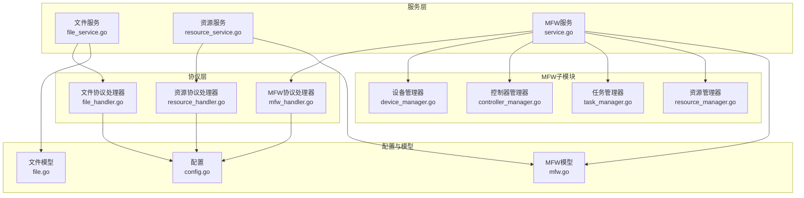
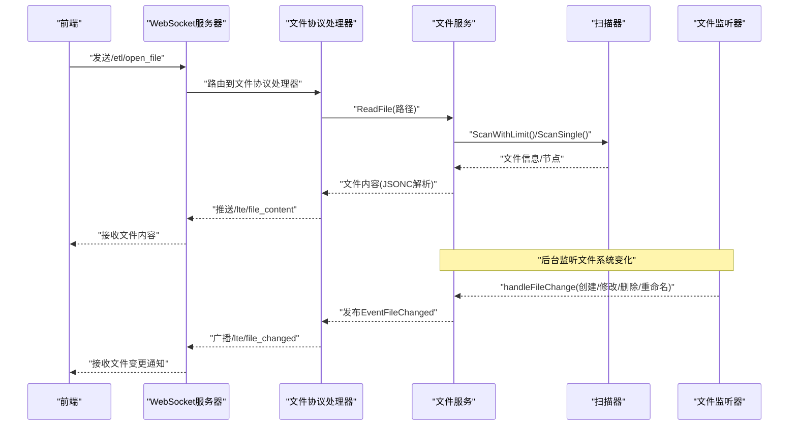
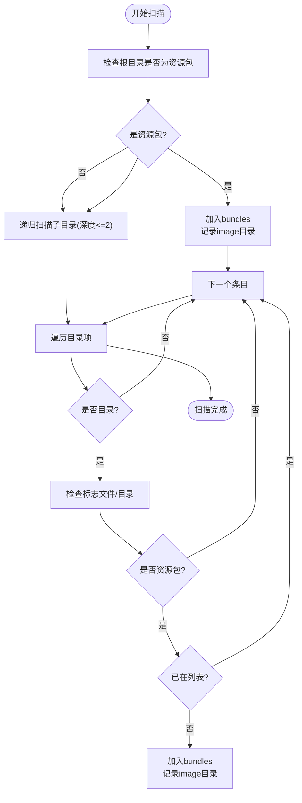
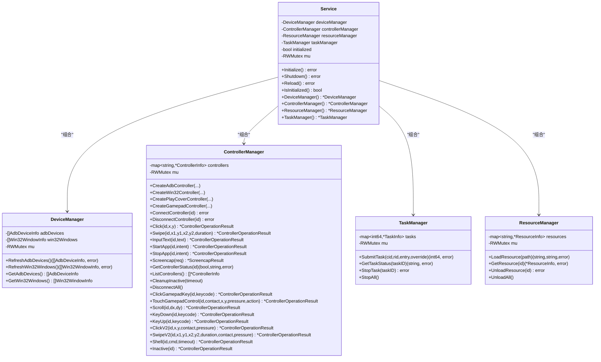
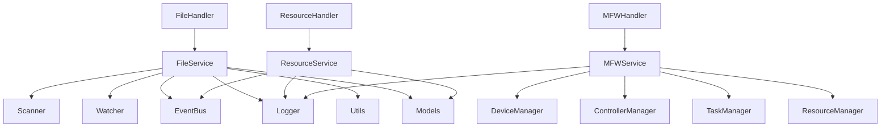

# 服务模块架构

<cite>
**本文档引用的文件**
- [file_service.go](file://LocalBridge/internal/service/file/file_service.go)
- [scanner.go](file://LocalBridge/internal/service/file/scanner.go)
- [watcher.go](file://LocalBridge/internal/service/file/watcher.go)
- [resource_service.go](file://LocalBridge/internal/service/resource/resource_service.go)
- [service.go](file://LocalBridge/internal/mfw/service.go)
- [device_manager.go](file://LocalBridge/internal/mfw/device_manager.go)
- [controller_manager.go](file://LocalBridge/internal/mfw/controller_manager.go)
- [task_manager.go](file://LocalBridge/internal/mfw/task_manager.go)
- [resource_manager.go](file://LocalBridge/internal/mfw/resource_manager.go)
- [file_handler.go](file://LocalBridge/internal/protocol/file/file_handler.go)
- [resource_handler.go](file://LocalBridge/internal/protocol/resource/resource_handler.go)
- [mfw_handler.go](file://LocalBridge/internal/protocol/mfw/handler.go)
- [config.go](file://LocalBridge/internal/config/config.go)
- [file.go](file://LocalBridge/pkg/models/file.go)
- [mfw.go](file://LocalBridge/pkg/models/mfw.go)
</cite>

## 目录
1. [简介](#简介)
2. [项目结构](#项目结构)
3. [核心组件](#核心组件)
4. [架构总览](#架构总览)
5. [详细组件分析](#详细组件分析)
6. [依赖关系分析](#依赖关系分析)
7. [性能考虑](#性能考虑)
8. [故障排查指南](#故障排查指南)
9. [结论](#结论)
10. [附录](#附录)

## 简介
本文件系统性阐述 LocalBridge 服务模块的架构设计与实现，重点覆盖以下方面：
- 文件服务（FileService）：文件扫描、监控与管理，包括文件系统监听、过滤规则、缓存机制与安全路径校验。
- 资源服务（ResourceService）：资源包发现、索引与管理，支持多资源包扫描与图片检索。
- MFW 服务（MFWService）：设备管理、控制器管理、任务调度与资源加载，集成 MaaFramework。
- 服务间依赖关系、生命周期管理与错误处理机制。
- 接口设计、配置参数与使用示例。

## 项目结构
LocalBridge 采用分层与模块化组织方式：
- internal/service：业务服务层（文件、资源）
- internal/mfw：MaaFramework 服务封装（设备、控制器、任务、资源）
- internal/protocol：协议处理器（WebSocket 消息路由）
- internal/config：全局配置管理
- pkg/models：跨模块数据模型定义
- cmd/lb：服务入口与信号处理



图表来源
- [file_service.go:1-360](file://LocalBridge/internal/service/file/file_service.go#L1-L360)
- [resource_service.go:1-359](file://LocalBridge/internal/service/resource/resource_service.go#L1-L359)
- [service.go:1-218](file://LocalBridge/internal/mfw/service.go#L1-L218)
- [file_handler.go:1-328](file://LocalBridge/internal/protocol/file/file_handler.go#L1-L328)
- [resource_handler.go:1-272](file://LocalBridge/internal/protocol/resource/resource_handler.go#L1-L272)
- [mfw_handler.go:1-860](file://LocalBridge/internal/protocol/mfw/handler.go#L1-L860)
- [config.go:1-339](file://LocalBridge/internal/config/config.go#L1-L339)
- [file.go:1-29](file://LocalBridge/pkg/models/file.go#L1-L29)
- [mfw.go:1-244](file://LocalBridge/pkg/models/mfw.go#L1-L244)

章节来源
- [file_service.go:1-360](file://LocalBridge/internal/service/file/file_service.go#L1-L360)
- [resource_service.go:1-359](file://LocalBridge/internal/service/resource/resource_service.go#L1-L359)
- [service.go:1-218](file://LocalBridge/internal/mfw/service.go#L1-L218)

## 核心组件
- 文件服务（FileService）
  - 负责根目录文件扫描、索引构建、文件监听与变更事件处理。
  - 支持 JSONC 解析、路径安全校验、防抖写入事件、配置文件分离读写。
- 资源服务（ResourceService）
  - 负责资源包扫描（pipeline/image/model/default_pipeline.json），维护资源包与 image 目录索引，提供图片检索与列表。
- MFW 服务（MFWService）
  - 封装 MaaFramework 初始化、设备发现、控制器创建/连接/操作、任务提交/查询/停止、资源加载/卸载。
  - 提供多平台控制器适配与截图能力。

章节来源
- [file_service.go:19-62](file://LocalBridge/internal/service/file/file_service.go#L19-L62)
- [resource_service.go:14-31](file://LocalBridge/internal/service/resource/resource_service.go#L14-L31)
- [service.go:15-34](file://LocalBridge/internal/mfw/service.go#L15-L34)

## 架构总览
LocalBridge 通过协议处理器接收前端 WebSocket 请求，调用对应服务完成业务逻辑，并通过事件总线与广播机制向客户端推送状态变更。



图表来源
- [file_handler.go:48-137](file://LocalBridge/internal/protocol/file/file_handler.go#L48-L137)
- [file_service.go:64-95](file://LocalBridge/internal/service/file/file_service.go#L64-L95)
- [scanner.go:64-147](file://LocalBridge/internal/service/file/scanner.go#L64-L147)
- [watcher.go:94-188](file://LocalBridge/internal/service/file/watcher.go#L94-L188)

## 详细组件分析

### 文件服务（FileService）分析
- 结构与职责
  - 管理根目录、扫描器、文件监听器、内存索引、最近写入文件记录与忽略窗口。
  - 提供启动/停止、文件读取/保存/创建、文件列表获取、路径安全校验。
- 扫描与过滤
  - 支持最大深度与最大文件数限制；排除目录白名单；扩展名过滤；.mpe.json 分离配置文件识别。
- 监听与事件
  - 使用 fsnotify 监听文件系统事件，内置防抖器避免频繁触发；区分目录/文件变更；支持重命名事件。
- 缓存与一致性
  - 内存索引 map[string]*models.File；写入时记录最近写入时间，窗口期内忽略自身写入事件；写入成功后清除防抖。
- 安全性
  - validatePath 校验路径绝对化与根目录范围，防止越权访问。

```mermaid
classDiagram
class Service {
-string root
-Scanner scanner
-Watcher watcher
-map~string,*File~ fileIndex
-RWMutex mu
-EventBus eventBus
-int maxDepth
-int maxFiles
-map~string,int64~ recentlyWrittenFiles
-RWMutex writtenMu
-Duration selfWriteIgnoreWindow
+Start() error
+Stop() void
+GetFileList() []FileInfo
+ReadFile(path) interface{}
+SaveFile(path,content,indent) error
+CreateFile(dir,name,content) (string,error)
-handleFileChange(change)
-validatePath(path) error
}
class Scanner {
-string root
-[]string exclude
-[]string extensions
-int maxDepth
-int maxFiles
+SetMaxDepth(depth)
+SetMaxFiles(count)
+Scan() []File
+ScanWithLimit() ScanResult
+ScanSingle(absPath) *File
}
class Watcher {
-Watcher watcher
-string root
-[]string extensions
-ChangeHandler handler
-debouncer debouncer
+Start() error
+Stop() void
+ClearDebounce(path)
}
class debouncer {
-Duration delay
-map~string,*Timer~ timers
-bool stopped
+debounce(key,fn)
+stop()
+clear(key)
}
Service --> Scanner : "使用"
Service --> Watcher : "使用"
Watcher --> debouncer : "使用"
```

图表来源
- [file_service.go:19-36](file://LocalBridge/internal/service/file/file_service.go#L19-L36)
- [scanner.go:20-48](file://LocalBridge/internal/service/file/scanner.go#L20-L48)
- [watcher.go:34-41](file://LocalBridge/internal/service/file/watcher.go#L34-L41)
- [watcher.go:201-257](file://LocalBridge/internal/service/file/watcher.go#L201-L257)

章节来源
- [file_service.go:37-95](file://LocalBridge/internal/service/file/file_service.go#L37-L95)
- [scanner.go:58-147](file://LocalBridge/internal/service/file/scanner.go#L58-L147)
- [watcher.go:61-92](file://LocalBridge/internal/service/file/watcher.go#L61-L92)

### 资源服务（ResourceService）分析
- 结构与职责
  - 维护资源包列表与 image 目录列表；提供资源包扫描、图片列表获取、图片查找、重载等功能。
- 资源包识别
  - 依据 pipeline、image、model、default_pipeline.json 等标志性目录/文件判定资源包；支持根目录即资源包场景。
- 图片检索
  - 支持按相对路径在各资源包 image 目录中查找；返回 BundleName 与相对路径；支持根据 pipeline 路径定位所属资源包。
- 性能与健壮性
  - 递归扫描限制深度；跳过常见非资源目录；统一斜杠分隔符；支持多种图片格式扩展名。



图表来源
- [resource_service.go:48-119](file://LocalBridge/internal/service/resource/resource_service.go#L48-L119)

章节来源
- [resource_service.go:33-68](file://LocalBridge/internal/service/resource/resource_service.go#L33-L68)
- [resource_service.go:121-153](file://LocalBridge/internal/service/resource/resource_service.go#L121-L153)
- [resource_service.go:240-272](file://LocalBridge/internal/service/resource/resource_service.go#L240-L272)

### MFW 服务（MFWService）分析
- 结构与职责
  - 组合设备管理器、控制器管理器、资源管理器、任务管理器；提供初始化/关闭、重载、状态查询。
- 初始化与兼容性
  - 从配置读取库路径；Windows 下处理非 ASCII 路径（短路径转换或工作目录切换）；设置日志目录；启用/禁用调试模式。
- 设备管理
  - ADB 设备与 Win32 窗体枚举；提供截图/输入方法列表；线程安全读写。
- 控制器管理
  - 支持 ADB、Win32、PlayCover、Gamepad 控制器创建与连接；异步连接并超时控制；提供点击、滑动、输入文本、应用启停、截图、手柄操作、滚动、按键按下/释放等操作。
- 任务管理
  - 提交任务（Tasker）、查询状态、停止任务；支持停止所有任务。
- 资源管理
  - 加载资源包（Bundle），支持 Windows 路径兼容；获取哈希；卸载与清空。



图表来源
- [service.go:15-34](file://LocalBridge/internal/mfw/service.go#L15-L34)
- [device_manager.go:11-24](file://LocalBridge/internal/mfw/device_manager.go#L11-L24)
- [controller_manager.go:20-31](file://LocalBridge/internal/mfw/controller_manager.go#L20-L31)
- [task_manager.go:11-22](file://LocalBridge/internal/mfw/task_manager.go#L11-L22)
- [resource_manager.go:13-24](file://LocalBridge/internal/mfw/resource_manager.go#L13-L24)

章节来源
- [service.go:36-138](file://LocalBridge/internal/mfw/service.go#L36-L138)
- [device_manager.go:26-95](file://LocalBridge/internal/mfw/device_manager.go#L26-L95)
- [controller_manager.go:33-321](file://LocalBridge/internal/mfw/controller_manager.go#L33-L321)
- [task_manager.go:24-114](file://LocalBridge/internal/mfw/task_manager.go#L24-L114)
- [resource_manager.go:26-158](file://LocalBridge/internal/mfw/resource_manager.go#L26-L158)

### 协议与接口设计
- 文件协议（/etl/*）
  - 路由前缀：/etl/open_file、/etl/save_file、/etl/save_separated、/etl/create_file、/etl/refresh_file_list
  - 处理流程：解析请求 -> 调用 FileService -> 返回 /lte/* 或 /ack/* 消息 -> 通过 WebSocket 广播 /lte/file_list 与 /lte/file_changed
- 资源协议（/etl/*）
  - 路由前缀：/etl/get_image、/etl/get_images、/etl/get_image_list、/etl/refresh_resources
  - 处理流程：解析请求 -> 调用 ResourceService -> 返回 /lte/image* 或 /lte/resource_bundles
- MFW 协议（/etl/mfw/*）
  - 路由前缀：设备/控制器/任务/资源相关多个路由
  - 处理流程：检查初始化 -> 分发到对应处理器 -> 返回 /lte/mfw/* 响应

章节来源
- [file_handler.go:37-64](file://LocalBridge/internal/protocol/file/file_handler.go#L37-L64)
- [resource_handler.go:45-53](file://LocalBridge/internal/protocol/resource/resource_handler.go#L45-L53)
- [mfw_handler.go:23-26](file://LocalBridge/internal/protocol/mfw/handler.go#L23-L26)

## 依赖关系分析
- 组件耦合
  - FileService 依赖 Scanner/Watcher、EventBus、Logger、Utils、Models；与协议层通过 Handler 解耦。
  - ResourceService 依赖 EventBus、Logger、Models；与协议层通过 Handler 解耦。
  - MFWService 组合 DeviceManager/ControllerManager/TaskManager/ResourceManager，对外暴露统一接口。
- 外部依赖
  - MaaFramework Go 绑定（maa）用于设备/控制器/任务/资源管理。
  - fsnotify 用于文件系统事件监听。
  - Viper 用于配置加载与持久化。
- 循环依赖
  - 未发现循环依赖；协议层仅持有服务引用，不反向依赖服务。



图表来源
- [file_service.go:3-17](file://LocalBridge/internal/service/file/file_service.go#L3-L17)
- [resource_service.go:3-12](file://LocalBridge/internal/service/resource/resource_service.go#L3-L12)
- [service.go:3-13](file://LocalBridge/internal/mfw/service.go#L3-L13)
- [file_handler.go:3-12](file://LocalBridge/internal/protocol/file/file_handler.go#L3-L12)
- [resource_handler.go:3-20](file://LocalBridge/internal/protocol/resource/resource_handler.go#L3-L20)
- [mfw_handler.go:3-9](file://LocalBridge/internal/protocol/mfw/handler.go#L3-L9)

章节来源
- [file_service.go:1-36](file://LocalBridge/internal/service/file/file_service.go#L1-L36)
- [resource_service.go:1-31](file://LocalBridge/internal/service/resource/resource_service.go#L1-L31)
- [service.go:1-34](file://LocalBridge/internal/mfw/service.go#L1-L34)

## 性能考虑
- 文件扫描
  - 通过 max_depth 与 max_files 限制扫描规模，避免大规模目录导致性能问题。
  - 扩展名过滤与排除目录减少 IO 与解析成本。
- 文件监听
  - 防抖器降低高频写入事件的处理频率；对自身写入事件进行窗口期忽略，避免重复处理。
- 资源扫描
  - 限制递归深度（最多2层）；跳过常见非资源目录；统一斜杠分隔符减少路径处理开销。
- MFW 资源加载
  - Windows 路径兼容策略（短路径/工作目录切换）避免路径解析失败带来的重试成本。
- 并发与锁
  - RWMutex 保护共享状态；异步连接与超时控制避免阻塞主线程。

## 故障排查指南
- 文件服务
  - 路径越权：validatePath 报错“路径不在根目录范围内”或“无效的路径”，检查配置中的根目录与请求路径。
  - 写入失败：SaveFile 返回写入错误，检查权限与磁盘空间；确认最近写入记录是否正确清理。
  - 监听异常：Watcher 错误事件日志，检查 fsnotify 初始化与目录权限。
- 资源服务
  - 资源包未识别：确认资源包包含 pipeline/image/model/default_pipeline.json 标志；检查扫描深度与排除目录。
  - 图片未找到：确认相对路径与资源包 image 目录；检查扩展名是否受支持。
- MFW 服务
  - 未初始化：/etl/mfw/* 请求返回“MaaFramework 未初始化”，先执行配置设置库路径并重启服务。
  - 控制器连接失败：检查设备/窗口句柄有效性；查看连接超时与方法列表；必要时更换截图/输入方法。
  - 任务状态异常：查询任务状态或停止任务；确认 Tasker 生命周期与资源加载状态。

章节来源
- [file_service.go:345-359](file://LocalBridge/internal/service/file/file_service.go#L345-L359)
- [resource_handler.go:107-114](file://LocalBridge/internal/protocol/resource/resource_handler.go#L107-L114)
- [mfw_handler.go:33-41](file://LocalBridge/internal/protocol/mfw/handler.go#L33-L41)

## 结论
LocalBridge 服务模块通过清晰的分层与模块化设计，实现了文件与资源的高效管理以及 MaaFramework 的深度集成。文件服务提供稳健的扫描、监听与缓存机制；资源服务支持多资源包与图片检索；MFW 服务封装了设备、控制器、任务与资源的全链路能力。协议层以 WebSocket 为桥梁，实现前后端的实时交互与状态同步。整体架构具备良好的可扩展性与可维护性。

## 附录

### 配置参数与使用示例
- 文件配置（FileConfig）
  - root：根目录（绝对路径）
  - exclude：排除目录列表
  - extensions：允许的文件扩展名列表
  - max_depth：最大扫描深度（0 表示无限制）
  - max_files：最大文件数量（0 表示无限制）
- 日志配置（LogConfig）
  - level：日志级别
  - dir：日志目录
  - push_to_client：是否推送到客户端
- MaaFramework 配置（MaaFWConfig）
  - enabled：是否启用
  - lib_dir：MaaFramework 库目录
  - resource_dir：资源目录

章节来源
- [config.go:13-48](file://LocalBridge/internal/config/config.go#L13-L48)
- [config.go:102-123](file://LocalBridge/internal/config/config.go#L102-L123)

### 数据模型摘要
- 文件模型（File/FileInfo/FileNode）
  - File：文件绝对路径、相对路径、名称、最后修改时间、节点列表、前缀
  - FileInfo：传输用文件信息
  - FileNode：节点标签与前缀
- MFW 模型（控制器/任务/资源相关）
  - 控制器请求/响应、任务提交/状态、资源加载结果、设备列表等

章节来源
- [file.go:3-29](file://LocalBridge/pkg/models/file.go#L3-L29)
- [mfw.go:5-244](file://LocalBridge/pkg/models/mfw.go#L5-L244)