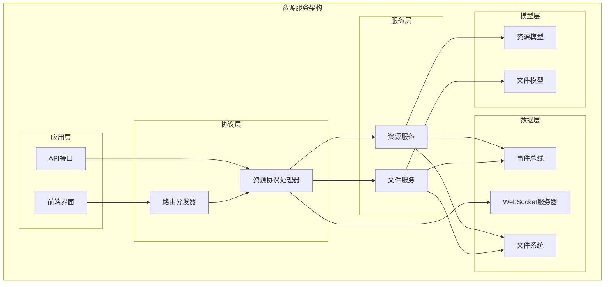
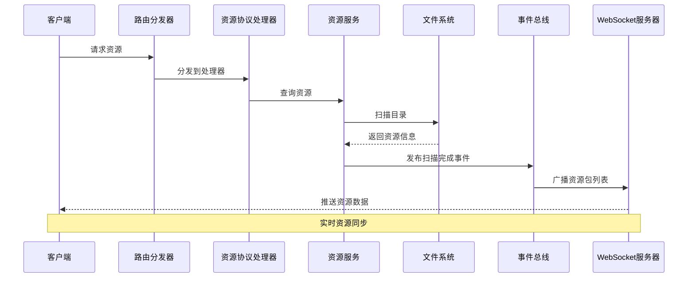
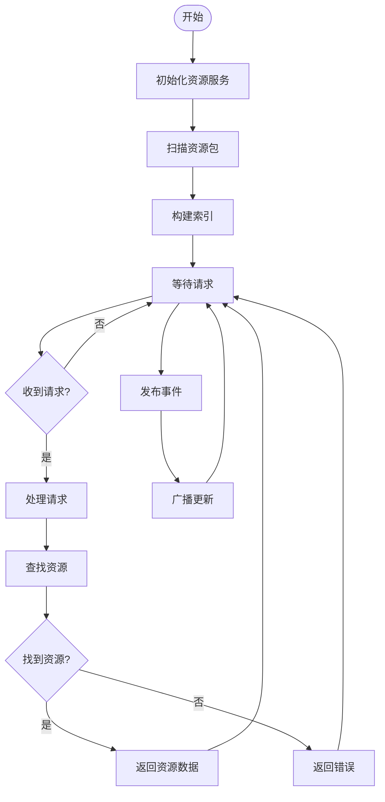
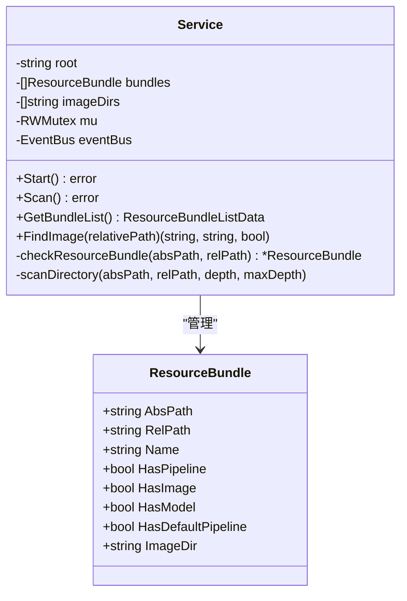
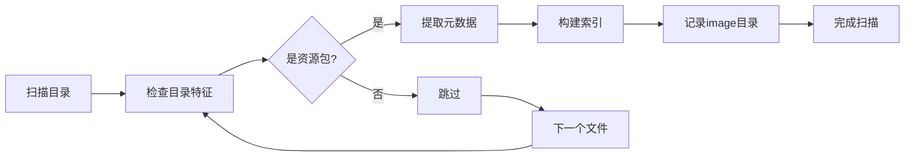
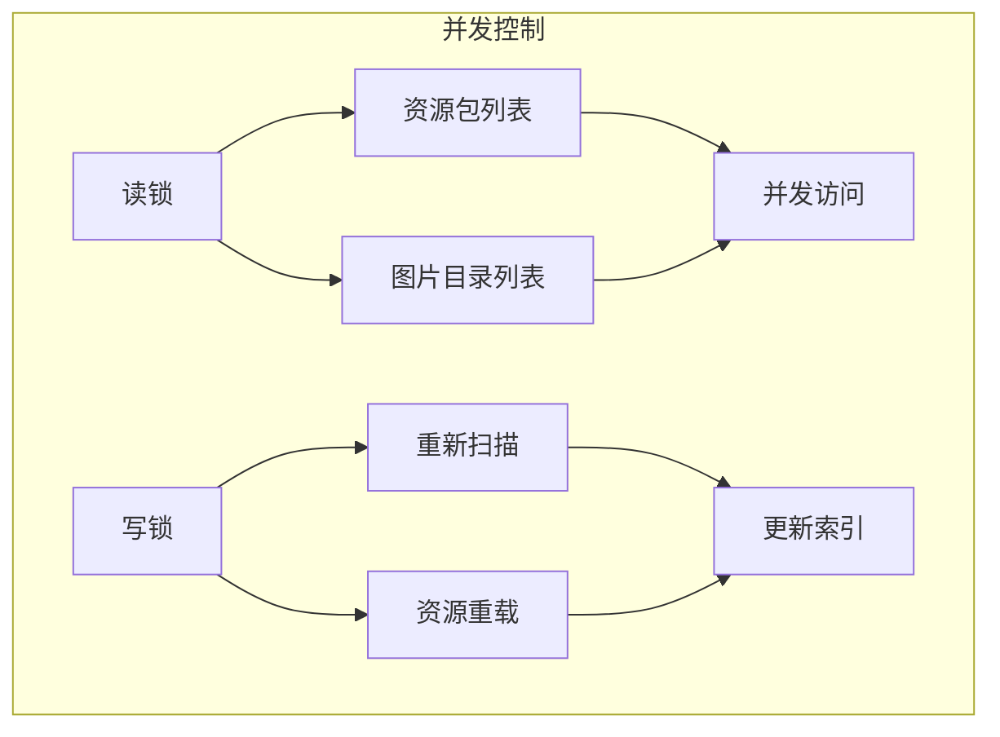
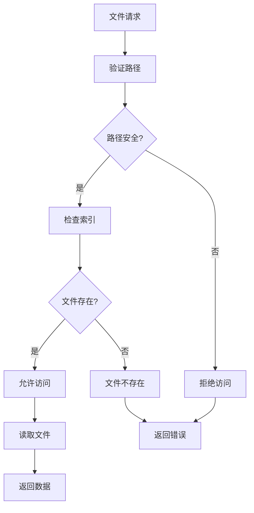
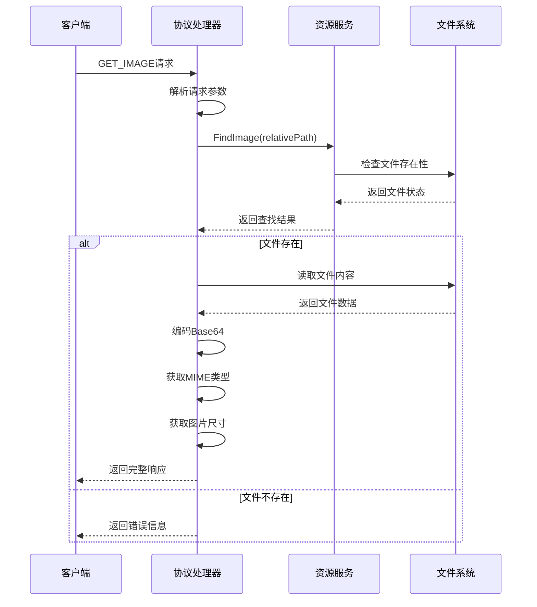
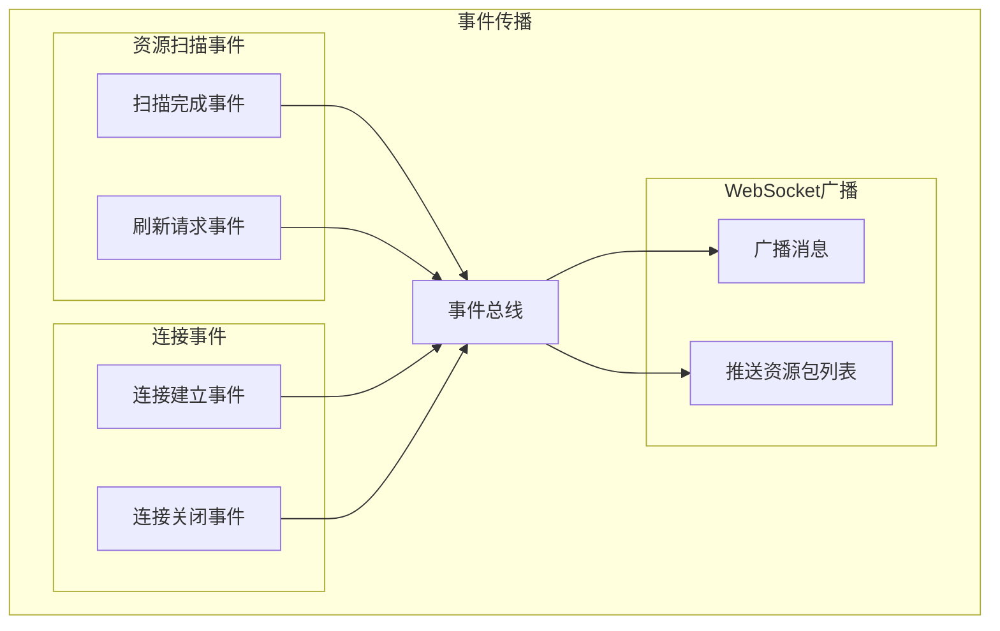
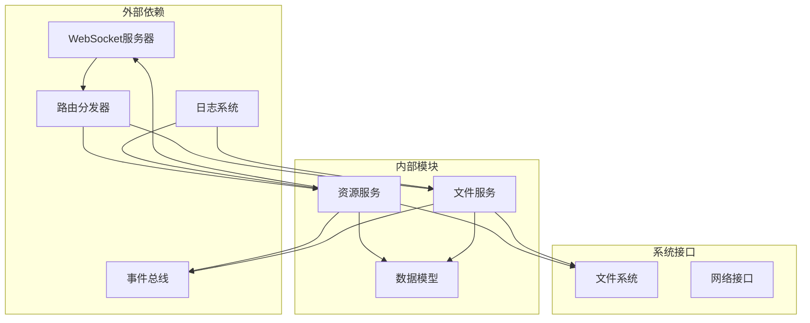

# 资源服务模块

<cite>
**本文档引用的文件**
- [resource_service.go](file://LocalBridge/internal/service/resource/resource_service.go)
- [resource.go](file://LocalBridge/pkg/models/resource.go)
- [handler.go](file://LocalBridge/internal/protocol/resource/handler.go)
- [eventbus.go](file://LocalBridge/internal/eventbus/eventbus.go)
- [websocket.go](file://LocalBridge/internal/server/websocket.go)
- [router.go](file://LocalBridge/internal/router/router.go)
- [config.go](file://LocalBridge/internal/config/config.go)
- [paths.go](file://LocalBridge/internal/paths/paths.go)
- [file_service.go](file://LocalBridge/internal/service/file/file_service.go)
- [scanner.go](file://LocalBridge/internal/service/file/scanner.go)
- [watcher.go](file://LocalBridge/internal/service/file/watcher.go)
- [file.go](file://LocalBridge/pkg/models/file.go)
- [default_pipeline.json](file://LocalBridge/test-json/base/default_pipeline.json)
- [连续作战.json](file://LocalBridge/test-json/base/pipeline/开荒功能/连续作战.json)
</cite>

## 目录
1. [简介](#简介)
2. [项目结构](#项目结构)
3. [核心组件](#核心组件)
4. [架构概览](#架构概览)
5. [详细组件分析](#详细组件分析)
6. [依赖关系分析](#依赖关系分析)
7. [性能考虑](#性能考虑)
8. [故障排查指南](#故障排查指南)
9. [结论](#结论)
10. [附录](#附录)

## 简介

资源服务模块是本地桥接服务(LocalBridge)中的核心组件，负责MaaFramework资源包的发现、管理和提供。该模块实现了完整的资源生命周期管理，包括资源包自动发现、文件类型识别、元数据提取、索引构建、缓存策略、并发安全控制等关键功能。

资源服务主要服务于工作流编辑器，为用户提供资源包管理、图片资源检索、实时文件监控等功能。通过事件驱动的架构设计，资源服务能够及时响应文件系统变化，保持资源索引的实时性和准确性。

## 项目结构

资源服务模块采用分层架构设计，主要包含以下层次：



**图表来源**
- [resource_service.go:14-31](file://LocalBridge/internal/service/resource/resource_service.go#L14-L31)
- [handler.go:22-43](file://LocalBridge/internal/protocol/resource/handler.go#L22-L43)
- [router.go:28-47](file://LocalBridge/internal/router/router.go#L28-L47)

**章节来源**
- [resource_service.go:1-359](file://LocalBridge/internal/service/resource/resource_service.go#L1-L359)
- [handler.go:1-272](file://LocalBridge/internal/protocol/resource/handler.go#L1-L272)
- [router.go:1-151](file://LocalBridge/internal/router/router.go#L1-L151)

## 核心组件

资源服务模块包含以下核心组件：

### 1. 资源服务(Service)
- **职责**: 负责资源包的扫描、索引维护和资源查询
- **特性**: 线程安全、支持增量更新、事件驱动
- **关键方法**: Start()、Scan()、GetBundleList()、FindImage()

### 2. 资源协议处理器(Handler)
- **职责**: 处理前端资源请求，提供HTTP API接口
- **特性**: 支持单图获取、批量获取、图片列表查询
- **关键方法**: handleGetImage()、handleGetImages()、handleGetImageList()

### 3. 事件总线(EventBus)
- **职责**: 实现组件间解耦通信
- **特性**: 支持同步和异步事件发布
- **关键事件**: EventResourceScanCompleted、EventConnectionEstablished

### 4. 资源模型(Resource Models)
- **ResourceBundle**: 资源包信息封装
- **ImageFileInfo**: 图片文件信息
- **GetImageResponse**: 图片响应数据结构

**章节来源**
- [resource_service.go:14-31](file://LocalBridge/internal/service/resource/resource_service.go#L14-L31)
- [resource.go:3-67](file://LocalBridge/pkg/models/resource.go#L3-L67)
- [eventbus.go:16-27](file://LocalBridge/internal/eventbus/eventbus.go#L16-L27)

## 架构概览

资源服务采用事件驱动的微服务架构，通过清晰的职责分离实现松耦合设计：



**图表来源**
- [handler.go:55-69](file://LocalBridge/internal/protocol/resource/handler.go#L55-L69)
- [resource_service.go:33-46](file://LocalBridge/internal/service/resource/resource_service.go#L33-L46)
- [eventbus.go:37-51](file://LocalBridge/internal/eventbus/eventbus.go#L37-L51)

### 数据流架构



**图表来源**
- [resource_service.go:48-68](file://LocalBridge/internal/service/resource/resource_service.go#L48-L68)
- [handler.go:71-84](file://LocalBridge/internal/protocol/resource/handler.go#L71-L84)

## 详细组件分析

### 资源服务核心实现

资源服务的核心实现包含完整的资源发现和管理逻辑：

#### 资源发现机制

资源服务采用智能的资源包发现算法，通过检查目录结构特征来识别MaaFramework资源包：



**图表来源**
- [resource_service.go:14-31](file://LocalBridge/internal/service/resource/resource_service.go#L14-L31)
- [resource.go:3-13](file://LocalBridge/pkg/models/resource.go#L3-L13)

#### 文件类型识别

资源服务实现了严格的文件类型识别机制，支持多种图片格式：

| 支持的图片格式 | 扩展名 | MIME类型 |
|---------------|--------|----------|
| PNG | .png | image/png |
| JPEG | .jpg, .jpeg | image/jpeg |
| GIF | .gif | image/gif |
| WebP | .webp | image/webp |
| BMP | .bmp | image/bmp |

#### 元数据提取和索引构建

资源服务在扫描过程中自动提取和构建资源元数据索引：



**图表来源**
- [resource_service.go:121-153](file://LocalBridge/internal/service/resource/resource_service.go#L121-L153)
- [resource_service.go:297-334](file://LocalBridge/internal/service/resource/resource_service.go#L297-L334)

**章节来源**
- [resource_service.go:48-153](file://LocalBridge/internal/service/resource/resource_service.go#L48-L153)
- [resource_service.go:230-238](file://LocalBridge/internal/service/resource/resource_service.go#L230-L238)

### 并发安全和缓存策略

资源服务采用读写锁实现高效的并发控制：

#### 并发控制机制



**图表来源**
- [resource_service.go:18-19](file://LocalBridge/internal/service/resource/resource_service.go#L18-L19)
- [resource_service.go:156-173](file://LocalBridge/internal/service/resource/resource_service.go#L156-L173)

#### 内存管理策略

资源服务采用懒加载和索引缓存相结合的内存管理策略：

1. **索引缓存**: 扫描结果存储在内存中，避免重复扫描
2. **按需加载**: 图片数据按需读取，支持Base64编码传输
3. **资源释放**: 通过Go的垃圾回收机制自动管理内存

**章节来源**
- [resource_service.go:156-173](file://LocalBridge/internal/service/resource/resource_service.go#L156-L173)
- [resource_service.go:336-358](file://LocalBridge/internal/service/resource/resource_service.go#L336-L358)

### 访问权限控制

资源服务实现了多层次的安全控制机制：

#### 路径安全验证



**图表来源**
- [file_service.go:345-359](file://LocalBridge/internal/service/file/file_service.go#L345-L359)

**章节来源**
- [file_service.go:123-156](file://LocalBridge/internal/service/file/file_service.go#L123-L156)
- [file_service.go:345-359](file://LocalBridge/internal/service/file/file_service.go#L345-L359)

### 资源查询接口

资源服务提供完整的查询接口，支持多种查询场景：

#### API接口定义

| 接口路径 | 方法 | 功能描述 | 请求参数 | 响应数据 |
|---------|------|----------|----------|----------|
| /etl/get_image | POST | 获取单张图片 | GetImageRequest | GetImageResponse |
| /etl/get_images | POST | 批量获取图片 | GetImagesRequest | GetImagesResponse |
| /etl/get_image_list | POST | 获取图片列表 | GetImageListRequest | GetImageListResponse |
| /etl/refresh_resources | POST | 刷新资源列表 | - | - |

#### 查询处理流程



**图表来源**
- [handler.go:71-182](file://LocalBridge/internal/protocol/resource/handler.go#L71-L182)
- [resource_service.go:175-193](file://LocalBridge/internal/service/resource/resource_service.go#L175-L193)

**章节来源**
- [handler.go:55-137](file://LocalBridge/internal/protocol/resource/handler.go#L55-L137)
- [resource.go:22-67](file://LocalBridge/pkg/models/resource.go#L22-L67)

### 资源变更通知和事件传播

资源服务通过事件总线实现资源变更的实时通知：

#### 事件传播机制



**图表来源**
- [eventbus.go:74-82](file://LocalBridge/internal/eventbus/eventbus.go#L74-L82)
- [handler.go:219-245](file://LocalBridge/internal/protocol/resource/handler.go#L219-L245)

#### 状态同步机制

资源服务通过WebSocket实现实时状态同步：

1. **连接建立**: 自动推送当前资源包列表
2. **扫描完成**: 广播最新的资源包信息
3. **增量更新**: 支持部分资源包的增量更新

**章节来源**
- [eventbus.go:29-56](file://LocalBridge/internal/eventbus/eventbus.go#L29-L56)
- [handler.go:234-245](file://LocalBridge/internal/protocol/resource/handler.go#L234-L245)

## 依赖关系分析

资源服务模块的依赖关系呈现清晰的分层结构：



**图表来源**
- [resource_service.go:3-12](file://LocalBridge/internal/service/resource/resource_service.go#L3-L12)
- [handler.go:3-20](file://LocalBridge/internal/protocol/resource/handler.go#L3-L20)

### 关键依赖关系

1. **事件总线依赖**: 资源服务通过事件总线实现松耦合通信
2. **WebSocket集成**: 实现与前端的实时双向通信
3. **文件系统访问**: 直接操作文件系统进行资源扫描
4. **路由分发**: 通过路由器实现HTTP请求的统一处理

**章节来源**
- [resource_service.go:3-12](file://LocalBridge/internal/service/resource/resource_service.go#L3-L12)
- [handler.go:3-20](file://LocalBridge/internal/protocol/resource/handler.go#L3-L20)

## 性能考虑

资源服务在设计时充分考虑了性能优化，采用多种策略提升系统效率：

### 性能优化策略

#### 1. 缓存优化
- **索引缓存**: 扫描结果持久化在内存中
- **文件存在性缓存**: 避免重复的文件系统查询
- **Base64缓存**: 图片数据的Base64编码结果缓存

#### 2. 并发优化
- **读写分离**: 使用读写锁实现高并发读取
- **异步处理**: 事件处理采用异步模式
- **批量操作**: 支持批量图片获取减少网络往返

#### 3. I/O优化
- **延迟扫描**: 首次启动时进行完整扫描，后续增量更新
- **文件大小限制**: 避免处理超大文件造成内存压力
- **路径规范化**: 统一路径格式减少比较开销

### 性能监控指标

| 指标类型 | 目标值 | 监控方法 |
|---------|--------|----------|
| 扫描时间 | < 5秒 | 记录扫描开始/结束时间 |
| 并发查询 | 支持100+同时请求 | 压力测试 |
| 内存使用 | < 100MB | Go内存分析工具 |
| 响应时间 | < 100ms | API性能监控 |

## 故障排查指南

### 常见问题及解决方案

#### 1. 资源扫描失败

**症状**: 资源包列表为空或扫描报错

**可能原因**:
- 根目录权限不足
- 磁盘空间不足
- 路径包含特殊字符

**解决步骤**:
1. 检查根目录访问权限
2. 验证磁盘空间充足
3. 确认路径格式正确

#### 2. 图片获取失败

**症状**: /etl/get_image接口返回错误

**可能原因**:
- 图片文件损坏
- 路径编码问题
- 权限不足

**解决步骤**:
1. 验证图片文件完整性
2. 检查相对路径格式
3. 确认文件访问权限

#### 3. WebSocket连接异常

**症状**: 前端无法接收资源更新

**可能原因**:
- 端口被占用
- 网络防火墙阻拦
- 服务器过载

**解决步骤**:
1. 更换WebSocket端口
2. 检查防火墙设置
3. 监控服务器负载

**章节来源**
- [resource_service.go:336-358](file://LocalBridge/internal/service/resource/resource_service.go#L336-L358)
- [handler.go:261-271](file://LocalBridge/internal/protocol/resource/handler.go#L261-L271)

### 调试工具和方法

#### 1. 日志分析
- 启用DEBUG级别日志
- 监控资源扫描过程
- 跟踪事件传播路径

#### 2. 性能分析
- 使用pprof分析CPU使用
- 监控内存分配情况
- 检查goroutine数量

#### 3. 网络诊断
- 检查WebSocket连接状态
- 验证API接口可用性
- 监控网络延迟

## 结论

资源服务模块通过精心设计的架构和实现，为MaaPipelineEditor提供了强大而可靠的资源管理能力。模块采用了事件驱动、并发安全、缓存优化等现代软件工程最佳实践，确保了系统的高性能和高可用性。

主要优势包括：
1. **模块化设计**: 清晰的职责分离和接口定义
2. **事件驱动**: 实现组件间的松耦合通信
3. **并发安全**: 采用读写锁等机制保证线程安全
4. **性能优化**: 缓存策略和异步处理提升响应速度
5. **扩展性强**: 支持插件化的协议处理器

未来可以考虑的改进方向：
1. 增加资源预加载机制
2. 实现资源版本管理
3. 添加资源压缩存储
4. 优化大文件处理性能

## 附录

### 配置参数说明

| 配置项 | 类型 | 默认值 | 描述 |
|-------|------|--------|------|
| server.port | int | 9066 | 服务器监听端口 |
| server.host | string | localhost | 服务器绑定地址 |
| file.root | string | ./ | 文件扫描根目录 |
| file.exclude | array | ["node_modules",".git"] | 排除目录列表 |
| file.extensions | array | [".json",".jsonc"] | 文件扩展名过滤 |
| file.max_depth | int | 10 | 最大扫描深度 |
| file.max_files | int | 10000 | 最大文件数量 |

### API使用示例

#### 获取单张图片
```json
{
  "path": "/etl/get_image",
  "data": {
    "relative_path": "image/common/background.png"
  }
}
```

#### 批量获取图片
```json
{
  "path": "/etl/get_images",
  "data": {
    "relative_paths": [
      "image/common/button.png",
      "image/common/icon.png"
    ]
  }
}
```

#### 获取图片列表
```json
{
  "path": "/etl/get_image_list",
  "data": {
    "pipeline_path": "/projects/myproject/pipeline/main.json"
  }
}
```

### 最佳实践指导

#### 1. 资源组织规范
- 按功能模块组织资源包
- 统一图片命名规范
- 合理使用层级目录结构

#### 2. 性能优化建议
- 控制资源包数量规模
- 优化图片格式和质量
- 合理设置扫描深度

#### 3. 安全注意事项
- 定期检查文件访问权限
- 监控异常文件访问行为
- 实施文件完整性校验