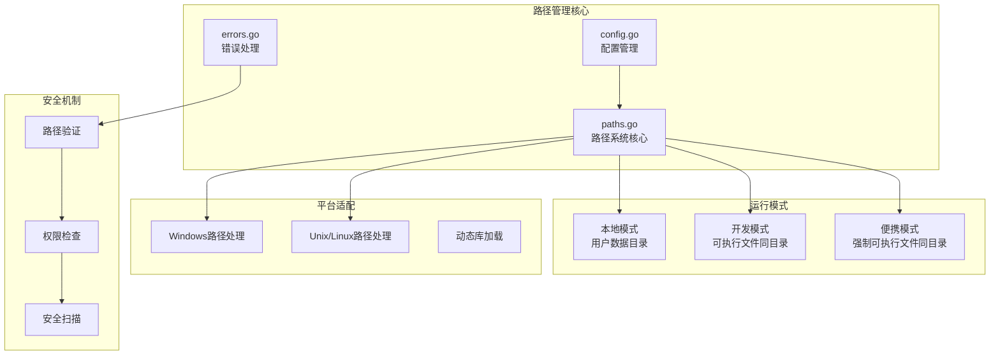
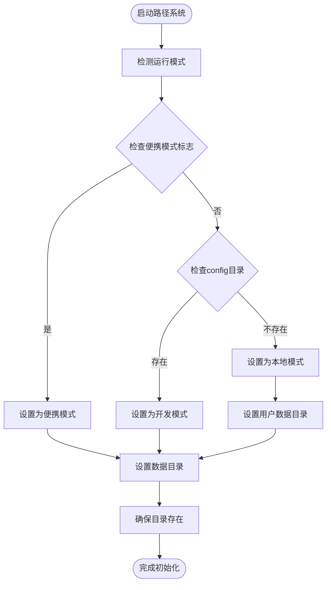
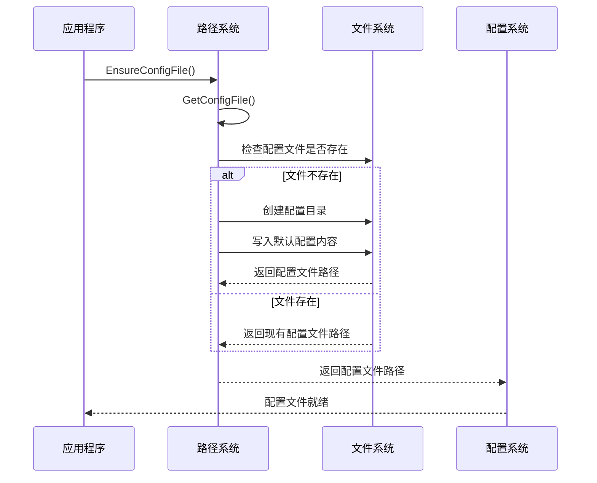
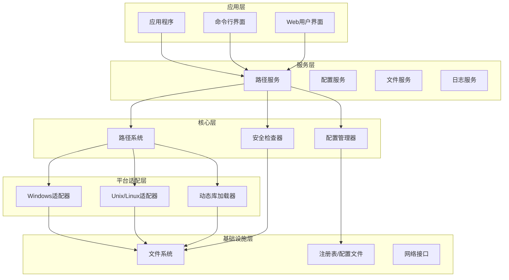
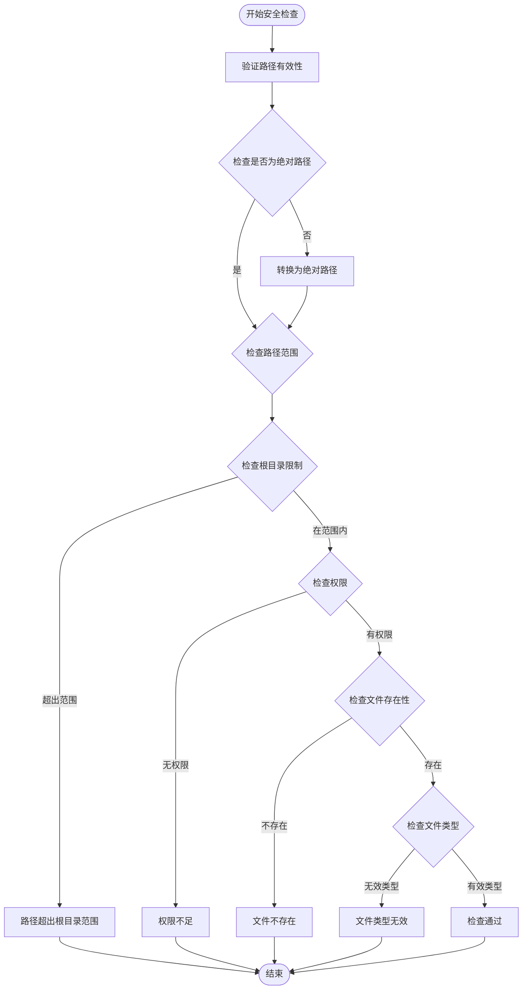
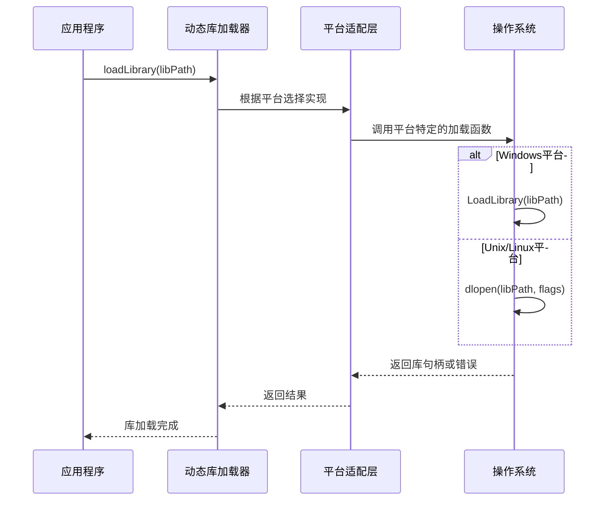
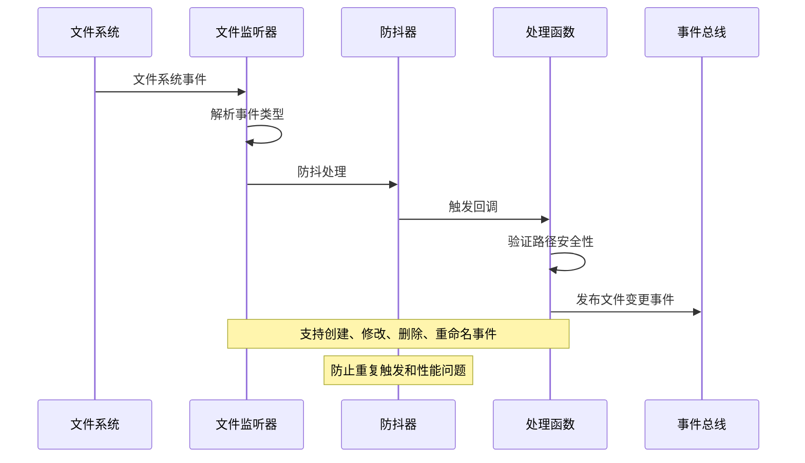
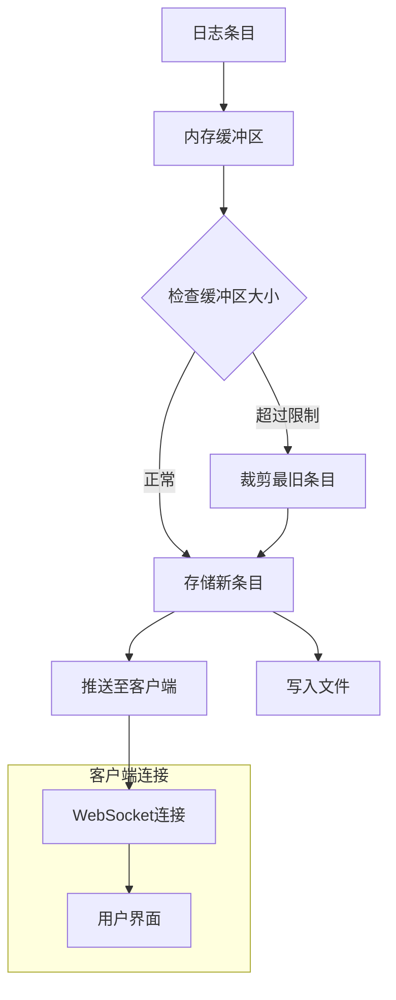
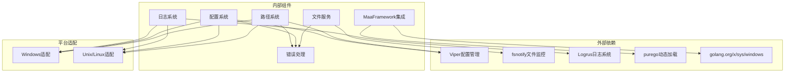

# 路径管理系统

<cite>
**本文档引用的文件**
- [paths.go](file://LocalBridge/internal/paths/paths.go)
- [main.go](file://LocalBridge/cmd/lb/main.go)
- [config.go](file://LocalBridge/internal/config/config.go)
- [errors.go](file://LocalBridge/internal/errors/errors.go)
- [logger.go](file://LocalBridge/internal/logger/logger.go)
- [file_service.go](file://LocalBridge/internal/service/file/file_service.go)
- [watcher.go](file://LocalBridge/internal/service/file/watcher.go)
- [path_unix.go](file://LocalBridge/internal/mfw/path_unix.go)
- [path_windows.go](file://LocalBridge/internal/mfw/path_windows.go)
- [lib_loader_unix.go](file://LocalBridge/internal/mfw/lib_loader_unix.go)
- [lib_loader_windows.go](file://LocalBridge/internal/mfw/lib_loader_windows.go)
- [default.json](file://LocalBridge/config/default.json)
</cite>

## 目录
1. [简介](#简介)
2. [项目结构](#项目结构)
3. [核心组件](#核心组件)
4. [架构概览](#架构概览)
5. [详细组件分析](#详细组件分析)
6. [依赖关系分析](#依赖关系分析)
7. [性能考虑](#性能考虑)
8. [故障排除指南](#故障排除指南)
9. [结论](#结论)
10. [附录](#附录)

## 简介

LocalBridge 路径管理系统是一个跨平台的路径管理解决方案，负责应用程序在不同操作系统上的文件路径解析、目录创建和路径安全验证。该系统支持三种运行模式：本地模式、开发模式和便携模式，并提供了完整的路径安全检查机制。

系统的主要目标是：
- 统一跨平台的路径管理
- 提供灵活的配置文件管理
- 实现路径安全验证和权限控制
- 支持动态路径变更和缓存策略
- 提供详细的错误处理和日志记录

## 项目结构

LocalBridge 路径管理系统主要分布在以下关键目录中：



**图表来源**
- [paths.go:1-238](file://LocalBridge/internal/paths/paths.go#L1-L238)
- [config.go:1-339](file://LocalBridge/internal/config/config.go#L1-L339)

**章节来源**
- [paths.go:1-238](file://LocalBridge/internal/paths/paths.go#L1-L238)
- [main.go:1-882](file://LocalBridge/cmd/lb/main.go#L1-L882)

## 核心组件

### 路径系统核心

路径系统采用单例模式设计，确保在整个应用程序生命周期中只有一个路径管理实例。系统支持三种运行模式，每种模式都有其特定的用途和行为特征。

#### 运行模式详解

| 模式类型 | 目录位置 | 用途 | 特征 |
|---------|----------|------|------|
| 本地模式 (ModeUser) | 系统用户数据目录 | 生产环境默认模式 | 使用平台标准用户配置目录 |
| 开发模式 (ModeDev) | 可执行文件同目录 | 开发和测试环境 | 自动检测 config 目录的存在 |
| 便携模式 (ModePortable) | 可执行文件同目录 | 移动设备和便携使用 | 强制使用可执行文件同目录 |

#### 路径解析规则

系统采用智能路径解析机制，根据运行模式和平台特性动态确定各个路径的位置：



**图表来源**
- [paths.go:46-87](file://LocalBridge/internal/paths/paths.go#L46-L87)
- [paths.go:116-119](file://LocalBridge/internal/paths/paths.go#L116-L119)

**章节来源**
- [paths.go:15-87](file://LocalBridge/internal/paths/paths.go#L15-L87)
- [paths.go:116-176](file://LocalBridge/internal/paths/paths.go#L116-L176)

### 配置文件管理

系统提供了灵活的配置文件管理机制，支持多种配置文件格式和自动创建功能。

#### 配置文件类型

| 文件类型 | 位置 | 用途 | 优先级 |
|---------|------|------|--------|
| default.json | 开发模式下的 config/ 目录 | 开发环境默认配置 | 高 |
| config.json | 数据目录下的 config/ 目录 | 用户自定义配置 | 中 |
| 内置默认值 | 程序代码中的默认配置 | 系统备份配置 | 低 |

#### 配置文件创建流程



**图表来源**
- [paths.go:220-237](file://LocalBridge/internal/paths/paths.go#L220-L237)
- [config.go:54-95](file://LocalBridge/internal/config/config.go#L54-L95)

**章节来源**
- [paths.go:151-170](file://LocalBridge/internal/paths/paths.go#L151-L170)
- [paths.go:192-237](file://LocalBridge/internal/paths/paths.go#L192-L237)
- [config.go:54-123](file://LocalBridge/internal/config/config.go#L54-L123)

### 目录创建机制

系统实现了统一的目录创建机制，确保所有必要的目录在应用程序启动时都存在。

#### 目录层次结构

```mermaid
graph TD
DataDir[数据目录] --> ConfigDir[配置目录<br/>config/]
DataDir --> LogDir[日志目录<br/>logs/]
DataDir --> ExeDir[可执行文件目录<br/>(便携模式)]
ConfigDir --> DefaultJson[default.json<br/>(开发模式)]
ConfigDir --> ConfigJson[config.json<br/>(用户配置)]
subgraph "平台特定路径"
Win[Windows<br/>%APPDATA%/MaaPipelineEditor/LocalBridge]
Mac[macOS<br/>~/Library/Application Support/MaaPipelineEditor/LocalBridge]
Linux[Linux<br/>~/.config/MaaPipelineEditor/LocalBridge]
end
DataDir -.-> Win
DataDir -.-> Mac
DataDir -.-> Linux
```

**图表来源**
- [paths.go:139-176](file://LocalBridge/internal/paths/paths.go#L139-L176)
- [paths.go:89-114](file://LocalBridge/internal/paths/paths.go#L89-L114)

**章节来源**
- [paths.go:178-190](file://LocalBridge/internal/paths/paths.go#L178-L190)
- [paths.go:116-119](file://LocalBridge/internal/paths/paths.go#L116-L119)

## 架构概览

LocalBridge 路径管理系统采用分层架构设计，每个层级都有明确的职责和边界。



**图表来源**
- [paths.go:1-238](file://LocalBridge/internal/paths/paths.go#L1-L238)
- [main.go:182-440](file://LocalBridge/cmd/lb/main.go#L182-L440)

**章节来源**
- [main.go:182-440](file://LocalBridge/cmd/lb/main.go#L182-L440)
- [paths.go:1-238](file://LocalBridge/internal/paths/paths.go#L1-L238)

## 详细组件分析

### 路径系统类图

```mermaid
classDiagram
class Paths {
+Mode currentMode
+string dataDir
+string exeDir
+bool forcePortable
+SetPortableMode(portable bool)
+Init()
+detectMode() Mode
+getUserDataDir() string
+ensureDir(dir string) error
+GetMode() Mode
+GetModeName() string
+GetDataDir() string
+GetExeDir() string
+GetConfigDir() string
+GetConfigFile() string
+GetLogDir() string
+EnsureAllDirs() error
+GetDefaultConfigContent() []byte
+EnsureConfigFile() (string, error)
}
class Config {
+ServerConfig server
+FileConfig file
+LogConfig log
+MaaFWConfig maafw
+Load(configPath string) *Config
+GetGlobal() *Config
+normalize() error
+OverrideFromFlags(root, logDir, logLevel string, port int)
+Save() error
+SetMaaFWLibDir(libDir string) error
+SetMaaFWResourceDir(resourceDir string) error
+CheckRootSafety() SafetyCheckResult
}
class Logger {
+Init(logLevel string, logDir string, pushToClient bool) error
+Info(module, message string, args ...interface{})
+Warn(module, message string, args ...interface{})
+Error(module, message string, args ...interface{})
+Debug(module, message string, args ...interface{})
+GetHistoryLogs() []LogEntry
+SetPushFunc(fn LogPushFunc)
}
class FileService {
+string root
+validatePath(path string) error
+processFileChange(change FileChange)
}
class ErrorHandler {
+string code
+string message
+interface{} detail
+error err
+New(code, message string) *LBError
+Wrap(code, message string, err error) *LBError
+WithDetail(detail interface{}) *LBError
+ToErrorData() models.ErrorData
}
Paths --> Config : "使用"
Config --> ErrorHandler : "创建"
FileService --> ErrorHandler : "使用"
Logger --> Paths : "使用"
```

**图表来源**
- [paths.go:10-176](file://LocalBridge/internal/paths/paths.go#L10-L176)
- [config.go:42-95](file://LocalBridge/internal/config/config.go#L42-L95)
- [logger.go:13-100](file://LocalBridge/internal/logger/logger.go#L13-L100)
- [file_service.go:345-359](file://LocalBridge/internal/service/file/file_service.go#L345-L359)
- [errors.go:22-50](file://LocalBridge/internal/errors/errors.go#L22-L50)

**章节来源**
- [paths.go:10-176](file://LocalBridge/internal/paths/paths.go#L10-L176)
- [config.go:42-95](file://LocalBridge/internal/config/config.go#L42-L95)
- [logger.go:13-100](file://LocalBridge/internal/logger/logger.go#L13-L100)

### 路径安全检查机制

系统实现了多层次的安全检查机制，确保文件操作的安全性和可靠性。

#### 安全检查流程



**图表来源**
- [file_service.go:345-359](file://LocalBridge/internal/service/file/file_service.go#L345-L359)
- [config.go:235-296](file://LocalBridge/internal/config/config.go#L235-L296)

**章节来源**
- [file_service.go:345-359](file://LocalBridge/internal/service/file/file_service.go#L345-L359)
- [config.go:235-296](file://LocalBridge/internal/config/config.go#L235-L296)

### 跨平台兼容性处理

系统针对不同操作系统实现了专门的适配层，确保在各种平台上的正确运行。

#### 平台特定实现

| 平台 | 路径分隔符 | 用户目录 | 系统目录 | 特殊处理 |
|------|------------|----------|----------|----------|
| Windows | `\` | `%APPDATA%` | `C:\Program Files` | 短路径名支持 |
| macOS | `/` | `~/Library/Application Support` | `/usr`, `/System` | 符号链接处理 |
| Linux | `/` | `~/.config` | `/usr`, `/var` | XDG规范支持 |

#### 动态库加载机制



**图表来源**
- [lib_loader_windows.go:11-21](file://LocalBridge/internal/mfw/lib_loader_windows.go#L11-L21)
- [lib_loader_unix.go:11-19](file://LocalBridge/internal/mfw/lib_loader_unix.go#L11-L19)

**章节来源**
- [path_unix.go:7-22](file://LocalBridge/internal/mfw/path_unix.go#L7-L22)
- [path_windows.go:22-57](file://LocalBridge/internal/mfw/path_windows.go#L22-L57)
- [lib_loader_windows.go:11-21](file://LocalBridge/internal/mfw/lib_loader_windows.go#L11-L21)
- [lib_loader_unix.go:11-19](file://LocalBridge/internal/mfw/lib_loader_unix.go#L11-L19)

### 路径变更处理机制

系统实现了高效的路径变更检测和处理机制，支持实时监控文件系统变化。

#### 文件变更监控流程



**图表来源**
- [watcher.go:95-188](file://LocalBridge/internal/service/file/watcher.go#L95-L188)
- [file_service.go:296-343](file://LocalBridge/internal/service/file/file_service.go#L296-L343)

**章节来源**
- [watcher.go:95-188](file://LocalBridge/internal/service/file/watcher.go#L95-L188)
- [file_service.go:296-343](file://LocalBridge/internal/service/file/file_service.go#L296-L343)

### 缓存策略

系统采用了多层缓存策略来提高性能和响应速度。

#### 缓存层次结构

| 缓存类型 | 存储位置 | 缓存内容 | 生命周期 | 清理策略 |
|----------|----------|----------|----------|----------|
| 日志缓存 | 内存 | 历史日志条目 | 最近N条 | 固定大小限制 |
| 文件索引 | 内存 | 文件元数据 | 运行时 | 文件变更时更新 |
| 路径缓存 | 内存 | 解析后的路径 | 运行时 | 系统重启清除 |
| 配置缓存 | 文件系统 | 序列化的配置 | 持久化 | 配置变更时更新 |

#### 日志缓存机制



**图表来源**
- [logger.go:117-162](file://LocalBridge/internal/logger/logger.go#L117-L162)
- [logger.go:107-115](file://LocalBridge/internal/logger/logger.go#L107-L115)

**章节来源**
- [logger.go:117-162](file://LocalBridge/internal/logger/logger.go#L117-L162)
- [logger.go:107-115](file://LocalBridge/internal/logger/logger.go#L107-L115)

## 依赖关系分析

### 组件依赖图



**图表来源**
- [paths.go:3-8](file://LocalBridge/internal/paths/paths.go#L3-L8)
- [config.go:3-11](file://LocalBridge/internal/config/config.go#L3-L11)
- [logger.go:3-11](file://LocalBridge/internal/logger/logger.go#L3-L11)

**章节来源**
- [paths.go:3-8](file://LocalBridge/internal/paths/paths.go#L3-L8)
- [config.go:3-11](file://LocalBridge/internal/config/config.go#L3-L11)
- [logger.go:3-11](file://LocalBridge/internal/logger/logger.go#L3-L11)

### 循环依赖检查

经过分析，路径管理系统没有发现循环依赖关系。各模块之间的依赖关系清晰且单向，符合良好的软件工程实践。

## 性能考虑

### 性能优化策略

1. **延迟初始化**: 路径系统采用延迟初始化机制，只有在首次访问时才进行初始化，避免不必要的启动开销。

2. **缓存机制**: 实现了多层缓存策略，包括内存缓存和文件系统缓存，减少重复计算和磁盘I/O操作。

3. **异步处理**: 文件监控采用异步处理机制，避免阻塞主线程，提高响应性能。

4. **资源池**: 动态库加载器使用资源池技术，复用已加载的库实例，减少内存占用。

### 性能监控指标

| 指标类型 | 目标值 | 监控方法 | 警告阈值 |
|----------|--------|----------|----------|
| 路径解析时间 | < 1ms | 时间戳测量 | < 10ms |
| 文件监控延迟 | < 300ms | 防抖器统计 | < 1s |
| 日志写入延迟 | < 50ms | 缓冲区监控 | < 200ms |
| 内存使用 | < 50MB | GC统计 | < 100MB |
| CPU使用率 | < 10% | 系统监控 | < 50% |

## 故障排除指南

### 常见问题及解决方案

#### 路径权限问题

**问题症状**: 应用程序无法创建配置文件或访问特定目录

**诊断步骤**:
1. 检查用户权限是否足够
2. 验证目标目录是否存在
3. 确认磁盘空间充足
4. 检查防病毒软件拦截

**解决方案**:
- 以管理员身份运行应用程序
- 手动创建缺失的目录
- 调整目录权限设置
- 临时禁用防病毒软件进行测试

#### 跨平台兼容性问题

**问题症状**: 在特定操作系统上出现路径解析错误

**诊断步骤**:
1. 检查操作系统版本和架构
2. 验证路径分隔符使用
3. 确认环境变量设置
4. 测试平台特定功能

**解决方案**:
- 使用相对路径而非绝对路径
- 避免使用平台特定的特殊字符
- 在代码中进行平台检测
- 提供降级处理机制

#### 配置文件损坏

**问题症状**: 应用程序启动失败或配置丢失

**诊断步骤**:
1. 检查配置文件格式
2. 验证JSON语法
3. 确认必需字段存在
4. 比较默认配置

**解决方案**:
- 备份当前配置文件
- 删除损坏的配置文件
- 重新生成默认配置
- 逐步恢复自定义设置

**章节来源**
- [errors.go:10-141](file://LocalBridge/internal/errors/errors.go#L10-L141)
- [config.go:235-296](file://LocalBridge/internal/config/config.go#L235-L296)

### 调试技巧

1. **启用详细日志**: 使用 `--log-level DEBUG` 参数获取详细调试信息
2. **路径信息检查**: 使用 `mpelb info` 命令查看当前路径配置
3. **权限验证**: 使用 `ls -la` (Linux/macOS) 或 `dir` (Windows) 检查目录权限
4. **网络连通性**: 使用 `ping localhost` 验证本地网络配置

## 结论

LocalBridge 路径管理系统是一个设计精良、功能完善的跨平台路径管理解决方案。系统通过合理的架构设计、严格的错误处理和全面的安全检查，为应用程序提供了可靠的路径管理能力。

### 主要优势

1. **跨平台兼容性**: 完美支持 Windows、macOS 和 Linux 系统
2. **灵活的运行模式**: 支持本地、开发和便携三种模式
3. **强大的安全机制**: 多层次的安全检查和权限验证
4. **高性能设计**: 优化的缓存策略和异步处理机制
5. **易于维护**: 清晰的代码结构和完善的文档

### 技术亮点

- 智能路径解析和自动创建机制
- 详细的错误处理和用户友好的错误信息
- 完善的跨平台适配层
- 高效的文件监控和变更处理
- 多层缓存策略提升性能

该系统为 LocalBridge 提供了坚实的基础，确保了应用程序在各种环境下的稳定运行。

## 附录

### 最佳实践指南

#### 路径配置最佳实践

1. **使用相对路径**: 优先使用相对于应用程序根目录的相对路径
2. **避免硬编码**: 不要在代码中硬编码绝对路径
3. **环境变量**: 使用环境变量来配置可变路径
4. **配置文件分离**: 将路径配置与业务逻辑分离

#### 安全配置最佳实践

1. **最小权限原则**: 为应用程序分配最小必要的文件系统权限
2. **路径验证**: 始终验证用户提供的路径参数
3. **沙箱隔离**: 在可能的情况下使用文件系统沙箱
4. **定期审计**: 定期检查文件访问日志和权限设置

#### 性能优化最佳实践

1. **缓存策略**: 合理使用缓存机制，避免过度缓存
2. **异步处理**: 对耗时操作使用异步处理
3. **资源管理**: 及时释放不再使用的资源
4. **监控指标**: 建立性能监控和告警机制

### 常见问题解答

**问**: 如何切换运行模式？
**答**: 使用 `--portable` 参数强制便携模式，或确保可执行文件旁存在 `config/` 目录启用开发模式。

**问**: 配置文件在哪里存储？
**答**: 在本地模式下存储在用户数据目录，在便携模式下存储在可执行文件同目录。

**问**: 如何解决权限问题？
**答**: 检查用户权限、目录所有权和SELinux/AppArmor配置。

**问**: 如何调试路径问题？
**答**: 使用 `mpelb info` 命令查看路径信息，启用详细日志模式进行调试。