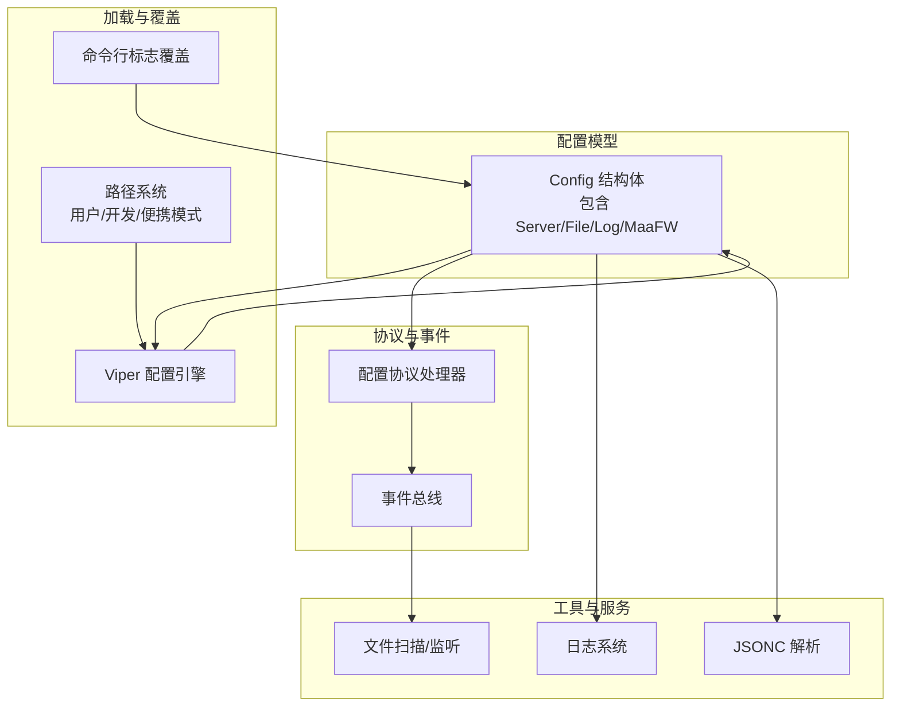
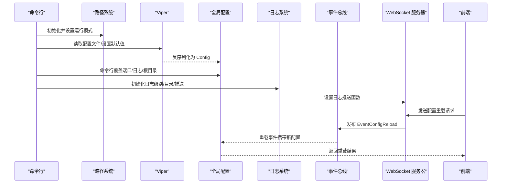
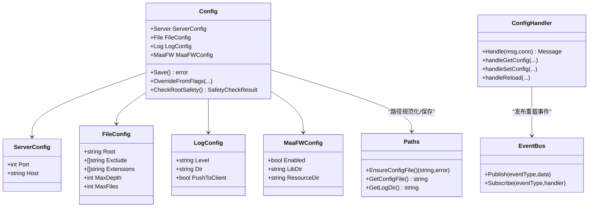

# 配置管理系统

<cite>
**本文档引用的文件**
- [LocalBridge/config/default.json](file://LocalBridge/config/default.json)
- [LocalBridge/internal/config/config.go](file://LocalBridge/internal/config/config.go)
- [LocalBridge/internal/paths/paths.go](file://LocalBridge/internal/paths/paths.go)
- [LocalBridge/internal/utils/jsonc.go](file://LocalBridge/internal/utils/jsonc.go)
- [LocalBridge/cmd/lb/main.go](file://LocalBridge/cmd/lb/main.go)
- [LocalBridge/internal/eventbus/eventbus.go](file://LocalBridge/internal/eventbus/eventbus.go)
- [LocalBridge/internal/protocol/config/handler.go](file://LocalBridge/internal/protocol/config/handler.go)
- [LocalBridge/internal/logger/logger.go](file://LocalBridge/internal/logger/logger.go)
- [LocalBridge/internal/service/file/watcher.go](file://LocalBridge/internal/service/file/watcher.go)
- [LocalBridge/internal/service/file/scanner.go](file://LocalBridge/internal/service/file/scanner.go)
</cite>

## 目录
1. [简介](#简介)
2. [项目结构](#项目结构)
3. [核心组件](#核心组件)
4. [架构总览](#架构总览)
5. [详细组件分析](#详细组件分析)
6. [依赖关系分析](#依赖关系分析)
7. [性能考量](#性能考量)
8. [故障排查指南](#故障排查指南)
9. [结论](#结论)
10. [附录](#附录)

## 简介
本文件系统性阐述 LocalBridge 的配置管理系统，涵盖配置文件结构、默认配置、命令行覆盖机制、加载顺序、验证规则、热重载能力，以及服务器、文件扫描、日志、MFW 等配置项的作用与影响。同时给出安全考虑、敏感信息保护、备份恢复建议，并提供优化与排障方法。

## 项目结构
LocalBridge 的配置管理由以下层次构成：
- 配置模型层：定义服务器、文件、日志、MaaFramework 四类配置结构体
- 配置加载层：基于 Viper 的默认值设置、文件读取、路径规范化、命令行覆盖
- 路径与模式层：根据运行模式（用户/开发/便携）确定配置文件位置
- 协议与事件层：通过 WebSocket 协议提供配置查询/设置/重载；事件总线驱动热重载
- 工具与辅助：JSONC 解析、日志系统、文件扫描与监听

图表来源
- [LocalBridge/internal/config/config.go:43-48](file://LocalBridge/internal/config/config.go#L43-L48)
- [LocalBridge/internal/paths/paths.go:39-87](file://LocalBridge/internal/paths/paths.go#L39-L87)
- [LocalBridge/cmd/lb/main.go:200-208](file://LocalBridge/cmd/lb/main.go#L200-L208)
- [LocalBridge/internal/protocol/config/handler.go:26-47](file://LocalBridge/internal/protocol/config/handler.go#L26-L47)
- [LocalBridge/internal/eventbus/eventbus.go:66-82](file://LocalBridge/internal/eventbus/eventbus.go#L66-L82)

章节来源
- [LocalBridge/internal/config/config.go:54-95](file://LocalBridge/internal/config/config.go#L54-L95)
- [LocalBridge/internal/paths/paths.go:151-170](file://LocalBridge/internal/paths/paths.go#L151-L170)
- [LocalBridge/cmd/lb/main.go:134-158](file://LocalBridge/cmd/lb/main.go#L134-L158)

## 核心组件
- 配置模型：包含服务器、文件、日志、MFW 四类配置，均支持 JSON 映射与结构化访问
- 加载与默认值：Viper 提供默认值、配置文件读取、反序列化、路径规范化
- 路径系统：根据运行模式决定配置文件位置与目录策略
- 命令行覆盖：启动参数优先于配置文件，支持端口、日志目录、日志级别、根目录
- 协议与事件：前端可通过协议设置配置并触发重载，事件总线驱动服务重载
- 工具与辅助：JSONC 支持、日志推送、文件扫描限制与防抖

章节来源
- [LocalBridge/internal/config/config.go:13-48](file://LocalBridge/internal/config/config.go#L13-L48)
- [LocalBridge/internal/config/config.go:103-123](file://LocalBridge/internal/config/config.go#L103-L123)
- [LocalBridge/internal/paths/paths.go:151-170](file://LocalBridge/internal/paths/paths.go#L151-L170)
- [LocalBridge/cmd/lb/main.go:134-158](file://LocalBridge/cmd/lb/main.go#L134-L158)
- [LocalBridge/internal/protocol/config/handler.go:26-47](file://LocalBridge/internal/protocol/config/handler.go#L26-L47)
- [LocalBridge/internal/eventbus/eventbus.go:74-82](file://LocalBridge/internal/eventbus/eventbus.go#L74-L82)

## 架构总览
配置系统采用“模型-加载-覆盖-协议-事件”的分层设计，确保配置的可读、可写、可重载与可观测。

图表来源
- [LocalBridge/cmd/lb/main.go:183-440](file://LocalBridge/cmd/lb/main.go#L183-L440)
- [LocalBridge/internal/protocol/config/handler.go:174-204](file://LocalBridge/internal/protocol/config/handler.go#L174-L204)
- [LocalBridge/internal/eventbus/eventbus.go:74-82](file://LocalBridge/internal/eventbus/eventbus.go#L74-L82)

## 详细组件分析

### 配置模型与默认值
- 服务器配置：端口、主机
- 文件配置：根目录、排除目录、扩展名、最大扫描深度、最大文件数
- 日志配置：级别、目录、是否推送至客户端
- MaaFramework 配置：启用开关、库目录、资源目录

默认值来源于两处：
- Viper 默认值：在加载前设置，覆盖配置文件缺失项
- 文件默认值：开发模式下的 default.json，包含基础字段

章节来源
- [LocalBridge/internal/config/config.go:13-48](file://LocalBridge/internal/config/config.go#L13-L48)
- [LocalBridge/internal/config/config.go:103-123](file://LocalBridge/internal/config/config.go#L103-L123)
- [LocalBridge/config/default.json:1-29](file://LocalBridge/config/default.json#L1-L29)

### 配置加载与覆盖顺序
- 路径定位：根据运行模式选择配置文件位置（用户/开发/便携），必要时创建默认配置
- Viper 读取：优先读取显式指定或自动生成的配置文件，未找到视为正常（非致命）
- 反序列化：将配置映射到结构体
- 路径规范化：将相对路径转为绝对路径，校验根目录存在性
- 命令行覆盖：启动参数优先，覆盖端口、日志目录、日志级别、根目录

章节来源
- [LocalBridge/internal/config/config.go:54-95](file://LocalBridge/internal/config/config.go#L54-L95)
- [LocalBridge/internal/config/config.go:125-182](file://LocalBridge/internal/config/config.go#L125-L182)
- [LocalBridge/internal/paths/paths.go:192-237](file://LocalBridge/internal/paths/paths.go#L192-L237)
- [LocalBridge/cmd/lb/main.go:206-208](file://LocalBridge/cmd/lb/main.go#L206-L208)

### 配置验证与安全检查
- 路径合法性：根目录必须存在，相对路径转绝对路径
- 安全性检查：对高风险目录（系统目录、驱动器根、用户主目录）进行风险评估，给出建议
- 扫描限制：深度与文件数限制为 0 表示无限制，会触发低风险提示

章节来源
- [LocalBridge/internal/config/config.go:125-153](file://LocalBridge/internal/config/config.go#L125-L153)
- [LocalBridge/internal/config/config.go:234-296](file://LocalBridge/internal/config/config.go#L234-L296)

### JSONC 支持与文件解析
- JSONC 解析：支持行注释、块注释、尾随逗号，先标准化再用标准 JSON 解析
- 文件节点解析：扫描时尝试解析 JSONC，提取 $mpe.prefix 与顶层键作为节点名

章节来源
- [LocalBridge/internal/utils/jsonc.go:9-30](file://LocalBridge/internal/utils/jsonc.go#L9-L30)
- [LocalBridge/internal/service/file/scanner.go:212-249](file://LocalBridge/internal/service/file/scanner.go#L212-L249)

### 日志系统与推送
- 日志级别：支持 DEBUG/INFO/WARN/ERROR，控制台与文件双通道
- 客户端推送：开启推送后，日志通过事件总线广播到前端
- 历史日志：连接建立时推送最近若干条日志

章节来源
- [LocalBridge/internal/logger/logger.go:42-100](file://LocalBridge/internal/logger/logger.go#L42-L100)
- [LocalBridge/internal/logger/logger.go:107-162](file://LocalBridge/internal/logger/logger.go#L107-L162)
- [LocalBridge/cmd/lb/main.go:333-352](file://LocalBridge/cmd/lb/main.go#L333-L352)

### 文件扫描与监听
- 扫描限制：深度与文件数限制，超限时截断并返回原因
- 监听机制：基于 fsnotify 的文件系统事件，支持创建/修改/删除/重命名，带防抖
- 扩展名过滤：按配置的扩展名集合过滤文件

章节来源
- [LocalBridge/internal/service/file/scanner.go:58-147](file://LocalBridge/internal/service/file/scanner.go#L58-L147)
- [LocalBridge/internal/service/file/watcher.go:62-188](file://LocalBridge/internal/service/file/watcher.go#L62-L188)

### 配置协议与热重载
- 协议接口：/etl/config/get、/etl/config/set、/etl/config/reload
- 设置流程：接收前端设置请求，更新内存配置并持久化，返回更新后的配置
- 重载流程：发布 EventConfigReload 事件，订阅者（资源扫描、MFW 服务）执行重载逻辑

章节来源
- [LocalBridge/internal/protocol/config/handler.go:26-47](file://LocalBridge/internal/protocol/config/handler.go#L26-L47)
- [LocalBridge/internal/protocol/config/handler.go:70-171](file://LocalBridge/internal/protocol/config/handler.go#L70-L171)
- [LocalBridge/internal/protocol/config/handler.go:173-204](file://LocalBridge/internal/protocol/config/handler.go#L173-L204)
- [LocalBridge/internal/eventbus/eventbus.go:74-82](file://LocalBridge/internal/eventbus/eventbus.go#L74-L82)
- [LocalBridge/cmd/lb/main.go:354-383](file://LocalBridge/cmd/lb/main.go#L354-L383)

### 命令行配置管理
- 打开配置文件：跨平台打开默认编辑器
- 设置 MaaFramework 路径：交互式输入或参数传入，自动启用 MFW
- 打开日志目录：跨平台打开系统文件管理器
- 显示路径信息：打印当前运行模式与路径

章节来源
- [LocalBridge/cmd/lb/main.go:442-492](file://LocalBridge/cmd/lb/main.go#L442-L492)
- [LocalBridge/cmd/lb/main.go:494-601](file://LocalBridge/cmd/lb/main.go#L494-L601)
- [LocalBridge/cmd/lb/main.go:623-677](file://LocalBridge/cmd/lb/main.go#L623-L677)
- [LocalBridge/cmd/lb/main.go:797-800](file://LocalBridge/cmd/lb/main.go#L797-L800)

## 依赖关系分析

图表来源
- [LocalBridge/internal/config/config.go:43-48](file://LocalBridge/internal/config/config.go#L43-L48)
- [LocalBridge/internal/paths/paths.go:192-237](file://LocalBridge/internal/paths/paths.go#L192-L237)
- [LocalBridge/internal/eventbus/eventbus.go:66-82](file://LocalBridge/internal/eventbus/eventbus.go#L66-L82)
- [LocalBridge/internal/protocol/config/handler.go:12-18](file://LocalBridge/internal/protocol/config/handler.go#L12-L18)

章节来源
- [LocalBridge/internal/config/config.go:43-48](file://LocalBridge/internal/config/config.go#L43-L48)
- [LocalBridge/internal/paths/paths.go:192-237](file://LocalBridge/internal/paths/paths.go#L192-L237)
- [LocalBridge/internal/eventbus/eventbus.go:66-82](file://LocalBridge/internal/eventbus/eventbus.go#L66-L82)
- [LocalBridge/internal/protocol/config/handler.go:12-18](file://LocalBridge/internal/protocol/config/handler.go#L12-L18)

## 性能考量
- 扫描限制：合理设置 max_depth 与 max_files，避免大规模扫描导致性能问题
- 防抖机制：文件监听器对频繁事件进行防抖，减少重复处理
- 日志级别：生产环境建议 INFO 或更高，避免过多 DEBUG/TRACE 输出
- 路径规范化：统一使用绝对路径，减少后续路径解析成本

章节来源
- [LocalBridge/internal/service/file/scanner.go:40-48](file://LocalBridge/internal/service/file/scanner.go#L40-L48)
- [LocalBridge/internal/service/file/watcher.go:209-232](file://LocalBridge/internal/service/file/watcher.go#L209-L232)
- [LocalBridge/internal/logger/logger.go:42-100](file://LocalBridge/internal/logger/logger.go#L42-L100)

## 故障排查指南
- 配置文件找不到：确认运行模式与配置文件路径，必要时使用命令行打开配置文件
- 根目录不存在：检查路径是否正确，确保目录存在
- 高风险目录警告：调整根目录为具体项目路径，避免扫描系统目录
- MFW 初始化失败：检查库版本兼容性，必要时更新 MaaFramework
- 热重载无效：确认前端发送了正确的重载请求，服务端事件总线已订阅

章节来源
- [LocalBridge/cmd/lb/main.go:442-492](file://LocalBridge/cmd/lb/main.go#L442-L492)
- [LocalBridge/internal/config/config.go:234-296](file://LocalBridge/internal/config/config.go#L234-L296)
- [LocalBridge/cmd/lb/main.go:284-291](file://LocalBridge/cmd/lb/main.go#L284-L291)
- [LocalBridge/internal/protocol/config/handler.go:173-204](file://LocalBridge/internal/protocol/config/handler.go#L173-L204)

## 结论
LocalBridge 的配置管理系统以清晰的分层设计实现了配置的加载、覆盖、验证与热重载。通过 Viper 提供的默认值与文件读取能力，结合路径系统与命令行覆盖，满足多场景部署需求。配合事件总线与协议处理器，实现了前后端联动的动态配置管理。建议在生产环境中合理设置扫描限制、日志级别与安全检查阈值，确保稳定性与安全性。

## 附录

### 配置项作用与影响一览
- 服务器配置
  - 端口：WebSocket 监听端口
  - 主机：绑定地址
- 文件配置
  - 根目录：扫描起点
  - 排除目录：扫描时忽略的目录列表
  - 扩展名：仅扫描指定扩展名文件
  - 最大深度：限制扫描层级
  - 最大文件数：限制扫描文件数量
- 日志配置
  - 级别：控制台日志级别
  - 目录：日志文件输出目录
  - 推送至客户端：是否将日志实时推送到前端
- MFW 配置
  - 启用：是否启用 MaaFramework
  - 库目录：MaaFramework 库文件所在目录
  - 资源目录：OCR 等资源文件所在目录

章节来源
- [LocalBridge/internal/config/config.go:13-48](file://LocalBridge/internal/config/config.go#L13-L48)
- [LocalBridge/internal/config/config.go:103-123](file://LocalBridge/internal/config/config.go#L103-L123)

### 安全性考虑与敏感信息保护
- 目录安全：对系统目录、驱动器根、用户主目录进行风险评估与提示
- 配置保存：仅保存有效字段，避免泄露
- 日志推送：生产环境谨慎开启推送，避免敏感信息外泄

章节来源
- [LocalBridge/internal/config/config.go:234-296](file://LocalBridge/internal/config/config.go#L234-L296)
- [LocalBridge/internal/logger/logger.go:60-64](file://LocalBridge/internal/logger/logger.go#L60-L64)

### 配置备份与恢复
- 备份：定期复制配置文件所在目录
- 恢复：替换配置文件后触发重载或重启服务
- 建议：保留多个历史版本，便于回滚

章节来源
- [LocalBridge/internal/paths/paths.go:151-170](file://LocalBridge/internal/paths/paths.go#L151-L170)
- [LocalBridge/internal/protocol/config/handler.go:173-204](file://LocalBridge/internal/protocol/config/handler.go#L173-L204)

### 配置优化建议
- 扫描限制：根据项目规模设置合理的 max_depth 与 max_files
- 日志级别：生产环境使用 INFO，开发调试使用 DEBUG
- 路径策略：使用便携模式便于分发，用户模式便于长期维护
- MFW 配置：按需启用，确保库版本与资源路径正确

章节来源
- [LocalBridge/internal/service/file/scanner.go:40-48](file://LocalBridge/internal/service/file/scanner.go#L40-L48)
- [LocalBridge/internal/logger/logger.go:42-100](file://LocalBridge/internal/logger/logger.go#L42-L100)
- [LocalBridge/internal/paths/paths.go:72-87](file://LocalBridge/internal/paths/paths.go#L72-L87)