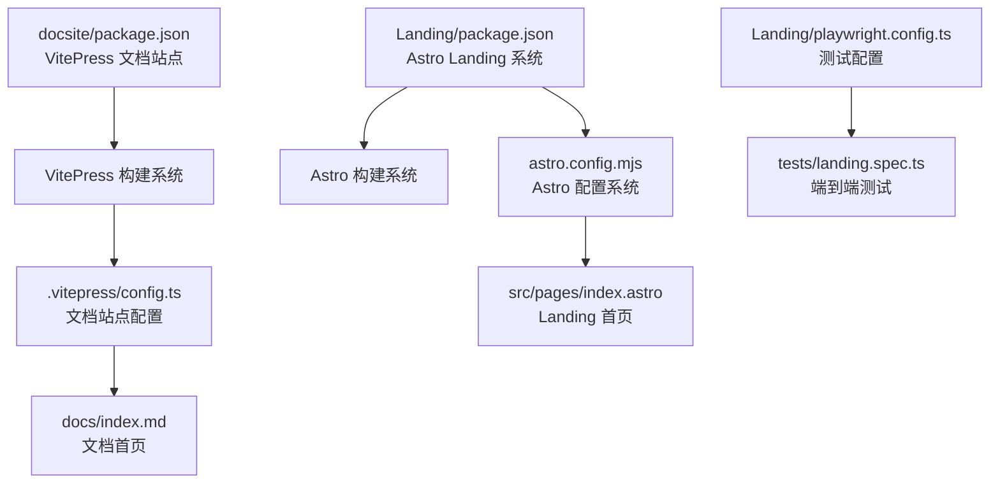
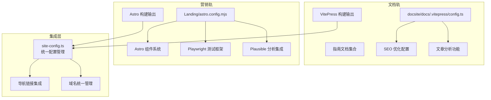

# 文档站点架构

<cite>
**本文引用的文件**
- [docsite/docs/.vitepress/config.ts](file://docsite/docs/.vitepress/config.ts)
- [docsite/package.json](file://docsite/package.json)
- [docsite/docs/index.md](file://docsite/docs/index.md)
- [docsite/docs/01.指南/01.开始/01.介绍.md](file://docsite/docs/01.指南/01.开始/01.介绍.md)
- [docsite/docs/01.指南/01.开始/02.快速上手.md](file://docsite/docs/01.指南/01.开始/02.快速上手.md)
- [Landing/astro.config.mjs](file://Landing/astro.config.mjs)
- [Landing/package.json](file://Landing/package.json)
- [Landing/playwright.config.ts](file://Landing/playwright.config.ts)
- [Landing/src/lib/site-config.ts](file://Landing/src/lib/site-config.ts)
- [Landing/src/layouts/LandingShell.astro](file://Landing/src/layouts/LandingShell.astro)
- [Landing/src/pages/index.astro](file://Landing/src/pages/index.astro)
- [Landing/scripts/run-playwright-with-static-server.cjs](file://Landing/scripts/run-playwright-with-static-server.cjs)
- [Landing/tests/landing.spec.ts](file://Landing/tests/landing.spec.ts)
</cite>

## 更新摘要
**所做更改**
- 新增 Landing 页面系统的架构分析，包括 Astro 配置系统和组件结构
- 新增 Playwright 测试框架的集成方案和测试流程
- 新增 SEO 优化和分析集成的技术实现细节
- 更新文档站点与 Landing 页面的深度集成本文档
- 新增 CI/CD 流水线相关的配置分析

## 目录
1. [引言](#引言)
2. [项目结构](#项目结构)
3. [核心组件](#核心组件)
4. [架构总览](#架构总览)
5. [详细组件分析](#详细组件分析)
6. [Landing 页面系统](#landing-页面系统)
7. [测试与质量保证](#测试与质量保证)
8. [SEO 优化与分析集成](#seo-优化与分析集成)
9. [依赖分析](#依赖分析)
10. [性能考虑](#性能考虑)
11. [故障排除指南](#故障排除指南)
12. [结论](#结论)
13. [附录](#附录)

## 引言
本文件系统性阐述 MaaPipelineEditor 文档站点（docsite）与 Landing 页面系统的架构设计与内容组织，重点围绕基于 VitePress 的文档系统和基于 Astro 的 Landing 页面系统展开，涵盖目录组织、主题配置、导航生成、内容分类体系、构建与部署流程，以及模板、样式定制、SEO 优化、测试框架和分析集成等技术实现细节。文档面向开发者与内容维护者，既提供高层概览，也给出可落地的实施建议。

## 项目结构
docsite 采用 VitePress 标准目录结构，Landing 采用 Astro 现代前端框架结构，两者形成互补的文档与营销体系：

**文档站点结构**：
- docsite：基于 VitePress 的文档系统，包含 .vitepress 配置、首页、指南与实践内容
- docs：文档内容根目录，包含指南、API 参考、开发者指南等
- public：公共资源图片

**Landing 页面结构**：
- Landing：基于 Astro 的营销页面系统，包含配置、组件、布局、测试等
- src：Astro 源代码，包含组件、布局、内容配置
- tests：Playwright 端到端测试
- scripts：构建和测试脚本

**图表来源**
- [docsite/package.json:1-22](file://docsite/package.json#L1-L22)
- [Landing/package.json:1-35](file://Landing/package.json#L1-L35)
- [Landing/astro.config.mjs:1-19](file://Landing/astro.config.mjs#L1-L19)

**章节来源**
- [docsite/package.json:1-22](file://docsite/package.json#L1-L22)
- [Landing/package.json:1-35](file://Landing/package.json#L1-L35)

## 核心组件
**文档站点组件**：
- VitePress 配置与主题扩展：通过 vitepress-theme-teek 定制主题行为
- 导航与侧边栏：基于 themeConfig.nav 和 editLink.pattern
- 内容与首页：使用 home 布局和动态脚本注入
- 构建与预览：提供 dev/build/preview 脚本

**Landing 页面组件**：
- Astro 配置系统：集成 React、Sitemap、TailwindCSS 插件
- 组件化架构：Hero、FeatureExplorer、ShowcaseGrid 等组件
- 测试框架：Playwright 端到端测试集成
- SEO 优化：结构化数据、Open Graph、分析集成

**章节来源**
- [docsite/docs/.vitepress/config.ts:12-58](file://docsite/docs/.vitepress/config.ts#L12-L58)
- [Landing/astro.config.mjs:7-18](file://Landing/astro.config.mjs#L7-L18)
- [Landing/src/layouts/LandingShell.astro:17-34](file://Landing/src/layouts/LandingShell.astro#L17-L34)

## 架构总览
文档站点与 Landing 页面系统采用"文档 + 营销"双轨架构：
- **文档轨**：VitePress 主题扩展 + 内容组织 + SEO 优化
- **营销轨**：Astro 组件化 + 测试保障 + 分析集成
- **集成点**：共享的站点配置、统一的域名管理和导航链接

**图表来源**
- [docsite/docs/.vitepress/config.ts:60-194](file://docsite/docs/.vitepress/config.ts#L60-L194)
- [Landing/astro.config.mjs:7-18](file://Landing/astro.config.mjs#L7-L18)
- [Landing/src/lib/site-config.ts:7-16](file://Landing/src/lib/site-config.ts#L7-L16)

## 详细组件分析

### VitePress 配置与主题扩展
**主题增强与 UI 行为**：
- 侧边栏触发、回到顶部图标、页脚信息、代码块复制反馈
- 文章分享、文章更新分析、Markdown 容器标签
- GitHub 示例仓库链接、主题颜色定制

**站点元信息与 SEO**：
- base 路径设置为 "/docs/"
- 多语言支持（zh-CN）
- 详细的 Open Graph 元信息配置
- Sitemap 配置和 permalink 映射

**导航与搜索**：
- 主导航包含首页、指南、相关链接、友情链接
- 本地搜索提供方
- 编辑链接指向 GitHub 源文档

**章节来源**
- [docsite/docs/.vitepress/config.ts:12-58](file://docsite/docs/.vitepress/config.ts#L12-L58)
- [docsite/docs/.vitepress/config.ts:60-194](file://docsite/docs/.vitepress/config.ts#L60-L194)

### Landing 页面系统

#### Astro 配置系统
**核心配置**：
- 站点基础配置：`site: "https://mpe.codax.site"`
- 集成插件：React 支持、Sitemap 生成、TailwindCSS
- Vite 配置：插件别名和解析配置
- 路径别名：`@` 指向 `src` 目录

**技术栈集成**：
- React 组件支持
- TypeScript 类型检查
- TailwindCSS 样式框架
- 字体资源管理

**章节来源**
- [Landing/astro.config.mjs:7-18](file://Landing/astro.config.mjs#L7-L18)
- [Landing/package.json:14-33](file://Landing/package.json#L14-L33)

#### 组件化架构
**页面组件**：
- HeroWorkflowScene：英雄区域展示
- FeatureExplorer：功能特性探索
- ShowcaseGrid：使用案例展示
- TrustStats：信任统计数据
- FinalCtaSection：最终行动号召

**布局系统**：
- LandingShell：主布局组件
- 结构化数据：Schema.org 支持
- SEO 元信息：Open Graph、Twitter Card
- 分析集成：Plausible Analytics

**章节来源**
- [Landing/src/pages/index.astro:1-137](file://Landing/src/pages/index.astro#L1-L137)
- [Landing/src/layouts/LandingShell.astro:17-34](file://Landing/src/layouts/LandingShell.astro#L17-L34)

## 测试与质量保证

### Playwright 测试框架
**测试配置**：
- 并行测试执行
- CI 环境下的重试机制
- GitHub Actions 报告器
- 多浏览器设备支持

**测试流程**：
- 静态服务器启动：`yarn preview --host 127.0.0.1 --port 4321`
- 自动化测试执行
- 测试结果报告和 HTML 输出

**测试用例**：
- 英雄区域 CTA 按钮和 GitHub 链接验证
- 功能标签切换和键盘导航
- 移动端导航功能测试
- 桌面端导航和锚点链接

**章节来源**
- [Landing/playwright.config.ts:8-30](file://Landing/playwright.config.ts#L8-L30)
- [Landing/tests/landing.spec.ts:1-61](file://Landing/tests/landing.spec.ts#L1-L61)

### 构建和验证流程
**构建脚本**：
- `dev`：开发模式启动
- `build`：生产构建
- `preview`：本地预览
- `typecheck`：类型检查
- `test`：Playwright 测试执行
- `verify`：完整验证流程

**静态服务器测试**：
- 自定义静态服务器实现
- MIME 类型支持
- 错误处理和状态码
- 与 Playwright 集成

**章节来源**
- [Landing/package.json:6-13](file://Landing/package.json#L6-L13)
- [Landing/scripts/run-playwright-with-static-server.cjs:1-72](file://Landing/scripts/run-playwright-with-static-server.cjs#L1-L72)

## SEO 优化与分析集成

### 结构化数据和元信息
**Landing 页面 SEO**：
- 结构化数据：SoftwareApplication 类型
- Open Graph 元信息：网站类型、语言、标题、描述
- Twitter Card 支持
- Canonical URL 和图标链接

**文档站点 SEO**：
- Open Graph 配置
- 关键词和描述元信息
- Sitemap 生成和映射
- 分析功能集成

**章节来源**
- [Landing/src/layouts/LandingShell.astro:17-65](file://Landing/src/layouts/LandingShell.astro#L17-L65)
- [docsite/docs/.vitepress/config.ts:68-87](file://docsite/docs/.vitepress/config.ts#L68-L87)

### 分析集成
**Plausible Analytics**：
- 可选的分析集成
- 条件性脚本加载
- 配置化域名设置

**文档分析**：
- 文章更新分析功能
- 创建日期格式化
- 分析数据收集

**章节来源**
- [Landing/src/lib/site-config.ts:15](file://Landing/src/lib/site-config.ts#L15)
- [docsite/docs/.vitepress/config.ts:51-57](file://docsite/docs/.vitepress/config.ts#L51-L57)

## 依赖分析
**文档站点依赖**：
- vitepress：核心文档系统
- vitepress-theme-teek：主题扩展
- vitepress-plugin-llms：LLM 插件
- vue：响应式框架

**Landing 页面依赖**：
- astro：核心框架
- @astrojs/react：React 支持
- @astrojs/sitemap：Sitemap 生成
- @astrojs/check：类型检查
- @playwright/test：测试框架
- tailwindcss：样式框架

**章节来源**
- [docsite/package.json:12-21](file://docsite/package.json#L12-L21)
- [Landing/package.json:14-33](file://Landing/package.json#L14-L33)

## 性能考虑
**文档站点性能**：
- 图片懒加载和行号显示
- 本地搜索减少外部依赖
- Sitemap 优化搜索引擎收录
- 代码块复制反馈提升交互体验

**Landing 页面性能**：
- 组件懒加载和条件渲染
- TailwindCSS 工具类优化
- 静态资源优化
- 分析脚本的条件加载

**章节来源**
- [docsite/docs/.vitepress/config.ts:88-114](file://docsite/docs/.vitepress/config.ts#L88-L114)
- [Landing/astro.config.mjs:10-17](file://Landing/astro.config.mjs#L10-L17)

## 故障排除指南
**文档站点问题**：
- 构建失败：检查 .vitepress/config.ts 配置和依赖版本
- 导航异常：确认 themeConfig.nav 配置和 activeMatch 规则
- SEO 问题：验证 Open Graph 元信息和 Sitemap 配置

**Landing 页面问题**：
- 构建错误：检查 astro.config.mjs 配置和依赖安装
- 测试失败：验证 Playwright 配置和静态服务器设置
- 分析集成：确认 Plausible 域名配置和脚本加载

**章节来源**
- [docsite/docs/.vitepress/config.ts:62-87](file://docsite/docs/.vitepress/config.ts#L62-L87)
- [Landing/astro.config.mjs:7-18](file://Landing/astro.config.mjs#L7-L18)

## 结论
MaaPipelineEditor 采用"文档 + 营销"双轨架构，文档站点基于 VitePress 实现专业的技术文档体验，Landing 页面基于 Astro 提供现代化的营销页面。两者通过统一的配置管理和域名策略实现深度集成。新增的 Playwright 测试框架确保了前端质量，SEO 优化和分析集成为产品推广提供了技术支持。建议持续优化测试覆盖率和分析数据，完善 CI/CD 流程，提升整体开发效率和用户体验。

## 附录

### 构建与部署流程
**文档站点**：
- 本地开发：`npm run dev`
- 预览：`npm run preview`
- 生产构建：`npm run build`

**Landing 页面**：
- 本地开发：`yarn dev`
- 预览：`yarn preview`
- 生产构建：`yarn build`
- 类型检查：`yarn typecheck`
- 测试执行：`yarn test`
- 完整验证：`yarn verify`

### 内容组织与导航
**文档站点分类**：
- 指南：入门教程和实践指导
- API 参考：接口文档
- 开发者指南：开发规范和贡献指南

**Landing 页面导航**：
- 主要功能特性展示
- 使用案例和信任统计
- 最终行动号召

### SEO 优化策略
**技术实现**：
- 结构化数据标记
- Open Graph 和 Twitter Card
- Sitemap 自动生成
- 分析脚本集成

**内容策略**：
- 关键词优化
- 内容更新频率
- 社交媒体集成
- 移动端适配

**章节来源**
- [docsite/package.json:7-11](file://docsite/package.json#L7-L11)
- [Landing/package.json:6-13](file://Landing/package.json#L6-L13)
- [Landing/src/layouts/LandingShell.astro:40-73](file://Landing/src/layouts/LandingShell.astro#L40-L73)