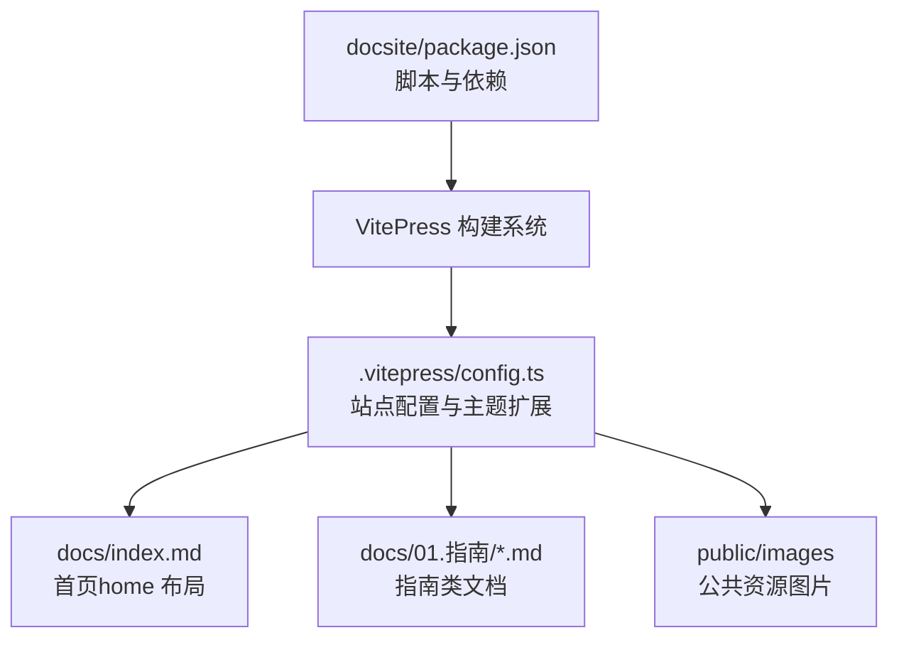
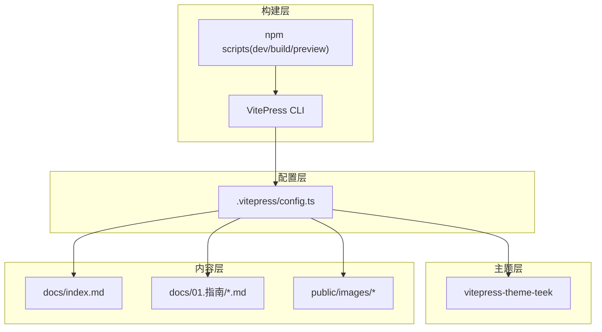
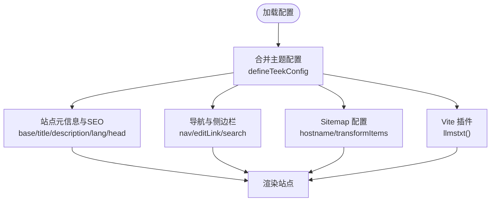
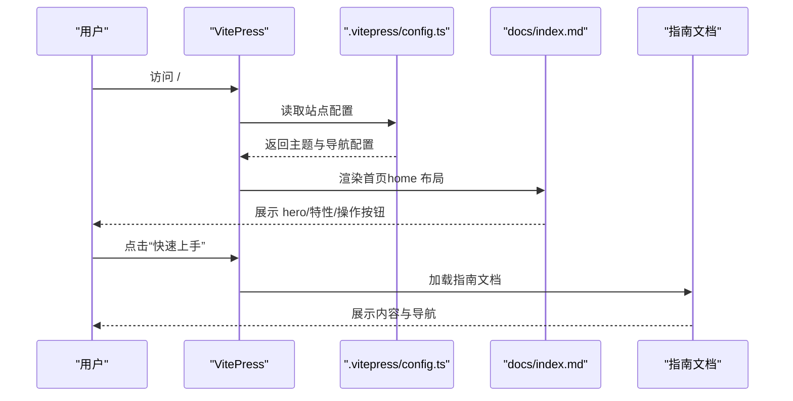
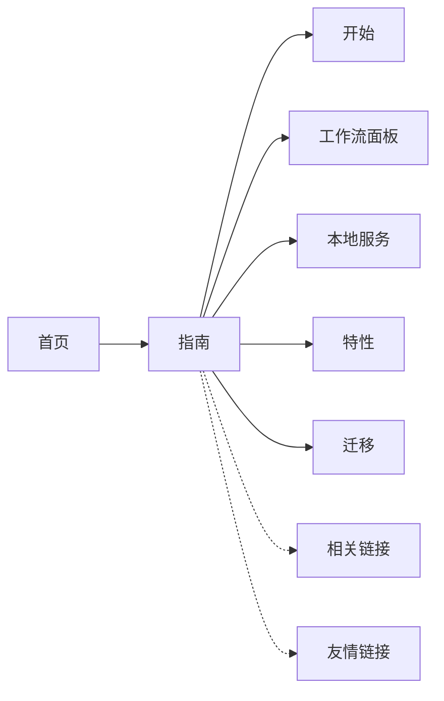
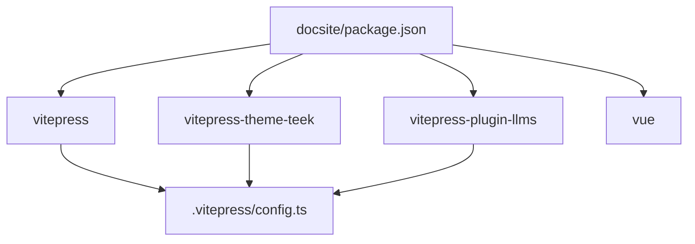

# 文档站点架构

<cite>
**本文引用的文件**
- [docsite/docs/.vitepress/config.ts](file://docsite/docs/.vitepress/config.ts)
- [docsite/package.json](file://docsite/package.json)
- [docsite/docs/index.md](file://docsite/docs/index.md)
- [docsite/docs/01.指南/01.开始/01.介绍.md](file://docsite/docs/01.指南/01.开始/01.介绍.md)
- [docsite/docs/01.指南/01.开始/02.快速上手.md](file://docsite/docs/01.指南/01.开始/02.快速上手.md)
</cite>

## 目录
1. [引言](#引言)
2. [项目结构](#项目结构)
3. [核心组件](#核心组件)
4. [架构总览](#架构总览)
5. [详细组件分析](#详细组件分析)
6. [依赖分析](#依赖分析)
7. [性能考虑](#性能考虑)
8. [故障排除指南](#故障排除指南)
9. [结论](#结论)
10. [附录](#附录)

## 引言
本文件系统性阐述 MaaPipelineEditor 文档站点（docsite）的架构设计与内容组织，重点围绕基于 VitePress 的文档系统展开，涵盖目录组织、主题配置、导航生成、内容分类体系、构建与部署流程，以及模板、样式定制与 SEO 优化等技术实现细节。文档面向开发者与内容维护者，既提供高层概览，也给出可落地的实施建议。

## 项目结构
docsite 采用 VitePress 标准目录结构，核心目录与文件如下：
- docs：文档内容根目录，包含 .vitepress 配置、首页 index.md、指南与实践内容等
- docs/.vitepress/config.ts：VitePress 主题与站点配置
- docs/index.md：首页（home 布局），包含英雄区、特性卡片与脚本注入
- docs/01.指南：指南类文档集合，按“开始/工作流面板/本地服务/特性/迁移”等维度组织
- docsite/package.json：文档站点的 npm 脚本与依赖声明

图表来源
- [docsite/package.json:1-22](file://docsite/package.json#L1-L22)
- [docsite/docs/.vitepress/config.ts:60-194](file://docsite/docs/.vitepress/config.ts#L60-L194)
- [docsite/docs/index.md:1-97](file://docsite/docs/index.md#L1-L97)

章节来源
- [docsite/package.json:1-22](file://docsite/package.json#L1-L22)
- [docsite/docs/.vitepress/config.ts:60-194](file://docsite/docs/.vitepress/config.ts#L60-L194)
- [docsite/docs/index.md:1-97](file://docsite/docs/index.md#L1-L97)

## 核心组件
- VitePress 配置与主题扩展
  - 通过 vitepress-theme-teek 的 defineTeekConfig 对主题行为进行定制，包括侧边栏触发、回到顶部图标、页脚信息、代码块复制反馈、文章分享、Markdown 容器标签、文章更新分析等
  - 通过 extends 合并主题配置，再在 exports.default 中覆盖基础路径、标题、描述、语言、SEO 元信息、sitemap、导航与搜索等
- 导航与侧边栏
  - themeConfig.nav 定义主导航（首页、指南、相关链接、友情链接），并配置搜索提供方为本地
  - 通过 themeConfig.editLink.pattern 指定编辑链接跳转规则，便于协作
- 内容与首页
  - docs/index.md 使用 home 布局，包含 hero 区域、特性卡片与自定义脚本，实现动态文案渲染与 SVG 装饰
- 构建与预览
  - package.json 中提供 dev/build/preview 三个脚本，分别对应开发、构建与本地预览

章节来源
- [docsite/docs/.vitepress/config.ts:12-58](file://docsite/docs/.vitepress/config.ts#L12-L58)
- [docsite/docs/.vitepress/config.ts:60-194](file://docsite/docs/.vitepress/config.ts#L60-L194)
- [docsite/docs/index.md:1-97](file://docsite/docs/index.md#L1-L97)
- [docsite/package.json:7-11](file://docsite/package.json#L7-L11)

## 架构总览
文档站点整体采用“配置驱动 + 主题扩展 + 内容组织”的架构：
- 配置层：.vitepress/config.ts 统一管理站点元信息、SEO、导航、搜索、sitemap、主题增强等
- 主题层：基于 vitepress-theme-teek，扩展 UI 与交互行为
- 内容层：按指南、API、开发者指南等分类组织 Markdown 文档
- 构建层：VitePress 生态链路，结合本地搜索与 LLM 插件

图表来源
- [docsite/docs/.vitepress/config.ts:60-194](file://docsite/docs/.vitepress/config.ts#L60-L194)
- [docsite/package.json:7-11](file://docsite/package.json#L7-L11)
- [docsite/docs/index.md:1-97](file://docsite/docs/index.md#L1-L97)

## 详细组件分析

### VitePress 配置与主题扩展
- 主题增强与 UI 行为
  - 侧边栏触发、回到顶部图标、页脚版权与主题信息、代码块复制反馈、文章分享、文章更新分析、文章捕获开关、Markdown 容器标签、GitHub 示例仓库链接等
- 站点元信息与 SEO
  - base 路径、标题、描述、语言、lastUpdated、head 中的 og/meta/keywords/author 等
  - sitemap 配置，包含自定义 hostname 与 permalink 映射转换
- 导航与搜索
  - 导航项含“首页、指南、相关链接、友情链接”，并配置本地搜索
  - 编辑链接指向 GitHub 源文档路径
- 插件与增强
  - 注入 vite 插件 vitepress-plugin-llms，增强 LLM 相关能力

图表来源
- [docsite/docs/.vitepress/config.ts:12-58](file://docsite/docs/.vitepress/config.ts#L12-L58)
- [docsite/docs/.vitepress/config.ts:60-194](file://docsite/docs/.vitepress/config.ts#L60-L194)

章节来源
- [docsite/docs/.vitepress/config.ts:12-58](file://docsite/docs/.vitepress/config.ts#L12-L58)
- [docsite/docs/.vitepress/config.ts:60-194](file://docsite/docs/.vitepress/config.ts#L60-L194)

### 首页与内容组织
- 首页（index.md）
  - 使用 home 布局，包含 hero 名称、标语、操作按钮、图像与特性卡片
  - 通过 script setup 注入动态文案渲染与 SVG 装饰，配合样式覆盖实现视觉效果
- 指南类文档
  - 采用层级目录组织，如“01.指南/01.开始/01.介绍.md”、“01.指南/01.开始/02.快速上手.md”
  - 通过 Front Matter 设置标题、永久链接、分类与标签，便于索引与导航

图表来源
- [docsite/docs/index.md:1-97](file://docsite/docs/index.md#L1-L97)
- [docsite/docs/.vitepress/config.ts:129-189](file://docsite/docs/.vitepress/config.ts#L129-L189)
- [docsite/docs/01.指南/01.开始/01.介绍.md:1-92](file://docsite/docs/01.指南/01.开始/01.介绍.md#L1-L92)
- [docsite/docs/01.指南/01.开始/02.快速上手.md:1-416](file://docsite/docs/01.指南/01.开始/02.快速上手.md#L1-L416)

章节来源
- [docsite/docs/index.md:1-97](file://docsite/docs/index.md#L1-L97)
- [docsite/docs/01.指南/01.开始/01.介绍.md:1-92](file://docsite/docs/01.指南/01.开始/01.介绍.md#L1-L92)
- [docsite/docs/01.指南/01.开始/02.快速上手.md:1-416](file://docsite/docs/01.指南/01.开始/02.快速上手.md#L1-L416)

### 内容分类体系与导航关系
- 分类定位
  - 指南：面向使用者的入门与实践教程，覆盖“开始、工作流面板、本地服务、特性、迁移”等主题
  - API 参考：当前仓库未提供 API 参考文档，建议后续补充
  - 开发者指南：当前仓库未提供开发者指南文档，建议后续补充
- 导航关系
  - 导航项“指南”指向 /guide/start/intro，activeMatch 与目录层级一致，确保侧边栏与页面联动
  - “相关链接”与“友情链接”提供外部资源入口，便于用户获取周边生态信息

图表来源
- [docsite/docs/.vitepress/config.ts:129-189](file://docsite/docs/.vitepress/config.ts#L129-L189)

章节来源
- [docsite/docs/.vitepress/config.ts:129-189](file://docsite/docs/.vitepress/config.ts#L129-L189)

## 依赖分析
- 依赖与脚本
  - docsite/package.json 声明 vitepress、vitepress-theme-teek、vitepress-plugin-llms 与 vue 等依赖
  - npm 脚本提供 dev/build/preview，分别对应开发、构建与本地预览
- 主题与插件
  - vitepress-theme-teek 提供主题增强与 UI 行为定制
  - vitepress-plugin-llms 通过 vite 插件注入，增强 LLM 相关能力

图表来源
- [docsite/package.json:12-21](file://docsite/package.json#L12-L21)
- [docsite/docs/.vitepress/config.ts:190-192](file://docsite/docs/.vitepress/config.ts#L190-L192)

章节来源
- [docsite/package.json:12-21](file://docsite/package.json#L12-L21)
- [docsite/docs/.vitepress/config.ts:190-192](file://docsite/docs/.vitepress/config.ts#L190-L192)

## 性能考虑
- 图片懒加载与行号
  - Markdown 配置开启 image.lazyLoading 与 lineNumbers，提升长文档阅读体验
- 本地搜索
  - 搜索提供方设为本地，降低外部依赖带来的网络开销
- Sitemap 与 SEO
  - 配置 sitemap.hostname 与 transformItems，结合 permalink 映射，提升搜索引擎收录效率
- 代码块复制反馈
  - 主题增强提供复制成功提示，改善用户交互体验

章节来源
- [docsite/docs/.vitepress/config.ts:88-114](file://docsite/docs/.vitepress/config.ts#L88-L114)
- [docsite/docs/.vitepress/config.ts:181-183](file://docsite/docs/.vitepress/config.ts#L181-L183)

## 故障排除指南
- 构建失败或路径异常
  - 检查 .vitepress/config.ts 中 base 路径与部署域名是否匹配
  - 确认 package.json 中脚本与 VitePress 版本兼容
- 导航与侧边栏不生效
  - 确认 themeConfig.nav.activeMatch 与目录层级一致
  - 检查 Front Matter 中的 permalink 是否正确
- SEO 与 sitemap 问题
  - 确认 sitemap.hostname 与实际域名一致
  - 检查 transformItems 中的 permalink 映射是否正确
- 编辑链接无法跳转
  - 检查 editLink.pattern 是否指向正确的 GitHub 仓库路径

章节来源
- [docsite/docs/.vitepress/config.ts:62-87](file://docsite/docs/.vitepress/config.ts#L62-L87)
- [docsite/docs/.vitepress/config.ts:101-114](file://docsite/docs/.vitepress/config.ts#L101-L114)
- [docsite/docs/.vitepress/config.ts:184-188](file://docsite/docs/.vitepress/config.ts#L184-L188)

## 结论
MaaPipelineEditor 文档站点以 VitePress 为核心，结合 vitepress-theme-teek 实现主题增强与交互优化，通过 .vitepress/config.ts 统一管理站点配置、导航与 SEO，采用层级化的指南类文档组织方式，辅以首页与脚本注入实现良好的用户体验。建议后续补充 API 参考与开发者指南，完善内容分类体系；同时可进一步优化 LLM 插件与本地搜索策略，提升智能化与检索效率。

## 附录
- 构建与部署流程
  - 本地开发：npm run dev
  - 预览：npm run preview
  - 生产构建：npm run build
- 模板与样式定制
  - 首页使用 home 布局与自定义脚本，结合样式覆盖实现动态装饰
  - 主题增强通过 defineTeekConfig 定制 UI 行为与交互反馈
- SEO 优化
  - 配置 head 中的 og/meta/keywords/author 等元信息
  - 通过 sitemap 与 transformItems 提升搜索引擎收录质量

章节来源
- [docsite/package.json:7-11](file://docsite/package.json#L7-L11)
- [docsite/docs/index.md:43-97](file://docsite/docs/index.md#L43-L97)
- [docsite/docs/.vitepress/config.ts:68-87](file://docsite/docs/.vitepress/config.ts#L68-L87)
- [docsite/docs/.vitepress/config.ts:101-114](file://docsite/docs/.vitepress/config.ts#L101-L114)