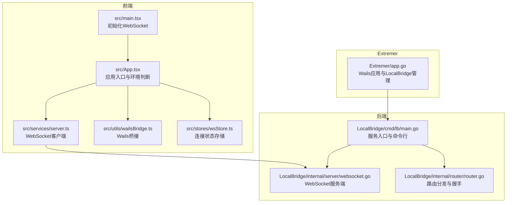
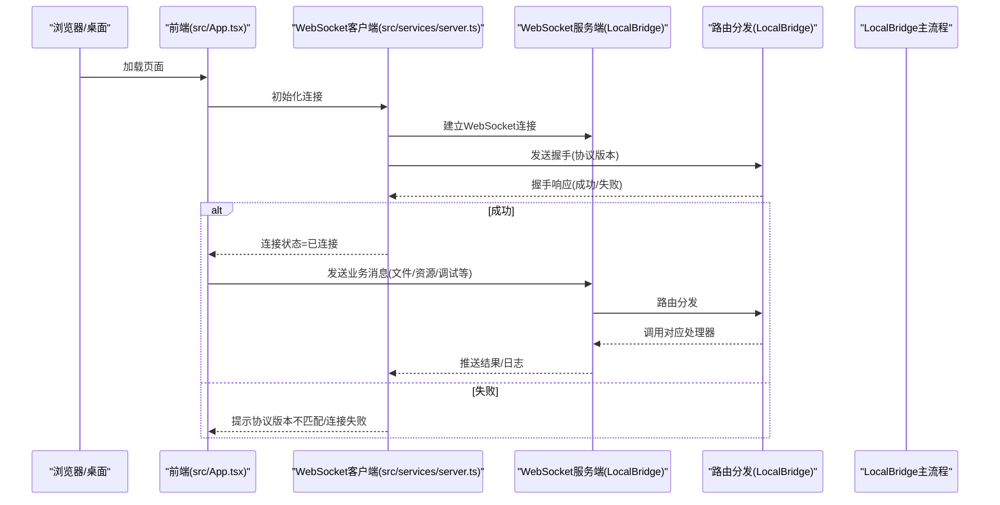
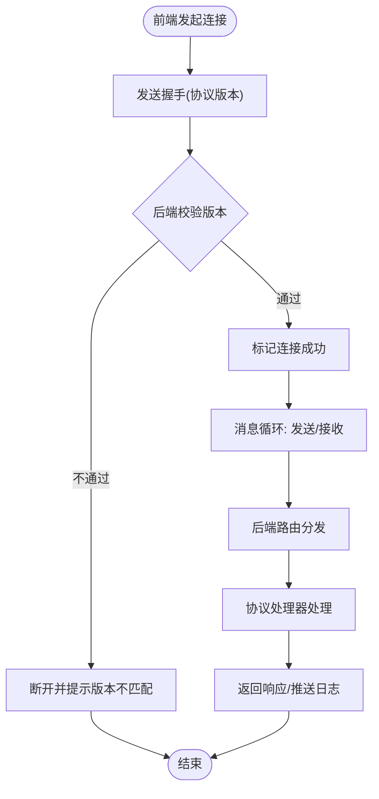

# 模块依赖关系

<cite>
**本文引用的文件**
- [package.json](file://package.json)
- [vite.config.ts](file://vite.config.ts)
- [src/main.tsx](file://src/main.tsx)
- [src/App.tsx](file://src/App.tsx)
- [src/services/server.ts](file://src/services/server.ts)
- [src/stores/wsStore.ts](file://src/stores/wsStore.ts)
- [src/utils/wailsBridge.ts](file://src/utils/wailsBridge.ts)
- [Extremer/package.json](file://Extremer/package.json)
- [Extremer/app.go](file://Extremer/app.go)
- [LocalBridge/package.json](file://LocalBridge/package.json)
- [LocalBridge/go.mod](file://LocalBridge/go.mod)
- [LocalBridge/cmd/lb/main.go](file://LocalBridge/cmd/lb/main.go)
- [LocalBridge/internal/server/websocket.go](file://LocalBridge/internal/server/websocket.go)
- [LocalBridge/internal/router/router.go](file://LocalBridge/internal/router/router.go)
</cite>

## 目录
1. [简介](#简介)
2. [项目结构](#项目结构)
3. [核心组件](#核心组件)
4. [架构总览](#架构总览)
5. [详细组件分析](#详细组件分析)
6. [依赖分析](#依赖分析)
7. [性能考虑](#性能考虑)
8. [故障排查指南](#故障排查指南)
9. [结论](#结论)
10. [附录](#附录)

## 简介
本文件面向MaaPipelineEditor（MPE）的模块依赖关系与数据流向进行全面分析，涵盖：
- 前端依赖树与版本兼容性（React生态、UI组件库、状态管理、工具库）
- 后端Go模块依赖管理（MaaFramework SDK、WebSocket库、配置管理等）
- 模块间耦合度控制与接口设计原则
- 依赖更新策略、版本管理与安全漏洞处理最佳实践
- 依赖冲突解决、性能优化与打包体积控制要点

## 项目结构
MPE采用多模块协作架构：
- 前端（Vite + React 19 + Ant Design 6 + Zustand）负责可视化编辑与交互
- 后端（LocalBridge，Go 1.24）提供文件管理、MaaFramework集成、WebSocket通信
- Extremer（Wails v2 + Go）封装本地服务，提供跨平台桌面体验与自动启动

图表来源
- [src/main.tsx:1-18](file://src/main.tsx#L1-L18)
- [src/App.tsx:111-293](file://src/App.tsx#L111-L293)
- [src/services/server.ts:20-331](file://src/services/server.ts#L20-L331)
- [src/utils/wailsBridge.ts:38-131](file://src/utils/wailsBridge.ts#L38-L131)
- [src/stores/wsStore.ts:1-24](file://src/stores/wsStore.ts#L1-L24)
- [LocalBridge/cmd/lb/main.go:182-440](file://LocalBridge/cmd/lb/main.go#L182-L440)
- [LocalBridge/internal/server/websocket.go:35-179](file://LocalBridge/internal/server/websocket.go#L35-L179)
- [LocalBridge/internal/router/router.go:28-151](file://LocalBridge/internal/router/router.go#L28-L151)
- [Extremer/app.go:181-444](file://Extremer/app.go#L181-L444)

章节来源
- [package.json:1-65](file://package.json#L1-L65)
- [vite.config.ts:1-41](file://vite.config.ts#L1-L41)
- [src/main.tsx:1-18](file://src/main.tsx#L1-L18)
- [src/App.tsx:111-293](file://src/App.tsx#L111-L293)
- [src/services/server.ts:20-331](file://src/services/server.ts#L20-L331)
- [src/stores/wsStore.ts:1-24](file://src/stores/wsStore.ts#L1-L24)
- [src/utils/wailsBridge.ts:38-131](file://src/utils/wailsBridge.ts#L38-L131)
- [Extremer/app.go:181-444](file://Extremer/app.go#L181-L444)
- [LocalBridge/cmd/lb/main.go:182-440](file://LocalBridge/cmd/lb/main.go#L182-L440)
- [LocalBridge/internal/server/websocket.go:35-179](file://LocalBridge/internal/server/websocket.go#L35-L179)
- [LocalBridge/internal/router/router.go:28-151](file://LocalBridge/internal/router/router.go#L28-L151)

## 核心组件
- 前端初始化与连接
  - 入口脚本初始化WebSocket并渲染应用
  - 应用根据运行环境（Wails或浏览器）决定连接策略
  - 使用Zustand管理WebSocket连接状态
- 后端服务
  - Cobra命令行入口，支持配置、信息查询、路径设置等
  - WebSocket服务端，统一消息路由与握手校验
  - 路由分发器，按路径前缀匹配协议处理器
- Extremer封装
  - Wails应用生命周期管理LocalBridge子进程
  - 自动分配端口、准备配置、事件通知前端

章节来源
- [src/main.tsx:1-18](file://src/main.tsx#L1-L18)
- [src/App.tsx:111-293](file://src/App.tsx#L111-L293)
- [src/services/server.ts:20-331](file://src/services/server.ts#L20-L331)
- [src/stores/wsStore.ts:1-24](file://src/stores/wsStore.ts#L1-L24)
- [LocalBridge/cmd/lb/main.go:182-440](file://LocalBridge/cmd/lb/main.go#L182-L440)
- [LocalBridge/internal/server/websocket.go:35-179](file://LocalBridge/internal/server/websocket.go#L35-L179)
- [LocalBridge/internal/router/router.go:28-151](file://LocalBridge/internal/router/router.go#L28-L151)
- [Extremer/app.go:181-444](file://Extremer/app.go#L181-L444)

## 架构总览
MPE采用“前端-后端-桥接”的三层协作：
- 前端通过WebSocket与后端通信，支持协议版本握手与错误处理
- 后端以Cobra提供CLI能力，同时承载WebSocket服务
- Extremer在Wails环境中托管LocalBridge，负责端口分配、配置生成与事件广播

图表来源
- [src/App.tsx:215-269](file://src/App.tsx#L215-L269)
- [src/services/server.ts:104-251](file://src/services/server.ts#L104-L251)
- [LocalBridge/internal/server/websocket.go:65-93](file://LocalBridge/internal/server/websocket.go#L65-L93)
- [LocalBridge/internal/router/router.go:49-76](file://LocalBridge/internal/router/router.go#L49-L76)

## 详细组件分析

### 前端依赖树与版本兼容性
- React生态
  - React 19.1 与 React DOM 19.1
  - Vite + @vitejs/plugin-react-swc
  - TypeScript 5.8.x
- UI组件库
  - Ant Design 6 与 @ant-design/icons 6
  - @ant-design/v5-patch-for-react-19 适配React 19
- 状态管理
  - Zustand 5.x（轻量状态管理）
- 可视化与编辑
  - @xyflow/react 12.x（流程图节点/连线）
  - elkjs 0.11.x（布局算法）
- 工具库
  - lodash 4.x、classnames 2.x、darkreader 4.x、jsonc-parser 3.x
  - html-to-image 1.11.11、tesseract.js 6.x
- 测试与开发
  - Vitest、@testing-library/react、happy-dom、ESLint 9.x

版本兼容性要点
- React 19 与 Ant Design 6 的组合需关注事件系统差异，项目通过 @ant-design/v5-patch-for-react-19 适配
- Vite 7 与 React 19 生态兼容良好，测试环境使用 happy-dom
- WebSocket协议版本在前后端严格对齐，避免运行期不兼容

章节来源
- [package.json:20-40](file://package.json#L20-L40)
- [package.json:41-63](file://package.json#L41-L63)
- [vite.config.ts:14-40](file://vite.config.ts#L14-L40)

### 后端Go模块依赖管理
- 核心依赖
  - MaaFramework SDK（maa-framework-go/v4 v4.0.0-beta.12）
  - WebSocket库 gorilla/websocket v1.5.3
  - 配置管理 spf13/viper 1.19.0、spf13/cobra 1.8.1
  - 日志 sirupsen/logrus v1.9.3
  - 文件监控 fsnotify v1.7.0
  - 系统接口 ebitengine/purego v0.9.1
- 间接依赖
  - golang.org/x/sys、x/net、x/text 等标准库扩展
  - hashicorp系列、samber/lo等工具库

章节来源
- [LocalBridge/go.mod:5-16](file://LocalBridge/go.mod#L5-L16)
- [LocalBridge/go.mod:18-37](file://LocalBridge/go.mod#L18-L37)

### Extremer封装与Wails集成
- Wails v2 作为桌面宿主，负责窗口、事件与Go桥接
- Extremer负责：
  - 端口分配与LocalBridge子进程管理
  - 配置文件生成与路径校验
  - 事件广播（bridge:port、bridge:ready）
  - 启动画面与窗口展示

章节来源
- [Extremer/app.go:181-444](file://Extremer/app.go#L181-L444)
- [Extremer/package.json:1-13](file://Extremer/package.json#L1-L13)

### 数据流向与协议设计
- 握手与版本校验
  - 前端发送协议版本，后端严格比对，不匹配则拒绝连接并提示更新
- 路由分发
  - 后端按消息路径前缀匹配处理器，统一错误包装与回传
- 状态同步
  - 前端通过Zustand维护连接状态，配合Ant Design通知与提示
  - Wails环境下通过事件桥接实现端口与运行状态的自动发现

图表来源
- [src/services/server.ts:104-251](file://src/services/server.ts#L104-L251)
- [LocalBridge/internal/router/router.go:107-150](file://LocalBridge/internal/router/router.go#L107-L150)
- [LocalBridge/internal/server/websocket.go:65-93](file://LocalBridge/internal/server/websocket.go#L65-L93)

## 依赖分析

### 前端依赖耦合与接口设计
- 低耦合接口
  - WebSocket客户端封装为独立类，集中处理连接、握手、消息收发与错误
  - 协议层抽象为多个Protocol类，便于扩展与替换
- 状态管理
  - WebSocket连接状态独立存储，避免与UI状态混杂
- 环境适配
  - Wails桥接模块提供统一的事件监听与方法调用接口，前端按环境分支处理

章节来源
- [src/services/server.ts:20-331](file://src/services/server.ts#L20-L331)
- [src/stores/wsStore.ts:1-24](file://src/stores/wsStore.ts#L1-L24)
- [src/utils/wailsBridge.ts:38-131](file://src/utils/wailsBridge.ts#L38-L131)

### 后端模块耦合与接口设计
- 松耦合设计
  - 路由分发器与处理器解耦，新增协议只需实现Handler接口并注册
  - WebSocket服务端仅负责连接生命周期与广播，业务逻辑下沉至处理器
- 可扩展性
  - 支持事件总线订阅/发布，便于日志推送与配置重载
- 错误处理
  - 统一错误模型与错误消息封装，保证前后端一致的错误呈现

章节来源
- [LocalBridge/internal/router/router.go:19-47](file://LocalBridge/internal/router/router.go#L19-L47)
- [LocalBridge/internal/server/websocket.go:35-179](file://LocalBridge/internal/server/websocket.go#L35-L179)

### 依赖冲突与版本管理
- 前端
  - React 19 与 Ant Design 6 的兼容通过 @ant-design/v5-patch-for-react-19 解决
  - Vite 7 与 React 19 生态稳定，建议锁定TS版本与插件版本
- 后端
  - MaaFramework SDK 以beta版本引入，需关注版本变更与ABI兼容
  - gorilla/websocket 与标准库版本需保持一致，避免CVE风险

章节来源
- [package.json:21-30](file://package.json#L21-L30)
- [LocalBridge/go.mod:5-16](file://LocalBridge/go.mod#L5-L16)

## 性能考虑
- 前端
  - 使用Zustand替代Redux，减少样板代码与内存占用
  - Vite按需加载与Tree Shaking，结合Less模块化样式降低首屏体积
- 后端
  - WebSocket连接池与事件总线避免频繁创建销毁
  - 路由前缀匹配提升消息分发效率
- 打包与分发
  - Vite多模式构建（stable/extremer等），按需配置base路径
  - Extremer通过Wails将前端产物与Go二进制打包为单文件

章节来源
- [vite.config.ts:5-14](file://vite.config.ts#L5-L14)
- [Extremer/package.json:1-13](file://Extremer/package.json#L1-L13)

## 故障排查指南
- 连接失败
  - 检查端口占用与防火墙；确认后端已启动并监听目标端口
  - 前端连接超时提示与错误通知，参考服务端日志定位问题
- 协议版本不匹配
  - 前端提示所需版本与后端实际版本，按提示更新任一端
- Wails环境异常
  - 检查事件桥接是否可用（runtime/go是否存在），确认Extremer已发出bridge:port事件
- MaaFramework初始化失败
  - 检查lib_dir与resource_dir配置，确保库版本与运行时匹配

章节来源
- [src/services/server.ts:104-251](file://src/services/server.ts#L104-L251)
- [LocalBridge/cmd/lb/main.go:282-298](file://LocalBridge/cmd/lb/main.go#L282-L298)
- [src/utils/wailsBridge.ts:38-131](file://src/utils/wailsBridge.ts#L38-L131)

## 结论
MaaPipelineEditor通过清晰的模块边界与协议化设计，实现了前端与后端的低耦合协作。前端以React 19与Ant Design 6为核心，后端以Cobra与WebSocket提供稳定的服务能力，Extremer通过Wails实现跨平台桌面体验。建议持续关注协议版本一致性、SDK版本演进与安全补丁，以保障系统的稳定性与安全性。

## 附录

### 依赖更新策略与最佳实践
- 前端
  - 使用yarn升级依赖，锁定次要版本，定期运行安全扫描
  - 通过Vitest与ESLint保障质量门禁
- 后端
  - go mod tidy定期清理与更新，关注MaaFramework SDK的ABI变更
  - 使用Cobra子命令简化运维与配置管理
- 安全与合规
  - 定期扫描依赖漏洞，优先修复高危与中危
  - 在CI中加入依赖审计与许可证检查

### 版本管理与发布
- 前端
  - 通过Vite多模式构建区分稳定版与实验版
- 后端
  - 通过Cobra命令行与日志系统记录版本信息
- Extremer
  - 通过Wails打包与脚本自动化分发

章节来源
- [package.json:6-19](file://package.json#L6-L19)
- [LocalBridge/cmd/lb/main.go:160-166](file://LocalBridge/cmd/lb/main.go#L160-L166)
- [Extremer/package.json:1-13](file://Extremer/package.json#L1-13)