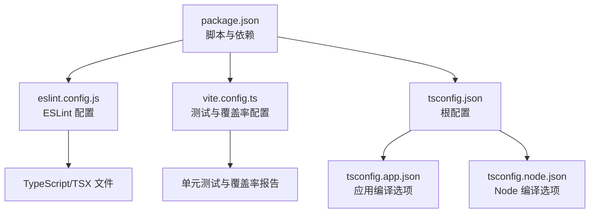
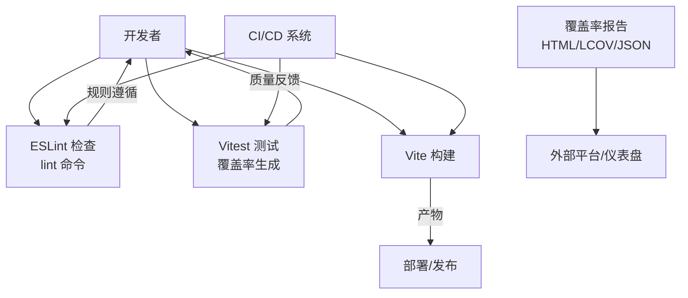
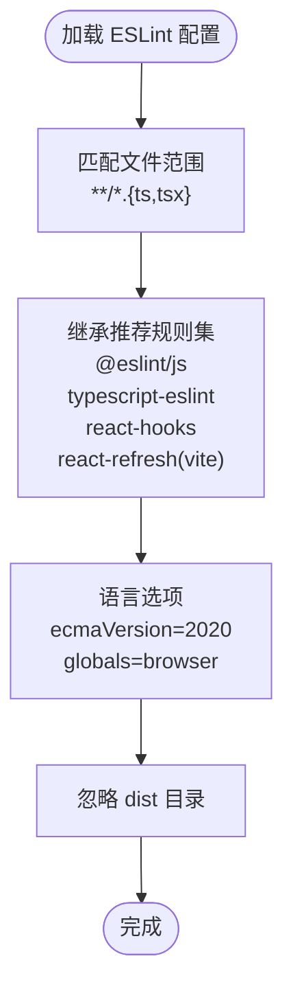
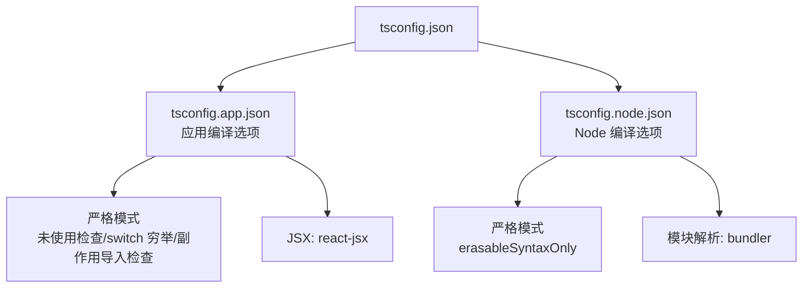
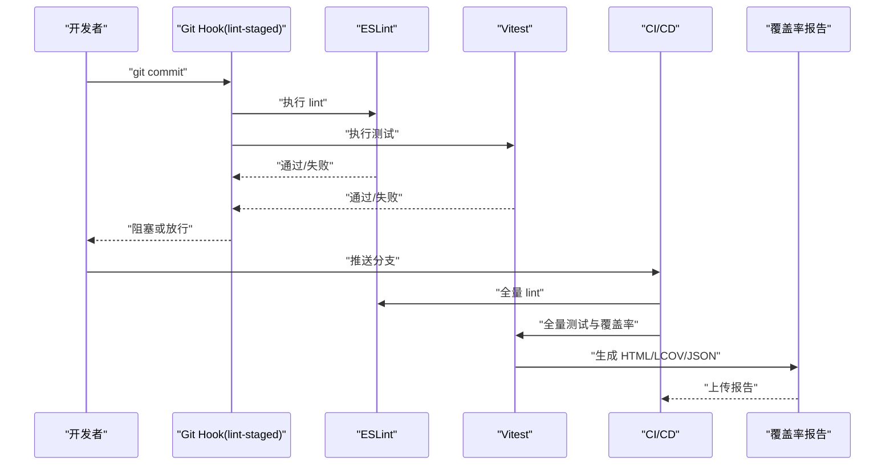
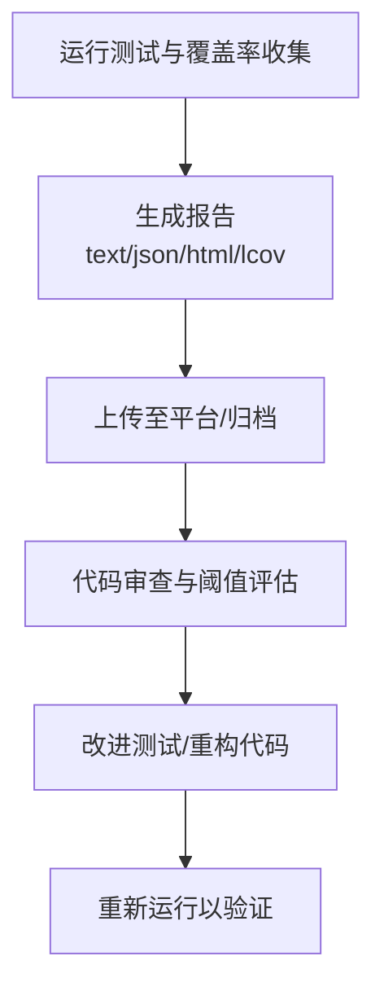
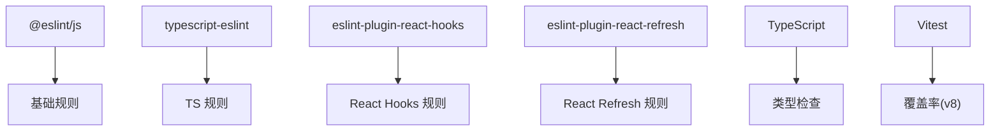

# 代码质量工具

<cite>
**本文引用的文件**
- [eslint.config.js](file://eslint.config.js)
- [package.json](file://package.json)
- [tsconfig.json](file://tsconfig.json)
- [tsconfig.app.json](file://tsconfig.app.json)
- [tsconfig.node.json](file://tsconfig.node.json)
- [vite.config.ts](file://vite.config.ts)
</cite>

## 目录
1. [简介](#简介)
2. [项目结构](#项目结构)
3. [核心组件](#核心组件)
4. [架构总览](#架构总览)
5. [详细组件分析](#详细组件分析)
6. [依赖分析](#依赖分析)
7. [性能考虑](#性能考虑)
8. [故障排查指南](#故障排查指南)
9. [结论](#结论)
10. [附录](#附录)

## 简介
本指南围绕 MaaPipelineEditor 的前端代码质量工具体系展开，重点覆盖 ESLint 配置与规则集（含 React 特定规则、TypeScript 规则与推荐扩展）、代码格式化工具 Prettier 的集成与配置建议、代码质量检查流程（提交前检查、CI/CD 集成与自动化修复）、代码审查最佳实践与常见问题、性能分析工具（Bundle Analyzer 与内存使用分析）以及代码覆盖率报告生成与分析方法。文档力求对技术与非技术读者均友好，通过可视化图示与分层讲解帮助团队建立一致、高效的代码质量保障机制。

## 项目结构
本项目采用 Vite + React + TypeScript 技术栈，代码质量工具主要由以下文件与配置构成：
- ESLint 配置：统一的 lint 规则入口，覆盖 TS/TSX 文件与浏览器环境全局变量
- TypeScript 编译配置：分别针对应用与 Node 环境的严格模式与类型检查
- Vite 测试与覆盖率配置：内置 Vitest 覆盖率与报告输出
- 包管理脚本：提供 lint、build、dev 等常用命令

图表来源
- [package.json:1-65](file://package.json#L1-L65)
- [eslint.config.js:1-24](file://eslint.config.js#L1-L24)
- [vite.config.ts:1-41](file://vite.config.ts#L1-L41)
- [tsconfig.json:1-8](file://tsconfig.json#L1-L8)
- [tsconfig.app.json:1-27](file://tsconfig.app.json#L1-L27)
- [tsconfig.node.json:1-26](file://tsconfig.node.json#L1-L26)

章节来源
- [package.json:1-65](file://package.json#L1-L65)
- [eslint.config.js:1-24](file://eslint.config.js#L1-L24)
- [vite.config.ts:1-41](file://vite.config.ts#L1-L41)
- [tsconfig.json:1-8](file://tsconfig.json#L1-L8)
- [tsconfig.app.json:1-27](file://tsconfig.app.json#L1-L27)
- [tsconfig.node.json:1-26](file://tsconfig.node.json#L1-L26)

## 核心组件
- ESLint 配置与规则集
  - 使用统一配置入口，对 TS/TSX 文件启用推荐规则集，包含 @eslint/js 推荐规则、typescript-eslint 推荐规则、React Hooks 推荐规则与 React Refresh Vite 扩展
  - 语言环境配置为浏览器全局变量，ECMAScript 版本为 2020
  - 通过忽略规则排除构建产物目录
- TypeScript 编译与类型检查
  - 应用侧启用严格模式、未使用局部变量与参数检查、switch 不穷举检查、未检查副作用的导入等
  - Node 侧同样启用严格模式与相关检查，便于后端桥接模块的类型安全
- 测试与覆盖率
  - Vitest 集成，支持文本、JSON、HTML、LCOV 多种覆盖率报告
  - 排除 node_modules、tests、类型声明、配置文件与构建目录等路径
- 包脚本
  - 提供 lint 命令用于执行 ESLint 检查
  - 提供 dev/build 等常用开发与构建命令

章节来源
- [eslint.config.js:8-23](file://eslint.config.js#L8-L23)
- [tsconfig.app.json:18-23](file://tsconfig.app.json#L18-L23)
- [tsconfig.node.json:16-22](file://tsconfig.node.json#L16-L22)
- [vite.config.ts:22-38](file://vite.config.ts#L22-L38)
- [package.json:6-19](file://package.json#L6-L19)

## 架构总览
下图展示代码质量工具在开发与 CI/CD 中的交互关系：开发者在本地运行 lint 与测试；CI 系统复用相同配置进行全量检查；构建阶段产出覆盖率报告并可接入外部平台。

图表来源
- [package.json:6-19](file://package.json#L6-L19)
- [vite.config.ts:22-38](file://vite.config.ts#L22-L38)

## 详细组件分析

### ESLint 配置与规则集
- 文件范围与扩展
  - 针对 **/** 与 **/*.tsx 的文件启用规则集
  - 继承推荐规则：基础 JS 推荐、TypeScript 推荐、React Hooks 最新推荐、React Refresh Vite 扩展
- 语言环境
  - ECMAScript 版本：2020
  - 全局变量：浏览器环境
- 忽略规则
  - 排除 dist 目录，避免对构建产物进行检查

图表来源
- [eslint.config.js:8-23](file://eslint.config.js#L8-L23)

章节来源
- [eslint.config.js:8-23](file://eslint.config.js#L8-L23)

### TypeScript 编译与类型检查
- 应用侧（tsconfig.app.json）
  - 严格模式开启，检查未使用局部变量与参数、switch 不穷举、未检查副作用的导入
  - JSX 使用 react-jsx，目标 ES2022，模块解析采用 bundler
- Node 侧（tsconfig.node.json）
  - 严格模式开启，额外启用 erasableSyntaxOnly，确保仅保留可擦除语法，减少运行时开销
  - 目标 ES2023，模块解析采用 bundler

图表来源
- [tsconfig.json:1-8](file://tsconfig.json#L1-L8)
- [tsconfig.app.json:1-27](file://tsconfig.app.json#L1-L27)
- [tsconfig.node.json:1-26](file://tsconfig.node.json#L1-L26)

章节来源
- [tsconfig.app.json:18-23](file://tsconfig.app.json#L18-L23)
- [tsconfig.node.json:16-22](file://tsconfig.node.json#L16-L22)

### 代码格式化工具（Prettier）集成与配置
- 当前仓库未发现 Prettier 配置文件或脚本，但可通过以下方式集成：
  - 安装依赖：prettier 与编辑器插件（VS Code/Prettier 插件）
  - 新增配置文件（如 .prettierrc 或 package.json 中的 prettier 字段），建议统一缩进、单引号、尾逗号等策略
  - 在 package.json 中添加格式化脚本（如 format: "prettier --write . "）
  - 将格式化纳入提交前检查（结合 husky 与 lint-staged）

[本节为概念性内容，不直接分析具体文件，故无“章节来源”]

### 代码质量检查流程
- 提交前检查
  - 运行 npm/yarn 脚本执行 ESLint 检查与测试，确保通过后再提交
  - 建议配合 husky 与 lint-staged，在 git commit 阶段自动执行格式化与 lint
- CI/CD 集成
  - 在 CI 中复用相同的 ESLint 与测试配置，保证分支与主干一致性
  - 将覆盖率报告上传至外部平台（如 Codecov、SonarQube），作为合并门禁指标之一
- 自动化修复
  - 对于可自动修复的规则（如格式化、部分 ESLint 规则），可在 CI 中执行修复并回写
  - 对于不可自动修复的规则，应在本地修复并通过 CI

图表来源
- [package.json:6-19](file://package.json#L6-L19)
- [vite.config.ts:22-38](file://vite.config.ts#L22-L38)

章节来源
- [package.json:6-19](file://package.json#L6-L19)
- [vite.config.ts:22-38](file://vite.config.ts#L22-L38)

### 代码审查最佳实践
- 审查清单
  - 是否通过 ESLint 与 TypeScript 类型检查
  - 是否包含必要的单元测试与覆盖率
  - 是否遵循组件设计与命名规范
  - 是否存在未使用的变量/参数与 switch 穷举缺失
- 常见问题与解决
  - 未使用变量/参数：删除或重命名为下划线占位
  - switch 穷举缺失：添加默认分支或重构逻辑
  - 未检查副作用导入：确认导入是否纯函数式或显式注释副作用来源
  - React Hooks 规则：确保依赖数组完整且无循环依赖

章节来源
- [tsconfig.app.json:18-23](file://tsconfig.app.json#L18-L23)
- [tsconfig.node.json:16-22](file://tsconfig.node.json#L16-L22)

### 性能分析工具使用
- Bundle Analyzer
  - 在构建后分析打包体积，识别大依赖与重复模块，优化拆分与懒加载
  - 建议在 CI 中生成并上传报告，形成历史趋势对比
- 内存使用分析
  - 结合浏览器开发者工具的 Memory 面板，监控长列表渲染、事件监听与闭包泄漏
  - 对高频更新的组件使用 React Profiler 与 Suspense 辅助定位热点

[本节为概念性内容，不直接分析具体文件，故无“章节来源”]

### 代码覆盖率报告生成与分析
- 报告类型
  - 文本：快速概览
  - JSON：便于外部系统消费
  - HTML：交互式报告，适合本地查看
  - LCOV：标准覆盖率格式，适配多种平台
- 排除策略
  - 排除 node_modules、tests、类型声明、配置文件与构建目录，聚焦源码覆盖率
- 分析方法
  - 关注函数/行/分支/路径覆盖率阈值，逐步提升
  - 对低覆盖率模块补充测试或重构为更易测试的结构
  - 将覆盖率作为合并门禁指标之一

图表来源
- [vite.config.ts:26-37](file://vite.config.ts#L26-L37)

章节来源
- [vite.config.ts:22-38](file://vite.config.ts#L22-L38)

## 依赖分析
- ESLint 生态
  - @eslint/js：基础 JS 推荐规则
  - typescript-eslint：TypeScript 推荐规则
  - eslint-plugin-react-hooks：React Hooks 推荐规则
  - eslint-plugin-react-refresh：React Refresh Vite 扩展
- TypeScript 生态
  - TypeScript 与 typescript-eslint 提供强类型与静态检查能力
- 测试生态
  - Vitest 提供测试与覆盖率能力，v8 作为覆盖率提供者
  - happy-dom 作为测试 DOM 环境

图表来源
- [package.json:41-63](file://package.json#L41-L63)
- [eslint.config.js:1-6](file://eslint.config.js#L1-L6)

章节来源
- [package.json:41-63](file://package.json#L41-L63)
- [eslint.config.js:1-6](file://eslint.config.js#L1-L6)

## 性能考虑
- 构建与打包
  - 使用 Vite 的 bundler 模式，减少不必要的模块转换与打包开销
  - 合理拆分第三方库与业务代码，利用动态导入降低首屏体积
- 运行时性能
  - 避免在渲染路径中进行重型计算，使用 useMemo/useCallback 缓存结果
  - 控制状态粒度，避免不必要的重渲染
- 覆盖率与性能权衡
  - 在 CI 中生成覆盖率报告会增加时间成本，建议在必要节点（如 PR 合并前）执行

[本节为通用指导，不直接分析具体文件，故无“章节来源”]

## 故障排查指南
- ESLint 报错
  - 未使用变量/参数：按规则删除或重命名为下划线占位
  - switch 穷举缺失：添加默认分支或重构逻辑
  - React Hooks 依赖缺失：补齐依赖数组或调整逻辑
- TypeScript 错误
  - 严格模式导致的类型不兼容：显式断言或重构为更安全的类型
  - 未检查副作用导入：确认导入是否纯函数式或显式注释副作用来源
- 覆盖率异常
  - 排除路径不当：检查 vite.config.ts 中的 coverage.exclude
  - 测试未覆盖：补充测试用例或重构为更易测试的结构

章节来源
- [tsconfig.app.json:18-23](file://tsconfig.app.json#L18-L23)
- [tsconfig.node.json:16-22](file://tsconfig.node.json#L16-L22)
- [vite.config.ts:26-37](file://vite.config.ts#L26-L37)

## 结论
本指南基于现有配置文件梳理了 MaaPipelineEditor 的代码质量工具体系，明确了 ESLint、TypeScript、Vitest 的配置要点与使用方法，并提供了提交前检查、CI/CD 集成、自动化修复、代码审查最佳实践、性能分析与覆盖率报告的实施建议。建议团队在现有基础上补充 Prettier 集成与 husky/lint-staged 提交前检查，持续完善质量门禁与报告平台对接，以实现高质量、高效率的开发流程。

## 附录
- 常用命令参考
  - lint：执行 ESLint 检查
  - dev：启动开发服务器
  - build：构建生产包
  - test：运行测试与覆盖率（通过 vite.config.ts 中的 test 配置）
- 建议新增配置
  - Prettier 配置文件与格式化脚本
  - husky + lint-staged 在提交前自动格式化与 lint
  - CI 中上传覆盖率报告至外部平台

章节来源
- [package.json:6-19](file://package.json#L6-L19)
- [vite.config.ts:22-38](file://vite.config.ts#L22-L38)