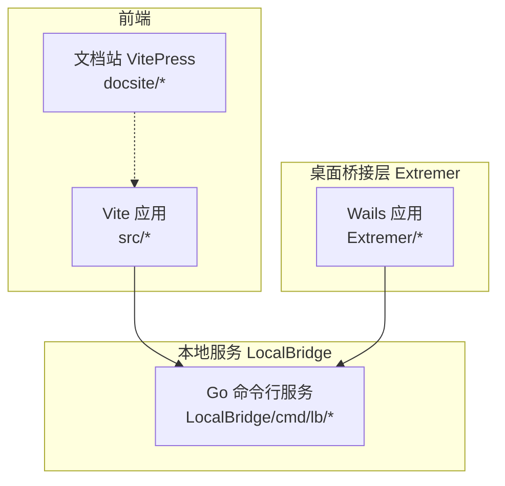
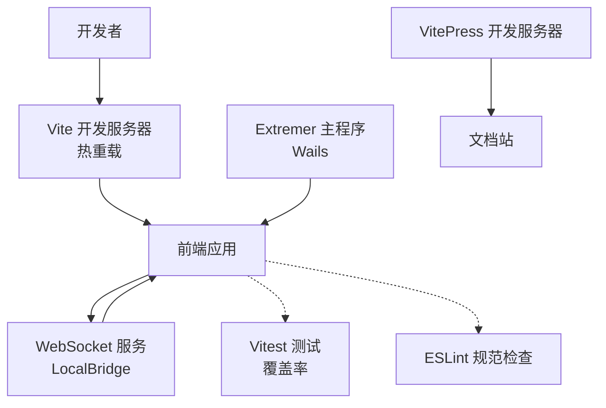
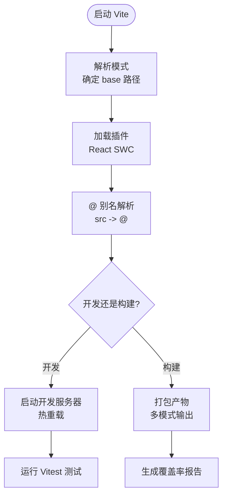
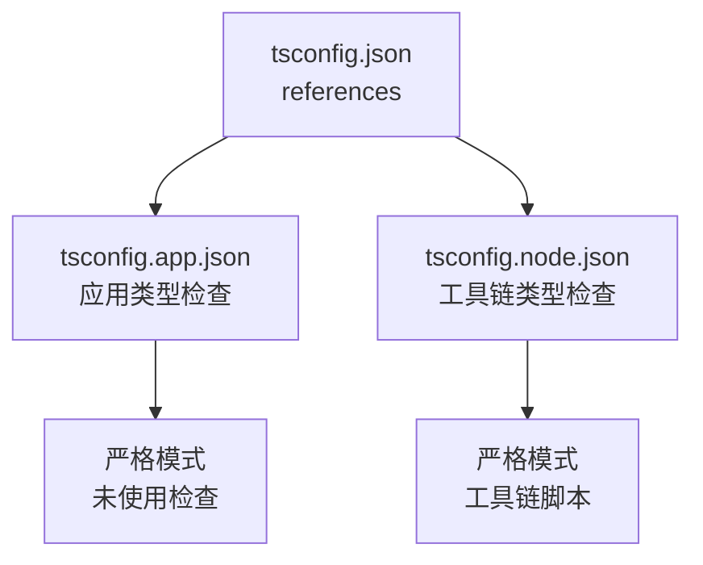
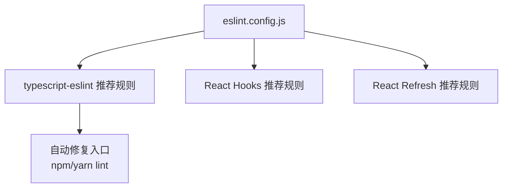
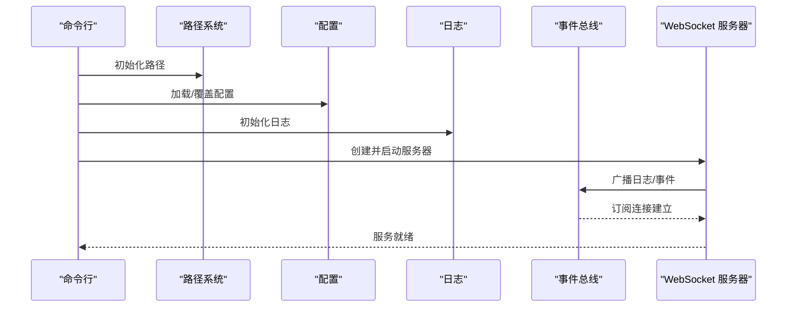
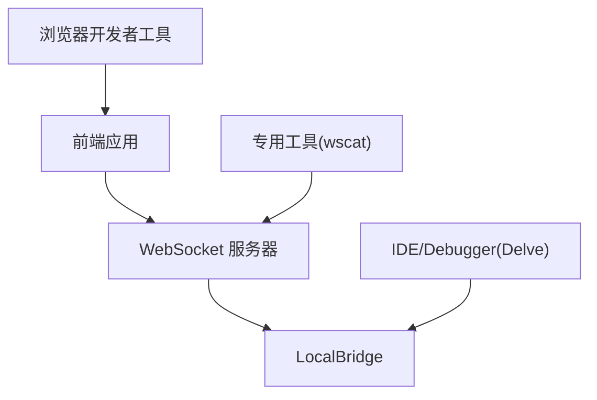
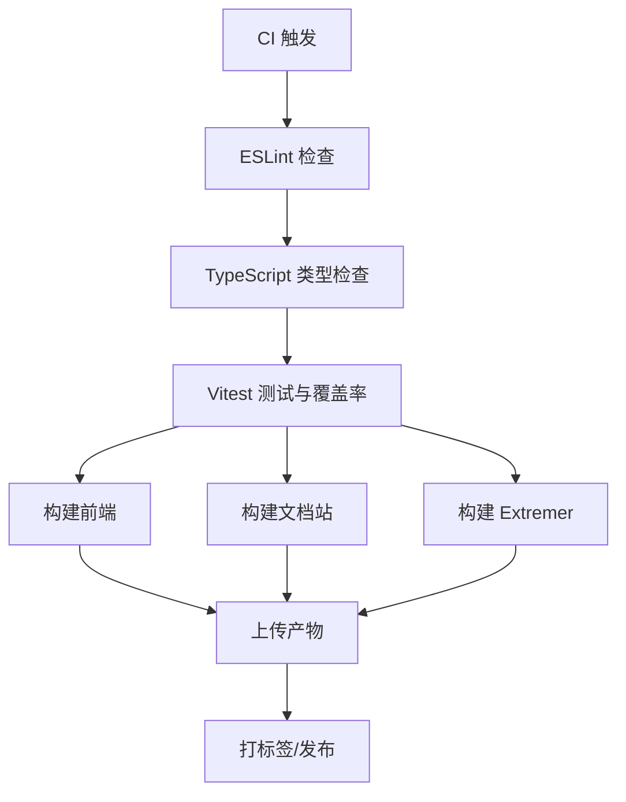
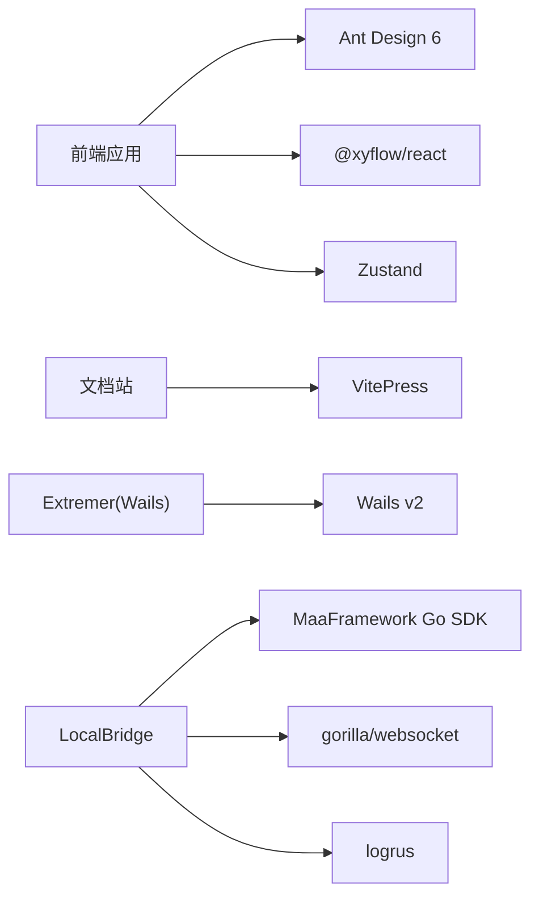

# 开发工具链

<cite>
**本文引用的文件**
- [package.json](file://package.json)
- [vite.config.ts](file://vite.config.ts)
- [tsconfig.json](file://tsconfig.json)
- [tsconfig.app.json](file://tsconfig.app.json)
- [tsconfig.node.json](file://tsconfig.node.json)
- [eslint.config.js](file://eslint.config.js)
- [Extremer/wails.json](file://Extremer/wails.json)
- [Extremer/go.mod](file://Extremer/go.mod)
- [Extremer/main.go](file://Extremer/main.go)
- [LocalBridge/go.mod](file://LocalBridge/go.mod)
- [LocalBridge/cmd/lb/main.go](file://LocalBridge/cmd/lb/main.go)
- [docsite/package.json](file://docsite/package.json)
</cite>

## 目录
1. [简介](#简介)
2. [项目结构](#项目结构)
3. [核心组件](#核心组件)
4. [架构总览](#架构总览)
5. [详细组件分析](#详细组件分析)
6. [依赖关系分析](#依赖关系分析)
7. [性能考虑](#性能考虑)
8. [故障排查指南](#故障排查指南)
9. [结论](#结论)
10. [附录](#附录)

## 简介
本文件系统性梳理 MaaPipelineEditor 的开发工具链与配置，覆盖前端 Vite 构建体系（开发服务器、热重载、打包优化）、TypeScript 类型与检查策略、ESLint 规范与自动修复、Go 语言构建与测试、调试工具（浏览器、Go、WebSocket）、性能分析与内存泄漏检测，以及持续集成相关的工具与最佳实践。内容以仓库现有配置为依据，避免臆测，便于开发者快速上手与维护。

## 项目结构
项目采用多模块组织方式：
- 前端应用位于根目录，使用 Vite + React + TypeScript 构建
- 文档站点位于 docsite，使用 VitePress
- 桌面应用桥接层 Extremer 基于 Wails，Go 语言实现
- 本地服务 LocalBridge 提供文件与 MaaFramework 能力，Go 语言实现
- 根目录提供统一脚本与 ESLint 配置

**图示来源**
- [package.json:1-65](file://package.json#L1-L65)
- [docsite/package.json:1-22](file://docsite/package.json#L1-L22)
- [Extremer/wails.json:1-18](file://Extremer/wails.json#L1-L18)
- [LocalBridge/go.mod:1-38](file://LocalBridge/go.mod#L1-L38)

**章节来源**
- [package.json:1-65](file://package.json#L1-L65)
- [docsite/package.json:1-22](file://docsite/package.json#L1-L22)
- [Extremer/wails.json:1-18](file://Extremer/wails.json#L1-L18)
- [LocalBridge/go.mod:1-38](file://LocalBridge/go.mod#L1-L38)

## 核心组件
- Vite 构建与开发工具链：开发服务器、热重载、多模式打包、测试覆盖率
- TypeScript 多项目引用配置：应用与 Node 工具链分离
- ESLint 与自动修复：基于 TypeScript ESLint 推荐规则
- Go 生态：模块管理、命令行工具、WebSocket 服务、日志与事件总线
- 文档站：VitePress 驱动的静态站点
- 桌面应用：Wails 集成前端产物与系统能力

**章节来源**
- [vite.config.ts:1-41](file://vite.config.ts#L1-L41)
- [tsconfig.json:1-8](file://tsconfig.json#L1-L8)
- [tsconfig.app.json:1-27](file://tsconfig.app.json#L1-L27)
- [tsconfig.node.json:1-26](file://tsconfig.node.json#L1-L26)
- [eslint.config.js:1-24](file://eslint.config.js#L1-L24)
- [package.json:1-65](file://package.json#L1-L65)
- [docsite/package.json:1-22](file://docsite/package.json#L1-L22)
- [Extremer/go.mod:1-39](file://Extremer/go.mod#L1-L39)
- [LocalBridge/go.mod:1-38](file://LocalBridge/go.mod#L1-L38)

## 架构总览
前端通过 Vite 提供开发体验与构建产物；桌面桥接层 Extremer 使用 Wails 将前端资源嵌入并提供系统能力；本地服务 LocalBridge 作为后端服务，通过 WebSocket 与前端通信；文档站独立于主应用，使用 VitePress。

**图示来源**
- [vite.config.ts:1-41](file://vite.config.ts#L1-L41)
- [package.json:6-18](file://package.json#L6-L18)
- [eslint.config.js:1-24](file://eslint.config.js#L1-L24)
- [Extremer/main.go:1-90](file://Extremer/main.go#L1-L90)
- [LocalBridge/cmd/lb/main.go:182-440](file://LocalBridge/cmd/lb/main.go#L182-L440)
- [docsite/package.json:7-10](file://docsite/package.json#L7-L10)

## 详细组件分析

### Vite 构建工具链与配置
- 多模式基路径与别名
  - 基础路径根据模式动态调整，支持稳定版、预览、extremer 等模式
  - 路径别名 @ 指向 src，提升导入可读性
- 插件与环境
  - 使用 @vitejs/plugin-react-swc 提升冷启动与 HMR 性能
  - 测试环境使用 happy-dom，覆盖率报告支持多种格式
- 脚本与工作流
  - dev/build/preview/server/doc 等脚本串联前后端与文档站
  - 支持将构建产物复制至 Extremer 前端目录，便于打包桌面应用

**图示来源**
- [vite.config.ts:5-40](file://vite.config.ts#L5-L40)
- [package.json:6-18](file://package.json#L6-L18)

**章节来源**
- [vite.config.ts:1-41](file://vite.config.ts#L1-L41)
- [package.json:6-18](file://package.json#L6-L18)

### TypeScript 配置与类型检查策略
- 多项目引用
  - 顶层 tsconfig.json 通过 references 引用应用与 Node 工具链配置
- 应用配置（tsconfig.app.json）
  - 目标与运行时库：ES2022 + DOM
  - 模块解析：bundler，启用严格模式与未使用项检查
  - JSX：react-jsx，无 emit
- Node 工具链配置（tsconfig.node.json）
  - 目标 ES2023，严格模式，无 emit，聚焦工具链脚本
- 类型检查策略
  - 严格模式 + 未使用局部变量/参数检查，减少潜在问题
  - 与 Vite 测试环境配合，确保类型安全

**图示来源**
- [tsconfig.json:1-8](file://tsconfig.json#L1-L8)
- [tsconfig.app.json:1-27](file://tsconfig.app.json#L1-L27)
- [tsconfig.node.json:1-26](file://tsconfig.node.json#L1-L26)

**章节来源**
- [tsconfig.json:1-8](file://tsconfig.json#L1-L8)
- [tsconfig.app.json:1-27](file://tsconfig.app.json#L1-L27)
- [tsconfig.node.json:1-26](file://tsconfig.node.json#L1-L26)

### ESLint 代码规范与自动修复
- 配置要点
  - 基于 @eslint/js 与 typescript-eslint 推荐规则
  - 启用 React Hooks 与 React Refresh 在 Vite 环境下的推荐配置
  - 作用域限定在 ts/tsx 文件
- 自动修复
  - 通过 npm/yarn scripts 中的 lint 脚本触发
  - 结合编辑器的 ESLint 插件实现保存时修复（需编辑器侧配置）

**图示来源**
- [eslint.config.js:1-24](file://eslint.config.js#L1-L24)
- [package.json:14](file://package.json#L14)

**章节来源**
- [eslint.config.js:1-24](file://eslint.config.js#L1-L24)
- [package.json:14](file://package.json#L14)

### Go 语言构建、测试与格式化工具链
- 模块与版本
  - Extremer 与 LocalBridge 均使用 go 1.24+，引入 Wails、MaaFramework、WebSocket、日志等依赖
- 命令行与子命令
  - LocalBridge 使用 cobra 实现命令行接口，支持配置管理、路径设置、日志查看、信息展示等
- WebSocket 服务与协议
  - LocalBridge 提供 WebSocket 服务器，注册多协议处理器（文件、MFW、调试、资源等），支持事件总线与历史日志推送
- 调试与可观测性
  - 内置日志系统，支持级别控制与客户端推送
  - 通过事件总线订阅连接建立事件，向新连接推送历史日志
- 构建与打包
  - Extremer 使用 Wails 配置，将前端 dist 嵌入并生成桌面应用

**图示来源**
- [LocalBridge/cmd/lb/main.go:134-166](file://LocalBridge/cmd/lb/main.go#L134-L166)
- [LocalBridge/cmd/lb/main.go:182-440](file://LocalBridge/cmd/lb/main.go#L182-L440)
- [Extremer/main.go:49-84](file://Extremer/main.go#L49-L84)

**章节来源**
- [Extremer/go.mod:1-39](file://Extremer/go.mod#L1-L39)
- [LocalBridge/go.mod:1-38](file://LocalBridge/go.mod#L1-L38)
- [Extremer/wails.json:1-18](file://Extremer/wails.json#L1-L18)
- [Extremer/main.go:1-90](file://Extremer/main.go#L1-L90)
- [LocalBridge/cmd/lb/main.go:1-882](file://LocalBridge/cmd/lb/main.go#L1-L882)

### 调试工具使用指南
- 浏览器调试
  - Vite 开发服务器提供热重载与源映射，结合浏览器开发者工具定位前端问题
- Go 调试
  - 使用 Delve（dlv）对 LocalBridge 进行断点调试；可在 IDE 中配置运行/调试配置文件
- WebSocket 调试
  - 使用浏览器开发者工具 Network 面板或专用客户端（如 wscat）观察消息收发
  - LocalBridge 在连接建立时推送历史日志，便于回溯问题

**图示来源**
- [vite.config.ts:1-41](file://vite.config.ts#L1-L41)
- [LocalBridge/cmd/lb/main.go:317-420](file://LocalBridge/cmd/lb/main.go#L317-L420)

**章节来源**
- [vite.config.ts:1-41](file://vite.config.ts#L1-L41)
- [LocalBridge/cmd/lb/main.go:317-420](file://LocalBridge/cmd/lb/main.go#L317-L420)

### 性能分析与内存泄漏检测
- 前端性能
  - 使用 Vite 的生产构建与代码分割；结合浏览器性能面板与网络面板分析首屏与交互性能
  - Vitest 覆盖率报告可用于识别未覆盖路径，间接辅助性能回归定位
- Go 性能
  - 使用 go pprof 采集 CPU/内存 profile；结合火焰图定位热点
  - 对 WebSocket 服务器与事件总线进行压力测试，监控内存增长趋势
- 内存泄漏检测
  - Go 使用 go test -race 与 pprof heap profile；前端使用浏览器内存快照对比长驻对象
  - 对文件扫描与资源管理模块重点检查循环引用与未释放句柄

**章节来源**
- [vite.config.ts:22-38](file://vite.config.ts#L22-L38)
- [LocalBridge/cmd/lb/main.go:268-312](file://LocalBridge/cmd/lb/main.go#L268-L312)

### 持续集成与最佳实践
- 建议的 CI 工作流
  - 代码检查：ESLint + TypeScript 类型检查
  - 测试：Vitest 单元测试与覆盖率上报
  - 构建：分别构建前端、文档站与桌面桥接层
  - 归档：收集构建产物与测试报告
- 版本标签与发布
  - 仓库提供 release/retag 脚本，建议在 CI 中自动化打标签与发布

**图示来源**
- [package.json:6-18](file://package.json#L6-L18)
- [eslint.config.js:1-24](file://eslint.config.js#L1-L24)
- [vite.config.ts:22-38](file://vite.config.ts#L22-L38)

**章节来源**
- [package.json:6-18](file://package.json#L6-L18)
- [eslint.config.js:1-24](file://eslint.config.js#L1-L24)
- [vite.config.ts:22-38](file://vite.config.ts#L22-L38)

## 依赖关系分析
- 前端依赖
  - React 19、Ant Design 6、@xyflow/react、Zustand 等，支撑可视化流程编辑与状态管理
- 文档站依赖
  - VitePress 与主题插件，提供文档站点开发与构建
- 桌面桥接层依赖
  - Wails v2、WebSocket、版本比较等，负责前端资源嵌入与系统能力
- 本地服务依赖
  - MaaFramework Go SDK、WebSocket、日志、配置管理、文件系统监控等

**图示来源**
- [package.json:20-40](file://package.json#L20-L40)
- [docsite/package.json:12-20](file://docsite/package.json#L12-L20)
- [Extremer/go.mod:5-8](file://Extremer/go.mod#L5-L8)
- [LocalBridge/go.mod:5-16](file://LocalBridge/go.mod#L5-L16)

**章节来源**
- [package.json:20-40](file://package.json#L20-L40)
- [docsite/package.json:12-20](file://docsite/package.json#L12-L20)
- [Extremer/go.mod:5-8](file://Extremer/go.mod#L5-L8)
- [LocalBridge/go.mod:5-16](file://LocalBridge/go.mod#L5-L16)

## 性能考虑
- 前端
  - 使用 React SWC 插件提升构建速度；合理拆分包与懒加载；利用 Vite 的按需加载与 HMR
- Go
  - 优先使用 goroutine 与 channel 解耦；避免阻塞主线程；对大文件扫描与资源处理进行并发优化
- WebSocket
  - 控制消息大小与频率，使用心跳与断线重连；对历史日志推送进行节流

[本节为通用指导，无需特定文件引用]

## 故障排查指南
- Vite 开发问题
  - 确认 base 路径与模式匹配；检查插件与别名配置；验证测试环境 happy-dom 与 setupFiles
- ESLint 报错
  - 使用 lint 脚本自动修复；检查 ts/tsx 文件规则；确认编辑器 ESLint 插件启用
- Go 服务问题
  - 查看日志级别与推送；确认配置路径与权限；检查 MaaFramework 路径与资源目录
- WebSocket 问题
  - 使用浏览器 Network 面板或专用工具验证握手与消息；关注连接建立事件与历史日志推送

**章节来源**
- [vite.config.ts:5-40](file://vite.config.ts#L5-L40)
- [eslint.config.js:1-24](file://eslint.config.js#L1-L24)
- [LocalBridge/cmd/lb/main.go:317-420](file://LocalBridge/cmd/lb/main.go#L317-L420)

## 结论
本项目采用现代化前端工程化方案（Vite + React + TypeScript）与 Go 后端（Wails + Cobra + WebSocket）相结合的架构。通过严格的类型检查、ESLint 规范与 Vitest 覆盖率，保障代码质量；通过 Wails 与本地服务实现跨平台桌面应用与强大的本地能力集成。建议在 CI 中统一执行检查、测试与构建，并结合 pprof 与浏览器性能工具进行持续优化。

## 附录
- 常用脚本
  - 开发：yarn dev
  - 构建：yarn build
  - 文档：yarn doc
  - 本地服务：yarn server
  - 规范检查：yarn lint
- Wails 配置
  - 输出文件名、前端目录、构建目录、资产目录等均在 Extremer/wails.json 中定义

**章节来源**
- [package.json:6-18](file://package.json#L6-L18)
- [Extremer/wails.json:1-18](file://Extremer/wails.json#L1-L18)