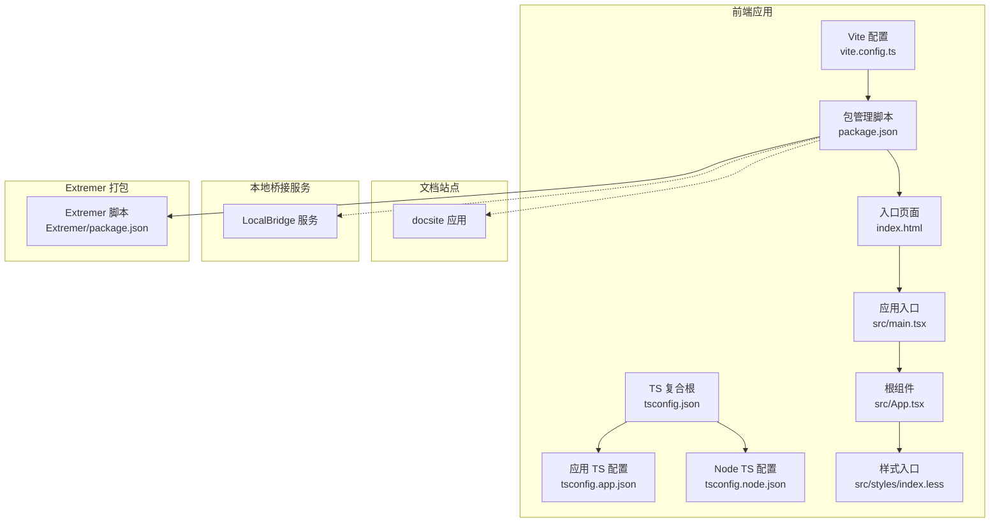
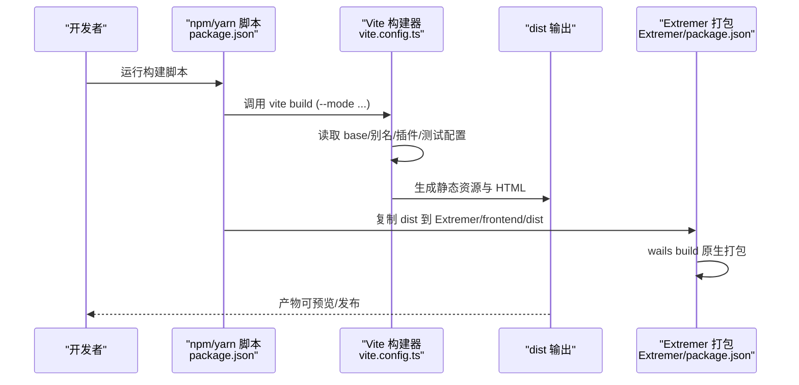
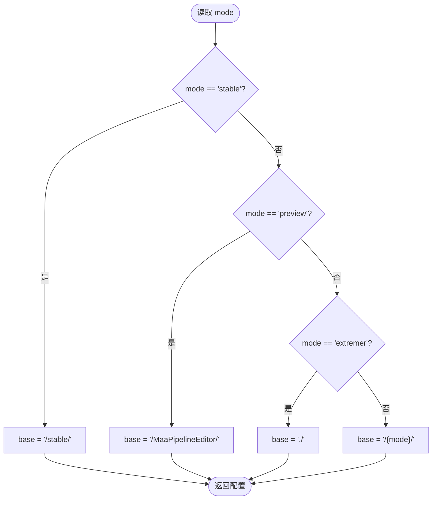
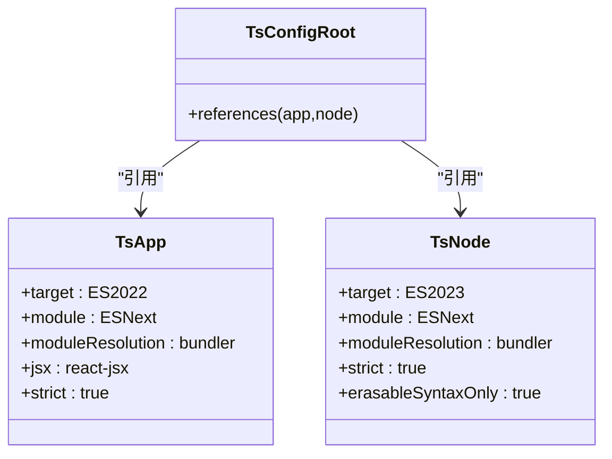
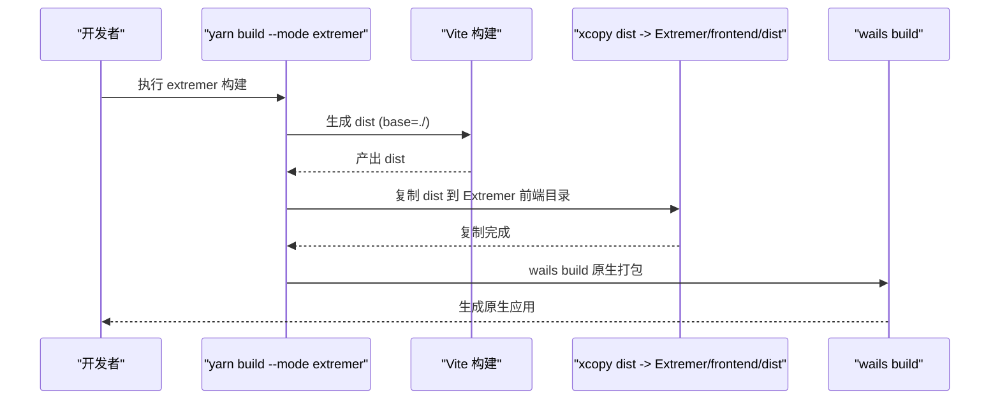
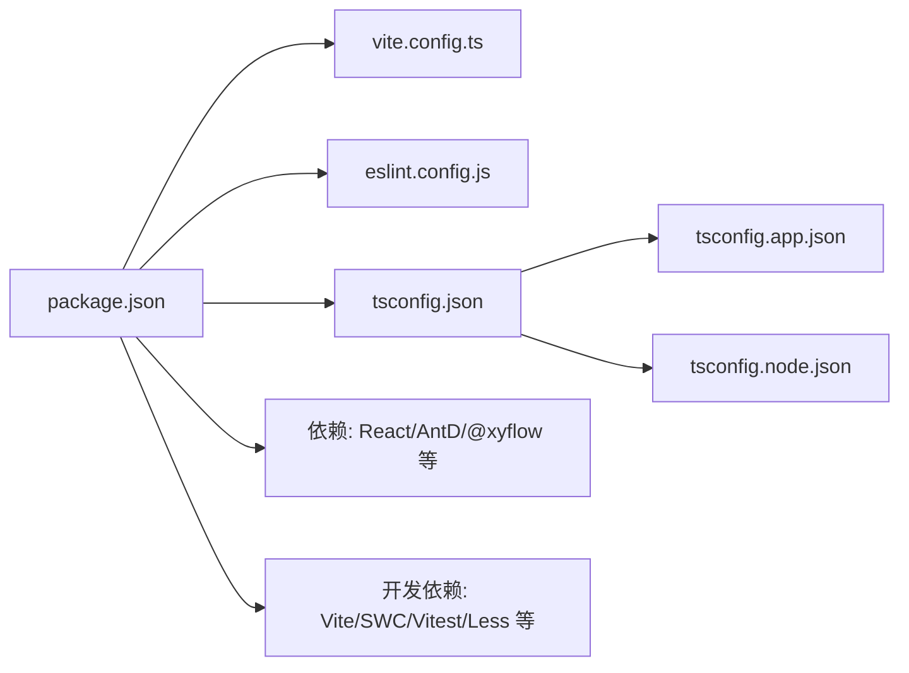

# 构建工具

<cite>
**本文引用的文件**
- [vite.config.ts](file://vite.config.ts)
- [package.json](file://package.json)
- [tsconfig.json](file://tsconfig.json)
- [tsconfig.app.json](file://tsconfig.app.json)
- [tsconfig.node.json](file://tsconfig.node.json)
- [eslint.config.js](file://eslint.config.js)
- [index.html](file://index.html)
- [src/main.tsx](file://src/main.tsx)
- [src/App.tsx](file://src/App.tsx)
- [src/styles/index.less](file://src/styles/index.less)
- [Extremer/package.json](file://Extremer/package.json)
</cite>

## 目录
1. [简介](#简介)
2. [项目结构](#项目结构)
3. [核心组件](#核心组件)
4. [架构总览](#架构总览)
5. [详细组件分析](#详细组件分析)
6. [依赖分析](#依赖分析)
7. [性能考虑](#性能考虑)
8. [故障排查指南](#故障排查指南)
9. [结论](#结论)
10. [附录](#附录)

## 简介
本文件面向 MaaPipelineEditor 的前端构建体系，围绕 Vite 配置系统、TypeScript 编译配置、多环境构建与产物组织展开，重点覆盖以下方面：
- Vite 开发服务器、热重载、路径别名与测试配置
- TypeScript 类型检查、模块解析、目标版本与严格模式
- 多环境构建（development、production、preview、extremer）
- 基础路径 base 与静态资源处理策略
- 构建性能优化（代码分割、懒加载、缓存）与产物体积分析建议
- 与 Extremer 打包集成的构建流程

## 项目结构
本项目采用“前端应用 + 文档站点 + 本地桥接服务 + Extremer 打包”的多模块布局。前端应用通过 Vite 提供开发与构建能力；TypeScript 使用复合项目分层配置；ESLint 提供统一的代码质量规则；Extremer 通过独立脚本将 Vite 产出复制到其前端目录并进行原生打包。

图表来源
- [vite.config.ts:1-41](file://vite.config.ts#L1-L41)
- [package.json:1-65](file://package.json#L1-L65)
- [tsconfig.json:1-8](file://tsconfig.json#L1-L8)
- [tsconfig.app.json:1-27](file://tsconfig.app.json#L1-L27)
- [tsconfig.node.json:1-26](file://tsconfig.node.json#L1-L26)
- [index.html:1-32](file://index.html#L1-L32)
- [src/main.tsx:1-18](file://src/main.tsx#L1-L18)
- [src/App.tsx:1-333](file://src/App.tsx#L1-L333)
- [src/styles/index.less:1-30](file://src/styles/index.less#L1-L30)
- [Extremer/package.json:1-13](file://Extremer/package.json#L1-L13)

章节来源
- [vite.config.ts:1-41](file://vite.config.ts#L1-L41)
- [package.json:1-65](file://package.json#L1-L65)
- [tsconfig.json:1-8](file://tsconfig.json#L1-L8)
- [tsconfig.app.json:1-27](file://tsconfig.app.json#L1-L27)
- [tsconfig.node.json:1-26](file://tsconfig.node.json#L1-L26)
- [index.html:1-32](file://index.html#L1-L32)
- [src/main.tsx:1-18](file://src/main.tsx#L1-L18)
- [src/App.tsx:1-333](file://src/App.tsx#L1-L333)
- [src/styles/index.less:1-30](file://src/styles/index.less#L1-L30)
- [Extremer/package.json:1-13](file://Extremer/package.json#L1-L13)

## 核心组件
- Vite 配置系统
  - 插件：React（SWC）插件
  - 路径别名：@ 指向 src
  - 测试：vitest + happy-dom，覆盖率报告与排除规则
  - 多环境 base 路径：根据 mode 动态设置
- TypeScript 编译配置
  - 复合项目：app 与 node 两套配置
  - 应用配置：ESNext 模块、bundler 解析、严格模式、JSX
  - Node 配置：ESNext 模块、bundler 解析、严格模式、仅擦除语法
- ESLint 规则：基于 typescript-eslint 与 React Refresh 推荐配置
- 多环境构建
  - development/production：默认行为
  - preview：特殊 base 路径
  - extremer：相对路径 base，用于原生打包
  - 其他模式：以 mode 名称作为 base 路径前缀
- 静态资源与入口
  - index.html 中的 base 图标与入口脚本
  - 样式入口聚合 less 文件

章节来源
- [vite.config.ts:5-41](file://vite.config.ts#L5-L41)
- [tsconfig.app.json:1-27](file://tsconfig.app.json#L1-L27)
- [tsconfig.node.json:1-26](file://tsconfig.node.json#L1-L26)
- [eslint.config.js:1-24](file://eslint.config.js#L1-L24)
- [index.html:1-32](file://index.html#L1-L32)
- [src/styles/index.less:1-30](file://src/styles/index.less#L1-L30)

## 架构总览
下图展示从命令到构建产物的关键路径，以及与 Extremer 的集成方式。

图表来源
- [package.json:6-18](file://package.json#L6-L18)
- [vite.config.ts:5-41](file://vite.config.ts#L5-L41)
- [Extremer/package.json:1-13](file://Extremer/package.json#L1-L13)

## 详细组件分析

### Vite 配置系统
- 开发服务器与热重载
  - 通过脚本调用 Vite，默认进入开发模式，启用 React 插件与路径别名，实现热更新与按需重载。
- 路径别名
  - @ 指向 src，便于在组件与工具中统一导入，降低层级耦合。
- 测试配置
  - vitest 使用 happy-dom 环境，全局测试设置、覆盖率报告（文本、JSON、HTML、LCov）与排除规则，确保测试稳定性与覆盖率统计。
- 多环境 base 路径
  - 默认 /stable/；preview 设置为 /MaaPipelineEditor/；extremer 设置为 ./；其他模式使用 /{mode}/。

图表来源
- [vite.config.ts:6-13](file://vite.config.ts#L6-L13)

章节来源
- [vite.config.ts:5-41](file://vite.config.ts#L5-L41)
- [package.json:6-18](file://package.json#L6-L18)

### TypeScript 编译配置
- 复合项目结构
  - tsconfig.json 通过 references 引入 app 与 node 两套配置，分别用于应用代码与 Vite 配置文件的类型检查。
- 应用配置（tsconfig.app.json）
  - 目标与库：ES2022 + DOM/DOM.Iterable
  - 模块：ESNext，bundler 解析，强制模块检测
  - 严格模式：开启严格、未使用变量/参数、switch 无穿透、未检查副作用导入
  - JSX：react-jsx
- Node 配置（tsconfig.node.json）
  - 目标与库：ES2023
  - 模块：ESNext，bundler 解析，强制模块检测
  - 严格模式：开启严格、未使用变量/参数、switch 无穿透、未检查副作用导入
  - 仅擦除语法：避免运行时副作用

图表来源
- [tsconfig.json:1-8](file://tsconfig.json#L1-L8)
- [tsconfig.app.json:1-27](file://tsconfig.app.json#L1-L27)
- [tsconfig.node.json:1-26](file://tsconfig.node.json#L1-L26)

章节来源
- [tsconfig.json:1-8](file://tsconfig.json#L1-L8)
- [tsconfig.app.json:1-27](file://tsconfig.app.json#L1-L27)
- [tsconfig.node.json:1-26](file://tsconfig.node.json#L1-L26)

### 多环境构建与基础路径
- development：默认开发模式，base 由 Vite 控制，通常为 /
- production：生产构建，base 由 Vite 控制，通常为 /
- preview：base 设为 /MaaPipelineEditor/，适配特定部署路径
- extremer：base 设为 ./，便于原生打包时相对路径引用
- 其他模式：base 设为 /{mode}/，便于多分支/多版本并行部署

章节来源
- [vite.config.ts:6-13](file://vite.config.ts#L6-L13)

### 静态资源与入口
- index.html
  - 设置 meta 信息、favicon、标题与入口脚本
  - 入口脚本指向 /src/main.tsx，确保运行时加载应用
- 样式入口
  - index.less 聚合 iconfonts、global、flow、antd 等样式，形成统一主题与排版
- 应用入口与根组件
  - main.tsx 初始化样式与 WebSocket，渲染 App
  - App.tsx 组织布局、面板与全局事件，负责连接本地服务与 Wails 环境

章节来源
- [index.html:1-32](file://index.html#L1-L32)
- [src/styles/index.less:1-30](file://src/styles/index.less#L1-L30)
- [src/main.tsx:1-18](file://src/main.tsx#L1-L18)
- [src/App.tsx:1-333](file://src/App.tsx#L1-L333)

### 与 Extremer 的集成
- 构建脚本
  - build:extremer：先执行 Vite 构建（--mode extremer），再将 dist 复制到 Extremer/frontend/dist
  - dev:rb：先复制 dist，再构建本地桥接服务二进制，最后启动 Extremer 开发
- 打包流程
  - 复制配置与 OCR/MAA FW 资源至构建目录后，执行 wails build 完成原生打包

图表来源
- [package.json:13](file://package.json#L13)
- [Extremer/package.json:1-13](file://Extremer/package.json#L1-L13)

章节来源
- [package.json:13](file://package.json#L13)
- [Extremer/package.json:1-13](file://Extremer/package.json#L1-L13)

## 依赖分析
- 构建链路依赖
  - package.json 的 scripts 依赖 Vite 与 React 插件
  - tsconfig.json 的复合配置依赖 tsconfig.app.json 与 tsconfig.node.json
  - ESLint 配置依赖 typescript-eslint 与 React Refresh 推荐规则
- 外部依赖
  - React 19、Ant Design 6、@xyflow/react、tesseract.js 等运行时依赖
  - Vite 7、@vitejs/plugin-react-swc、vitest、@vitest/coverage-v8、less 等开发依赖

图表来源
- [package.json:1-65](file://package.json#L1-L65)
- [vite.config.ts:1-41](file://vite.config.ts#L1-L41)
- [eslint.config.js:1-24](file://eslint.config.js#L1-L24)
- [tsconfig.json:1-8](file://tsconfig.json#L1-L8)
- [tsconfig.app.json:1-27](file://tsconfig.app.json#L1-L27)
- [tsconfig.node.json:1-26](file://tsconfig.node.json#L1-L26)

章节来源
- [package.json:1-65](file://package.json#L1-L65)
- [eslint.config.js:1-24](file://eslint.config.js#L1-L24)
- [tsconfig.json:1-8](file://tsconfig.json#L1-L8)
- [tsconfig.app.json:1-27](file://tsconfig.app.json#L1-L27)
- [tsconfig.node.json:1-26](file://tsconfig.node.json#L1-L26)

## 性能考虑
- 代码分割与懒加载
  - 使用动态 import 实现路由与重型组件的懒加载，减少首屏体积
  - 将第三方库拆分为独立 chunk，结合浏览器缓存提升二次加载速度
- 构建优化策略
  - 启用最小化与作用域提升（Vite 默认生产模式）
  - 针对 React：保留 SWC 的高效转换与 tree-shaking
  - 静态资源：将图片、字体等放入 public 并使用 CDN 或缓存头优化
- 缓存策略
  - 使用浏览器缓存与长效缓存策略（如 content-hash 文件名）
  - 避免频繁变更的公共依赖被频繁更新
- 体积分析与优化
  - 使用构建产物分析工具（如 rollup-plugin-visualizer 或 vite-bundle-analyzer）识别大体积依赖
  - 移除未使用代码与类型声明文件，保持严格模式减少冗余
- 开发体验
  - 在开发模式下禁用压缩与长缓存，提高热更新效率
  - 使用 sourcemap 便于调试

## 故障排查指南
- base 路径导致资源 404
  - 检查 vite.config.ts 中的 base 设置与部署路径是否一致
  - preview/extremer 模式下 base 不同，确认当前构建模式
- 路径别名无效
  - 确认 @ 指向 src，且编辑器/IDE 支持 Vite 别名解析
- 测试覆盖率异常
  - 检查 vitest 覆盖率排除规则与测试入口文件
- ESLint 报错
  - 确保使用 typescript-eslint 推荐规则，并与 Vite/React Refresh 配置一致
- Extremer 打包缺失资源
  - 确认 build:extremer 脚本已执行，dist 成功复制到 Extremer/frontend/dist

章节来源
- [vite.config.ts:5-41](file://vite.config.ts#L5-L41)
- [package.json:6-18](file://package.json#L6-L18)
- [eslint.config.js:1-24](file://eslint.config.js#L1-L24)
- [Extremer/package.json:1-13](file://Extremer/package.json#L1-L13)

## 结论
本构建体系以 Vite 为核心，配合 TypeScript 复合配置与 ESLint 规范，实现了跨环境的一致性与可维护性。通过合理的 base 路径策略与静态资源组织，满足 web 与原生打包场景。建议在持续迭代中引入体积分析与缓存策略，进一步优化加载性能与用户体验。

## 附录
- 常用命令
  - 开发：yarn dev
  - 生产构建：yarn build
  - 预览：yarn preview
  - Extremer 构建：yarn build:extremer
- 关键配置参考
  - Vite：vite.config.ts
  - TypeScript：tsconfig.json、tsconfig.app.json、tsconfig.node.json
  - ESLint：eslint.config.js
  - 入口与样式：index.html、src/styles/index.less
  - Extremer 集成：Extremer/package.json