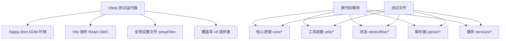
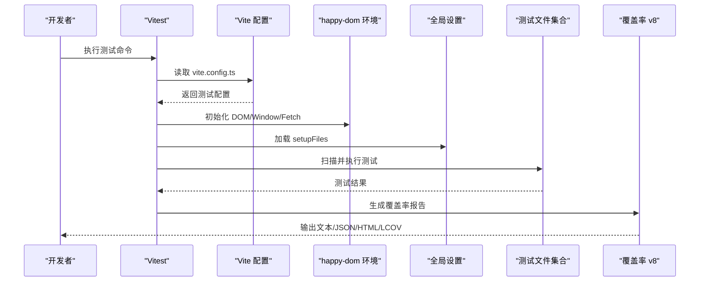
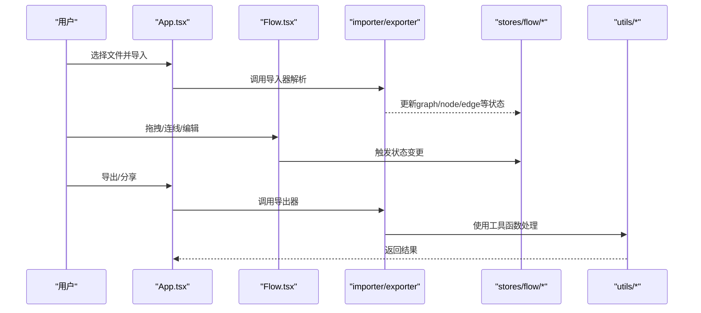
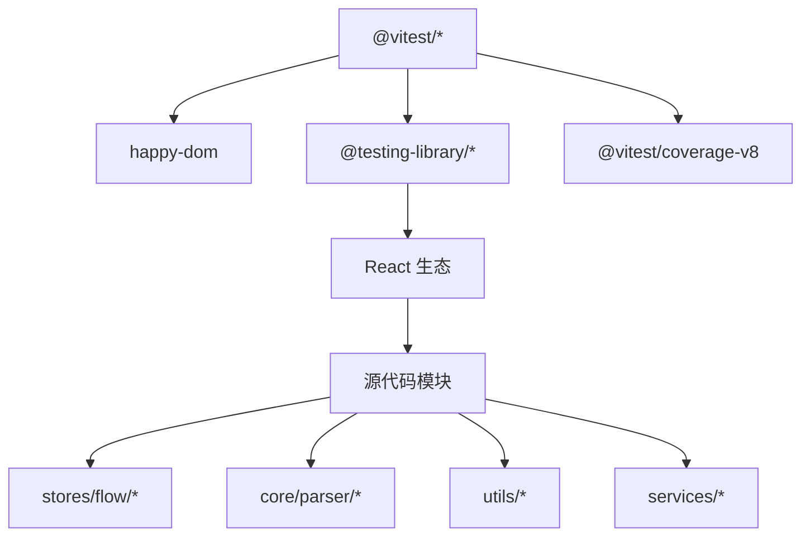

# 测试框架

<cite>
**本文引用的文件**
- [package.json](file://package.json)
- [vite.config.ts](file://vite.config.ts)
- [.gitignore](file://.gitignore)
- [README.md](file://README.md)
- [src/App.tsx](file://src/App.tsx)
- [src/components/Flow.tsx](file://src/components/Flow.tsx)
- [src/services/server.ts](file://src/services/server.ts)
- [src/stores/flow/index.ts](file://src/stores/flow/index.ts)
- [src/utils/jsonHelper.ts](file://src/utils/jsonHelper.ts)
- [src/utils/wailsBridge.ts](file://src/utils/wailsBridge.ts)
- [src/hooks/useCanvasViewport.ts](file://src/hooks/useCanvasViewport.ts)
- [src/hooks/useGlobalShortcuts.ts](file://src/hooks/useGlobalShortcuts.ts)
- [src/stores/flow/slices/graphSlice.ts](file://src/stores/flow/slices/graphSlice.ts)
- [src/stores/flow/slices/nodeSlice.ts](file://src/stores/flow/slices/nodeSlice.ts)
- [src/stores/flow/slices/edgeSlice.ts](file://src/stores/flow/slices/edgeSlice.ts)
- [src/stores/flow/slices/historySlice.ts](file://src/stores/flow/slices/historySlice.ts)
- [src/stores/flow/slices/pathSlice.ts](file://src/stores/flow/slices/pathSlice.ts)
- [src/stores/flow/slices/selectionSlice.ts](file://src/stores/flow/slices/selectionSlice.ts)
- [src/stores/flow/slices/viewSlice.ts](file://src/stores/flow/slices/viewSlice.ts)
- [src/stores/flow/utils/nodeUtils.ts](file://src/stores/flow/utils/nodeUtils.ts)
- [src/stores/flow/utils/edgeUtils.ts](file://src/stores/flow/utils/edgeUtils.ts)
- [src/stores/flow/utils/viewportUtils.ts](file://src/stores/flow/utils/viewportUtils.ts)
- [src/core/parser/importer.ts](file://src/core/parser/importer.ts)
- [src/core/parser/exporter.ts](file://src/core/parser/exporter.ts)
- [src/core/parser/nodeParser.ts](file://src/core/parser/nodeParser.ts)
- [src/core/parser/edgeLinker.ts](file://src/core/parser/edgeLinker.ts)
- [src/core/fields/fieldFactory.ts](file://src/core/fields/fieldFactory.ts)
- [src/core/fields/action/fields.ts](file://src/core/fields/action/fields.ts)
- [src/core/fields/recognition/fields.ts](file://src/core/fields/recognition/fields.ts)
- [src/core/fields/other/schema.ts](file://src/core/fields/other/schema.ts)
- [src/core/layout.ts](file://src/core/layout.ts)
- [src/core/snapUtils.ts](file://src/core/snapUtils.ts)
- [src/utils/clipboard.ts](file://src/utils/clipboard.ts)
- [src/utils/snapper.ts](file://src/utils/snapper.ts)
- [src/utils/panelPosition.ts](file://src/utils/panelPosition.ts)
- [src/utils/roiNegativeCoord.ts](file://src/utils/roiNegativeCoord.ts)
- [src/utils/urlHelper.ts](file://src/utils/urlHelper.ts)
- [src/utils/openai.ts](file://src/utils/openai.ts)
- [src/utils/aiPredictor.ts](file://src/utils/aiPredictor.ts)
- [src/utils/bufferHelper.ts](file://src/utils/bufferHelper.ts)
- [src/utils/shareHelper.ts](file://src/utils/shareHelper.ts)
- [src/utils/nodeNameHelper.ts](file://src/utils/nodeNameHelper.ts)
- [src/utils/__tests__/jsonHelper.test.ts](file://src/utils/__tests__/jsonHelper.test.ts)
- [src/utils/__tests__/wailsBridge.test.ts](file://src/utils/__tests__/wailsBridge.test.ts)
- [src/stores/flow/__tests__/graphSlice.test.ts](file://src/stores/flow/__tests__/graphSlice.test.ts)
- [src/stores/flow/__tests__/nodeSlice.test.ts](file://src/stores/flow/__tests__/nodeSlice.test.ts)
- [src/stores/flow/__tests__/edgeSlice.test.ts](file://src/stores/flow/__tests__/edgeSlice.test.ts)
- [src/stores/flow/__tests__/historySlice.test.ts](file://src/stores/flow/__tests__/historySlice.test.ts)
- [src/stores/flow/__tests__/pathSlice.test.ts](file://src/stores/flow/__tests__/pathSlice.test.ts)
- [src/stores/flow/__tests__/selectionSlice.test.ts](file://src/stores/flow/__tests__/selectionSlice.test.ts)
- [src/stores/flow/__tests__/viewSlice.test.ts](file://src/stores/flow/__tests__/viewSlice.test.ts)
- [src/core/parser/__tests__/importer.test.ts](file://src/core/parser/__tests__/importer.test.ts)
- [src/core/parser/__tests__/exporter.test.ts](file://src/core/parser/__tests__/exporter.test.ts)
- [src/core/parser/__tests__/nodeParser.test.ts](file://src/core/parser/__tests__/nodeParser.test.ts)
- [src/core/parser/__tests__/edgeLinker.test.ts](file://src/core/parser/__tests__/edgeLinker.test.ts)
- [src/core/fields/__tests__/fieldFactory.test.ts](file://src/core/fields/__tests__/fieldFactory.test.ts)
- [src/core/fields/__tests__/action/fields.test.ts](file://src/core/fields/__tests__/action/fields.test.ts)
- [src/core/fields/__tests__/recognition/fields.test.ts](file://src/core/fields/__tests__/recognition/fields.test.ts)
- [src/core/fields/__tests__/other/schema.test.ts](file://src/core/fields/__tests__/other/schema.test.ts)
- [src/core/__tests__/layout.test.ts](file://src/core/__tests__/layout.test.ts)
- [src/core/__tests__/snapUtils.test.ts](file://src/core/__tests__/snapUtils.test.ts)
- [src/utils/__tests__/clipboard.test.ts](file://src/utils/__tests__/clipboard.test.ts)
- [src/utils/__tests__/snapper.test.ts](file://src/utils/__tests__/snapper.test.ts)
- [src/utils/__tests__/panelPosition.test.ts](file://src/utils/__tests__/panelPosition.test.ts)
- [src/utils/__tests__/roiNegativeCoord.test.ts](file://src/utils/__tests__/roiNegativeCoord.test.ts)
- [src/utils/__tests__/urlHelper.test.ts](file://src/utils/__tests__/urlHelper.test.ts)
- [src/utils/__tests__/openai.test.ts](file://src/utils/__tests__/openai.test.ts)
- [src/utils/__tests__/aiPredictor.test.ts](file://src/utils/__tests__/aiPredictor.test.ts)
- [src/utils/__tests__/bufferHelper.test.ts](file://src/utils/__tests__/bufferHelper.test.ts)
- [src/utils/__tests__/shareHelper.test.ts](file://src/utils/__tests__/shareHelper.test.ts)
- [src/utils/__tests__/nodeNameHelper.test.ts](file://src/utils/__tests__/nodeNameHelper.test.ts)
</cite>

## 目录
1. [简介](#简介)
2. [项目结构](#项目结构)
3. [核心组件](#核心组件)
4. [架构总览](#架构总览)
5. [详细组件分析](#详细组件分析)
6. [依赖分析](#依赖分析)
7. [性能考虑](#性能考虑)
8. [故障排查指南](#故障排查指南)
9. [结论](#结论)
10. [附录](#附录)

## 简介
本文件面向MaaPipelineEditor前端测试体系，系统化梳理基于Vitest的测试框架配置与实践，覆盖单元测试、集成测试与端到端测试策略；详解测试环境（happy-dom）、全局设置与覆盖率配置；说明Mock数据与异步操作Mock方法；总结测试工具函数与断言库使用；给出测试用例设计、数据管理与维护策略，并补充持续集成中的测试自动化建议。

## 项目结构
- 测试框架由Vitest驱动，配合happy-dom作为DOM环境，通过Vite插件加载React组件生态。
- 测试文件采用按模块分层组织：核心逻辑（core）、工具函数（utils）、状态管理（stores/flow）、解析器（parser）、服务（services）等均有对应测试文件。
- 覆盖率报告输出至文本、JSON、HTML与LCOV，便于CI集成与可视化。

**图表来源**
- [vite.config.ts:22-38](file://vite.config.ts#L22-L38)
- [package.json:41-62](file://package.json#L41-L62)

**章节来源**
- [vite.config.ts:1-41](file://vite.config.ts#L1-L41)
- [package.json:1-65](file://package.json#L1-L65)

## 核心组件
- 测试运行器与环境
  - Vitest版本与期望库：确保断言能力与快照一致性。
  - happy-dom：提供浏览器API（DOM、Window、Fetch等），满足前端组件与工具函数测试需求。
- 全局设置
  - setupFiles：用于注册自定义匹配器、全局变量或初始化逻辑（如jest-dom扩展）。
- 覆盖率配置
  - v8提供者：生成覆盖率数据。
  - 多格式输出：text、json、html、lcov，适配不同CI工具链。
  - 排除规则：node_modules、tests目录、类型声明、配置文件、dist等。

**章节来源**
- [vite.config.ts:22-38](file://vite.config.ts#L22-L38)
- [package.json:41-62](file://package.json#L41-L62)

## 架构总览
下图展示测试执行的关键路径：Vitest启动后加载Vite配置，注入happy-dom环境与setupFiles，随后扫描各模块测试文件并执行，最终生成覆盖率报告。

**图表来源**
- [vite.config.ts:22-38](file://vite.config.ts#L22-L38)
- [package.json:41-62](file://package.json#L41-L62)

## 详细组件分析

### 单元测试策略与示例
- 命名规范：以被测模块名为前缀，如“jsonHelper”、“wailsBridge”等，统一放置于对应模块的“__tests__”目录。
- 断言库：使用Vitest内置expect与jest-dom扩展，支持DOM元素断言与自定义匹配器。
- Mock策略：
  - API Mock：对fetch或服务层接口进行拦截，返回预设响应或错误。
  - 组件Mock：对复杂子组件进行浅渲染或存根，隔离UI交互。
  - 异步操作Mock：使用jest.useFakeTimers或vi.setSystemTime控制时间；对Promise进行vi.fn.mockResolvedValue/reject。
- 数据Mock：集中管理在tests/mocks目录，避免重复构造；对JSON数据可直接导入测试用例。
- 示例参考：
  - 工具函数测试：jsonHelper、wailsBridge、urlHelper、openai、aiPredictor、bufferHelper、shareHelper、nodeNameHelper等。
  - 状态管理测试：graphSlice、nodeSlice、edgeSlice、historySlice、pathSlice、selectionSlice、viewSlice等。
  - 解析器测试：importer、exporter、nodeParser、edgeLinker等。
  - 核心逻辑测试：layout、snapUtils等。
  - 通用工具测试：clipboard、snapper、panelPosition、roiNegativeCoord等。

**章节来源**
- [src/utils/__tests__/jsonHelper.test.ts](file://src/utils/__tests__/jsonHelper.test.ts)
- [src/utils/__tests__/wailsBridge.test.ts](file://src/utils/__tests__/wailsBridge.test.ts)
- [src/stores/flow/__tests__/graphSlice.test.ts](file://src/stores/flow/__tests__/graphSlice.test.ts)
- [src/stores/flow/__tests__/nodeSlice.test.ts](file://src/stores/flow/__tests__/nodeSlice.test.ts)
- [src/stores/flow/__tests__/edgeSlice.test.ts](file://src/stores/flow/__tests__/edgeSlice.test.ts)
- [src/stores/flow/__tests__/historySlice.test.ts](file://src/stores/flow/__tests__/historySlice.test.ts)
- [src/stores/flow/__tests__/pathSlice.test.ts](file://src/stores/flow/__tests__/pathSlice.test.ts)
- [src/stores/flow/__tests__/selectionSlice.test.ts](file://src/stores/flow/__tests__/selectionSlice.test.ts)
- [src/stores/flow/__tests__/viewSlice.test.ts](file://src/stores/flow/__tests__/viewSlice.test.ts)
- [src/core/parser/__tests__/importer.test.ts](file://src/core/parser/__tests__/importer.test.ts)
- [src/core/parser/__tests__/exporter.test.ts](file://src/core/parser/__tests__/exporter.test.ts)
- [src/core/parser/__tests__/nodeParser.test.ts](file://src/core/parser/__tests__/nodeParser.test.ts)
- [src/core/parser/__tests__/edgeLinker.test.ts](file://src/core/parser/__tests__/edgeLinker.test.ts)
- [src/core/fields/__tests__/fieldFactory.test.ts](file://src/core/fields/__tests__/fieldFactory.test.ts)
- [src/core/fields/__tests__/action/fields.test.ts](file://src/core/fields/__tests__/action/fields.test.ts)
- [src/core/fields/__tests__/recognition/fields.test.ts](file://src/core/fields/__tests__/recognition/fields.test.ts)
- [src/core/fields/__tests__/other/schema.test.ts](file://src/core/fields/__tests__/other/schema.test.ts)
- [src/core/__tests__/layout.test.ts](file://src/core/__tests__/layout.test.ts)
- [src/core/__tests__/snapUtils.test.ts](file://src/core/__tests__/snapUtils.test.ts)
- [src/utils/__tests__/clipboard.test.ts](file://src/utils/__tests__/clipboard.test.ts)
- [src/utils/__tests__/snapper.test.ts](file://src/utils/__tests__/snapper.test.ts)
- [src/utils/__tests__/panelPosition.test.ts](file://src/utils/__tests__/panelPosition.test.ts)
- [src/utils/__tests__/roiNegativeCoord.test.ts](file://src/utils/__tests__/roiNegativeCoord.test.ts)
- [src/utils/__tests__/urlHelper.test.ts](file://src/utils/__tests__/urlHelper.test.ts)
- [src/utils/__tests__/openai.test.ts](file://src/utils/__tests__/openai.test.ts)
- [src/utils/__tests__/aiPredictor.test.ts](file://src/utils/__tests__/aiPredictor.test.ts)
- [src/utils/__tests__/bufferHelper.test.ts](file://src/utils/__tests__/bufferHelper.test.ts)
- [src/utils/__tests__/shareHelper.test.ts](file://src/utils/__tests__/shareHelper.test.ts)
- [src/utils/__tests__/nodeNameHelper.test.ts](file://src/utils/__tests__/nodeNameHelper.test.ts)

### 集成测试策略
- 目标：验证多个模块协作时的行为，如store与parser的联动、UI与服务层的交互。
- 方法：
  - 使用happy-dom模拟浏览器上下文，避免真实网络请求。
  - 对外部依赖进行最小化Mock，确保测试聚焦业务逻辑。
  - 利用Zustand的store切片测试，组合多个slice的状态变更。
- 关键模块：
  - stores/flow：graph、node、edge、history、path、selection、view等slice的组合行为。
  - parser：importer与exporter在真实数据上的往返校验。
  - services：server.ts与wailsBridge.ts的交互验证。

**章节来源**
- [src/stores/flow/index.ts](file://src/stores/flow/index.ts)
- [src/core/parser/importer.ts](file://src/core/parser/importer.ts)
- [src/core/parser/exporter.ts](file://src/core/parser/exporter.ts)
- [src/services/server.ts](file://src/services/server.ts)
- [src/utils/wailsBridge.ts](file://src/utils/wailsBridge.ts)

### 端到端测试策略
- 目标：模拟用户完整操作流程，验证从导入到编辑再到导出的端到端路径。
- 方法：
  - 在happy-dom中构建完整的应用上下文，挂载App.tsx与Flow.tsx。
  - 使用Testing Library进行用户交互模拟（点击、输入、拖拽等）。
  - 通过store与parser验证状态变化与数据流转。
- 关键流程：
  - 文件导入与解析（App.tsx与importer）。
  - 画布节点增删改与连线（Flow.tsx与graphSlice、edgeSlice）。
  - 导出与分享（exporter与shareHelper）。

**图表来源**
- [src/App.tsx:120-190](file://src/App.tsx#L120-L190)
- [src/components/Flow.tsx:60-130](file://src/components/Flow.tsx#L60-L130)
- [src/core/parser/importer.ts:1-120](file://src/core/parser/importer.ts#L1-120)
- [src/core/parser/exporter.ts:1-120](file://src/core/parser/exporter.ts#L1-120)
- [src/stores/flow/index.ts:1-120](file://src/stores/flow/index.ts#L1-120)
- [src/utils/shareHelper.ts:1-120](file://src/utils/shareHelper.ts#L1-120)

### 测试环境配置
- DOM环境：happy-dom提供Window、Document、Navigator等浏览器API，满足组件渲染与事件模拟。
- 全局设置：setupFiles用于注册jest-dom匹配器、全局变量或第三方库初始化。
- 脚本命令：通过package.json脚本触发测试执行与覆盖率收集。

**章节来源**
- [vite.config.ts:22-26](file://vite.config.ts#L22-L26)
- [package.json:6-19](file://package.json#L6-L19)

### Mock数据与异步操作Mock
- Mock数据管理：
  - 将常用测试数据集中存放于tests/mocks，按模块分类，减少重复构造。
  - JSON样例可直接导入，保证测试数据一致性。
- 异步操作Mock：
  - 使用vi.useFakeTimers控制定时器与延时。
  - 对Promise进行vi.fn().mockResolvedValue或mockRejectedValue。
  - 对fetch进行vi.spyOn或vi.fn实现拦截与定制响应。

**章节来源**
- [vite.config.ts:26-37](file://vite.config.ts#L26-L37)

### 测试工具函数与断言库
- 断言库：Vitest expect与jest-dom扩展，支持DOM元素断言、自定义匹配器与快照。
- Testing Library：用于组件渲染与用户交互模拟，提升测试可维护性。
- 辅助函数：在__tests__目录下提供共享的测试辅助函数，如渲染器、事件触发器、store初始化器等。

**章节来源**
- [package.json:43-45](file://package.json#L43-L45)
- [package.json:51](file://package.json#L51)

### 测试最佳实践
- 用例设计：
  - 每个模块至少覆盖正常路径、边界条件与异常分支。
  - 使用参数化测试覆盖多组输入数据。
- 测试数据管理：
  - 将测试数据与测试代码分离，集中管理在tests/mocks。
  - 对外部依赖进行最小化Mock，避免过度耦合。
- 测试维护：
  - 保持测试命名一致、目录结构清晰。
  - 定期重构测试，删除过时用例，优化重复逻辑。
- 覆盖率与质量：
  - 设置覆盖率阈值，确保关键路径得到覆盖。
  - 结合CI自动执行测试与覆盖率报告。

**章节来源**
- [vite.config.ts:26-37](file://vite.config.ts#L26-L37)

## 依赖分析
- 测试相关依赖：
  - Vitest与@vitest/coverage-v8：测试运行与覆盖率。
  - happy-dom：DOM环境。
  - @testing-library/react/jest-dom：组件与DOM断言。
  - @vitejs/plugin-react-swc：React生态支持。
- 模块间耦合：
  - stores/flow与parser存在强耦合，需在集成测试中重点验证。
  - utils与services之间存在间接依赖，应通过Mock隔离。

**图表来源**
- [package.json:41-62](file://package.json#L41-L62)
- [vite.config.ts:16-21](file://vite.config.ts#L16-L21)

**章节来源**
- [package.json:41-62](file://package.json#L41-L62)
- [vite.config.ts:16-21](file://vite.config.ts#L16-L21)

## 性能考虑
- 测试执行性能：
  - 使用happy-dom避免真实浏览器开销，提升执行速度。
  - 合理拆分测试文件，避免单文件过大导致加载与执行缓慢。
- 覆盖率性能：
  - v8提供者开销较小，但过多报告格式会增加I/O；建议在CI中仅启用必要格式。
- 异步测试优化：
  - 使用vi.useFakeTimers减少等待时间，提高稳定性与速度。

**章节来源**
- [vite.config.ts:26-37](file://vite.config.ts#L26-L37)

## 故障排查指南
- 常见问题：
  - DOM API缺失：确认happy-dom已正确安装与配置。
  - 全局设置未生效：检查setupFiles路径与加载顺序。
  - 覆盖率不更新：核对exclude规则与报告格式配置。
- 排查步骤：
  - 逐步缩小测试范围，定位失败用例。
  - 检查Mock是否正确，特别是异步与网络请求。
  - 查看Vitest输出与覆盖率报告，结合断言信息定位问题。

**章节来源**
- [vite.config.ts:22-38](file://vite.config.ts#L22-L38)

## 结论
本测试框架以Vitest为核心，结合happy-dom与jest-dom，实现了从单元到集成再到端到端的多层次测试覆盖。通过合理的Mock策略、统一的数据管理与严格的覆盖率配置，能够有效保障MaaPipelineEditor前端代码的质量与稳定性。建议在CI中集成测试与覆盖率报告，持续改进测试用例与维护策略。

## 附录
- 脚本命令参考：
  - 开发与构建：参见package.json中的脚本定义。
- 项目背景与目标：参见README.md与项目根目录说明。

**章节来源**
- [package.json:6-19](file://package.json#L6-L19)
- [README.md](file://README.md)
- [.gitignore](file://.gitignore)