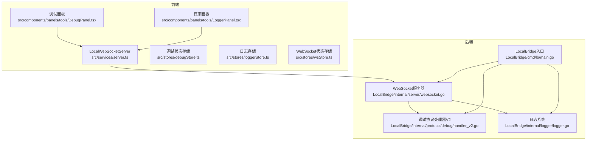
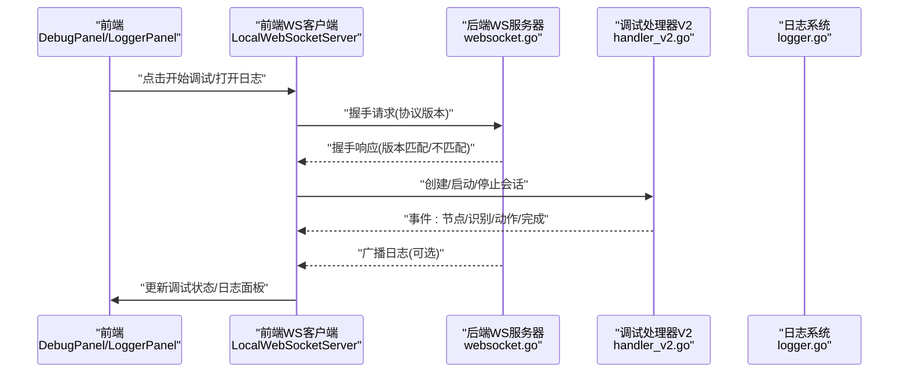
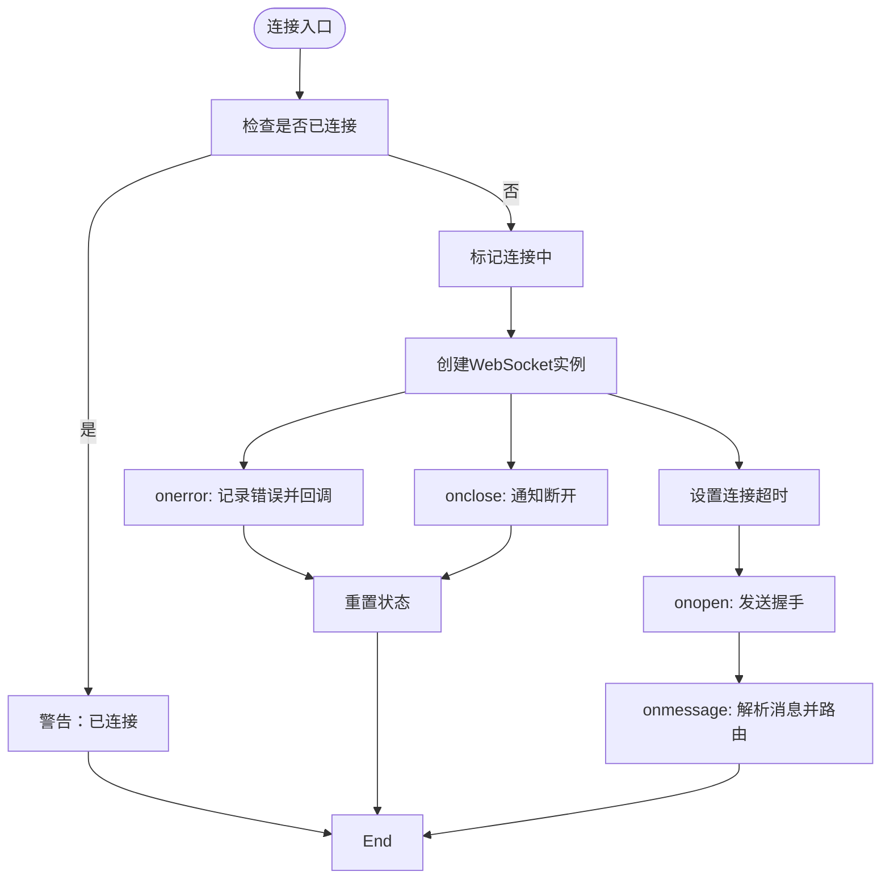
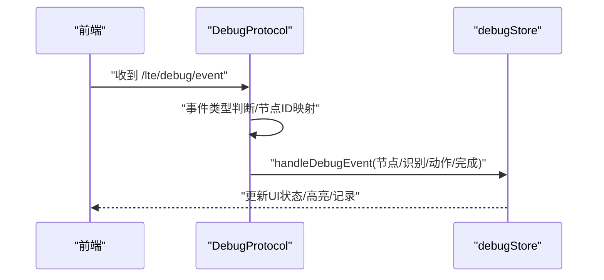
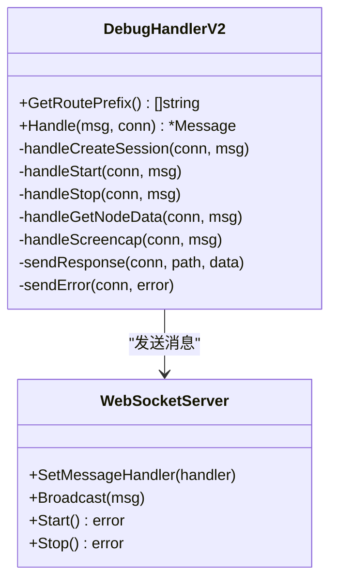
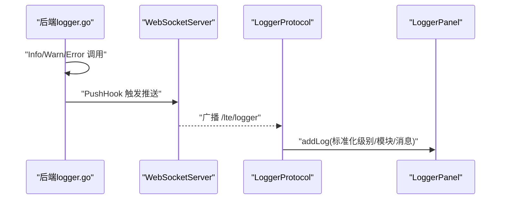
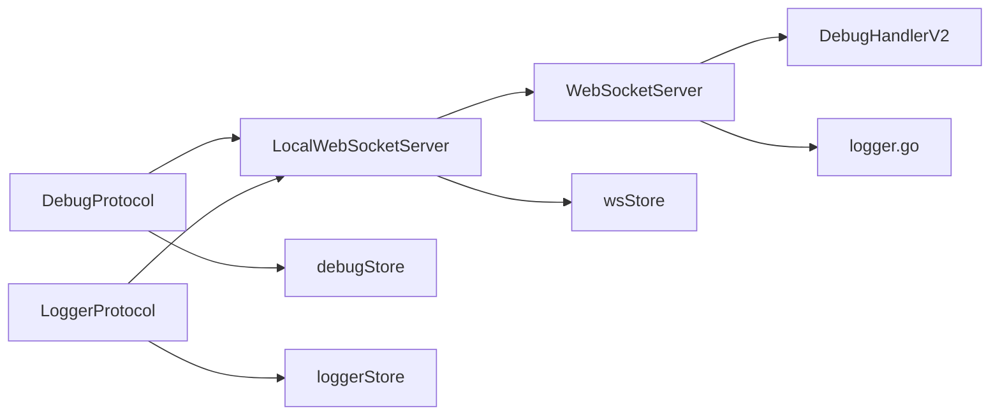

# 调试工具

<cite>
**本文引用的文件**
- [README.md](file://README.md)
- [Extremer/main.go](file://Extremer/main.go)
- [LocalBridge/cmd/lb/main.go](file://LocalBridge/cmd/lb/main.go)
- [LocalBridge/internal/server/websocket.go](file://LocalBridge/internal/server/websocket.go)
- [LocalBridge/internal/protocol/debug/handler_v2.go](file://LocalBridge/internal/protocol/debug/handler_v2.go)
- [LocalBridge/internal/logger/logger.go](file://LocalBridge/internal/logger/logger.go)
- [src/services/server.ts](file://src/services/server.ts)
- [src/services/protocols/DebugProtocol.ts](file://src/services/protocols/DebugProtocol.ts)
- [src/services/protocols/LoggerProtocol.ts](file://src/services/protocols/LoggerProtocol.ts)
- [src/components/panels/tools/DebugPanel.tsx](file://src/components/panels/tools/DebugPanel.tsx)
- [src/components/panels/tools/LoggerPanel.tsx](file://src/components/panels/tools/LoggerPanel.tsx)
- [src/stores/debugStore.ts](file://src/stores/debugStore.ts)
- [src/stores/loggerStore.ts](file://src/stores/loggerStore.ts)
- [src/stores/wsStore.ts](file://src/stores/wsStore.ts)
</cite>

## 目录
1. [简介](#简介)
2. [项目结构](#项目结构)
3. [核心组件](#核心组件)
4. [架构总览](#架构总览)
5. [详细组件分析](#详细组件分析)
6. [依赖关系分析](#依赖关系分析)
7. [性能考虑](#性能考虑)
8. [故障排查指南](#故障排查指南)
9. [结论](#结论)
10. [附录](#附录)

## 简介
本指南面向MaaPipelineEditor（MPE）的调试工具使用与开发调试，涵盖浏览器开发者工具（React DevTools、网络面板、性能分析）、Go语言调试（Delve）、WebSocket通信调试、日志系统（前端/后端/跨进程聚合）以及常见问题排查与性能优化建议。文档基于仓库现有代码与协议实现，提供可操作的调试步骤与可视化图示。

## 项目结构
MPE采用前后端分离架构：
- 前端：React + TypeScript，负责UI、协议编排与调试面板
- 后端：Go（LocalBridge），负责WebSocket服务、协议路由、日志推送与MaaFramework集成
- 通信：基于WebSocket的自定义协议，统一通过消息路径分发

**图表来源**
- [src/services/server.ts:20-331](file://src/services/server.ts#L20-L331)
- [src/components/panels/tools/DebugPanel.tsx:24-493](file://src/components/panels/tools/DebugPanel.tsx#L24-L493)
- [src/components/panels/tools/LoggerPanel.tsx:55-182](file://src/components/panels/tools/LoggerPanel.tsx#L55-L182)
- [LocalBridge/cmd/lb/main.go:183-440](file://LocalBridge/cmd/lb/main.go#L183-L440)
- [LocalBridge/internal/server/websocket.go:66-93](file://LocalBridge/internal/server/websocket.go#L66-L93)
- [LocalBridge/internal/protocol/debug/handler_v2.go:35-79](file://LocalBridge/internal/protocol/debug/handler_v2.go#L35-L79)
- [LocalBridge/internal/logger/logger.go:43-100](file://LocalBridge/internal/logger/logger.go#L43-L100)

**章节来源**
- [README.md:31-120](file://README.md#L31-L120)
- [Extremer/main.go:26-84](file://Extremer/main.go#L26-L84)
- [LocalBridge/cmd/lb/main.go:183-440](file://LocalBridge/cmd/lb/main.go#L183-L440)

## 核心组件
- 前端WebSocket客户端：负责握手、消息路由、连接状态管理与协议注册
- 调试协议处理器：接收后端事件，驱动调试状态与UI更新
- 日志协议处理器：接收后端推送日志，写入前端日志存储
- 调试面板：提供资源路径、入口节点、Agent标识等配置，发起/停止调试
- 日志面板：展示后端推送日志，支持展开/收起、自动滚动与清空
- 后端WebSocket服务器：升级HTTP为WebSocket，维护连接、广播消息
- 调试协议处理器V2：会话管理、启动/停止/运行任务、事件回调转发
- 日志系统：控制台与文件双通道、历史日志缓存、推送钩子

**章节来源**
- [src/services/server.ts:20-331](file://src/services/server.ts#L20-L331)
- [src/services/protocols/DebugProtocol.ts:16-75](file://src/services/protocols/DebugProtocol.ts#L16-L75)
- [src/services/protocols/LoggerProtocol.ts:16-57](file://src/services/protocols/LoggerProtocol.ts#L16-L57)
- [src/components/panels/tools/DebugPanel.tsx:24-493](file://src/components/panels/tools/DebugPanel.tsx#L24-L493)
- [src/components/panels/tools/LoggerPanel.tsx:55-182](file://src/components/panels/tools/LoggerPanel.tsx#L55-L182)
- [LocalBridge/internal/server/websocket.go:36-93](file://LocalBridge/internal/server/websocket.go#L36-L93)
- [LocalBridge/internal/protocol/debug/handler_v2.go:16-79](file://LocalBridge/internal/protocol/debug/handler_v2.go#L16-L79)
- [LocalBridge/internal/logger/logger.go:43-100](file://LocalBridge/internal/logger/logger.go#L43-L100)

## 架构总览
前端通过LocalWebSocketServer与后端建立WebSocket连接，完成协议版本握手后，注册各类协议处理器。后端根据消息路径分发到对应协议处理器，调试处理器将MaaFramework事件通过WebSocket回推前端，前端更新调试状态与UI；日志处理器将后端日志推送到前端日志面板。

**图表来源**
- [src/services/server.ts:105-251](file://src/services/server.ts#L105-L251)
- [LocalBridge/internal/server/websocket.go:145-161](file://LocalBridge/internal/server/websocket.go#L145-L161)
- [LocalBridge/internal/protocol/debug/handler_v2.go:35-79](file://LocalBridge/internal/protocol/debug/handler_v2.go#L35-L79)
- [LocalBridge/internal/logger/logger.go:107-162](file://LocalBridge/internal/logger/logger.go#L107-L162)

**章节来源**
- [src/services/server.ts:20-331](file://src/services/server.ts#L20-L331)
- [LocalBridge/internal/server/websocket.go:66-93](file://LocalBridge/internal/server/websocket.go#L66-L93)

## 详细组件分析

### 前端WebSocket客户端与协议注册
- 连接管理：超时控制、重连保护、状态回调
- 握手机制：发送协议版本，校验后端所需版本
- 路由注册：按路径注册消息处理器，支持批量注册
- 发送消息：序列化消息，发送到后端

**图表来源**
- [src/services/server.ts:105-251](file://src/services/server.ts#L105-L251)

**章节来源**
- [src/services/server.ts:20-331](file://src/services/server.ts#L20-L331)

### 调试协议处理器（前端）
- 注册事件路由：调试事件、错误、完成、启动/停止响应
- 事件转换：节点名称与Flow ID映射，区分节点/识别/动作事件
- 状态更新：驱动调试状态机与UI更新
- 错误处理：资源加载失败等特定错误弹窗提示

**图表来源**
- [src/services/protocols/DebugProtocol.ts:48-75](file://src/services/protocols/DebugProtocol.ts#L48-L75)
- [src/stores/debugStore.ts:437-795](file://src/stores/debugStore.ts#L437-L795)

**章节来源**
- [src/services/protocols/DebugProtocol.ts:16-75](file://src/services/protocols/DebugProtocol.ts#L16-L75)
- [src/stores/debugStore.ts:143-800](file://src/stores/debugStore.ts#L143-L800)

### 调试协议处理器V2（后端）
- 会话管理：创建/销毁/列表/获取会话
- 调试控制：启动/运行/停止任务
- 数据查询：节点数据、截图
- 事件回调：将MaaFramework事件封装为消息推送前端

**图表来源**
- [LocalBridge/internal/protocol/debug/handler_v2.go:16-79](file://LocalBridge/internal/protocol/debug/handler_v2.go#L16-L79)
- [LocalBridge/internal/server/websocket.go:36-93](file://LocalBridge/internal/server/websocket.go#L36-L93)

**章节来源**
- [LocalBridge/internal/protocol/debug/handler_v2.go:35-445](file://LocalBridge/internal/protocol/debug/handler_v2.go#L35-L445)
- [LocalBridge/internal/server/websocket.go:66-179](file://LocalBridge/internal/server/websocket.go#L66-L179)

### 日志系统（前后端）
- 前端：LoggerProtocol接收后端推送日志，写入loggerStore，LoggerPanel展示
- 后端：logger.go支持控制台/文件双通道、历史日志缓存、推送钩子

**图表来源**
- [LocalBridge/internal/logger/logger.go:107-162](file://LocalBridge/internal/logger/logger.go#L107-L162)
- [LocalBridge/internal/server/websocket.go:164-171](file://LocalBridge/internal/server/websocket.go#L164-L171)
- [src/services/protocols/LoggerProtocol.ts:25-57](file://src/services/protocols/LoggerProtocol.ts#L25-L57)
- [src/components/panels/tools/LoggerPanel.tsx:55-182](file://src/components/panels/tools/LoggerPanel.tsx#L55-L182)

**章节来源**
- [LocalBridge/internal/logger/logger.go:43-251](file://LocalBridge/internal/logger/logger.go#L43-L251)
- [src/services/protocols/LoggerProtocol.ts:16-57](file://src/services/protocols/LoggerProtocol.ts#L16-L57)
- [src/components/panels/tools/LoggerPanel.tsx:55-182](file://src/components/panels/tools/LoggerPanel.tsx#L55-L182)

### 调试面板与日志面板
- 调试面板：资源路径、Agent标识、入口节点配置；开始/停止调试；打开日志；识别记录显隐
- 日志面板：展开/收起、自动滚动、清空日志、脉冲提示新日志

**章节来源**
- [src/components/panels/tools/DebugPanel.tsx:24-493](file://src/components/panels/tools/DebugPanel.tsx#L24-L493)
- [src/components/panels/tools/LoggerPanel.tsx:55-182](file://src/components/panels/tools/LoggerPanel.tsx#L55-L182)
- [src/stores/wsStore.ts:7-23](file://src/stores/wsStore.ts#L7-L23)

## 依赖关系分析
- 前端依赖：LocalWebSocketServer依赖协议注册器（DebugProtocol/LoggerProtocol），调试面板依赖调试状态存储，日志面板依赖日志存储与WS连接状态
- 后端依赖：WebSocketServer依赖事件总线与消息处理器，调试处理器依赖MFW服务与会话管理，日志系统依赖推送函数

**图表来源**
- [src/services/server.ts:348-373](file://src/services/server.ts#L348-L373)
- [src/services/protocols/DebugProtocol.ts:25-75](file://src/services/protocols/DebugProtocol.ts#L25-L75)
- [src/services/protocols/LoggerProtocol.ts:25-30](file://src/services/protocols/LoggerProtocol.ts#L25-L30)
- [LocalBridge/internal/server/websocket.go:36-58](file://LocalBridge/internal/server/websocket.go#L36-L58)
- [LocalBridge/internal/protocol/debug/handler_v2.go:16-28](file://LocalBridge/internal/protocol/debug/handler_v2.go#L16-L28)
- [LocalBridge/internal/logger/logger.go:43-100](file://LocalBridge/internal/logger/logger.go#L43-L100)

**章节来源**
- [src/services/server.ts:20-331](file://src/services/server.ts#L20-L331)
- [src/stores/debugStore.ts:143-800](file://src/stores/debugStore.ts#L143-L800)
- [src/stores/loggerStore.ts:11-46](file://src/stores/loggerStore.ts#L11-L46)
- [src/stores/wsStore.ts:7-23](file://src/stores/wsStore.ts#L7-L23)

## 性能考虑
- 前端调试记录与详情缓存上限控制，避免内存膨胀
- 日志面板最大条目限制，超出按比例清理
- WebSocket连接超时与重连保护，避免阻塞UI
- 后端日志缓冲与历史保留，兼顾可观测性与磁盘占用

**章节来源**
- [src/stores/debugStore.ts:10-21](file://src/stores/debugStore.ts#L10-L21)
- [src/stores/loggerStore.ts:14-18](file://src/stores/loggerStore.ts#L14-L18)
- [src/services/server.ts:28-32](file://src/services/server.ts#L28-L32)
- [LocalBridge/internal/logger/logger.go:107-134](file://LocalBridge/internal/logger/logger.go#L107-L134)

## 故障排查指南

### 浏览器开发者工具使用
- React DevTools
  - 安装React DevTools扩展，定位组件树、Props/State、Hooks状态
  - 结合断点与时间线，观察调试面板与日志面板的状态变化
- 网络面板
  - 观察WebSocket连接与消息：握手、调试事件、日志推送
  - 检查消息体结构与路径，确认协议版本匹配
- 性能分析
  - 使用性能面板录制交互过程，关注主线程卡顿与重绘
  - 结合日志面板定位异常耗时事件

### Go语言调试（Delve）
- 启动后端
  - 使用命令行参数指定端口、日志目录与日志级别
  - 启动后端后，前端连接WebSocket端口
- Delve调试
  - 使用dlv debug ./LocalBridge/cmd/lb/ 启动后端
  - 在handler_v2.go等关键位置设置断点，观察会话创建/事件回调
  - 使用goroutine分析器查看并发与阻塞点

**章节来源**
- [LocalBridge/cmd/lb/main.go:134-158](file://LocalBridge/cmd/lb/main.go#L134-L158)
- [LocalBridge/internal/protocol/debug/handler_v2.go:85-137](file://LocalBridge/internal/protocol/debug/handler_v2.go#L85-L137)

### WebSocket通信调试
- 消息拦截
  - 在前端LocalWebSocketServer中打印收到的消息路径与数据
  - 在后端WebSocketServer中记录连接建立/断开与广播行为
- 协议分析
  - 确认握手路径与版本匹配
  - 校验调试事件路径（/lte/debug/*）与日志路径（/lte/logger）
- 连接状态监控
  - 使用wsStore与LoggerPanel监控连接状态与日志变化

**章节来源**
- [src/services/server.ts:166-180](file://src/services/server.ts#L166-L180)
- [LocalBridge/internal/server/websocket.go:115-142](file://LocalBridge/internal/server/websocket.go#L115-L142)
- [src/stores/wsStore.ts:7-23](file://src/stores/wsStore.ts#L7-L23)

### 日志系统使用与配置
- 前端日志
  - LoggerPanel展示INFO/WARN/ERROR级别日志，支持展开/收起与自动滚动
- 后端日志
  - 控制台与文件双通道，历史日志缓存，推送钩子将日志推送到前端
- 跨进程日志聚合
  - 后端日志写入文件，前端通过WebSocket聚合显示

**章节来源**
- [src/components/panels/tools/LoggerPanel.tsx:55-182](file://src/components/panels/tools/LoggerPanel.tsx#L55-L182)
- [LocalBridge/internal/logger/logger.go:43-100](file://LocalBridge/internal/logger/logger.go#L43-L100)
- [src/services/protocols/LoggerProtocol.ts:25-57](file://src/services/protocols/LoggerProtocol.ts#L25-L57)

### 常见问题与解决
- 协议版本不匹配
  - 前端握手失败时提示版本需求与当前版本，需按后端提示更新
- 资源加载失败
  - 调试错误弹窗提示资源路径与格式问题，检查资源路径与pipeline结构
- 连接超时/断开
  - 检查后端是否启动、端口是否被占用；前端显示超时/断开提示并重置状态

**章节来源**
- [src/services/server.ts:52-63](file://src/services/server.ts#L52-L63)
- [src/services/protocols/DebugProtocol.ts:466-531](file://src/services/protocols/DebugProtocol.ts#L466-L531)

## 结论
本文基于MPE现有代码与协议实现，提供了从浏览器工具到Go后端的完整调试路径，涵盖WebSocket通信、日志系统与常见问题排查。建议在开发与调试过程中结合React DevTools、Delve与日志面板，形成闭环的可观测性体系。

## 附录
- 通信协议要点
  - 握手路径：/system/handshake 与 /system/handshake/response
  - 调试事件路径：/lte/debug/*
  - 日志推送路径：/lte/logger
- 前端协议注册
  - initializeWebSocket集中注册各协议处理器
- 后端路由
  - 调试处理器前缀：/mpe/debug/

**章节来源**
- [src/services/server.ts:348-373](file://src/services/server.ts#L348-L373)
- [LocalBridge/internal/server/websocket.go:18-22](file://LocalBridge/internal/server/websocket.go#L18-L22)
- [LocalBridge/internal/protocol/debug/handler_v2.go:30-33](file://LocalBridge/internal/protocol/debug/handler_v2.go#L30-L33)