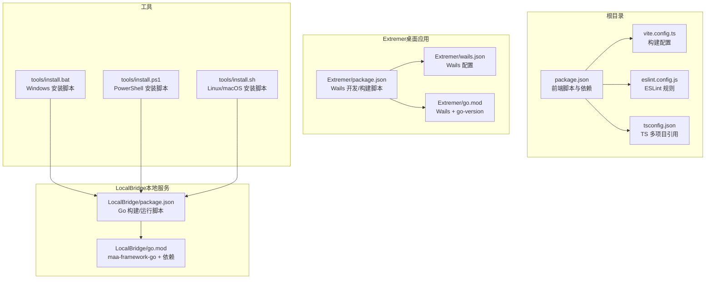
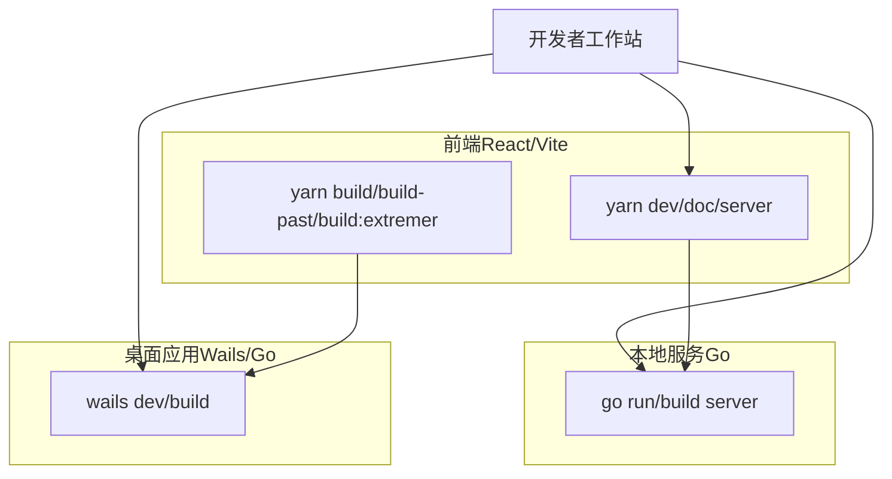
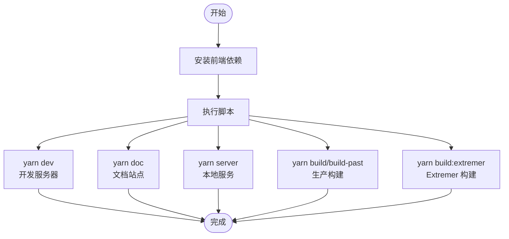
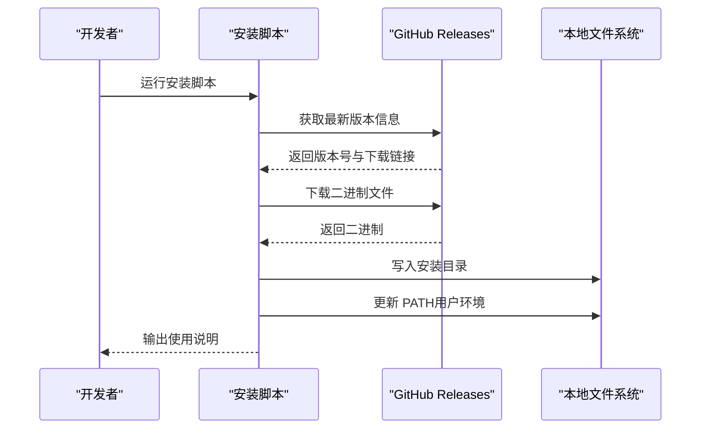
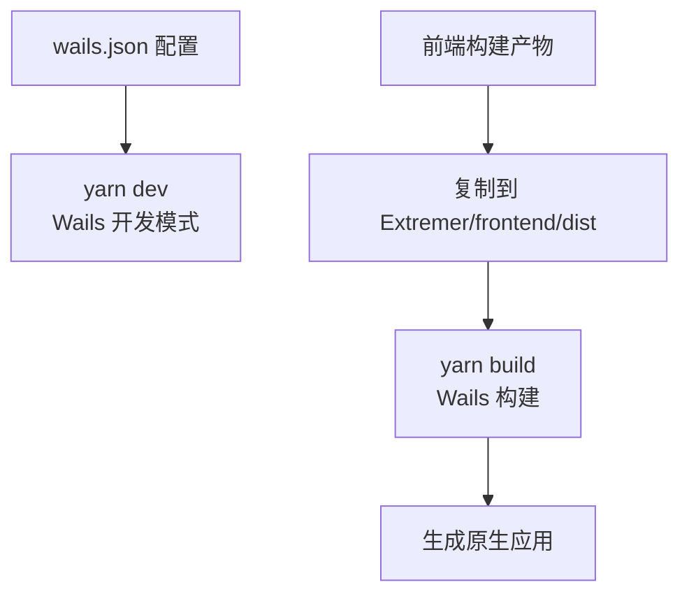
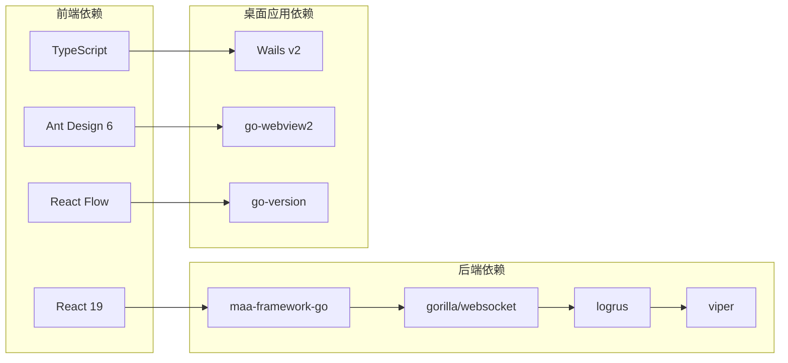

# 开发环境搭建

<cite>
**本文引用的文件**
- [README.md](file://README.md)
- [package.json](file://package.json)
- [Extremer/package.json](file://Extremer/package.json)
- [Extremer/wails.json](file://Extremer/wails.json)
- [LocalBridge/package.json](file://LocalBridge/package.json)
- [Extremer/go.mod](file://Extremer/go.mod)
- [LocalBridge/go.mod](file://LocalBridge/go.mod)
- [vite.config.ts](file://vite.config.ts)
- [tsconfig.json](file://tsconfig.json)
- [eslint.config.js](file://eslint.config.js)
- [tools/install.bat](file://tools/install.bat)
- [tools/install.ps1](file://tools/install.ps1)
- [tools/install.sh](file://tools/install.sh)
</cite>

## 目录
1. [简介](#简介)
2. [项目结构](#项目结构)
3. [核心组件](#核心组件)
4. [架构总览](#架构总览)
5. [详细组件分析](#详细组件分析)
6. [依赖分析](#依赖分析)
7. [性能考虑](#性能考虑)
8. [故障排除指南](#故障排除指南)
9. [结论](#结论)
10. [附录](#附录)

## 简介
本指南面向希望在本地搭建 MaaPipelineEditor（MPE）开发环境的工程师与贡献者。MPE 采用前后端分离架构：前端基于 React 19 与 TypeScript，使用 Vite 构建；后端包含 Go 语言实现的本地桥接服务（LocalBridge）以及可选的桌面应用封装（Extremer，基于 Wails）。项目同时提供一键安装本地桥接服务的脚本，覆盖 Windows、Linux 与 macOS。

根据仓库元信息，开发与运行需要以下工具链：
- Node.js 与 npm/yarn（前端依赖与脚本）
- Go 1.24（后端与桌面应用）
- Git（版本控制与发布）
- 可选：Wails CLI（桌面应用打包）

此外，仓库提供了针对不同模式的构建配置（如 extremer、preview 等），以及 ESLint、TypeScript、Vitest 等开发工具配置。

章节来源
- [README.md:31-90](file://README.md#L31-L90)

## 项目结构
仓库采用多模块组织方式：
- 根目录：前端应用、文档站点、测试与工具脚本
- Extremer：桌面应用模块，使用 Wails 将前端资源嵌入原生应用
- LocalBridge：本地服务模块，提供文件、资源、调试等协议能力
- docsite：文档站点（VitePress），用于文档开发与预览

图表来源
- [package.json:1-65](file://package.json#L1-L65)
- [vite.config.ts:1-41](file://vite.config.ts#L1-L41)
- [tsconfig.json:1-8](file://tsconfig.json#L1-L8)
- [eslint.config.js:1-24](file://eslint.config.js#L1-L24)
- [Extremer/package.json:1-13](file://Extremer/package.json#L1-L13)
- [Extremer/wails.json:1-18](file://Extremer/wails.json#L1-L18)
- [Extremer/go.mod:1-39](file://Extremer/go.mod#L1-L39)
- [LocalBridge/package.json:1-8](file://LocalBridge/package.json#L1-L8)
- [LocalBridge/go.mod:1-38](file://LocalBridge/go.mod#L1-L38)
- [tools/install.bat:1-115](file://tools/install.bat#L1-L115)
- [tools/install.ps1:1-74](file://tools/install.ps1#L1-L74)
- [tools/install.sh:1-92](file://tools/install.sh#L1-L92)

章节来源
- [README.md:114-126](file://README.md#L114-L126)
- [package.json:6-19](file://package.json#L6-L19)
- [Extremer/package.json:2-11](file://Extremer/package.json#L2-L11)
- [LocalBridge/package.json:2-6](file://LocalBridge/package.json#L2-L6)

## 核心组件
- 前端应用（React 19 + TypeScript + Vite）
  - 通过脚本启动开发服务器、构建产物、文档站点与本地服务
  - ESLint 与 TypeScript 配置确保代码质量
- 本地桥接服务（LocalBridge，Go 1.24）
  - 提供文件、资源、调试等协议能力，支持本地开发与测试
- 桌面应用（Extremer，Wails + Go）
  - 将前端资源嵌入原生应用，支持多平台构建与打包
- 一键安装脚本（Windows/Linux/macOS）
  - 自动下载并安装本地桥接二进制，按需写入 PATH

章节来源
- [package.json:20-63](file://package.json#L20-L63)
- [vite.config.ts:5-14](file://vite.config.ts#L5-L14)
- [eslint.config.js:8-23](file://eslint.config.js#L8-L23)
- [LocalBridge/go.mod:3](file://LocalBridge/go.mod#L3)
- [Extremer/go.mod:3](file://Extremer/go.mod#L3)
- [tools/install.bat:100-115](file://tools/install.bat#L100-L115)
- [tools/install.ps1:62-74](file://tools/install.ps1#L62-L74)
- [tools/install.sh:83-92](file://tools/install.sh#L83-L92)

## 架构总览
MPE 的开发环境由三层组成：
- 前端层：React 应用，负责可视化编辑、节点与连接管理、调试面板等
- 本地服务层：Go 实现的 LocalBridge，提供文件扫描、资源管理、协议处理与调试能力
- 桌面应用层：Extremer，基于 Wails 将前端资源打包为原生应用

图表来源
- [package.json:8-13](file://package.json#L8-L13)
- [LocalBridge/package.json:3-6](file://LocalBridge/package.json#L3-L6)
- [Extremer/package.json:3-6](file://Extremer/package.json#L3-L6)

## 详细组件分析

### 前端开发环境（Node.js、npm/yarn、TypeScript、ESLint、Vite）
- Node.js 与包管理
  - 使用 npm/yarn 管理前端依赖与脚本
  - 常用脚本：开发、构建、文档站点、本地服务、预览、清理与发布
- TypeScript
  - 多项目引用配置，分别指向应用与 Node 工具链配置
- ESLint
  - 推荐使用 VS Code ESLint 插件进行实时校验
- Vite
  - 支持多模式构建（stable、preview、extremer 等），并配置了别名与测试环境

图表来源
- [package.json:6-19](file://package.json#L6-L19)
- [vite.config.ts:5-14](file://vite.config.ts#L5-L14)
- [tsconfig.json:3-6](file://tsconfig.json#L3-L6)
- [eslint.config.js:8-23](file://eslint.config.js#L8-L23)

章节来源
- [package.json:6-19](file://package.json#L6-L19)
- [vite.config.ts:15-21](file://vite.config.ts#L15-L21)
- [tsconfig.json:1-8](file://tsconfig.json#L1-L8)
- [eslint.config.js:1-24](file://eslint.config.js#L1-L24)

### 后端开发环境（Go 1.24、LocalBridge）
- Go 版本与模块
  - go.mod 指定 Go 1.24（Extremer 与 LocalBridge 均使用该版本）
  - LocalBridge 引入 maa-framework-go 与相关依赖
- 构建与运行
  - 提供构建与运行脚本，支持指定根目录与日志级别
- 本地桥接二进制安装
  - 提供 Windows、Linux、macOS 三套安装脚本，自动下载并写入 PATH

图表来源
- [tools/install.bat:21-79](file://tools/install.bat#L21-L79)
- [tools/install.ps1:17-45](file://tools/install.ps1#L17-L45)
- [tools/install.sh:43-67](file://tools/install.sh#L43-L67)

章节来源
- [LocalBridge/go.mod:3](file://LocalBridge/go.mod#L3)
- [LocalBridge/package.json:3-6](file://LocalBridge/package.json#L3-L6)
- [tools/install.bat:83-94](file://tools/install.bat#L83-L94)
- [tools/install.ps1:47-60](file://tools/install.ps1#L47-L60)
- [tools/install.sh:73-81](file://tools/install.sh#L73-L81)

### 桌面应用开发环境（Wails + Go）
- Wails 配置
  - wails.json 定义产品信息、输出文件名、前端资源目录与构建目录
- 构建流程
  - 提供开发与构建脚本，支持复制前端构建产物与配置文件
- 依赖
  - Extremer 使用 Wails v2 与 go-version 等依赖

图表来源
- [Extremer/wails.json:1-18](file://Extremer/wails.json#L1-L18)
- [Extremer/package.json:2-11](file://Extremer/package.json#L2-L11)
- [Extremer/go.mod:5-8](file://Extremer/go.mod#L5-L8)

章节来源
- [Extremer/wails.json:10-16](file://Extremer/wails.json#L10-L16)
- [Extremer/package.json:2-11](file://Extremer/package.json#L2-L11)
- [Extremer/go.mod:1-39](file://Extremer/go.mod#L1-L39)

### IDE 推荐配置（VS Code）
- 插件推荐
  - ESLint：启用规则并自动修复
  - TypeScript Importer：自动导入类型与模块
  - Prettier：统一格式化（可选）
  - GitLens：增强 Git 体验
- 设置建议
  - 启用“保存时格式化”（可选）
  - 设置默认终端为 PowerShell（Windows）或 Bash（Linux/macOS）
  - 在工作区设置中启用 ESLint 与 TypeScript 诊断
- 调试配置
  - 前端：Vite 开发服务器（浏览器调试）
  - 后端：Go 调试（Delve），配置 launch.json 启动 LocalBridge
  - 桌面应用：Wails 调试（通过 Wails CLI）

章节来源
- [eslint.config.js:8-23](file://eslint.config.js#L8-L23)
- [package.json:41-63](file://package.json#L41-L63)

## 依赖分析
- 前端依赖
  - React 19、Ant Design 6、React Flow、Zustand、Tesseract.js 等
  - 开发依赖包括 Vite、TypeScript、ESLint、React Hooks 与 Vitest
- 后端依赖
  - maa-framework-go、websocket、logrus、viper、fsnotify 等
- 桌面应用依赖
  - Wails v2、go-version、go-webview2 等

图表来源
- [package.json:20-40](file://package.json#L20-L40)
- [LocalBridge/go.mod:5-16](file://LocalBridge/go.mod#L5-L16)
- [Extremer/go.mod:5-8](file://Extremer/go.mod#L5-L8)

章节来源
- [package.json:20-63](file://package.json#L20-L63)
- [LocalBridge/go.mod:1-38](file://LocalBridge/go.mod#L1-L38)
- [Extremer/go.mod:1-39](file://Extremer/go.mod#L1-L39)

## 性能考虑
- 前端构建
  - 使用 Vite 的快速冷启动与热更新，开发阶段优先使用 dev 模式
  - 生产构建开启压缩与分块策略，合理拆分第三方库
- 本地服务
  - 合理设置日志级别，避免在开发阶段输出过多日志
  - 文件扫描与资源监控应限制监听范围，避免磁盘 IO 抖动
- 桌面应用
  - 构建前先复制前端产物，避免重复构建
  - 发布前进行体积分析与签名准备

## 故障排除指南
- 权限问题（Windows）
  - 安装脚本可能需要管理员权限下载与写入系统 PATH
  - 若命令不可用，重启终端或手动追加 PATH
- 版本冲突
  - Go 版本必须为 1.24（Extremer 与 LocalBridge 均要求）
  - Node.js 版本建议使用 LTS，确保与项目依赖兼容
- 网络代理
  - 安装脚本依赖 GitHub Releases 下载二进制，若网络受限请配置代理
  - npm/yarn 可配置 registry 以加速依赖下载
- PATH 未生效
  - Windows：重启终端或重新加载环境变量
  - Linux/macOS：将安装目录加入 PATH 并 source 配置文件
- Wails 构建失败
  - 确认已安装 Wails CLI，并满足平台依赖（如 WebView2）
  - 清理缓存后重试构建

章节来源
- [tools/install.bat:100-115](file://tools/install.bat#L100-L115)
- [tools/install.ps1:72-74](file://tools/install.ps1#L72-L74)
- [tools/install.sh:73-81](file://tools/install.sh#L73-L81)
- [LocalBridge/go.mod:3](file://LocalBridge/go.mod#L3)
- [Extremer/go.mod:3](file://Extremer/go.mod#L3)

## 结论
通过本指南，您可以在本地成功搭建 MPE 的开发环境：安装 Node.js、Go 与 Git，配置 IDE，安装本地桥接服务，并根据需要构建桌面应用。遵循脚本与配置的最佳实践，可有效避免常见问题，提升开发效率。

## 附录
- 常用命令速查
  - 前端：yarn dev、yarn build、yarn doc、yarn server
  - 本地服务：yarn build/run/server（LocalBridge）
  - 桌面应用：yarn dev/build（Extremer）
- 环境变量与 PATH
  - Windows：安装脚本会尝试写入用户 PATH，必要时重启终端
  - Linux/macOS：将安装目录加入 PATH 并 source 配置文件
- 开发证书与安全
  - 若涉及 HTTPS 或本地证书，可在开发环境中配置自签名证书并信任
- 多模式构建
  - vite.config.ts 支持 stable、preview、extremer 等模式，按需切换

章节来源
- [package.json:6-19](file://package.json#L6-L19)
- [LocalBridge/package.json:2-6](file://LocalBridge/package.json#L2-L6)
- [Extremer/package.json:2-11](file://Extremer/package.json#L2-L11)
- [vite.config.ts:5-14](file://vite.config.ts#L5-L14)
- [tools/install.bat:83-94](file://tools/install.bat#L83-L94)
- [tools/install.ps1:47-60](file://tools/install.ps1#L47-L60)
- [tools/install.sh:73-81](file://tools/install.sh#L73-L81)