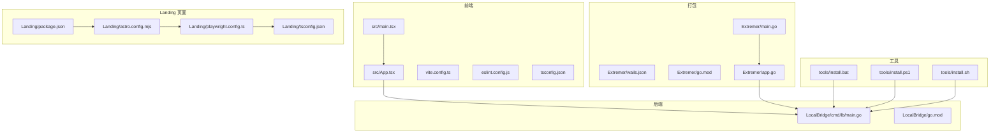
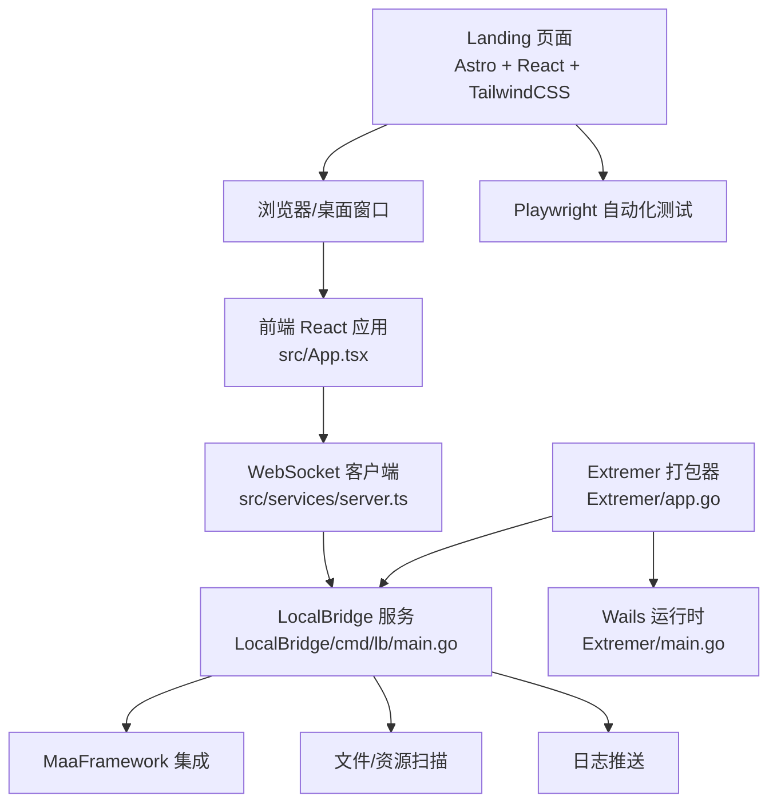
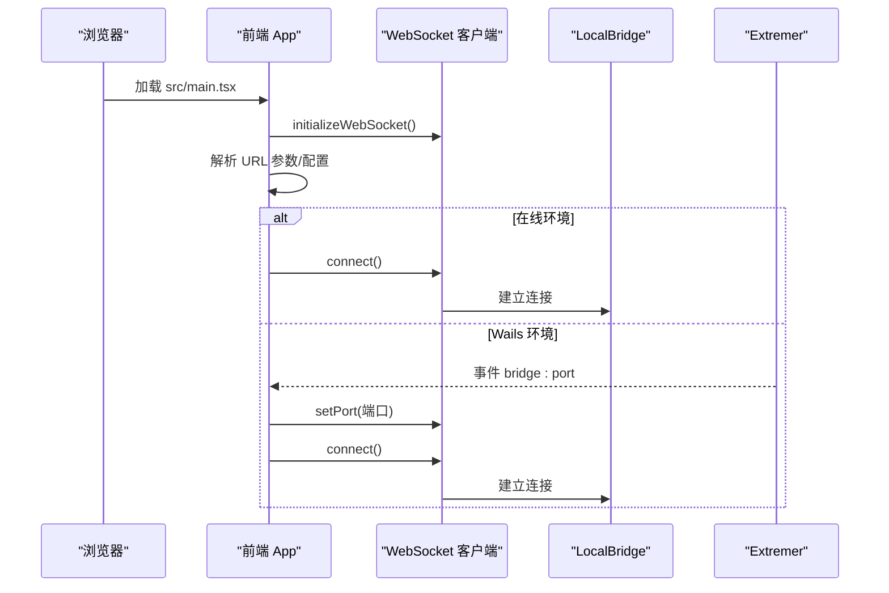
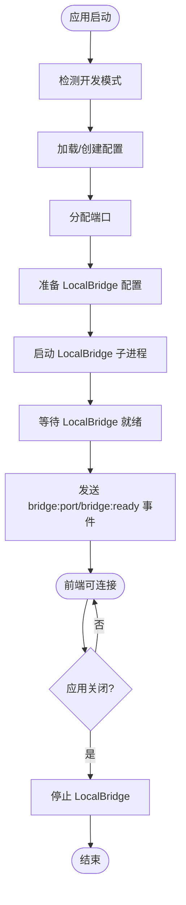
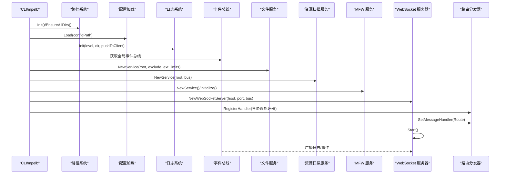
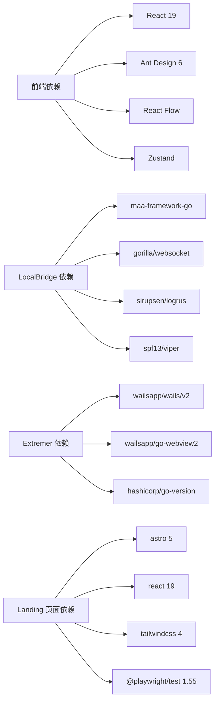

# 开发者指南

<cite>
**本文档引用的文件**
- [README.md](file://README.md)
- [package.json](file://package.json)
- [vite.config.ts](file://vite.config.ts)
- [eslint.config.js](file://eslint.config.js)
- [tsconfig.json](file://tsconfig.json)
- [Extremer/wails.json](file://Extremer/wails.json)
- [Extremer/go.mod](file://Extremer/go.mod)
- [Extremer/main.go](file://Extremer/main.go)
- [Extremer/app.go](file://Extremer/app.go)
- [LocalBridge/go.mod](file://LocalBridge/go.mod)
- [LocalBridge/cmd/lb/main.go](file://LocalBridge/cmd/lb/main.go)
- [src/main.tsx](file://src/main.tsx)
- [src/App.tsx](file://src/App.tsx)
- [tools/install.bat](file://tools/install.bat)
- [tools/install.ps1](file://tools/install.ps1)
- [tools/install.sh](file://tools/install.sh)
- [Landing/package.json](file://Landing/package.json)
- [Landing/astro.config.mjs](file://Landing/astro.config.mjs)
- [Landing/playwright.config.ts](file://Landing/playwright.config.ts)
- [Landing/tsconfig.json](file://Landing/tsconfig.json)
- [Landing/tests/landing.spec.ts](file://Landing/tests/landing.spec.ts)
- [Landing/scripts/run-playwright-with-static-server.cjs](file://Landing/scripts/run-playwright-with-static-server.cjs)
- [Landing/src/pages/index.astro](file://Landing/src/pages/index.astro)
- [Landing/src/layouts/LandingShell.astro](file://Landing/src/layouts/LandingShell.astro)
</cite>

## 更新摘要
**所做更改**
- 新增 Landing 页面开发工具链章节，涵盖 Astro 开发环境、TypeScript 配置、构建脚本
- 新增 Playwright 自动化测试章节，包含测试配置、脚本和 CI/CD 集成
- 更新开发环境搭建，增加 Landing 页面的独立开发流程
- 新增现代化开发工作流程说明，包括多项目协作和工具链整合

## 目录
1. [简介](#简介)
2. [项目结构](#项目结构)
3. [核心组件](#核心组件)
4. [架构总览](#架构总览)
5. [详细组件分析](#详细组件分析)
6. [Landing 页面开发工具链](#landing-页面开发工具链)
7. [依赖关系分析](#依赖关系分析)
8. [性能考虑](#性能考虑)
9. [故障排除指南](#故障排除指南)
10. [结论](#结论)
11. [附录](#附录)

## 简介
MaaPipelineEditor（MPE）是一个前后端分离的可视化 Pipeline 编辑器，基于 React 19 + TypeScript + Vite 构建前端，使用 Go 语言实现本地桥接服务（LocalBridge），并通过 Wails 将 Go 后端打包为桌面应用（Extremer）。项目提供在线版本与本地一体化应用两种使用形态，支持文件管理、截图工具、流程调试、AI 辅助等功能。

**更新** 新增 Landing 页面开发工具链，包括 Astro 开发环境、TypeScript 配置、构建脚本、Playwright 自动化测试，以及现代化的开发工作流程和 CI/CD 集成。

## 项目结构
项目采用多模块组织方式：
- 前端模块：位于根目录 src，使用 Vite + React 19 + TypeScript 构建
- 后端模块：LocalBridge（Go），提供 WebSocket 服务与 MaaFramework 集成
- 打包模块：Extremer（Go + Wails），将前端静态资源嵌入并打包为桌面应用
- Landing 页面：独立的 Astro + React + TailwindCSS 页面，提供项目官网
- 文档站点：docsite（VitePress），用于文档发布
- 工具脚本：tools（安装脚本）

```mermaid
graph TB
subgraph "前端"
FE_Main["src/main.tsx"]
FE_App["src/App.tsx"]
FE_Config["vite.config.ts"]
FE_ESLint["eslint.config.js"]
FE_TS["tsconfig.json"]
end
subgraph "后端"
LB_Main["LocalBridge/cmd/lb/main.go"]
LB_Mod["LocalBridge/go.mod"]
end
subgraph "打包"
EX_Wails["Extremer/wails.json"]
EX_GoMod["Extremer/go.mod"]
EX_Main["Extremer/main.go"]
EX_App["Extremer/app.go"]
end
subgraph "Landing 页面"
Landing_Pkg["Landing/package.json"]
Landing_Astro["Landing/astro.config.mjs"]
Landing_PW["Landing/playwright.config.ts"]
Landing_TS["Landing/tsconfig.json"]
end
subgraph "工具"
Tools_Bat["tools/install.bat"]
Tools_PS["tools/install.ps1"]
Tools_Sh["tools/install.sh"]
end
FE_Main --> FE_App
FE_App --> LB_Main
EX_App --> LB_Main
EX_Main --> EX_App
Landing_Pkg --> Landing_Astro
Landing_Astro --> Landing_PW
Landing_PW --> Landing_TS
Tools_Bat --> LB_Main
Tools_PS --> LB_Main
Tools_Sh --> LB_Main
```

**图表来源**
- [src/main.tsx:1-18](file://src/main.tsx#L1-L18)
- [src/App.tsx:1-333](file://src/App.tsx#L1-L333)
- [vite.config.ts:1-41](file://vite.config.ts#L1-L41)
- [eslint.config.js:1-24](file://eslint.config.js#L1-L24)
- [tsconfig.json:1-8](file://tsconfig.json#L1-L8)
- [LocalBridge/cmd/lb/main.go:1-882](file://LocalBridge/cmd/lb/main.go#L1-L882)
- [LocalBridge/go.mod:1-38](file://LocalBridge/go.mod#L1-L38)
- [Extremer/wails.json:1-18](file://Extremer/wails.json#L1-L18)
- [Extremer/go.mod:1-39](file://Extremer/go.mod#L1-L39)
- [Extremer/main.go:1-90](file://Extremer/main.go#L1-L90)
- [Extremer/app.go:1-620](file://Extremer/app.go#L1-L620)
- [Landing/package.json:1-35](file://Landing/package.json#L1-L35)
- [Landing/astro.config.mjs:1-19](file://Landing/astro.config.mjs#L1-L19)
- [Landing/playwright.config.ts:1-31](file://Landing/playwright.config.ts#L1-L31)
- [Landing/tsconfig.json:1-21](file://Landing/tsconfig.json#L1-L21)
- [tools/install.bat:1-115](file://tools/install.bat#L1-L115)
- [tools/install.ps1:1-74](file://tools/install.ps1#L1-L74)
- [tools/install.sh:1-92](file://tools/install.sh#L1-L92)

**章节来源**
- [README.md:1-151](file://README.md#L1-L151)
- [package.json:1-70](file://package.json#L1-L70)
- [vite.config.ts:1-41](file://vite.config.ts#L1-L41)
- [eslint.config.js:1-24](file://eslint.config.js#L1-L24)
- [tsconfig.json:1-8](file://tsconfig.json#L1-L8)

## 核心组件
- 前端应用入口与初始化：负责初始化 WebSocket、创建 React 根实例、挂载主题提供者与全局状态。
- 应用主组件：负责处理拖拽导入、URL 参数解析、Wails 环境检测与桥接连接、面板渲染与全局快捷键。
- 本地桥接服务（LocalBridge）：提供文件扫描、资源扫描、MaaFramework 集成、日志推送、协议路由等能力。
- Wails 打包器（Extremer）：负责嵌入前端静态资源、启动本地桥接服务、窗口管理、事件桥接等。
- Landing 页面：独立的 Astro + React + TailwindCSS 页面，提供现代化的项目官网和营销页面。
- 开发工具链：Vite、ESLint、TypeScript、React Refresh、测试框架 Vitest、覆盖率报告等。

**章节来源**
- [src/main.tsx:1-18](file://src/main.tsx#L1-L18)
- [src/App.tsx:1-333](file://src/App.tsx#L1-L333)
- [LocalBridge/cmd/lb/main.go:1-882](file://LocalBridge/cmd/lb/main.go#L1-L882)
- [Extremer/app.go:1-620](file://Extremer/app.go#L1-L620)
- [Landing/package.json:1-35](file://Landing/package.json#L1-L35)

## 架构总览
MPE 的整体架构分为四层：
- 表现层（前端 React）：负责用户交互、节点编辑、面板控制、WebSocket 连接与状态管理。
- 业务层（LocalBridge）：提供文件与资源扫描、MaaFramework 集成、协议处理、日志推送等。
- 基础设施层（Wails 打包器）：负责应用生命周期、窗口管理、系统集成、本地服务启动与事件桥接。
- 展示层（Landing 页面）：提供现代化的项目官网、营销页面和用户体验展示。

```mermaid
graph TB
Browser["浏览器/桌面窗口"] --> Frontend["前端 React 应用<br/>src/App.tsx"]
Frontend --> WS["WebSocket 客户端<br/>src/services/server.ts"]
WS --> LB["LocalBridge 服务<br/>LocalBridge/cmd/lb/main.go"]
LB --> MFW["MaaFramework 集成"]
LB --> FS["文件/资源扫描"]
LB --> Log["日志推送"]
EX["Extremer 打包器<br/>Extremer/app.go"] --> LB
EX --> Wails["Wails 运行时<br/>Extremer/main.go"]
Landing["Landing 页面<br/>Astro + React + TailwindCSS"] --> Browser
Landing --> LandingTests["Playwright 自动化测试"]
```

**图表来源**
- [src/App.tsx:210-270](file://src/App.tsx#L210-L270)
- [LocalBridge/cmd/lb/main.go:317-440](file://LocalBridge/cmd/lb/main.go#L317-L440)
- [Extremer/app.go:290-304](file://Extremer/app.go#L290-L304)
- [Extremer/main.go:49-84](file://Extremer/main.go#L49-L84)
- [Landing/package.json:6-13](file://Landing/package.json#L6-L13)

## 详细组件分析

### 前端应用初始化与连接流程
前端在启动时初始化 WebSocket，根据运行环境（在线或 Wails）决定连接策略：
- 在线环境：读取 URL 参数或配置，自动连接指定端口。
- Wails 环境：等待后端事件桥接发送端口，再发起连接。

```mermaid
sequenceDiagram
participant Browser as "浏览器"
participant Frontend as "前端 App"
participant WS as "WebSocket 客户端"
participant LB as "LocalBridge"
participant EX as "Extremer"
Browser->>Frontend : 加载 src/main.tsx
Frontend->>WS : initializeWebSocket()
Frontend->>Frontend : 解析 URL 参数/配置
alt 在线环境
Frontend->>WS : connect()
WS->>LB : 建立连接
else Wails 环境
EX-->>Frontend : 事件 bridge : port
Frontend->>WS : setPort(端口)
Frontend->>WS : connect()
WS->>LB : 建立连接
end
```

**图表来源**
- [src/main.tsx:7-10](file://src/main.tsx#L7-L10)
- [src/App.tsx:215-270](file://src/App.tsx#L215-L270)
- [Extremer/app.go:415-444](file://Extremer/app.go#L415-L444)

**章节来源**
- [src/main.tsx:1-18](file://src/main.tsx#L1-L18)
- [src/App.tsx:150-270](file://src/App.tsx#L150-L270)

### Wails 打包器生命周期
Extremer 负责应用启动、配置加载、本地服务启动与事件桥接：
- 启动阶段：检测开发模式、加载/创建配置、分配端口、准备 LocalBridge 配置。
- DOM 就绪：等待 LocalBridge 就绪后，向前端发送端口与就绪事件。
- 关闭阶段：停止 LocalBridge 子进程。

```mermaid
flowchart TD
Start(["应用启动"]) --> DetectDev["检测开发模式"]
DetectDev --> LoadCfg["加载/创建配置"]
LoadCfg --> AllocPort["分配端口"]
AllocPort --> PrepareLB["准备 LocalBridge 配置"]
PrepareLB --> StartLB["启动 LocalBridge 子进程"]
StartLB --> WaitReady["等待 LocalBridge 就绪"]
WaitReady --> EmitEvents["发送 bridge:port/bridge:ready 事件"]
EmitEvents --> Ready(["前端可连接"])
Ready --> Shutdown{"应用关闭?"}
Shutdown --> |是| StopLB["停止 LocalBridge"]
StopLB --> End(["结束"])
Shutdown --> |否| Ready
```

**图表来源**
- [Extremer/app.go:181-304](file://Extremer/app.go#L181-L304)
- [Extremer/app.go:415-444](file://Extremer/app.go#L415-L444)
- [Extremer/app.go:466-475](file://Extremer/app.go#L466-L475)

**章节来源**
- [Extremer/main.go:26-89](file://Extremer/main.go#L26-L89)
- [Extremer/app.go:181-304](file://Extremer/app.go#L181-L304)

### LocalBridge 服务核心流程
LocalBridge 提供文件扫描、资源扫描、MFW 初始化、协议路由与日志推送：
- 安全检查：对根目录进行安全评估，避免高风险扫描。
- 服务启动：启动文件服务、资源扫描服务、MFW 服务（可选）。
- 协议注册：注册文件、MFW、调试、资源等协议处理器。
- 日志推送：将日志广播给前端 WebSocket 客户端。

```mermaid
sequenceDiagram
participant CLI as "CLI/mpelb"
participant Paths as "路径系统"
participant Cfg as "配置加载"
participant Logger as "日志系统"
participant Bus as "事件总线"
participant FileSvc as "文件服务"
participant ResSvc as "资源扫描服务"
participant MFW as "MFW 服务"
participant WS as "WebSocket 服务器"
participant RT as "路由分发器"
CLI->>Paths : Init()/EnsureAllDirs()
CLI->>Cfg : Load(configPath)
CLI->>Logger : Init(level, dir, pushToClient)
CLI->>Bus : 获取全局事件总线
CLI->>FileSvc : NewService(root, exclude, ext, limits)
CLI->>ResSvc : NewService(root, bus)
CLI->>MFW : NewService()/Initialize()
CLI->>WS : NewWebSocketServer(host, port, bus)
CLI->>RT : RegisterHandler(各协议处理器)
WS->>RT : SetMessageHandler(Route)
WS->>WS : Start()
Bus-->>WS : 广播日志/事件
```

**图表来源**
- [LocalBridge/cmd/lb/main.go:182-440](file://LocalBridge/cmd/lb/main.go#L182-L440)

**章节来源**
- [LocalBridge/cmd/lb/main.go:182-440](file://LocalBridge/cmd/lb/main.go#L182-L440)

### 开发环境搭建
- Node.js 与包管理器：使用 Yarn（仓库包含 yarn.lock），确保 Node.js 版本满足 package.json 中的依赖要求。
- Go 环境：Go 1.24（Extremer/go.mod 与 LocalBridge/go.mod），确保 GOPATH 与模块代理配置正确。
- IDE 配置：
  - VSCode：安装 ESLint、TypeScript、React 插件；配置 TypeScript 项目引用（tsconfig.json）。
  - Go：安装 Go 插件，配置 GOPATH 与模块代理。
- 依赖安装：
  - 前端：yarn install
  - 后端：在 LocalBridge 目录执行 go mod tidy
  - 打包器：在 Extremer 目录执行 go mod tidy
  - Landing 页面：在 Landing 目录执行 yarn install

**更新** 新增 Landing 页面开发环境配置，包括 Astro、React、TailwindCSS 和 Playwright 的依赖安装。

**章节来源**
- [package.json:1-70](file://package.json#L1-L70)
- [Extremer/go.mod:1-39](file://Extremer/go.mod#L1-L39)
- [LocalBridge/go.mod:1-38](file://LocalBridge/go.mod#L1-L38)
- [tsconfig.json:1-8](file://tsconfig.json#L1-L8)
- [Landing/package.json:1-35](file://Landing/package.json#L1-L35)

### 开发工具链
- 构建配置：Vite（vite.config.ts），支持多模式构建（stable、preview、extremer），配置别名与测试环境。
- 代码规范：ESLint（eslint.config.js），结合 TypeScript ESlint 与 React Hooks 规则。
- 测试框架：Vitest（vite.config.ts 中配置），HappyDOM 环境，覆盖率报告（v8 provider）。
- 调试工具：React DevTools（React 19）、Wails 调试（Extremer），LocalBridge 日志推送。
- Landing 页面工具链：Astro 开发服务器、TypeScript 类型检查、TailwindCSS 样式编译、Playwright 自动化测试。

**更新** 新增 Landing 页面的现代化开发工具链，包括 Astro 开发环境、TypeScript 配置、构建脚本和自动化测试。

**章节来源**
- [vite.config.ts:1-41](file://vite.config.ts#L1-L41)
- [eslint.config.js:1-24](file://eslint.config.js#L1-L24)
- [Landing/package.json:6-13](file://Landing/package.json#L6-L13)
- [Landing/astro.config.mjs:1-19](file://Landing/astro.config.mjs#L1-L19)
- [Landing/playwright.config.ts:1-31](file://Landing/playwright.config.ts#L1-L31)
- [Landing/tsconfig.json:1-21](file://Landing/tsconfig.json#L1-L21)

### 贡献流程
- 分支管理：遵循 Git 分支策略（如 main 作为稳定分支，feature/* 开发分支）。
- 代码审查：提交 Pull Request，至少一名维护者审查，确保通过 ESLint、单元测试与集成测试。
- 发布流程：使用 package.json 中的 release 脚本打标签并推送，CI 可自动构建与发布。
- Landing 页面贡献：独立的 Landing 页面贡献流程，包括类型检查、构建验证和自动化测试。

**更新** 新增 Landing 页面的独立贡献流程，包括 verify 脚本和自动化测试要求。

**章节来源**
- [package.json:17-18](file://package.json#L17-L18)
- [Landing/package.json:11-12](file://Landing/package.json#L11-L12)

### 扩展开发与生命周期
- 新功能开发：在 src/components 与 src/stores 中新增组件与状态，通过协议层与 LocalBridge 交互。
- Bug 修复：通过日志面板与调试面板定位问题，修复后补充单元测试。
- 性能优化：前端使用 React.memo 与 Zustand 状态管理，后端优化文件扫描与资源扫描性能。
- Landing 页面扩展：新增 Astro 组件开发、React 组件集成、TailwindCSS 样式开发和 Playwright 测试。

**更新** 新增 Landing 页面的扩展开发流程，包括组件开发、样式集成和测试验证。

**章节来源**
- [src/App.tsx:1-333](file://src/App.tsx#L1-L333)
- [LocalBridge/cmd/lb/main.go:1-882](file://LocalBridge/cmd/lb/main.go#L1-L882)
- [Landing/src/pages/index.astro:1-137](file://Landing/src/pages/index.astro#L1-L137)
- [Landing/src/layouts/LandingShell.astro:1-138](file://Landing/src/layouts/LandingShell.astro#L1-L138)

### 代码质量保证
- 单元测试：Vitest 配置，HappyDOM 环境，覆盖率报告。
- 集成测试：通过 WebSocket 与 LocalBridge 交互，验证协议处理与事件推送。
- 性能测试：前端使用 React Profiler，后端通过日志与资源扫描性能指标评估。
- Landing 页面测试：Playwright 自动化测试，包括端到端测试和视觉回归测试。

**更新** 新增 Landing 页面的自动化测试体系，包括端到端测试和 CI/CD 集成。

**章节来源**
- [vite.config.ts:22-38](file://vite.config.ts#L22-L38)
- [Landing/tests/landing.spec.ts:1-61](file://Landing/tests/landing.spec.ts#L1-L61)
- [Landing/playwright.config.ts:1-31](file://Landing/playwright.config.ts#L1-L31)

### 部署与发布
- 在线部署：Vite 构建产物可部署至任意静态服务器，支持多模式（stable、preview、extremer）。
- 桌面应用：Wails 打包（Extremer），配置产品信息与图标，构建后分发。
- Landing 页面部署：Astro 构建生成静态资源，可部署至任意静态服务器或 CDN。
- CI/CD：GitHub Actions（.github/workflows）可配置自动化构建与发布。
- 版本管理：使用 Git 标签（package.json release 脚本），遵循语义化版本。

**更新** 新增 Landing 页面的独立部署流程和 CI/CD 集成方案。

**章节来源**
- [Extremer/wails.json:1-18](file://Extremer/wails.json#L1-L18)
- [package.json:17-18](file://package.json#L17-L18)
- [Landing/astro.config.mjs:8](file://Landing/astro.config.mjs#L8)

## Landing 页面开发工具链

### Astro 开发环境配置
Landing 页面采用现代化的 Astro 框架，提供静态站点生成和组件化开发体验：

- **开发服务器**：`yarn dev` 启动 Astro 开发服务器，支持热重载和实时预览
- **构建配置**：`astro.config.mjs` 配置 Astro 项目，集成 React、Sitemap 和 TailwindCSS
- **路径别名**：使用 `@` 作为 src 目录的别名，简化组件导入路径
- **站点配置**：配置站点 URL、SEO 元数据和社交媒体卡片

**章节来源**
- [Landing/package.json:7](file://Landing/package.json#L7)
- [Landing/astro.config.mjs:1-19](file://Landing/astro.config.mjs#L1-L19)

### TypeScript 配置与类型检查
Landing 页面提供完整的 TypeScript 支持和类型安全保障：

- **严格模式**：继承 Astro 的严格 TypeScript 配置
- **JSX 支持**：配置 React JSX 导入源和编译选项
- **路径映射**：定义 `@/*` 到 `src/*` 的路径映射
- **类型声明**：包含 Node.js 和 React 类型声明

**章节来源**
- [Landing/tsconfig.json:1-21](file://Landing/tsconfig.json#L1-L21)

### 构建脚本与工作流程
Landing 页面提供完整的构建和验证脚本：

- **开发构建**：`yarn build` 生成生产环境静态资源
- **预览构建**：`yarn preview` 启动本地预览服务器
- **类型检查**：`yarn typecheck` 运行 TypeScript 类型检查
- **完整验证**：`yarn verify` 执行类型检查、构建和测试的完整流程
- **测试执行**：`yarn test` 运行 Playwright 自动化测试

**章节来源**
- [Landing/package.json:6-13](file://Landing/package.json#L6-L13)

### Playwright 自动化测试
Landing 页面采用 Playwright 进行端到端测试，确保用户体验质量：

- **测试配置**：`playwright.config.ts` 配置测试环境、设备和报告器
- **测试项目**：支持多浏览器测试，当前配置为 Chromium
- **静态服务器**：内置静态文件服务器，支持 4321 端口访问
- **测试覆盖**：包含导航测试、功能切换测试和响应式设计测试
- **CI 集成**：支持 GitHub Actions 和本地开发环境

**章节来源**
- [Landing/playwright.config.ts:1-31](file://Landing/playwright.config.ts#L1-L31)
- [Landing/tests/landing.spec.ts:1-61](file://Landing/tests/landing.spec.ts#L1-L61)

### 组件架构与页面结构
Landing 页面采用模块化的组件架构：

- **页面组件**：`index.astro` 主页面，集成多个功能区块
- **布局组件**：`LandingShell.astro` 提供统一的页面外壳和 SEO 支持
- **功能组件**：包括 Hero 场景、特性探索、展示网格、信任统计等
- **内容管理**：通过 `landing.ts` 配置文件管理页面内容和导航
- **样式系统**：使用 TailwindCSS 提供响应式设计和主题支持

**章节来源**
- [Landing/src/pages/index.astro:1-137](file://Landing/src/pages/index.astro#L1-L137)
- [Landing/src/layouts/LandingShell.astro:1-138](file://Landing/src/layouts/LandingShell.astro#L1-L138)

### 现代化开发工作流程
Landing 页面提供现代化的开发体验：

- **多项目协作**：通过根目录的 `yarn` 命令统一管理多个项目
- **独立开发**：Landing 页面可以独立开发和测试
- **工具链整合**：与主项目的开发工具链无缝集成
- **开发服务器**：支持并行开发多个项目实例
- **热重载支持**：Astro 开发热重载，提升开发效率

**章节来源**
- [package.json:9-12](file://package.json#L9-L12)
- [Landing/package.json:6](file://Landing/package.json#L6)

## 依赖关系分析
- 前端依赖：React 19、Ant Design 6、React Flow、Zustand、Less 等。
- 后端依赖：MaaFramework Go SDK、websocket、logrus、viper、fsnotify 等。
- 打包器依赖：Wails v2、go-webview2、go-version 等。
- Landing 页面依赖：Astro 5、React 19、TailwindCSS 4、Playwright 1.55 等。

**更新** 新增 Landing 页面的依赖关系，包括现代化的前端工具链和测试框架。

```mermaid
graph LR
FE["前端依赖"] --> React["React 19"]
FE --> Antd["Ant Design 6"]
FE --> Flow["React Flow"]
FE --> Zustand["Zustand"]
LB["LocalBridge 依赖"] --> MFW["maa-framework-go"]
LB --> WS["gorilla/websocket"]
LB --> Logrus["sirupsen/logrus"]
LB --> Viper["spf13/viper"]
EX["Extremer 依赖"] --> Wails["wailsapp/wails/v2"]
EX --> WebView2["wailsapp/go-webview2"]
EX --> Ver["hashicorp/go-version"]
Landing["Landing 页面依赖"] --> Astro["astro 5"]
Landing --> React19["react 19"]
Landing --> Tailwind["tailwindcss 4"]
Landing --> PW["@playwright/test 1.55"]
```

**图表来源**
- [package.json:24-46](file://package.json#L24-L46)
- [LocalBridge/go.mod:5-16](file://LocalBridge/go.mod#L5-L16)
- [Extremer/go.mod:5-8](file://Extremer/go.mod#L5-L8)
- [Landing/package.json:14-33](file://Landing/package.json#L14-L33)

**章节来源**
- [package.json:1-70](file://package.json#L1-L70)
- [LocalBridge/go.mod:1-38](file://LocalBridge/go.mod#L1-L38)
- [Extremer/go.mod:1-39](file://Extremer/go.mod#L1-L39)
- [Landing/package.json:1-35](file://Landing/package.json#L1-L35)

## 性能考虑
- 前端性能：使用 React.memo、Zustand 状态分区、按需加载组件与资源。
- 后端性能：文件与资源扫描限制深度与数量，MFW 初始化失败降级为文件管理功能。
- WebSocket：日志推送批量处理，连接状态监控与自动重连。
- Landing 页面性能：Astro 静态生成优化，React 组件懒加载，TailwindCSS 样式按需编译。

**更新** 新增 Landing 页面的性能优化策略，包括静态生成和组件优化。

## 故障排除指南
- 本地服务无法启动：检查 LocalBridge 配置文件路径、MaaFramework 路径与资源路径，查看日志目录。
- WebSocket 连接失败：确认端口分配与防火墙设置，检查前端 URL 参数与配置。
- Wails 环境连接异常：确认 Extremer 已发送 bridge:port 事件，检查启动画面与窗口显示逻辑。
- 安装脚本问题：Windows 使用 PowerShell 或 CMD 脚本，Linux/macOS 使用 Bash 脚本，确保网络可达与权限正确。
- Landing 页面开发问题：检查 Astro 开发服务器端口冲突，确认依赖安装完整，验证 TypeScript 配置正确性。

**更新** 新增 Landing 页面的常见故障排除指南。

**章节来源**
- [LocalBridge/cmd/lb/main.go:222-254](file://LocalBridge/cmd/lb/main.go#L222-L254)
- [Extremer/app.go:415-444](file://Extremer/app.go#L415-L444)
- [tools/install.bat:1-115](file://tools/install.bat#L1-L115)
- [tools/install.ps1:1-74](file://tools/install.ps1#L1-L74)
- [tools/install.sh:1-92](file://tools/install.sh#L1-L92)
- [Landing/package.json:1-35](file://Landing/package.json#L1-L35)

## 结论
MaaPipelineEditor 通过清晰的模块划分与工具链配置，实现了从在线编辑到本地一体化应用的完整开发体验。新增的 Landing 页面开发工具链进一步完善了现代化的开发工作流程，包括 Astro 开发环境、TypeScript 配置、构建脚本和 Playwright 自动化测试。开发者可基于现有架构快速扩展功能、修复问题并优化性能，同时依托完善的测试与发布流程保障质量与交付效率。

## 附录
- 在线文档与示例：README.md 中提供了文档站链接与应用场景展示。
- 安装脚本：提供 Windows、PowerShell、Linux/macOS 三套安装脚本，便于快速部署 LocalBridge。
- Landing 页面工具链：现代化的开发工具链，支持独立开发和测试验证。

**更新** 新增 Landing 页面工具链的相关信息。

**章节来源**
- [README.md:114-126](file://README.md#L114-L126)
- [tools/install.bat:1-115](file://tools/install.bat#L1-L115)
- [tools/install.ps1:1-74](file://tools/install.ps1#L1-L74)
- [tools/install.sh:1-92](file://tools/install.sh#L1-L92)
- [Landing/package.json:1-35](file://Landing/package.json#L1-L35)