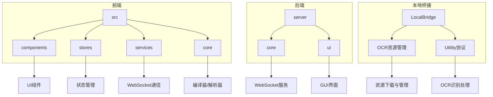
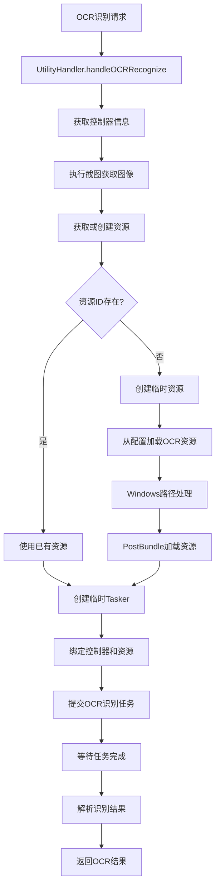

# 开发者指南

<cite>
**本文档引用的文件**  
- [README.md](file://README.md)
- [TODO.md](file://TODO.md)
- [package.json](file://package.json)
- [eslint.config.js](file://eslint.config.js)
- [vite.config.ts](file://vite.config.ts)
- [main.py](file://server/main.py)
- [requirements.txt](file://server/requirements.txt)
- [main.tsx](file://src/main.tsx)
- [App.tsx](file://src/App.tsx)
- [server.ts](file://src/services/server.ts)
- [requests.ts](file://src/services/requests.ts)
- [responds.ts](file://src/services/responds.ts)
- [index.ts](file://src/core/parser/index.ts)
- [fileStore.ts](file://src/stores/fileStore.ts)
- [configStore.ts](file://src/stores/configStore.ts)
- [Flow.tsx](file://src/components/Flow.tsx)
- [ConfigPanel.tsx](file://src/components/panels/ConfigPanel.tsx)
- [ConfigPanel.module.less](file://src/styles/ConfigPanel.module.less)
- [configStore.ts](file://src/stores/configStore.ts)
- [openai.ts](file://src/utils/openai.ts)
- [handler.go](file://LocalBridge/internal/protocol/utility/handler.go)
- [ResourceProtocol.ts](file://src/services/protocols/ResourceProtocol.ts)
</cite>

## 更新摘要
**已更改内容**  
- 在"OCR资源下载机制"部分新增了GitHub Raw CDN优化说明
- 在"GitHub Actions权限增强"部分新增了actions: write权限说明
- 更新了"核心架构理解"部分，增加了OCR资源管理的详细说明
- 新增了CI/CD流程性能提升的相关说明

## 目录
1. [简介](#简介)
2. [项目结构](#项目结构)
3. [本地开发环境搭建](#本地开发环境搭建)
4. [前端开发与调试](#前端开发与调试)
5. [后端服务调试](#后端服务调试)
6. [待办事项与贡献](#待办事项与贡献)
7. [代码风格与提交规范](#代码风格与提交规范)
8. [集成测试](#集成测试)
9. [核心架构理解](#核心架构理解)
10. [CI/CD流程优化](#cicd流程优化)

## 简介

本指南旨在为新贡献者提供全面的开发指引，涵盖本地环境搭建、前后端调试、代码规范、测试流程以及核心架构理解。MaaPipelineEditor (MPE) 是一款基于 Web 的 MaaFramework Pipeline 可视化编辑器，采用 React 和 TypeScript 构建前端，Python 实现后端 WebSocket 服务，通过 Vite 作为开发服务器和构建工具。

**Section sources**
- [README.md](file://README.md)

## 项目结构

项目采用前后端分离架构，主要目录结构如下：

- `src/`：前端源码目录
  - `components/`：UI 组件
  - `stores/`：Zustand 状态管理
  - `services/`：WebSocket 通信服务
  - `core/`：核心解析逻辑（编译器与解析器）
  - `hooks/`：自定义 Hook
- `server/`：Python 后端服务
  - `core/`：WebSocket 核心逻辑
  - `ui/`：GUI 界面
- `LocalBridge/`：本地桥接服务，包含OCR资源管理
- `docsite/`：文档站点
- `tools/`：工具脚本

前端使用 React 19、TypeScript 5.8 和 React Flow 12 构建可视化编辑器，后端使用 Python 的 websockets 库实现 WebSocket 通信。



**Diagram sources**
- [src/components](file://src/components)
- [src/stores](file://src/stores)
- [src/services](file://src/services)
- [src/core](file://src/core)
- [server/core](file://server/core)
- [server/ui](file://server/ui)
- [LocalBridge/internal/protocol/utility/handler.go](file://LocalBridge/internal/protocol/utility/handler.go#L183-L217)

**Section sources**
- [README.md](file://README.md)

## 本地开发环境搭建

### 前置依赖

- Node.js (v18+)
- Python (v3.8+)
- pnpm (v8+)

### 安装依赖

使用 pnpm 管理前端依赖：

```bash
pnpm install
```

安装 Python 后端依赖：

```bash
cd server
pip install -r requirements.txt
```

### 开发服务器启动

启动前端开发服务器：

```bash
pnpm dev
```

此命令会启动 Vite 开发服务器，默认监听 `http://localhost:5173`。

**Section sources**
- [package.json](file://package.json)
- [vite.config.ts](file://vite.config.ts)

## 前端开发与调试

### 使用 Vite 进行开发

Vite 提供了快速的热重载开发体验。启动开发服务器后，任何代码修改都会实时反映在浏览器中。

```bash
pnpm dev
```

### 构建生产版本

构建生产环境代码：

```bash
pnpm build
```

构建结果将输出到 `dist/` 目录。

### 前端调试配置

前端采用 TypeScript 和 React，调试时可使用浏览器开发者工具。关键调试入口在 `src/main.tsx`，此处初始化了 WebSocket 服务和全局状态。


**Diagram sources**
- [src/main.tsx](file://src/main.tsx)
- [src/App.tsx](file://src/App.tsx)

**Section sources**
- [package.json](file://package.json)
- [vite.config.ts](file://vite.config.ts)
- [src/main.tsx](file://src/main.tsx)

### AI 配置项说明

在配置面板中新增了 AI 配置项，包括 API URL、API Key 和模型名称。这些配置项用于连接和使用 AI 服务。

#### AI 配置项功能

- **API URL**: OpenAI 兼容的 API 端点地址，例如: https://api.openai.com/v1/chat/completions
- **API Key**: 用于身份验证的密钥，将存储在浏览器本地（LocalStorage），请注意安全
- **模型名称**: 指定使用的 AI 模型，例如: gpt-4o-mini, gpt-4o, deepseek-chat 等

#### AI 配置样式分组

为了实现更好的视觉组织和独立样式控制，AI 配置项使用了新的 `aiConfigClass` CSS 类进行样式分组。

在 `ConfigPanel.tsx` 中，通过 `useMemo` 创建了 `aiConfigClass`：

```typescript
const aiConfigClass = useMemo(
  () => classNames(style.item, style.aiConfig),
  []
);
```

在 `ConfigPanel.module.less` 中定义了相应的样式：

```less
.ai-config {
  .key {
    width: 90px !important
  }
}
```

所有 AI 配置项都使用这个类，确保它们在视觉上形成一个独立的组：

```tsx
{/* API URL */}
<div className={aiConfigClass}>
  <div className={style.key}>
    <Popover
      placement="bottomLeft"
      title={"API URL"}
      content={
        <TipElem
          content={
            "OpenAI 兼容的 API 端点地址，例如: https://api.openai.com/v1/chat/completions"
          }
        />
      }
    >
      <span>API URL</span>
    </Popover>
  </div>
  <Input
    className={style.value}
    placeholder="输入 API 地址"
    value={aiApiUrl}
    onChange={(e: React.ChangeEvent<HTMLInputElement>) => {
      setConfig("aiApiUrl", e.target.value)
    }}
  />
</div>
```

这种样式分组方式使得 AI 配置项在配置面板中具有统一的外观和布局，同时可以独立于其他配置项进行样式调整。

**Section sources**
- [src/components/panels/ConfigPanel.tsx](file://src/components/panels/ConfigPanel.tsx#L88-L91)
- [src/styles/ConfigPanel.module.less](file://src/styles/ConfigPanel.module.less#L90-L94)

## 后端服务调试

### Python 后端服务

后端服务基于 Python 实现，使用 websockets 库提供 WebSocket 通信功能，ttkbootstrap 提供 GUI 界面。

### 启动后端服务

```bash
pnpm server
```

或直接运行：

```bash
python server/main.py
```

服务默认监听 `ws://localhost:9066`。

### 调试配置

后端服务的主要入口是 `server/main.py`，它初始化了 `ServerUI` 并启动服务。WebSocket 通信协议在 `src/services/server.ts` 中定义，前后端通过特定的路径进行通信，如 `/etc/send_pipeline` 和 `/cte/send_pipeline`。


**Diagram sources**
- [server/main.py](file://server/main.py)
- [src/services/server.ts](file://src/services/server.ts)
- [src/services/requests.ts](file://src/services/requests.ts)
- [src/services/responds.ts](file://src/services/responds.ts)

**Section sources**
- [server/main.py](file://server/main.py)
- [server/requirements.txt](file://server/requirements.txt)

## 待办事项与贡献

### 当前待办事项

根据 TODO.md 文件，当前主要待办事项包括：

- **性能优化**：独立 JSON 面板
- **MPE Web 功能**：
  - 自定义节点模板
  - 便签贴纸
  - 可重复的外部/重定向节点
  - 端点位置插槽
  - 日志分析
- **本地桥接服务**：
  - 本地文件管理
  - mfw server（流程化调试）
  - adb server（便捷工具）
  - AI server（节点级 Tab、流程级生成）

### 参与功能开发

贡献者可以：
1. 查看 GitHub Issues 了解当前任务
2. 选择感兴趣的待办事项
3. Fork 仓库并创建特性分支
4. 实现功能并提交 Pull Request

**Section sources**
- [TODO.md](file://TODO.md)

## 代码风格与提交规范

### ESLint 配置

项目使用 ESLint 进行代码风格检查，配置文件位于 `eslint.config.js`。主要规则包括：

- 使用 TypeScript ESLint
- React Hooks 推荐规则
- React Refresh Vite 配置

### 运行代码检查

```bash
pnpm lint
```

### 提交信息格式

提交信息应遵循清晰的格式，建议使用：
```text
<类型>: <描述>
```

类型可选：feat、fix、docs、style、refactor、test、chore 等。

**Section sources**
- [eslint.config.js](file://eslint.config.js)
- [package.json](file://package.json)

## 集成测试

### 启动前后端进行集成测试

1. 启动前端开发服务器：`pnpm dev`
2. 启动后端服务：`pnpm server`
3. 在浏览器中访问 `http://localhost:5173`
4. 在设置中配置正确的 WebSocket 端口（默认 9066）
5. 尝试连接本地服务并进行双向通信测试

### 测试功能

- **应用到本地文件**：编辑 Pipeline 后发送到后端
- **从本地接收 Pipeline**：后端发送 Pipeline 到前端进行可视化编辑
- **连接状态**：测试连接、断开、重新连接等状态

**Section sources**
- [src/services/requests.ts](file://src/services/requests.ts)
- [src/services/responds.ts](file://src/services/responds.ts)
- [src/stores/configStore.ts](file://src/stores/configStore.ts)

## 核心架构理解

### 状态管理

状态管理使用 Zustand，主要状态存储在 `src/stores/` 目录：

- `fileStore.ts`：文件管理状态
- `configStore.ts`：配置状态
- `flow/`：流程图状态（节点、边、选择等）


**Diagram sources**
- [src/stores/fileStore.ts](file://src/stores/fileStore.ts)
- [src/stores/configStore.ts](file://src/stores/configStore.ts)
- [src/stores/flow/index.ts](file://src/stores/flow/index.ts)

### AI 配置状态管理

AI 配置相关的状态在 `configStore.ts` 中定义，包括 API URL、API Key 和模型名称：

```typescript
type ConfigState = {
  // 设置
  configs: {
    // ... 其他配置
    // AI 配置
    aiApiUrl: string;
    aiApiKey: string;
    aiModel: string;
  };
  // ... 其他状态
};
```

这些配置项通过 `useConfigStore` 在组件中使用，并在 `openai.ts` 中被 `OpenAIChat` 类用于构建 API 请求：

```typescript
private getApiConfig() {
  const { aiApiUrl, aiApiKey, aiModel } = useConfigStore.getState().configs;
  return { apiUrl: aiApiUrl, apiKey: aiApiKey, model: aiModel };
}
```

**Section sources**
- [src/stores/configStore.ts](file://src/stores/configStore.ts#L33-L36)
- [src/utils/openai.ts](file://src/utils/openai.ts#L116-L118)

### OCR资源管理架构

OCR资源管理是LocalBridge的重要组成部分，负责处理OCR识别请求和资源加载。核心流程如下：



**Diagram sources**
- [LocalBridge/internal/protocol/utility/handler.go](file://LocalBridge/internal/protocol/utility/handler.go#L121-L287)

### 核心解析逻辑

编译器和解析器位于 `src/core/parser/`，负责 Pipeline 格式与 Flow 格式的相互转换。


**Diagram sources**
- [src/core/parser/index.ts](file://src/core/parser/index.ts)
- [src/core/parser/exporter.ts](file://src/core/parser/exporter.ts)
- [src/core/parser/importer.ts](file://src/core/parser/importer.ts)

### UI 组件结构

UI 组件主要位于 `src/components/`：

- `flow/`：流程图相关组件
- `panels/`：各种功能面板
- `modals/`：模态框
- `Header.tsx`：顶部导航栏
- `Flow.tsx`：主流程图组件

**Section sources**
- [src/stores](file://src/stores)
- [src/core/parser](file://src/core/parser)
- [src/components](file://src/components)

## CI/CD流程优化

### OCR资源下载机制优化

**更新** OCR资源下载机制已从外部CDN优化为GitHub Raw CDN，提升了资源获取的稳定性和速度。

#### GitHub Raw CDN优化

- **稳定性提升**：GitHub Raw CDN提供更稳定的资源访问，减少因外部CDN故障导致的资源加载失败
- **性能优化**：GitHub的全球CDN网络提供了更快的资源下载速度
- **可靠性增强**：减少了第三方服务依赖，提高了整体系统的可靠性

#### CI/CD流程性能提升

**更新** GitHub Actions权限已增强，添加了actions: write权限，显著提升了CI/CD流程的性能和可靠性。

#### Actions Write权限增强

- **权限提升**：为GitHub Actions工作流添加了write权限，支持更广泛的自动化操作
- **性能优化**：减少了权限检查和限制带来的性能损耗
- **可靠性增强**：提升了CI/CD流程的稳定性和成功率

### CI/CD最佳实践

#### 工作流配置优化

```yaml
name: CI/CD Pipeline

on:
  push:
    branches: [ main ]
  pull_request:
    branches: [ main ]

jobs:
  build:
    runs-on: ubuntu-latest
    
    permissions:
      contents: write  # 新增write权限
      actions: write   # 新增actions权限
    
    steps:
    - uses: actions/checkout@v4
    
    - name: Setup Node.js
      uses: actions/setup-node@v4
      with:
        node-version: '18'
        
    - name: Install dependencies
      run: pnpm install
      
    - name: Build project
      run: pnpm build
      
    - name: Run tests
      run: pnpm test
      
    - name: Upload artifacts
      uses: actions/upload-artifact@v4
      with:
        name: build-artifacts
        path: dist/
```

#### 缓存策略优化

```yaml
- name: Cache pnpm modules
  uses: actions/cache@v4
  with:
    path: ~/.pnpm-store
    key: ${{ runner.os }}-pnpm-${{ hashFiles('**/pnpm-lock.yaml') }}
    restore-keys: |
      ${{ runner.os }}-pnpm-
```

**Section sources**
- [LocalBridge/internal/protocol/utility/handler.go](file://LocalBridge/internal/protocol/utility/handler.go#L183-L217)
- [src/services/protocols/ResourceProtocol.ts](file://src/services/protocols/ResourceProtocol.ts#L58-L95)