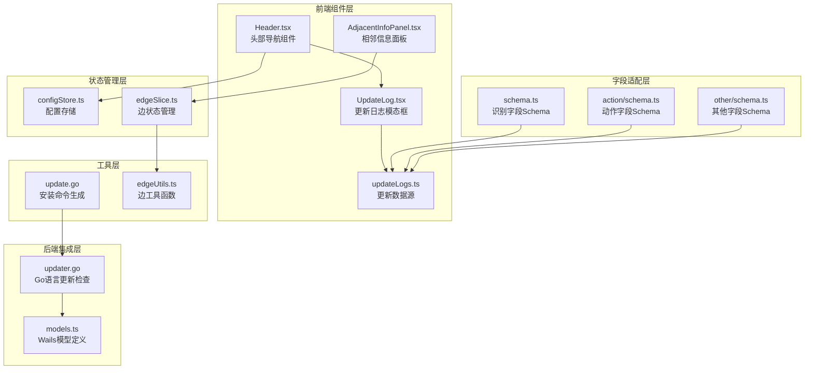
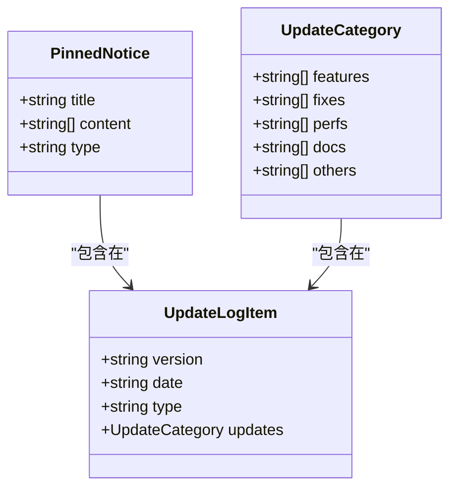
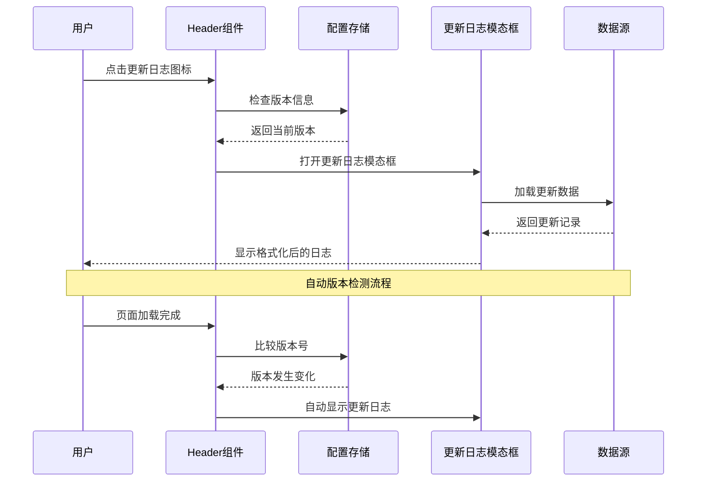
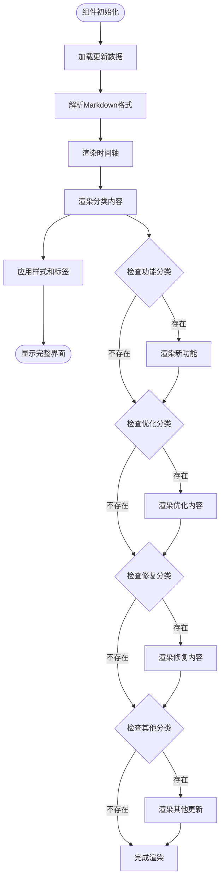
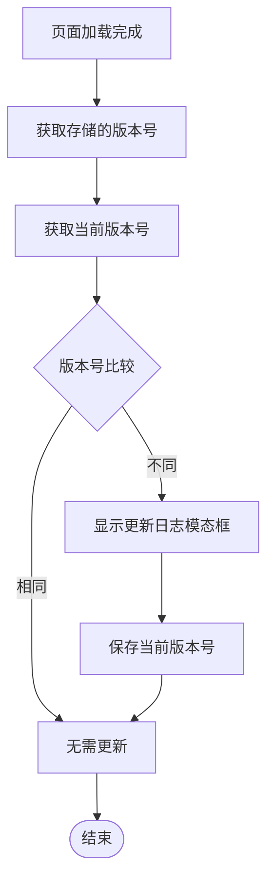
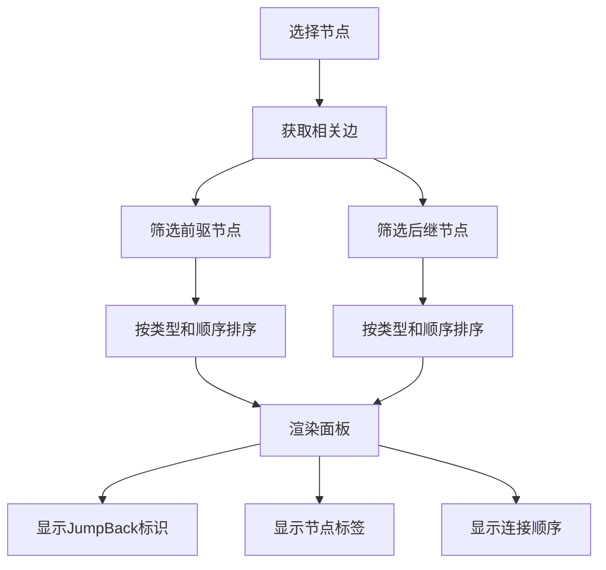
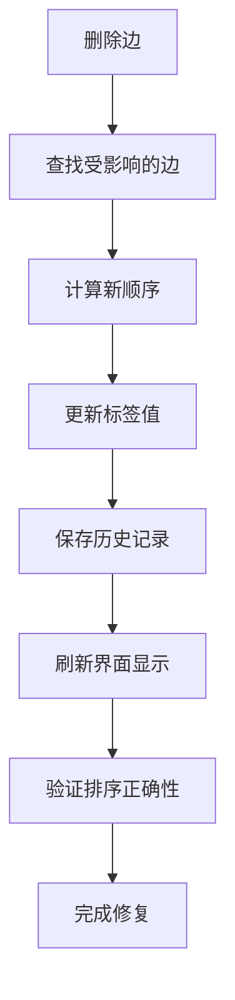
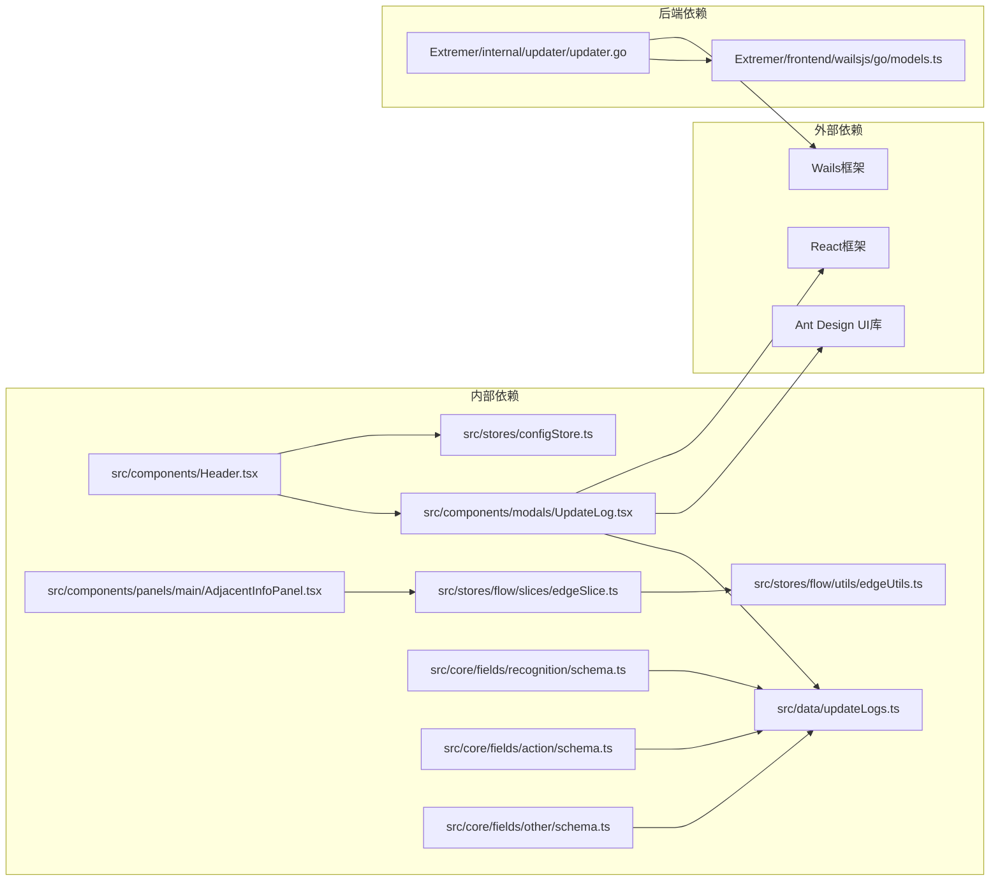

# 更新日志系统

<cite>
**本文档引用的文件**
- [updateLogs.ts](file://src/data/updateLogs.ts)
- [UpdateLog.tsx](file://src/components/modals/UpdateLog.tsx)
- [Header.tsx](file://src/components/Header.tsx)
- [configStore.ts](file://src/stores/configStore.ts)
- [updater.go](file://Extremer/internal/updater/updater.go)
- [update.go](file://LocalBridge/internal/utils/update.go)
- [models.ts](file://Extremer/frontend/wailsjs/go/models.ts)
- [AdjacentInfoPanel.tsx](file://src/components/panels/main/AdjacentInfoPanel.tsx)
- [AdjacentInfoPanel.module.less](file://src/components/panels/main/AdjacentInfoPanel.module.less)
- [edgeSlice.ts](file://src/stores/flow/slices/edgeSlice.ts)
- [edgeUtils.ts](file://src/stores/flow/utils/edgeUtils.ts)
- [schema.ts](file://src/core/fields/recognition/schema.ts)
- [action/schema.ts](file://src/core/fields/action/schema.ts)
- [other/schema.ts](file://src/core/fields/other/schema.ts)
</cite>

## 更新摘要
**变更内容**
- 新增相邻信息面板功能记录
- 新增DirectHit字段适配相关内容
- 新增边排序修正功能说明
- 更新版本历史至1.3.0版本

## 目录
1. [简介](#简介)
2. [项目结构](#项目结构)
3. [核心组件](#核心组件)
4. [架构概览](#架构概览)
5. [详细组件分析](#详细组件分析)
6. [新增功能特性](#新增功能特性)
7. [依赖关系分析](#依赖关系分析)
8. [性能考虑](#性能考虑)
9. [故障排除指南](#故障排除指南)
10. [结论](#结论)

## 简介

更新日志系统是 MaaPipelineEditor (MPE) 项目中的一个重要功能模块，负责向用户展示应用程序的版本更新历史、新功能特性和问题修复。该系统采用前后端分离的设计，结合了前端 React 组件和后端 Go 语言实现，为用户提供了一个直观、易用的更新日志浏览体验。

系统的主要特点包括：
- 可视化的更新日志展示界面
- 置顶公告功能
- 多种更新类型分类
- 自动版本检测和提示
- 支持 Markdown 格式的富文本显示

**更新** 新增了相邻信息面板、DirectHit字段适配、边排序修正等重要功能的记录

## 项目结构

更新日志系统主要分布在以下几个关键文件中：

**图表来源**
- [UpdateLog.tsx:1-246](file://src/components/modals/UpdateLog.tsx#L1-L246)
- [updateLogs.ts:1-659](file://src/data/updateLogs.ts#L1-L659)
- [Header.tsx:226-420](file://src/components/Header.tsx#L226-L420)
- [AdjacentInfoPanel.tsx:1-344](file://src/components/panels/main/AdjacentInfoPanel.tsx#L1-L344)

**章节来源**
- [updateLogs.ts:1-659](file://src/data/updateLogs.ts#L1-L659)
- [UpdateLog.tsx:1-246](file://src/components/modals/UpdateLog.tsx#L1-L246)
- [Header.tsx:226-420](file://src/components/Header.tsx#L226-L420)

## 核心组件

### 数据模型定义

更新日志系统的核心数据结构包括三个主要接口：

**图表来源**
- [updateLogs.ts:4-33](file://src/data/updateLogs.ts#L4-L33)

### 更新日志数据源

系统维护了一个包含 58 个版本更新记录的完整历史，涵盖了从 0.5.2 到 1.3.0 的所有版本变更。每个版本记录都包含详细的更新内容分类：

- **重大更新 (major)**: 重大功能架构调整
- **新功能 (feature)**: 新增的功能特性
- **修复 (fix)**: 问题修复和bug解决
- **优化 (perf)**: 性能优化和体验改进

**更新** 最新版本1.3.0包含了边排序修正的重要修复

**章节来源**
- [updateLogs.ts:49-659](file://src/data/updateLogs.ts#L49-L659)

## 架构概览

更新日志系统采用分层架构设计，实现了前后端的有效分离：

**图表来源**
- [Header.tsx:267-277](file://src/components/Header.tsx#L267-L277)
- [UpdateLog.tsx:13-246](file://src/components/modals/UpdateLog.tsx#L13-L246)

## 详细组件分析

### 更新日志模态框组件

更新日志模态框是系统的核心 UI 组件，提供了丰富的视觉展示效果：

#### 主要功能特性

1. **Markdown 格式支持**: 支持链接和加粗文本的渲染
2. **分类展示**: 按功能、修复、优化等类别组织内容
3. **时间轴布局**: 使用时间轴展示版本历史
4. **置顶公告**: 顶部显示重要通知信息

#### 渲染逻辑分析

**图表来源**
- [UpdateLog.tsx:102-144](file://src/components/modals/UpdateLog.tsx#L102-L144)

**章节来源**
- [UpdateLog.tsx:1-246](file://src/components/modals/UpdateLog.tsx#L1-L246)

### 版本检测和自动提示机制

系统实现了智能的版本检测功能，能够在用户首次启动新版本时自动显示更新日志：

#### 检测流程

**图表来源**
- [Header.tsx:267-277](file://src/components/Header.tsx#L267-L277)

**章节来源**
- [Header.tsx:267-277](file://src/components/Header.tsx#L267-L277)
- [configStore.ts:5-15](file://src/stores/configStore.ts#L5-L15)

### 后端更新检查集成

系统还集成了后端的更新检查功能，主要用于 Extremer 本地版本：

#### Go 语言实现

后端使用 Go 语言实现的更新检查功能，能够：
- 调用 GitHub API 获取最新版本信息
- 解析版本号并进行比较
- 为不同平台生成相应的下载链接

**章节来源**
- [updater.go:44-99](file://Extremer/internal/updater/updater.go#L44-L99)
- [update.go:9-28](file://LocalBridge/internal/utils/update.go#L9-L28)

## 新增功能特性

### 相邻信息面板

**新增** 相邻信息面板是1.2.3版本引入的重要功能，为用户提供节点连接关系的可视化展示。

#### 功能特性

1. **前驱节点展示**: 显示当前节点的所有上游连接节点
2. **后继节点展示**: 显示当前节点的所有下游连接节点  
3. **连接类型分组**: 区分next和on_error两种连接类型
4. **节点跳转功能**: 点击节点标签可直接跳转到对应节点
5. **连接顺序显示**: 显示每条连接在同类型连接中的顺序
6. **JumpBack标识**: 显示jumpback类型的特殊连接

#### 技术实现

**图表来源**
- [AdjacentInfoPanel.tsx:48-108](file://src/components/panels/main/AdjacentInfoPanel.tsx#L48-L108)

**章节来源**
- [AdjacentInfoPanel.tsx:1-344](file://src/components/panels/main/AdjacentInfoPanel.tsx#L1-L344)
- [AdjacentInfoPanel.module.less:1-121](file://src/components/panels/main/AdjacentInfoPanel.module.less#L1-L121)

### DirectHit字段适配

**新增** DirectHit字段适配是1.2.3版本的重要识别功能增强。

#### 适配内容

1. **DirectHit识别类型**: 支持DirectHit类型的识别节点
2. **参数简化**: DirectHit节点使用空参数结构体
3. **流程控制用途**: 专门用于流程控制和条件跳转
4. **性能优化**: 不进行图像分析，识别耗时极低

#### 技术特点

- **无图像分析**: DirectHit不进行任何图像计算
- **参数形态**: 仅支持空结构体参数
- **用途差异**: 主要用于流程控制而非目标定位
- **与其它模式区别**: 与其他识别模式有根本性差异

**章节来源**
- [schema.ts:1-276](file://src/core/fields/recognition/schema.ts#L1-L276)
- [action/schema.ts:1-299](file://src/core/fields/action/schema.ts#L1-L299)
- [other/schema.ts:310-362](file://src/core/fields/other/schema.ts#L310-L362)

### 边排序修正

**更新** 边排序修正功能在1.3.0版本中得到重要改进。

#### 修复内容

1. **排序逻辑修正**: 修复了删除边后次序未及时更新的问题
2. **顺序稳定性**: 确保边连接顺序的稳定性和准确性
3. **类型分组排序**: 按连接类型（next/on_error）分别排序
4. **动态更新**: 实时更新受影响边的连接顺序

#### 实现机制

**图表来源**
- [edgeSlice.ts:102-148](file://src/stores/flow/slices/edgeSlice.ts#L102-L148)
- [edgeUtils.ts:17-31](file://src/stores/flow/utils/edgeUtils.ts#L17-L31)

**章节来源**
- [edgeSlice.ts:90-222](file://src/stores/flow/slices/edgeSlice.ts#L90-L222)
- [edgeUtils.ts:1-32](file://src/stores/flow/utils/edgeUtils.ts#L1-L32)

## 依赖关系分析

更新日志系统与其他组件的依赖关系如下：

**图表来源**
- [UpdateLog.tsx:1-4](file://src/components/modals/UpdateLog.tsx#L1-L4)
- [updateLogs.ts:1-3](file://src/data/updateLogs.ts#L1-L3)
- [Header.tsx:226-228](file://src/components/Header.tsx#L226-L228)

**章节来源**
- [UpdateLog.tsx:1-4](file://src/components/modals/UpdateLog.tsx#L1-L4)
- [updateLogs.ts:1-3](file://src/data/updateLogs.ts#L1-L3)
- [Header.tsx:226-228](file://src/components/Header.tsx#L226-L228)

## 性能考虑

更新日志系统的性能优化主要体现在以下几个方面：

### 渲染优化
- 使用虚拟滚动避免大量 DOM 元素的创建
- 按需加载更新数据，减少初始渲染负担
- 合理的样式缓存和组件重用

### 数据管理
- 更新数据采用静态文件形式，便于缓存
- 版本检测使用本地存储，避免频繁网络请求
- Markdown 解析结果进行适当的缓存

### 用户体验
- 模态框具有合理的宽度和高度限制
- 滚动条处理优化，避免影响页面布局
- 响应式设计适配不同屏幕尺寸

**新增** 相邻信息面板采用memo优化，避免不必要的重新渲染

## 故障排除指南

### 常见问题及解决方案

#### 更新日志无法显示
1. **检查网络连接**: 确保能够正常访问 GitHub API
2. **验证数据格式**: 检查 updateLogs.ts 文件的数据格式是否正确
3. **查看浏览器控制台**: 检查是否有 JavaScript 错误

#### 版本检测异常
1. **清除浏览器缓存**: 重新加载页面以获取最新版本信息
2. **检查本地存储**: 确认 localStorage 中的版本信息是否正确
3. **验证配置**: 检查 globalConfig.version 的值是否符合预期

#### 样式显示问题
1. **检查依赖库版本**: 确保 Ant Design 和 React 版本兼容
2. **验证 CSS 样式**: 检查样式文件是否正确加载
3. **浏览器兼容性**: 确认目标浏览器支持相关 CSS 属性

#### 相邻信息面板问题
1. **检查节点连接**: 确认节点间连接关系正确
2. **验证面板权限**: 确认当前用户有查看连接信息的权限
3. **刷新页面缓存**: 清除浏览器缓存后重新加载

#### 边排序异常
1. **检查边状态**: 确认边的label值和顺序正确
2. **验证排序逻辑**: 检查边排序算法是否正常工作
3. **重置边控制**: 使用重置功能恢复边的默认状态

**章节来源**
- [UpdateLog.tsx:147-165](file://src/components/modals/UpdateLog.tsx#L147-L165)
- [Header.tsx:267-277](file://src/components/Header.tsx#L267-L277)

## 结论

MaaPipelineEditor 的更新日志系统是一个设计精良、功能完整的模块化组件。它成功地实现了以下目标：

### 技术优势
- **前后端分离**: 前端专注于用户体验，后端负责版本检查
- **数据驱动**: 使用结构化数据源，便于维护和扩展
- **组件化设计**: 模块化组件便于测试和复用

### 用户价值
- **透明的信息展示**: 清晰地向用户传达产品演进历程
- **智能的版本管理**: 自动检测新版本，提升用户体验
- **丰富的视觉效果**: 通过时间轴和分类展示增强可读性

### 扩展性
系统的设计为未来的功能扩展预留了充足的空间，包括：
- 支持更多的更新类型和分类
- 集成更多平台的版本检查
- 增强用户交互和个性化设置

**更新** 最新版本1.3.0引入的相邻信息面板、DirectHit字段适配和边排序修正功能，进一步提升了系统的实用性和用户体验。这些功能的加入使得用户能够更好地理解和管理复杂的节点连接关系，同时保持了系统的高性能和稳定性。

总体而言，更新日志系统体现了现代前端开发的最佳实践，为 MaaPipelineEditor 提供了一个专业、可靠的版本管理解决方案。