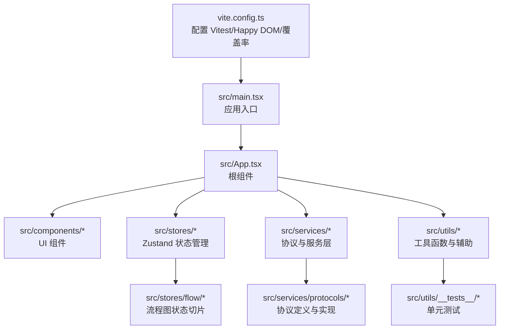
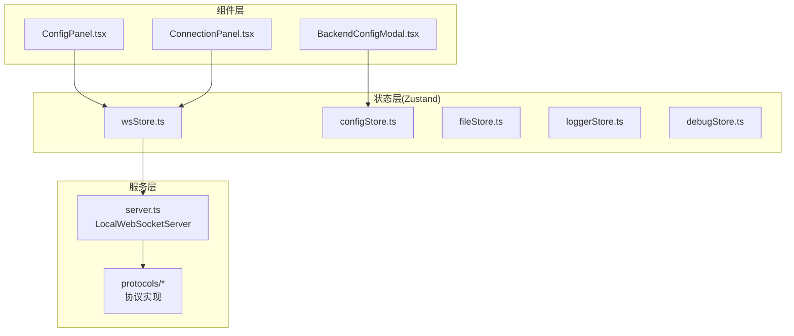
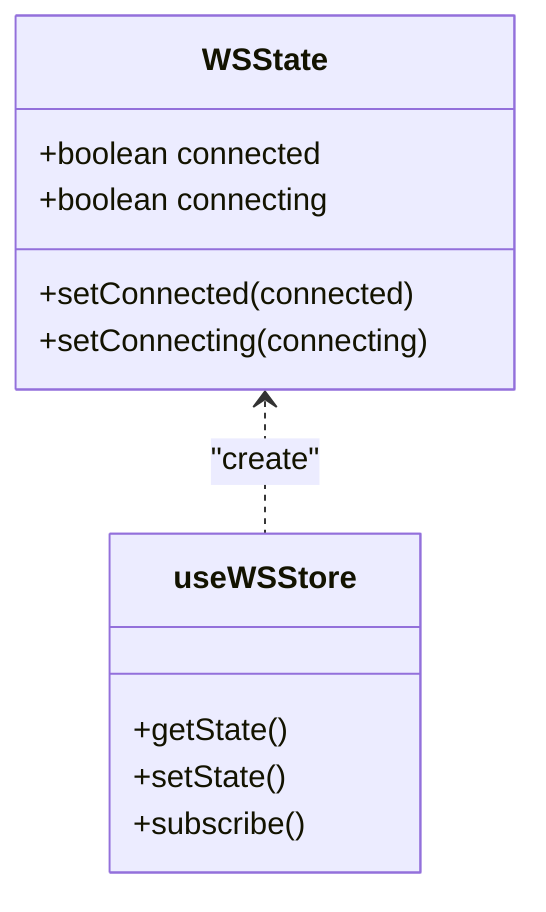
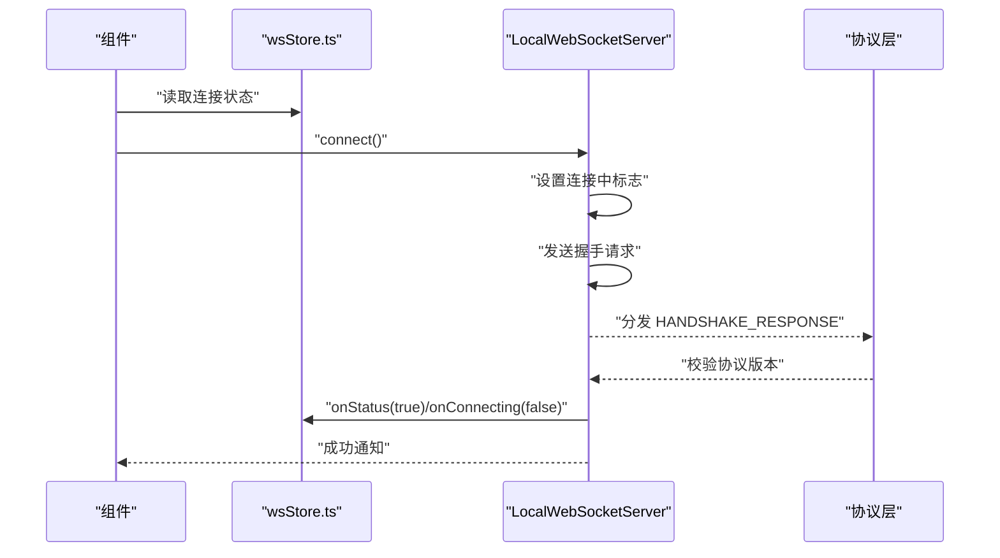
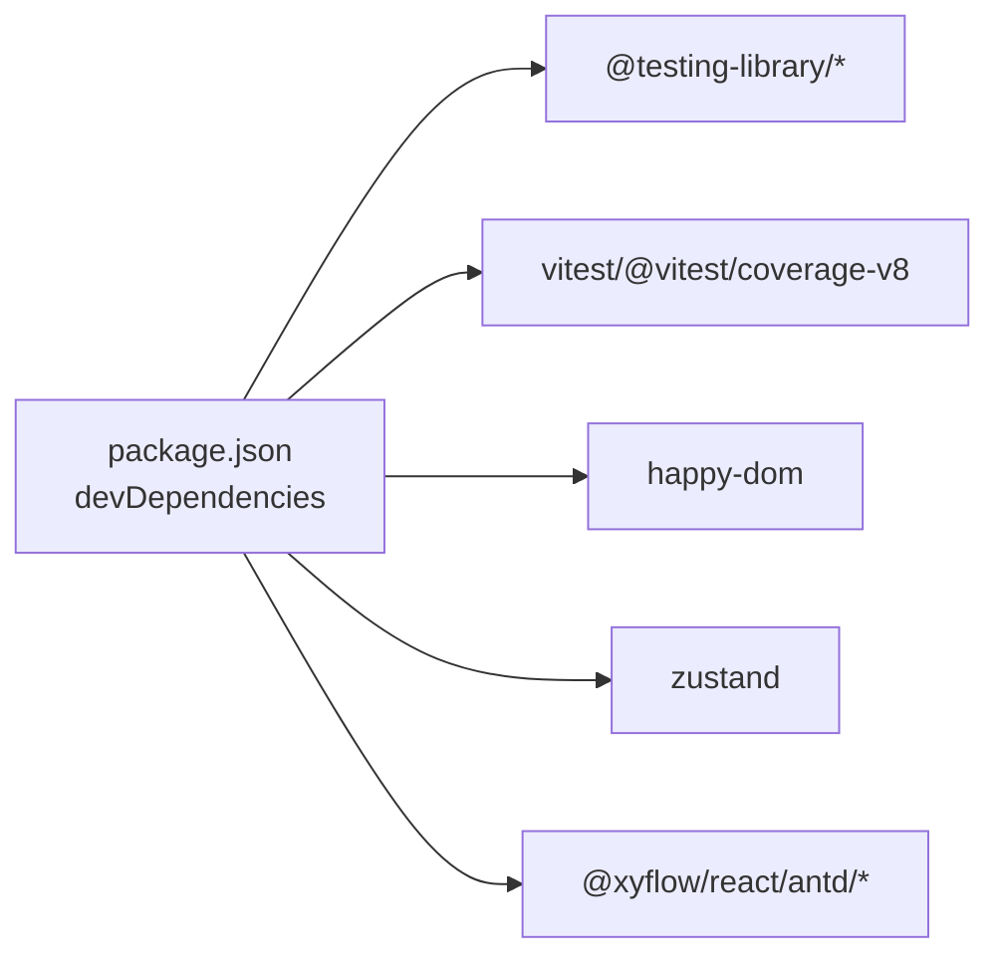

# 前端测试

<cite>
**本文引用的文件**
- [package.json](file://package.json)
- [vite.config.ts](file://vite.config.ts)
- [src/stores/wsStore.ts](file://src/stores/wsStore.ts)
- [src/services/server.ts](file://src/services/server.ts)
- [src/App.tsx](file://src/App.tsx)
- [src/main.tsx](file://src/main.tsx)
- [src/components/panels/main/ConfigPanel.tsx](file://src/components/panels/main/ConfigPanel.tsx)
- [src/components/panels/main/ConnectionPanel.tsx](file://src/components/panels/main/ConnectionPanel.tsx)
- [src/components/modals/BackendConfigModal.tsx](file://src/components/modals/BackendConfigModal.tsx)
- [src/hooks/useGlobalShortcuts.ts](file://src/hooks/useGlobalShortcuts.ts)
- [src/hooks/useCanvasViewport.ts](file://src/hooks/useCanvasViewport.ts)
- [src/utils/wailsBridge.ts](file://src/utils/wailsBridge.ts)
- [src/utils/jsonHelper.ts](file://src/utils/jsonHelper.ts)
- [src/utils/clipboard.ts](file://src/utils/clipboard.ts)
- [src/utils/urlHelper.ts](file://src/utils/urlHelper.ts)
- [src/utils/__tests__/jsonHelper.test.ts](file://src/utils/__tests__/jsonHelper.test.ts)
- [src/utils/__tests__/clipboard.test.ts](file://src/utils/__tests__/clipboard.test.ts)
- [src/utils/__tests__/urlHelper.test.ts](file://src/utils/__tests__/urlHelper.test.ts)
- [src/stores/flow/index.ts](file://src/stores/flow/index.ts)
- [src/stores/flow/slices/graphSlice.ts](file://src/stores/flow/slices/graphSlice.ts)
- [src/stores/flow/slices/nodeSlice.ts](file://src/stores/flow/slices/nodeSlice.ts)
- [src/stores/flow/slices/edgeSlice.ts](file://src/stores/flow/slices/edgeSlice.ts)
- [src/stores/flow/slices/historySlice.ts](file://src/stores/flow/slices/historySlice.ts)
- [src/stores/flow/slices/pathSlice.ts](file://src/stores/flow/slices/pathSlice.ts)
- [src/stores/flow/slices/selectionSlice.ts](file://src/stores/flow/slices/selectionSlice.ts)
- [src/stores/flow/slices/viewSlice.ts](file://src/stores/flow/slices/viewSlice.ts)
- [src/stores/flow/utils/nodeUtils.ts](file://src/stores/flow/utils/nodeUtils.ts)
- [src/stores/flow/utils/edgeUtils.ts](file://src/stores/flow/utils/edgeUtils.ts)
- [src/stores/flow/utils/viewportUtils.ts](file://src/stores/flow/utils/viewportUtils.ts)
- [src/stores/configStore.ts](file://src/stores/configStore.ts)
- [src/stores/fileStore.ts](file://src/stores/fileStore.ts)
- [src/stores/localFileStore.ts](file://src/stores/localFileStore.ts)
- [src/stores/debugStore.ts](file://src/stores/debugStore.ts)
- [src/stores/errorStore.ts](file://src/stores/errorStore.ts)
- [src/stores/loggerStore.ts](file://src/stores/loggerStore.ts)
- [src/stores/mfwStore.ts](file://src/stores/mfwStore.ts)
- [src/stores/toolbarStore.ts](file://src/stores/toolbarStore.ts)
- [src/stores/clipboardStore.ts](file://src/stores/clipboardStore.ts)
- [src/stores/customTemplateStore.ts](file://src/stores/customTemplateStore.ts)
- [src/stores/wsStore.ts](file://src/stores/wsStore.ts)
- [src/services/protocols/BaseProtocol.ts](file://src/services/protocols/BaseProtocol.ts)
- [src/services/protocols/FileProtocol.ts](file://src/services/protocols/FileProtocol.ts)
- [src/services/protocols/MFWProtocol.ts](file://src/services/protocols/MFWProtocol.ts)
- [src/services/protocols/ConfigProtocol.ts](file://src/services/protocols/ConfigProtocol.ts)
- [src/services/protocols/DebugProtocol.ts](file://src/services/protocols/DebugProtocol.ts)
- [src/services/protocols/ResourceProtocol.ts](file://src/services/protocols/ResourceProtocol.ts)
- [src/services/protocols/LoggerProtocol.ts](file://src/services/protocols/LoggerProtocol.ts)
- [src/services/protocols/ErrorProtocol.ts](file://src/services/protocols/ErrorProtocol.ts)
- [src/services/protocols/index.ts](file://src/services/protocols/index.ts)
- [src/services/crossFileService.ts](file://src/services/crossFileService.ts)
- [src/services/type.ts](file://src/services/type.ts)
- [src/core/parser/configParser.ts](file://src/core/parser/configParser.ts)
- [src/core/parser/importer.ts](file://src/core/parser/importer.ts)
- [src/core/parser/exporter.ts](file://src/core/parser/exporter.ts)
- [src/core/parser/nodeParser.ts](file://src/core/parser/nodeParser.ts)
- [src/core/parser/edgeLinker.ts](file://src/core/parser/edgeLinker.ts)
- [src/core/parser/configSplitter.ts](file://src/core/parser/configSplitter.ts)
- [src/core/parser/versionDetector.ts](file://src/core/parser/versionDetector.ts)
- [src/core/fields.ts](file://src/core/fields.ts)
- [src/core/layout.ts](file://src/core/layout.ts)
- [src/core/snapUtils.ts](file://src/core/snapUtils.ts)
- [src/data/nodeTemplates.ts](file://src/data/nodeTemplates.ts)
- [src/data/updateLogs.ts](file://src/data/updateLogs.ts)
- [src/contexts/ThemeContext.tsx](file://src/contexts/ThemeContext.tsx)
- [src/utils/__tests__/aiPredictor.test.ts](file://src/utils/__tests__/aiPredictor.test.ts)
- [src/utils/__tests__/bufferHelper.test.ts](file://src/utils/__tests__/bufferHelper.test.ts)
- [src/utils/__tests__/nodeNameHelper.test.ts](file://src/utils/__tests__/nodeNameHelper.test.ts)
- [src/utils/__tests__/openai.test.ts](file://src/utils/__tests__/openai.test.ts)
- [src/utils/__tests__/panelPosition.test.ts](file://src/utils/__tests__/panelPosition.test.ts)
- [src/utils/__tests__/roiNegativeCoord.test.ts](file://src/utils/__tests__/roiNegativeCoord.test.ts)
- [src/utils/__tests__/shareHelper.test.ts](file://src/utils/__tests__/shareHelper.test.ts)
- [src/utils/__tests__/snapper.test.ts](file://src/utils/__tests__/snapper.test.ts)
- [src/utils/__tests__/wailsBridge.test.ts](file://src/utils/__tests__/wailsBridge.test.ts)
</cite>

## 目录
1. [引言](#引言)
2. [项目结构](#项目结构)
3. [核心组件](#核心组件)
4. [架构总览](#架构总览)
5. [详细组件分析](#详细组件分析)
6. [依赖分析](#依赖分析)
7. [性能考虑](#性能考虑)
8. [故障排查指南](#故障排查指南)
9. [结论](#结论)
10. [附录](#附录)

## 引言
本指南面向前端开发者与测试工程师，系统性阐述本项目的前端测试最佳实践，覆盖以下主题：
- React 组件测试：渲染测试、用户交互模拟、状态管理测试
- 测试框架与工具：Jest 与 React Testing Library 的使用
- 状态管理测试：Zustand Store 的单元测试与集成测试
- WebSocket 通信测试：连接、握手、消息收发与错误处理
- 文件上传/下载测试：协议层与 UI 层的协同验证
- 测试用例编写规范与 Mock 数据准备
- 测试覆盖率要求与 CI/CD 集成策略

本指南以仓库中的实际代码为依据，结合 Vite + Vitest + Happy DOM 的配置，给出可操作的测试策略与图示。

## 项目结构
本项目采用基于功能域的组织方式，前端代码位于 src 目录，测试集中在各模块的 __tests__ 目录下。Vitest 作为测试运行器，Happy DOM 作为浏览器环境模拟，覆盖率通过 v8 提供器生成多种格式报告。

图表来源
- [vite.config.ts:22-38](file://vite.config.ts#L22-L38)
- [src/main.tsx](file://src/main.tsx)
- [src/App.tsx](file://src/App.tsx)

章节来源
- [vite.config.ts:1-41](file://vite.config.ts#L1-L41)
- [package.json:41-62](file://package.json#L41-L62)

## 核心组件
- 测试运行与环境
  - Vitest：测试运行器与断言库
  - Happy DOM：DOM/BOM API 模拟，支持 WebSocket
  - 覆盖率：v8 提供器，输出文本、JSON、HTML、LCOV
- 状态管理
  - Zustand：轻量状态容器，广泛用于连接状态、文件、日志、调试等
- 通信层
  - WebSocket：本地服务连接、握手、路由分发
  - 协议层：文件、配置、调试、资源、日志、错误等协议封装
- 工具与业务逻辑
  - JSON 辅助、剪贴板、URL 工具、节点/边工具、布局与吸附等

章节来源
- [vite.config.ts:22-38](file://vite.config.ts#L22-L38)
- [package.json:39-40](file://package.json#L39-L40)
- [src/services/server.ts:20-331](file://src/services/server.ts#L20-L331)
- [src/stores/wsStore.ts:1-24](file://src/stores/wsStore.ts#L1-L24)

## 架构总览
下图展示前端测试视角下的关键交互：组件通过 Zustand 访问状态，通过服务层与本地 WebSocket 通信，协议层负责消息路由与处理。

图表来源
- [src/components/panels/main/ConfigPanel.tsx](file://src/components/panels/main/ConfigPanel.tsx)
- [src/components/panels/main/ConnectionPanel.tsx](file://src/components/panels/main/ConnectionPanel.tsx)
- [src/components/modals/BackendConfigModal.tsx](file://src/components/modals/BackendConfigModal.tsx)
- [src/stores/wsStore.ts:1-24](file://src/stores/wsStore.ts#L1-L24)
- [src/stores/configStore.ts](file://src/stores/configStore.ts)
- [src/stores/fileStore.ts](file://src/stores/fileStore.ts)
- [src/stores/loggerStore.ts](file://src/stores/loggerStore.ts)
- [src/stores/debugStore.ts](file://src/stores/debugStore.ts)
- [src/services/server.ts:20-331](file://src/services/server.ts#L20-L331)
- [src/services/protocols/index.ts](file://src/services/protocols/index.ts)

## 详细组件分析

### 组件渲染与交互测试
- 目标
  - 验证组件在不同状态下的渲染结果
  - 模拟用户交互（点击、输入、拖拽）并断言行为
- 推荐做法
  - 使用 React Testing Library 的查询 API（如 getByRole、getByLabelText）
  - 使用 user-event 或 fireEvent 进行交互
  - 针对受控与非受控组件分别测试
  - 对于复杂交互，拆分为多个小用例，关注单一职责
- 示例参考路径
  - [src/components/panels/main/ConfigPanel.tsx](file://src/components/panels/main/ConfigPanel.tsx)
  - [src/components/panels/main/ConnectionPanel.tsx](file://src/components/panels/main/ConnectionPanel.tsx)
  - [src/components/modals/BackendConfigModal.tsx](file://src/components/modals/BackendConfigModal.tsx)

章节来源
- [src/components/panels/main/ConfigPanel.tsx](file://src/components/panels/main/ConfigPanel.tsx)
- [src/components/panels/main/ConnectionPanel.tsx](file://src/components/panels/main/ConnectionPanel.tsx)
- [src/components/modals/BackendConfigModal.tsx](file://src/components/modals/BackendConfigModal.tsx)

### 状态管理测试（Zustand）
- 目标
  - 验证 Store 的初始化值、状态变更、派生状态与副作用
  - 验证切片之间的协作（如 graphSlice 与 nodeSlice）
- 推荐做法
  - 在单测中直接调用 Store 的 setter，断言状态变化
  - 对于异步副作用（如连接状态），使用 fake timers 或手动调度
  - 对于跨切片联动，构造最小化场景，避免过度耦合
- 示例参考路径
  - [src/stores/wsStore.ts:1-24](file://src/stores/wsStore.ts#L1-L24)
  - [src/stores/flow/index.ts](file://src/stores/flow/index.ts)
  - [src/stores/flow/slices/graphSlice.ts](file://src/stores/flow/slices/graphSlice.ts)
  - [src/stores/flow/slices/nodeSlice.ts](file://src/stores/flow/slices/nodeSlice.ts)
  - [src/stores/flow/slices/edgeSlice.ts](file://src/stores/flow/slices/edgeSlice.ts)
  - [src/stores/flow/slices/historySlice.ts](file://src/stores/flow/slices/historySlice.ts)
  - [src/stores/flow/slices/pathSlice.ts](file://src/stores/flow/slices/pathSlice.ts)
  - [src/stores/flow/slices/selectionSlice.ts](file://src/stores/flow/slices/selectionSlice.ts)
  - [src/stores/flow/slices/viewSlice.ts](file://src/stores/flow/slices/viewSlice.ts)

图表来源
- [src/stores/wsStore.ts:7-23](file://src/stores/wsStore.ts#L7-L23)

章节来源
- [src/stores/wsStore.ts:1-24](file://src/stores/wsStore.ts#L1-L24)
- [src/stores/flow/index.ts](file://src/stores/flow/index.ts)
- [src/stores/flow/slices/graphSlice.ts](file://src/stores/flow/slices/graphSlice.ts)
- [src/stores/flow/slices/nodeSlice.ts](file://src/stores/flow/slices/nodeSlice.ts)
- [src/stores/flow/slices/edgeSlice.ts](file://src/stores/flow/slices/edgeSlice.ts)
- [src/stores/flow/slices/historySlice.ts](file://src/stores/flow/slices/historySlice.ts)
- [src/stores/flow/slices/pathSlice.ts](file://src/stores/flow/slices/pathSlice.ts)
- [src/stores/flow/slices/selectionSlice.ts](file://src/stores/flow/slices/selectionSlice.ts)
- [src/stores/flow/slices/viewSlice.ts](file://src/stores/flow/slices/viewSlice.ts)

### WebSocket 通信测试
- 目标
  - 验证连接建立、握手、消息收发、错误处理与断开流程
  - 验证 onStatus/onConnecting 回调触发顺序与参数
- 推荐做法
  - 使用 Happy DOM 的 WebSocket 实现进行端到端测试
  - 通过 Mock 服务器模拟握手与路由分发
  - 断言连接状态变化、通知弹窗与错误提示
- 示例参考路径
  - [src/services/server.ts:20-331](file://src/services/server.ts#L20-L331)

图表来源
- [src/services/server.ts:104-120](file://src/services/server.ts#L104-L120)
- [src/services/server.ts:161-180](file://src/services/server.ts#L161-L180)
- [src/services/server.ts:39-64](file://src/services/server.ts#L39-L64)
- [src/stores/wsStore.ts:18-23](file://src/stores/wsStore.ts#L18-L23)

章节来源
- [src/services/server.ts:20-331](file://src/services/server.ts#L20-L331)
- [src/stores/wsStore.ts:1-24](file://src/stores/wsStore.ts#L1-L24)

### 文件上传/下载测试
- 目标
  - 验证文件选择、预览、上传与下载流程
  - 验证协议层对文件操作的封装与错误处理
- 推荐做法
  - 使用 Blob 与 File API 模拟文件对象
  - 通过协议层的 send 方法断言消息结构
  - 验证 UI 层的进度反馈与错误提示
- 示例参考路径
  - [src/services/protocols/FileProtocol.ts](file://src/services/protocols/FileProtocol.ts)
  - [src/services/protocols/index.ts](file://src/services/protocols/index.ts)
  - [src/stores/fileStore.ts](file://src/stores/fileStore.ts)
  - [src/stores/localFileStore.ts](file://src/stores/localFileStore.ts)

章节来源
- [src/services/protocols/FileProtocol.ts](file://src/services/protocols/FileProtocol.ts)
- [src/services/protocols/index.ts](file://src/services/protocols/index.ts)
- [src/stores/fileStore.ts](file://src/stores/fileStore.ts)
- [src/stores/localFileStore.ts](file://src/stores/localFileStore.ts)

### 工具函数测试
- 目标
  - 验证 JSON 解析/序列化、剪贴板操作、URL 处理等工具函数
- 推荐做法
  - 针对边界条件与异常路径编写用例
  - 使用快照或结构化断言保证输出稳定性
- 示例参考路径
  - [src/utils/__tests__/jsonHelper.test.ts](file://src/utils/__tests__/jsonHelper.test.ts)
  - [src/utils/__tests__/clipboard.test.ts](file://src/utils/__tests__/clipboard.test.ts)
  - [src/utils/__tests__/urlHelper.test.ts](file://src/utils/__tests__/urlHelper.test.ts)
  - [src/utils/__tests__/wailsBridge.test.ts](file://src/utils/__tests__/wailsBridge.test.ts)
  - [src/utils/__tests__/bufferHelper.test.ts](file://src/utils/__tests__/bufferHelper.test.ts)
  - [src/utils/__tests__/nodeNameHelper.test.ts](file://src/utils/__tests__/nodeNameHelper.test.ts)
  - [src/utils/__tests__/openai.test.ts](file://src/utils/__tests__/openai.test.ts)
  - [src/utils/__tests__/panelPosition.test.ts](file://src/utils/__tests__/panelPosition.test.ts)
  - [src/utils/__tests__/roiNegativeCoord.test.ts](file://src/utils/__tests__/roiNegativeCoord.test.ts)
  - [src/utils/__tests__/shareHelper.test.ts](file://src/utils/__tests__/shareHelper.test.ts)
  - [src/utils/__tests__/snapper.test.ts](file://src/utils/__tests__/snapper.test.ts)

章节来源
- [src/utils/__tests__/jsonHelper.test.ts](file://src/utils/__tests__/jsonHelper.test.ts)
- [src/utils/__tests__/clipboard.test.ts](file://src/utils/__tests__/clipboard.test.ts)
- [src/utils/__tests__/urlHelper.test.ts](file://src/utils/__tests__/urlHelper.test.ts)
- [src/utils/__tests__/wailsBridge.test.ts](file://src/utils/__tests__/wailsBridge.test.ts)
- [src/utils/__tests__/bufferHelper.test.ts](file://src/utils/__tests__/bufferHelper.test.ts)
- [src/utils/__tests__/nodeNameHelper.test.ts](file://src/utils/__tests__/nodeNameHelper.test.ts)
- [src/utils/__tests__/openai.test.ts](file://src/utils/__tests__/openai.test.ts)
- [src/utils/__tests__/panelPosition.test.ts](file://src/utils/__tests__/panelPosition.test.ts)
- [src/utils/__tests__/roiNegativeCoord.test.ts](file://src/utils/__tests__/roiNegativeCoord.test.ts)
- [src/utils/__tests__/shareHelper.test.ts](file://src/utils/__tests__/shareHelper.test.ts)
- [src/utils/__tests__/snapper.test.ts](file://src/utils/__tests__/snapper.test.ts)

### Hooks 测试
- 目标
  - 验证快捷键与画布视口等 Hook 的行为
- 推荐做法
  - 使用 renderHook 与 act 包裹副作用
  - 通过事件监听断言回调执行
- 示例参考路径
  - [src/hooks/useGlobalShortcuts.ts](file://src/hooks/useGlobalShortcuts.ts)
  - [src/hooks/useCanvasViewport.ts](file://src/hooks/useCanvasViewport.ts)

章节来源
- [src/hooks/useGlobalShortcuts.ts](file://src/hooks/useGlobalShortcuts.ts)
- [src/hooks/useCanvasViewport.ts](file://src/hooks/useCanvasViewport.ts)

### 协议层与业务逻辑测试
- 目标
  - 验证协议注册、消息路由、版本协商与错误处理
- 推荐做法
  - 通过 Mock 路由处理器断言分发逻辑
  - 验证握手失败与连接超时分支
- 示例参考路径
  - [src/services/protocols/BaseProtocol.ts](file://src/services/protocols/BaseProtocol.ts)
  - [src/services/protocols/FileProtocol.ts](file://src/services/protocols/FileProtocol.ts)
  - [src/services/protocols/MFWProtocol.ts](file://src/services/protocols/MFWProtocol.ts)
  - [src/services/protocols/ConfigProtocol.ts](file://src/services/protocols/ConfigProtocol.ts)
  - [src/services/protocols/DebugProtocol.ts](file://src/services/protocols/DebugProtocol.ts)
  - [src/services/protocols/ResourceProtocol.ts](file://src/services/protocols/ResourceProtocol.ts)
  - [src/services/protocols/LoggerProtocol.ts](file://src/services/protocols/LoggerProtocol.ts)
  - [src/services/protocols/ErrorProtocol.ts](file://src/services/protocols/ErrorProtocol.ts)
  - [src/services/protocols/index.ts](file://src/services/protocols/index.ts)
  - [src/services/crossFileService.ts](file://src/services/crossFileService.ts)
  - [src/services/type.ts](file://src/services/type.ts)

章节来源
- [src/services/protocols/BaseProtocol.ts](file://src/services/protocols/BaseProtocol.ts)
- [src/services/protocols/FileProtocol.ts](file://src/services/protocols/FileProtocol.ts)
- [src/services/protocols/MFWProtocol.ts](file://src/services/protocols/MFWProtocol.ts)
- [src/services/protocols/ConfigProtocol.ts](file://src/services/protocols/ConfigProtocol.ts)
- [src/services/protocols/DebugProtocol.ts](file://src/services/protocols/DebugProtocol.ts)
- [src/services/protocols/ResourceProtocol.ts](file://src/services/protocols/ResourceProtocol.ts)
- [src/services/protocols/LoggerProtocol.ts](file://src/services/protocols/LoggerProtocol.ts)
- [src/services/protocols/ErrorProtocol.ts](file://src/services/protocols/ErrorProtocol.ts)
- [src/services/protocols/index.ts](file://src/services/protocols/index.ts)
- [src/services/crossFileService.ts](file://src/services/crossFileService.ts)
- [src/services/type.ts](file://src/services/type.ts)

## 依赖分析
- 测试依赖
  - @testing-library/react、@testing-library/jest-dom、@testing-library/dom：DOM 查询与断言增强
  - vitest、@vitest/coverage-v8：测试运行器与覆盖率
  - happy-dom：浏览器 API 模拟
- 运行时依赖
  - zustand：状态管理
  - @xyflow/react、antd、@ant-design/icons：UI 组件库
- 构建与脚本
  - Vite 插件与别名配置，测试入口与覆盖率排除规则

图表来源
- [package.json:41-62](file://package.json#L41-L62)

章节来源
- [package.json:20-62](file://package.json#L20-L62)
- [vite.config.ts:14-38](file://vite.config.ts#L14-L38)

## 性能考虑
- 测试性能
  - 使用最小化渲染与必要依赖，避免不必要的全局状态
  - 对异步逻辑使用 fake timers 控制节奏
  - 将昂贵的计算放入独立工具函数并单独测试
- 覆盖率与质量
  - 优先保证核心路径与错误分支被覆盖
  - 对协议层与状态层的关键分支进行分支覆盖
  - 保持测试命名清晰，便于定位问题与维护

## 故障排查指南
- 常见问题
  - WebSocket 连接超时：检查本地服务是否启动、端口是否正确、握手版本是否匹配
  - 协议版本不一致：确认前端协议版本与后端一致
  - DOM 查询失败：确认组件渲染完成、属性/标签是否正确
- 定位手段
  - 使用 Vitest 的详细输出与覆盖率报告
  - 在测试中打印关键状态与事件，辅助断言
  - 对异步流程使用 await/act 确保时序正确

章节来源
- [src/services/server.ts:127-159](file://src/services/server.ts#L127-L159)
- [src/services/server.ts:50-63](file://src/services/server.ts#L50-L63)

## 结论
本指南提供了基于仓库实际代码的前端测试实践蓝图：以 Vitest + Happy DOM 为基础，结合 React Testing Library 进行组件测试；以 Zustand 切片为核心进行状态管理测试；以 LocalWebSocketServer 与协议层为对象进行通信测试；以工具函数与业务逻辑为补充完善测试矩阵。建议在 CI 中开启覆盖率统计与报告生成，持续提升代码质量与交付效率。

## 附录

### 测试用例编写规范
- 命名规范
  - describe 块描述“模块/功能”，it 块描述“在特定条件下应如何”
- 断言风格
  - 优先使用语义化断言（如.toBeTruthy、toHaveLength），避免过细粒度的实现断言
- Mock 与隔离
  - 对外部依赖（网络、存储）进行 Mock，确保测试可重复
- 异步测试
  - 使用 async/await 与 waitFor，避免硬编码等待

### Mock 数据准备方法
- 工具函数
  - 使用 Blob、File、ArrayBuffer 构造文件对象
  - 使用 JSON.stringify/parse 模拟消息体
- 状态 Mock
  - 直接调用 Zustand Store 的 setter 或 replace
- WebSocket Mock
  - 使用 Happy DOM 的 WebSocket 实现，配合 onopen/onmessage/onerror/onclose 断言

### 测试覆盖率要求与 CI/CD 集成策略
- 覆盖率目标
  - 语句覆盖率、分支覆盖率、函数覆盖率、行覆盖率均不低于 80%
- 报告输出
  - LCOV 与 HTML 报告用于本地与 CI 查看
- CI 集成
  - 在流水线中执行测试与覆盖率收集，失败即中断
  - 将报告上传至制品库或专用平台

章节来源
- [vite.config.ts:26-37](file://vite.config.ts#L26-L37)
- [package.json:6-18](file://package.json#L6-L18)