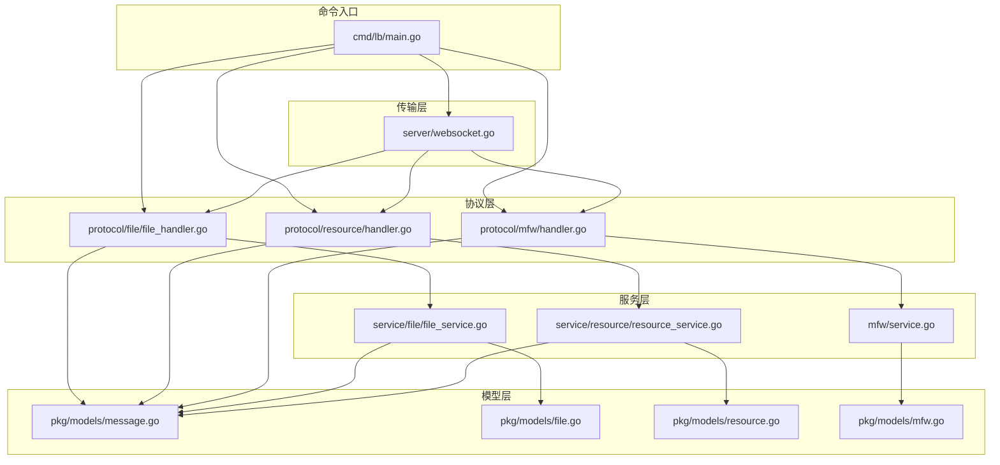
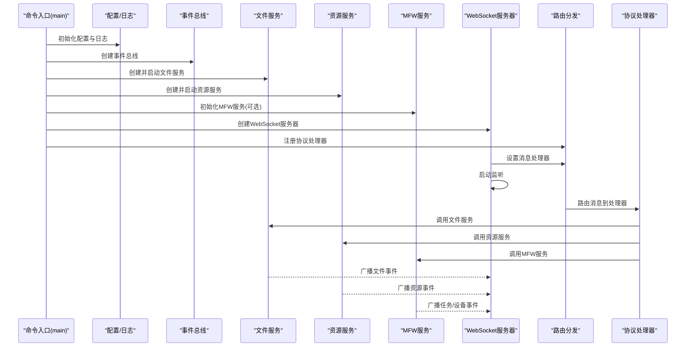
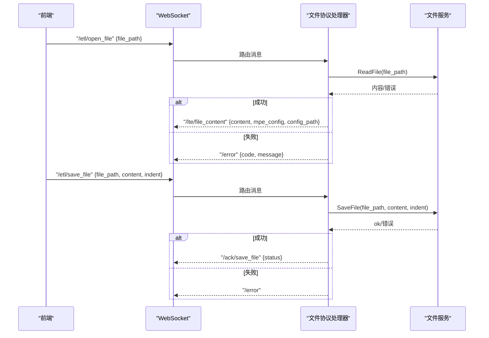
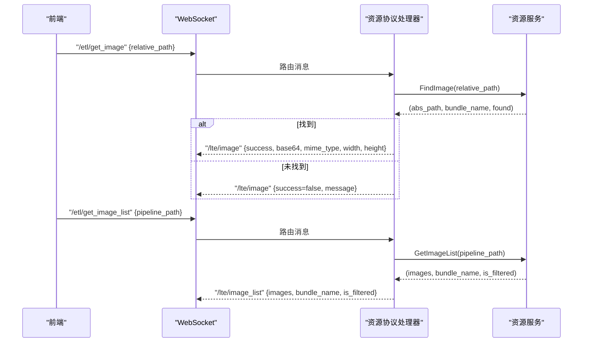
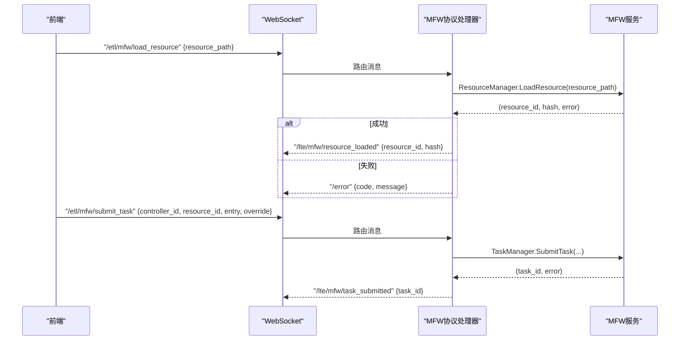
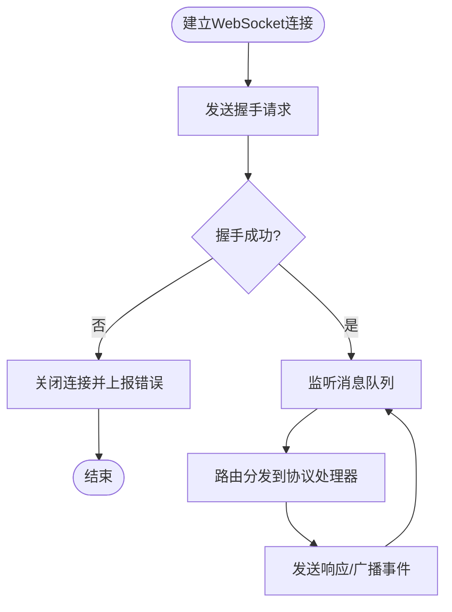
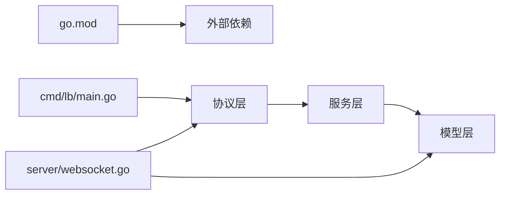

# 后端测试

<cite>
**本文引用的文件**
- [LocalBridge/cmd/lb/main.go](file://LocalBridge/cmd/lb/main.go)
- [LocalBridge/internal/mfw/service.go](file://LocalBridge/internal/mfw/service.go)
- [LocalBridge/internal/protocol/file/file_handler.go](file://LocalBridge/internal/protocol/file/file_handler.go)
- [LocalBridge/internal/protocol/resource/handler.go](file://LocalBridge/internal/protocol/resource/handler.go)
- [LocalBridge/internal/protocol/mfw/handler.go](file://LocalBridge/internal/protocol/mfw/handler.go)
- [LocalBridge/internal/server/websocket.go](file://LocalBridge/internal/server/websocket.go)
- [LocalBridge/internal/service/file/file_service.go](file://LocalBridge/internal/service/file/file_service.go)
- [LocalBridge/internal/service/resource/resource_service.go](file://LocalBridge/internal/service/resource/resource_service.go)
- [LocalBridge/pkg/models/message.go](file://LocalBridge/pkg/models/message.go)
- [LocalBridge/pkg/models/file.go](file://LocalBridge/pkg/models/file.go)
- [LocalBridge/pkg/models/resource.go](file://LocalBridge/pkg/models/resource.go)
- [LocalBridge/pkg/models/mfw.go](file://LocalBridge/pkg/models/mfw.go)
- [LocalBridge/go.mod](file://LocalBridge/go.mod)
- [LocalBridge/go.sum](file://LocalBridge/go.sum)
</cite>

## 目录
1. [简介](#简介)
2. [项目结构](#项目结构)
3. [核心组件](#核心组件)
4. [架构总览](#架构总览)
5. [详细组件分析](#详细组件分析)
6. [依赖分析](#依赖分析)
7. [性能考虑](#性能考虑)
8. [故障排查指南](#故障排查指南)
9. [结论](#结论)
10. [附录](#附录)

## 简介
本文件面向后端Go服务的测试策略制定，聚焦LocalBridge服务的测试实施，涵盖单元测试、集成测试与HTTP接口测试方法；重点覆盖文件管理、资源服务、MFW集成三大模块；解释测试JSON数据的组织与使用；提供WebSocket通信与错误处理测试方案，并补充数据库与缓存专项测试策略。

## 项目结构
LocalBridge作为独立Go模块，采用分层架构：
- 命令入口：负责参数解析、配置加载、服务初始化与路由注册
- 协议层：按功能划分文件、资源、MFW、调试、配置等协议处理器
- 服务层：文件服务、资源扫描服务、MFW服务
- 传输层：WebSocket服务器与消息模型
- 模型层：消息与业务数据结构定义

图表来源
- [LocalBridge/cmd/lb/main.go:182-440](file://LocalBridge/cmd/lb/main.go#L182-L440)
- [LocalBridge/internal/protocol/file/file_handler.go:14-64](file://LocalBridge/internal/protocol/file/file_handler.go#L14-L64)
- [LocalBridge/internal/protocol/resource/handler.go:22-69](file://LocalBridge/internal/protocol/resource/handler.go#L22-L69)
- [LocalBridge/internal/protocol/mfw/handler.go:11-26](file://LocalBridge/internal/protocol/mfw/handler.go#L11-L26)
- [LocalBridge/internal/server/websocket.go:35-93](file://LocalBridge/internal/server/websocket.go#L35-L93)
- [LocalBridge/internal/service/file/file_service.go:19-62](file://LocalBridge/internal/service/file/file_service.go#L19-L62)
- [LocalBridge/internal/service/resource/resource_service.go:14-31](file://LocalBridge/internal/service/resource/resource_service.go#L14-L31)
- [LocalBridge/internal/mfw/service.go:15-34](file://LocalBridge/internal/mfw/service.go#L15-L34)
- [LocalBridge/pkg/models/message.go:3-126](file://LocalBridge/pkg/models/message.go#L3-L126)
- [LocalBridge/pkg/models/file.go:3-29](file://LocalBridge/pkg/models/file.go#L3-L29)
- [LocalBridge/pkg/models/resource.go:3-67](file://LocalBridge/pkg/models/resource.go#L3-L67)
- [LocalBridge/pkg/models/mfw.go:3-244](file://LocalBridge/pkg/models/mfw.go#L3-L244)

章节来源
- [LocalBridge/cmd/lb/main.go:182-440](file://LocalBridge/cmd/lb/main.go#L182-L440)
- [LocalBridge/internal/server/websocket.go:35-93](file://LocalBridge/internal/server/websocket.go#L35-L93)

## 核心组件
- 命令入口与生命周期：负责初始化路径、配置、日志、事件总线、文件与资源扫描、MFW服务、WebSocket服务器与路由注册、信号处理与优雅退出
- 协议处理器：分别处理文件、资源、MFW相关消息，封装请求解析、业务调用与响应发送
- 服务层：文件服务负责扫描、监听、读写与安全校验；资源服务负责资源包识别、图片扫描与查找；MFW服务负责框架初始化、设备/控制器/任务/资源管理
- 传输层：WebSocket服务器负责连接管理、消息广播与握手路由
- 模型层：统一的消息结构与业务数据结构，便于测试中的构造与断言

章节来源
- [LocalBridge/cmd/lb/main.go:182-440](file://LocalBridge/cmd/lb/main.go#L182-L440)
- [LocalBridge/internal/protocol/file/file_handler.go:14-64](file://LocalBridge/internal/protocol/file/file_handler.go#L14-L64)
- [LocalBridge/internal/protocol/resource/handler.go:22-69](file://LocalBridge/internal/protocol/resource/handler.go#L22-L69)
- [LocalBridge/internal/protocol/mfw/handler.go:11-26](file://LocalBridge/internal/protocol/mfw/handler.go#L11-L26)
- [LocalBridge/internal/server/websocket.go:35-93](file://LocalBridge/internal/server/websocket.go#L35-L93)
- [LocalBridge/internal/service/file/file_service.go:19-62](file://LocalBridge/internal/service/file/file_service.go#L19-L62)
- [LocalBridge/internal/service/resource/resource_service.go:14-31](file://LocalBridge/internal/service/resource/resource_service.go#L14-L31)
- [LocalBridge/internal/mfw/service.go:15-34](file://LocalBridge/internal/mfw/service.go#L15-L34)
- [LocalBridge/pkg/models/message.go:3-126](file://LocalBridge/pkg/models/message.go#L3-L126)

## 架构总览
LocalBridge通过命令入口启动，初始化配置与日志，创建事件总线，启动文件与资源扫描，初始化MFW服务（可选），创建WebSocket服务器并注册协议处理器，最后进入消息路由循环。协议处理器根据消息路径分发到对应服务，服务层执行业务逻辑并通过事件总线或WebSocket向客户端推送结果。

图表来源
- [LocalBridge/cmd/lb/main.go:264-440](file://LocalBridge/cmd/lb/main.go#L264-L440)
- [LocalBridge/internal/server/websocket.go:65-93](file://LocalBridge/internal/server/websocket.go#L65-L93)
- [LocalBridge/internal/protocol/file/file_handler.go:48-64](file://LocalBridge/internal/protocol/file/file_handler.go#L48-L64)
- [LocalBridge/internal/protocol/resource/handler.go:55-69](file://LocalBridge/internal/protocol/resource/handler.go#L55-L69)
- [LocalBridge/internal/protocol/mfw/handler.go:28-117](file://LocalBridge/internal/protocol/mfw/handler.go#L28-L117)

## 详细组件分析

### 文件管理模块测试策略
- 单元测试
  - 文件服务：验证路径安全校验、读取/保存/创建文件、文件变化事件发布、索引更新与去重、缩进序列化、JSONC解析
  - 协议处理器：验证消息解析、错误包装、ACK确认、文件列表推送、文件变化通知
- 集成测试
  - 启动文件服务，模拟文件创建/修改/删除/重命名，验证事件总线与WebSocket广播
  - 验证与资源服务的协作（配置文件与Pipeline文件联动）
- HTTP接口测试
  - 通过WebSocket发送/接收文件协议消息，断言响应路径与数据结构
- 测试JSON数据组织
  - 使用仓库中的测试JSON目录作为基准数据，构造Open/Save/SaveSeparated/Create请求，断言返回内容与ACK
- 错误处理测试
  - 非法路径、越界根目录、文件不存在、权限不足、JSON解析失败、写入失败等

图表来源
- [LocalBridge/internal/protocol/file/file_handler.go:48-166](file://LocalBridge/internal/protocol/file/file_handler.go#L48-L166)
- [LocalBridge/internal/service/file/file_service.go:122-201](file://LocalBridge/internal/service/file/file_service.go#L122-L201)
- [LocalBridge/pkg/models/message.go:46-91](file://LocalBridge/pkg/models/message.go#L46-L91)

章节来源
- [LocalBridge/internal/protocol/file/file_handler.go:14-328](file://LocalBridge/internal/protocol/file/file_handler.go#L14-L328)
- [LocalBridge/internal/service/file/file_service.go:19-360](file://LocalBridge/internal/service/file/file_service.go#L19-L360)
- [LocalBridge/pkg/models/message.go:3-126](file://LocalBridge/pkg/models/message.go#L3-L126)

### 资源服务模块测试策略
- 单元测试
  - 资源服务：验证资源包识别、image目录扫描、图片查找、bundle列表、过滤逻辑
  - 协议处理器：验证图片获取、批量获取、图片列表、资源刷新
- 集成测试
  - 启动资源服务，扫描根目录，验证事件总线广播与WebSocket推送
  - 验证与文件服务的协作（根据pipeline路径定位资源包）
- HTTP接口测试
  - 通过WebSocket发送资源协议消息，断言图片Base64、MIME、尺寸与资源包列表
- 测试JSON数据组织
  - 使用仓库中的测试JSON目录作为Pipeline与配置数据源，结合资源包内的image目录进行图片检索
- 错误处理测试
  - 资源包不存在、图片未找到、读取失败、路径解析异常

图表来源
- [LocalBridge/internal/protocol/resource/handler.go:55-137](file://LocalBridge/internal/protocol/resource/handler.go#L55-L137)
- [LocalBridge/internal/service/resource/resource_service.go:175-272](file://LocalBridge/internal/service/resource/resource_service.go#L175-L272)
- [LocalBridge/pkg/models/resource.go:22-66](file://LocalBridge/pkg/models/resource.go#L22-L66)

章节来源
- [LocalBridge/internal/protocol/resource/handler.go:22-272](file://LocalBridge/internal/protocol/resource/handler.go#L22-L272)
- [LocalBridge/internal/service/resource/resource_service.go:14-359](file://LocalBridge/internal/service/resource/resource_service.go#L14-L359)
- [LocalBridge/pkg/models/resource.go:3-67](file://LocalBridge/pkg/models/resource.go#L3-L67)

### MFW集成模块测试策略
- 单元测试
  - MFW服务：验证初始化（含中文路径处理）、重载、关闭、设备/控制器/任务/资源管理器访问
  - 协议处理器：验证设备刷新、控制器创建/断开、截图、点击/滑动/输入、任务提交/查询/停止、资源加载
- 集成测试
  - 启动MFW服务，模拟设备枚举、控制器连接、任务提交与状态轮询、资源加载
- HTTP接口测试
  - 通过WebSocket发送MFW协议消息，断言响应路径与数据结构（设备列表、控制器状态、任务状态、截图结果、资源加载结果）
- 测试JSON数据组织
  - 使用仓库中的测试JSON作为pipeline与配置，结合资源包路径进行任务提交
- 错误处理测试
  - 未初始化、设备/控制器不存在、操作失败、任务不存在、资源加载失败

图表来源
- [LocalBridge/internal/protocol/mfw/handler.go:28-117](file://LocalBridge/internal/protocol/mfw/handler.go#L28-L117)
- [LocalBridge/internal/mfw/service.go:36-138](file://LocalBridge/internal/mfw/service.go#L36-L138)
- [LocalBridge/pkg/models/mfw.go:152-195](file://LocalBridge/pkg/models/mfw.go#L152-L195)

章节来源
- [LocalBridge/internal/protocol/mfw/handler.go:11-800](file://LocalBridge/internal/protocol/mfw/handler.go#L11-L800)
- [LocalBridge/internal/mfw/service.go:15-218](file://LocalBridge/internal/mfw/service.go#L15-L218)
- [LocalBridge/pkg/models/mfw.go:3-244](file://LocalBridge/pkg/models/mfw.go#L3-L244)

### WebSocket通信测试策略
- 连接与握手
  - 验证握手路由与版本协商，断言握手响应结构
- 消息收发
  - 构造各类协议消息，断言响应路径与数据结构
- 广播与事件
  - 验证文件/资源事件广播、历史日志推送、连接建立/关闭事件
- 并发与稳定性
  - 多连接并发、消息乱序、断线重连、超时处理

图表来源
- [LocalBridge/internal/server/websocket.go:15-31](file://LocalBridge/internal/server/websocket.go#L15-L31)
- [LocalBridge/internal/server/websocket.go:144-161](file://LocalBridge/internal/server/websocket.go#L144-L161)
- [LocalBridge/internal/server/websocket.go:163-179](file://LocalBridge/internal/server/websocket.go#L163-L179)

章节来源
- [LocalBridge/internal/server/websocket.go:35-179](file://LocalBridge/internal/server/websocket.go#L35-L179)

### 错误处理测试策略
- 统一错误模型
  - 使用错误数据结构，包含code、message、detail
- 协议处理器错误
  - 解析失败、业务错误、LBError包装、发送/error消息
- 服务层错误
  - 文件读写失败、路径越权、资源包/图片未找到、MFW初始化失败
- 日志与可观测性
  - 验证错误级别、模块、消息与时间戳推送至前端

章节来源
- [LocalBridge/internal/protocol/file/file_handler.go:302-328](file://LocalBridge/internal/protocol/file/file_handler.go#L302-L328)
- [LocalBridge/internal/protocol/resource/handler.go:247-272](file://LocalBridge/internal/protocol/resource/handler.go#L247-L272)
- [LocalBridge/internal/mfw/service.go:36-138](file://LocalBridge/internal/mfw/service.go#L36-L138)
- [LocalBridge/pkg/models/message.go:9-14](file://LocalBridge/pkg/models/message.go#L9-L14)

### 数据库与缓存专项测试策略
- 数据库测试
  - 若引入数据库，建议使用内存数据库或临时数据库文件，测试CRUD、事务、并发与一致性
- 缓存测试
  - 针对文件索引、资源包列表、最近写入文件记录等缓存结构，测试命中率、失效策略与并发一致性
- 本项目现状
  - 当前仓库未见数据库与缓存实现，测试策略以文件系统与内存结构为主

## 依赖分析
- 外部依赖
  - MaaFramework Go绑定、WebSocket库、配置与日志库、文件监控库等
- 内部依赖
  - 协议层依赖服务层；服务层依赖模型层；传输层依赖协议层与模型层
- 循环依赖
  - 通过接口与事件总线避免循环依赖

图表来源
- [LocalBridge/go.mod:5-16](file://LocalBridge/go.mod#L5-L16)
- [LocalBridge/cmd/lb/main.go:182-440](file://LocalBridge/cmd/lb/main.go#L182-L440)
- [LocalBridge/internal/server/websocket.go:35-93](file://LocalBridge/internal/server/websocket.go#L35-L93)

章节来源
- [LocalBridge/go.mod:1-38](file://LocalBridge/go.mod#L1-L38)
- [LocalBridge/go.sum:1-93](file://LocalBridge/go.sum#L1-L93)

## 性能考虑
- 文件扫描与监听
  - 限制最大深度与文件数量，避免大规模目录导致性能问题
  - 使用防抖机制减少频繁写入触发的事件风暴
- 资源扫描
  - 限制递归层级，跳过常见非资源目录，降低IO开销
- WebSocket
  - 合理设置缓冲区大小与超时，避免内存占用过高
- MFW服务
  - 初始化时处理中文路径，避免频繁切换工作目录带来的开销

## 故障排查指南
- 启动阶段
  - 路径安全检查失败、配置加载失败、日志初始化失败、端口占用
- 运行阶段
  - 文件服务：读写失败、路径越权、事件重复触发
  - 资源服务：资源包识别失败、图片查找失败、扫描异常
  - MFW服务：未初始化、设备/控制器/任务/资源操作失败
- 诊断手段
  - 查看历史日志推送、事件总线事件、错误码与详细信息

章节来源
- [LocalBridge/cmd/lb/main.go:222-298](file://LocalBridge/cmd/lb/main.go#L222-L298)
- [LocalBridge/internal/service/file/file_service.go:345-360](file://LocalBridge/internal/service/file/file_service.go#L345-L360)
- [LocalBridge/internal/service/resource/resource_service.go:48-68](file://LocalBridge/internal/service/resource/resource_service.go#L48-L68)
- [LocalBridge/internal/mfw/service.go:36-138](file://LocalBridge/internal/mfw/service.go#L36-L138)

## 结论
通过分层测试策略，LocalBridge可在单元、集成与HTTP接口层面全面覆盖文件管理、资源服务与MFW集成的核心功能。配合规范的测试JSON数据组织与完善的错误处理测试，可显著提升系统的可靠性与可维护性。WebSocket通信与事件总线的测试应贯穿全流程，确保消息路由与广播的正确性与稳定性。

## 附录
- 测试JSON数据组织建议
  - 使用仓库中的测试JSON目录作为Pipeline与配置数据源，结合资源包内的image目录进行图片检索与展示
- 测试用例清单（示例）
  - 文件管理：打开/保存/分离保存/创建文件、文件列表推送、文件变化通知
  - 资源服务：图片获取/批量获取/列表、资源包刷新、资源包列表推送
  - MFW集成：设备刷新、控制器创建/断开、截图、点击/滑动/输入、任务提交/查询/停止、资源加载
  - WebSocket：握手、消息收发、广播、事件推送、并发与断线重连
  - 错误处理：路径越权、文件不存在、JSON解析失败、MFW未初始化、操作失败