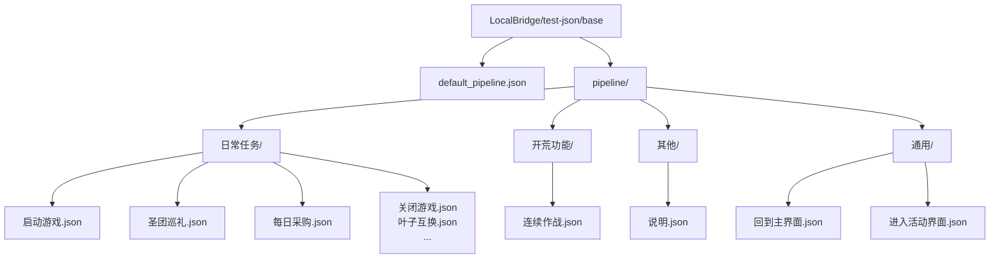
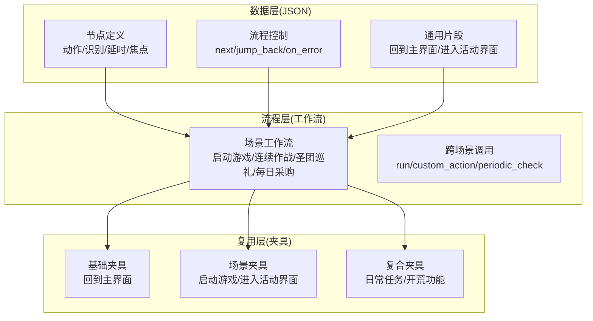
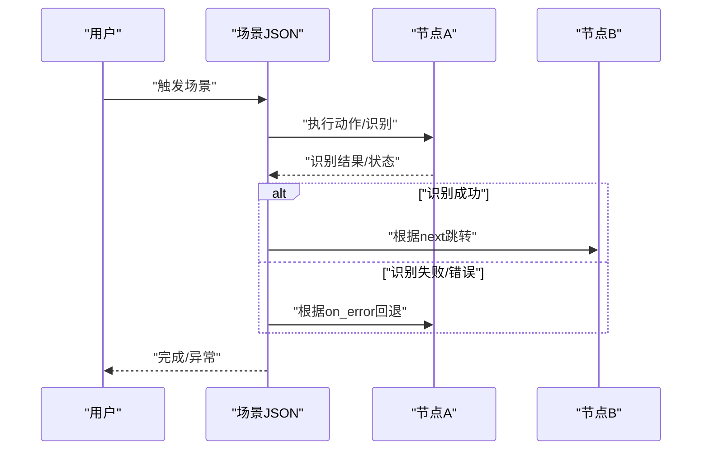
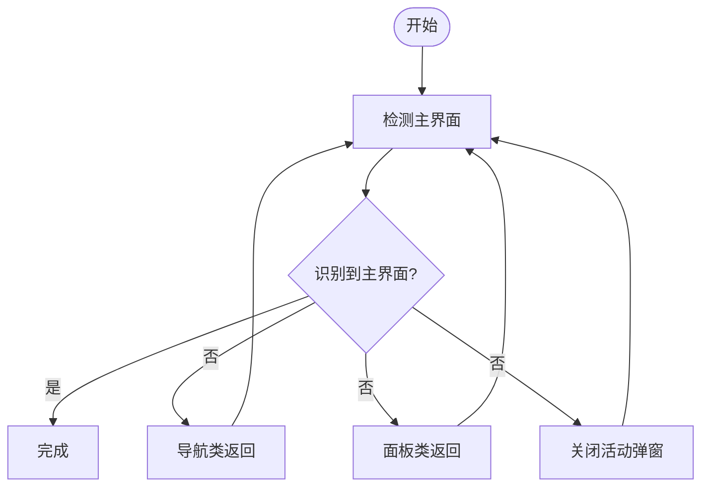
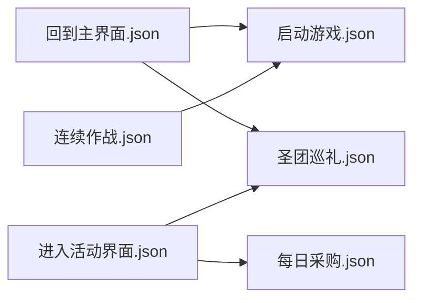

# 测试数据与Mock

<cite>
**本文引用的文件**
- [default_pipeline.json](file://LocalBridge/test-json/base/default_pipeline.json)
- [启动游戏.json](file://LocalBridge/test-json/base/pipeline/日常任务/启动游戏.json)
- [连续作战.json](file://LocalBridge/test-json/base/pipeline/开荒功能/连续作战.json)
- [圣团巡礼.json](file://LocalBridge/test-json/base/pipeline/日常任务/圣团巡礼.json)
- [每日采购.json](file://LocalBridge/test-json/base/pipeline/日常任务/每日采购.json)
- [回到主界面.json](file://LocalBridge/test-json/base/pipeline/通用/回到主界面.json)
- [进入活动界面.json](file://LocalBridge/test-json/base/pipeline/通用/进入活动界面.json)
- [说明.json](file://LocalBridge/test-json/base/pipeline/其他/说明.json)
- [test-json.gitignore](file://LocalBridge/test-json/.gitignore)
</cite>

## 目录
1. [引言](#引言)
2. [项目结构](#项目结构)
3. [核心组件](#核心组件)
4. [架构总览](#架构总览)
5. [详细组件分析](#详细组件分析)
6. [依赖关系分析](#依赖关系分析)
7. [性能考量](#性能考量)
8. [故障排查指南](#故障排查指南)
9. [结论](#结论)
10. [附录](#附录)

## 引言
本文件面向“测试数据与Mock”主题，围绕仓库中的测试JSON数据体系进行系统化梳理，目标是建立一套完整的测试数据管理体系，涵盖Mock数据的组织结构与命名规范、测试JSON数据的准备与维护方法、可复用测试数据集与测试夹具的设计、版本管理与更新策略，以及测试环境隔离与数据清理的最佳实践。本文所有内容均基于仓库中实际存在的测试JSON文件与配置进行归纳总结。

## 项目结构
测试数据主要位于 LocalBridge/test-json/base 目录下，采用按“功能域+场景”的层级组织方式，便于按业务场景检索与复用。整体结构如下图所示：

图表来源
- [default_pipeline.json](file://LocalBridge/test-json/base/default_pipeline.json)
- [启动游戏.json](file://LocalBridge/test-json/base/pipeline/日常任务/启动游戏.json)
- [连续作战.json](file://LocalBridge/test-json/base/pipeline/开荒功能/连续作战.json)
- [圣团巡礼.json](file://LocalBridge/test-json/base/pipeline/日常任务/圣团巡礼.json)
- [每日采购.json](file://LocalBridge/test-json/base/pipeline/日常任务/每日采购.json)
- [回到主界面.json](file://LocalBridge/test-json/base/pipeline/通用/回到主界面.json)
- [进入活动界面.json](file://LocalBridge/test-json/base/pipeline/通用/进入活动界面.json)
- [说明.json](file://LocalBridge/test-json/base/pipeline/其他/说明.json)

章节来源
- [default_pipeline.json](file://LocalBridge/test-json/base/default_pipeline.json)
- [test-json.gitignore](file://LocalBridge/test-json/.gitignore)

## 核心组件
- 默认管道配置：default_pipeline.json 提供默认超时与前置延迟等全局参数，作为各场景JSON的默认基线。
- 场景JSON：以“功能域/场景名.json”命名，描述节点、动作、识别、跳转与错误处理等，形成可执行的工作流片段。
- 通用片段：如“回到主界面.json”“进入活动界面.json”，用于跨场景复用的基础步骤集合。
- 其他说明：如“其他/说明.json”，用于补充说明或占位。

章节来源
- [default_pipeline.json](file://LocalBridge/test-json/base/default_pipeline.json)
- [回到主界面.json](file://LocalBridge/test-json/base/pipeline/通用/回到主界面.json)
- [进入活动界面.json](file://LocalBridge/test-json/base/pipeline/通用/进入活动界面.json)
- [说明.json](file://LocalBridge/test-json/base/pipeline/其他/说明.json)

## 架构总览
测试数据的“数据-流程-复用”架构如下：
- 数据层：以JSON为载体，定义节点、动作、识别、跳转、错误处理、焦点提示等。
- 流程层：通过节点间的 next/jump_back/on_error 等控制流，串联成完整工作流。
- 复用层：通用片段（如回到主界面）与场景片段（如启动游戏）组合，形成可复用的测试夹具。

图表来源
- [启动游戏.json](file://LocalBridge/test-json/base/pipeline/日常任务/启动游戏.json)
- [连续作战.json](file://LocalBridge/test-json/base/pipeline/开荒功能/连续作战.json)
- [圣团巡礼.json](file://LocalBridge/test-json/base/pipeline/日常任务/圣团巡礼.json)
- [每日采购.json](file://LocalBridge/test-json/base/pipeline/日常任务/每日采购.json)
- [回到主界面.json](file://LocalBridge/test-json/base/pipeline/通用/回到主界面.json)
- [进入活动界面.json](file://LocalBridge/test-json/base/pipeline/通用/进入活动界面.json)

## 详细组件分析

### 组件A：默认管道配置（default_pipeline.json）
- 作用：提供全局默认参数（如超时、前置延迟），作为场景JSON的默认基线。
- 使用建议：在新增场景JSON时，优先继承该默认值，避免重复声明；仅在特定场景需要覆盖时才显式设置。

章节来源
- [default_pipeline.json](file://LocalBridge/test-json/base/default_pipeline.json)

### 组件B：场景JSON（以“启动游戏.json”为例）
- 节点命名规范：统一使用“场景名_步骤名”的形式，例如“启动游戏_启动游戏”“启动游戏_识别主界面”等，清晰表达步骤意图。
- 动作与识别：每个节点包含动作类型、参数、识别类型与ROI/模板/期望文本等识别参数。
- 控制流：通过 next/jump_back/on_error 实现分支与回退，提升容错性。
- 焦点提示：focus 字段用于标注关键状态提示，便于调试与可视化。
- 自定义扩展：支持自定义动作（如 custom_action）与稳定识别（如 custom_recognition）。

图表来源
- [启动游戏.json](file://LocalBridge/test-json/base/pipeline/日常任务/启动游戏.json)

章节来源
- [启动游戏.json](file://LocalBridge/test-json/base/pipeline/日常任务/启动游戏.json)

### 组件C：通用片段（以“回到主界面.json”为例）
- 设计原则：通用片段应聚焦单一能力（如返回主界面），通过多种识别路径（导航类/面板类/活动弹窗）实现高鲁棒性。
- 复用策略：通过 next/jump_back 组合，与其他场景JSON拼接，形成稳定的前置/后置步骤。

图表来源
- [回到主界面.json](file://LocalBridge/test-json/base/pipeline/通用/回到主界面.json)

章节来源
- [回到主界面.json](file://LocalBridge/test-json/base/pipeline/通用/回到主界面.json)

### 组件D：复杂场景（以“圣团巡礼.json”为例）
- 特点：包含多角色/多周期/多状态的复杂流程，体现“周期检查/记录/提醒”机制。
- 命名与结构：节点命名延续“场景名_功能/状态”的规范，便于阅读与维护。
- 自定义动作：通过 custom_action 实现周期检查、记录与运行调度，增强可扩展性。

章节来源
- [圣团巡礼.json](file://LocalBridge/test-json/base/pipeline/日常任务/圣团巡礼.json)

### 组件E：场景（以“每日采购.json”为例）
- 特点：包含多个商店与商品的购买流程，强调“周期检查/提醒/进入商店/购买/返回”的闭环。
- 结构：通过 next/jump_back/on_error 组织复杂的分支逻辑，确保在异常情况下能回到正确位置。

章节来源
- [每日采购.json](file://LocalBridge/test-json/base/pipeline/日常任务/每日采购.json)

### 组件F：场景（以“连续作战.json”为例）
- 特点：以“选择卡组/出发/下一关/失败”为主线，展示典型的“挑战-重试”流程。
- 参数：包含 rate_limit、timeout 等参数，体现对稳定性与性能的考虑。

章节来源
- [连续作战.json](file://LocalBridge/test-json/base/pipeline/开荒功能/连续作战.json)

### 组件G：场景（以“进入活动界面.json”为例）
- 特点：通过滑动与计数器实现“查找指定活动”的自动化，体现“初始化计数/计数/检查/确认”的流程闭环。
- 自定义识别：通过 custom_recognition_param 传递参数，实现灵活的识别策略。

章节来源
- [进入活动界面.json](file://LocalBridge/test-json/base/pipeline/通用/进入活动界面.json)

## 依赖关系分析
- 文件内依赖：场景JSON内部通过节点名引用（next/jump_back），形成强内聚的流程依赖。
- 跨文件依赖：通用片段（如回到主界面）被多个场景JSON引用，形成松耦合的复用依赖。
- 外部依赖：部分JSON包含外部资源路径与版本信息，需注意同步与迁移。

图表来源
- [回到主界面.json](file://LocalBridge/test-json/base/pipeline/通用/回到主界面.json)
- [进入活动界面.json](file://LocalBridge/test-json/base/pipeline/通用/进入活动界面.json)
- [启动游戏.json](file://LocalBridge/test-json/base/pipeline/日常任务/启动游戏.json)
- [圣团巡礼.json](file://LocalBridge/test-json/base/pipeline/日常任务/圣团巡礼.json)
- [每日采购.json](file://LocalBridge/test-json/base/pipeline/日常任务/每日采购.json)
- [连续作战.json](file://LocalBridge/test-json/base/pipeline/开荒功能/连续作战.json)

## 性能考量
- 识别稳定性：通过稳定识别（如 custom_recognition="stable_reco"）与多模板/多ROI策略，降低误判率。
- 延时与限速：合理设置 pre_delay/post_delay/rate_limit/timeout，平衡速度与稳定性。
- 复用与解耦：通用片段减少重复识别与动作，提高整体执行效率。
- 资源路径：注意外部资源路径变更对识别的影响，必要时进行同步更新。

## 故障排查指南
- 识别失败：检查 ROI/模板/期望文本是否匹配当前分辨率与资源；必要时增加稳定识别策略。
- 流程中断：利用 jump_back 与 on_error 回退到安全节点，确保后续流程可继续。
- 资源缺失：核对资源路径与版本号，确保资源存在且与JSON一致。
- 环境差异：不同分辨率/缩放可能影响坐标与识别，建议在多环境下验证。

章节来源
- [启动游戏.json](file://LocalBridge/test-json/base/pipeline/日常任务/启动游戏.json)
- [回到主界面.json](file://LocalBridge/test-json/base/pipeline/通用/回到主界面.json)
- [进入活动界面.json](file://LocalBridge/test-json/base/pipeline/通用/进入活动界面.json)

## 结论
本仓库的测试JSON数据体系以“场景-节点-动作-识别-控制流”为核心，结合通用片段实现了高复用与强可维护性。通过统一的命名规范、清晰的流程控制与合理的参数设计，能够支撑多样化的测试场景。建议在此基础上进一步完善版本管理与环境隔离策略，持续提升测试数据的稳定性与可扩展性。

## 附录

### A. Mock数据组织结构与命名规范
- 组织结构
  - base/default_pipeline.json：默认管道参数
  - base/pipeline/通用/*.json：通用片段（可跨场景复用）
  - base/pipeline/日常任务/*.json：日常任务场景
  - base/pipeline/开荒功能/*.json：开荒功能场景
  - base/pipeline/其他/*.json：说明/占位等
- 命名规范
  - 节点命名：场景名_步骤名（如“启动游戏_启动游戏”）
  - 场景命名：场景名.json（如“启动游戏.json”“回到主界面.json”）

章节来源
- [default_pipeline.json](file://LocalBridge/test-json/base/default_pipeline.json)
- [启动游戏.json](file://LocalBridge/test-json/base/pipeline/日常任务/启动游戏.json)
- [回到主界面.json](file://LocalBridge/test-json/base/pipeline/通用/回到主界面.json)
- [进入活动界面.json](file://LocalBridge/test-json/base/pipeline/通用/进入活动界面.json)
- [连续作战.json](file://LocalBridge/test-json/base/pipeline/开荒功能/连续作战.json)
- [圣团巡礼.json](file://LocalBridge/test-json/base/pipeline/日常任务/圣团巡礼.json)
- [每日采购.json](file://LocalBridge/test-json/base/pipeline/日常任务/每日采购.json)
- [说明.json](file://LocalBridge/test-json/base/pipeline/其他/说明.json)

### B. 测试JSON数据准备与维护方法
- 准备步骤
  - 明确场景目标与节点边界，拆分为原子动作与识别步骤
  - 定义节点动作（类型/参数）、识别（类型/ROI/模板/期望文本）
  - 设计控制流（next/jump_back/on_error），确保异常可恢复
  - 添加焦点提示（focus），便于调试与可视化
  - 如需扩展，使用自定义动作/识别（custom_action/custom_recognition）
- 维护要点
  - 保持命名一致性与语义清晰
  - 在通用片段中收敛重复逻辑
  - 对关键节点增加稳定识别与容错分支
  - 定期校验资源路径与版本号

章节来源
- [启动游戏.json](file://LocalBridge/test-json/base/pipeline/日常任务/启动游戏.json)
- [回到主界面.json](file://LocalBridge/test-json/base/pipeline/通用/回到主界面.json)
- [进入活动界面.json](file://LocalBridge/test-json/base/pipeline/通用/进入活动界面.json)
- [连续作战.json](file://LocalBridge/test-json/base/pipeline/开荒功能/连续作战.json)
- [圣团巡礼.json](file://LocalBridge/test-json/base/pipeline/日常任务/圣团巡礼.json)
- [每日采购.json](file://LocalBridge/test-json/base/pipeline/日常任务/每日采购.json)

### C. 可复用测试数据集与测试夹具
- 通用夹具
  - 回到主界面：导航类/面板类/活动弹窗三路返回，适配多场景
  - 进入活动界面：滑动/计数/检查/确认的闭环，支持周期查找
- 场景夹具
  - 启动游戏：公告/面板/开始/识别主界面/连续识别等步骤
  - 圣团巡礼：周期检查/记录/提醒/房间打扫/世界树收获等
  - 每日采购：尊享商店/日常商店/普通商店/购买/返回等
  - 连续作战：选择卡组/出发/下一关/失败等

章节来源
- [回到主界面.json](file://LocalBridge/test-json/base/pipeline/通用/回到主界面.json)
- [进入活动界面.json](file://LocalBridge/test-json/base/pipeline/通用/进入活动界面.json)
- [启动游戏.json](file://LocalBridge/test-json/base/pipeline/日常任务/启动游戏.json)
- [圣团巡礼.json](file://LocalBridge/test-json/base/pipeline/日常任务/圣团巡礼.json)
- [每日采购.json](file://LocalBridge/test-json/base/pipeline/日常任务/每日采购.json)
- [连续作战.json](file://LocalBridge/test-json/base/pipeline/开荒功能/连续作战.json)

### D. 测试数据版本管理与更新策略
- 版本标识
  - JSON中包含版本号与资源路径，便于追踪与迁移
- 更新策略
  - 小步快跑：小范围修改后快速回归验证
  - 向后兼容：尽量不破坏既有节点名与动作语义
  - 同步更新：资源路径变更时同步更新JSON
  - 回滚预案：保留历史版本，异常时快速回退

章节来源
- [启动游戏.json](file://LocalBridge/test-json/base/pipeline/日常任务/启动游戏.json)
- [圣团巡礼.json](file://LocalBridge/test-json/base/pipeline/日常任务/圣团巡礼.json)
- [每日采购.json](file://LocalBridge/test-json/base/pipeline/日常任务/每日采购.json)

### E. 测试环境隔离与数据清理最佳实践
- 环境隔离
  - 不同场景使用独立的JSON，避免相互污染
  - 通用片段集中管理，跨场景共享
- 数据清理
  - 通过“回到主界面”等通用片段，确保每次测试后回到稳定状态
  - 在流程末尾添加“结束”节点，统一收尾
- Git管理
  - test-json目录采用“全忽略+白名单”策略，避免无关文件入库
  - 仅提交必要的JSON与说明文件，减少仓库体积

章节来源
- [test-json.gitignore](file://LocalBridge/test-json/.gitignore)
- [回到主界面.json](file://LocalBridge/test-json/base/pipeline/通用/回到主界面.json)
- [启动游戏.json](file://LocalBridge/test-json/base/pipeline/日常任务/启动游戏.json)