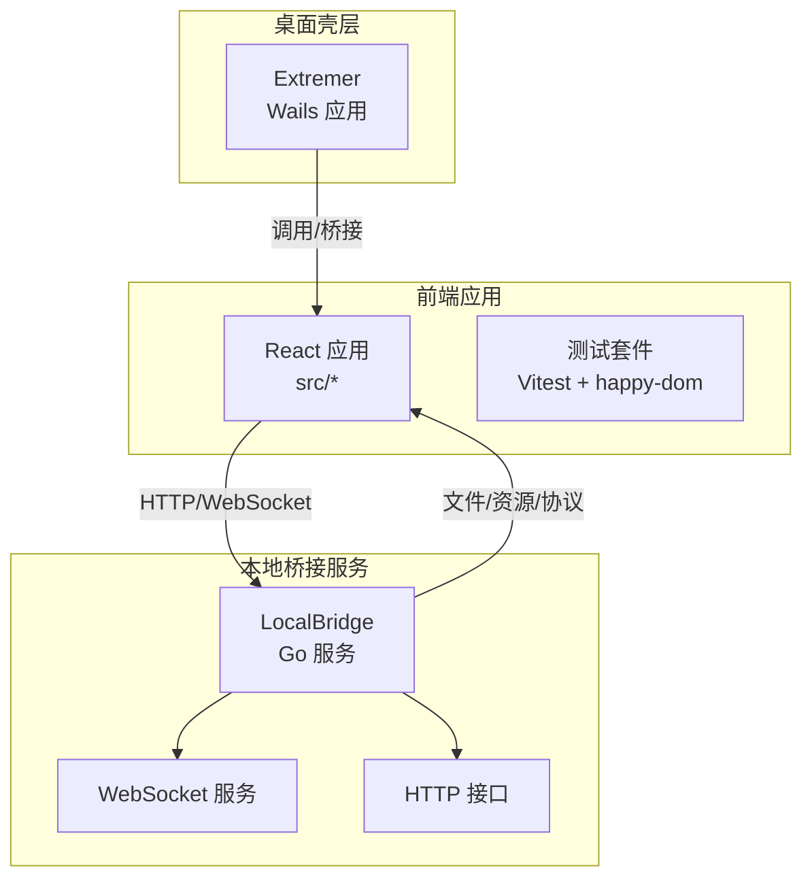
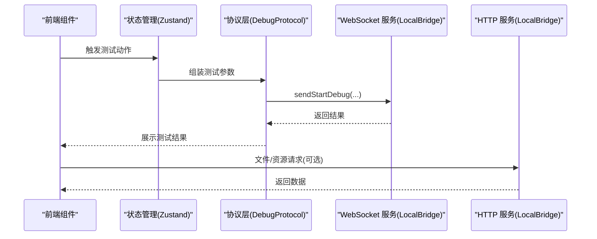
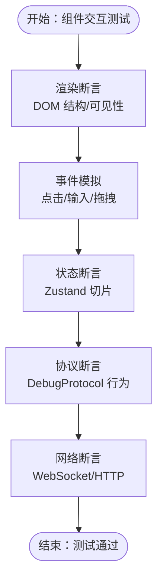
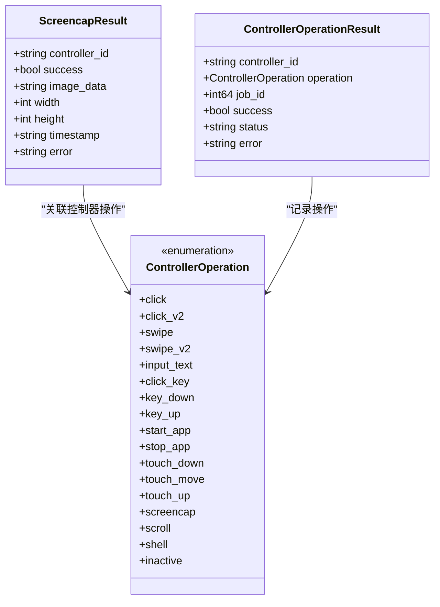
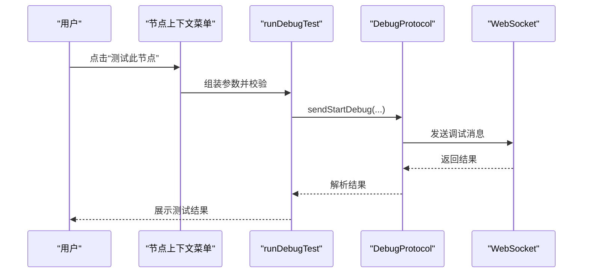
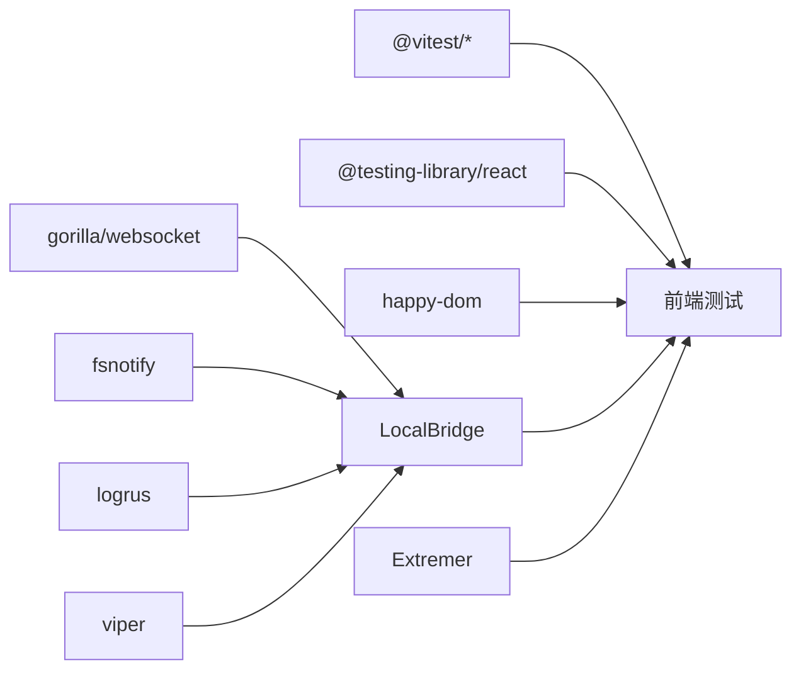

# 测试策略

<cite>
**本文引用的文件**
- [package.json](file://package.json)
- [vite.config.ts](file://vite.config.ts)
- [src/utils/jsonHelper.ts](file://src/utils/jsonHelper.ts)
- [src/components/flow/nodes/nodeContextMenu.tsx](file://src/components/flow/nodes/nodeContextMenu.tsx)
- [src/services/protocols/DebugProtocol.ts](file://src/services/protocols/DebugProtocol.ts)
- [LocalBridge/go.mod](file://LocalBridge/go.mod)
- [Extremer/go.mod](file://Extremer/go.mod)
- [LocalBridge/test-json/base/default_pipeline.json](file://LocalBridge/test-json/base/default_pipeline.json)
- [LocalBridge/internal/mfw/types.go](file://LocalBridge/internal/mfw/types.go)
</cite>

## 目录
1. [引言](#引言)
2. [项目结构](#项目结构)
3. [核心组件](#核心组件)
4. [架构总览](#架构总览)
5. [详细组件分析](#详细组件分析)
6. [依赖分析](#依赖分析)
7. [性能考虑](#性能考虑)
8. [故障排查指南](#故障排查指南)
9. [结论](#结论)
10. [附录](#附录)

## 引言
本测试策略文档面向前端 React 应用与后端 Go 服务的全栈测试，目标是建立覆盖单元测试、集成测试与端到端测试的分层策略，明确组件渲染、用户交互、状态管理、HTTP 接口、WebSocket 通信等关键测试场景，并提供 Mock 数据准备与使用方法、测试覆盖率要求以及在持续集成中执行测试的建议。同时涵盖性能测试、安全测试与兼容性测试的专项策略。

## 项目结构
本仓库包含三部分：
- 前端编辑器应用（React + TypeScript），位于 src 目录，使用 Vite 作为构建工具与 Vitest 作为测试框架。
- 本地桥接服务（LocalBridge）：Go 实现的本地服务，提供文件扫描、资源管理、MFW 协议处理、WebSocket 通信等能力。
- Extremer：基于 Wails 的桌面应用壳层，负责与本地服务交互并提供 UI。

**图表来源**
- [vite.config.ts:22-38](file://vite.config.ts#L22-L38)
- [LocalBridge/go.mod:1-38](file://LocalBridge/go.mod#L1-L38)
- [Extremer/go.mod:1-39](file://Extremer/go.mod#L1-L39)

**章节来源**
- [vite.config.ts:1-41](file://vite.config.ts#L1-L41)
- [package.json:1-65](file://package.json#L1-L65)
- [LocalBridge/go.mod:1-38](file://LocalBridge/go.mod#L1-L38)
- [Extremer/go.mod:1-39](file://Extremer/go.mod#L1-L39)

## 核心组件
- 前端测试框架与环境
  - 使用 Vitest 作为测试运行器，happy-dom 作为 DOM 环境，全局启用测试工具集，支持快照、覆盖率与多报告器。
  - 覆盖率配置排除 node_modules、tests、类型声明、配置文件与 dist 目录。
- 本地服务（LocalBridge）
  - 提供文件扫描、资源管理、MFW 协议处理、WebSocket 通信与 HTTP 接口。
  - 使用 gorilla/websocket、fsnotify、logrus、viper 等依赖。
- Extremer
  - 基于 Wails 的桌面应用壳层，负责与本地服务交互并提供 UI。

**章节来源**
- [vite.config.ts:22-38](file://vite.config.ts#L22-L38)
- [LocalBridge/go.mod:5-16](file://LocalBridge/go.mod#L5-L16)
- [Extremer/go.mod:5-8](file://Extremer/go.mod#L5-L8)

## 架构总览
前端通过 HTTP 与 WebSocket 与 LocalBridge 交互；Extremer 作为桌面壳层承载前端应用并与本地服务协同工作。测试策略围绕三层展开：前端单元/集成/端到端测试、后端接口与协议测试、以及跨层集成测试。

**图表来源**
- [src/components/flow/nodes/nodeContextMenu.tsx:187-243](file://src/components/flow/nodes/nodeContextMenu.tsx#L187-L243)
- [src/services/protocols/DebugProtocol.ts:827-889](file://src/services/protocols/DebugProtocol.ts#L827-L889)

## 详细组件分析

### 前端组件测试策略
- 组件渲染测试
  - 使用 @testing-library/react 与 happy-dom 环境，断言组件挂载、DOM 结构与可见性。
  - 对于 Flow 画布、节点列表、工具栏等关键区域进行快照与交互测试。
- 用户交互测试
  - 模拟点击、拖拽、输入等事件，验证节点上下文菜单、工具面板、字段面板的行为。
  - 使用屏幕读屏与无障碍断言确保可访问性。
- 状态管理测试
  - 针对 Zustand store（如 flow、debug、mfw、wsStore）编写单元测试，覆盖切片逻辑与派生状态。
  - 使用测试替身隔离外部依赖（如 WebSocket、HTTP）。
- 协议与网络测试
  - 对 DebugProtocol 的消息组装、结果展示逻辑进行单元测试。
  - 使用 Vitest 的 mock 功能模拟 WebSocket 发送与响应，验证错误分支与边界条件。
- JSON 辅助工具测试
  - 对 JsonHelper 的对象判断、字符串解析与序列化进行单元测试，覆盖异常输入与边界情况。

**图表来源**
- [src/components/flow/nodes/nodeContextMenu.tsx:187-275](file://src/components/flow/nodes/nodeContextMenu.tsx#L187-L275)
- [src/services/protocols/DebugProtocol.ts:827-889](file://src/services/protocols/DebugProtocol.ts#L827-L889)
- [src/utils/jsonHelper.ts:1-28](file://src/utils/jsonHelper.ts#L1-L28)

**章节来源**
- [vite.config.ts:22-38](file://vite.config.ts#L22-L38)
- [src/utils/jsonHelper.ts:1-28](file://src/utils/jsonHelper.ts#L1-L28)
- [src/components/flow/nodes/nodeContextMenu.tsx:187-275](file://src/components/flow/nodes/nodeContextMenu.tsx#L187-L275)
- [src/services/protocols/DebugProtocol.ts:827-889](file://src/services/protocols/DebugProtocol.ts#L827-L889)

### 后端 Go 服务测试策略
- 单元测试
  - 对核心模块（如文件服务、资源服务、MFW 类型定义）编写单元测试，覆盖业务逻辑与错误处理。
  - 使用 go test 与标准 testing 包，必要时使用 testify 或自定义断言库。
- HTTP 接口测试
  - 使用 net/http/httptest 与真实路由注册，验证请求/响应、状态码、头部与 JSON 负载。
  - 针对文件上传、资源扫描、配置变更等接口进行集成测试。
- WebSocket 通信测试
  - 使用 gorilla/websocket 客户端模拟连接、发送与接收消息，验证握手、心跳、错误回退与断线重连。
  - 针对控制器操作类型与结果结构体进行契约测试。
- Mock 数据准备与使用
  - 在 LocalBridge/test-json 下准备默认管道与基础资源，用于接口与协议测试。
  - 使用 viper 加载测试配置，确保测试环境与生产隔离。

**图表来源**
- [LocalBridge/internal/mfw/types.go:81-123](file://LocalBridge/internal/mfw/types.go#L81-L123)

**章节来源**
- [LocalBridge/go.mod:5-16](file://LocalBridge/go.mod#L5-L16)
- [LocalBridge/test-json/base/default_pipeline.json](file://LocalBridge/test-json/base/default_pipeline.json)
- [LocalBridge/internal/mfw/types.go:81-123](file://LocalBridge/internal/mfw/types.go#L81-L123)

### 端到端测试策略
- 端到端场景
  - 从打开应用到完成一次“测试节点/测试识别”的完整链路，验证 UI、状态、协议与 WebSocket 的协同。
- 测试步骤
  - 启动 LocalBridge 与前端（或 Extremer），准备测试资源与控制器连接。
  - 执行节点上下文菜单中的测试命令，观察调试协议返回的结果与 UI 反馈。
- 覆盖范围
  - 包含错误场景（未连接、无控制器、资源路径为空）与成功场景（识别命中、动作执行）。

**图表来源**
- [src/components/flow/nodes/nodeContextMenu.tsx:187-275](file://src/components/flow/nodes/nodeContextMenu.tsx#L187-L275)
- [src/services/protocols/DebugProtocol.ts:827-889](file://src/services/protocols/DebugProtocol.ts#L827-L889)

**章节来源**
- [src/components/flow/nodes/nodeContextMenu.tsx:187-275](file://src/components/flow/nodes/nodeContextMenu.tsx#L187-L275)
- [src/services/protocols/DebugProtocol.ts:827-889](file://src/services/protocols/DebugProtocol.ts#L827-L889)

## 依赖分析
- 前端测试依赖
  - @testing-library/react、@testing-library/jest-dom、happy-dom、vitest、@vitest/coverage-v8。
- 后端依赖
  - gorilla/websocket、fsnotify、logrus、viper、google/uuid、tailscale/hujson 等。
- 项目间耦合
  - 前端通过 HTTP/WebSocket 与 LocalBridge 交互；Extremer 作为壳层承载前端并与本地服务协同。

**图表来源**
- [package.json:41-62](file://package.json#L41-L62)
- [LocalBridge/go.mod:5-16](file://LocalBridge/go.mod#L5-L16)
- [Extremer/go.mod:5-8](file://Extremer/go.mod#L5-L8)

**章节来源**
- [package.json:41-62](file://package.json#L41-L62)
- [LocalBridge/go.mod:5-16](file://LocalBridge/go.mod#L5-L16)
- [Extremer/go.mod:5-8](file://Extremer/go.mod#L5-L8)

## 性能考虑
- 前端性能测试
  - 使用 Vitest 的计时与基准测试能力评估关键组件渲染与交互延迟。
  - 对大画布场景（大量节点/边）进行滚动、缩放与布局计算的性能回归测试。
- 后端性能测试
  - 针对文件扫描、资源加载、WebSocket 并发连接进行压力测试，监控 CPU、内存与吞吐。
- 覆盖率与性能平衡
  - 将性能测试纳入 CI，设置阈值（如 P95 延迟、内存峰值）触发告警。

## 故障排查指南
- 常见问题
  - 未连接 LocalBridge：前端提示“请先连接 LocalBridge”，需检查服务启动与网络可达性。
  - 无控制器：提示“请先连接控制器”，需确认设备连接与权限。
  - 资源路径为空：提示“请先配置资源路径”，需在调试面板中添加有效路径。
- 错误处理
  - WebSocket 发送失败时，前端应停止调试状态并提示错误。
  - 协议层对识别命中、动作执行与节点整体进行分类统计与延迟测量。
- 调试建议
  - 启用 LocalBridge 日志级别，捕获协议消息与错误堆栈。
  - 使用浏览器开发者工具与网络面板检查 WebSocket 握手与消息往返。

**章节来源**
- [src/components/flow/nodes/nodeContextMenu.tsx:197-242](file://src/components/flow/nodes/nodeContextMenu.tsx#L197-L242)
- [src/services/protocols/DebugProtocol.ts:869-889](file://src/services/protocols/DebugProtocol.ts#L869-L889)

## 结论
本测试策略以分层方式覆盖前端与后端的关键行为，结合单元、集成与端到端测试，确保组件渲染、用户交互、状态管理、HTTP 接口与 WebSocket 通信的稳定性。配合 Mock 数据与覆盖率指标，在 CI 中自动化执行，保障质量与交付效率。

## 附录

### 测试覆盖率与 CI 执行建议
- 前端覆盖率
  - 报告器：text、json、html、lcov；排除 node_modules、tests、类型声明、配置文件与 dist。
  - 建议阈值：语句/分支/函数/行 ≥ 80%，关键路径 ≥ 90%。
- 后端覆盖率
  - 使用 go test 与 coverprofile 输出覆盖率报告，结合 CI 工具生成趋势图。
  - 建议阈值：函数/行 ≥ 80%，关键路径 ≥ 90%。
- CI 执行顺序
  - 依赖安装 → Lint → 前端单元测试与覆盖率 → 后端单元测试与覆盖率 → 端到端测试 → 文档与产物发布。

**章节来源**
- [vite.config.ts:26-37](file://vite.config.ts#L26-L37)
- [package.json:41-62](file://package.json#L41-L62)

### Mock 数据准备与使用
- 前端
  - 在 tests/mocks 下准备组件与协议的最小化数据，使用 Vitest 的 mock 功能替换 fetch/axios 与 WebSocket。
- 后端
  - 使用 LocalBridge/test-json 下的基础资源与默认管道，结合 viper 在测试环境中加载配置。
  - 对文件扫描与资源管理模块，使用临时目录与只读文件进行隔离测试。

**章节来源**
- [LocalBridge/test-json/base/default_pipeline.json](file://LocalBridge/test-json/base/default_pipeline.json)
- [LocalBridge/go.mod:5-16](file://LocalBridge/go.mod#L5-L16)