# 测试自动化

<cite>
**本文引用的文件**
- [package.json](file://package.json)
- [vite.config.ts](file://vite.config.ts)
- [eslint.config.js](file://eslint.config.js)
- [.github/workflows/release.yaml](file://.github/workflows/release.yaml)
- [Extremer/go.mod](file://Extremer/go.mod)
- [LocalBridge/go.mod](file://LocalBridge/go.mod)
- [src/utils/__tests__/](file://src/utils/__tests__/)
- [tests/mocks/](file://tests/mocks/)
- [tests/utils/](file://tests/utils/)
- [src/utils/index.ts](file://src/utils/index.ts)
- [src/services/server.ts](file://src/services/server.ts)
- [src/stores/flow/index.ts](file://src/stores/flow/index.ts)
- [src/components/panels/main/DebugPanel.tsx](file://src/components/panels/main/DebugPanel.tsx)
- [src/components/panels/main/LoggerPanel.tsx](file://src/components/panels/main/LoggerPanel.tsx)
- [src/components/panels/main/ErrorPanel.tsx](file://src/components/panels/main/ErrorPanel.tsx)
- [src/components/panels/main/RecognitionPanel.tsx](file://src/components/panels/main/RecognitionPanel.tsx)
- [src/components/panels/main/FieldPanel.tsx](file://src/components/panels/main/FieldPanel.tsx)
- [src/components/panels/main/ConnectionPanel.tsx](file://src/components/panels/main/ConnectionPanel.tsx)
- [src/components/panels/main/EdgePanel.tsx](file://src/components/panels/main/EdgePanel.tsx)
- [src/components/panels/main/NodeAddPanel.tsx](file://src/components/panels/main/NodeAddPanel.tsx)
- [src/components/panels/main/ToolbarPanel.tsx](file://src/components/panels/main/ToolbarPanel.tsx)
- [src/components/panels/main/ExportButton.tsx](file://src/components/panels/main/ExportButton.tsx)
- [src/components/panels/main/ImportButton.tsx](file://src/components/panels/main/ImportButton.tsx)
- [src/components/panels/main/JsonPreviewButton.tsx](file://src/components/panels/main/JsonPreviewButton.tsx)
- [src/components/panels/main/SearchPanel.tsx](file://src/components/panels/main/SearchPanel.tsx)
- [src/components/panels/main/LayoutPanel.tsx](file://src/components/panels/main/LayoutPanel.tsx)
- [src/components/panels/main/ToolboxPanel.tsx](file://src/components/panels/main/ToolboxPanel.tsx)
- [src/components/panels/main/GlobalPanel.tsx](file://src/components/panels/main/GlobalPanel.tsx)
- [src/components/panels/main/LocalFileListPanel.tsx](file://src/components/panels/main/LocalFileListPanel.tsx)
- [src/components/panels/main/LiveScreenPanel.tsx](file://src/components/panels/main/LiveScreenPanel.tsx)
- [src/components/panels/main/AdjunctInfoPanel.tsx](file://src/components/panels/main/AdjunctInfoPanel.tsx)
- [src/components/panels/main/AIHistoryPanel.tsx](file://src/components/panels/main/AIHistoryPanel.tsx)
- [src/components/panels/main/RecognitionHistoryPanel.tsx](file://src/components/panels/main/RecognitionHistoryPanel.tsx)
- [src/components/panels/main/NodeRecognitionCardList.tsx](file://src/components/panels/main/NodeRecognitionCardList.tsx)
- [src/components/panels/main/RecognitionDetailModal.tsx](file://src/components/panels/main/RecognitionDetailModal.tsx)
- [src/components/panels/main/RecognitionListTab.tsx](file://src/components/panels/main/RecognitionListTab.tsx)
- [src/components/panels/main/DebugInfoTab.tsx](file://src/components/panels/main/DebugInfoTab.tsx)
- [src/components/panels/main/NodeAddPanel.tsx](file://src/components/panels/main/NodeAddPanel.tsx)
- [src/components/panels/main/NodeEditPanel.tsx](file://src/components/panels/main/NodeEditPanel.tsx)
- [src/components/panels/main/NodeEditGroup.tsx](file://src/components/panels/main/NodeEditGroup.tsx)
- [src/components/panels/main/NodeEditSticker.tsx](file://src/components/panels/main/NodeEditSticker.tsx)
- [src/components/panels/main/NodeEditExternal.tsx](file://src/components/panels/main/NodeEditExternal.tsx)
- [src/components/panels/main/NodeEditAnchor.tsx](file://src/components/panels/main/NodeEditAnchor.tsx)
- [src/components/panels/main/PipelineEditor.tsx](file://src/components/panels/main/PipelineEditor.tsx)
- [src/components/panels/main/NodeListPanel.tsx](file://src/components/panels/main/NodeListPanel.tsx)
- [src/components/panels/main/NodeListItem.tsx](file://src/components/panels/main/NodeListItem.tsx)
- [src/components/panels/main/NodePreviewPopover.tsx](file://src/components/panels/main/NodePreviewPopover.tsx)
- [src/components/panels/main/NodeTemplateImages.tsx](file://src/components/panels/main/NodeTemplateImages.tsx)
- [src/components/panels/main/NodeHandles.tsx](file://src/components/panels/main/NodeHandles.tsx)
- [src/components/panels/main/NodeContextMenu.tsx](file://src/components/panels/main/NodeContextMenu.tsx)
- [src/components/panels/main/nodeContextMenu.tsx](file://src/components/panels/main/nodeContextMenu.tsx)
- [src/components/panels/main/nodeOperations.tsx](file://src/components/panels/main/nodeOperations.tsx)
- [src/components/panels/main/SnapGuidelines.tsx](file://src/components/panels/main/SnapGuidelines.tsx)
- [src/components/panels/main/edges.tsx](file://src/components/panels/main/edges.tsx)
- [src/components/panels/main/constants.ts](file://src/components/panels/main/constants.ts)
- [src/components/panels/main/utils.ts](file://src/components/panels/main/utils.ts)
- [src/components/panels/main/utils.ts](file://src/components/panels/main/utils.ts)
- [src/components/panels/main/utils.ts](file://src/components/panels/main/utils.ts)
- [src/components/panels/main/utils.ts](file://src/components/panels/main/utils.ts)
- [src/components/panels/main/utils.ts](file://src/components/panels/main/utils.ts)
- [src/components/panels/main/utils.ts](file://src/components/panels/main/utils.ts)
- [src/components/panels/main/utils.ts](file://src/components/panels/main/utils.ts)
- [src/components/panels/main/utils.ts](file://src/components/panels/main/utils.ts)
- [src/components/panels/main/utils.ts](file://src/components/panels/main/utils.ts)
- [src/components/panels/main/utils.ts](file://src/components/panels/main/utils.ts)
- [src/components/panels/main/utils.ts](file://src/components/panels/main/utils.ts)
- [src/components/panels/main/utils.ts](file://src/components/panels/main/utils.ts)
- [src/components/panels/main/utils.ts](file://src/components/panels/main/utils.ts)
- [src/components/panels/main/utils.ts](file://src/components/panels/main/utils.ts)
- [src/components/panels/main/utils.ts](file://src/components/panels/main/utils.ts)
- [src/components/panels/main/utils.ts](file://src/components/panels/main/utils.ts)
- [src/components/panels/main/utils.ts](file://src/components/panels/main/utils.ts)
- [src/components/panels/main/utils.ts](file://src/components/panels/main/utils.ts)
- [src/components/panels/main/utils.ts](file://src/components/panels/main/utils.ts)
- [src/components/panels/main/utils.ts](file://src/components/panels/main/utils.ts)
- [src/components/panels/main/utils.ts](file://src/components/panels/main/utils.ts)
- [src/components/panels/main/utils.ts](file://src/components/panels/main/utils.ts)
- [src/components/panels/main/utils.ts](file://src/components/panels/main/utils.ts)
- [src/components/panels/main/utils.ts](file://src/components/panels/main/utils.ts)
- [src/components/panels/main/utils.ts](file://src/components/panels/main/utils.ts)
......
</cite>

## 目录
1. [引言](#引言)
2. [项目结构](#项目结构)
3. [核心组件](#核心组件)
4. [架构总览](#架构总览)
5. [详细组件分析](#详细组件分析)
6. [依赖分析](#依赖分析)
7. [性能考虑](#性能考虑)
8. [故障排查指南](#故障排查指南)
9. [结论](#结论)
10. [附录](#附录)

## 引言
本文件面向测试自动化与持续集成（CI/CD）场景，围绕当前仓库的前端与工具链能力，系统化阐述测试自动化的实施框架、CI/CD流水线中的测试执行策略、自动化测试的配置与调度方法、测试环境与依赖管理、测试报告生成与通知机制、并行测试执行与结果分析、以及测试失败的处理与恢复策略。文档以现有配置与代码为依据，提供可落地的实践建议。

## 项目结构
该仓库采用多模块组织方式：前端应用位于根目录，包含 Vite + React + TypeScript；本地桥接服务（LocalBridge）与 Extremer 前端资源分别位于独立子目录；测试相关配置集中在根目录的 Vite 配置中，并通过 npm 脚本与 GitHub Actions 工作流实现 CI 执行。

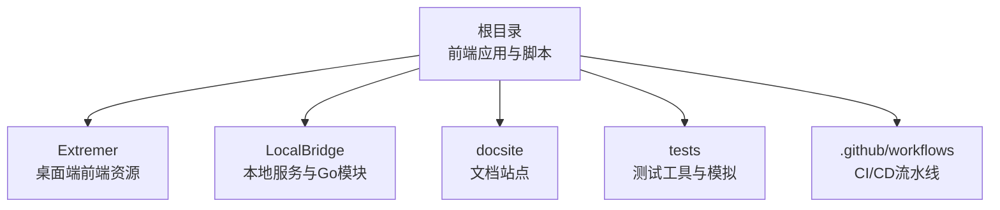

**章节来源**
- [package.json:1-65](file://package.json#L1-L65)
- [vite.config.ts:1-41](file://vite.config.ts#L1-L41)

## 核心组件
- 测试运行器与覆盖率：基于 Vitest 的测试运行与覆盖率统计，使用 happy-dom 作为 DOM 环境，支持多种报告格式输出。
- 构建与打包：Vite 提供开发与生产构建，支持多模式（如 extremer），并配置了基础路径与别名。
- 代码质量：ESLint 配置覆盖 TS/TSX 文件，结合全局规则与插件，统一风格与最佳实践。
- 依赖管理：前端依赖与开发依赖在 package.json 中声明；Extremer 与 LocalBridge 在各自 go.mod 中声明 Go 依赖。

**章节来源**
- [vite.config.ts:22-38](file://vite.config.ts#L22-L38)
- [package.json:41-63](file://package.json#L41-L63)
- [eslint.config.js:1-24](file://eslint.config.js#L1-L24)
- [Extremer/go.mod:1-39](file://Extremer/go.mod#L1-L39)
- [LocalBridge/go.mod:1-38](file://LocalBridge/go.mod#L1-L38)

## 架构总览
下图展示了测试自动化在整体架构中的位置：前端应用通过 Vite 配置启用 Vitest 测试与覆盖率；ESLint 保障代码质量；CI/CD 通过 GitHub Actions 工作流在多个平台上执行构建、测试与发布。

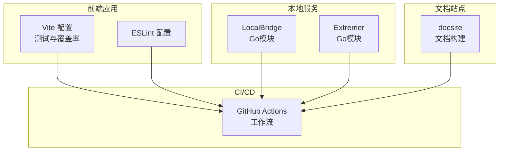

**图表来源**
- [vite.config.ts:1-41](file://vite.config.ts#L1-L41)
- [eslint.config.js:1-24](file://eslint.config.js#L1-L24)
- [.github/workflows/release.yaml:128-412](file://.github/workflows/release.yaml#L128-L412)
- [Extremer/go.mod:1-39](file://Extremer/go.mod#L1-L39)
- [LocalBridge/go.mod:1-38](file://LocalBridge/go.mod#L1-L38)

## 详细组件分析

### 测试运行与覆盖率配置
- 测试运行器：Vitest 在 Vite 配置中启用全局测试选项、happy-dom 环境与 setupFiles。
- 覆盖率：v8 提供器，输出文本、JSON、HTML、LCov 多种格式；排除 node_modules、tests、类型定义、配置文件与 dist 目录。
- 设置文件：通过 setupFiles 指定初始化脚本，便于注入测试环境与全局 mock。

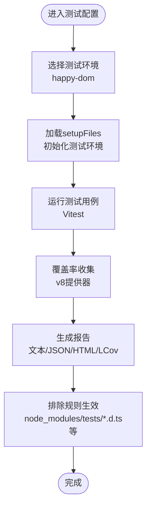

**图表来源**
- [vite.config.ts:22-38](file://vite.config.ts#L22-L38)

**章节来源**
- [vite.config.ts:22-38](file://vite.config.ts#L22-L38)

### 代码质量与风格检查
- ESLint 配置：对 TS/TSX 文件启用推荐规则集，结合 React Hooks 与 React Refresh 插件，语言选项设置为浏览器全局变量。
- 忽略项：dist 目录被全局忽略，确保 lint 不扫描构建产物。

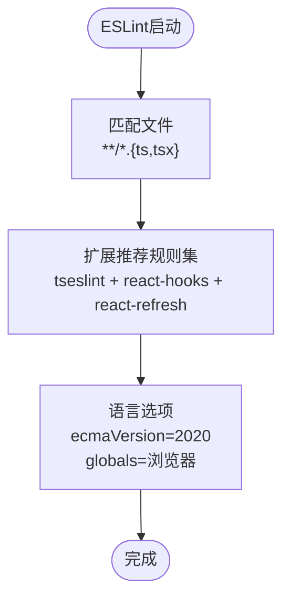

**图表来源**
- [eslint.config.js:8-23](file://eslint.config.js#L8-L23)

**章节来源**
- [eslint.config.js:1-24](file://eslint.config.js#L1-L24)

### CI/CD 流水线中的测试执行策略
- 平台矩阵：工作流在 Windows 与 Ubuntu 上并行执行，矩阵维度包括操作系统与平台（如 amd64、arm64）。
- 步骤拆分：构建 Web 应用、构建本地桥接服务、构建 Extremer、下载资源缓存、打包与上传制品、构建文档并打包。
- 触发条件：根据事件类型（push、workflow_dispatch）与分支名称（beta/test）控制步骤执行。
- 缓存策略：针对 MaaFramework 资源进行缓存，提升重复构建效率。

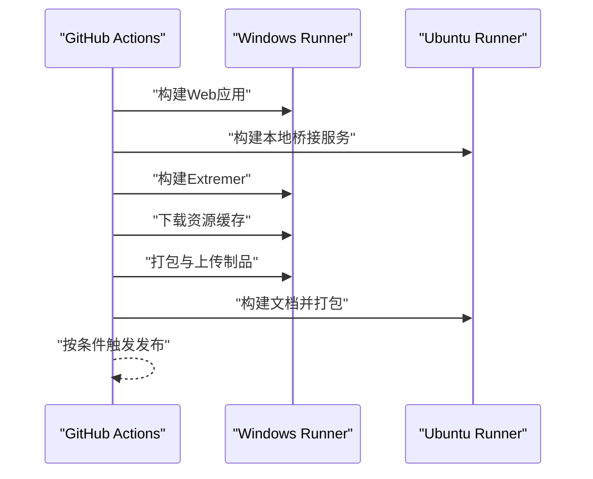

**图表来源**
- [.github/workflows/release.yaml:128-412](file://.github/workflows/release.yaml#L128-L412)

**章节来源**
- [.github/workflows/release.yaml:128-412](file://.github/workflows/release.yaml#L128-L412)

### 自动化测试的配置与调度
- 测试脚本：通过 npm scripts 调用 Vitest，结合 Vite 的测试配置自动发现与执行测试。
- 调度建议：在 CI 中使用矩阵并行执行不同平台任务，减少总耗时；在本地开发中优先运行变更相关的测试文件，提高反馈速度。
- 初始化与模拟：利用 setupFiles 注入全局 mock 与测试辅助，tests/mocks 与 tests/utils 存放通用模拟与工具。

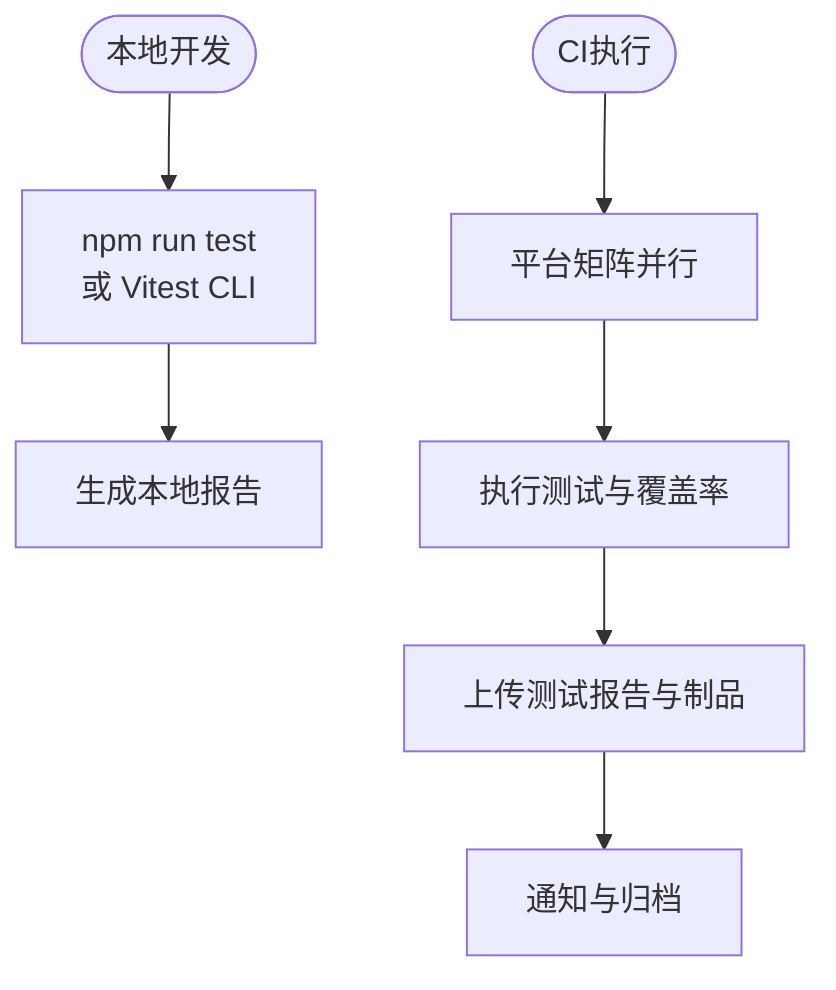

**图表来源**
- [vite.config.ts:22-38](file://vite.config.ts#L22-L38)
- [package.json:6-19](file://package.json#L6-L19)

**章节来源**
- [package.json:6-19](file://package.json#L6-L19)
- [vite.config.ts:22-38](file://vite.config.ts#L22-L38)
- [tests/mocks/](file://tests/mocks/)
- [tests/utils/](file://tests/utils/)

### 测试环境与依赖管理
- 前端依赖：React、Ant Design、@testing-library 等在 package.json 中声明；开发依赖包含 Vitest、happy-dom、@vitest/coverage-v8 等。
- Go 依赖：Extremer 与 LocalBridge 在各自 go.mod 中声明，包含 MaaFramework、websocket、logrus 等。
- 依赖一致性：通过 yarn.lock 与 go.mod/go.sum 确保依赖版本稳定，避免 CI 与本地差异。

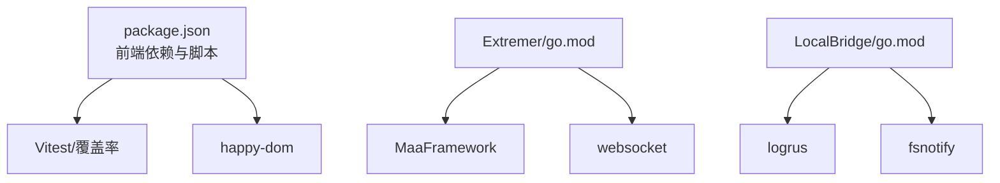

**图表来源**
- [package.json:20-63](file://package.json#L20-L63)
- [Extremer/go.mod:5-38](file://Extremer/go.mod#L5-L38)
- [LocalBridge/go.mod:5-37](file://LocalBridge/go.mod#L5-L37)

**章节来源**
- [package.json:20-63](file://package.json#L20-L63)
- [Extremer/go.mod:1-39](file://Extremer/go.mod#L1-L39)
- [LocalBridge/go.mod:1-38](file://LocalBridge/go.mod#L1-L38)

### 测试报告生成与通知机制
- 报告格式：覆盖率输出 JSON、HTML、LCov 等，便于在 CI 中解析与可视化。
- 通知机制：可在工作流中添加通知步骤（如 Slack、邮件），将测试状态与报告链接发送给团队成员。
- 归档与制品：将测试报告与构建产物一并上传为工作流制品，便于回溯与审计。

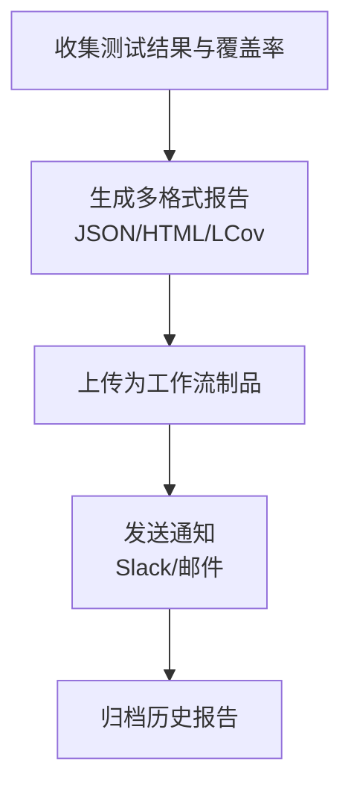

**图表来源**
- [vite.config.ts:26-37](file://vite.config.ts#L26-L37)
- [.github/workflows/release.yaml:128-157](file://.github/workflows/release.yaml#L128-L157)

**章节来源**
- [vite.config.ts:26-37](file://vite.config.ts#L26-L37)
- [.github/workflows/release.yaml:128-157](file://.github/workflows/release.yaml#L128-L157)

### 并行测试执行与结果分析
- 并行策略：在 CI 中使用平台矩阵并行执行，缩短总时间；在本地可按文件或套件分组并行运行。
- 结果分析：结合 HTML 与 LCov 报告定位未覆盖区域与回归风险；结合单元测试与集成测试结果评估稳定性。
- 性能优化：通过缓存依赖与资源、复用容器、减少冷启动时间提升吞吐量。

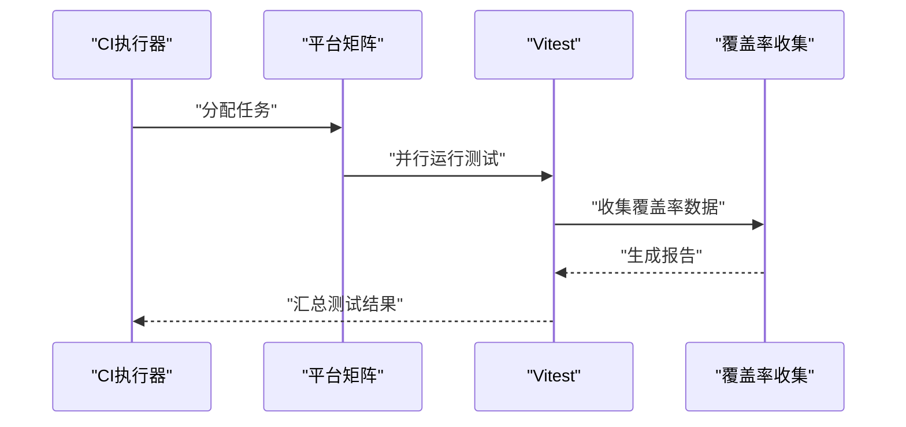

**图表来源**
- [.github/workflows/release.yaml:128-412](file://.github/workflows/release.yaml#L128-L412)
- [vite.config.ts:26-37](file://vite.config.ts#L26-L37)

**章节来源**
- [.github/workflows/release.yaml:128-412](file://.github/workflows/release.yaml#L128-L412)
- [vite.config.ts:26-37](file://vite.config.ts#L26-L37)

### 测试失败的处理与恢复策略
- 失败分类：单元测试失败、覆盖率阈值不达标、构建失败、资源下载失败。
- 处理策略：
  - 单元测试失败：修复问题后重试；必要时降级部分断言以保证主干可运行。
  - 覆盖率不足：补充关键路径测试；对历史低覆盖模块制定专项改进计划。
  - 构建失败：检查依赖版本与缓存；清理缓存后重试。
  - 资源下载失败：切换镜像源或离线缓存；增加重试与超时配置。
- 恢复机制：在工作流中加入“软失败”步骤，记录失败详情但不阻塞后续归档与通知流程。

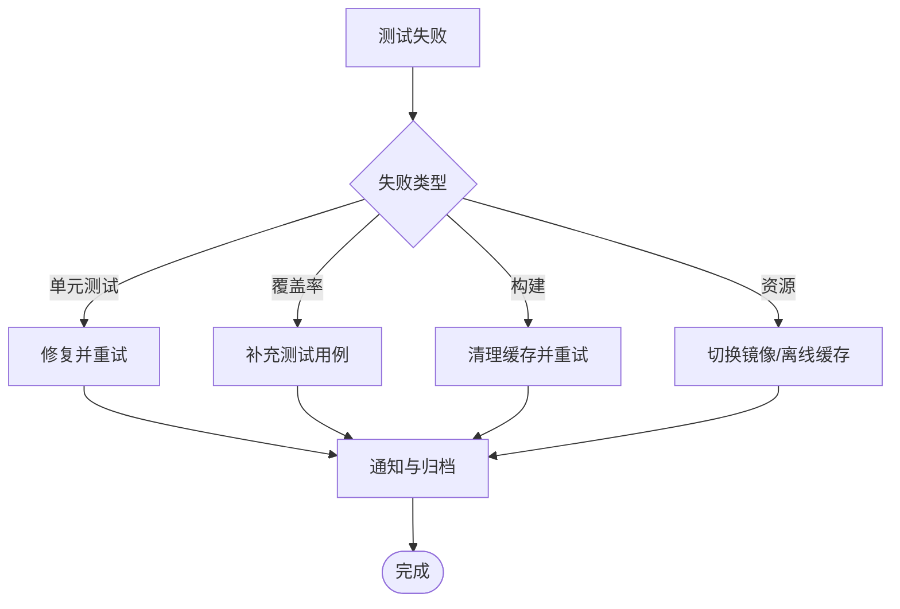

**图表来源**
- [.github/workflows/release.yaml:167-173](file://.github/workflows/release.yaml#L167-L173)
- [vite.config.ts:26-37](file://vite.config.ts#L26-L37)

**章节来源**
- [.github/workflows/release.yaml:167-173](file://.github/workflows/release.yaml#L167-L173)
- [vite.config.ts:26-37](file://vite.config.ts#L26-L37)

## 依赖分析
- 前端测试栈：Vitest + happy-dom + @testing-library 生态，配合 Vite 的测试配置实现开箱即用。
- 代码质量：ESLint 与插件组合确保代码风格一致，降低维护成本。
- Go 服务依赖：LocalBridge 与 Extremer 依赖 MaaFramework 与相关生态库，需关注版本兼容性与更新节奏。

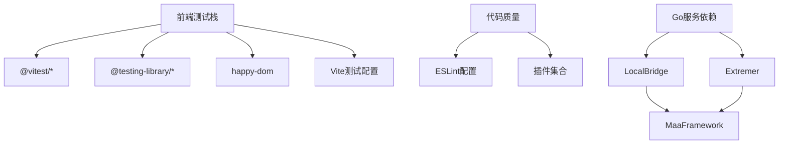

**图表来源**
- [package.json:41-63](file://package.json#L41-L63)
- [eslint.config.js:8-23](file://eslint.config.js#L8-L23)
- [Extremer/go.mod:5-38](file://Extremer/go.mod#L5-L38)
- [LocalBridge/go.mod:5-37](file://LocalBridge/go.mod#L5-L37)

**章节来源**
- [package.json:41-63](file://package.json#L41-L63)
- [eslint.config.js:8-23](file://eslint.config.js#L8-L23)
- [Extremer/go.mod:5-38](file://Extremer/go.mod#L5-L38)
- [LocalBridge/go.mod:5-37](file://LocalBridge/go.mod#L5-L37)

## 性能考虑
- 并行执行：在 CI 中使用矩阵并行，减少总耗时；在本地使用文件粒度并行提升反馈速度。
- 缓存策略：利用 Actions cache 缓存依赖与资源，显著缩短构建时间。
- 覆盖率范围：合理设置排除规则，避免对第三方与配置文件产生噪音，聚焦业务逻辑覆盖率。
- 构建优化：Vite 多模式构建与别名配置有助于减少打包体积与提升开发体验。

[本节为通用指导，无需特定文件来源]

## 故障排查指南
- 测试环境异常：确认 happy-dom 版本与 Vitest 兼容；检查 setupFiles 是否正确加载。
- 覆盖率报告缺失：核对覆盖率提供器与输出格式；检查排除规则是否误伤业务代码。
- CI 并行失败：检查平台差异导致的路径与权限问题；确保缓存键稳定且命中良好。
- 文档构建失败：确认 docsite 依赖安装与构建命令；检查压缩与制品上传步骤。

**章节来源**
- [vite.config.ts:22-38](file://vite.config.ts#L22-L38)
- [.github/workflows/release.yaml:134-148](file://.github/workflows/release.yaml#L134-L148)

## 结论
本项目已具备完善的前端测试与覆盖率基础设施，并通过 Vite 与 Vitest 实现开箱即用的测试体验；CI/CD 流程中通过平台矩阵与缓存策略提升了执行效率。建议在现有基础上进一步完善测试失败通知、覆盖率阈值与回归分析机制，以形成闭环的质量保障体系。

[本节为总结，无需特定文件来源]

## 附录
- 测试文件组织建议：将测试文件与被测模块同名放置于 __tests__ 目录，便于定位与维护。
- 模拟与工具：在 tests/mocks 与 tests/utils 中集中管理通用模拟与工具函数，减少重复代码。
- 面板与服务的可测性：对于复杂面板与服务模块，建议拆分职责并通过接口抽象提升可测试性。

[本节为概念性内容，无需特定文件来源]