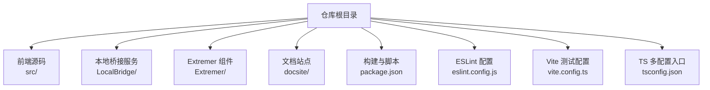
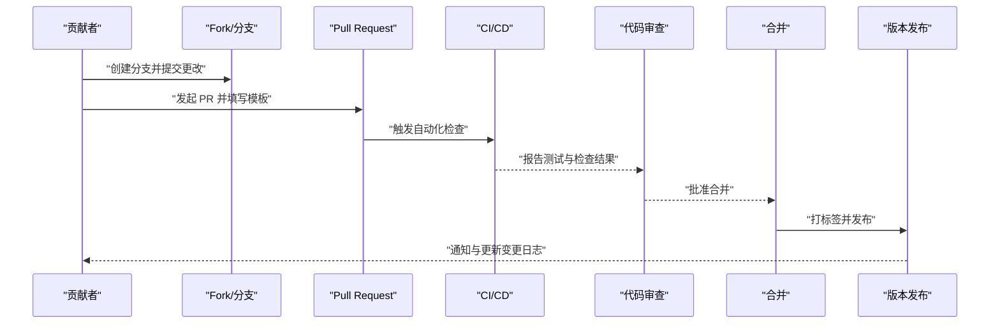
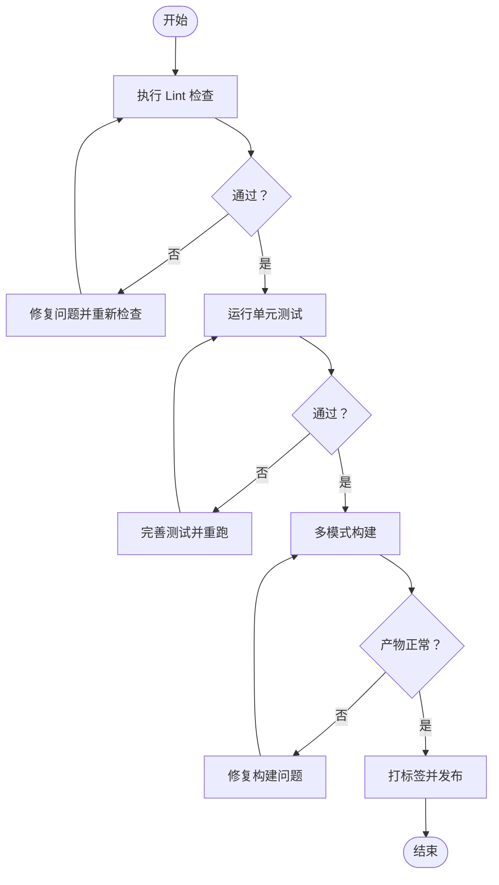
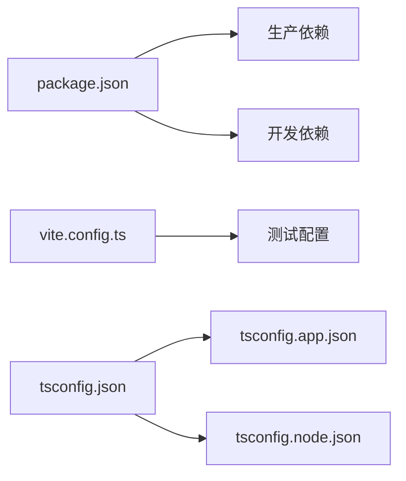

# 贡献流程

<cite>
**本文引用的文件**
- [README.md](file://README.md)
- [package.json](file://package.json)
- [eslint.config.js](file://eslint.config.js)
- [vite.config.ts](file://vite.config.ts)
- [tsconfig.json](file://tsconfig.json)
- [tsconfig.app.json](file://tsconfig.app.json)
- [tsconfig.node.json](file://tsconfig.node.json)
- [docsite/docs/01.指南/100.其他/01.参与开发.md](file://docsite/docs/01.指南/100.其他/01.参与开发.md)
</cite>

## 目录
1. [简介](#简介)
2. [项目结构](#项目结构)
3. [核心组件](#核心组件)
4. [架构总览](#架构总览)
5. [详细组件分析](#详细组件分析)
6. [依赖分析](#依赖分析)
7. [性能考虑](#性能考虑)
8. [故障排查指南](#故障排查指南)
9. [结论](#结论)
10. [附录](#附录)

## 简介
本指南面向希望为 MaaPipelineEditor（MPE）做出贡献的开发者，系统化地说明从 Fork 到 Pull Request 的 GitHub 工作流程、代码审查标准与合并要求、Issue 管理流程（含 Bug 报告与功能请求）、版本发布与标签管理、贡献者行为准则与沟通规范、提交信息规范、分支命名约定、PR 模板、以及 CI/CD 与自动化测试要求。文档同时结合仓库现有脚本与配置，给出可落地的实践建议。

## 项目结构
MPE 采用前后端分离架构，前端基于 React 19 与 Vite，后端包含本地桥接服务与 Extremer 组件。项目根目录提供统一的构建、文档与发布脚本，便于贡献者快速上手。

图表来源
- [package.json:1-65](file://package.json#L1-L65)
- [vite.config.ts:1-41](file://vite.config.ts#L1-L41)
- [tsconfig.json:1-8](file://tsconfig.json#L1-L8)

章节来源
- [README.md:1-151](file://README.md#L1-L151)
- [package.json:1-65](file://package.json#L1-L65)
- [vite.config.ts:1-41](file://vite.config.ts#L1-L41)
- [tsconfig.json:1-8](file://tsconfig.json#L1-L8)

## 核心组件
- 前端工程（React 19 + Vite）
  - 开发与构建：通过脚本统一管理，支持多模式构建（稳定版、预览版、Extremer 集成）。
  - 测试：Vitest 集成，覆盖率报告输出。
- 本地桥接服务（LocalBridge）
  - 提供与本地资源、文件、调试等能力的桥接接口，支持独立开发与联调。
- Extremer 组件
  - 将前端产物打包到指定目录，便于离线或一体化部署。
- 文档站点（docsite）
  - 使用 VitePress，提供开发指南与参与开发说明。

章节来源
- [package.json:6-18](file://package.json#L6-L18)
- [vite.config.ts:22-38](file://vite.config.ts#L22-L38)
- [docsite/docs/01.指南/100.其他/01.参与开发.md](file://docsite/docs/01.指南/100.其他/01.参与开发.md)

## 架构总览
下图展示了贡献者在本地进行开发、测试、构建与发布的典型流程，以及与文档站点和本地桥接服务的协作关系。

## 详细组件分析

### GitHub 工作流程（Fork、Branch、Pull Request）
- Fork 与 Clone
  - 在 GitHub 上 Fork 主仓库，克隆到本地后设置上游以保持同步。
- 分支策略
  - 建议采用功能/修复/文档类分支，遵循统一命名约定（见“附录-分支命名约定”）。
- 提交与 PR
  - 提交前确保通过 Lint 与测试；PR 描述需包含变更动机、影响范围与验证方式（见“附录-PR 模板”）。
- 审查与合并
  - 至少一名维护者批准；避免快进合并，优先使用 Squash 或 Rebase 合并以保持历史整洁。

章节来源
- [README.md:123-125](file://README.md#L123-L125)
- [docsite/docs/01.指南/100.其他/01.参与开发.md](file://docsite/docs/01.指南/100.其他/01.参与开发.md)

### 代码审查标准与合并要求
- 代码质量
  - 通过 ESLint 规则集与 TypeScript 类型检查；避免新增未使用的依赖。
- 可测试性
  - 新增功能需配套单元测试；测试覆盖率应持续提升。
- 变更粒度
  - 单一职责，避免“大杂烩式”提交；必要时拆分为多个 PR。
- 文档与注释
  - 对外接口与公共模块需补充说明；内部复杂逻辑需有清晰注释。
- 合并策略
  - 优先使用 Squash 合并；提交信息需符合规范（见“附录-提交信息规范”）。

章节来源
- [eslint.config.js:1-24](file://eslint.config.js#L1-L24)
- [vite.config.ts:22-38](file://vite.config.ts#L22-L38)

### Issue 管理流程（Bug 报告、功能请求、问题分类）
- Bug 报告
  - 提供最小可复现步骤、预期与实际结果、环境信息（浏览器/系统/版本）。
- 功能请求
  - 明确动机、收益与可能的影响；可附带草图或参考实现。
- 问题分类
  - 使用标签区分类型（如 bug、enhancement、documentation、help wanted）与优先级。
- 响应与跟进
  - 维护者会尽快确认并分配；贡献者可认领任务并在进展中及时更新。

章节来源
- [README.md:88-90](file://README.md#L88-L90)
- [README.md:123-125](file://README.md#L123-L125)

### 版本发布流程与标签管理
- 标签规范
  - 使用语义化版本标签（例如 v1.3.0），与发布说明一致。
- 发布步骤
  - 在本地打标签并推送；CI 可据此触发构建与发布流程（若已配置）。
- 变更记录
  - 更新变更日志，记录重大改动与迁移指引。

章节来源
- [package.json:17-18](file://package.json#L17-L18)

### 贡献者行为准则与沟通规范
- 尊重与包容
  - 保持友善、尊重不同观点；禁止骚扰与歧视。
- 积极沟通
  - 使用清晰简洁的语言；必要时附上截图或链接。
- 遵守法律与社区规则
  - 不传播违规内容；遵守开源许可证条款。

章节来源
- [README.md:123-125](file://README.md#L123-L125)

### 提交信息规范、分支命名约定、PR 模板
- 提交信息规范
  - 类型: 概要；正文: 背景、动机、影响；脚注: 关联 Issue/PR。
- 分支命名约定
  - feat/xxx、fix/xxx、docs/xxx、refactor/xxx、test/xxx、chore/xxx。
- PR 模板
  - 包含变更类型、动机、影响范围、测试与验证方式、相关 Issue/PR 链接。

章节来源
- [docsite/docs/01.指南/100.其他/01.参与开发.md](file://docsite/docs/01.指南/100.其他/01.参与开发.md)

### CI/CD 流程与自动化测试要求
- 本地检查
  - Lint：确保通过 ESLint；TypeScript：确保类型检查通过。
  - 测试：Vitest 运行单元测试，覆盖率报告输出。
- 构建与打包
  - 多模式构建：稳定版、预览版、Extremer 集成；确保产物正确生成。
- 发布脚本
  - 提供 release 与 retag 脚本，便于版本管理。

图表来源
- [eslint.config.js:1-24](file://eslint.config.js#L1-L24)
- [vite.config.ts:22-38](file://vite.config.ts#L22-L38)
- [package.json:6-18](file://package.json#L6-L18)

章节来源
- [eslint.config.js:1-24](file://eslint.config.js#L1-L24)
- [vite.config.ts:22-38](file://vite.config.ts#L22-L38)
- [package.json:6-18](file://package.json#L6-L18)

## 依赖分析
- 前端依赖
  - React 19、Ant Design、React Flow、Zustand 等；通过 package.json 管理。
- 开发依赖
  - ESLint、TypeScript、Vitest、React Hooks/Refresh 插件等。
- 构建与测试
  - Vite 配置中启用测试与覆盖率；TS 多配置入口组织应用与 Node 工具链。

图表来源
- [package.json:20-63](file://package.json#L20-L63)
- [vite.config.ts:22-38](file://vite.config.ts#L22-L38)
- [tsconfig.json:1-8](file://tsconfig.json#L1-L8)
- [tsconfig.app.json](file://tsconfig.app.json)
- [tsconfig.node.json](file://tsconfig.node.json)

章节来源
- [package.json:20-63](file://package.json#L20-L63)
- [vite.config.ts:22-38](file://vite.config.ts#L22-L38)
- [tsconfig.json:1-8](file://tsconfig.json#L1-L8)

## 性能考虑
- 构建性能
  - 合理拆分包与懒加载；避免引入体积过大的依赖。
- 运行性能
  - 优化渲染与状态更新；对高频操作进行节流/防抖。
- 测试效率
  - 使用隔离的测试环境与 Mock；关注测试执行时间。

## 故障排查指南
- Lint 失败
  - 检查 ESLint 规则与 TypeScript 类型错误；按提示逐项修正。
- 测试失败
  - 查看 Vitest 报告与覆盖率；补充或修复测试用例。
- 构建异常
  - 确认 Vite 模式参数与别名配置；清理缓存后重试。
- 发布问题
  - 检查标签是否已存在；确认推送权限与网络连通性。

章节来源
- [eslint.config.js:1-24](file://eslint.config.js#L1-L24)
- [vite.config.ts:22-38](file://vite.config.ts#L22-L38)
- [package.json:17-18](file://package.json#L17-L18)

## 结论
本指南提供了从 Fork 到发布的完整贡献流程、代码审查与合并要求、Issue 管理、版本发布与标签管理、行为准则与沟通规范、提交与分支规范、PR 模板，以及 CI/CD 与自动化测试的实践建议。请在提交前对照本指南与现有配置，确保变更符合团队标准与质量要求。

## 附录
- 分支命名约定
  - feat/xxx：新功能
  - fix/xxx：缺陷修复
  - docs/xxx：文档更新
  - refactor/xxx：重构
  - test/xxx：测试相关
  - chore/xxx：日常事务
- 提交信息规范
  - 类型: 概要；正文: 背景、动机、影响；脚注: 关联 Issue/PR
- PR 模板（建议）
  - 变更类型、动机、影响范围、测试与验证方式、相关 Issue/PR 链接
- 本地开发要点
  - 使用脚本统一管理开发、构建与测试；遵循 Lint 与类型检查；保证测试通过后再提交

章节来源
- [docsite/docs/01.指南/100.其他/01.参与开发.md](file://docsite/docs/01.指南/100.其他/01.参与开发.md)
- [eslint.config.js:1-24](file://eslint.config.js#L1-L24)
- [vite.config.ts:22-38](file://vite.config.ts#L22-L38)
- [package.json:6-18](file://package.json#L6-L18)