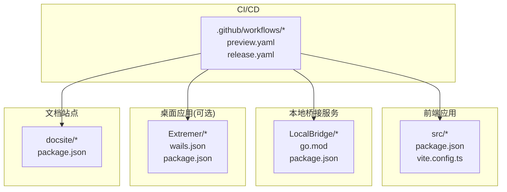
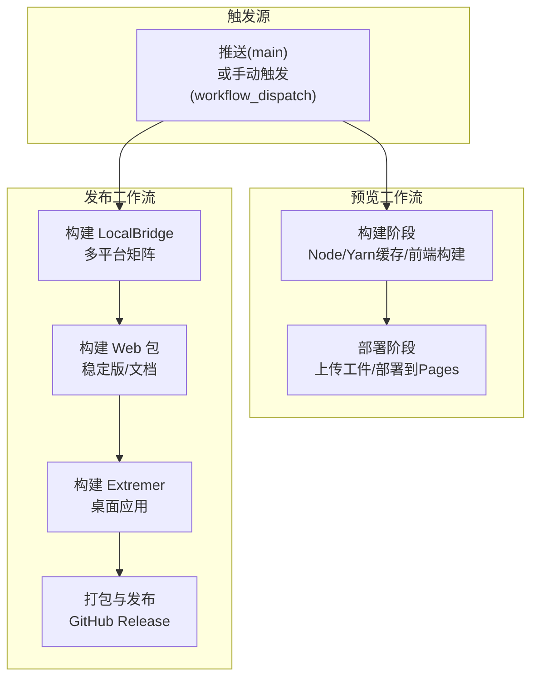
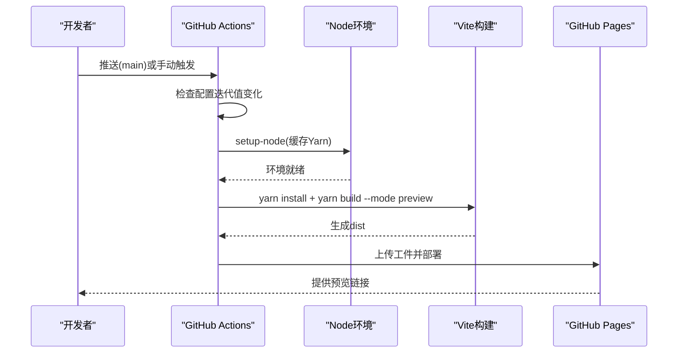
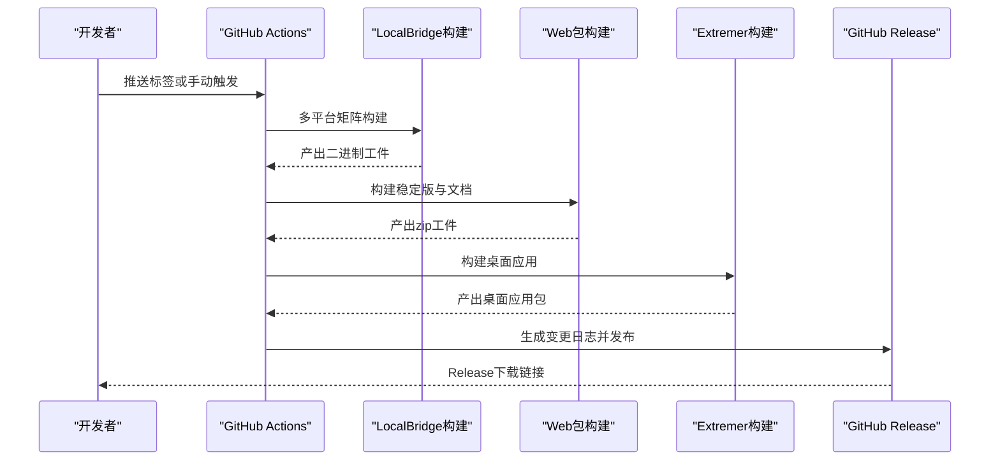
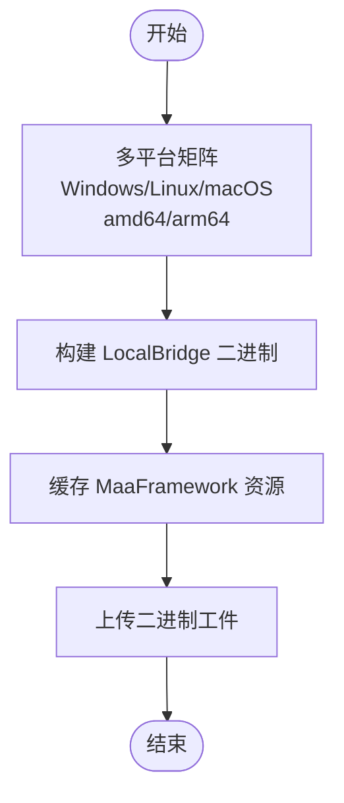
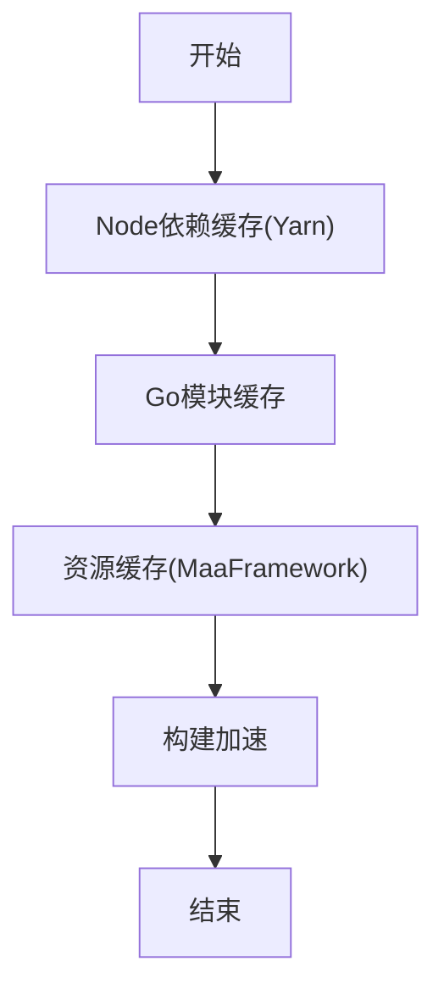
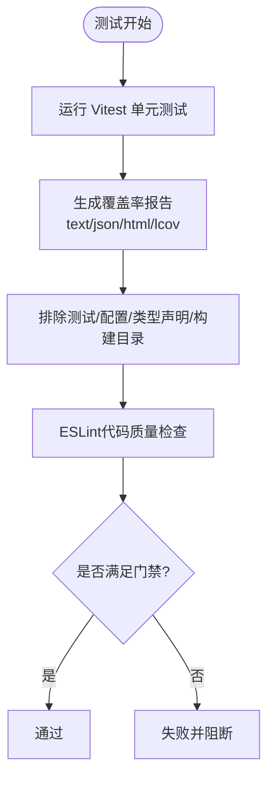
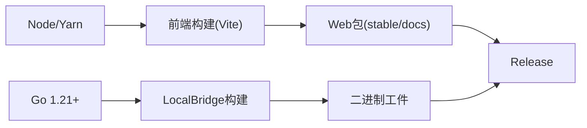

# CI/CD流水线配置

<cite>
**本文档引用的文件**
- [.github/workflows/preview.yaml](file://.github/workflows/preview.yaml)
- [.github/workflows/release.yaml](file://.github/workflows/release.yaml)
- [package.json](file://package.json)
- [vite.config.ts](file://vite.config.ts)
- [eslint.config.js](file://eslint.config.js)
- [Extremer/package.json](file://Extremer/package.json)
- [Extremer/wails.json](file://Extremer/wails.json)
- [LocalBridge/package.json](file://LocalBridge/package.json)
- [Extremer/go.mod](file://Extremer/go.mod)
- [LocalBridge/go.mod](file://LocalBridge/go.mod)
</cite>

## 目录
1. [简介](#简介)
2. [项目结构](#项目结构)
3. [核心组件](#核心组件)
4. [架构总览](#架构总览)
5. [详细组件分析](#详细组件分析)
6. [依赖关系分析](#依赖关系分析)
7. [性能考虑](#性能考虑)
8. [故障排除指南](#故障排除指南)
9. [结论](#结论)

## 简介
本文件系统性梳理并解释本仓库的CI/CD流水线配置，重点覆盖以下方面：
- GitHub Actions工作流程的触发条件与执行逻辑
- 构建环境设置（Node、Go、Yarn缓存）
- 依赖安装与前端构建策略
- 多平台构建矩阵与产物打包
- 缓存策略与依赖优化
- 测试覆盖率与质量门禁
- 工作流程自定义与扩展建议

## 项目结构
本仓库采用多模块结构：前端应用、本地桥接服务（Go）、可选的桌面应用（Wails）以及文档站点。CI/CD主要围绕前端与后端构建进行自动化。

**图表来源**
- [.github/workflows/preview.yaml:1-98](file://.github/workflows/preview.yaml#L1-L98)
- [.github/workflows/release.yaml:1-488](file://.github/workflows/release.yaml#L1-L488)
- [package.json:1-65](file://package.json#L1-L65)
- [Extremer/wails.json:1-18](file://Extremer/wails.json#L1-L18)
- [LocalBridge/package.json:1-8](file://LocalBridge/package.json#L1-L8)

**章节来源**
- [.github/workflows/preview.yaml:1-98](file://.github/workflows/preview.yaml#L1-L98)
- [.github/workflows/release.yaml:1-488](file://.github/workflows/release.yaml#L1-L488)
- [package.json:1-65](file://package.json#L1-L65)

## 核心组件
- 预览发布工作流（preview.yaml）：基于主分支推送或手动触发，检测特定配置迭代值变化后自动部署到GitHub Pages。
- 发布工作流（release.yaml）：基于标签触发或手动触发，执行多平台构建、资源缓存、产物打包与发布。

关键职责划分：
- 预览工作流：前端构建与静态页面发布
- 发布工作流：多平台二进制与桌面应用打包、文档站点打包、GitHub Release发布

**章节来源**
- [.github/workflows/preview.yaml:1-98](file://.github/workflows/preview.yaml#L1-L98)
- [.github/workflows/release.yaml:1-488](file://.github/workflows/release.yaml#L1-L488)

## 架构总览
下图展示两个工作流的整体执行路径与关键步骤：

**图表来源**
- [.github/workflows/preview.yaml:25-98](file://.github/workflows/preview.yaml#L25-L98)
- [.github/workflows/release.yaml:13-488](file://.github/workflows/release.yaml#L13-L488)

## 详细组件分析

### 预览发布工作流（preview.yaml）
- 触发条件
  - 推送到主分支且匹配指定路径变更
  - 支持手动触发
- 权限与并发
  - 设置pages写权限与GitHub Pages配置权限
  - 并发组为pages，避免同时部署
- 核心步骤
  - 代码检出与深度获取
  - 检测配置中的迭代值变化，决定是否部署
  - Node环境设置与Yarn缓存
  - 安装依赖与前端构建（预览模式）
  - 上传工件并按需部署到GitHub Pages

**图表来源**
- [.github/workflows/preview.yaml:31-84](file://.github/workflows/preview.yaml#L31-L84)
- [.github/workflows/preview.yaml:86-98](file://.github/workflows/preview.yaml#L86-L98)

**章节来源**
- [.github/workflows/preview.yaml:1-98](file://.github/workflows/preview.yaml#L1-L98)

### 发布工作流（release.yaml）
- 触发条件
  - 推送标签（v*）
  - 支持手动触发
- 权限
  - 写入内容与Actions权限
- 核心作业与流程
  - 构建 LocalBridge（多平台矩阵：Windows/Linux/macOS）
  - 构建Web包（稳定版与文档）
  - 构建Extremer（桌面应用）
  - 打包资源与产物
  - 生成变更日志并创建Release

**图表来源**
- [.github/workflows/release.yaml:14-157](file://.github/workflows/release.yaml#L14-L157)
- [.github/workflows/release.yaml:158-488](file://.github/workflows/release.yaml#L158-L488)

**章节来源**
- [.github/workflows/release.yaml:1-488](file://.github/workflows/release.yaml#L1-L488)

### 构建矩阵配置（多平台并行构建）
- LocalBridge构建矩阵
  - Windows/Linux/macOS三套架构组合
  - 使用Go版本与操作系统矩阵并行执行
- 资源缓存
  - 使用actions/cache对MaaFramework资源进行缓存，提升重复构建速度

**图表来源**
- [.github/workflows/release.yaml:19-38](file://.github/workflows/release.yaml#L19-L38)
- [.github/workflows/release.yaml:167-173](file://.github/workflows/release.yaml#L167-L173)

**章节来源**
- [.github/workflows/release.yaml:19-38](file://.github/workflows/release.yaml#L19-L38)
- [.github/workflows/release.yaml:167-173](file://.github/workflows/release.yaml#L167-L173)

### 缓存策略与依赖优化
- Yarn缓存（Node依赖）
  - 在Node环境设置中启用Yarn缓存，减少依赖安装时间
- Go模块缓存
  - 通过Go工具链缓存提升模块下载与构建速度
- 资源缓存（MaaFramework）
  - 对资源目录进行缓存，避免重复下载

**图表来源**
- [.github/workflows/preview.yaml:64-68](file://.github/workflows/preview.yaml#L64-L68)
- [.github/workflows/release.yaml:43-46](file://.github/workflows/release.yaml#L43-L46)
- [.github/workflows/release.yaml:167-173](file://.github/workflows/release.yaml#L167-L173)

**章节来源**
- [.github/workflows/preview.yaml:64-68](file://.github/workflows/preview.yaml#L64-L68)
- [.github/workflows/release.yaml:43-46](file://.github/workflows/release.yaml#L43-L46)
- [.github/workflows/release.yaml:167-173](file://.github/workflows/release.yaml#L167-L173)

### 测试覆盖率与质量门禁
- 测试框架与覆盖率
  - 使用Vitest与v8提供程序，开启多种覆盖率报告格式（文本、JSON、HTML、LCOV）
  - 配置排除规则，避免统计测试与配置文件
- 代码质量检查
  - ESLint配置用于TypeScript/TSX代码质量与规范
- 质量门禁建议
  - 可在工作流中增加覆盖率阈值检查步骤，结合ESLint结果作为质量门禁

**图表来源**
- [vite.config.ts:22-38](file://vite.config.ts#L22-L38)
- [eslint.config.js:8-24](file://eslint.config.js#L8-L24)

**章节来源**
- [vite.config.ts:22-38](file://vite.config.ts#L22-L38)
- [eslint.config.js:8-24](file://eslint.config.js#L8-L24)

### 工作流程自定义与扩展指南
- 新增平台支持
  - 在构建矩阵中添加新的操作系统与架构组合
  - 确保对应平台的资源与依赖可用
- 自定义构建模式
  - 通过Vite模式参数切换构建目标（如extremer/stable等）
- 质量门禁增强
  - 在工作流中加入覆盖率阈值检查与ESLint错误计数限制
- 文档与Web包扩展
  - 可在文档站点构建后追加额外的静态资源或压缩包

**章节来源**
- [.github/workflows/release.yaml:19-38](file://.github/workflows/release.yaml#L19-L38)
- [vite.config.ts:5-14](file://vite.config.ts#L5-L14)

## 依赖关系分析
- 前端构建依赖
  - Node版本与Yarn缓存
  - Vite与React插件
- 后端构建依赖
  - Go版本与模块管理
  - Wails（桌面应用）
- 文档站点依赖
  - 文档站点构建脚本与打包

**图表来源**
- [.github/workflows/preview.yaml:64-78](file://.github/workflows/preview.yaml#L64-L78)
- [.github/workflows/release.yaml:43-46](file://.github/workflows/release.yaml#L43-L46)
- [Extremer/wails.json:1-18](file://Extremer/wails.json#L1-L18)

**章节来源**
- [.github/workflows/preview.yaml:64-78](file://.github/workflows/preview.yaml#L64-L78)
- [.github/workflows/release.yaml:43-46](file://.github/workflows/release.yaml#L43-L46)
- [Extremer/wails.json:1-18](file://Extremer/wails.json#L1-L18)

## 性能考虑
- 缓存优先：充分利用Yarn、Go与资源缓存，显著降低重复构建时间
- 并行执行：多平台矩阵并行构建，缩短整体耗时
- 构建模式优化：通过Vite模式参数减少不必要的构建步骤
- 依赖最小化：合理排除不需要统计的目录，降低覆盖率计算开销

## 故障排除指南
- 预览部署未触发
  - 检查配置迭代值是否大于0，确认路径触发条件是否匹配
  - 查看工作流输出与日志，确认Yarn缓存与依赖安装是否成功
- 发布构建失败
  - 检查Go版本与平台矩阵配置
  - 确认资源缓存键是否正确，必要时清理缓存重试
- 覆盖率报告缺失
  - 确认测试脚本已执行，排除规则是否过于宽泛
  - 检查报告格式配置与输出目录

**章节来源**
- [.github/workflows/preview.yaml:36-62](file://.github/workflows/preview.yaml#L36-L62)
- [.github/workflows/release.yaml:167-173](file://.github/workflows/release.yaml#L167-L173)
- [vite.config.ts:26-37](file://vite.config.ts#L26-L37)

## 结论
本仓库的CI/CD流水线以GitHub Actions为核心，实现了：
- 基于配置迭代值的智能预览发布
- 多平台并行构建与资源缓存优化
- 前端、后端与文档的自动化打包与发布
- 可扩展的质量门禁与覆盖率报告

通过合理利用缓存、矩阵构建与质量检查，能够有效提升构建效率与交付稳定性。