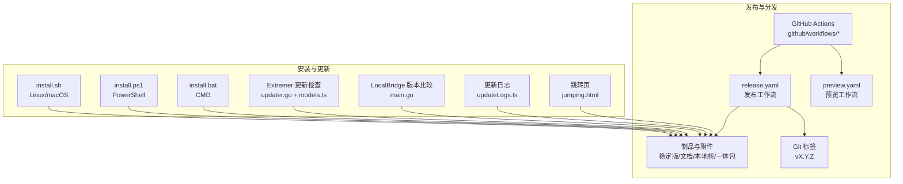
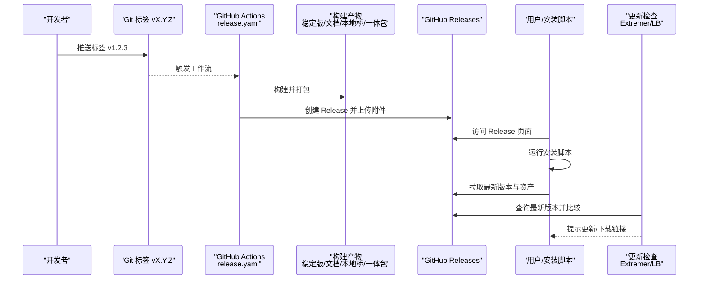
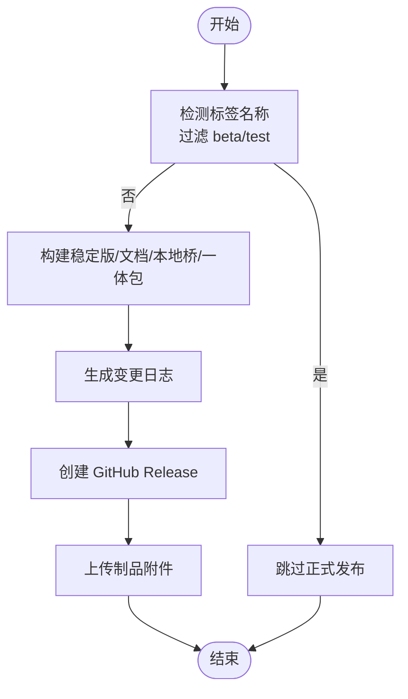
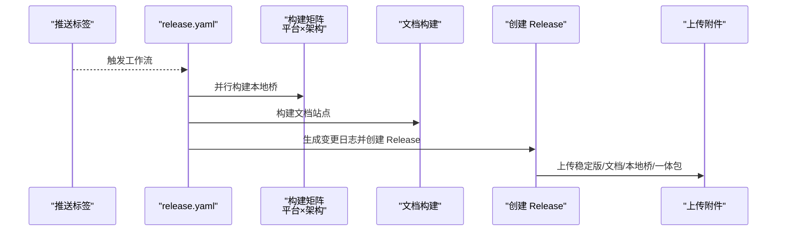
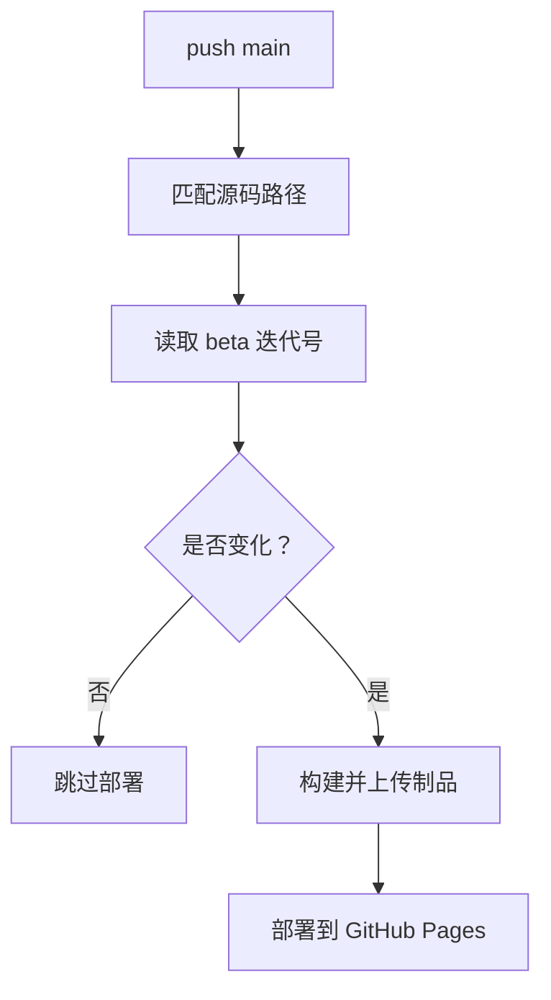
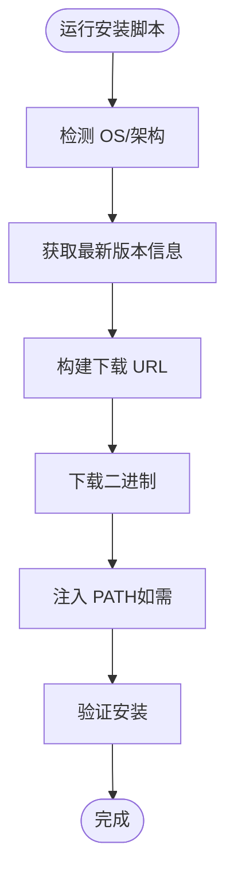
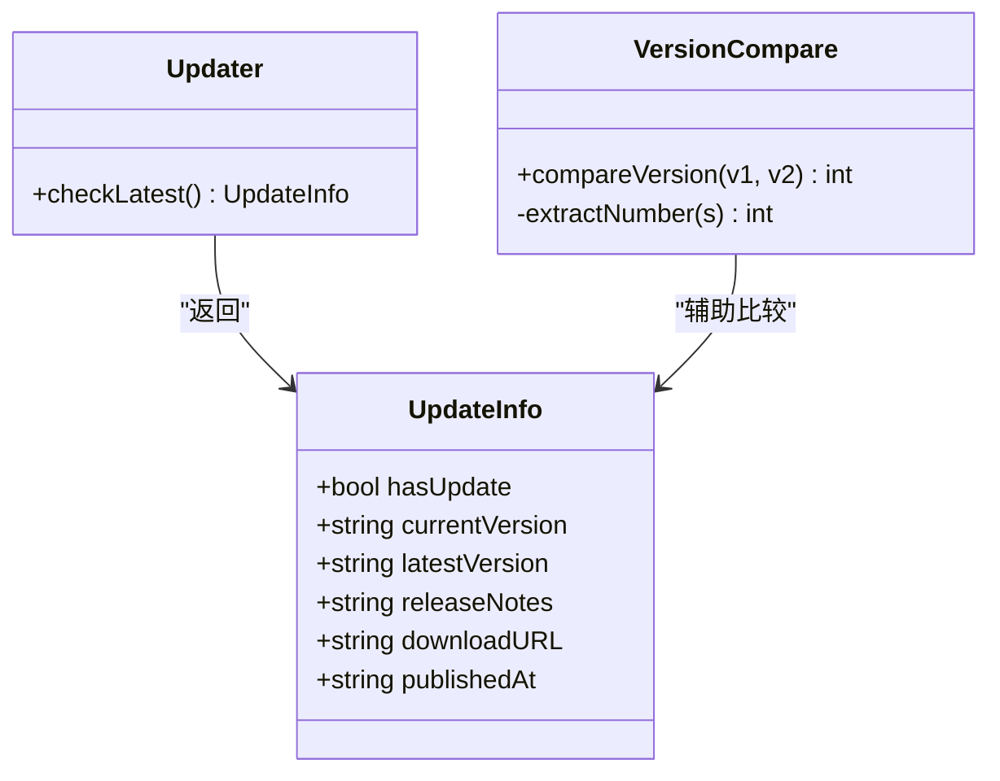
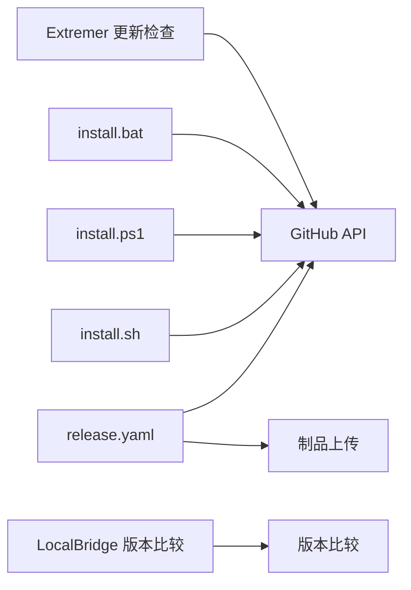

# 发布与分发

<cite>
**本文引用的文件**
- [README.md](file://README.md)
- [.github/workflows/release.yaml](file://.github/workflows/release.yaml)
- [.github/workflows/preview.yaml](file://.github/workflows/preview.yaml)
- [tools/install.sh](file://tools/install.sh)
- [tools/install.ps1](file://tools/install.ps1)
- [tools/install.bat](file://tools/install.bat)
- [package.json](file://package.json)
- [Extremer/internal/updater/updater.go](file://Extremer/internal/updater/updater.go)
- [Extremer/frontend/wailsjs/go/models.ts](file://Extremer/frontend/wailsjs/go/models.ts)
- [LocalBridge/cmd/lb/main.go](file://LocalBridge/cmd/lb/main.go)
- [src/data/updateLogs.ts](file://src/data/updateLogs.ts)
- [tools/jumping.html](file://tools/jumping.html)
</cite>

## 目录
1. [简介](#简介)
2. [项目结构](#项目结构)
3. [核心组件](#核心组件)
4. [架构总览](#架构总览)
5. [详细组件分析](#详细组件分析)
6. [依赖分析](#依赖分析)
7. [性能考虑](#性能考虑)
8. [故障排查指南](#故障排查指南)
9. [结论](#结论)
10. [附录](#附录)

## 简介
本文件面向发布与分发策略，结合仓库中的 GitHub Actions 工作流、安装脚本与更新检查机制，系统化阐述以下内容：
- GitHub Releases 的配置与使用：发布说明生成、附件上传、预发布版本管理
- 自动化发布流程：触发条件、自动标签创建、自动附件上传
- 分发渠道与适用场景：直接下载、包管理器、应用商店、在线站点
- 安装脚本的使用与定制：跨平台脚本、版本解析、路径注入
- 发布后的监控与反馈：更新日志、在线站点统计、社区渠道
- 社区分发与第三方集成：跳转页、文档站点、社区交流群

## 项目结构
围绕发布与分发的关键文件与目录如下：
- GitHub Actions 工作流：.github/workflows/release.yaml（发布）、.github/workflows/preview.yaml（预览）
- 安装脚本：tools/install.sh（Linux/macOS）、tools/install.ps1（Windows PowerShell）、tools/install.bat（Windows CMD）
- 前端更新检查：Extremer/internal/updater/updater.go、Extremer/frontend/wailsjs/go/models.ts
- 本地服务版本比较：LocalBridge/cmd/lb/main.go
- 更新日志：src/data/updateLogs.ts
- 跳转页：tools/jumping.html
- 项目主页与文档：README.md、package.json（含 release 脚本）

图表来源
- [.github/workflows/release.yaml:1-488](file://.github/workflows/release.yaml#L1-L488)
- [.github/workflows/preview.yaml:1-97](file://.github/workflows/preview.yaml#L1-L97)
- [tools/install.sh:1-92](file://tools/install.sh#L1-92)
- [tools/install.ps1:1-74](file://tools/install.ps1#L1-74)
- [tools/install.bat:1-115](file://tools/install.bat#L1-115)
- [Extremer/internal/updater/updater.go:54-99](file://Extremer/internal/updater/updater.go#L54-L99)
- [Extremer/frontend/wailsjs/go/models.ts:1-26](file://Extremer/frontend/wailsjs/go/models.ts#L1-L26)
- [LocalBridge/cmd/lb/main.go:821-881](file://LocalBridge/cmd/lb/main.go#L821-L881)
- [src/data/updateLogs.ts:1-200](file://src/data/updateLogs.ts#L1-L200)
- [tools/jumping.html:1-225](file://tools/jumping.html#L1-225)

章节来源
- [.github/workflows/release.yaml:1-488](file://.github/workflows/release.yaml#L1-L488)
- [.github/workflows/preview.yaml:1-97](file://.github/workflows/preview.yaml#L1-L97)
- [tools/install.sh:1-92](file://tools/install.sh#L1-92)
- [tools/install.ps1:1-74](file://tools/install.ps1#L1-74)
- [tools/install.bat:1-115](file://tools/install.bat#L1-115)
- [README.md:1-151](file://README.md#L1-L151)
- [package.json:1-65](file://package.json#L1-L65)

## 核心组件
- GitHub Actions 发布工作流：负责构建、打包、生成变更日志、创建 GitHub Release 并上传附件
- 预览发布工作流：基于 beta 迭代号触发，自动部署到 GitHub Pages
- 安装脚本：跨平台自动获取最新版本、下载对应二进制、注入 PATH
- 更新检查与版本比较：Extremer 与 LocalBridge 组件分别提供版本比较与更新提示
- 更新日志：前端展示历史版本与更新内容
- 跳转页：用于站点迁移或引导跳转

章节来源
- [.github/workflows/release.yaml:1-488](file://.github/workflows/release.yaml#L1-L488)
- [.github/workflows/preview.yaml:1-97](file://.github/workflows/preview.yaml#L1-L97)
- [tools/install.sh:1-92](file://tools/install.sh#L1-92)
- [tools/install.ps1:1-74](file://tools/install.ps1#L1-74)
- [tools/install.bat:1-115](file://tools/install.bat#L1-115)
- [Extremer/internal/updater/updater.go:54-99](file://Extremer/internal/updater/updater.go#L54-L99)
- [LocalBridge/cmd/lb/main.go:821-881](file://LocalBridge/cmd/lb/main.go#L821-L881)
- [src/data/updateLogs.ts:1-200](file://src/data/updateLogs.ts#L1-L200)
- [tools/jumping.html:1-225](file://tools/jumping.html#L1-225)

## 架构总览
发布与分发的整体流程由“触发 → 构建 → 打包 → 生成变更日志 → 创建 Release → 附件上传 → 安装与更新检查 → 反馈与监控”构成。

图表来源
- [.github/workflows/release.yaml:1-488](file://.github/workflows/release.yaml#L1-L488)
- [tools/install.sh:1-92](file://tools/install.sh#L1-92)
- [tools/install.ps1:1-74](file://tools/install.ps1#L1-74)
- [tools/install.bat:1-115](file://tools/install.bat#L1-115)
- [Extremer/internal/updater/updater.go:54-99](file://Extremer/internal/updater/updater.go#L54-L99)
- [LocalBridge/cmd/lb/main.go:821-881](file://LocalBridge/cmd/lb/main.go#L821-L881)

## 详细组件分析

### GitHub Releases 配置与使用
- 触发条件
  - 通过推送标签触发发布工作流，仅对非 beta/test 标签执行正式发布
  - 手动触发（workflow_dispatch）可用于测试或预发布
- 产物与附件
  - 稳定版 Web 包、文档包、本地桥二进制、Extremer 一体包
  - 通过上传制品到 GitHub Releases，供安装脚本与用户下载
- 发布说明（Changelog）
  - 自动生成变更日志，包含对比链接与更新摘要，并写入文件供发布使用
- 预发布版本管理
  - 工作流中对 beta/test 标签进行过滤，避免误发布到正式渠道
- 自动标签创建
  - 项目提供 release 脚本用于打标签与推送，便于手动触发发布

图表来源
- [.github/workflows/release.yaml:1-488](file://.github/workflows/release.yaml#L1-L488)

章节来源
- [.github/workflows/release.yaml:1-488](file://.github/workflows/release.yaml#L1-L488)
- [package.json:17-18](file://package.json#L17-L18)

### 自动化发布流程
- 触发与并发控制
  - push 标签触发；workflow_dispatch 支持手动触发
  - 预览工作流对 beta 迭代号进行检测，仅当迭代号变化时才部署
- 构建矩阵与平台
  - 本地桥：Windows/Linux/macOS（amd64/arm64）
  - Extremer：按平台打包，生成 zip 附件
- 文档与 Web 包
  - 构建文档站点并压缩为 zip，随 Release 一起发布
- 变更日志生成
  - 基于上次标签与当前提交生成变更摘要，写入 CHANGELOG.md

图表来源
- [.github/workflows/release.yaml:1-488](file://.github/workflows/release.yaml#L1-L488)

章节来源
- [.github/workflows/release.yaml:1-488](file://.github/workflows/release.yaml#L1-L488)

### 预览发布与 GitHub Pages
- 触发与部署
  - 监听 main 分支的源码变更，仅在 beta 迭代号发生变化时部署
  - 使用 Pages 部署预览站点，便于快速验证
- 验证与回滚
  - 通过 beta 迭代号变化判断是否需要部署，避免频繁部署

图表来源
- [.github/workflows/preview.yaml:1-97](file://.github/workflows/preview.yaml#L1-L97)

章节来源
- [.github/workflows/preview.yaml:1-97](file://.github/workflows/preview.yaml#L1-L97)

### 安装脚本使用与定制
- Linux/macOS（install.sh）
  - 自动检测 OS/架构，获取最新版本并下载对应二进制
  - 将可执行文件放入用户目录并提示 PATH 注入
- Windows（install.ps1）
  - PowerShell 脚本，自动获取最新版本并下载 Windows 版本
  - 自动注入 PATH 并提示重启终端生效
- Windows（install.bat）
  - CMD 脚本，解析 GitHub API 响应获取版本与下载链接
  - 自动注入 PATH 并清理临时文件

图表来源
- [tools/install.sh:1-92](file://tools/install.sh#L1-92)
- [tools/install.ps1:1-74](file://tools/install.ps1#L1-74)
- [tools/install.bat:1-115](file://tools/install.bat#L1-115)

章节来源
- [tools/install.sh:1-92](file://tools/install.sh#L1-92)
- [tools/install.ps1:1-74](file://tools/install.ps1#L1-74)
- [tools/install.bat:1-115](file://tools/install.bat#L1-115)

### 更新检查与版本比较
- Extremer 更新检查
  - 调用 GitHub API 获取最新 Release，解析版本号并比较
  - 返回更新信息（是否需要更新、下载链接、发布说明等）
- LocalBridge 版本比较
  - 对比当前版本与远程版本，支持去除前缀与预发布标识的数字提取
- 前端模型
  - 定义 UpdateInfo 结构体，便于前端接收与展示

图表来源
- [Extremer/frontend/wailsjs/go/models.ts:1-26](file://Extremer/frontend/wailsjs/go/models.ts#L1-L26)
- [Extremer/internal/updater/updater.go:54-99](file://Extremer/internal/updater/updater.go#L54-L99)
- [LocalBridge/cmd/lb/main.go:821-881](file://LocalBridge/cmd/lb/main.go#L821-L881)

章节来源
- [Extremer/internal/updater/updater.go:54-99](file://Extremer/internal/updater/updater.go#L54-L99)
- [Extremer/frontend/wailsjs/go/models.ts:1-26](file://Extremer/frontend/wailsjs/go/models.ts#L1-L26)
- [LocalBridge/cmd/lb/main.go:821-881](file://LocalBridge/cmd/lb/main.go#L821-L881)

### 更新日志与反馈收集
- 更新日志
  - 前端维护更新日志数据结构，包含版本、日期、类型与分类内容
  - 置顶公告用于引导首次使用与重要功能上线
- 反馈与社区
  - README 提供文档站、在线使用入口与社区交流群
  - 跳转页用于站点迁移或引导跳转，提升用户体验

章节来源
- [src/data/updateLogs.ts:1-200](file://src/data/updateLogs.ts#L1-L200)
- [README.md:123-126](file://README.md#L123-L126)
- [tools/jumping.html:1-225](file://tools/jumping.html#L1-225)

### 分发渠道与适用场景
- 直接下载（GitHub Releases）
  - 适合需要离线部署、自托管或快速试用的用户
  - 通过安装脚本自动获取最新版本，降低用户操作成本
- 包管理器
  - 可在后续扩展 Homebrew、Chocolatey 等，提供更便捷的安装与升级
- 应用商店
  - 可针对 Windows/macOS 平台考虑应用商店分发，提升可信度与覆盖度
- 在线站点
  - README 提供在线使用入口，适合无需安装的快速体验
- 文档站点
  - 与发布工作流联动，随 Release 一起发布文档包，便于离线查阅

章节来源
- [README.md:114-119](file://README.md#L114-L119)
- [.github/workflows/release.yaml:134-148](file://.github/workflows/release.yaml#L134-L148)

## 依赖分析
- 发布工作流依赖
  - GitHub API 与 Releases 权限
  - 构建工具链（Node、Go、打包工具）
  - 上传制品到 GitHub Releases
- 安装脚本依赖
  - GitHub API 获取最新版本
  - curl/Invoke-WebRequest 下载二进制
  - PATH 注入与权限设置
- 更新检查依赖
  - GitHub API 获取 Release 信息
  - 版本号解析与比较算法

图表来源
- [.github/workflows/release.yaml:1-488](file://.github/workflows/release.yaml#L1-L488)
- [tools/install.sh:1-92](file://tools/install.sh#L1-92)
- [tools/install.ps1:1-74](file://tools/install.ps1#L1-74)
- [tools/install.bat:1-115](file://tools/install.bat#L1-115)
- [Extremer/internal/updater/updater.go:54-99](file://Extremer/internal/updater/updater.go#L54-L99)
- [LocalBridge/cmd/lb/main.go:821-881](file://LocalBridge/cmd/lb/main.go#L821-L881)

章节来源
- [.github/workflows/release.yaml:1-488](file://.github/workflows/release.yaml#L1-L488)
- [tools/install.sh:1-92](file://tools/install.sh#L1-92)
- [tools/install.ps1:1-74](file://tools/install.ps1#L1-74)
- [tools/install.bat:1-115](file://tools/install.bat#L1-115)
- [Extremer/internal/updater/updater.go:54-99](file://Extremer/internal/updater/updater.go#L54-L99)
- [LocalBridge/cmd/lb/main.go:821-881](file://LocalBridge/cmd/lb/main.go#L821-L881)

## 性能考虑
- 并行构建：发布工作流使用矩阵并行构建多平台二进制，缩短整体耗时
- 缓存策略：缓存 MaaFramework 资源，减少重复下载
- 产物压缩：文档与一体包采用压缩归档，降低传输与存储成本
- 路径注入：安装脚本仅在必要时注入 PATH，避免不必要的系统变更

章节来源
- [.github/workflows/release.yaml:167-174](file://.github/workflows/release.yaml#L167-L174)
- [.github/workflows/release.yaml:380-394](file://.github/workflows/release.yaml#L380-L394)

## 故障排查指南
- 发布工作流失败
  - 检查标签是否包含 beta/test（会被过滤）
  - 确认制品上传路径与文件是否存在
  - 查看 GitHub API 速率限制与网络状况
- 安装脚本失败
  - Linux/macOS：确认 curl 可用与网络可达
  - Windows：PowerShell/CMD 脚本需允许执行策略与网络访问
  - PATH 未生效：重启终端或手动注入后再试
- 更新检查异常
  - 确认 GitHub API 返回状态码与版本号格式
  - 检查版本号前缀与预发布标识的解析逻辑
- 预览部署未触发
  - 确认 beta 迭代号是否发生变化
  - 检查 Pages 权限与分支保护规则

章节来源
- [.github/workflows/release.yaml:18-19](file://.github/workflows/release.yaml#L18-L19)
- [.github/workflows/release.yaml:406-407](file://.github/workflows/release.yaml#L406-L407)
- [.github/workflows/preview.yaml:40-62](file://.github/workflows/preview.yaml#L40-L62)
- [tools/install.sh:64-67](file://tools/install.sh#L64-L67)
- [tools/install.ps1:39-45](file://tools/install.ps1#L39-L45)
- [tools/install.bat:74-79](file://tools/install.bat#L74-L79)
- [Extremer/internal/updater/updater.go:58-65](file://Extremer/internal/updater/updater.go#L58-L65)

## 结论
本项目通过 GitHub Actions 实现了自动化发布与预览部署，配合多平台安装脚本与更新检查机制，形成了从构建、发布到用户使用的闭环。建议后续扩展包管理器与应用商店分发，进一步提升可用性与覆盖面；同时完善发布后的监控与反馈收集，持续优化用户体验。

## 附录
- 项目主页与文档入口：README.md
- 发布脚本（手动打标签）：package.json 中 release 脚本
- 跳转页：tools/jumping.html（用于站点迁移或引导）

章节来源
- [README.md:114-119](file://README.md#L114-L119)
- [package.json:17-18](file://package.json#L17-L18)
- [tools/jumping.html:1-225](file://tools/jumping.html#L1-225)