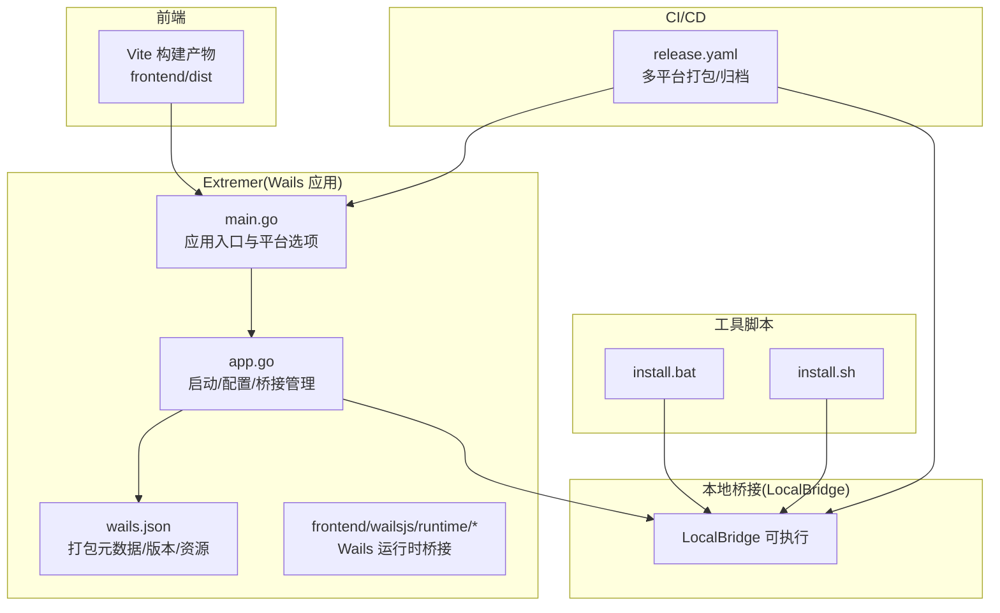
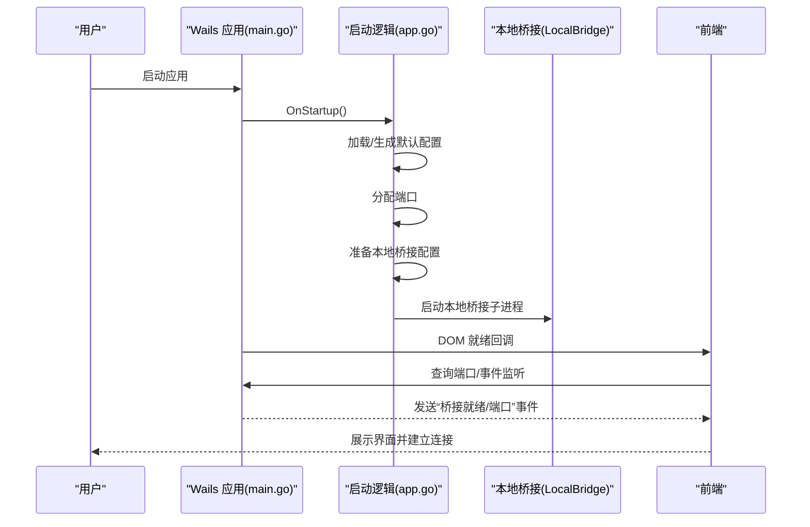
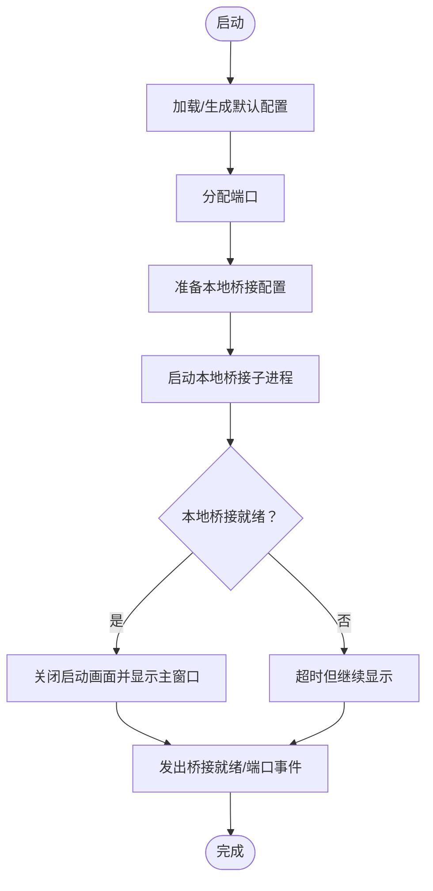
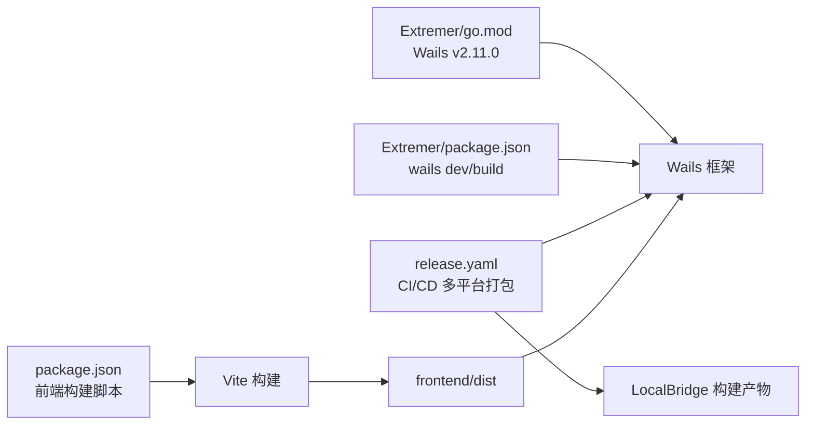

# 多平台打包

<cite>
**本文引用的文件**
- [Extremer/wails.json](file://Extremer/wails.json)
- [Extremer/package.json](file://Extremer/package.json)
- [Extremer/main.go](file://Extremer/main.go)
- [Extremer/app.go](file://Extremer/app.go)
- [Extremer/config/default.json](file://Extremer/config/default.json)
- [Extremer/frontend/wailsjs/runtime/runtime.js](file://Extremer/frontend/wailsjs/runtime/runtime.js)
- [Extremer/frontend/wailsjs/runtime/package.json](file://Extremer/frontend/wailsjs/runtime/package.json)
- [package.json](file://package.json)
- [tools/install.bat](file://tools/install.bat)
- [tools/install.sh](file://tools/install.sh)
- [.github/workflows/release.yaml](file://.github/workflows/release.yaml)
- [src/utils/wailsBridge.ts](file://src/utils/wailsBridge.ts)
</cite>

## 目录
1. [简介](#简介)
2. [项目结构](#项目结构)
3. [核心组件](#核心组件)
4. [架构总览](#架构总览)
5. [详细组件分析](#详细组件分析)
6. [依赖关系分析](#依赖关系分析)
7. [性能考虑](#性能考虑)
8. [故障排查指南](#故障排查指南)
9. [结论](#结论)
10. [附录](#附录)

## 简介
本指南面向使用 Wails 框架的多平台应用“MaaPipelineEditor”，系统性阐述跨平台打包机制与实践，覆盖 Windows、macOS、Linux 的构建配置差异、依赖与系统要求、打包命令与参数、图标与版本信息、签名配置、便携版与安装版区别、平台优化建议、常见问题与解决方案。文档以仓库内实际配置与脚本为依据，帮助开发者在不同平台上稳定产出可分发的安装包或便携包。

## 项目结构
本项目采用“前端 + Wails 应用 + 本地桥接服务”的分层组织：
- Extremer：Wails 应用主体，包含打包配置、平台选项、资源嵌入与默认配置。
- LocalBridge：本地桥接服务（独立可执行），随应用分发并在运行时由 Wails 应用启动。
- 前端：React/Vite 构建产物，通过 Wails 内置资源服务器提供给原生窗口。
- 工具脚本：Windows/macOS/Linux 安装脚本，便于分发本地桥接服务。
- CI/CD：GitHub Actions 流水线，负责 Web 构建、本地桥接构建与多平台打包归档。

图表来源
- [Extremer/main.go:26-89](file://Extremer/main.go#L26-L89)
- [Extremer/app.go:181-304](file://Extremer/app.go#L181-L304)
- [Extremer/config/default.json:1-34](file://Extremer/config/default.json#L1-L34)
- [Extremer/frontend/wailsjs/runtime/runtime.js:184-242](file://Extremer/frontend/wailsjs/runtime/runtime.js#L184-L242)
- [Extremer/wails.json:1-18](file://Extremer/wails.json#L1-L18)
- [tools/install.bat:1-115](file://tools/install.bat#L1-L115)
- [tools/install.sh:1-92](file://tools/install.sh#L1-L92)
- [.github/workflows/release.yaml:364-401](file://.github/workflows/release.yaml#L364-L401)

章节来源
- [Extremer/main.go:26-89](file://Extremer/main.go#L26-L89)
- [Extremer/app.go:181-304](file://Extremer/app.go#L181-L304)
- [Extremer/wails.json:1-18](file://Extremer/wails.json#L1-L18)
- [Extremer/config/default.json:1-34](file://Extremer/config/default.json#L1-L34)
- [tools/install.bat:1-115](file://tools/install.bat#L1-L115)
- [tools/install.sh:1-92](file://tools/install.sh#L1-L92)
- [.github/workflows/release.yaml:364-401](file://.github/workflows/release.yaml#L364-L401)

## 核心组件
- Wails 应用入口与平台选项：定义窗口尺寸、最小尺寸、启动状态、背景色、平台特定外观（Windows、macOS、Linux）等。
- 应用生命周期与桥接管理：启动时加载配置、分配端口、准备本地桥接配置、启动/重启本地桥接子进程；DOM 就绪后向前端发出“桥接就绪”事件。
- 默认配置与资源路径：默认配置包含服务器、文件扫描、日志、MaaFW 资源路径与本地桥接路径；跨平台路径处理与默认根目录策略。
- 前端 Wails 运行时桥接：提供事件监听、日志、端口查询、桥接状态检查等能力，供前端在 Wails 环境下调用。
- 打包配置与元数据：wails.json 提供应用名、输出文件名、资源目录、构建目录、产品信息（公司名、产品名、版本、版权、注释）等。
- 本地桥接安装脚本：Windows 与类 Unix 系统分别提供自动化安装本地桥接可执行文件的脚本。

章节来源
- [Extremer/main.go:49-84](file://Extremer/main.go#L49-L84)
- [Extremer/app.go:181-304](file://Extremer/app.go#L181-L304)
- [Extremer/app.go:353-413](file://Extremer/app.go#L353-L413)
- [Extremer/config/default.json:1-34](file://Extremer/config/default.json#L1-L34)
- [Extremer/frontend/wailsjs/runtime/runtime.js:184-242](file://Extremer/frontend/wailsjs/runtime/runtime.js#L184-L242)
- [Extremer/wails.json:10-16](file://Extremer/wails.json#L10-L16)
- [tools/install.bat:1-115](file://tools/install.bat#L1-L115)
- [tools/install.sh:1-92](file://tools/install.sh#L1-L92)

## 架构总览
Wails 应用在启动时根据平台注入不同的窗口与外观选项；应用启动后加载配置、分配端口、准备本地桥接配置并启动本地桥接子进程；前端通过 Wails 运行时桥接模块与后端交互，实现事件通信、日志输出与端口查询。

图表来源
- [Extremer/main.go:49-84](file://Extremer/main.go#L49-L84)
- [Extremer/app.go:181-304](file://Extremer/app.go#L181-L304)
- [Extremer/app.go:415-444](file://Extremer/app.go#L415-L444)
- [Extremer/frontend/wailsjs/runtime/runtime.js:184-242](file://Extremer/frontend/wailsjs/runtime/runtime.js#L184-L242)

## 详细组件分析

### 组件A：Wails 应用入口与平台选项
- 平台差异：
  - Windows：显示启动画面，窗口非透明，主题使用系统默认。
  - macOS：标题栏与关于信息配置，包含应用图标。
  - Linux：设置图标。
- 窗口行为：最大化的初始状态、最小宽高限制、背景色、启动时隐藏主窗口（Windows 启动画面期间）。
- 资源嵌入：前端构建产物通过嵌入文件系统提供给 AssetServer。

章节来源
- [Extremer/main.go:49-84](file://Extremer/main.go#L49-L84)
- [Extremer/main.go:18-22](file://Extremer/main.go#L18-L22)

### 组件B：应用生命周期与桥接管理
- 启动阶段：
  - 判断开发模式，定位可执行文件与工作目录。
  - 加载/生成默认配置，处理相对路径为绝对路径。
  - 分配端口并准备本地桥接配置文件。
  - 启动本地桥接子进程。
- DOM 就绪阶段：
  - 等待本地桥接就绪，关闭启动画面并显示主窗口，向前端发出“桥接就绪/端口”事件。
- 关闭阶段：
  - 停止本地桥接子进程。

图表来源
- [Extremer/app.go:181-304](file://Extremer/app.go#L181-L304)
- [Extremer/app.go:415-444](file://Extremer/app.go#L415-L444)

章节来源
- [Extremer/app.go:181-304](file://Extremer/app.go#L181-L304)
- [Extremer/app.go:415-444](file://Extremer/app.go#L415-L444)

### 组件C：默认配置与资源路径
- 默认配置包含服务器、文件扫描、日志、MaaFW 资源路径与本地桥接路径。
- 跨平台路径处理：Windows 默认本地桥接可执行名为 mpelb.exe，非 Windows 默认为 mpelb。
- 默认根目录策略：优先使用配置中的根目录，否则在不同平台选择合适的文档/家目录位置。

章节来源
- [Extremer/config/default.json:1-34](file://Extremer/config/default.json#L1-L34)
- [Extremer/app.go:125-179](file://Extremer/app.go#L125-L179)
- [Extremer/app.go:218-246](file://Extremer/app.go#L218-L246)

### 组件D：前端 Wails 运行时桥接
- 功能：提供事件监听、取消监听、日志输出、查询端口、检查桥接运行状态等。
- 用途：前端在 Wails 环境中通过该桥接模块与后端交互，实现 UI 与业务逻辑的解耦。

章节来源
- [src/utils/wailsBridge.ts:1-131](file://src/utils/wailsBridge.ts#L1-L131)
- [Extremer/frontend/wailsjs/runtime/runtime.js:184-242](file://Extremer/frontend/wailsjs/runtime/runtime.js#L184-L242)

### 组件E：打包配置与元数据
- wails.json：定义应用版本、名称、输出文件名、前端目录、资源目录、构建目录、产品信息（公司名、产品名、版本、版权、注释）。
- Extremer/package.json：提供开发与构建脚本，包含 wails dev/build、复制配置与资源等任务。

章节来源
- [Extremer/wails.json:1-18](file://Extremer/wails.json#L1-L18)
- [Extremer/package.json:1-12](file://Extremer/package.json#L1-L12)

### 组件F：本地桥接安装脚本
- Windows：通过 install.bat 自动下载最新版本的本地桥接二进制并加入 PATH。
- 类 Unix：通过 install.sh 自动检测 OS/架构，下载对应二进制并添加执行权限，提示将安装目录加入 PATH。

章节来源
- [tools/install.bat:1-115](file://tools/install.bat#L1-L115)
- [tools/install.sh:1-92](file://tools/install.sh#L1-L92)

## 依赖关系分析
- Wails 版本：Extremer/go.mod 指定使用 v2.11.0。
- 前端构建：package.json 提供 Vite 构建脚本，Extremer/package.json 提供 wails dev/build 与资源复制脚本。
- CI/CD：release.yaml 负责 Web 构建、本地桥接构建与多平台打包归档。

图表来源
- [Extremer/go.mod:7-8](file://Extremer/go.mod#L7-L8)
- [package.json:6-18](file://package.json#L6-L18)
- [Extremer/package.json:1-12](file://Extremer/package.json#L1-L12)
- [.github/workflows/release.yaml:364-401](file://.github/workflows/release.yaml#L364-L401)

章节来源
- [Extremer/go.mod:7-8](file://Extremer/go.mod#L7-L8)
- [package.json:6-18](file://package.json#L6-L18)
- [Extremer/package.json:1-12](file://Extremer/package.json#L1-L12)
- [.github/workflows/release.yaml:364-401](file://.github/workflows/release.yaml#L364-L401)

## 性能考虑
- 启动画面与窗口显示：Windows 启动画面期间隐藏主窗口，减少闪烁与无意义渲染，提升首屏体验。
- 资源嵌入：前端构建产物通过嵌入文件系统提供，避免运行时文件 IO，降低冷启动开销。
- 端口分配与重试：启动阶段分配端口并等待本地桥接就绪，超时后仍允许前端手动重试，保证可用性。
- 跨平台路径处理：默认路径与相对路径转换在启动阶段完成，避免运行时重复计算。

章节来源
- [Extremer/main.go:34-43](file://Extremer/main.go#L34-L43)
- [Extremer/main.go:57-59](file://Extremer/main.go#L57-L59)
- [Extremer/app.go:252-262](file://Extremer/app.go#L252-L262)
- [Extremer/app.go:415-444](file://Extremer/app.go#L415-L444)

## 故障排查指南
- 本地桥接未就绪
  - 现象：前端无法连接或“桥接就绪”事件未触发。
  - 排查：确认本地桥接可执行文件存在且可执行；检查默认配置中的资源路径是否正确；查看启动日志。
  - 参考：启动阶段准备配置、启动子进程与事件发射。
- 端口冲突
  - 现象：端口分配失败或被占用。
  - 排查：调整默认端口或释放占用端口；检查配置中的端口设置。
  - 参考：端口分配与事件发射。
- 路径无效
  - 现象：MaaFW 资源路径或本地桥接路径无效。
  - 排查：验证路径存在性，必要时回退到默认路径；检查跨平台路径处理。
  - 参考：默认路径与相对路径转换。
- Windows 启动画面不显示
  - 现象：启动画面初始化失败。
  - 排查：检查图标资源与启动画面初始化逻辑；确认运行环境。
  - 参考：Windows 启动画面初始化。
- CI/CD 打包失败
  - 现象：多平台打包步骤报错。
  - 排查：检查构建产物是否存在、资源复制是否成功、压缩归档命令是否正确。
  - 参考：CI/CD 打包步骤。

章节来源
- [Extremer/app.go:290-304](file://Extremer/app.go#L290-L304)
- [Extremer/app.go:415-444](file://Extremer/app.go#L415-L444)
- [Extremer/app.go:353-413](file://Extremer/app.go#L353-L413)
- [Extremer/main.go:34-43](file://Extremer/main.go#L34-L43)
- [.github/workflows/release.yaml:364-401](file://.github/workflows/release.yaml#L364-L401)

## 结论
本项目基于 Wails v2 实现跨平台桌面应用，通过统一的打包配置与平台选项、完善的启动流程与本地桥接管理、以及 CI/CD 多平台打包流水线，实现了在 Windows、macOS、Linux 上的一致体验与稳定交付。遵循本文档的打包流程与优化建议，可在不同平台上高效产出安装包或便携包，并针对常见问题进行快速定位与修复。

## 附录

### A. 多平台打包命令与参数
- Wails 开发与构建
  - 开发模式：wails dev
  - 构建：wails build
  - 构建并复制配置与资源：yarn copy:config && wails build
- 前端构建
  - Vite 构建：yarn build
  - 复制前端产物到 Extremer 前端目录：yarn copy:dist
- 本地桥接构建
  - Windows：在 LocalBridge 目录下使用 Go 编译生成 mpelb.exe，复制到 Extremer/build/bin/resources
  - 类 Unix：同理生成 mpelb，复制到 Extremer/build/bin/resources
- CI/CD 打包
  - Windows：复制可执行与 resources、config，压缩为 zip
  - 类 Unix：复制 .app 或可执行与 resources、config，压缩为 zip

章节来源
- [Extremer/package.json:2-11](file://Extremer/package.json#L2-L11)
- [package.json:11-18](file://package.json#L11-L18)
- [.github/workflows/release.yaml:364-401](file://.github/workflows/release.yaml#L364-L401)

### B. 图标与版本信息
- 图标：Windows 平台使用嵌入的 appicon.png；macOS/Linux 在平台选项中设置图标。
- 版本信息：wails.json 中的产品版本与公司信息；应用内部版本号在 main.go 中定义。

章节来源
- [Extremer/main.go:18-24](file://Extremer/main.go#L18-L24)
- [Extremer/main.go:73-83](file://Extremer/main.go#L73-L83)
- [Extremer/wails.json:10-16](file://Extremer/wails.json#L10-L16)

### C. 便携版与安装版
- 便携版
  - 特点：将可执行文件与资源目录打包为单个压缩包，无需安装即可运行。
  - 适用场景：分发与测试、用户偏好便携式工作流。
  - 打包要点：复制可执行与 resources、config，压缩为 zip。
- 安装版
  - 特点：按平台规范生成安装包（如 .app、MSI 等），通常包含注册表/应用清单、图标、快捷方式等。
  - 适用场景：正式发布与用户安装。
  - 打包要点：遵循平台规范，使用平台签名与证书（见签名配置）。

章节来源
- [.github/workflows/release.yaml:364-401](file://.github/workflows/release.yaml#L364-L401)

### D. 平台特定优化建议
- Windows
  - 启动画面与窗口透明度控制，避免首屏闪烁。
  - 使用系统主题与窗口图标，保持一致的系统外观。
- macOS
  - 设置 About 信息与图标，完善应用元数据。
  - 注意 .app 包结构与沙盒要求（如需）。
- Linux
  - 设置应用图标，确保桌面环境识别。
  - 注意可执行权限与桌面文件关联。

章节来源
- [Extremer/main.go:67-83](file://Extremer/main.go#L67-L83)

### E. 签名配置
- Windows
  - 建议对可执行文件与安装包进行代码签名，以提升可信度与规避安全拦截。
  - 可在 CI/CD 中集成签名步骤（例如使用 SignTool）。
- macOS
  - 对 .app 进行公证（notarization）与签名，满足 Gatekeeper 要求。
- Linux
  - 一般不需要签名，但建议提供软件包元数据与校验信息。

（本节为通用实践建议，仓库未提供具体签名配置）

### F. 依赖与系统要求
- Go 版本：Extremer/go.mod 指定 Go 1.24。
- Wails 版本：v2.11.0。
- 前端构建工具：Node.js 与 Yarn；Vite 与 React 生态。
- 平台工具链：
  - Windows：MSVC 或 MinGW（取决于 Go/WebView2 依赖）、PowerShell。
  - macOS：Xcode 命令行工具、codesign/notarize 工具。
  - Linux：GCC、pkg-config、桌面环境支持（图标、菜单）。

章节来源
- [Extremer/go.mod:3](file://Extremer/go.mod#L3)
- [Extremer/go.mod:7](file://Extremer/go.mod#L7)
- [package.json:40-62](file://package.json#L40-L62)