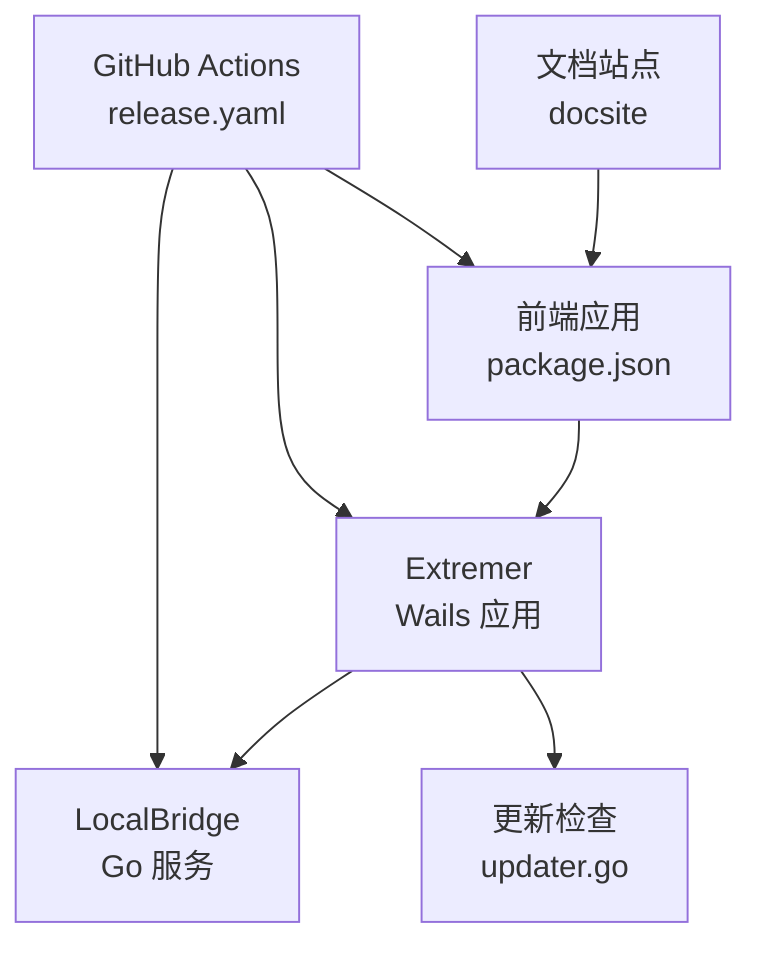
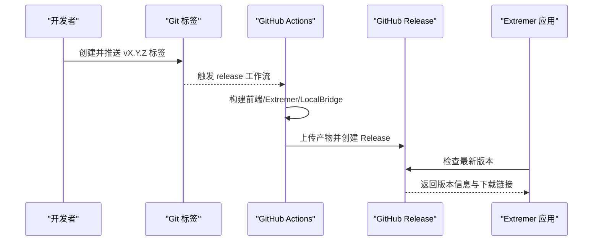
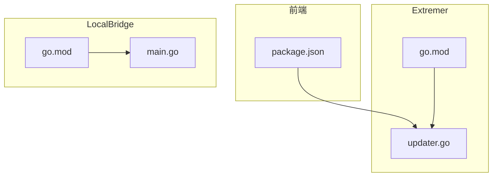

# 版本管理策略

<cite>
**本文引用的文件**
- [package.json](file://package.json)
- [Extremer/package.json](file://Extremer/package.json)
- [Extremer/go.mod](file://Extremer/go.mod)
- [LocalBridge/package.json](file://LocalBridge/package.json)
- [LocalBridge/go.mod](file://LocalBridge/go.mod)
- [.github/workflows/release.yaml](file://.github/workflows/release.yaml)
- [Extremer/internal/updater/updater.go](file://Extremer/internal/updater/updater.go)
- [LocalBridge/cmd/lb/main.go](file://LocalBridge/cmd/lb/main.go)
- [src/data/updateLogs.ts](file://src/data/updateLogs.ts)
- [src/utils/wailsBridge.ts](file://src/utils/wailsBridge.ts)
- [Extremer/frontend/wailsjs/runtime/package.json](file://Extremer/frontend/wailsjs/runtime/package.json)
</cite>

## 目录
1. [简介](#简介)
2. [项目结构](#项目结构)
3. [核心组件](#核心组件)
4. [架构总览](#架构总览)
5. [详细组件分析](#详细组件分析)
6. [依赖关系分析](#依赖关系分析)
7. [性能考量](#性能考量)
8. [故障排查指南](#故障排查指南)
9. [结论](#结论)
10. [附录](#附录)

## 简介
本策略文档旨在建立并规范本项目的版本管理方法，覆盖语义化版本控制、多组件版本协调（npm、Go 模块、Wails）、变更日志维护、发布标签与流程、兼容性与回退策略。文档基于仓库现有脚本、工作流与代码实现，确保策略可落地、可追溯、可自动化。

## 项目结构
项目采用多模块结构：
- 前端应用（React + Vite）：负责可视化编辑与用户交互
- Extremer（Wails + Go）：本地一体包，内置资源与本地服务
- LocalBridge（Go CLI）：本地服务进程，提供文件、截图、调试等能力
- 文档站点（docsite）：基于 VitePress 的静态文档
- GitHub Actions：自动化构建、打包与发布

图表来源
- [package.json:1-65](file://package.json#L1-L65)
- [.github/workflows/release.yaml:1-200](file://.github/workflows/release.yaml#L1-L200)
- [Extremer/internal/updater/updater.go:1-151](file://Extremer/internal/updater/updater.go#L1-L151)

章节来源
- [package.json:1-65](file://package.json#L1-L65)
- [.github/workflows/release.yaml:1-200](file://.github/workflows/release.yaml#L1-L200)

## 核心组件
- npm 版本与脚本：前端与文档站点使用 npm/yarn 管理版本与脚本，包含 release 与 retag 脚本，以及多模式构建（stable、extremer、preview）
- Go 模块版本：Extremer 与 LocalBridge 使用 go.mod 管理依赖与模块路径，版本号在构建时注入
- Wails 版本：Extremer 前端包含 Wails 运行时包，版本号与前端保持一致
- 发布工作流：GitHub Actions 根据标签触发，构建多平台产物并发布

章节来源
- [package.json:1-65](file://package.json#L1-L65)
- [Extremer/package.json:1-13](file://Extremer/package.json#L1-L13)
- [Extremer/go.mod:1-39](file://Extremer/go.mod#L1-L39)
- [LocalBridge/package.json:1-8](file://LocalBridge/package.json#L1-L8)
- [LocalBridge/go.mod:1-38](file://LocalBridge/go.mod#L1-L38)
- [Extremer/frontend/wailsjs/runtime/package.json:1-24](file://Extremer/frontend/wailsjs/runtime/package.json#L1-L24)

## 架构总览
版本管理贯穿开发、构建、发布与运行时更新检查四个阶段：
- 开发阶段：前端版本号在 package.json 中维护，Go 模块版本在 go.mod 中声明
- 构建阶段：CI 根据标签或手动触发，注入版本号并产出多平台产物
- 发布阶段：生成变更日志，创建 GitHub Release，上传产物
- 运行时阶段：Extremer 内置更新检查，对比远端最新版本与本地版本

图表来源
- [.github/workflows/release.yaml:402-488](file://.github/workflows/release.yaml#L402-L488)
- [Extremer/internal/updater/updater.go:43-99](file://Extremer/internal/updater/updater.go#L43-L99)

章节来源
- [.github/workflows/release.yaml:402-488](file://.github/workflows/release.yaml#L402-L488)
- [Extremer/internal/updater/updater.go:43-99](file://Extremer/internal/updater/updater.go#L43-L99)

## 详细组件分析

### 语义化版本控制与版本号管理
- 主版本（Major）：破坏性变更或协议升级，例如协议版本切换、字段结构重大调整
- 次版本（Minor）：新增功能且向后兼容，例如新增节点类型、适配新字段
- 修订版本（Patch）：向后兼容的缺陷修复与性能优化
- 预发布与元数据：遵循 semver 规范，构建与发布流程中对 v 前缀与预发布标识进行处理

章节来源
- [src/data/updateLogs.ts:28-33](file://src/data/updateLogs.ts#L28-L33)
- [Extremer/internal/updater/updater.go:72-86](file://Extremer/internal/updater/updater.go#L72-L86)
- [LocalBridge/cmd/lb/main.go:821-881](file://LocalBridge/cmd/lb/main.go#L821-L881)

### npm 版本与脚本
- 前端应用版本：在 package.json 中维护，用于文档站点与前端构建
- 发布脚本：提供 release 与 retag 脚本，便于打标签与重打标签
- 多模式构建：支持 stable、extremer、preview 等模式，分别用于不同部署目标

章节来源
- [package.json:4](file://package.json#L4)
- [package.json:17-18](file://package.json#L17-L18)
- [package.json:11-13](file://package.json#L11-L13)

### Go 模块版本与构建注入
- Extremer 模块：在 go.mod 中声明模块路径与 Go 版本，构建时通过 ldflags 注入版本号
- LocalBridge 模块：在 go.mod 中声明模块路径与依赖版本，构建时同样注入版本号
- 版本注入：工作流中根据标签或手动触发生成版本字符串并传入构建命令

章节来源
- [Extremer/go.mod:1-39](file://Extremer/go.mod#L1-L39)
- [.github/workflows/release.yaml:55-61](file://.github/workflows/release.yaml#L55-L61)
- [LocalBridge/go.mod:1-38](file://LocalBridge/go.mod#L1-L38)
- [.github/workflows/release.yaml:55-61](file://.github/workflows/release.yaml#L55-L61)

### Wails 版本与运行时桥接
- Wails 运行时版本：Extremer 前端包含 @wailsapp/runtime 包，版本号与前端保持一致
- 运行时桥接：前端通过 wailsBridge.ts 检测运行环境、监听事件、调用后端方法
- 版本一致性：Wails 版本与前端构建产物保持一致，避免运行时 API 不匹配

章节来源
- [Extremer/frontend/wailsjs/runtime/package.json:1-24](file://Extremer/frontend/wailsjs/runtime/package.json#L1-L24)
- [src/utils/wailsBridge.ts:1-131](file://src/utils/wailsBridge.ts#L1-L131)

### 变更日志维护策略
- 结构化记录：updateLogs.ts 定义更新日志的数据结构，包含版本号、日期、类型与分类
- 分类维度：features、fixes、perfs、docs、others，便于生成结构化变更日志
- 前端展示：通过可视化弹窗展示更新日志，支持置顶公告与历史版本跳转

章节来源
- [src/data/updateLogs.ts:10-33](file://src/data/updateLogs.ts#L10-L33)
- [src/data/updateLogs.ts:49-659](file://src/data/updateLogs.ts#L49-L659)

### 发布标签命名规范与流程
- 标签名：使用 vX.Y.Z 格式，遵循语义化版本
- 触发条件：push 到 v* 标签或手动触发 workflow_dispatch
- 流程步骤：构建前端、Extremer、LocalBridge，打包产物，生成变更日志，创建 Release 并上传附件

章节来源
- [.github/workflows/release.yaml:3-8](file://.github/workflows/release.yaml#L3-L8)
- [.github/workflows/release.yaml:402-488](file://.github/workflows/release.yaml#L402-L488)

### 版本兼容性与向后兼容策略
- 本地服务版本比较：LocalBridge 提供 compareVersion 函数，支持移除前缀、补齐段长、提取数字进行比较
- 运行时版本比较：Extremer 使用 go-version 库解析并比较版本，确保更新检查的准确性
- 协议兼容：项目文档强调协议版本混合导入与迁移能力，降低破坏性变更影响

章节来源
- [LocalBridge/cmd/lb/main.go:821-881](file://LocalBridge/cmd/lb/main.go#L821-L881)
- [Extremer/internal/updater/updater.go:72-86](file://Extremer/internal/updater/updater.go#L72-L86)
- [README.md:81-87](file://README.md#L81-L87)

### 版本回退与紧急修复流程
- 回退策略：通过 Git 标签与 Release 产物进行回滚，必要时使用 retag 脚本清理错误标签
- 紧急修复：在 CI 中区分 beta/test 标签，跳过不稳定版本的发布，手动触发以验证修复后再正式发布

章节来源
- [package.json:17-18](file://package.json#L17-L18)
- [.github/workflows/release.yaml:17-18](file://.github/workflows/release.yaml#L17-L18)

## 依赖关系分析
- 前端依赖：React、Ant Design、React Flow 等，版本在 package.json 中声明
- Extremer 依赖：Wails v2、go-version 等，版本在 go.mod 中声明
- LocalBridge 依赖：maa-framework-go、logrus、websocket 等，版本在 go.mod 中声明

图表来源
- [package.json:20-63](file://package.json#L20-L63)
- [Extremer/go.mod:5-8](file://Extremer/go.mod#L5-L8)
- [Extremer/internal/updater/updater.go:11](file://Extremer/internal/updater/updater.go#L11)
- [LocalBridge/go.mod:5-16](file://LocalBridge/go.mod#L5-L16)
- [LocalBridge/cmd/lb/main.go:821-881](file://LocalBridge/cmd/lb/main.go#L821-L881)

章节来源
- [package.json:20-63](file://package.json#L20-L63)
- [Extremer/go.mod:5-8](file://Extremer/go.mod#L5-L8)
- [LocalBridge/go.mod:5-16](file://LocalBridge/go.mod#L5-L16)

## 性能考量
- 版本比较算法：Go 侧使用 go-version 库进行解析与比较，避免手动解析带来的误差
- 更新检查：Extremer 通过 HTTP 请求获取最新 Release 信息，并按平台筛选下载链接，减少无效下载
- 构建缓存：GitHub Actions 使用缓存策略加速资源下载与依赖安装

章节来源
- [Extremer/internal/updater/updater.go:72-99](file://Extremer/internal/updater/updater.go#L72-L99)
- [.github/workflows/release.yaml:167-183](file://.github/workflows/release.yaml#L167-L183)

## 故障排查指南
- 版本比较异常：检查 compareVersion 与 go-version 的版本解析逻辑，确保移除前缀与预发布标识处理正确
- 更新检查失败：确认网络访问、GitHub API 权限与下载链接匹配，检查平台识别逻辑
- 构建失败：核对 go.mod 与 package.json 的模块路径与版本，确认 CI 中 ldflags 注入的版本字符串格式

章节来源
- [LocalBridge/cmd/lb/main.go:821-881](file://LocalBridge/cmd/lb/main.go#L821-L881)
- [Extremer/internal/updater/updater.go:43-99](file://Extremer/internal/updater/updater.go#L43-L99)
- [.github/workflows/release.yaml:55-61](file://.github/workflows/release.yaml#L55-L61)

## 结论
本策略文档基于仓库现有实现，建立了以语义化版本为核心、多组件协同的版本管理体系。通过 CI 自动化、结构化变更日志与运行时更新检查，确保版本演进的可控性与可追溯性。建议在后续迭代中持续完善变更日志模板与发布前评审流程，进一步提升发布质量与用户体验。

## 附录
- 版本号管理清单
  - 前端版本：package.json 中 version 字段
  - Extremer 版本：构建时注入，来源于标签或手动触发
  - LocalBridge 版本：构建时注入，来源于标签或手动触发
  - Wails 运行时版本：Extremer 前端 @wailsapp/runtime 包版本
- 发布流程清单
  - 创建并推送 vX.Y.Z 标签
  - 等待 GitHub Actions 自动构建与发布
  - 核对 Release 产物与变更日志
  - 如需紧急修复，使用 retag 清理并重新发布