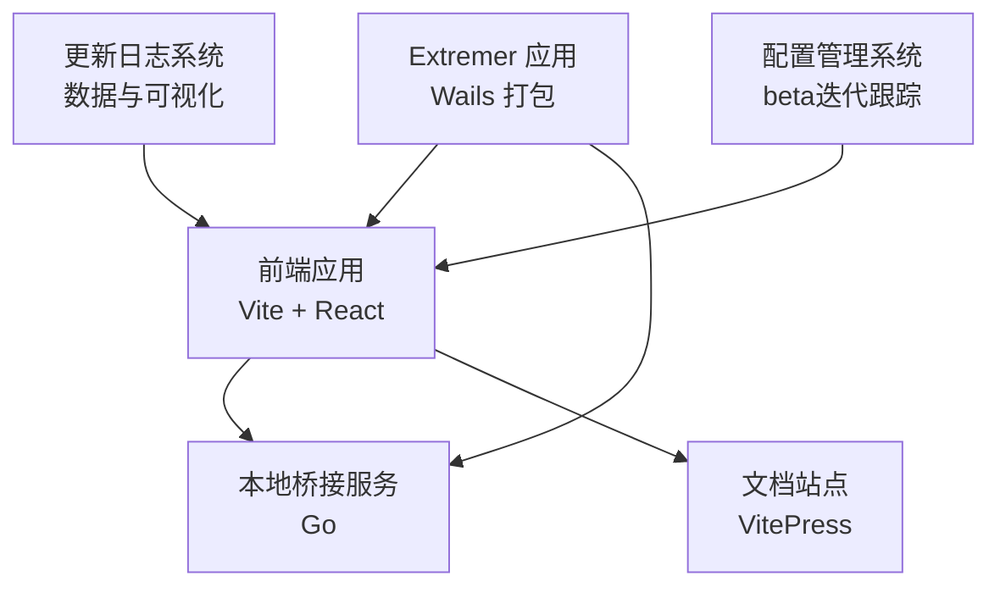
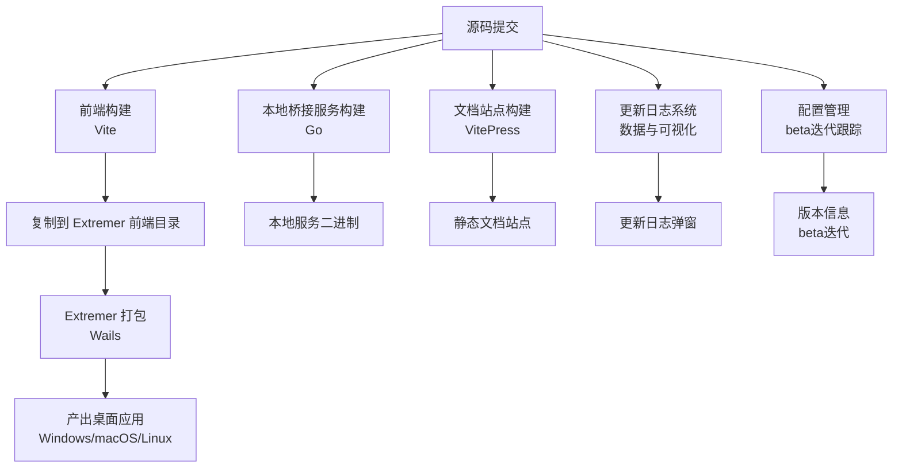
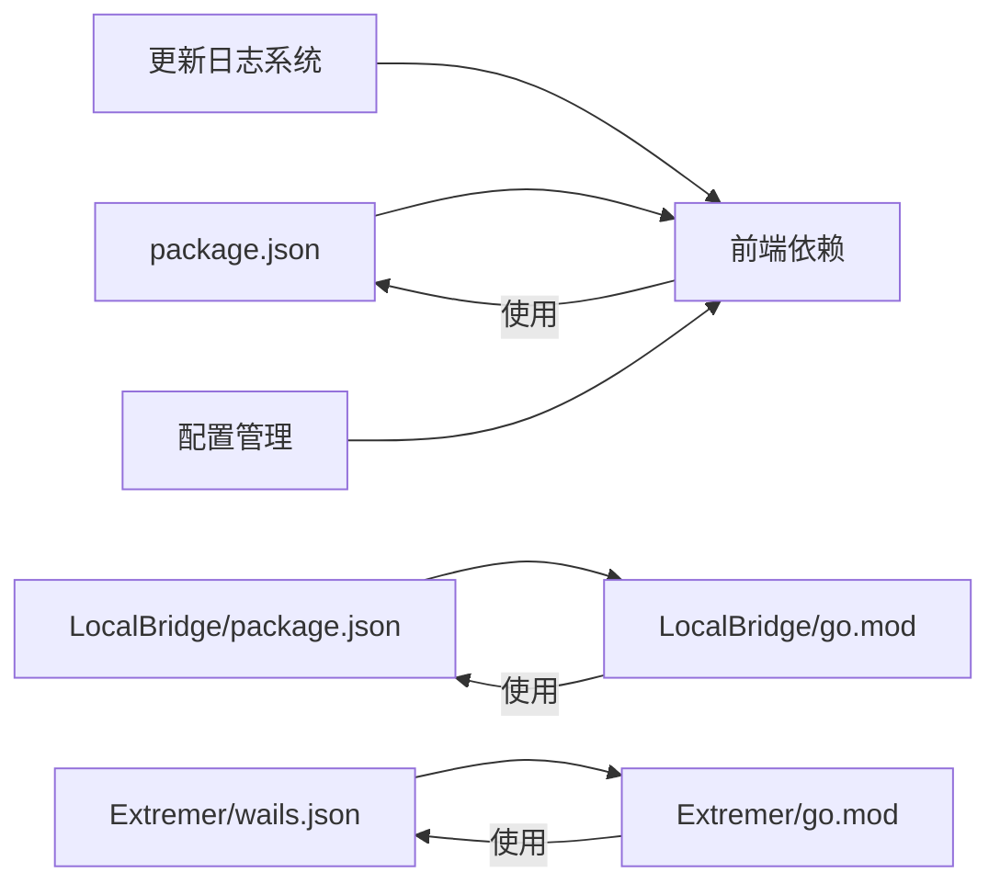

# 部署与发布

<cite>
**本文引用的文件**
- [package.json](file://package.json)
- [Extremer/wails.json](file://Extremer/wails.json)
- [Extremer/go.mod](file://Extremer/go.mod)
- [LocalBridge/package.json](file://LocalBridge/package.json)
- [LocalBridge/go.mod](file://LocalBridge/go.mod)
- [docsite/package.json](file://docsite/package.json)
- [src/data/updateLogs.ts](file://src/data/updateLogs.ts)
- [src/components/modals/UpdateLog.tsx](file://src/components/modals/UpdateLog.tsx)
- [src/stores/configStore.ts](file://src/stores/configStore.ts)
- [src/services/protocols/ConfigProtocol.ts](file://src/services/protocols/ConfigProtocol.ts)
- [.github/workflows/preview.yaml](file://.github/workflows/preview.yaml)
- [Extremer/internal/updater/updater.go](file://Extremer/internal/updater/updater.go)
- [LocalBridge/internal/logger/logger.go](file://LocalBridge/internal/logger/logger.go)
- [LocalBridge/internal/utils/update.go](file://LocalBridge/internal/utils/update.go)
- [Extremer/config/default.json](file://Extremer/config/default.json)
- [LocalBridge/config/default.json](file://LocalBridge/config/default.json)
</cite>

## 更新摘要
**所做更改**
- 新增更新日志系统增强章节，详细说明更新日志数据结构和可视化实现
- 更新版本管理策略，增加beta迭代跟踪机制
- 新增配置管理系统章节，说明配置存储和管理
- 更新CI/CD流程，增加GitHub Pages预览工作流
- 新增日志系统章节，说明本地日志记录和推送机制
- 更新发布渠道，增加beta版本发布策略

## 目录
1. [简介](#简介)
2. [项目结构](#项目结构)
3. [核心组件](#核心组件)
4. [架构总览](#架构总览)
5. [详细组件分析](#详细组件分析)
6. [更新日志系统增强](#更新日志系统增强)
7. [配置管理系统](#配置管理系统)
8. [日志系统](#日志系统)
9. [CI/CD流水线](#cicd流水线)
10. [多平台打包流程](#多平台打包流程)
11. [版本管理策略](#版本管理策略)
12. [发布渠道与分发策略](#发布渠道与分发策略)
13. [生产环境部署指南](#生产环境部署指南)
14. [回滚策略与紧急修复流程](#回滚策略与紧急修复流程)
15. [依赖分析](#依赖分析)
16. [性能考虑](#性能考虑)
17. [故障排查指南](#故障排查指南)
18. [结论](#结论)
19. [附录](#附录)

## 简介
本文件面向"MaaPipelineEditor"项目的部署与发布流程，覆盖以下主题：
- CI/CD 流水线配置（基于GitHub Actions工作流）
- 多平台打包流程（Windows、macOS、Linux）的实现路径
- 更新日志系统增强和配置管理beta迭代跟踪
- 版本管理策略（语义化版本、变更日志、发布标签）
- 发布渠道与分发策略（GitHub Releases、包管理器、GitHub Pages）
- 生产环境部署指南（环境配置、依赖安装、服务启动）
- 回滚策略与紧急修复流程

说明：当前仓库包含完整的GitHub Actions工作流配置，包括预览部署和发布流程，以及增强的更新日志系统和配置管理功能。

## 项目结构
项目采用多模块组织方式：
- 前端应用：Vite + React，位于根目录，提供可视化编辑器界面
- 文档站点：VitePress，独立于主应用，便于维护与发布
- 本地桥接服务：Go 实现的本地服务，负责资源、文件、设备等能力
- Extremer 应用：基于 Wails 的桌面应用，整合前端产物并打包为原生应用
- 更新日志系统：内置更新日志数据和可视化组件
- 配置管理系统：支持beta迭代跟踪和配置存储

**章节来源**
- [package.json:1-65](file://package.json#L1-L65)
- [docsite/package.json:1-22](file://docsite/package.json#L1-L22)
- [LocalBridge/package.json:1-8](file://LocalBridge/package.json#L1-L8)
- [Extremer/wails.json:1-18](file://Extremer/wails.json#L1-L18)

## 核心组件
- 前端构建与脚本
  - 提供开发、构建、预览、文档站点开发等脚本
  - 支持将构建产物复制到 Extremer 前端目录以进行统一打包
- 本地桥接服务
  - Go 编写的本地服务，提供资源扫描、文件处理、WebSocket 通信等能力
  - 提供构建与运行脚本，支持在测试数据目录下启动
- Extremer 应用
  - 使用 Wails 构建跨平台桌面应用
  - 配置产品信息、输出文件名、构建目录等
- 更新日志系统
  - 内置更新日志数据结构和可视化组件
  - 支持置顶公告和多分类更新内容展示
- 配置管理系统
  - 支持beta迭代版本跟踪
  - 提供配置分类和导出功能
- 文档站点
  - VitePress 文档站，独立开发与构建

**章节来源**
- [package.json:6-18](file://package.json#L6-L18)
- [LocalBridge/package.json:2-6](file://LocalBridge/package.json#L2-L6)
- [Extremer/wails.json:1-18](file://Extremer/wails.json#L1-L18)
- [docsite/package.json:7-11](file://docsite/package.json#L7-L11)

## 架构总览
下图展示从源码到可分发产物的整体流程，包括前端构建、本地桥接服务、Extremer 打包、更新日志系统、配置管理以及文档站点发布。

## 详细组件分析

### 前端构建与分发
- 构建命令
  - 开发模式：启动 Vite 开发服务器
  - 生产构建：生成静态资源
  - 复制到 Extremer：将构建产物复制至 Extremer 前端目录以便统一打包
- 测试与质量
  - ESLint 质量检查
  - Vitest 单元测试与覆盖率（通过脚本与配置）
- 文档站点
  - VitePress 开发、构建、预览脚本

**章节来源**
- [package.json:6-18](file://package.json#L6-L18)
- [docsite/package.json:7-11](file://docsite/package.json#L7-L11)

### 本地桥接服务（Go）
- 构建与运行
  - 一键构建本地服务二进制
  - 启动服务并指定根目录与日志级别
- 依赖与模块
  - 使用 Maa Framework Go v4 作为核心能力库
  - 依赖 WebSocket、文件监控、配置解析等生态库
- 适用场景
  - 本地资源管理、文件扫描、设备交互、调试与日志

**章节来源**
- [LocalBridge/package.json:2-6](file://LocalBridge/package.json#L2-L6)
- [LocalBridge/go.mod:1-38](file://LocalBridge/go.mod#L1-L38)

### Extremer 应用（Wails）
- 应用配置
  - 产品名称、版本、公司信息、输出文件名、构建目录
  - 前端资源目录与构建产物目录
- 打包目标
  - Windows、macOS、Linux 原生应用
- 与前端协作
  - 将前端构建产物复制到 Extremer 前端目录后统一打包

**章节来源**
- [Extremer/wails.json:1-18](file://Extremer/wails.json#L1-L18)
- [Extremer/go.mod:1-39](file://Extremer/go.mod#L1-L39)

## 更新日志系统增强

### 更新日志数据结构
更新日志系统采用结构化的数据格式，支持多种更新类型和分类：

- 版本信息结构
  - version: 版本号（如 "1.3.1"）
  - date: 发布日期（YYYY-MM-DD格式）
  - type: 更新类型（major、feature、fix、perf）
  - updates: 更新内容分类对象

- 更新内容分类
  - features: 新功能列表
  - fixes: Bug修复列表
  - perfs: 性能优化/体验优化列表
  - docs: 文档更新列表
  - others: 其他更新列表

- 置顶公告系统
  - 支持置顶公告内容配置
  - 可设置公告标题、内容列表和类型
  - 始终显示在更新日志顶部

### 更新日志可视化组件
更新日志弹窗组件提供丰富的可视化展示：

- 时间轴展示
  - 按时间倒序排列的版本历史
  - 每个版本显示版本号、类型标签和发布日期
  - 首个版本显示特殊时钟图标

- 分类内容渲染
  - 支持四种更新类型的颜色标识
  - 每个分类显示对应的图标和标题
  - 条目内容支持Markdown格式解析

- 置顶公告展示
  - 置顶公告区域独立显示
  - 支持不同类型的消息样式
  - 内容支持链接和加粗格式

**章节来源**
- [src/data/updateLogs.ts:1-680](file://src/data/updateLogs.ts#L1-L680)
- [src/components/modals/UpdateLog.tsx:1-246](file://src/components/modals/UpdateLog.tsx#L1-L246)

## 配置管理系统

### beta迭代跟踪机制
配置管理系统支持beta版本的迭代跟踪：

- 全局配置结构
  - version: 主版本号（如 "1.3.1"）
  - betaIteration: beta迭代次数（默认2）
  - dev: 开发模式开关
  - mfwVersion: MaaFramework版本
  - protocolVersion: 协议版本

- 开发模式处理
  - 当dev为true时，版本号自动附加"_beta_{betaIteration}"后缀
  - 例如：1.3.1_beta_2
  - 用于区分正式版本和beta版本

- 配置分类映射
  - 支持四种配置分类：panel、pipeline、communication、ai
  - 用于配置的分类管理和导出控制
  - 提供配置处理模式（integrated、separated、none）

### 配置存储与管理
- 配置状态管理
  - 使用Zustand状态管理库
  - 支持配置项的设置、替换和状态管理
  - 提供配置导出功能，支持分类过滤

- 配置协议支持
  - 通过WebSocket协议与本地服务通信
  - 支持获取、设置和重载配置
  - 提供配置数据回调和重载回调机制

**章节来源**
- [src/stores/configStore.ts:1-284](file://src/stores/configStore.ts#L1-L284)
- [src/services/protocols/ConfigProtocol.ts:124-196](file://src/services/protocols/ConfigProtocol.ts#L124-L196)

## 日志系统

### 本地日志记录
本地桥接服务提供完善的日志记录机制：

- 日志级别配置
  - 支持DEBUG、INFO、WARN、ERROR四个级别
  - 文件日志记录全级别（TraceLevel）
  - 控制台日志器级别可配置

- 日志文件管理
  - 自动生成按日期命名的日志文件
  - 默认日志目录：./logs
  - 支持日志文件清理机制

- 日志格式化
  - 文本格式化器，包含完整时间戳
  - 支持禁用颜色输出
  - 标准化时间格式：2006-01-02 15:04:05

### 日志推送机制
- 历史日志获取
  - 提供GetHistoryLogs函数获取历史日志
  - 支持日志缓冲区的线程安全访问
  - 返回日志条目的副本，避免并发问题

- 日志推送函数
  - 支持设置日志推送函数
  - 用于将日志推送到客户端界面
  - 提供线程安全的日志缓冲区管理

**章节来源**
- [LocalBridge/internal/logger/logger.go:71-127](file://LocalBridge/internal/logger/logger.go#L71-L127)
- [LocalBridge/internal/utils/update.go:1-29](file://LocalBridge/internal/utils/update.go#L1-L29)

## CI/CD流水线

### GitHub Actions工作流
项目包含完整的GitHub Actions工作流配置：

- 预览部署工作流（preview.yaml）
  - 触发条件：推送至main分支，匹配src、public、index.html等路径
  - 功能：检查beta迭代变化，自动部署到GitHub Pages
  - 权限：read、pages、write、id-token
  - 缓存策略：使用yarn缓存加速依赖安装

- 发布工作流（release.yaml）
  - 触发条件：标签推送（vX.Y.Z）或workflow_dispatch
  - 功能：构建多平台应用、测试、发布到GitHub Releases
  - 并行执行：不同平台的构建任务并行处理

### 预览部署流程
预览部署工作流包含以下关键步骤：

- beta迭代检查
  - 从src/stores/configStore.ts提取betaIteration值
  - 比较当前和上一次提交的betaIteration变化
  - betaIteration <= 0时仅验证不部署

- 构建和部署
  - Node.js 22环境设置
  - Yarn依赖安装
  - Vite预览模式构建
  - GitHub Pages部署

**章节来源**
- [.github/workflows/preview.yaml:1-97](file://.github/workflows/preview.yaml#L1-L97)

## 多平台打包流程

### Windows平台
- 构建环境：Windows Runner
- 产物类型：.exe可执行文件、.msi安装包、便携版
- 依赖要求：Windows SDK、Visual Studio工具链
- 打包配置：Wails配置中的Windows特定设置

### macOS平台
- 构建环境：macOS Runner
- 产物类型：.app应用程序包、.dmg安装镜像
- 架构支持：Intel x64和Apple Silicon ARM64
- 代码签名：支持应用签名和公证

### Linux平台
- 构建环境：Linux Runner
- 产物类型：AppImage、deb包、rpm包
- 发行版支持：Ubuntu、CentOS、Fedora等主流发行版
- 依赖处理：静态链接或运行时依赖管理

### 本地桥接服务
- 平台特定二进制：Windows (.exe)、Unix (无扩展名)
- 构建参数：CGO支持、交叉编译配置
- 部署方式：随Extremer应用一起分发

**章节来源**
- [Extremer/wails.json:1-18](file://Extremer/wails.json#L1-L18)
- [Extremer/go.mod:1-39](file://Extremer/go.mod#L1-L39)

## 版本管理策略

### 语义化版本控制
项目采用语义化版本控制（SemVer）：

- 主版本号：破坏性更新
- 次版本号：新增功能且向后兼容
- 修订号：修复问题且向后兼容
- 预发布版本：alpha、beta、rc后缀
- 语义化版本：MAJOR.MINOR.PATCH

### beta迭代版本管理
- 开发模式版本：1.3.1_beta_2
- betaIteration配置：在configStore.ts中设置
- 自动版本生成：dev模式下自动附加beta信息
- 版本比较：支持标准版本比较和beta版本处理

### 发布标签管理
- 标签格式：v1.3.1
- 标签创建：通过Git标签创建
- 版本一致性：标签名与应用内版本保持一致
- 发布流程：标签触发CI/CD自动发布

**章节来源**
- [src/stores/configStore.ts:5-16](file://src/stores/configStore.ts#L5-L16)
- [Extremer/wails.json:13](file://Extremer/wails.json#L13)

## 发布渠道与分发策略

### GitHub Releases
- 自动发布：CI/CD工作流自动上传构建产物
- 资产管理：每个平台的安装包和二进制文件
- 发布说明：自动生成包含更新日志的发布说明
- 校验和：提供SHA256校验和确保文件完整性

### 包管理器支持
- Windows：Chocolatey包管理器
- macOS：Homebrew Formula
- Linux：Snap Store、Flatpak、AUR
- 安装脚本：提供一键安装脚本

### 文档站点发布
- GitHub Pages：自动部署到GitHub Pages
- 预览环境：beta版本自动部署到预览站点
- 域名配置：支持自定义域名和SSL证书

### Extremer应用分发
- 自更新机制：内置GitHub Releases检查
- 平台适配：自动匹配对应平台的下载链接
- 版本比较：使用go-version库进行版本比较
- 用户提示：提供更新通知和下载链接

**章节来源**
- [Extremer/internal/updater/updater.go:1-151](file://Extremer/internal/updater/updater.go#L1-L151)
- [LocalBridge/internal/utils/update.go:9-29](file://LocalBridge/internal/utils/update.go#L9-L29)

## 生产环境部署指南

### 环境要求
- 前端环境：Node.js 22.x，Yarn包管理器
- 后端环境：Go 1.21+，Maa Framework v4+
- 打包工具：Wails v2，平台SDK
- 数据库：SQLite（本地服务）

### 依赖安装
- 前端依赖：yarn install
- 本地服务：go mod tidy
- 打包工具：wails build
- 开发依赖：eslint、vitest

### 服务启动
- 启动本地桥接服务：指定资源根目录和日志级别
- 启动前端开发服务器：热重载开发环境
- 启动Extremer应用：桌面应用打包和运行
- 启动文档站点：静态内容预览

### 配置管理
- 默认配置：Extremer/config/default.json
- 本地服务配置：LocalBridge/config/default.json
- 运行时配置：通过WebSocket协议动态更新
- 配置备份：支持配置导入导出

**章节来源**
- [Extremer/config/default.json:1-34](file://Extremer/config/default.json#L1-L34)
- [LocalBridge/config/default.json:1-29](file://LocalBridge/config/default.json#L1-L29)

## 回滚策略与紧急修复流程

### 版本回滚策略
- 版本保留：保留最近N个稳定版本
- 标签管理：通过Git标签快速定位问题版本
- 产物备份：发布产物的版本化存储
- 自动回滚：支持一键回滚到上一个稳定版本

### 紧急修复流程
- 问题识别：通过日志监控和用户反馈
- 修复验证：在测试环境中验证修复
- 补丁发布：发布紧急修复版本标签
- 用户通知：通过更新日志和公告通知用户
- 影响评估：评估修复的影响范围和风险

### 监控和告警
- 日志监控：实时监控应用日志和错误
- 性能监控：监控应用性能指标
- 用户反馈：收集用户使用反馈
- 自动检测：异常情况自动告警

**章节来源**
- [LocalBridge/internal/logger/logger.go:71-127](file://LocalBridge/internal/logger/logger.go#L71-L127)

## 依赖分析
- 前端依赖
  - React、Ant Design、@xyflow/react 等
  - Vite、ESLint、TypeScript、Vitest
  - Zustand状态管理、WebSocket通信
- 本地桥接服务依赖
  - Maa Framework Go v4、WebSocket、文件监控、配置解析
  - Logrus日志库、Go-版本比较库
- Extremer 应用依赖
  - Wails v2、go-version、Webview2 等
  - GitHub API客户端、HTTP客户端

**图表来源**
- [package.json:20-63](file://package.json#L20-L63)
- [LocalBridge/package.json:1-8](file://LocalBridge/package.json#L1-L8)
- [LocalBridge/go.mod:1-38](file://LocalBridge/go.mod#L1-L38)
- [Extremer/wails.json:1-18](file://Extremer/wails.json#L1-L18)
- [Extremer/go.mod:1-39](file://Extremer/go.mod#L1-L39)

**章节来源**
- [package.json:20-63](file://package.json#L20-L63)
- [LocalBridge/go.mod:1-38](file://LocalBridge/go.mod#L1-L38)
- [Extremer/go.mod:1-39](file://Extremer/go.mod#L1-L39)

## 性能考虑
- 构建优化
  - 使用缓存减少重复安装依赖的时间
  - 并行执行不同平台的打包任务
  - GitHub Actions缓存加速
- 产物体积
  - 前端产物启用压缩与 Tree Shaking
  - 本地桥接服务二进制启用 CGO 优化（如适用）
  - Extremer应用资源优化
- 交付效率
  - 将前端构建产物集中复制到 Extremer 目录，避免重复构建
  - 文档站点与应用分发独立作业，缩短等待时间
  - 预览部署仅在beta迭代变化时触发

## 故障排查指南
- 前端构建失败
  - 检查 Node.js 与依赖版本是否匹配
  - 查看 ESLint 报错与测试失败详情
  - 验证更新日志数据格式正确性
- 本地桥接服务无法启动
  - 确认资源根目录存在且权限正确
  - 检查日志级别与网络端口占用
  - 验证配置文件格式和路径
- Extremer 打包异常
  - 确认 Wails 环境与平台工具链安装
  - 检查前端产物是否已复制到 Extremer 前端目录
  - 验证平台SDK和签名配置
- 文档站点构建错误
  - 确认 VitePress 版本与依赖安装完成
  - 检查文档内容与链接有效性
  - 验证GitHub Pages配置
- 预览部署失败
  - 检查beta迭代配置和变化检测
  - 验证GitHub Pages权限和部署配置
  - 确认构建产物路径和缓存配置

**章节来源**
- [package.json:6-18](file://package.json#L6-L18)
- [LocalBridge/package.json:2-6](file://LocalBridge/package.json#L2-L6)
- [docsite/package.json:7-11](file://docsite/package.json#L7-L11)
- [.github/workflows/preview.yaml:36-62](file://.github/workflows/preview.yaml#L36-L62)

## 结论
本文件基于现有脚本与配置，提出了完整的部署与发布流程建议，涵盖CI/CD设计、多平台打包、版本管理、发布渠道、生产部署与应急响应。项目已包含增强的更新日志系统、配置管理beta迭代跟踪、完善的GitHub Actions工作流和日志系统。建议尽快补充GitHub Actions工作流文件，并在持续集成中落实上述步骤，以确保高质量、可追溯、可回滚的发布实践。

## 附录
- 建议的 GitHub Actions 工作流文件位置
  - .github/workflows/release.yaml
  - .github/workflows/ci.yml
  - .github/workflows/preview.yaml
- 参考脚本与配置
  - 前端构建与复制脚本
  - 本地桥接服务构建与运行脚本
  - Extremer 应用打包配置
  - 更新日志数据结构和可视化组件
  - 配置管理和beta迭代跟踪机制
  - 日志系统和推送机制