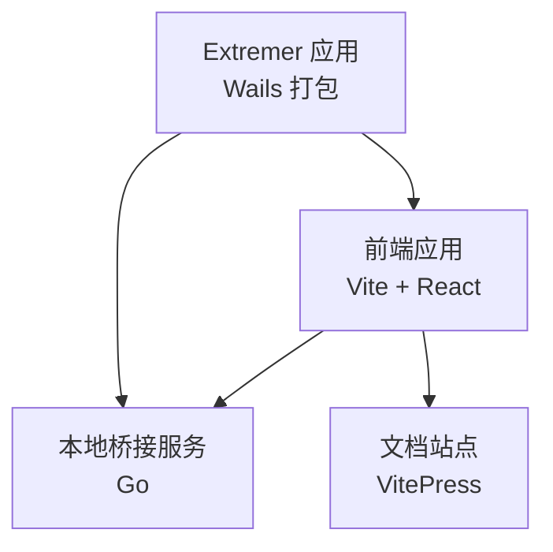
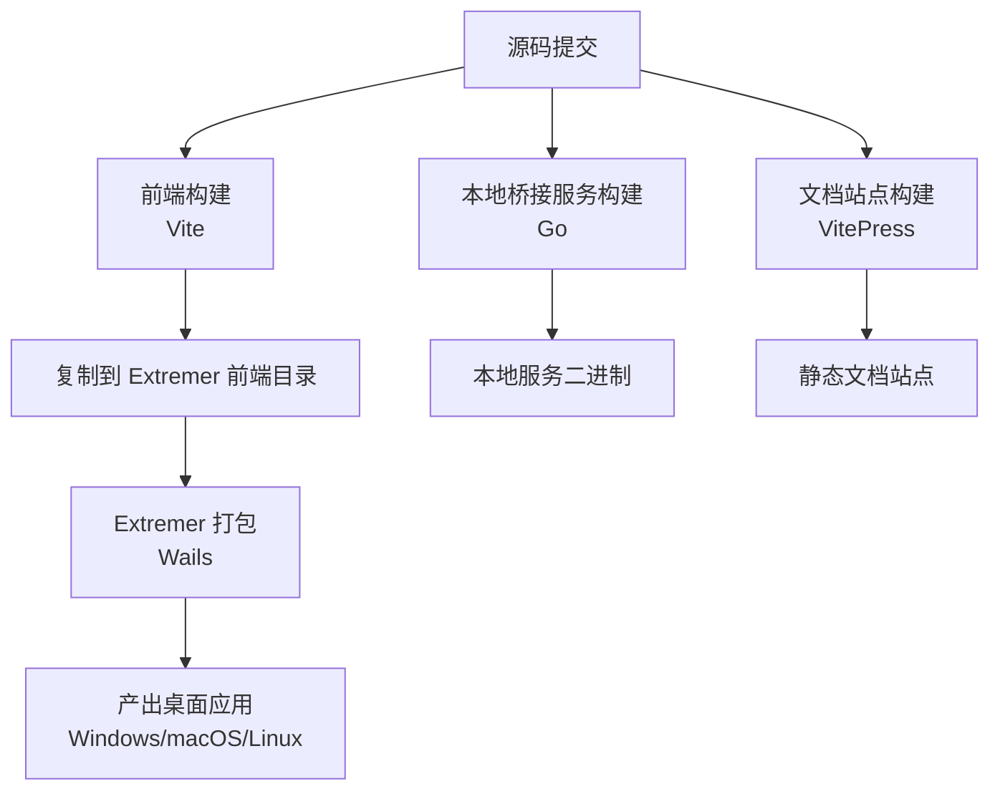
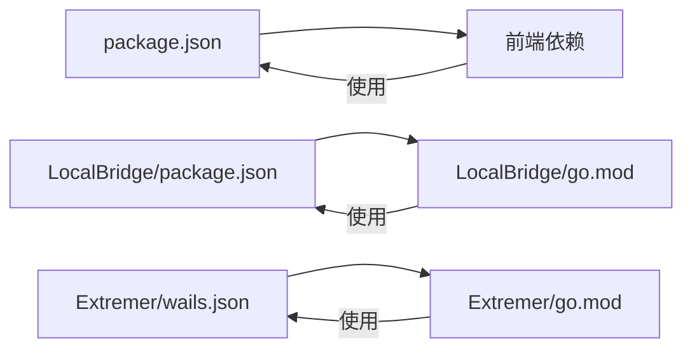

# 部署与发布

<cite>
**本文引用的文件**
- [package.json](file://package.json)
- [Extremer/wails.json](file://Extremer/wails.json)
- [Extremer/go.mod](file://Extremer/go.mod)
- [LocalBridge/package.json](file://LocalBridge/package.json)
- [LocalBridge/go.mod](file://LocalBridge/go.mod)
- [docsite/package.json](file://docsite/package.json)
</cite>

## 目录
1. [简介](#简介)
2. [项目结构](#项目结构)
3. [核心组件](#核心组件)
4. [架构总览](#架构总览)
5. [详细组件分析](#详细组件分析)
6. [依赖分析](#依赖分析)
7. [性能考虑](#性能考虑)
8. [故障排查指南](#故障排查指南)
9. [结论](#结论)
10. [附录](#附录)

## 简介
本文件面向“MaaPipelineEditor”项目的部署与发布流程，覆盖以下主题：
- CI/CD 流水线配置建议（基于现有脚本与配置）
- 多平台打包流程（Windows、macOS、Linux）的实现路径
- 版本管理策略（语义化版本、变更日志、发布标签）
- 发布渠道与分发策略（GitHub Releases、包管理器）
- 生产环境部署指南（环境配置、依赖安装、服务启动）
- 回滚策略与紧急修复流程

说明：当前仓库未包含 GitHub Actions 工作流文件，但已具备前端构建、本地桥接服务、Extremer 应用打包的基础配置与脚本，可据此设计自动化流水线。

## 项目结构
项目采用多模块组织方式：
- 前端应用：Vite + React，位于根目录，提供可视化编辑器界面
- 文档站点：VitePress，独立于主应用，便于维护与发布
- 本地桥接服务：Go 实现的本地服务，负责资源、文件、设备等能力
- Extremer 应用：基于 Wails 的桌面应用，整合前端产物并打包为原生应用

章节来源
- [package.json:1-65](file://package.json#L1-L65)
- [docsite/package.json:1-22](file://docsite/package.json#L1-L22)
- [LocalBridge/package.json:1-8](file://LocalBridge/package.json#L1-L8)
- [Extremer/wails.json:1-18](file://Extremer/wails.json#L1-L18)

## 核心组件
- 前端构建与脚本
  - 提供开发、构建、预览、文档站点开发等脚本
  - 支持将构建产物复制到 Extremer 前端目录以进行统一打包
- 本地桥接服务
  - Go 编写的本地服务，提供资源扫描、文件处理、WebSocket 通信等能力
  - 提供构建与运行脚本，支持在测试数据目录下启动
- Extremer 应用
  - 使用 Wails 构建跨平台桌面应用
  - 配置产品信息、输出文件名、构建目录等
- 文档站点
  - VitePress 文档站，独立开发与构建

章节来源
- [package.json:6-18](file://package.json#L6-L18)
- [LocalBridge/package.json:2-6](file://LocalBridge/package.json#L2-L6)
- [Extremer/wails.json:1-18](file://Extremer/wails.json#L1-L18)
- [docsite/package.json:7-11](file://docsite/package.json#L7-L11)

## 架构总览
下图展示从源码到可分发产物的整体流程，包括前端构建、本地桥接服务、Extremer 打包以及文档站点发布。

## 详细组件分析

### 前端构建与分发
- 构建命令
  - 开发模式：启动 Vite 开发服务器
  - 生产构建：生成静态资源
  - 复制到 Extremer：将构建产物复制至 Extremer 前端目录以便统一打包
- 测试与质量
  - ESLint 质量检查
  - Vitest 单元测试与覆盖率（通过脚本与配置）
- 文档站点
  - VitePress 开发、构建、预览脚本

章节来源
- [package.json:6-18](file://package.json#L6-L18)
- [docsite/package.json:7-11](file://docsite/package.json#L7-L11)

### 本地桥接服务（Go）
- 构建与运行
  - 一键构建本地服务二进制
  - 启动服务并指定根目录与日志级别
- 依赖与模块
  - 使用 Maa Framework Go v4 作为核心能力库
  - 依赖 WebSocket、文件监控、配置解析等生态库
- 适用场景
  - 本地资源管理、文件扫描、设备交互、调试与日志

章节来源
- [LocalBridge/package.json:2-6](file://LocalBridge/package.json#L2-L6)
- [LocalBridge/go.mod:1-38](file://LocalBridge/go.mod#L1-L38)

### Extremer 应用（Wails）
- 应用配置
  - 产品名称、版本、公司信息、输出文件名、构建目录
  - 前端资源目录与构建产物目录
- 打包目标
  - Windows、macOS、Linux 原生应用
- 与前端协作
  - 将前端构建产物复制到 Extremer 前端目录后统一打包

章节来源
- [Extremer/wails.json:1-18](file://Extremer/wails.json#L1-L18)
- [Extremer/go.mod:1-39](file://Extremer/go.mod#L1-L39)

### CI/CD 流水线设计（建议）
说明：当前仓库未包含 GitHub Actions 工作流文件，以下为基于现有脚本与配置的流水线设计建议。

- 触发条件
  - 推送至分支：master/main 或 release/*，触发构建与测试
  - 标签推送：vX.Y.Z 触发发布流程
  - PR：仅运行测试与质量检查，不打包
- 步骤建议
  - 安装依赖：Node.js、Go、Wails（如需）
  - 前端构建：执行生产构建
  - 复制前端产物到 Extremer
  - Extremer 打包：分别针对 Windows、macOS、Linux
  - 本地桥接服务构建：生成各平台二进制
  - 文档站点构建：生成静态站点
  - 测试：ESLint、单元测试、集成测试
  - 发布：上传 Artifacts 至 GitHub Releases，生成变更日志
- 安全与缓存
  - 使用缓存加速依赖安装
  - 秘钥与令牌使用加密变量注入

（本节为概念性设计，不直接分析具体文件）

### 多平台打包流程（Windows/macOS/Linux）
- Windows
  - 在 Windows Runner 上执行 Extremer 打包
  - 生成 .exe/.msi 安装包或便携版
- macOS
  - 在 macOS Runner 上执行 Extremer 打包
  - 生成 .app 包与 .dmg 安装镜像
- Linux
  - 在 Linux Runner 上执行 Extremer 打包
  - 生成 AppImage、deb、rpm 等格式
- 本地桥接服务
  - 为各平台分别构建二进制（Windows: .exe；Unix: 无扩展名）

（本节为概念性设计，不直接分析具体文件）

### 版本管理策略
- 语义化版本
  - 主版本号：破坏性更新
  - 次版本号：新增功能且向后兼容
  - 修订号：修复问题且向后兼容
- 变更日志
  - 使用 Keep a Changelog 风格，按版本记录新增、修复、改动
  - 在发布前更新 CHANGELOG.md 并与标签同步
- 发布标签
  - 使用 Git 标签 v1.2.3 推送触发 CI 发布
  - 标签名与应用内版本保持一致（如 Extremer/wails.json 中的产品版本）

章节来源
- [Extremer/wails.json:13](file://Extremer/wails.json#L13)
- [package.json:17-18](file://package.json#L17-L18)

### 发布渠道与分发策略
- GitHub Releases
  - 上传各平台二进制与安装包
  - 附带变更日志与校验摘要
- 包管理器
  - Windows：Chocolatey（可选）
  - macOS：Homebrew（可选）
  - Linux：Snap/Flatpak（可选）
- 文档站点
  - 部署至静态托管（如 GitHub Pages、Vercel）

（本节为概念性设计，不直接分析具体文件）

### 生产环境部署指南
- 环境要求
  - 前端：Node.js（与项目中版本一致）
  - 后端：Go（与模块版本一致）
  - Wails（如需本地打包）
- 依赖安装
  - 前端：yarn 安装
  - 本地桥接服务：go mod tidy
- 服务启动
  - 启动本地桥接服务（指定资源根目录与日志级别）
  - 启动前端开发服务器
- 文档站点
  - 构建并部署静态站点

章节来源
- [package.json:6-18](file://package.json#L6-L18)
- [LocalBridge/package.json:2-6](file://LocalBridge/package.json#L2-L6)
- [docsite/package.json:7-11](file://docsite/package.json#L7-L11)

### 回滚策略与紧急修复流程
- 回滚策略
  - 保留最近 N 个稳定版本的安装包与二进制
  - 通过标签与发布说明快速定位问题版本
  - 使用降级脚本或安装器回退到上一个稳定版本
- 紧急修复
  - 修复后立即打补丁版本标签并重新发布
  - 在发布说明中标注紧急修复与影响范围
  - 对受影响用户发送通知与升级指引

（本节为概念性设计，不直接分析具体文件）

## 依赖分析
- 前端依赖
  - React、Ant Design、@xyflow/react 等
  - Vite、ESLint、TypeScript、Vitest
- 本地桥接服务依赖
  - Maa Framework Go v4、WebSocket、文件监控、配置解析
- Extremer 应用依赖
  - Wails v2、go-version、Webview2 等

图表来源
- [package.json:20-63](file://package.json#L20-L63)
- [LocalBridge/package.json:1-8](file://LocalBridge/package.json#L1-L8)
- [LocalBridge/go.mod:1-38](file://LocalBridge/go.mod#L1-L38)
- [Extremer/wails.json:1-18](file://Extremer/wails.json#L1-L18)
- [Extremer/go.mod:1-39](file://Extremer/go.mod#L1-L39)

章节来源
- [package.json:20-63](file://package.json#L20-L63)
- [LocalBridge/go.mod:1-38](file://LocalBridge/go.mod#L1-L38)
- [Extremer/go.mod:1-39](file://Extremer/go.mod#L1-L39)

## 性能考虑
- 构建优化
  - 使用缓存减少重复安装依赖的时间
  - 并行执行不同平台的打包任务
- 产物体积
  - 前端产物启用压缩与 Tree Shaking
  - 本地桥接服务二进制启用 CGO 优化（如适用）
- 交付效率
  - 将前端构建产物集中复制到 Extremer 目录，避免重复构建
  - 文档站点与应用分发独立作业，缩短等待时间

（本节为一般性建议，不直接分析具体文件）

## 故障排查指南
- 前端构建失败
  - 检查 Node.js 与依赖版本是否匹配
  - 查看 ESLint 报错与测试失败详情
- 本地桥接服务无法启动
  - 确认资源根目录存在且权限正确
  - 检查日志级别与网络端口占用
- Extremer 打包异常
  - 确认 Wails 环境与平台工具链安装
  - 检查前端产物是否已复制到 Extremer 前端目录
- 文档站点构建错误
  - 确认 VitePress 版本与依赖安装完成
  - 检查文档内容与链接有效性

章节来源
- [package.json:6-18](file://package.json#L6-L18)
- [LocalBridge/package.json:2-6](file://LocalBridge/package.json#L2-L6)
- [docsite/package.json:7-11](file://docsite/package.json#L7-L11)

## 结论
本文件基于现有脚本与配置，提出了完整的部署与发布流程建议，涵盖 CI/CD 设计、多平台打包、版本管理、发布渠道、生产部署与应急响应。建议尽快补充 GitHub Actions 工作流文件，并在持续集成中落实上述步骤，以确保高质量、可追溯、可回滚的发布实践。

## 附录
- 建议的 GitHub Actions 工作流文件位置
  - .github/workflows/release.yml
  - .github/workflows/ci.yml
- 参考脚本与配置
  - 前端构建与复制脚本
  - 本地桥接服务构建与运行脚本
  - Extremer 应用打包配置

（本节为概念性内容，不直接分析具体文件）