# 门面站点建设规划

<cite>
**本文档引用的文件**
- [README.md](file://README.md)
- [App.tsx](file://src/App.tsx)
- [main.tsx](file://src/main.tsx)
- [Header.tsx](file://src/components/Header.tsx)
- [shareHelper.ts](file://src/utils/shareHelper.ts)
- [server.ts](file://src/services/server.ts)
- [package.json](file://package.json)
- [vite.config.ts](file://vite.config.ts)
- [wails.json](file://Extremer/wails.json)
- [go.mod](file://LocalBridge/go.mod)
- [package.json](file://docsite/package.json)
- [index.md](file://docsite/docs/index.md)
- [config.ts](file://docsite/docs/.vitepress/config.ts)
- [目录.md](file://docsite/docs/01.指南/目录.md)
- [package.json](file://Landing/package.json)
- [astro.config.mjs](file://Landing/astro.config.mjs)
- [tsconfig.json](file://Landing/tsconfig.json)
- [playwright.config.ts](file://Landing/playwright.config.ts)
- [landing.spec.ts](file://Landing/tests/landing.spec.ts)
- [site-config.ts](file://Landing/src/lib/site-config.ts)
- [landing.ts](file://Landing/src/content/landing.ts)
- [HeroWorkflowScene.astro](file://Landing/src/components/HeroWorkflowScene.astro)
- [LandingHeader.astro](file://Landing/src/components/LandingHeader.astro)
- [LandingFooter.astro](file://Landing/src/components/LandingFooter.astro)
- [FinalCtaSection.astro](file://Landing/src/components/FinalCtaSection.astro)
- [index.astro](file://Landing/src/pages/index.astro)
- [LandingShell.astro](file://Landing/src/layouts/LandingShell.astro)
- [FeatureExplorer.tsx](file://Landing/src/components/FeatureExplorer.tsx)
- [MobileNav.tsx](file://Landing/src/components/MobileNav.tsx)
- [ShowcaseGrid.astro](file://Landing/src/components/ShowcaseGrid.astro)
- [TrustStats.astro](file://Landing/src/components/TrustStats.astro)
- [global.css](file://Landing/src/styles/global.css)
</cite>

## 更新摘要
**变更内容**
- Landing 页面系统已从概念规划发展为完整的 Astro + React + TailwindCSS 实现
- HeroWorkflowScene 组件升级为复杂的 ComfyUI 风格工作流画布，包含 5 种节点类型、状态面板、性能优化
- 新增完整的页面结构、组件体系和测试覆盖
- 实现响应式设计和品牌资产统一（logo.png）
- 建立完整的类型安全内容管理系统

## 目录
1. [项目概述](#项目概述)
2. [项目结构](#项目结构)
3. [核心组件](#核心组件)
4. [架构概览](#架构概览)
5. [详细组件分析](#详细组件分析)
6. [Landing 页面实现](#landing-页面实现)
7. [依赖分析](#依赖分析)
8. [性能考虑](#性能考虑)
9. [故障排除指南](#故障排除指南)
10. [结论](#结论)
11. [附录](#附录)

## 项目概述

MaaPipelineEditor 是一款专注于 MaaFramework Pipeline 的可视化工作流编辑器。该项目采用前后端分离架构，结合了现代化的前端技术栈和强大的本地服务扩展能力。

### 产品定位

- **核心价值**：将复杂的 Pipeline JSON 转换为直观的可视化工作流
- **目标用户**：MaaFramework 资源开发者、自动化流程开发者、需要维护复杂 Pipeline 的协作者
- **技术特色**：基于 React 19、TypeScript 5.8、React Flow 12 的现代化前端架构

### 技术架构

```mermaid
graph TB
subgraph "前端应用"
FE[React 19 应用]
WS[WebSocket 服务]
UI[Ant Design 组件]
end
subgraph "营销网站"
LANDING[Landing 页面]
ASTRO[Astro 5.13.5]
REACT[React 19]
TAILWIND[TailwindCSS]
end
subgraph "本地服务"
LB[LocalBridge 本地桥接]
MFW[MaaFramework 框架]
DEV[设备连接]
end
subgraph "外部服务"
DOC[文档站]
CDN[CDN 部署]
GH[GitHub Pages]
END
FE --> WS
FE --> UI
LANDING --> ASTRO
ASTRO --> REACT
ASTRO --> TAILWIND
WS --> LB
LB --> MFW
LB --> DEV
FE --> DOC
FE --> CDN
FE --> GH
```

**图表来源**
- [App.tsx:111-333](file://src/App.tsx#L111-L333)
- [server.ts:20-373](file://src/services/server.ts#L20-L373)
- [package.json:14-25](file://Landing/package.json#L14-L25)

## 项目结构

项目采用模块化组织方式，主要包含以下核心目录：

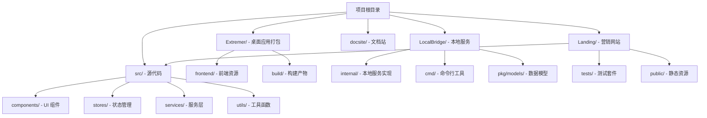

**图表来源**
- [package.json:1-66](file://package.json#L1-L66)
- [Extremer/wails.json:1-17](file://Extremer/wails.json#L1-L17)
- [Landing/package.json:1-35](file://Landing/package.json#L1-35)

**章节来源**
- [package.json:1-66](file://package.json#L1-L66)
- [Extremer/wails.json:1-17](file://Extremer/wails.json#L1-L17)
- [Landing/package.json:1-35](file://Landing/package.json#L1-35)

## 核心组件

### 前端应用架构

前端应用采用 React 19 的现代化架构，集成了多个核心组件：

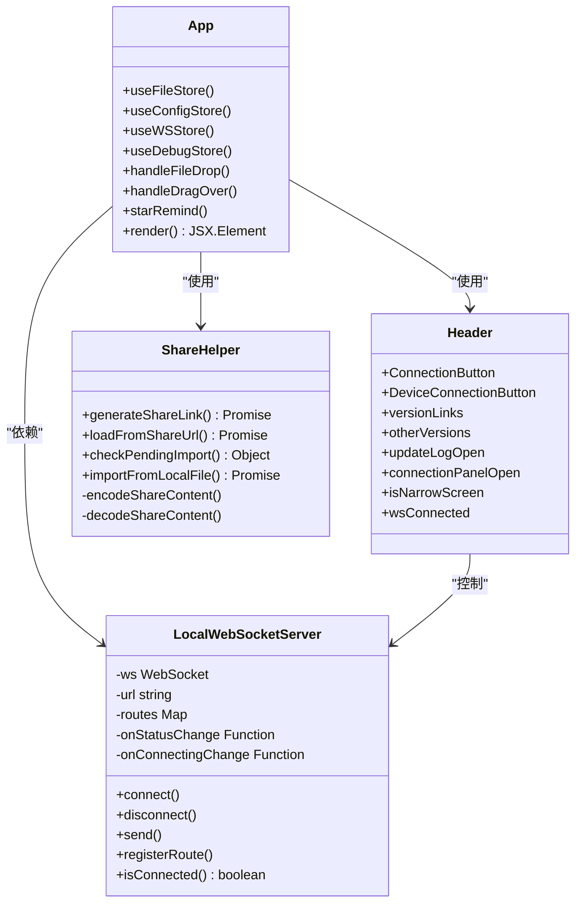

**图表来源**
- [App.tsx:111-333](file://src/App.tsx#L111-L333)
- [Header.tsx:226-424](file://src/components/Header.tsx#L226-L424)
- [server.ts:20-331](file://src/services/server.ts#L20-L331)
- [shareHelper.ts:79-340](file://src/utils/shareHelper.ts#L79-L340)

### 本地服务架构

LocalBridge 提供了强大的本地服务扩展能力：

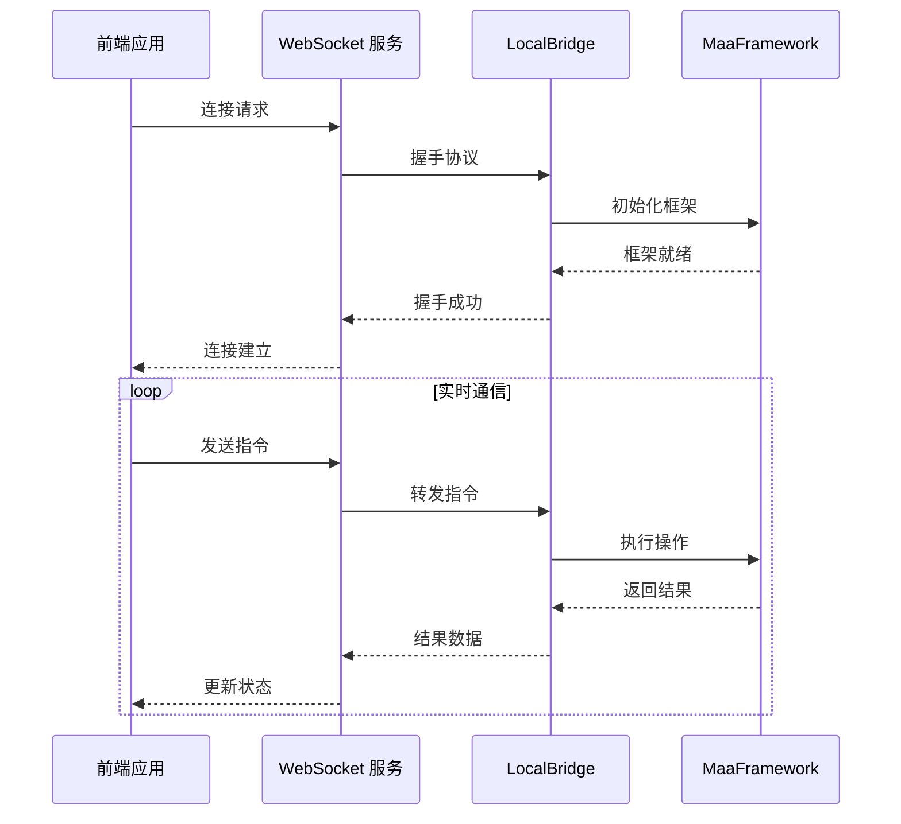

**图表来源**
- [server.ts:105-251](file://src/services/server.ts#L105-L251)
- [server.ts:269-283](file://src/services/server.ts#L269-L283)

**章节来源**
- [App.tsx:111-333](file://src/App.tsx#L111-L333)
- [Header.tsx:226-424](file://src/components/Header.tsx#L226-L424)
- [server.ts:20-373](file://src/services/server.ts#L20-L373)

## 架构概览

### 技术栈架构

项目采用了多层次的技术架构设计：

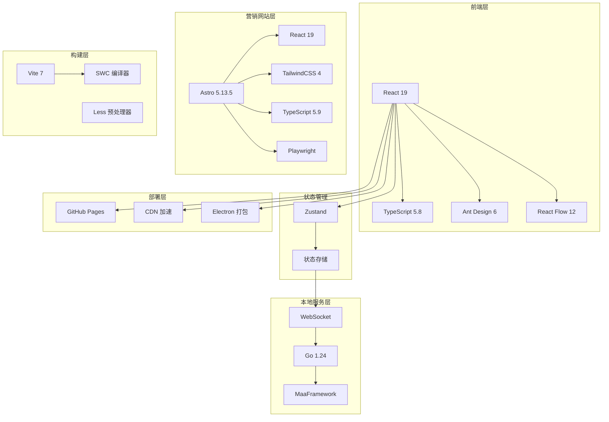

**图表来源**
- [package.json:20-42](file://package.json#L20-L42)
- [package.json:43-65](file://package.json#L43-L65)
- [Extremer/wails.json:1-17](file://Extremer/wails.json#L1-L17)
- [Landing/package.json:14-25](file://Landing/package.json#L14-L25)

### 数据流架构

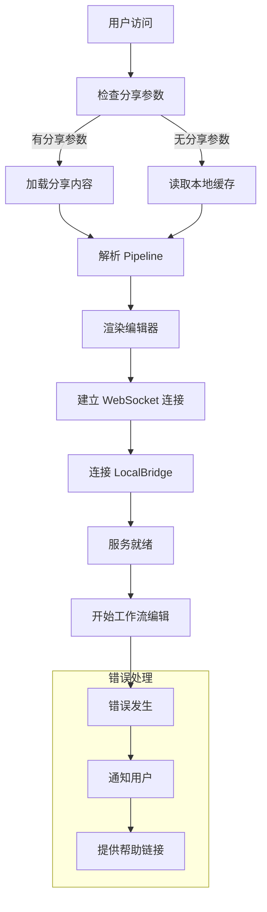

**图表来源**
- [App.tsx:150-293](file://src/App.tsx#L150-L293)
- [shareHelper.ts:209-254](file://src/utils/shareHelper.ts#L209-L254)

**章节来源**
- [package.json:1-66](file://package.json#L1-L66)
- [vite.config.ts:1-41](file://vite.config.ts#L1-L41)
- [Extremer/wails.json:1-17](file://Extremer/wails.json#L1-L17)

## 详细组件分析

### 应用主组件分析

App.tsx 作为应用的核心组件，承担着多重职责：

#### 生命周期管理

应用在挂载时执行多项初始化操作：

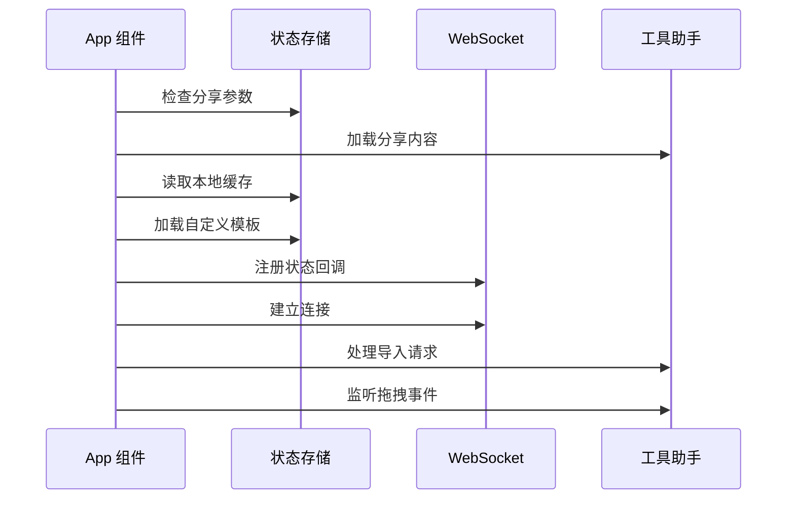

**图表来源**
- [App.tsx:150-293](file://src/App.tsx#L150-L293)

#### 连接管理机制

WebSocket 连接采用智能连接策略：

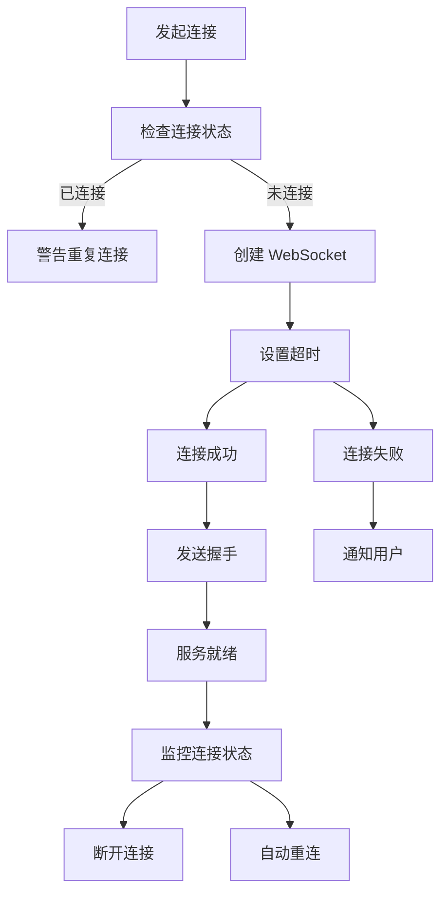

**图表来源**
- [server.ts:105-251](file://src/services/server.ts#L105-L251)

**章节来源**
- [App.tsx:111-333](file://src/App.tsx#L111-L333)
- [server.ts:20-373](file://src/services/server.ts#L20-L373)

### 头部组件分析

Header.tsx 提供了完整的导航和状态管理功能：

#### 版本管理系统

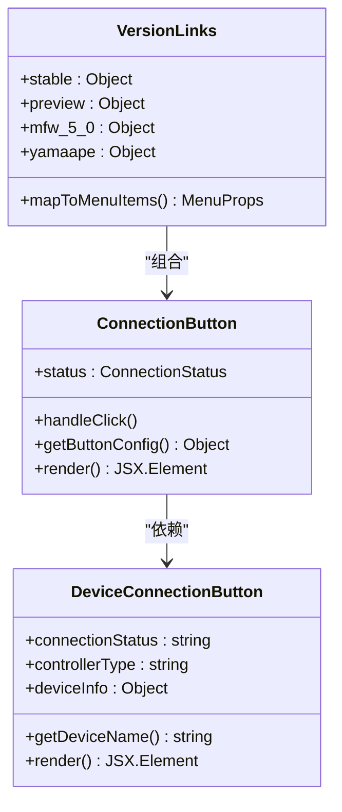

**图表来源**
- [Header.tsx:35-63](file://src/components/Header.tsx#L35-L63)
- [Header.tsx:67-159](file://src/components/Header.tsx#L67-L159)
- [Header.tsx:162-224](file://src/components/Header.tsx#L162-L224)

#### 状态监控机制

头部组件实现了多维度的状态监控：

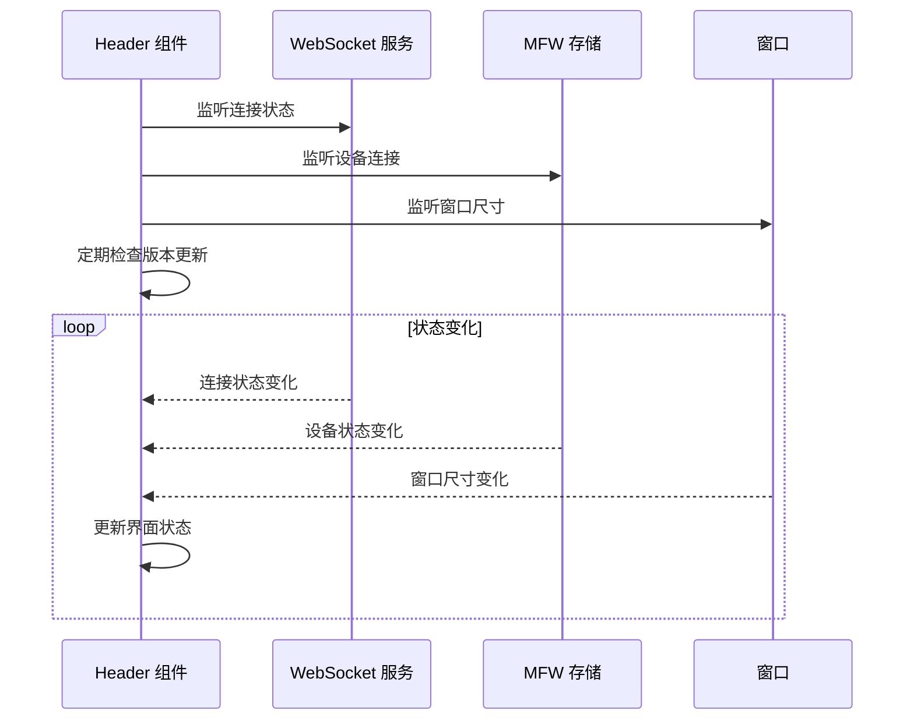

**图表来源**
- [Header.tsx:234-277](file://src/components/Header.tsx#L234-L277)
- [Header.tsx:257-265](file://src/components/Header.tsx#L257-L265)

**章节来源**
- [Header.tsx:226-424](file://src/components/Header.tsx#L226-L424)

### 分享功能分析

shareHelper.ts 提供了完整的分享和导入功能：

#### 分享链接生成流程

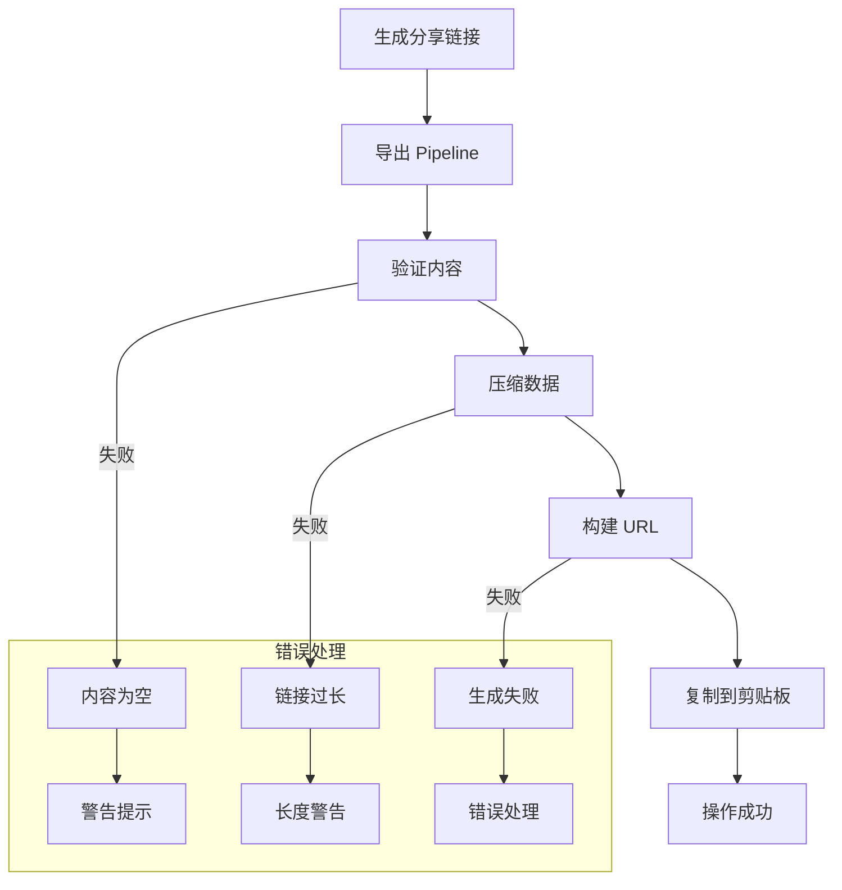

**图表来源**
- [shareHelper.ts:79-115](file://src/utils/shareHelper.ts#L79-L115)

#### 导入功能实现

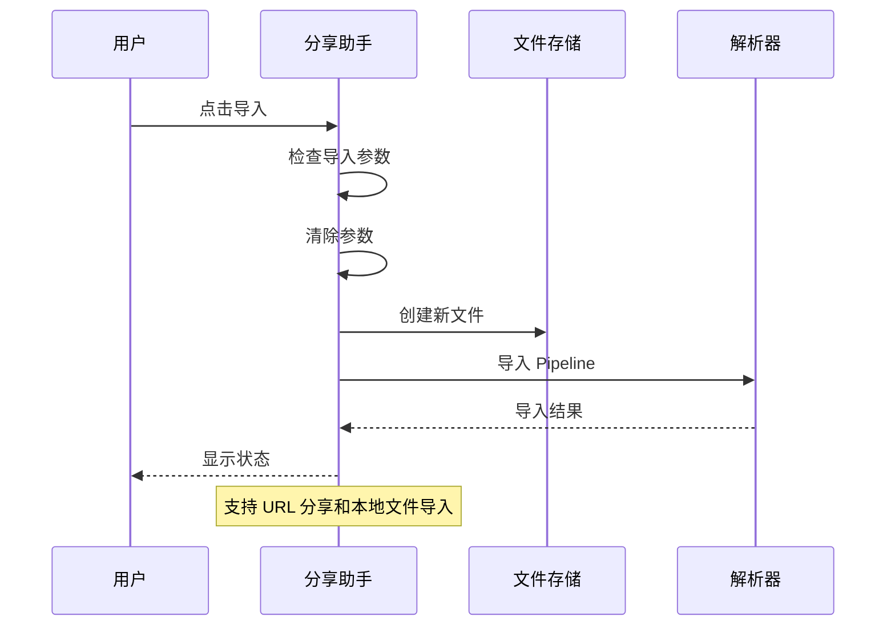

**图表来源**
- [shareHelper.ts:191-203](file://src/utils/shareHelper.ts#L191-L203)
- [shareHelper.ts:273-340](file://src/utils/shareHelper.ts#L273-L340)

**章节来源**
- [shareHelper.ts:1-340](file://src/utils/shareHelper.ts#L1-340)

## Landing 页面实现

### Landing 页面架构

Landing 页面是一个基于 Astro 5.13.5 + React 的专业营销网站，采用了现代化的前端架构：

```mermaid
graph TB
subgraph "Landing 页面架构"
INDEX[index.astro - 主页面]
LAYOUT[LandingShell.astro - 页面外壳]
HEADER[LandingHeader.astro - 顶部导航]
HERO[HeroWorkflowScene.astro - 工作流画布]
FEATURE[FeatureExplorer.tsx - 功能展示]
SHOWCASE[ShowcaseGrid.astro - 使用场景]
CTA[FinalCtaSection.astro - 最终行动]
MOBILE[MobileNav.tsx - 移动端导航]
FOOTER[LandingFooter.astro - 底部组件]
END
INDEX --> LAYOUT
INDEX --> HEADER
INDEX --> HERO
INDEX --> FEATURE
INDEX --> SHOWCASE
INDEX --> CTA
LAYOUT --> HEADER
LAYOUT --> HERO
LAYOUT --> FEATURE
LAYOUT --> SHOWCASE
LAYOUT --> CTA
LAYOUT --> MOBILE
LAYOUT --> FOOTER
```

**图表来源**
- [index.astro:1-137](file://Landing/src/pages/index.astro#L1-L137)
- [LandingShell.astro:1-138](file://Landing/src/layouts/LandingShell.astro#L1-L138)
- [LandingHeader.astro:1-73](file://Landing/src/components/LandingHeader.astro#L1-L73)
- [HeroWorkflowScene.astro:1-281](file://Landing/src/components/HeroWorkflowScene.astro#L1-L281)
- [FeatureExplorer.tsx:1-253](file://Landing/src/components/FeatureExplorer.tsx#L1-L253)
- [MobileNav.tsx:1-118](file://Landing/src/components/MobileNav.tsx#L1-L118)
- [LandingFooter.astro:1-67](file://Landing/src/components/LandingFooter.astro#L1-L67)

### 核心组件分析

#### Hero 工作流画布组件

HeroWorkflowScene.astro 已从简单的动画升级为复杂的 ComfyUI 风格工作流画布，实现了以下重大改进：

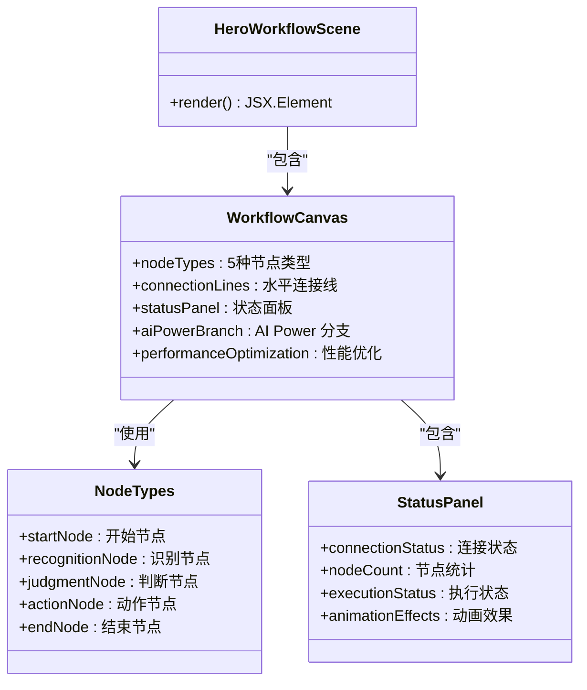

工作流画布包含 5 种不同类型的节点，每种节点都有独特的颜色主题和图标：

- **开始节点** (`startNode`) - 绿色边框，播放图标，表示流程起点
- **识别节点** (`recognitionNode`) - 蓝色边框，眼睛图标，表示图像识别功能
- **判断节点** (`judgmentNode`) - 紫色边框，问号图标，表示条件判断
- **动作节点** (`actionNode`) - 橙色边框，手势图标，表示具体操作
- **结束节点** (`endNode`) - 绿色边框，勾选图标，表示流程终点

状态面板包含三个关键信息区域：
- **连接状态** - 显示 LocalBridge 连接状态，带有脉冲动画效果
- **节点统计** - 显示当前激活的节点数量（24个）
- **执行状态** - 显示最后运行时间（2分钟前）和进度条

AI Power 分支展示了智能辅助功能，包含三个状态指示器：
- **AI Power 标题** - 蓝色主题的分支标题
- **智能状态** - 显示 AI 辅助功能的激活状态
- **进度指示** - 展示执行进度的可视化条形图

**图表来源**
- [HeroWorkflowScene.astro:34-156](file://Landing/src/components/HeroWorkflowScene.astro#L34-L156)
- [HeroWorkflowScene.astro:160-188](file://Landing/src/components/HeroWorkflowScene.astro#L160-L188)

#### 导航系统

LandingHeader.astro 实现了响应式的导航系统，使用实际 logo.png 资产：

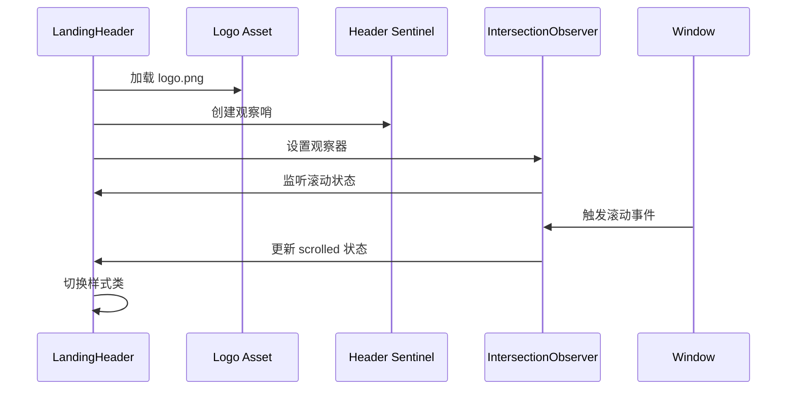

头部组件现在使用实际的 logo.png 资产替代之前的渐变圆形，提供更好的视觉质量和品牌一致性。

**图表来源**
- [LandingHeader.astro:21-32](file://Landing/src/components/LandingHeader.astro#L21-L32)
- [LandingHeader.astro:81-116](file://Landing/src/components/LandingHeader.astro#L81-L116)

#### 底部组件

LandingFooter.astro 使用相同的 logo.png 资产：

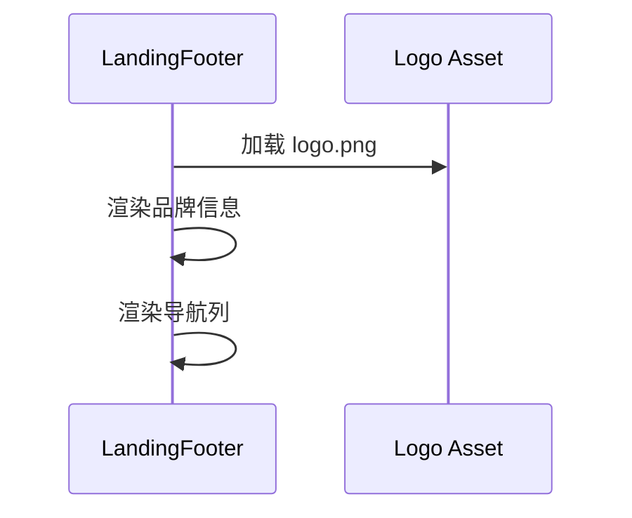

底部组件同样使用实际的 logo.png 资产，确保在整个网站中保持一致的品牌形象。

**图表来源**
- [LandingFooter.astro:16-27](file://Landing/src/components/LandingFooter.astro#L16-L27)

### 内容管理系统

landing.ts 提供了完整的类型安全内容管理系统，包含更直接的价值主张：

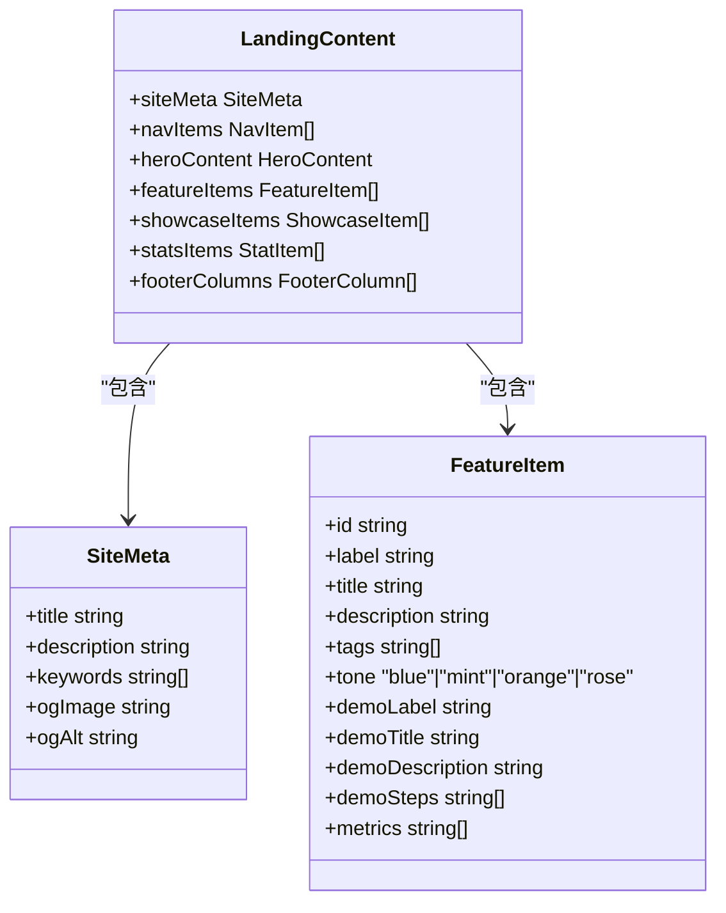

landing.ts 已完全重写，提供更直接和清晰的价值主张，包括：

- **英雄内容** (`heroContent`) - 包含标题、描述、强调项目核心价值
- **功能项** (`featureItems`) - 5个核心功能的详细说明，每个功能都有特定的颜色主题
- **展示项** (`showcaseItems`) - 4个使用场景的案例描述
- **统计数据** (`statsItems`) - 项目里程碑和生态系统信息
- **页脚列** (`footerColumns`) - 4个导航列的组织结构

**图表来源**
- [landing.ts:71-507](file://Landing/src/content/landing.ts#L71-L507)

**章节来源**
- [Landing/package.json:1-35](file://Landing/package.json#L1-35)
- [astro.config.mjs:1-19](file://Landing/astro.config.mjs#L1-L19)
- [tsconfig.json:1-21](file://Landing/tsconfig.json#L1-21)
- [landing.spec.ts:1-61](file://Landing/tests/landing.spec.ts#L1-L61)

## 依赖分析

### 核心依赖关系

项目采用了精心设计的依赖管理策略：

```mermaid
graph TB
subgraph "运行时依赖"
REACT[react@^19.1.0]
DOM[react-dom@^19.1.0]
ANTD[antd@6]
FLOW[@xyflow/react@^12.7.1]
ZUSTAND[zustand@^5.0.7]
MONACO[@monaco-editor/react@^4.7.0]
end
subgraph "营销网站依赖"
ASTRO[astro@^5.13.5]
REACT_LANDING[@astrojs/react@^4.3.0]
TAILWIND[@tailwindcss/vite@^4.1.12]
TYPESCRIPT_TS[typescript@^5.9.2]
PLAYWRIGHT[@playwright/test@^1.55.0]
end
subgraph "开发依赖"
VITE[vite@^7.0.0]
SWC[@vitejs/plugin-react-swc@^3.10.2]
TYPESCRIPT[typescript@~5.8.3]
ESLINT[eslint@^9.29.0]
TESTING[vitest@^4.0.14]
end
subgraph "本地服务依赖"
GOFRAMEWORK[github.com/MaaXYZ/maa-framework-go/v4]
WEBSOCKET[golang.org/x/sys]
FSNOTIFY[github.com/fsnotify/fsnotify]
UUID[github.com/google/uuid]
end
REACT --> DOM
REACT --> ANTD
REACT --> FLOW
REACT --> ZUSTAND
REACT --> MONACO
ASTRO --> REACT_LANDING
ASTRO --> TAILWIND
ASTRO --> TYPESCRIPT_TS
ASTRO --> PLAYWRIGHT
VITE --> SWC
VITE --> TYPESCRIPT
VITE --> ESLINT
GOFRAMEWORK --> WEBSOCKET
GOFRAMEWORK --> FSNOTIFY
GOFRAMEWORK --> UUID
```

**图表来源**
- [package.json:20-42](file://package.json#L20-L42)
- [package.json:43-65](file://package.json#L43-L65)
- [LocalBridge/go.mod:5-16](file://LocalBridge/go.mod#L5-L16)
- [Landing/package.json:14-33](file://Landing/package.json#L14-L33)

### 构建配置分析

Vite 配置支持多环境构建：

| 模式 | 基础路径 | 用途 | 特殊配置 |
|------|----------|------|----------|
| stable | `/stable/` | 稳定版本部署 | 标准生产环境 |
| preview | `/MaaPipelineEditor/` | 预览版本 | GitHub Pages |
| extremer | `./` | 桌面应用打包 | 相对路径 |
| landing | `/` | 营销网站 | Astro 静态站点 |

**章节来源**
- [package.json:1-66](file://package.json#L1-L66)
- [vite.config.ts:5-13](file://vite.config.ts#L5-L13)
- [LocalBridge/go.mod:1-38](file://LocalBridge/go.mod#L1-L38)
- [Landing/astro.config.mjs:7-18](file://Landing/astro.config.mjs#L7-L18)

## 性能考虑

### 优化策略

项目在多个层面实施了性能优化：

#### 连接优化

- **智能重连**：WebSocket 连接具备自动重连机制
- **超时控制**：3秒连接超时防止长时间等待
- **状态监控**：实时监控连接状态变化

#### Landing 页面优化

Landing 页面经过了全面的性能优化：

- **静态站点生成**：Astro 提供静态站点生成，提升加载速度
- **组件懒加载**：React 组件按需加载，减少初始包体积
- **TailwindCSS 优化**：按需生成 CSS，避免样式冗余
- **图片优化**：使用实际 logo.png 资产替代渐变圆形，提升视觉质量
- **响应式设计**：显著改进的整体布局和响应式设计
- **动画优化**：HeroWorkflowScene 中的动画效果经过优化，确保流畅体验
- **状态面板优化**：状态面板采用轻量级实现，避免不必要的重渲染

#### 内存管理

- **组件卸载清理**：及时清理事件监听器和定时器
- **状态存储优化**：使用 Zustand 提供高效的全局状态管理
- **资源释放**：WebSocket 连接断开时释放相关资源

#### 构建优化

- **按需加载**：动态导入模块减少初始包体积
- **代码分割**：Vite 自动进行代码分割
- **压缩优化**：生产环境自动启用代码压缩

## 故障排除指南

### 常见问题及解决方案

#### 连接问题

| 问题症状 | 可能原因 | 解决方案 |
|----------|----------|----------|
| 连接超时 | 本地服务未启动 | 启动 LocalBridge 服务 |
| 协议不匹配 | 前后端版本不一致 | 更新到兼容版本 |
| 连接频繁断开 | 网络不稳定 | 检查网络连接 |
| 无法发送消息 | 未完成握手 | 等待握手完成 |

#### Landing 页面问题

Landing 页面的故障排除指南：

| 问题症状 | 可能原因 | 解决方案 |
|----------|----------|----------|
| 页面加载慢 | 静态资源未优化 | 检查 TailwindCSS 配置 |
| 组件渲染异常 | React 版本不兼容 | 更新到兼容版本 |
| 移动端显示问题 | 响应式设计缺陷 | 检查媒体查询 |
| SEO 优化不足 | 元数据配置错误 | 检查 Open Graph 配置 |
| Logo 显示异常 | 资源路径错误 | 检查 /logo.png 路径 |
| HeroWorkflowScene 动画卡顿 | 动画性能问题 | 检查浏览器性能监控 |
| 状态面板不更新 | 状态管理问题 | 检查 Zustand 状态订阅 |

#### 分享功能问题

| 问题症状 | 可能原因 | 解决方案 |
|----------|----------|----------|
| 分享链接过长 | Pipeline 过大 | 简化 Pipeline 结构 |
| 导入失败 | 文件格式错误 | 检查 JSON 格式 |
| 剪贴板权限 | 浏览器权限限制 | 授予剪贴板权限 |
| 版本不兼容 | 分享版本过旧 | 更新到最新版本 |

#### 性能问题

| 问题症状 | 可能原因 | 解决方案 |
|----------|----------|----------|
| 页面加载慢 | 资源过大 | 优化图片和资源 |
| 交互卡顿 | 组件过多 | 检查组件渲染优化 |
| 内存泄漏 | 事件监听未清理 | 检查清理逻辑 |
| WebSocket 占用 | 连接过多 | 实现连接池管理 |

**章节来源**
- [server.ts:130-159](file://src/services/server.ts#L130-L159)
- [server.ts:182-250](file://src/services/server.ts#L182-L250)
- [shareHelper.ts:96-103](file://src/utils/shareHelper.ts#L96-L103)
- [landing.spec.ts:3-61](file://Landing/tests/landing.spec.ts#L3-L61)

## 结论

MaaPipelineEditor 项目展现了现代化前端开发的最佳实践，通过精心设计的架构和丰富的功能特性，为用户提供了优秀的 Pipeline 编辑体验。

### 项目优势

1. **技术先进性**：采用 React 19、TypeScript 5.8 等前沿技术栈
2. **架构合理性**：前后端分离、模块化设计便于维护
3. **功能完整性**：涵盖分享、导入、调试等完整工作流
4. **扩展性强**：支持本地服务扩展和第三方集成
5. **营销专业化**：Landing 页面提供专业的营销网站实现
6. **视觉一致性**：统一的 logo.png 资产确保品牌一致性
7. **用户体验优化**：ComfyUI 风格的工作流画布提升专业感

HeroWorkflowScene 组件的重大升级使其成为了一个功能完整的 ComfyUI 风格工作流画布，包含：
- 5种不同类型的节点，每种都有独特的视觉标识
- 完整的状态面板，显示连接状态、节点统计和执行进度
- AI Power 分支，展示智能辅助功能
- 性能优化的动画效果，确保流畅的用户体验

### 发展方向

1. **性能优化**：进一步优化大型 Pipeline 的处理性能
2. **用户体验**：提升界面交互和操作流畅度
3. **功能扩展**：增加更多 AI 辅助和自动化功能
4. **生态建设**：完善插件系统和第三方集成
5. **营销优化**：持续改进 Landing 页面的用户体验
6. **视觉设计**：保持 logo 和品牌元素的一致性

## 附录

### 开发环境搭建

```bash
# 克隆项目
git clone https://github.com/kqcoxn/MaaPipelineEditor.git
cd MaaPipelineEditor

# 安装主项目依赖
yarn install

# 启动主项目开发服务器
yarn dev

# 启动 Landing 页面开发服务器
cd Landing
yarn dev

# 构建生产版本
yarn build
```

### 部署配置

项目支持多种部署方式：

- **GitHub Pages**：适用于文档站和演示版本
- **CDN 部署**：适用于生产环境
- **Electron 打包**：适用于桌面应用
- **Astro 静态部署**：适用于 Landing 页面
- **本地服务**：适用于开发和测试环境

### 贡献指南

欢迎通过以下方式参与项目贡献：

1. **问题反馈**：通过 GitHub Issues 提交 bug 报告
2. **功能建议**：通过 Discussions 讨论新功能想法
3. **代码贡献**：提交 Pull Request 改进代码质量
4. **文档完善**：改进文档和示例代码
5. **Landing 页面贡献**：参与营销网站的功能改进