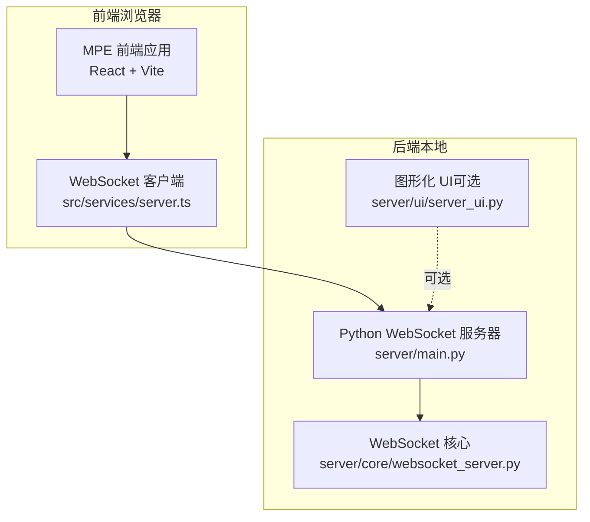
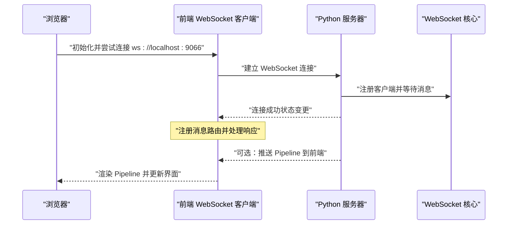
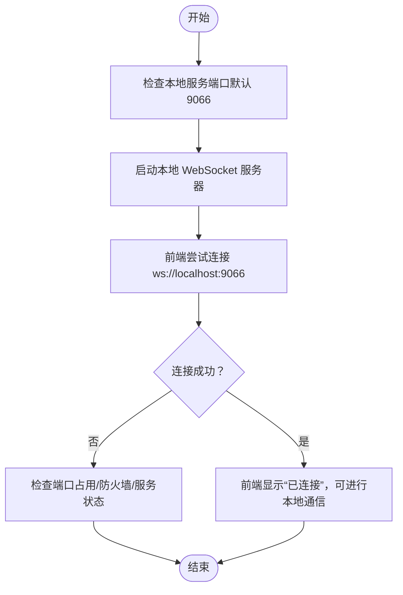
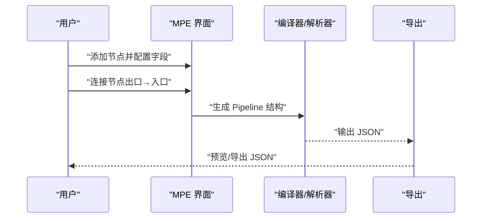
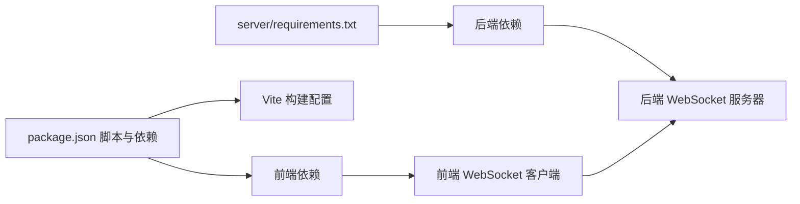

# 快速上手

<cite>
**本文引用的文件**
- [README.md](file://README.md)
- [package.json](file://package.json)
- [vite.config.ts](file://vite.config.ts)
- [src/main.tsx](file://src/main.tsx)
- [src/services/server.ts](file://src/services/server.ts)
- [server/main.py](file://server/main.py)
- [server/requirements.txt](file://server/requirements.txt)
- [server/ui/server_ui.py](file://server/ui/server_ui.py)
- [server/core/websocket_server.py](file://server/core/websocket_server.py)
- [docsite/docs/01.指南/01.开始/02.快速上手.md](file://docsite/docs/01.指南/01.开始/02.快速上手.md)
- [docsite/docs/01.指南/01.开始/10.本地服务.md](file://docsite/docs/01.指南/01.开始/10.本地服务.md)
</cite>

## 目录
1. [简介](#简介)
2. [项目结构](#项目结构)
3. [核心组件](#核心组件)
4. [架构总览](#架构总览)
5. [详细组件分析](#详细组件分析)
6. [依赖关系分析](#依赖关系分析)
7. [性能注意事项](#性能注意事项)
8. [故障排查指南](#故障排查指南)
9. [结论](#结论)
10. [附录](#附录)

## 简介
本指南面向首次使用 MaaPipelineEditor（MPE）的用户，目标是在几分钟内完成从零到成功运行的全流程，包括：
- 在线使用入口（稳定版与预览版）
- 本地开发环境搭建（Node.js、Python、依赖安装）
- 项目克隆与依赖安装命令
- 前端启动（Vite）与后端服务启动（Python）
- 连接本地 WebSocket 服务（默认端口 9066），验证通信状态
- 通过最小可运行示例（识别-点击）完成节点添加、字段配置、连接建立、JSON 导出
- 常见初始化问题排查（端口占用、跨域限制、服务未启动）

## 项目结构
MPE 采用前后端分离的结构：
- 前端：基于 React 19 + Vite 的单页应用，负责可视化编辑、节点与连接管理、字段面板、JSON 面板等
- 后端：Python 实现的 WebSocket 测试服务器，提供本地服务通信能力（发送/接收 Pipeline）

图表来源
- [src/services/server.ts](file://src/services/server.ts#L1-L215)
- [server/main.py](file://server/main.py#L1-L23)
- [server/core/websocket_server.py](file://server/core/websocket_server.py#L1-L109)
- [server/ui/server_ui.py](file://server/ui/server_ui.py#L1-L539)

章节来源
- [README.md](file://README.md#L24-L51)
- [package.json](file://package.json#L1-L59)
- [vite.config.ts](file://vite.config.ts#L1-L39)

## 核心组件
- 前端 WebSocket 客户端：封装连接、消息路由、状态回调与超时处理
- Python WebSocket 服务器：提供本地服务，支持启动/停止、客户端连接、消息分发、主动推送 Pipeline
- 可选图形化 UI：提供端口配置、日志、Pipeline 列表与发送功能

章节来源
- [src/services/server.ts](file://src/services/server.ts#L1-L215)
- [server/core/websocket_server.py](file://server/core/websocket_server.py#L1-L109)
- [server/ui/server_ui.py](file://server/ui/server_ui.py#L1-L539)

## 架构总览
MPE 通过 WebSocket 实现前后端通信：
- 前端通过本地 WebSocket 客户端连接到本地服务器
- 本地服务器监听指定端口，接收/转发消息
- 可选图形化 UI 可加载本地 Pipeline 文件并通过 WebSocket 推送给前端

图表来源
- [src/services/server.ts](file://src/services/server.ts#L58-L146)
- [server/core/websocket_server.py](file://server/core/websocket_server.py#L48-L109)
- [server/ui/server_ui.py](file://server/ui/server_ui.py#L300-L372)

## 详细组件分析

### 在线使用入口
- 稳定版入口：https://mpe.codax.site/stable
- 预览版入口：https://kqcoxn.github.io/MaaPipelineEditor/
- 文档站：https://mpe.codax.site/docs

章节来源
- [README.md](file://README.md#L24-L51)

### 本地开发环境搭建
- Node.js：建议使用 LTS 版本
- Python：建议使用 3.8+（具体以 requirements.txt 为准）
- 包管理器：推荐使用 pnpm（与项目脚本配合良好）

章节来源
- [server/requirements.txt](file://server/requirements.txt#L1-L4)
- [package.json](file://package.json#L1-L59)

### 项目克隆与依赖安装
- 克隆仓库后，使用 pnpm 安装依赖
- 前端依赖安装：在项目根目录执行依赖安装命令
- 后端依赖安装：在 server 目录执行依赖安装命令

章节来源
- [package.json](file://package.json#L1-L59)
- [server/requirements.txt](file://server/requirements.txt#L1-L4)

### 前端启动（Vite）
- 启动命令：在项目根目录执行前端开发服务器启动命令
- 默认访问地址：Vite 默认端口（通常为 5173），可通过配置调整

章节来源
- [package.json](file://package.json#L1-L59)
- [vite.config.ts](file://vite.config.ts#L1-L39)

### 后端服务启动（Python）
- 启动命令：在项目根目录执行后端服务启动命令
- 默认端口：9066（可通过图形化 UI 配置）
- 日志输出：控制台与 UI 日志面板

章节来源
- [package.json](file://package.json#L1-L59)
- [server/main.py](file://server/main.py#L1-L23)
- [server/ui/server_ui.py](file://server/ui/server_ui.py#L120-L171)
- [server/core/websocket_server.py](file://server/core/websocket_server.py#L64-L88)

### 连接本地 WebSocket 服务
- 默认端口：9066
- 前端连接逻辑：封装在本地 WebSocket 客户端类中，包含连接超时、状态回调、消息路由
- 连接状态：前端会显示“未连接/连接中/已连接/已断开”，并提供重新连接按钮

图表来源
- [src/services/server.ts](file://src/services/server.ts#L58-L146)
- [server/core/websocket_server.py](file://server/core/websocket_server.py#L64-L88)
- [docsite/docs/01.指南/01.开始/10.本地服务.md](file://docsite/docs/01.指南/01.开始/10.本地服务.md#L70-L87)

章节来源
- [src/services/server.ts](file://src/services/server.ts#L1-L215)
- [docsite/docs/01.指南/01.开始/10.本地服务.md](file://docsite/docs/01.指南/01.开始/10.本地服务.md#L70-L87)

### 最小可运行示例：识别-点击
- 在线使用入口：打开稳定版在线站点
- 添加节点：使用“空节点模板”或“OCR 模板”快速创建
- 配置字段：在右侧“节点字段”面板中设置识别与动作参数
- 建立连接：拖拽节点的出口与入口端点，形成“next”链路
- 导出 JSON：使用右侧“Pipeline JSON”面板进行预览与导出

图表来源
- [docsite/docs/01.指南/01.开始/02.快速上手.md](file://docsite/docs/01.指南/01.开始/02.快速上手.md#L31-L121)
- [docsite/docs/01.指南/01.开始/02.快速上手.md](file://docsite/docs/01.指南/01.开始/02.快速上手.md#L280-L348)

章节来源
- [docsite/docs/01.指南/01.开始/02.快速上手.md](file://docsite/docs/01.指南/01.开始/02.快速上手.md#L31-L121)
- [docsite/docs/01.指南/01.开始/02.快速上手.md](file://docsite/docs/01.指南/01.开始/02.快速上手.md#L280-L348)

### 本地服务功能与使用
- 本地服务是可选功能，适合需要与本地应用双向通信的场景
- 默认端口 9066；可在前端设置中修改端口并重新连接
- 可从本地服务器主动推送 Pipeline 到前端，或在前端应用到本地文件

章节来源
- [docsite/docs/01.指南/01.开始/10.本地服务.md](file://docsite/docs/01.指南/01.开始/10.本地服务.md#L1-L104)

## 依赖关系分析
- 前端依赖：React、@xyflow/react、antd、zustand 等
- 后端依赖：websockets、ttkbootstrap、Pillow
- 构建与脚本：Vite、ESLint、TypeScript

图表来源
- [package.json](file://package.json#L1-L59)
- [server/requirements.txt](file://server/requirements.txt#L1-L4)
- [vite.config.ts](file://vite.config.ts#L1-L39)

章节来源
- [package.json](file://package.json#L1-L59)
- [server/requirements.txt](file://server/requirements.txt#L1-L4)
- [vite.config.ts](file://vite.config.ts#L1-L39)

## 性能注意事项
- 前端：合理拆分组件与状态，避免不必要的重渲染
- 后端：WebSocket 服务器采用异步事件循环，注意消息处理耗时与并发连接数
- 导入/导出：大文件导入时建议在后台线程或异步任务中处理，避免阻塞主线程

## 故障排查指南
- 端口占用
  - 现象：连接超时或启动失败
  - 排查：确认 9066 端口未被其他程序占用；可在图形化 UI 中修改端口并重启服务
- 服务未启动
  - 现象：前端显示“未连接”
  - 排查：确认后端服务已启动；检查日志输出；确保 Python 环境与依赖安装正确
- 跨域限制
  - 说明：本地服务为 WebSocket，不在浏览器同源策略影响范围内；如遇网络代理或安全策略，请检查代理与防火墙设置
- 连接状态异常
  - 现象：状态停留在“连接中”或反复断开
  - 排查：检查前端连接超时设置、网络连通性、后端服务器是否正常运行

章节来源
- [src/services/server.ts](file://src/services/server.ts#L58-L146)
- [server/ui/server_ui.py](file://server/ui/server_ui.py#L300-L372)
- [docsite/docs/01.指南/01.开始/10.本地服务.md](file://docsite/docs/01.指南/01.开始/10.本地服务.md#L70-L87)

## 结论
通过本指南，您已完成从零到首次成功运行 MaaPipelineEditor 的全过程：访问在线入口、搭建本地开发环境、启动前后端服务、连接本地 WebSocket、完成最小可运行示例，并掌握常见问题的排查方法。建议在熟悉基本操作后，进一步阅读文档站的“核心概念”与“最佳实践”。

## 附录
- 在线入口
  - 稳定版：https://mpe.codax.site/stable
  - 预览版：https://kqcoxn.github.io/MaaPipelineEditor/
- 文档站：https://mpe.codax.site/docs
- 讨论与帮助：MaaFramework 集成/开发交流群（595990173）