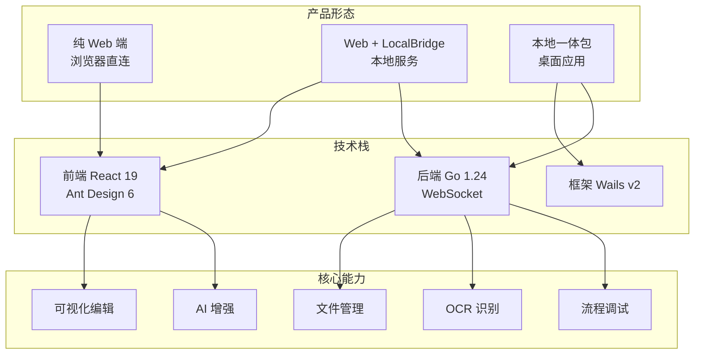
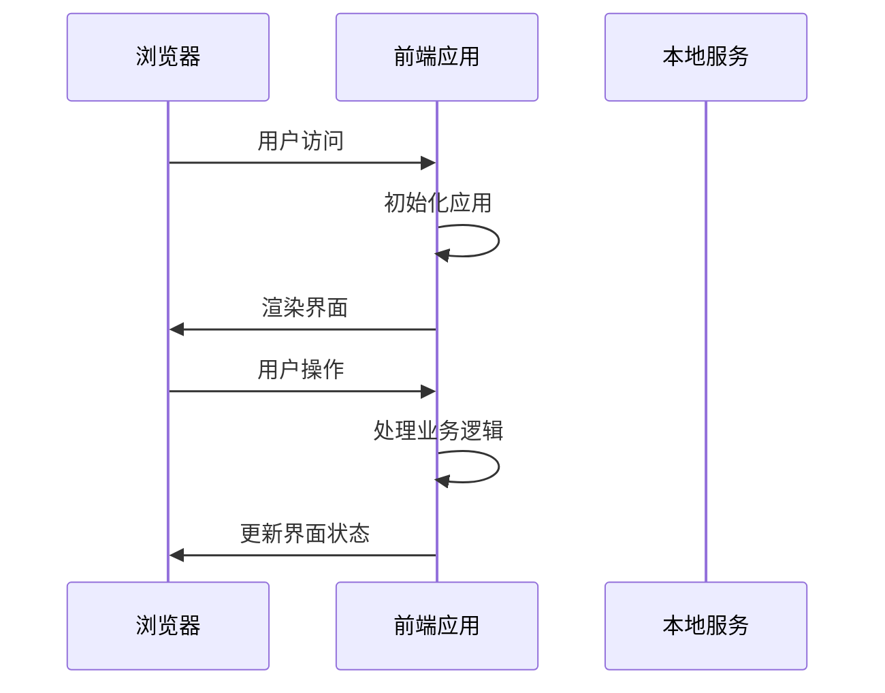
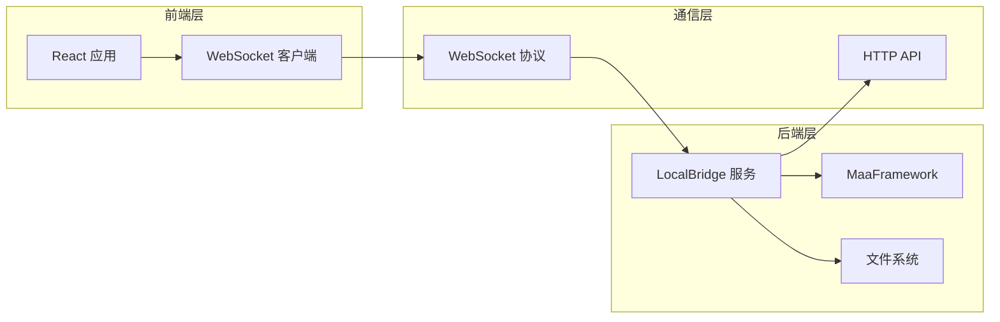
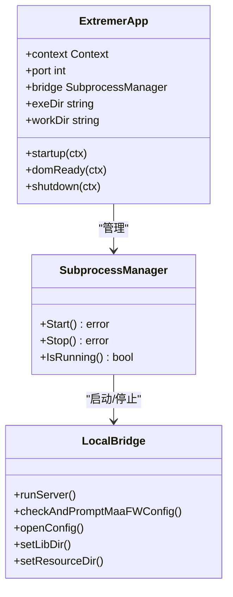

# 产品矩阵

<cite>
**本文引用的文件**
- [产品矩阵.md](file://docsite/docs/01.指南/01.开始/10.产品矩阵.md)
- [README.md](file://README.md)
- [App.tsx](file://src/App.tsx)
- [main.tsx](file://src/main.tsx)
- [server.ts](file://src/services/server.ts)
- [wsStore.ts](file://src/stores/wsStore.ts)
- [Extremer 主程序入口](file://Extremer/main.go)
- [Extremer 应用主结构](file://Extremer/app.go)
- [LocalBridge 命令入口](file://LocalBridge/cmd/lb/main.go)
- [LocalBridge 默认配置](file://LocalBridge/config/default.json)
- [Extremer 默认配置](file://Extremer/config/default.json)
- [package.json](file://package.json)
</cite>

## 目录
1. [简介](#简介)
2. [产品形态概览](#产品形态概览)
3. [部署模式对比](#部署模式对比)
4. [功能矩阵详解](#功能矩阵详解)
5. [技术架构映射](#技术架构映射)
6. [选择指南](#选择指南)
7. [迁移策略](#迁移策略)
8. [总结](#总结)

## 简介

MaaPipelineEditor（MPE）采用**渐进增强**的产品设计理念，提供三种部署模式以满足不同使用场景：

- **纯 Web 端**：无需安装，开箱即用
- **Web + LocalBridge（LB）**：本地能力扩展，增强功能  
- **本地一体包（Extremer）**：开箱即用的桌面应用

## 产品形态概览

**图表来源**
- [产品矩阵.md](file://docsite/docs/01.指南/01.开始/10.产品矩阵.md#L10-L263)
- [README.md](file://README.md#L14-L22)

## 部署模式对比

| 维度 | 纯 Web 端 | Web + LB | 本地一体包 |
|------|-----------|----------|------------|
| **上手难度** | ⭐ | ⭐⭐⭐ | ⭐⭐ |
| **功能完整度** | ⭐⭐ | ⭐⭐⭐⭐⭐ | ⭐⭐⭐⭐⭐ |
| **使用便捷性** | ⭐⭐⭐⭐⭐ | ⭐⭐⭐ | ⭐⭐⭐⭐⭐ |
| **配置灵活性** | ⭐ | ⭐⭐⭐⭐⭐ | ⭐⭐⭐ |
| **适用场景** | 临时/查看 | 多实例开发 | 日常使用 |

**章节来源**
- [产品矩阵.md](file://docsite/docs/01.指南/01.开始/10.产品矩阵.md#L18-L25)

## 功能矩阵详解

### 基础编辑功能

| 功能 | 纯 Web 端 | Web + LB | 本地一体包 |
|------|-----------|----------|------------|
| 可视化节点编辑 | ✅ 完全支持 | ✅ 完全支持 | ✅ 完全支持 |
| Pipeline 导入导出 | ✅ 完全支持 | ✅ 完全支持 | ✅ 完全支持 |
| 粘贴板导入 | ✅ 完全支持 | ✅ 完全支持 | ✅ 完全支持 |
| 自动布局 | ✅ 完全支持 | ✅ 完全支持 | ✅ 完全支持 |
| 协议兼容 (v1/v2) | ✅ 完全支持 | ✅ 完全支持 | ✅ 完全支持 |
| 语法糖支持 | ✅ 完全支持 | ✅ 完全支持 | ✅ 完全支持 |
| 自定义节点模板 | ✅ 完全支持 | ✅ 完全支持 | ✅ 完全支持 |

### 文件管理功能

| 功能 | 纯 Web 端 | Web + LB | 本地一体包 |
|------|-----------|----------|------------|
| 本地文件扫描 | ❌ 不支持 | ✅ 部分支持 | ✅ 完全支持 |
| 文件实时监听 | ❌ 不支持 | ✅ 部分支持 | ✅ 完全支持 |
| 文件保存/创建 | ❌ 不支持 | ✅ 部分支持 | ✅ 完全支持 |
| 跨文件导航 | ⚠️ 仅打开 | ✅ 完全支持 | ✅ 完全支持 |

### 辅助工具功能

| 功能 | 纯 Web 端 | Web + LB | 本地一体包 |
|------|-----------|----------|------------|
| 前端 OCR 识别 | ❌ 不支持 | ✅ 部分支持 | ✅ 完全支持 |
| 原生 OCR (MFW) | ❌ 不支持 | ✅ 部分支持 | ✅ 完全支持 |
| 截图工具 | ❌ 不支持 | ✅ 部分支持 | ✅ 完全支持 |
| 图片文件预览 | ❌ 不支持 | ✅ 部分支持 | ✅ 完全支持 |
| 图片文件快速选择 | ❌ 不支持 | ✅ 部分支持 | ✅ 完全支持 |
| 取色工具 | ❌ 不支持 | ✅ 部分支持 | ✅ 完全支持 |
| 区域选择 | ❌ 不支持 | ✅ 部分支持 | ✅ 完全支持 |

### 调试功能

| 功能 | 纯 Web 端 | Web + LB | 本地一体包 |
|------|-----------|----------|------------|
| 可视化流程调试 | ❌ 不支持 | ✅ 部分支持 | ✅ 完全支持 |
| 节点级单步测试 | ❌ 不支持 | ✅ 部分支持 | ✅ 完全支持 |
| 识别结果可视化 | ❌ 不支持 | ✅ 部分支持 | ✅ 完全支持 |
| 调试历史记录 | ❌ 不支持 | ✅ 部分支持 | ✅ 完全支持 |
| 设备连接 | ❌ 不支持 | ✅ 部分支持 | ✅ 完全支持 |

### AI 增强功能

| 功能 | 纯 Web 端 | Web + LB | 本地一体包 |
|------|-----------|----------|------------|
| 智能节点搜索 | ✅ 完全支持 | ✅ 完全支持 | ✅ 完全支持 |
| AI 节点补全 | ❌ 不支持 | ✅ 部分支持 | ✅ 完全支持 |

### 用户体验

| 功能 | 纯 Web 端 | Web + LB | 本地一体包 |
|------|-----------|----------|------------|
| 配置持久化 | ⚠️ 浏览器 | ⚠️ 浏览器 | ✅ 本地文件 |
| 日志查看 | - | ✅ 可视化 | ✅ 可视化 |
| 本地热重载 | - | ✅ 支持 | ✅ 支持 |
| 自动更新检查 | - | ⚠️ 仅提醒 | ✅ 支持 |

**章节来源**
- [产品矩阵.md](file://docsite/docs/01.指南/01.开始/10.产品矩阵.md#L28-L68)

## 技术架构映射

### 纯 Web 端架构

**图表来源**
- [App.tsx](file://src/App.tsx#L109-L277)
- [main.tsx](file://src/main.tsx#L1-L18)

### Web + LocalBridge 架构

**图表来源**
- [server.ts](file://src/services/server.ts#L20-L334)
- [LocalBridge 命令入口](file://LocalBridge/cmd/lb/main.go#L183-L403)

### 本地一体包架构

**图表来源**
- [Extremer 应用主结构](file://Extremer/app.go#L48-L326)
- [Extremer 主程序入口](file://Extremer/main.go#L23-L65)

**章节来源**
- [Extremer 应用主结构](file://Extremer/app.go#L48-L326)
- [LocalBridge 命令入口](file://LocalBridge/cmd/lb/main.go#L183-L403)

## 选择指南

### 初次使用/学习阶段
- **推荐：纯 Web 端**
  - 快速上手，无需安装任何软件
  - 适合查看和学习他人 Pipeline 实现
  - 通过分享链接与他人协作讨论

### 日常资源开发
- **推荐：本地一体包（Extremer）**
  - 开箱即用，无需配置
  - 集成化管理，统一配置界面
  - 可视化日志窗口，实时查看服务状态

### 团队协作/代码审阅
- **推荐：纯 Web 端**
  - 通过分享链接快速展示
  - 无需对方安装任何软件

### 多项目维护
- **推荐：Web + LocalBridge**
  - 可灵活切换工作目录
  - 支持自定义配置路径

**章节来源**
- [产品矩阵.md](file://docsite/docs/01.指南/01.开始/10.产品矩阵.md#L226-L246)

## 迁移策略

### 纯 Web 端 → Web + LB/Extremer
1. 在 Web 端导出 Pipeline JSON 文件
2. 在本地服务启动后，使用文件管理功能导入

### Web + LB → 本地一体包（Extremer）
- 配置和文件完全兼容
- 只需在 Extremer 中设置相同的工作目录

### 本地一体包 → Web + LB
- 可以继续使用 mpelb 命令行工具
- 配置路径可能不同，需重新配置

**章节来源**
- [产品矩阵.md](file://docsite/docs/01.指南/01.开始/10.产品矩阵.md#L248-L263)

## 总结

MaaPipelineEditor 的产品矩阵体现了渐进增强的设计理念：

### 核心优势
- **纯 Web 端**：零配置、真跨平台、即时访问
- **Web + LB**：渐进增强、完全解耦、灵活配置
- **本地一体包**：一键启动、集成化管理、可视化体验

### 技术特色
- 前后端完全分离架构
- 基于 React 19 + Ant Design 6 的现代化前端
- Go 1.24 + Wails v2 的高性能后端
- WebSocket 协议实现实时通信

### 适用场景
- 新手用户：推荐本地一体包，开箱即用
- 开发者：推荐 Web + LB，灵活配置
- 团队协作：推荐纯 Web 端，便于分享
- 多项目维护：推荐 Web + LB 或本地一体包

通过合理选择部署模式，用户可以根据自身需求和技能水平，获得最佳的 Pipeline 编辑体验。