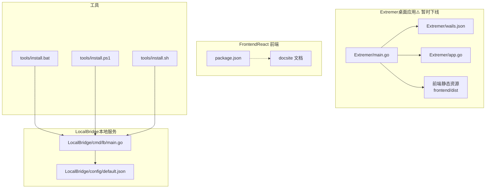
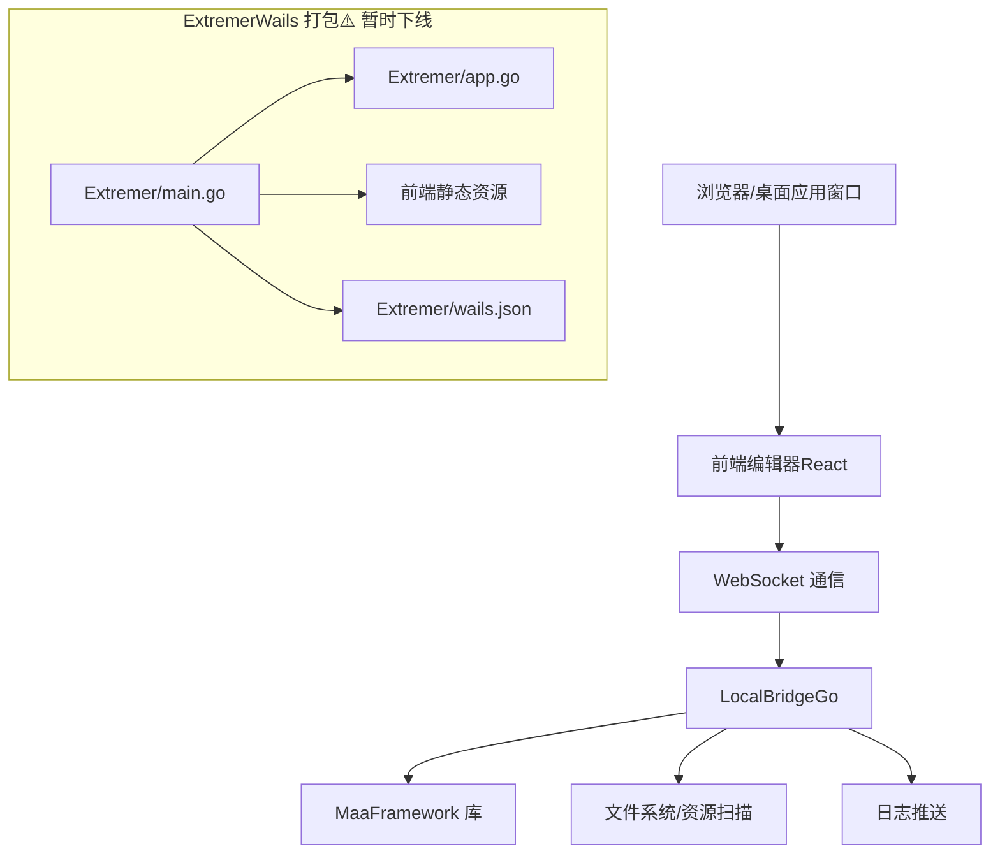
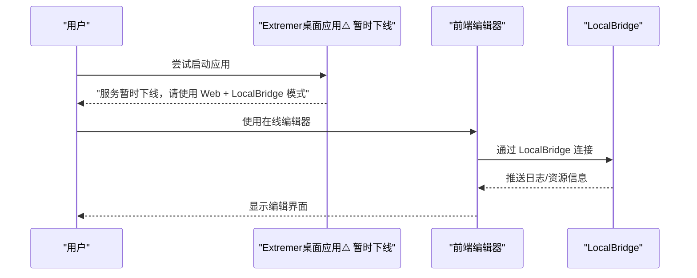
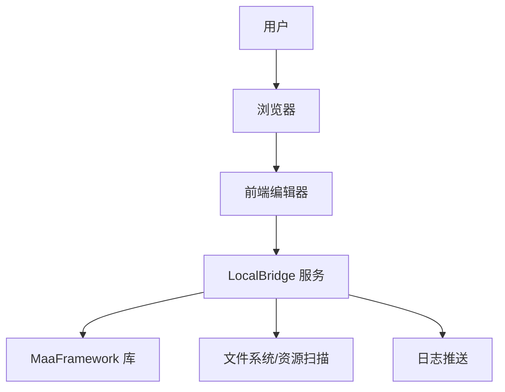
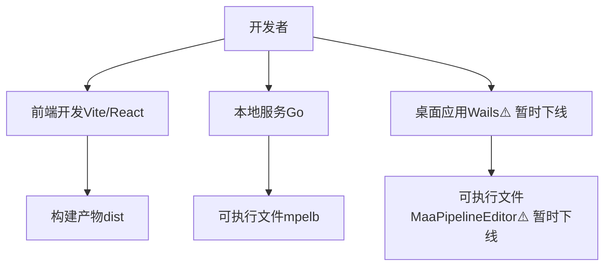
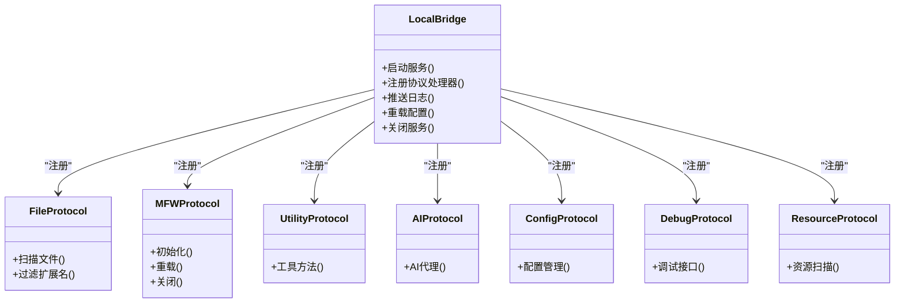
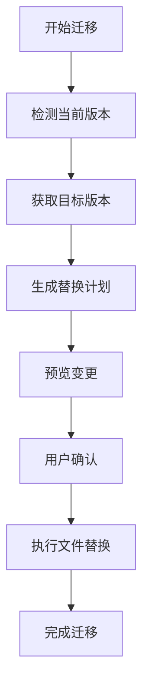
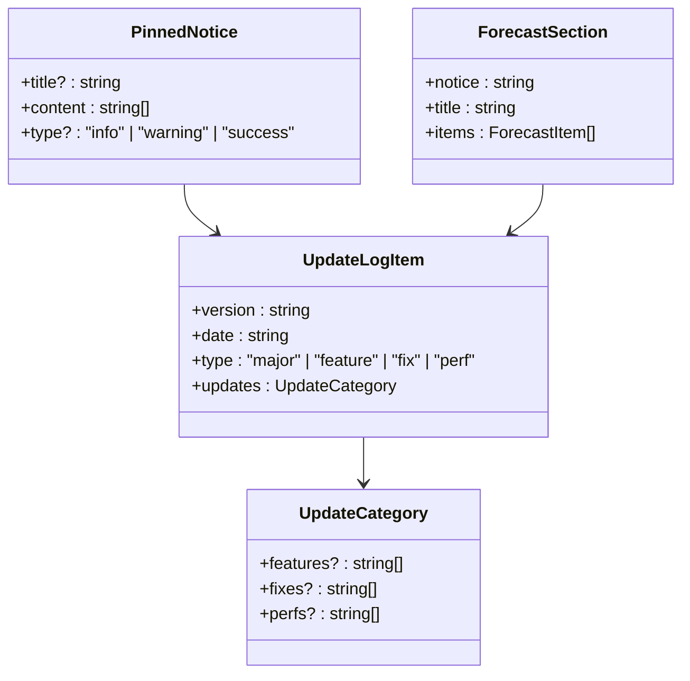
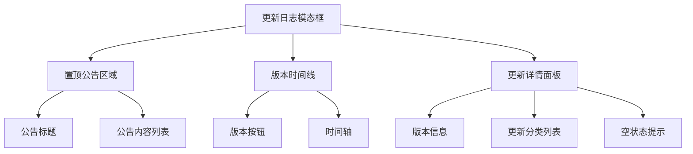
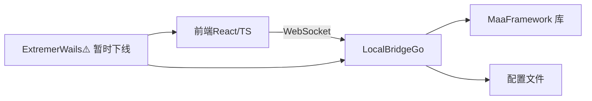

# 快速开始

<cite>
**本文引用的文件**
- [README.md](file://README.md)
- [package.json](file://package.json)
- [docsite 文档：快速上手](file://docsite/docs/01.指南/01.开始/02.快速上手.md)
- [docsite 文档：介绍](file://docsite/docs/01.指南/01.开始/01.介绍.md)
- [docsite 文档：产品矩阵](file://docsite/docs/01.指南/01.开始/10.产品矩阵.md)
- [docsite 文档：本地一体包概览与部署](file://docsite/docs/01.指南/25.本地一体包/01.概览与部署.md)
- [Extremer 主程序 main.go](file://Extremer/main.go)
- [Extremer Wails 配置](file://Extremer/wails.json)
- [Extremer 应用配置](file://Extremer/app.go)
- [LocalBridge 默认配置](file://LocalBridge/config/default.json)
- [LocalBridge 服务入口](file://LocalBridge/cmd/lb/main.go)
- [安装脚本：Windows 批处理](file://tools/install.bat)
- [安装脚本：PowerShell](file://tools/install.ps1)
- [安装脚本：Linux/macOS Shell](file://tools/install.sh)
- [GitHub 发布工作流](file://.github/workflows/release.yaml)
- [版本迁移脚本 migrate-version.mjs](file://scripts/migrate-version.mjs)
- [更新日志数据 updateLogs.ts](file://src/data/updateLogs.ts)
- [更新日志模态框 UpdateLog.tsx](file://src/components/modals/UpdateLog.tsx)
- [配置存储 configStore.ts](file://src/stores/configStore.ts)
</cite>

## 更新摘要
**所做更改**
- 新增版本管理流程章节，详细介绍 1.7.0 版本的版本号迁移机制
- 新增更新日志功能章节，展示 1.7.0 版本的特性介绍
- 更新版本管理最佳实践，包含自动化迁移脚本的使用方法
- 新增版本兼容性说明和迁移注意事项

## 目录
1. [简介](#简介)
2. [项目结构](#项目结构)
3. [核心组件](#核心组件)
4. [架构总览](#架构总览)
5. [详细组件分析](#详细组件分析)
6. [版本管理流程](#版本管理流程)
7. [更新日志功能](#更新日志功能)
8. [依赖关系分析](#依赖关系分析)
9. [性能考虑](#性能考虑)
10. [故障排除指南](#故障排除指南)
11. [结论](#结论)
12. [附录](#附录)

## 简介
本指南面向首次使用者，目标是在约 30 分钟内完成 MaaPipelineEditor（MPE）的安装与首个 Pipeline 工作流的创建。MPE 是一款基于 React 与 React Flow 的可视化 Pipeline 编辑器，支持在线使用、本地一体包以及源码构建等多种方式。它专注于"所见即所得"的流程编辑体验，并提供本地服务（LocalBridge）以增强文件管理、截图与调试等本地能力。

**重要变更**：Extremer 本地一体包服务暂时停止提供下载和打包，正在重构中。如需本地能力，请使用 Web + LocalBridge 模式，功能完全等价。

- 在线使用：无需下载，直接访问在线编辑器即可开始
- 本地一体包：Extremer 服务暂时下线，推荐使用 LocalBridge 模式
- 源码构建：适合开发者二次开发与定制

**章节来源**
- [README.md: 31-92:31-92](file://README.md#L31-L92)
- [docsite 文档：介绍:10-93](file://docsite/docs/01.指南/01.开始/01.介绍.md#L10-L93)
- [docsite 文档：产品矩阵:18-20](file://docsite/docs/01.指南/01.开始/10.产品矩阵.md#L18-L20)

## 项目结构
MPE 仓库采用多模块组织方式：
- Extremer：Wails 打包的桌面应用，内置前端静态资源（服务暂时下线）
- LocalBridge：本地服务（Go），提供文件管理、MaaFramework 集成、日志推送等能力
- Frontend：React + TypeScript 前端工程，负责可视化编辑与工作流渲染
- docsite：文档站点（VitePress/Astro），提供中文文档与教程
- tools：跨平台安装脚本（Windows 批处理、PowerShell、Linux/macOS Shell）

**图表来源**
- [Extremer 主程序 main.go:1-90](file://Extremer/main.go#L1-L90)
- [Extremer Wails 配置:1-18](file://Extremer/wails.json#L1-L18)
- [Extremer 应用配置:1-49](file://Extremer/app.go#L1-L49)
- [LocalBridge 服务入口:1-924](file://LocalBridge/cmd/lb/main.go#L1-L924)
- [LocalBridge 默认配置:1-29](file://LocalBridge/config/default.json#L1-L29)
- [package.json:1-75](file://package.json#L1-L75)
- [安装脚本：Windows 批处理:1-125](file://tools/install.bat#L1-L125)
- [安装脚本：PowerShell:1-86](file://tools/install.ps1#L1-L86)
- [安装脚本：Linux/macOS Shell:1-109](file://tools/install.sh#L1-L109)

**章节来源**
- [Extremer 主程序 main.go:1-90](file://Extremer/main.go#L1-L90)
- [Extremer Wails 配置:1-18](file://Extremer/wails.json#L1-L18)
- [Extremer 应用配置:1-49](file://Extremer/app.go#L1-L49)
- [LocalBridge 服务入口:1-924](file://LocalBridge/cmd/lb/main.go#L1-L924)
- [LocalBridge 默认配置:1-29](file://LocalBridge/config/default.json#L1-L29)
- [package.json:1-75](file://package.json#L1-L75)
- [安装脚本：Windows 批处理:1-125](file://tools/install.bat#L1-L125)
- [安装脚本：PowerShell:1-86](file://tools/install.ps1#L1-L86)
- [安装脚本：Linux/macOS Shell:1-109](file://tools/install.sh#L1-L109)

## 核心组件
- 前端编辑器（React + React Flow）：负责节点与连线的可视化编辑、字段面板、导出与导入
- 本地服务（LocalBridge，Go）：提供文件扫描、资源管理、MaaFramework 集成、日志推送、WebSocket 通信
- 桌面应用（Extremer，Wails）：将前端打包为桌面应用，内置静态资源，支持多平台窗口控制与系统集成（服务暂时下线）
- 安装脚本：为 Windows/Linux/macOS 提供一键安装 LocalBridge 的方式

**章节来源**
- [docsite 文档：介绍:14-23](file://docsite/docs/01.指南/01.开始/01.介绍.md#L14-L23)
- [LocalBridge 默认配置:1-29](file://LocalBridge/config/default.json#L1-L29)
- [Extremer 主程序 main.go:1-90](file://Extremer/main.go#L1-L90)
- [docsite 文档：产品矩阵:18-20](file://docsite/docs/01.指南/01.开始/10.产品矩阵.md#L18-L20)

## 架构总览
MPE 采用前后端分离架构：前端负责可视化编辑与编译导出，后端（LocalBridge）提供本地能力与协议桥接。Extremer 将前端静态资源嵌入，形成可独立运行的桌面应用（服务暂时下线）。

**图表来源**
- [Extremer 主程序 main.go:1-90](file://Extremer/main.go#L1-L90)
- [Extremer 应用配置:1-49](file://Extremer/app.go#L1-L49)
- [Extremer Wails 配置:1-18](file://Extremer/wails.json#L1-L18)
- [LocalBridge 服务入口:387-468](file://LocalBridge/cmd/lb/main.go#L387-L468)
- [LocalBridge 默认配置:1-29](file://LocalBridge/config/default.json#L1-L29)

## 详细组件分析

### 在线使用（推荐新手 30 分钟上手）
- 无需安装，直接访问在线编辑器即可开始
- 适合快速审阅、简单编辑与导出
- 在线版本为静态托管，隐私与本地能力受限

**章节来源**
- [README.md: 43-45:43-45](file://README.md#L43-L45)
- [docsite 文档：快速上手:20-34](file://docsite/docs/01.指南/01.开始/02.快速上手.md#L20-L34)

### 本地一体包（Extremer）- 重要变更
**Extremer 本地一体包服务暂时停止提供下载和打包，正在重构中。**

- 服务暂时下线，不再提供下载和打包
- 如需本地能力，请使用 Web + LocalBridge 模式，功能完全等价
- 服务恢复后将提供开箱即用的桌面应用体验

**图表来源**
- [Extremer 主程序 main.go:26-84](file://Extremer/main.go#L26-L84)
- [Extremer 应用配置:1-49](file://Extremer/app.go#L1-L49)
- [docsite 文档：产品矩阵:18-20](file://docsite/docs/01.指南/01.开始/10.产品矩阵.md#L18-L20)

**章节来源**
- [docsite 文档：产品矩阵:18-20](file://docsite/docs/01.指南/01.开始/10.产品矩阵.md#L18-L20)
- [docsite 文档：本地一体包概览与部署:10-16](file://docsite/docs/01.指南/25.本地一体包/01.概览与部署.md#L10-L16)
- [README.md: 52:52](file://README.md#L52)

### Web + LocalBridge 模式（推荐替代方案）
- 通过一行命令即可增量启用本地服务
- 无缝接入文件管理、截图工具、流程调试等本地能力
- 功能完全等价于已下线的 Extremer 模式

**图表来源**
- [package.json:1-75](file://package.json#L1-L75)
- [LocalBridge 服务入口:1-924](file://LocalBridge/cmd/lb/main.go#L1-L924)
- [LocalBridge 默认配置:1-29](file://LocalBridge/config/default.json#L1-L29)

**章节来源**
- [docsite 文档：产品矩阵:104-151](file://docsite/docs/01.指南/01.开始/10.产品矩阵.md#L104-L151)
- [docsite 文档：快速上手:28-35](file://docsite/docs/01.指南/01.开始/02.快速上手.md#L28-L35)

### 源码构建（开发者）
- 前端：使用 Vite + React + TypeScript，支持开发预览与构建
- 本地服务：Go 语言实现，提供命令行工具与配置管理
- 桌面应用：Wails 打包前端与后端，生成可执行文件（服务暂时下线）

**图表来源**
- [package.json:1-75](file://package.json#L1-L75)
- [LocalBridge 服务入口:1-924](file://LocalBridge/cmd/lb/main.go#L1-L924)
- [Extremer 主程序 main.go:1-90](file://Extremer/main.go#L1-L90)

**章节来源**
- [package.json:1-75](file://package.json#L1-L75)
- [LocalBridge 服务入口:1-924](file://LocalBridge/cmd/lb/main.go#L1-L924)
- [Extremer 主程序 main.go:1-90](file://Extremer/main.go#L1-L90)

### LocalBridge（本地服务）核心能力
- 文件管理：扫描指定目录，过滤扩展名，支持深度与数量限制
- MaaFramework 集成：可选启用，支持 OCR 资源路径配置
- 日志推送：通过 WebSocket 推送日志到前端
- 协议路由：注册文件、MFW、Utility、AI、Config、Debug、Resource 等协议处理器
- 命令行工具：mpelb 提供配置、路径设置、日志目录打开等子命令

**图表来源**
- [LocalBridge 服务入口:387-468](file://LocalBridge/cmd/lb/main.go#L387-L468)

**章节来源**
- [LocalBridge 默认配置:1-29](file://LocalBridge/config/default.json#L1-L29)
- [LocalBridge 服务入口:184-468](file://LocalBridge/cmd/lb/main.go#L184-L468)

## 版本管理流程

### 1.7.0 版本特性介绍
MPE 1.7.0 版本引入了重要的版本管理机制和更新日志功能，为后续版本迭代奠定了基础。

**版本管理机制特点**：
- **自动化版本迁移**：通过 migrate-version.mjs 脚本实现精确的版本号替换
- **多位置版本同步**：支持在多个关键文件中同步更新版本号
- **交互式确认流程**：提供预览和确认机制，确保迁移安全性
- **语义化版本支持**：支持 X.Y.Z 和预发布版本格式

**章节来源**
- [configStore.ts: 9-17:9-17](file://src/stores/configStore.ts#L9-L17)
- [main.go: 24](file://Extremer/main.go#L24)
- [wails.json: 13](file://Extremer/wails.json#L13)
- [migrate-version.mjs: 36-82:36-82](file://scripts/migrate-version.mjs#L36-L82)

### 版本迁移脚本详解

#### 脚本功能概述
版本迁移脚本提供了完整的版本号管理解决方案：

**图表来源**
- [migrate-version.mjs: 163-301:163-301](file://scripts/migrate-version.mjs#L163-L301)

#### 支持的版本位置
脚本能够精确识别并更新以下位置的版本号：

| 目标位置 | 文件路径 | 版本类型 |
|---------|----------|----------|
| 前端配置版本 | src/stores/configStore.ts | JavaScript 字符串 |
| Go 应用版本 | Extremer/main.go | Go 变量 |
| Wails 产品版本 | Extremer/wails.json | JSON 字段 |
| Windows 清单版本 | Extremer/build/windows/wails.exe.manifest | XML 属性 |
| macOS Info.plist 版本 | Extremer/build/darwin/Info.plist | XML 字段 |

**章节来源**
- [migrate-version.mjs: 36-82:36-82](file://scripts/migrate-version.mjs#L36-L82)

#### 迁移流程详解
1. **版本检测**：脚本会同时读取所有目标文件，提取当前版本号
2. **目标版本输入**：支持命令行参数或交互式输入
3. **替换计划生成**：为每个目标位置生成精确的替换计划
4. **变更预览**：显示所有将要发生的变更，供用户确认
5. **安全执行**：确认后按文件分组执行替换，避免重复写入

**章节来源**
- [migrate-version.mjs: 170-278:170-278](file://scripts/migrate-version.mjs#L170-L278)

### 版本兼容性与最佳实践

#### 版本号格式支持
- **标准格式**：X.Y.Z（如 1.7.0）
- **预发布格式**：X.Y.Z-alpha.1、X.Y.Z-beta.2 等
- **自动去前缀**：支持 v1.7.0 格式的自动处理

#### 迁移注意事项
- **备份重要文件**：执行迁移前建议备份项目文件
- **Git 差异检查**：迁移完成后使用 `git diff` 检查变更
- **测试验证**：确保迁移后的版本功能正常
- **团队协作**：在团队开发中协调版本迁移时机

**章节来源**
- [migrate-version.mjs: 220-224:220-224](file://scripts/migrate-version.mjs#L220-L224)
- [migrate-version.mjs: 298-300:298-300](file://scripts/migrate-version.mjs#L298-L300)

## 更新日志功能

### 1.7.0 版本更新日志
MPE 1.7.0 版本引入了完整的更新日志系统，为用户提供版本演进的可视化展示。

#### 更新日志数据结构
更新日志采用结构化的数据格式，支持多种更新类型：

**图表来源**
- [updateLogs.ts: 26-46:26-46](file://src/data/updateLogs.ts#L26-L46)

#### 更新类型分类
系统支持四种更新类型，每种类型都有特定的颜色标识和含义：

| 类型 | 颜色 | 含义 | 示例 |
|------|------|------|------|
| major | 红色 | 重大更新 | 重大功能重构、API 变更 |
| feature | 蓝色 | 新功能 | 新增功能特性、界面改进 |
| fix | 橙色 | 问题修复 | Bug 修复、稳定性改进 |
| perf | 绿色 | 体验优化 | 性能优化、用户体验改进 |

**章节来源**
- [updateLogs.ts: 29](file://src/data/updateLogs.ts#L29)
- [UpdateLog.tsx: 35-43:35-43](file://src/components/modals/UpdateLog.tsx#L35-L43)

### 更新日志界面设计

#### 界面组件结构
更新日志采用现代化的卡片式设计，提供清晰的信息层次：

**图表来源**
- [UpdateLog.tsx: 316-407:316-407](file://src/components/modals/UpdateLog.tsx#L316-L407)

#### 预览功能
系统还提供了长期预告和下期预告功能：

| 预览类型 | 功能描述 | 数据来源 |
|----------|----------|----------|
| 下期预告 | v1.7.0 版本的功能预告 | nextPreview |
| 长期预告 | 未来发展方向规划 | longTermPreview |

**章节来源**
- [updateLogs.ts: 88-103:88-103](file://src/data/updateLogs.ts#L88-L103)
- [UpdateLog.tsx: 254-314:254-314](file://src/components/modals/UpdateLog.tsx#L254-L314)

### 1.7.0 版本特性说明
当前 1.7.0 版本的更新内容预留位置，将在后续版本中逐步完善：

#### 特性预留内容
- **新功能**：待补充
- **性能优化**：待补充  
- **问题修复**：待补充

#### 开发进度跟踪
系统通过预告功能展示开发进度，包括：
- Wiki 文档快速跳转功能
- 新手题目完善计划
- 其他功能增强规划

**章节来源**
- [updateLogs.ts: 105-115:105-115](file://src/data/updateLogs.ts#L105-L115)
- [updateLogs.ts: 89-102:89-102](file://src/data/updateLogs.ts#L89-L102)

## 依赖关系分析
- 前端依赖：React 19、TypeScript 5.8、React Flow 12、Ant Design 6、Monaco Editor 等
- 本地服务依赖：Go 1.26、Cobra（命令行）、WebSocket 服务等
- 桌面应用依赖：Wails v2，跨平台窗口控制与系统集成（服务暂时下线）

**图表来源**
- [package.json:24-49](file://package.json#L24-L49)
- [LocalBridge 默认配置:1-29](file://LocalBridge/config/default.json#L1-L29)
- [Extremer 主程序 main.go:1-90](file://Extremer/main.go#L1-L90)

**章节来源**
- [package.json:1-75](file://package.json#L1-L75)
- [LocalBridge 默认配置:1-29](file://LocalBridge/config/default.json#L1-L29)
- [Extremer 主程序 main.go:1-90](file://Extremer/main.go#L1-L90)

## 性能考虑
- 在线使用：依赖网络与浏览器性能，适合轻量编辑与导出
- 本地服务：文件扫描与资源扫描可能受磁盘 I/O 影响，可通过配置限制扫描深度与文件数量
- 桌面应用：Wails 打包后启动较快，窗口控制与系统集成良好（服务暂时下线）
- 建议：在大型项目中合理设置扫描范围与日志级别，避免不必要的资源消耗

## 故障排除指南

### 安装与启动常见问题
- Windows 安装脚本无法获取版本
  - 可能原因：GitHub API 速率限制
  - 解决方法：设置 GITHUB_TOKEN 环境变量后重试
  - 参考脚本：[安装脚本：Windows 批处理:58-75](file://tools/install.bat#L58-L75)、[安装脚本：PowerShell:27-39](file://tools/install.ps1#L27-L39)
- Linux/macOS 安装脚本提示不支持的架构
  - 可能原因：系统架构非 amd64/arm64
  - 解决方法：确认 uname 输出的架构并使用对应发行版
  - 参考脚本：[安装脚本：Linux/macOS Shell:30-41](file://tools/install.sh#L30-L41)
- mpelb 命令未找到
  - 可能原因：PATH 未包含安装目录
  - 解决方法：重启终端或手动将安装目录加入 PATH
  - 参考脚本：[安装脚本：Windows 批处理:93-104](file://tools/install.bat#L93-L104)、[安装脚本：PowerShell:60-72](file://tools/install.ps1#L60-L72)、[安装脚本：Linux/macOS Shell:90-98](file://tools/install.sh#L90-L98)

### 本地服务启动与连接问题
- 启动后无响应或立即退出
  - 可能原因：MaaFramework 库版本不匹配或初始化失败
  - 解决方法：检查 MaaFramework 路径配置，确保库文件存在且版本匹配
  - 参考入口：[LocalBridge 服务入口:258-300](file://LocalBridge/cmd/lb/main.go#L258-L300)
- WebSocket 连接失败
  - 可能原因：端口占用或主机绑定问题
  - 解决方法：检查配置文件中的 host/port，默认端口为 9066
  - 参考配置：[LocalBridge 默认配置:2-5](file://LocalBridge/config/default.json#L2-L5)
- 协议版本不一致
  - 可能原因：前端与后端版本不匹配
  - 解决方法：升级前端或后端至相同版本
  - 参考入口：[LocalBridge 服务入口:392-402](file://LocalBridge/cmd/lb/main.go#L392-L402)

### 浏览器与桌面应用兼容性
- Windows WebView2 缺失
  - 可能原因：系统缺少 WebView2 运行时
  - 解决方法：安装 WebView2 或在应用中指定固定版本运行时路径
  - 参考文档：[Wails Windows 指南:27-57](file://dev/instructions/wails/guides/windows.mdx#L27-L57)
- 窗口控制异常
  - 可能原因：Wails 配置不当或系统主题差异
  - 解决方法：检查 wails.json 中的窗口与主题配置
  - 参考配置：[Extremer Wails 配置:1-18](file://Extremer/wails.json#L1-L18)

### Extremer 服务下线相关问题
- Extremer 应用无法启动或显示"服务暂时下线"
  - 当前状态：Extremer 本地一体包服务暂时停止提供下载和打包
  - 解决方案：使用 Web + LocalBridge 模式替代，功能完全等价
  - 参考文档：[产品矩阵:18-20](file://docsite/docs/01.指南/01.开始/10.产品矩阵.md#L18-L20)、[本地一体包文档:10-16](file://docsite/docs/01.指南/25.本地一体包/01.概览与部署.md#L10-L16)

### 版本管理相关问题
- 版本迁移脚本执行失败
  - 可能原因：权限不足、文件锁定、语法错误
  - 解决方法：检查文件权限，关闭相关进程，验证文件格式
  - 参考脚本：[版本迁移脚本 migrate-version.mjs: 287-296:287-296](file://scripts/migrate-version.mjs#L287-L296)
- 版本号不一致问题
  - 可能原因：多个位置版本号不同步
  - 解决方法：使用迁移脚本统一更新所有位置的版本号
  - 参考脚本：[版本迁移脚本 migrate-version.mjs: 190-203:190-203](file://scripts/migrate-version.mjs#L190-L203)

**章节来源**
- [安装脚本：Windows 批处理:58-75](file://tools/install.bat#L58-L75)
- [安装脚本：PowerShell:27-39](file://tools/install.ps1#L27-L39)
- [安装脚本：Linux/macOS Shell:30-41](file://tools/install.sh#L30-L41)
- [LocalBridge 默认配置:1-29](file://LocalBridge/config/default.json#L1-L29)
- [LocalBridge 服务入口:258-300](file://LocalBridge/cmd/lb/main.go#L258-L300)
- [LocalBridge 服务入口:392-402](file://LocalBridge/cmd/lb/main.go#L392-L402)
- [Extremer Wails 配置:1-18](file://Extremer/wails.json#L1-L18)
- [docsite 文档：产品矩阵:18-20](file://docsite/docs/01.指南/01.开始/10.产品矩阵.md#L18-L20)
- [docsite 文档：本地一体包概览与部署:10-16](file://docsite/docs/01.指南/25.本地一体包/01.概览与部署.md#L10-L16)
- [migrate-version.mjs: 287-296:287-296](file://scripts/migrate-version.mjs#L287-L296)
- [migrate-version.mjs: 190-203:190-203](file://scripts/migrate-version.mjs#L190-L203)

## 结论
通过本快速开始指南，您可以在 30 分钟内完成 MPE 的安装与首个 Pipeline 工作流的创建。**重要变更**：Extremer 本地一体包服务暂时下线，推荐使用 Web + LocalBridge 模式获得完整的本地能力。

**新增功能亮点**：
- **版本管理自动化**：1.7.0 版本引入了完善的版本号迁移机制
- **更新日志系统**：提供可视化的版本演进展示功能
- **开发流程优化**：支持更规范的版本发布和维护流程

建议新手优先尝试在线使用，熟悉基本操作后再根据需要启用 LocalBridge 服务。遇到问题时，可参考本指南的故障排除章节或查阅文档站。

## 附录

### 环境要求与兼容性
- 浏览器：现代浏览器均可使用在线版本
- 操作系统：Windows/Linux/macOS 均可使用桌面应用与本地服务
- 前端技术栈：React 19、TypeScript 5.8、React Flow 12
- 后端技术栈：Go 1.26、Cobra、WebSocket
- 桌面应用：Wails v2，支持窗口控制与系统主题（服务暂时下线）

**章节来源**
- [README.md: 14-18:14-18](file://README.md#L14-L18)
- [package.json:24-49](file://package.json#L24-L49)
- [Extremer 主程序 main.go:1-90](file://Extremer/main.go#L1-L90)

### 基本使用教程（30 分钟上手）
- 打开编辑器：访问在线编辑器或启动桌面应用
- 新建工作流：右键面板区域选择节点模板，添加节点
- 连接节点：拖拽节点端点创建连接，设置 next/on_error
- 配置字段：在右侧字段面板中修改节点参数，支持多种输入方式
- 导出与导入：使用右侧 JSON 面板导出到剪贴板或文件，或从文件导入

**章节来源**
- [docsite 文档：快速上手:16-422](file://docsite/docs/01.指南/01.开始/02.快速上手.md#L16-L422)

### 替代方案选择指南
- **纯 Web 端**：适合临时查看和简单编辑
- **Web + LocalBridge**：推荐日常开发使用，功能完整且灵活
- **Extremer（已下线）**：服务暂时停止，使用 Web + LocalBridge 替代

**章节来源**
- [docsite 文档：产品矩阵:104-151](file://docsite/docs/01.指南/01.开始/10.产品矩阵.md#L104-L151)
- [docsite 文档：产品矩阵:153-209](file://docsite/docs/01.指南/01.开始/10.产品矩阵.md#L153-L209)

### 版本管理最佳实践
- **定期备份**：执行版本迁移前务必备份项目文件
- **Git 差异检查**：迁移完成后使用 `git diff` 检查变更
- **测试验证**：确保迁移后的版本功能正常运行
- **团队协调**：在团队开发中统一版本迁移时机和流程

**章节来源**
- [migrate-version.mjs: 298-300:298-300](file://scripts/migrate-version.mjs#L298-L300)
- [migrate-version.mjs: 220-224:220-224](file://scripts/migrate-version.mjs#L220-L224)