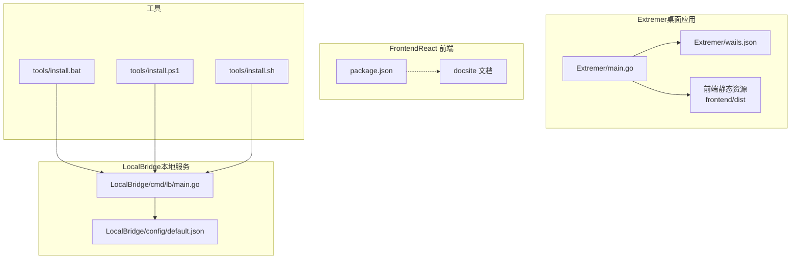
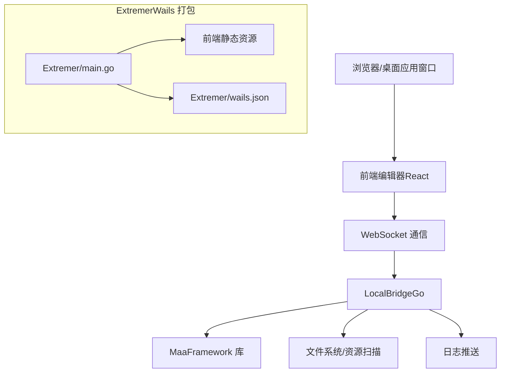
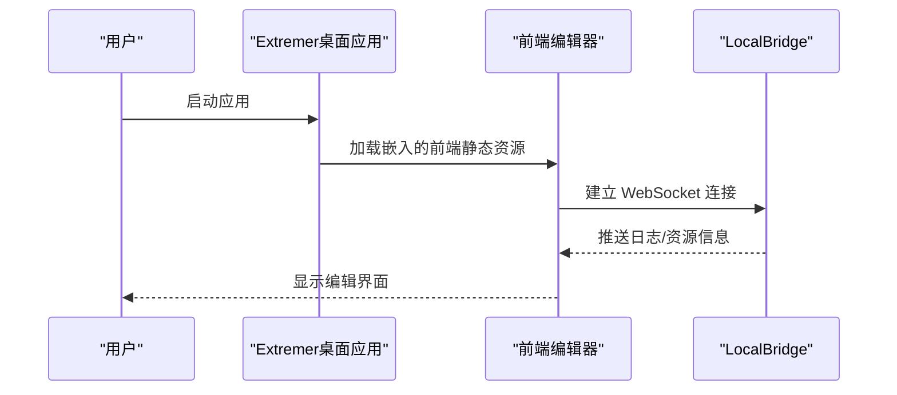
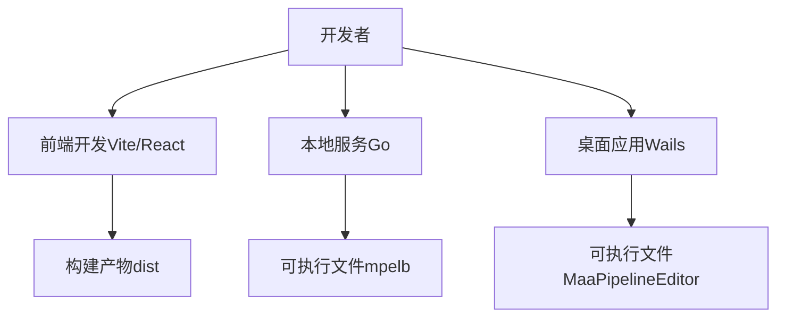
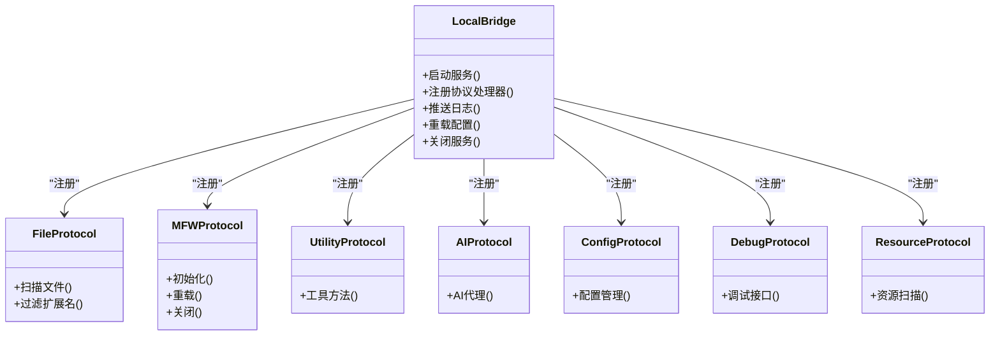
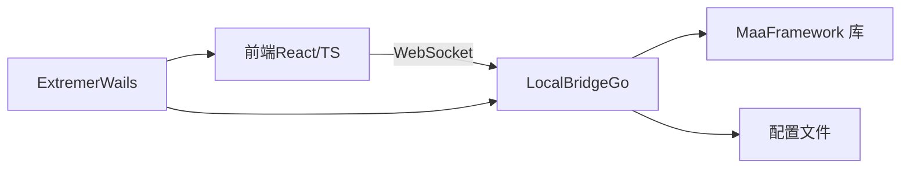

# 快速开始

<cite>
**本文引用的文件**
- [README.md](file://README.md)
- [package.json](file://package.json)
- [docsite 文档：快速上手](file://docsite/docs/01.指南/01.开始/02.快速上手.md)
- [docsite 文档：介绍](file://docsite/docs/01.指南/01.开始/01.介绍.md)
- [Extremer 主程序 main.go](file://Extremer/main.go)
- [Extremer Wails 配置](file://Extremer/wails.json)
- [LocalBridge 默认配置](file://LocalBridge/config/default.json)
- [LocalBridge 服务入口](file://LocalBridge/cmd/lb/main.go)
- [安装脚本：Windows 批处理](file://tools/install.bat)
- [安装脚本：PowerShell](file://tools/install.ps1)
- [安装脚本：Linux/macOS Shell](file://tools/install.sh)
</cite>

## 目录
1. [简介](#简介)
2. [项目结构](#项目结构)
3. [核心组件](#核心组件)
4. [架构总览](#架构总览)
5. [详细组件分析](#详细组件分析)
6. [依赖关系分析](#依赖关系分析)
7. [性能考虑](#性能考虑)
8. [故障排除指南](#故障排除指南)
9. [结论](#结论)
10. [附录](#附录)

## 简介
本指南面向首次使用者，目标是在约 30 分钟内完成 MaaPipelineEditor（MPE）的安装与首个 Pipeline 工作流的创建。MPE 是一款基于 React 与 React Flow 的可视化 Pipeline 编辑器，支持在线使用、本地一体包以及源码构建等多种方式。它专注于“所见即所得”的流程编辑体验，并提供本地服务（LocalBridge）以增强文件管理、截图与调试等本地能力。

- 在线使用：无需下载，直接访问在线编辑器即可开始
- 本地一体包：内置前端与 LocalBridge，开箱即用
- 源码构建：适合开发者二次开发与定制

**章节来源**
- [README.md: 31-92:31-92](file://README.md#L31-L92)
- [docsite 文档：介绍:10-93](file://docsite/docs/01.指南/01.开始/01.介绍.md#L10-L93)

## 项目结构
MPE 仓库采用多模块组织方式：
- Extremer：Wails 打包的桌面应用，内置前端静态资源
- LocalBridge：本地服务（Go），提供文件管理、MaaFramework 集成、日志推送等能力
- Frontend：React + TypeScript 前端工程，负责可视化编辑与工作流渲染
- docsite：文档站点（VitePress/Astro），提供中文文档与教程
- tools：跨平台安装脚本（Windows 批处理、PowerShell、Linux/macOS Shell）

**图表来源**
- [Extremer 主程序 main.go:1-90](file://Extremer/main.go#L1-L90)
- [Extremer Wails 配置:1-18](file://Extremer/wails.json#L1-L18)
- [LocalBridge 服务入口:1-924](file://LocalBridge/cmd/lb/main.go#L1-L924)
- [LocalBridge 默认配置:1-29](file://LocalBridge/config/default.json#L1-L29)
- [package.json:1-75](file://package.json#L1-L75)
- [安装脚本：Windows 批处理:1-125](file://tools/install.bat#L1-L125)
- [安装脚本：PowerShell:1-86](file://tools/install.ps1#L1-L86)
- [安装脚本：Linux/macOS Shell:1-109](file://tools/install.sh#L1-L109)

**章节来源**
- [Extremer 主程序 main.go:1-90](file://Extremer/main.go#L1-L90)
- [Extremer Wails 配置:1-18](file://Extremer/wails.json#L1-L18)
- [LocalBridge 服务入口:1-924](file://LocalBridge/cmd/lb/main.go#L1-L924)
- [LocalBridge 默认配置:1-29](file://LocalBridge/config/default.json#L1-L29)
- [package.json:1-75](file://package.json#L1-L75)
- [安装脚本：Windows 批处理:1-125](file://tools/install.bat#L1-L125)
- [安装脚本：PowerShell:1-86](file://tools/install.ps1#L1-L86)
- [安装脚本：Linux/macOS Shell:1-109](file://tools/install.sh#L1-L109)

## 核心组件
- 前端编辑器（React + React Flow）：负责节点与连线的可视化编辑、字段面板、导出与导入
- 本地服务（LocalBridge，Go）：提供文件扫描、资源管理、MaaFramework 集成、日志推送、WebSocket 通信
- 桌面应用（Extremer，Wails）：将前端打包为桌面应用，内置静态资源，支持多平台窗口控制与系统集成
- 安装脚本：为 Windows/Linux/macOS 提供一键安装 LocalBridge 的方式

**章节来源**
- [docsite 文档：介绍:14-23](file://docsite/docs/01.指南/01.开始/01.介绍.md#L14-L23)
- [LocalBridge 默认配置:1-29](file://LocalBridge/config/default.json#L1-L29)
- [Extremer 主程序 main.go:1-90](file://Extremer/main.go#L1-L90)

## 架构总览
MPE 采用前后端分离架构：前端负责可视化编辑与编译导出，后端（LocalBridge）提供本地能力与协议桥接。Extremer 将前端静态资源嵌入，形成可独立运行的桌面应用。

**图表来源**
- [Extremer 主程序 main.go:1-90](file://Extremer/main.go#L1-L90)
- [Extremer Wails 配置:1-18](file://Extremer/wails.json#L1-L18)
- [LocalBridge 服务入口:387-468](file://LocalBridge/cmd/lb/main.go#L387-L468)
- [LocalBridge 默认配置:1-29](file://LocalBridge/config/default.json#L1-L29)

## 详细组件分析

### 在线使用（推荐新手 30 分钟上手）
- 无需安装，直接访问在线编辑器即可开始
- 适合快速审阅、简单编辑与导出
- 在线版本为静态托管，隐私与本地能力受限

**章节来源**
- [README.md: 43-45:43-45](file://README.md#L43-L45)
- [docsite 文档：快速上手:20-34](file://docsite/docs/01.指南/01.开始/02.快速上手.md#L20-L34)

### 本地一体包（Extremer）
- 将前端与 LocalBridge 打包为桌面应用，开箱即用
- 适用于需要本地能力但不想手动部署服务的用户
- 支持多平台窗口控制与系统主题

**图表来源**
- [Extremer 主程序 main.go:26-84](file://Extremer/main.go#L26-L84)
- [Extremer Wails 配置:1-18](file://Extremer/wails.json#L1-L18)

**章节来源**
- [Extremer 主程序 main.go:1-90](file://Extremer/main.go#L1-L90)
- [Extremer Wails 配置:1-18](file://Extremer/wails.json#L1-L18)

### 源码构建（开发者）
- 前端：使用 Vite + React + TypeScript，支持开发预览与构建
- 本地服务：Go 语言实现，提供命令行工具与配置管理
- 桌面应用：Wails 打包前端与后端，生成可执行文件

**图表来源**
- [package.json:1-75](file://package.json#L1-L75)
- [LocalBridge 服务入口:1-924](file://LocalBridge/cmd/lb/main.go#L1-L924)
- [Extremer 主程序 main.go:1-90](file://Extremer/main.go#L1-L90)

**章节来源**
- [package.json:1-75](file://package.json#L1-L75)
- [LocalBridge 服务入口:1-924](file://LocalBridge/cmd/lb/main.go#L1-L924)
- [Extremer 主程序 main.go:1-90](file://Extremer/main.go#L1-L90)

### LocalBridge（本地服务）核心能力
- 文件管理：扫描指定目录，过滤扩展名，支持深度与数量限制
- MaaFramework 集成：可选启用，支持 OCR 资源路径配置
- 日志推送：通过 WebSocket 推送日志到前端
- 协议路由：注册文件、MFW、Utility、AI、Config、Debug、Resource 等协议处理器
- 命令行工具：mpelb 提供配置、路径设置、日志目录打开等子命令

**图表来源**
- [LocalBridge 服务入口:387-468](file://LocalBridge/cmd/lb/main.go#L387-L468)

**章节来源**
- [LocalBridge 默认配置:1-29](file://LocalBridge/config/default.json#L1-L29)
- [LocalBridge 服务入口:184-468](file://LocalBridge/cmd/lb/main.go#L184-L468)

## 依赖关系分析
- 前端依赖：React 19、TypeScript 5.8、React Flow 12、Ant Design 6、Monaco Editor 等
- 本地服务依赖：Go 1.26、Cobra（命令行）、WebSocket 服务等
- 桌面应用依赖：Wails v2，跨平台窗口控制与系统集成

**图表来源**
- [package.json:24-49](file://package.json#L24-L49)
- [LocalBridge 默认配置:1-29](file://LocalBridge/config/default.json#L1-L29)
- [Extremer 主程序 main.go:1-90](file://Extremer/main.go#L1-L90)

**章节来源**
- [package.json:1-75](file://package.json#L1-L75)
- [LocalBridge 默认配置:1-29](file://LocalBridge/config/default.json#L1-L29)
- [Extremer 主程序 main.go:1-90](file://Extremer/main.go#L1-L90)

## 性能考虑
- 在线使用：依赖网络与浏览器性能，适合轻量编辑与导出
- 本地服务：文件扫描与资源扫描可能受磁盘 I/O 影响，可通过配置限制扫描深度与文件数量
- 桌面应用：Wails 打包后启动较快，窗口控制与系统集成良好
- 建议：在大型项目中合理设置扫描范围与日志级别，避免不必要的资源消耗

[本节为通用建议，不直接分析具体文件]

## 故障排除指南

### 安装与启动常见问题
- Windows 安装脚本无法获取版本
  - 可能原因：GitHub API 速率限制
  - 解决方法：设置 GITHUB_TOKEN 环境变量后重试
  - 参考脚本：[安装脚本：Windows 批处理:58-75](file://tools/install.bat#L58-L75)、[安装脚本：PowerShell:27-39](file://tools/install.ps1#L27-L39)
- Linux/macOS 安装脚本提示不支持的架构
  - 可能原因：系统架构非 amd64/arm64
  - 解决方法：确认 uname 输出的架构并使用对应发行版
  - 参考脚本：[安装脚本：Linux/macOS Shell:30-41](file://tools/install.sh#L30-L41)
- mpelb 命令未找到
  - 可能原因：PATH 未包含安装目录
  - 解决方法：重启终端或手动将安装目录加入 PATH
  - 参考脚本：[安装脚本：Windows 批处理:93-104](file://tools/install.bat#L93-L104)、[安装脚本：PowerShell:60-72](file://tools/install.ps1#L60-L72)、[安装脚本：Linux/macOS Shell:90-98](file://tools/install.sh#L90-L98)

### 本地服务启动与连接问题
- 启动后无响应或立即退出
  - 可能原因：MaaFramework 库版本不匹配或初始化失败
  - 解决方法：检查 MaaFramework 路径配置，确保库文件存在且版本匹配
  - 参考入口：[LocalBridge 服务入口:258-300](file://LocalBridge/cmd/lb/main.go#L258-L300)
- WebSocket 连接失败
  - 可能原因：端口占用或主机绑定问题
  - 解决方法：检查配置文件中的 host/port，默认端口为 9066
  - 参考配置：[LocalBridge 默认配置:2-5](file://LocalBridge/config/default.json#L2-L5)
- 协议版本不一致
  - 可能原因：前端与后端版本不匹配
  - 解决方法：升级前端或后端至相同版本
  - 参考入口：[LocalBridge 服务入口:392-402](file://LocalBridge/cmd/lb/main.go#L392-L402)

### 浏览器与桌面应用兼容性
- Windows WebView2 缺失
  - 可能原因：系统缺少 WebView2 运行时
  - 解决方法：安装 WebView2 或在应用中指定固定版本运行时路径
  - 参考文档：[Wails Windows 指南:27-57](file://dev/instructions/wails/guides/windows.mdx#L27-L57)
- 窗口控制异常
  - 可能原因：Wails 配置不当或系统主题差异
  - 解决方法：检查 wails.json 中的窗口与主题配置
  - 参考配置：[Extremer Wails 配置:1-18](file://Extremer/wails.json#L1-L18)

**章节来源**
- [安装脚本：Windows 批处理:58-75](file://tools/install.bat#L58-L75)
- [安装脚本：PowerShell:27-39](file://tools/install.ps1#L27-L39)
- [安装脚本：Linux/macOS Shell:30-41](file://tools/install.sh#L30-L41)
- [LocalBridge 默认配置:1-29](file://LocalBridge/config/default.json#L1-L29)
- [LocalBridge 服务入口:258-300](file://LocalBridge/cmd/lb/main.go#L258-L300)
- [LocalBridge 服务入口:392-402](file://LocalBridge/cmd/lb/main.go#L392-L402)
- [Extremer Wails 配置:1-18](file://Extremer/wails.json#L1-L18)

## 结论
通过本快速开始指南，您可以在 30 分钟内完成 MPE 的安装与首个 Pipeline 工作流的创建。建议新手优先尝试在线使用，熟悉基本操作后再根据需要启用本地服务或使用桌面应用。遇到问题时，可参考本指南的故障排除章节或查阅文档站。

[本节为总结，不直接分析具体文件]

## 附录

### 环境要求与兼容性
- 浏览器：现代浏览器均可使用在线版本
- 操作系统：Windows/Linux/macOS 均可使用桌面应用与本地服务
- 前端技术栈：React 19、TypeScript 5.8、React Flow 12
- 后端技术栈：Go 1.26、Cobra、WebSocket
- 桌面应用：Wails v2，支持窗口控制与系统主题

**章节来源**
- [README.md: 14-18:14-18](file://README.md#L14-L18)
- [package.json:24-49](file://package.json#L24-L49)
- [Extremer 主程序 main.go:1-90](file://Extremer/main.go#L1-L90)

### 基本使用教程（30 分钟上手）
- 打开编辑器：访问在线编辑器或启动桌面应用
- 新建工作流：右键面板区域选择节点模板，添加节点
- 连接节点：拖拽节点端点创建连接，设置 next/on_error
- 配置字段：在右侧字段面板中修改节点参数，支持多种输入方式
- 导出与导入：使用右侧 JSON 面板导出到剪贴板或文件，或从文件导入

**章节来源**
- [docsite 文档：快速上手:16-422](file://docsite/docs/01.指南/01.开始/02.快速上手.md#L16-L422)