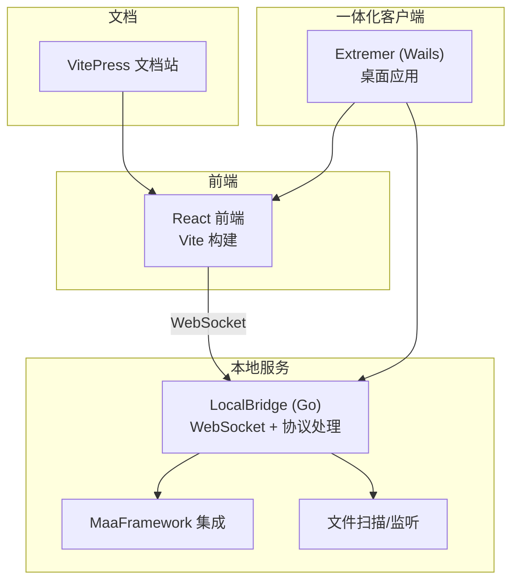
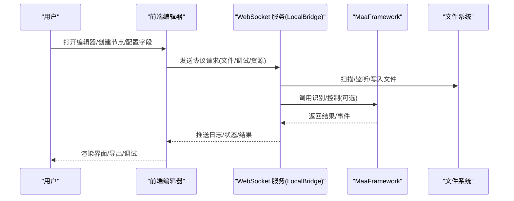
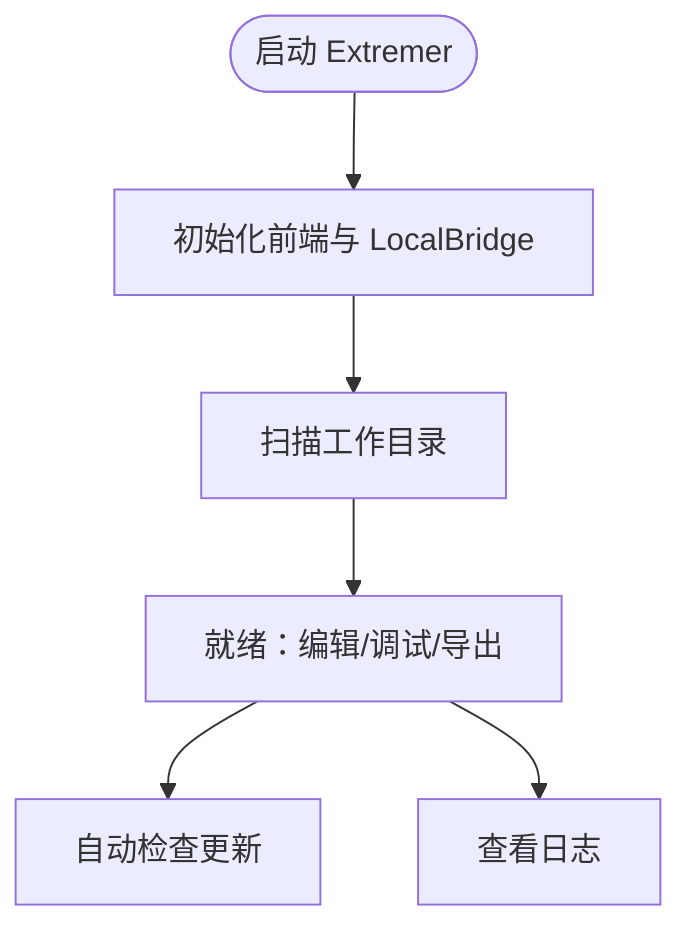
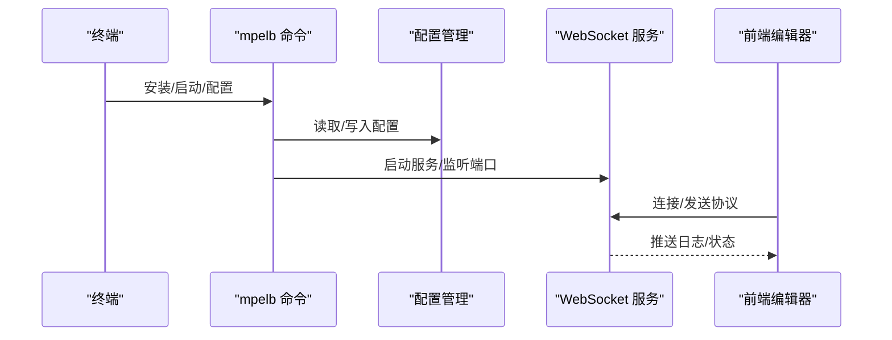
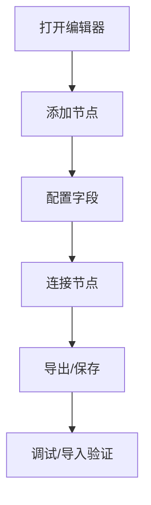
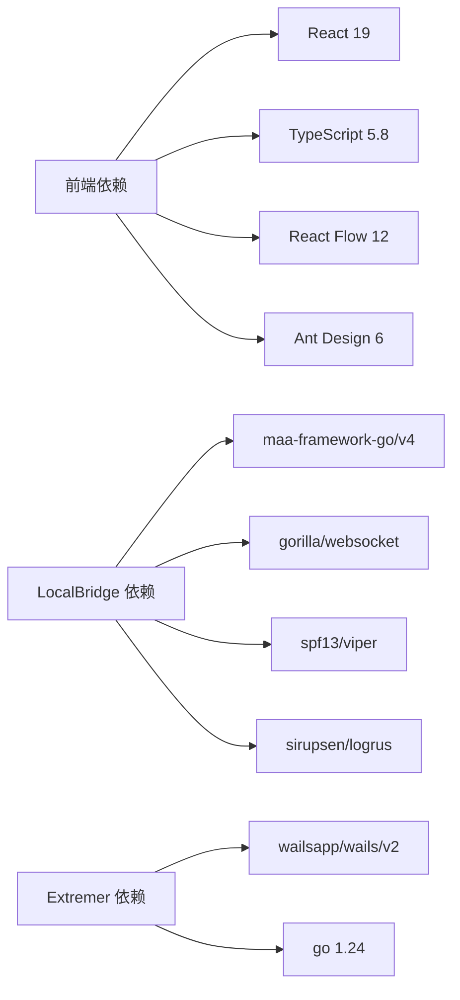

# 快速开始

<cite>
**本文引用的文件**
- [README.md](file://README.md)
- [package.json](file://package.json)
- [Extremer/package.json](file://Extremer/package.json)
- [LocalBridge/package.json](file://LocalBridge/package.json)
- [docsite/docs/01.指南/01.开始/02.快速上手.md](file://docsite/docs/01.指南/01.开始/02.快速上手.md)
- [docsite/docs/01.指南/25.本地一体包/01.概览与部署.md](file://docsite/docs/01.指南/25.本地一体包/01.概览与部署.md)
- [docsite/docs/01.指南/20.本地服务/01.概览与部署.md](file://docsite/docs/01.指南/20.本地服务/01.概览与部署.md)
- [tools/install.ps1](file://tools/install.ps1)
- [tools/install.bat](file://tools/install.bat)
- [tools/install.sh](file://tools/install.sh)
- [Extremer/go.mod](file://Extremer/go.mod)
- [LocalBridge/go.mod](file://LocalBridge/go.mod)
- [Extremer/main.go](file://Extremer/main.go)
- [LocalBridge/cmd/lb/main.go](file://LocalBridge/cmd/lb/main.go)
- [LocalBridge/internal/mfw/service.go](file://LocalBridge/internal/mfw/service.go)
- [LocalBridge/internal/mfw/error.go](file://LocalBridge/internal/mfw/error.go)
</cite>

## 目录
1. [简介](#简介)
2. [项目结构](#项目结构)
3. [核心组件](#核心组件)
4. [架构总览](#架构总览)
5. [详细组件分析](#详细组件分析)
6. [依赖关系分析](#依赖关系分析)
7. [性能考虑](#性能考虑)
8. [故障排除指南](#故障排除指南)
9. [结论](#结论)
10. [附录](#附录)

## 简介
MaaPipelineEditor（MPE）是一个可视化构建 MaaFramework Pipeline 的工作流编辑器。它提供在线使用、本地一体包以及源码编译等多种安装与运行方式，支持文件管理、截图工具、流程调试、AI 辅助等本地能力，帮助你以拖拽+配置的方式高效构建、调试与分享自动化流程。

- 在线编辑器：无需安装，直接访问稳定版在线站点即可开始
- 本地一体包：将前端编辑器与 LocalBridge 本地服务打包为单机应用，开箱即用
- 本地服务：通过命令行一键安装 LocalBridge，实现文件管理、截图识别、流程调试等增强功能
- 源码编译：基于前端与后端工程，可自行构建与定制

**章节来源**
- [README.md:30-120](file://README.md#L30-L120)

## 项目结构
仓库采用前后端分离架构，包含：
- 前端：React + TypeScript + Vite，提供可视化编辑界面与工具面板
- 后端：LocalBridge（Go），提供文件管理、MaaFramework 集成、WebSocket 通信等能力
- 一体化客户端：Extremer（Wails + Go），将前端与 LocalBridge 打包为桌面应用
- 文档站点：基于 VitePress 的文档与教程

**图表来源**
- [package.json:1-65](file://package.json#L1-L65)
- [LocalBridge/go.mod:1-38](file://LocalBridge/go.mod#L1-L38)
- [Extremer/go.mod:1-39](file://Extremer/go.mod#L1-L39)
- [Extremer/main.go:1-90](file://Extremer/main.go#L1-L90)
- [LocalBridge/cmd/lb/main.go:1-440](file://LocalBridge/cmd/lb/main.go#L1-L440)

**章节来源**
- [package.json:1-65](file://package.json#L1-L65)
- [Extremer/package.json:1-13](file://Extremer/package.json#L1-L13)
- [LocalBridge/package.json:1-8](file://LocalBridge/package.json#L1-L8)

## 核心组件
- 前端编辑器：提供节点模板、字段面板、连接、导入导出、调试与 AI 辅助等能力
- LocalBridge：本地服务，负责文件管理、MaaFramework 集成、WebSocket 通信、配置热重载
- Extremer：桌面一体化客户端，内置前端与 LocalBridge，开箱即用
- 文档与教程：提供从入门到进阶的使用指南与部署说明

**章节来源**
- [docsite/docs/01.指南/01.开始/02.快速上手.md:10-416](file://docsite/docs/01.指南/01.开始/02.快速上手.md#L10-L416)
- [docsite/docs/01.指南/20.本地服务/01.概览与部署.md:1-273](file://docsite/docs/01.指南/20.本地服务/01.概览与部署.md#L1-L273)
- [docsite/docs/01.指南/25.本地一体包/01.概览与部署.md:1-128](file://docsite/docs/01.指南/25.本地一体包/01.概览与部署.md#L1-L128)

## 架构总览
MPE 的典型使用路径包括在线编辑、本地服务增强与一体化客户端三种方式：

**图表来源**
- [LocalBridge/cmd/lb/main.go:317-440](file://LocalBridge/cmd/lb/main.go#L317-L440)
- [LocalBridge/internal/mfw/service.go:15-57](file://LocalBridge/internal/mfw/service.go#L15-L57)

## 详细组件分析

### 在线使用方式
- 直接访问稳定版在线站点，无需安装，即可进行可视化编辑
- 适合快速试用与分享，信息存储在本地，不上传至服务器
- 可在浏览器或类 VSCode 的 IDE 内嵌浏览器中使用

**章节来源**
- [README.md:24-44](file://README.md#L24-L44)
- [docsite/docs/01.指南/01.开始/02.快速上手.md:20-34](file://docsite/docs/01.指南/01.开始/02.快速上手.md#L20-L34)

### 本地一体包（Extremer）
- 将前端编辑器与 LocalBridge 服务打包为桌面应用，开箱即用
- 工作目录包含 Pipeline 文件、模板、图片资源与配置
- 支持在前端可视化修改配置，自动更新与日志管理

**图表来源**
- [Extremer/main.go:26-89](file://Extremer/main.go#L26-L89)
- [docsite/docs/01.指南/25.本地一体包/01.概览与部署.md:23-96](file://docsite/docs/01.指南/25.本地一体包/01.概览与部署.md#L23-L96)

**章节来源**
- [docsite/docs/01.指南/25.本地一体包/01.概览与部署.md:10-128](file://docsite/docs/01.指南/25.本地一体包/01.概览与部署.md#L10-L128)
- [Extremer/go.mod:1-39](file://Extremer/go.mod#L1-L39)

### 本地服务（LocalBridge）
- 通过命令行一键安装，支持 Windows、Linux、macOS
- 提供文件管理、字段辅助、流程调试、AI 辅助等能力
- 支持可视化配置与热重载，自动连接与断开

**图表来源**
- [tools/install.ps1:1-74](file://tools/install.ps1#L1-L74)
- [tools/install.bat:1-115](file://tools/install.bat#L1-L115)
- [tools/install.sh:1-92](file://tools/install.sh#L1-L92)
- [LocalBridge/cmd/lb/main.go:134-158](file://LocalBridge/cmd/lb/main.go#L134-L158)
- [LocalBridge/cmd/lb/main.go:182-440](file://LocalBridge/cmd/lb/main.go#L182-L440)

**章节来源**
- [docsite/docs/01.指南/20.本地服务/01.概览与部署.md:35-273](file://docsite/docs/01.指南/20.本地服务/01.概览与部署.md#L35-L273)
- [tools/install.ps1:1-74](file://tools/install.ps1#L1-L74)
- [tools/install.bat:1-115](file://tools/install.bat#L1-L115)
- [tools/install.sh:1-92](file://tools/install.sh#L1-L92)

### 源码编译安装
- 前端：使用 Vite 构建，支持开发与生产模式
- 后端：Go 1.24，集成 MaaFramework 与 WebSocket 协议
- 一体化：Wails 打包前端与 LocalBridge，生成桌面应用

**章节来源**
- [package.json:8-18](file://package.json#L8-L18)
- [LocalBridge/go.mod:3](file://LocalBridge/go.mod#L3)
- [Extremer/go.mod:3](file://Extremer/go.mod#L3)
- [Extremer/package.json:6-12](file://Extremer/package.json#L6-L12)

### 基本使用示例
- 打开编辑器：在线站点或本地服务
- 创建第一个 Pipeline：添加节点、配置字段、连接节点
- 导出与导入：支持粘贴板、文件、本地服务保存
- 调试与排错：查看日志、断点续行、自动布局

**图表来源**
- [docsite/docs/01.指南/01.开始/02.快速上手.md:52-416](file://docsite/docs/01.指南/01.开始/02.快速上手.md#L52-L416)

**章节来源**
- [docsite/docs/01.指南/01.开始/02.快速上手.md:10-416](file://docsite/docs/01.指南/01.开始/02.快速上手.md#L10-L416)

## 依赖关系分析
- 前端依赖 React 19、TypeScript 5.8、React Flow 12、Ant Design 6 等
- 后端依赖 MaaFramework Go 绑定、WebSocket、配置管理与文件监控
- 一体化客户端依赖 Wails 2 与 Go 1.24

**图表来源**
- [package.json:20-40](file://package.json#L20-L40)
- [LocalBridge/go.mod:5-16](file://LocalBridge/go.mod#L5-L16)
- [Extremer/go.mod:5-8](file://Extremer/go.mod#L5-L8)

**章节来源**
- [package.json:20-63](file://package.json#L20-L63)
- [LocalBridge/go.mod:1-38](file://LocalBridge/go.mod#L1-L38)
- [Extremer/go.mod:1-39](file://Extremer/go.mod#L1-L39)

## 性能考虑
- 在线使用：适合轻量编辑与快速分享，避免大规模文件频繁传输
- 本地服务：启用后可显著提升文件管理、截图识别与调试效率
- 一体化客户端：减少环境配置成本，适合长期本地化使用
- 导出策略：根据项目规模选择集成导出、分离导出或不导出，平衡可维护性与体积

[本节为通用建议，不直接分析具体文件]

## 故障排除指南
- 无法启动一体化客户端
  - 检查是否被杀毒软件拦截
  - 确认工作目录路径不包含中文或特殊字符
  - 查看日志文件获取详细错误信息

- WebSocket 连接失败
  - 检查端口是否被占用
  - 在前端配置中修改 WebSocket 端口
  - 重启应用使配置生效

- OCR 识别不可用
  - 在前端配置面板检查 MaaFramework 配置
  - 确认“启用 MaaFW”已勾选
  - 验证 Lib 目录与资源目录路径正确
  - 重启应用使配置生效

- 本地服务安装与启动
  - Windows：PowerShell 或 CMD 安装脚本
  - Linux/macOS：一键安装脚本
  - 启动后查看日志确认端口与扫描目录

**章节来源**
- [docsite/docs/01.指南/25.本地一体包/01.概览与部署.md:98-128](file://docsite/docs/01.指南/25.本地一体包/01.概览与部署.md#L98-L128)
- [docsite/docs/01.指南/20.本地服务/01.概览与部署.md:241-273](file://docsite/docs/01.指南/20.本地服务/01.概览与部署.md#L241-L273)
- [tools/install.ps1:1-74](file://tools/install.ps1#L1-L74)
- [tools/install.bat:1-115](file://tools/install.bat#L1-L115)
- [tools/install.sh:1-92](file://tools/install.sh#L1-L92)

## 结论
MaaPipelineEditor 提供从在线到本地的一体化解决方案，满足不同场景下的 Pipeline 编辑需求。通过本地服务与一体化客户端，你可以获得更强大的文件管理、截图识别与流程调试能力；通过文档与教程，你可以快速掌握从创建节点、配置字段到连接与导出的全流程操作。

[本节为总结，不直接分析具体文件]

## 附录

### 环境要求与前置条件
- 前端运行环境：现代浏览器或 VSCode 内嵌浏览器
- 本地服务：Go 1.24、MaaFramework（可选）
- 一体化客户端：Wails 2、Go 1.24
- 操作系统：Windows、macOS、Linux

**章节来源**
- [LocalBridge/go.mod:3](file://LocalBridge/go.mod#L3)
- [Extremer/go.mod:3](file://Extremer/go.mod#L3)
- [README.md:14-17](file://README.md#L14-L17)

### 多种安装方式
- 在线编辑器：直接访问稳定版在线站点
- 本地服务：一键安装脚本（Windows/PowerShell、Windows/CMD、Linux/macOS）
- 一体化客户端：从 GitHub Releases 下载对应平台安装包
- 源码编译：前端使用 Vite，后端使用 Go，一体化使用 Wails

**章节来源**
- [README.md:24-44](file://README.md#L24-L44)
- [docsite/docs/01.指南/20.本地服务/01.概览与部署.md:35-74](file://docsite/docs/01.指南/20.本地服务/01.概览与部署.md#L35-L74)
- [docsite/docs/01.指南/25.本地一体包/01.概览与部署.md:41-49](file://docsite/docs/01.指南/25.本地一体包/01.概览与部署.md#L41-L49)
- [package.json:8-18](file://package.json#L8-L18)
- [Extremer/package.json:6-12](file://Extremer/package.json#L6-L12)

### 基本操作清单
- 创建节点：右键面板或节点工具面板选择模板
- 配置字段：选中节点后在字段面板编辑键值
- 连接节点：拖拽端点连接，支持 next/on_error 标签
- 导出与导入：支持粘贴板、文件与本地服务保存
- 调试与排错：查看日志、断点续行、自动布局

**章节来源**
- [docsite/docs/01.指南/01.开始/02.快速上手.md:52-416](file://docsite/docs/01.指南/01.开始/02.快速上手.md#L52-L416)