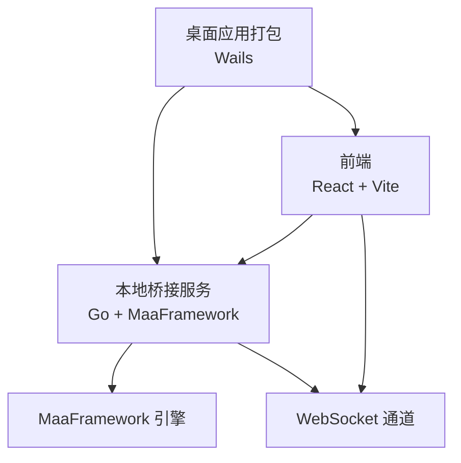
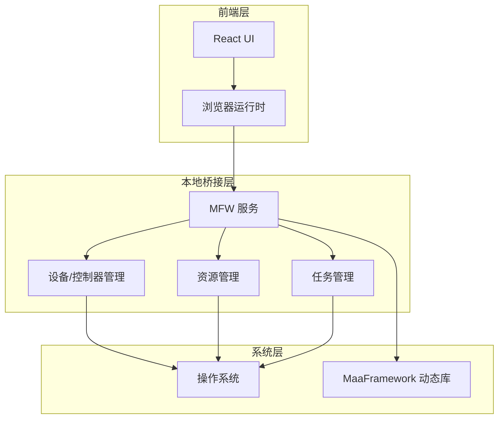
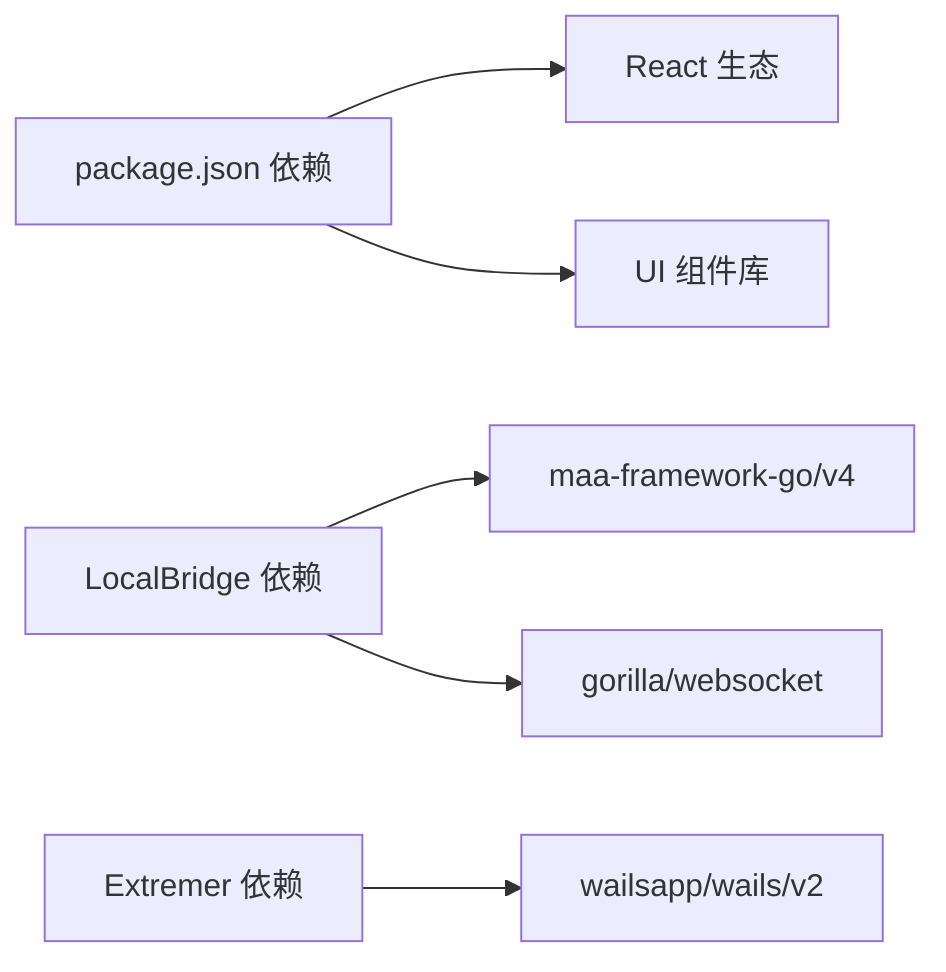

# 兼容性问题

<cite>
**本文引用的文件**
- [README.md](file://README.md)
- [package.json](file://package.json)
- [Extremer/wails.json](file://Extremer/wails.json)
- [Extremer/go.mod](file://Extremer/go.mod)
- [LocalBridge/go.mod](file://LocalBridge/go.mod)
- [LocalBridge/internal/mfw/service.go](file://LocalBridge/internal/mfw/service.go)
- [LocalBridge/internal/mfw/reco_detail_helper.go](file://LocalBridge/internal/mfw/reco_detail_helper.go)
- [LocalBridge/internal/mfw/lib_loader_windows.go](file://LocalBridge/internal/mfw/lib_loader_windows.go)
- [LocalBridge/internal/mfw/lib_loader_unix.go](file://LocalBridge/internal/mfw/lib_loader_unix.go)
- [LocalBridge/internal/mfw/path_unix.go](file://LocalBridge/internal/mfw/path_unix.go)
- [LocalBridge/internal/mfw/path_windows.go](file://LocalBridge/internal/mfw/path_windows.go)
- [LocalBridge/cmd/lb/main.go](file://LocalBridge/cmd/lb/main.go)
- [.github/workflows/release.yaml](file://.github/workflows/release.yaml)
- [Extremer/frontend/wailsjs/runtime/runtime.js](file://Extremer/frontend/wailsjs/runtime/runtime.js)
- [src/components/panels/main/ConnectionPanel.tsx](file://src/components/panels/main/ConnectionPanel.tsx)
</cite>

## 目录
1. [简介](#简介)
2. [项目结构](#项目结构)
3. [核心组件](#核心组件)
4. [架构总览](#架构总览)
5. [详细组件分析](#详细组件分析)
6. [依赖关系分析](#依赖关系分析)
7. [性能考虑](#性能考虑)
8. [故障排除指南](#故障排除指南)
9. [结论](#结论)
10. [附录](#附录)

## 简介
本文件面向使用 MaaPipelineEditor（MPE）的用户与运维人员，系统梳理跨操作系统（Windows、macOS、Linux）、跨浏览器（Chrome、Firefox、Safari、Edge）以及硬件与 MaaFramework 版本兼容性问题，并提供部署前的环境检查清单、优化配置建议与常见故障排除步骤。MPE 采用前后端分离架构，前端基于 React 19 与 Vite，后端本地桥接服务（LocalBridge）以 Go 实现，通过 Wails 为 Windows/macOS/Linux 打包为桌面应用（Extremer）。本地能力通过 WebSocket 与前端交互，支持截图、设备控制、资源加载与任务执行。

## 项目结构
- 前端（src/...）：React + TypeScript + Vite，负责可视化编辑、节点连接、字段面板、调试与工具集。
- 本地桥接（LocalBridge/...）：Go 实现的服务层，封装 MaaFramework（MFW）调用、设备与控制器管理、资源与任务管理。
- 打包与桌面应用（Extremer/...）：基于 Wails，将前端与本地桥接打包为桌面应用，支持窗口控制、屏幕信息等。
- 文档站点（docsite/...）：配套文档与示例。
- 工具与脚本（tools/...）：安装脚本、跳转页等。

图表来源
- [package.json:1-65](file://package.json#L1-L65)
- [Extremer/go.mod:1-39](file://Extremer/go.mod#L1-L39)
- [LocalBridge/go.mod:1-38](file://LocalBridge/go.mod#L1-L38)

章节来源
- [README.md:1-151](file://README.md#L1-L151)
- [package.json:1-65](file://package.json#L1-L65)
- [Extremer/go.mod:1-39](file://Extremer/go.mod#L1-L39)
- [LocalBridge/go.mod:1-38](file://LocalBridge/go.mod#L1-L38)

## 核心组件
- 前端编辑器：提供节点式工作流编辑、字段面板、连接与视口管理、调试与 AI 辅助。
- 本地桥接服务（LocalBridge）：封装 MFW 初始化、资源与任务管理、设备与控制器管理、WebSocket 服务。
- 桌面应用（Extremer）：基于 Wails 的跨平台桌面打包，提供窗口控制、环境信息与浏览器打开能力。
- MaaFramework（MFW）：底层自动化引擎，通过动态库加载与适配器模式对接。

章节来源
- [README.md:31-91](file://README.md#L31-L91)
- [LocalBridge/internal/mfw/service.go:1-217](file://LocalBridge/internal/mfw/service.go#L1-L217)

## 架构总览
MPE 的兼容性主要体现在三方面：
- 操作系统与平台：Windows/macOS/Linux 的动态库加载、路径处理、窗口与屏幕 API。
- 浏览器与前端：Web 技术栈在不同浏览器中的行为差异与兼容性。
- MFW 版本与本地服务：MFW 库版本、路径配置与服务初始化的稳定性。

图表来源
- [LocalBridge/internal/mfw/service.go:1-217](file://LocalBridge/internal/mfw/service.go#L1-L217)
- [Extremer/frontend/wailsjs/runtime/runtime.js:120-186](file://Extremer/frontend/wailsjs/runtime/runtime.js#L120-L186)

## 详细组件分析

### 操作系统兼容性差异与已知问题
- Windows
  - 动态库加载：使用系统 LoadLibrary 接口加载 MaaFramework.dll。
  - 路径处理：支持长路径与短路径（8.3）转换，避免非 ASCII 路径问题。
  - 桌面应用：Wails 提供窗口控制、屏幕信息、环境变量等 API。
- macOS/Linux
  - 动态库加载：使用 purego Dlopen 加载 libMaaFramework.so 或 .dylib。
  - 路径处理：非 ASCII 字符检测与短路径转换在 Windows 上有差异。
  - MFW 库文件名区分架构：darwin-amd64 与 darwin-arm64。
- 已知问题
  - 非 ASCII 路径：在某些平台组合下可能导致资源加载失败，需确保路径仅含 ASCII 字符或使用短路径。
  - MFW 库版本不匹配：初始化时若库版本不兼容会触发 panic 并被转换为错误，提示更新 MFW。

章节来源
- [LocalBridge/internal/mfw/lib_loader_windows.go:1-21](file://LocalBridge/internal/mfw/lib_loader_windows.go#L1-L21)
- [LocalBridge/internal/mfw/lib_loader_unix.go:1-19](file://LocalBridge/internal/mfw/lib_loader_unix.go#L1-L19)
- [LocalBridge/internal/mfw/path_windows.go:1-57](file://LocalBridge/internal/mfw/path_windows.go#L1-L57)
- [LocalBridge/internal/mfw/path_unix.go:1-22](file://LocalBridge/internal/mfw/path_unix.go#L1-L22)
- [LocalBridge/internal/mfw/reco_detail_helper.go:93-115](file://LocalBridge/internal/mfw/reco_detail_helper.go#L93-L115)
- [LocalBridge/internal/mfw/service.go:36-51](file://LocalBridge/internal/mfw/service.go#L36-L51)

### 浏览器兼容性配置与解决方案
- 通用建议
  - 使用现代浏览器（Chrome/Firefox/Safari/Edge）的最新稳定版本。
  - 确保启用 JavaScript、WebSocket 与必要的权限（如摄像头/麦克风、文件访问等）。
  - 若使用本地服务，确保前端与本地桥接之间的 WebSocket 连接可达且无代理阻断。
- Chrome/Edge
  - 默认支持良好，注意跨域策略与证书问题（本地开发建议使用受信证书或禁用安全策略进行测试）。
- Firefox
  - 对 WebSocket 与文件 API 支持良好，注意隐私设置与权限弹窗。
- Safari
  - 移动端与桌面端行为差异较大，注意手势与触摸事件处理、权限弹窗时机。
- 已知问题
  - 非标准浏览器或旧版本可能缺少必要 API（如 DeviceOrientation、WebAssembly、ES2020+ 能力），导致 UI 或功能异常。

章节来源
- [Extremer/frontend/wailsjs/runtime/runtime.js:120-186](file://Extremer/frontend/wailsjs/runtime/runtime.js#L120-L186)
- [README.md:41-52](file://README.md#L41-L52)

### 硬件要求与性能基准
- 系统与运行时
  - 前端：现代浏览器 + React 19 + Vite，对 CPU/内存要求取决于画布节点数量与图像处理负载。
  - 本地服务：Go 1.24，依赖 MaaFramework 动态库，需满足 MFW 的最低系统要求。
- 显卡与驱动
  - 若使用 GPU 相关识别或渲染，需确保显卡驱动稳定，避免与系统窗口捕获冲突。
- 存储与路径
  - 避免非 ASCII 路径与长路径，优先使用短路径或英文路径，减少库加载失败风险。
- 性能建议
  - 控制节点数量与图像分辨率，合理使用缓存与懒加载。
  - 减少不必要的 WebSocket 事件与高频刷新。

章节来源
- [LocalBridge/internal/mfw/path_windows.go:22-57](file://LocalBridge/internal/mfw/path_windows.go#L22-L57)
- [LocalBridge/internal/mfw/path_unix.go:17-22](file://LocalBridge/internal/mfw/path_unix.go#L17-L22)

### MaaFramework 版本兼容性与迁移注意事项
- 版本与依赖
  - LocalBridge 使用 maa-framework-go/v4 v4.x，需与对应版本的 MaaFramework 动态库匹配。
  - 发布流程会自动拉取 MaaFramework Release 的最新版本并并行下载多平台资源包。
- 兼容性差异
  - 不同 MFW 版本间 API 变化可能导致初始化失败或功能缺失，需保持 MFW 与本地桥接版本一致。
  - 初始化阶段若出现 panic，会被捕获并提示更新 MFW。
- 迁移建议
  - 更新 MFW 后，清理旧资源并重新初始化本地服务。
  - 导入旧项目时，利用 MPE 的自动迁移与兼容特性，但需验证关键节点与字段映射。

章节来源
- [LocalBridge/go.mod:5-16](file://LocalBridge/go.mod#L5-L16)
- [LocalBridge/internal/mfw/service.go:36-51](file://LocalBridge/internal/mfw/service.go#L36-L51)
- [.github/workflows/release.yaml:202-227](file://.github/workflows/release.yaml#L202-L227)

### 系统环境检查清单（部署前）
- 操作系统与架构
  - 确认目标平台（Windows/macOS/Linux）与架构（amd64/arm64）与 MFW 包一致。
  - 检查动态库文件是否存在且可加载（MaaFramework.dll/.so/.dylib）。
- 路径与字符集
  - 确认 MFW 库目录与资源路径仅包含 ASCII 字符，避免非 ASCII 导致加载失败。
  - Windows 环境下确认短路径可用。
- 权限与驱动
  - 确认显卡驱动与系统窗口捕获能力正常。
  - 若使用手柄功能，确保 ViGEm Bus Driver 已安装。
- 本地服务与网络
  - 启动本地桥接服务，确认 WebSocket 端口未被占用且可访问。
  - 前端与本地服务之间连通性正常。
- 浏览器与前端
  - 使用最新稳定版浏览器，开启必要权限与功能。
  - 若使用桌面应用（Extremer），确认 Wails 运行时与系统窗口 API 正常。

章节来源
- [LocalBridge/cmd/lb/main.go:692-721](file://LocalBridge/cmd/lb/main.go#L692-L721)
- [src/components/panels/main/ConnectionPanel.tsx:692-753](file://src/components/panels/main/ConnectionPanel.tsx#L692-L753)
- [Extremer/frontend/wailsjs/runtime/runtime.js:120-186](file://Extremer/frontend/wailsjs/runtime/runtime.js#L120-L186)

### 优化配置建议与故障排除步骤
- 优化建议
  - 本地服务：合理配置 MFW 库路径与资源目录，避免频繁 IO 与路径解析。
  - 前端：减少一次性渲染节点数量，使用虚拟滚动与按需加载。
  - 桌面应用：根据屏幕 DPI 与缩放设置调整窗口尺寸与字体大小。
- 故障排除
  - MFW 初始化失败：检查库版本与路径，确保库文件存在且可加载；参考服务初始化错误提示。
  - 动态库加载失败：确认平台与架构匹配，检查纯 Go 或系统 API 的加载错误。
  - 路径问题：将路径改为纯 ASCII 与短路径，避免包含空格或特殊字符。
  - 手柄功能不可用：确认 ViGEm Bus Driver 安装与权限，检查窗口句柄与截图方法配置。
  - 浏览器兼容性：升级浏览器版本，检查权限弹窗与跨域策略。

章节来源
- [LocalBridge/internal/mfw/service.go:36-51](file://LocalBridge/internal/mfw/service.go#L36-L51)
- [LocalBridge/internal/mfw/reco_detail_helper.go:93-115](file://LocalBridge/internal/mfw/reco_detail_helper.go#L93-L115)
- [src/components/panels/main/ConnectionPanel.tsx:692-753](file://src/components/panels/main/ConnectionPanel.tsx#L692-L753)

## 依赖关系分析
- 前端依赖
  - React 19、Ant Design 6、React Flow 12、TypeScript 5.8、Vite 7 等，构成现代化前端生态。
- 本地桥接依赖
  - maa-framework-go/v4 提供 MFW 封装；gorilla/websocket 提供 WebSocket 服务；fsnotify、logrus 等辅助。
- 打包与桌面应用
  - Wails v2 作为跨平台桌面应用框架，提供窗口控制与系统集成能力。

图表来源
- [package.json:20-40](file://package.json#L20-L40)
- [LocalBridge/go.mod:5-16](file://LocalBridge/go.mod#L5-L16)
- [Extremer/go.mod:6-8](file://Extremer/go.mod#L6-L8)

章节来源
- [package.json:20-40](file://package.json#L20-L40)
- [LocalBridge/go.mod:5-16](file://LocalBridge/go.mod#L5-L16)
- [Extremer/go.mod:6-8](file://Extremer/go.mod#L6-L8)

## 性能考虑
- 前端性能
  - 节点数量与图像处理会显著影响渲染性能，建议分批加载与缓存。
  - 合理使用虚拟化与懒加载，减少 DOM 与内存压力。
- 本地服务性能
  - MFW 初始化与资源加载耗时较长，建议在后台异步执行并提供进度反馈。
  - 控制并发任务数量，避免系统资源争用。
- 网络与 I/O
  - WebSocket 传输大量数据时，建议压缩与分块传输，降低带宽与延迟。

## 故障排除指南
- MFW 初始化失败
  - 现象：启动时报错，提示库版本不匹配或初始化失败。
  - 处理：更新 MaaFramework 到最新版本，确保与本地桥接版本一致；检查库文件路径与权限。
- 动态库加载失败
  - 现象：无法加载 MaaFramework.dll/.so/.dylib。
  - 处理：确认平台与架构匹配；检查纯 Go 或系统 API 的加载错误；确保路径正确。
- 路径问题导致资源加载失败
  - 现象：资源无法加载或节点渲染异常。
  - 处理：将路径改为纯 ASCII 与短路径；避免包含空格或特殊字符。
- 手柄功能不可用
  - 现象：手柄输入无效或报错。
  - 处理：安装 ViGEm Bus Driver；检查窗口句柄与截图方法配置。
- 浏览器兼容性问题
  - 现象：部分功能在特定浏览器中不可用或异常。
  - 处理：升级浏览器到最新稳定版；检查权限弹窗与跨域策略。

章节来源
- [LocalBridge/internal/mfw/service.go:36-51](file://LocalBridge/internal/mfw/service.go#L36-L51)
- [LocalBridge/internal/mfw/reco_detail_helper.go:93-115](file://LocalBridge/internal/mfw/reco_detail_helper.go#L93-L115)
- [src/components/panels/main/ConnectionPanel.tsx:692-753](file://src/components/panels/main/ConnectionPanel.tsx#L692-L753)

## 结论
MaaPipelineEditor 在跨平台与跨浏览器方面具备良好基础，但在实际部署中仍需关注 MFW 版本一致性、路径字符集、动态库加载与权限配置等问题。通过遵循本文提供的环境检查清单、优化配置建议与故障排除步骤，可有效降低兼容性风险并提升用户体验。

## 附录
- 桌面应用打包配置（Wails）
  - 产品名称、版本与构建目录等信息在打包配置中定义，便于统一发布与维护。
- 发布流程与 MFW 资源下载
  - 发布流程会自动获取 MaaFramework 最新版本并并行下载多平台资源包，确保本地服务与桌面应用的运行时依赖一致。

章节来源
- [Extremer/wails.json:1-18](file://Extremer/wails.json#L1-L18)
- [.github/workflows/release.yaml:202-227](file://.github/workflows/release.yaml#L202-L227)