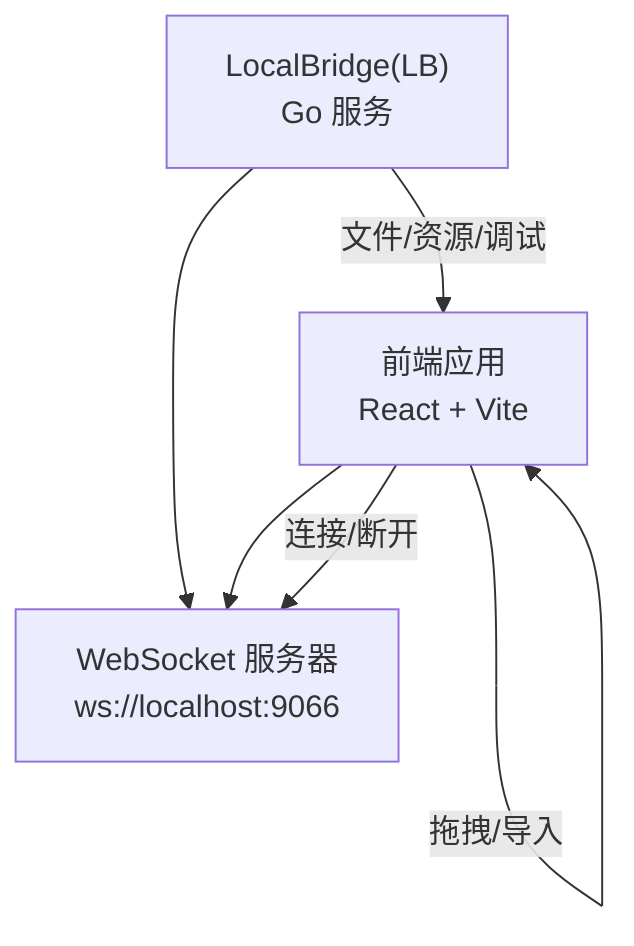
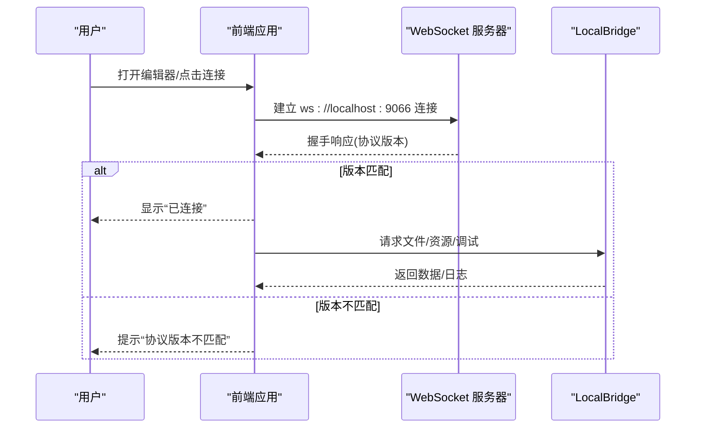
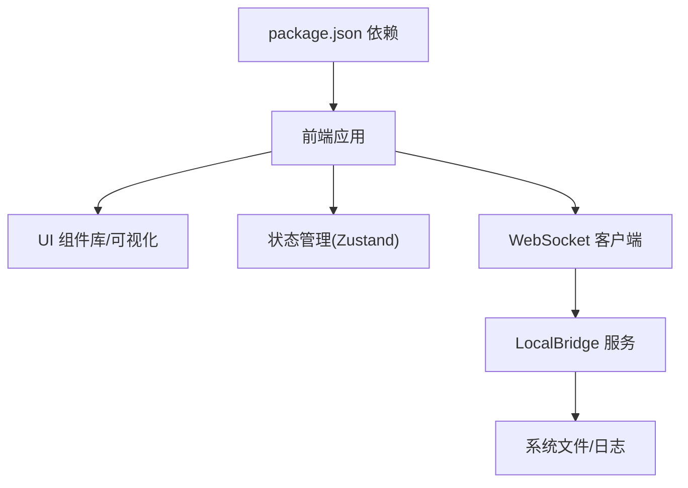

# 常见问题

<cite>
**本文引用的文件**
- [README.md](file://README.md)
- [package.json](file://package.json)
- [Extremer/main.go](file://Extremer/main.go)
- [src/App.tsx](file://src/App.tsx)
- [src/utils/wailsBridge.ts](file://src/utils/wailsBridge.ts)
- [src/services/server.ts](file://src/services/server.ts)
- [LocalBridge/cmd/lb/main.go](file://LocalBridge/cmd/lb/main.go)
- [docsite/docs/01.指南/20.本地服务/01.概览与部署.md](file://docsite/docs/01.指南/20.本地服务/01.概览与部署.md)
- [docsite/docs/01.指南/100.其他/10.通信协议.md](file://docsite/docs/01.指南/100.其他/10.通信协议.md)
- [src/components/panels/main/FilePanel.tsx](file://src/components/panels/main/FilePanel.tsx)
- [src/stores/errorStore.ts](file://src/stores/errorStore.ts)
- [LocalBridge/internal/errors/errors.go](file://LocalBridge/internal/errors/errors.go)
</cite>

## 目录
1. [简介](#简介)
2. [项目结构](#项目结构)
3. [核心组件](#核心组件)
4. [架构总览](#架构总览)
5. [详细组件分析](#详细组件分析)
6. [依赖分析](#依赖分析)
7. [性能考虑](#性能考虑)
8. [故障排查指南](#故障排查指南)
9. [结论](#结论)
10. [附录](#附录)

## 简介
本常见问题解答面向首次使用或在使用 MaaPipelineEditor（MPE）过程中遇到安装、启动、连接、功能按钮无响应、文件导入失败等问题的用户。文档基于仓库中的前端、本地桥接（LocalBridge）、Wails 打包应用以及文档站内容，总结典型症状、可能原因、解决步骤与预防措施，并提供自助排查清单与快速解决方案。

## 项目结构
MPE 采用前后端分离架构：
- 前端：React 19 + TypeScript + Vite，负责可视化编辑、面板交互、WebSocket 本地通信。
- 本地桥接（LocalBridge，LB）：Go 实现的 WebSocket 服务，提供文件管理、截图、调试、MaaFramework 集成等能力。
- Wails 打包：Extremer 目录使用 Wails 将前端打包为桌面应用，提供启动画面、系统托盘等体验增强。
- 文档站：docsite 提供部署、协议、功能使用说明。

图表来源
- [src/services/server.ts:20-333](file://src/services/server.ts#L20-L333)
- [docsite/docs/01.指南/20.本地服务/01.概览与部署.md:20-273](file://docsite/docs/01.指南/20.本地服务/01.概览与部署.md#L20-L273)

章节来源
- [README.md:31-120](file://README.md#L31-L120)
- [package.json:1-65](file://package.json#L1-L65)

## 核心组件
- 前端连接与状态管理：负责自动连接、握手校验、连接超时、错误提示与 UI 状态同步。
- LocalBridge：提供文件扫描、资源管理、MFW 服务、日志推送、配置热重载等。
- Wails 打包：桌面应用入口，负责窗口生命周期、启动画面、与前端桥接事件。
- 文档与协议：提供部署、端口、协议版本、消息格式等规范。

章节来源
- [src/services/server.ts:20-373](file://src/services/server.ts#L20-L373)
- [LocalBridge/cmd/lb/main.go:182-440](file://LocalBridge/cmd/lb/main.go#L182-L440)
- [Extremer/main.go:26-89](file://Extremer/main.go#L26-L89)
- [docsite/docs/01.指南/100.其他/10.通信协议.md:25-56](file://docsite/docs/01.指南/100.其他/10.通信协议.md#L25-L56)

## 架构总览
MPE 的本地通信基于 WebSocket，前端在连接时发送协议版本握手，若版本不匹配会提示升级；LB 启动后监听本地端口，前端连接成功后可进行文件、资源、调试等交互。

图表来源
- [src/services/server.ts:104-251](file://src/services/server.ts#L104-L251)
- [docsite/docs/01.指南/100.其他/10.通信协议.md:99-107](file://docsite/docs/01.指南/100.其他/10.通信协议.md#L99-L107)

章节来源
- [docsite/docs/01.指南/20.本地服务/01.概览与部署.md:203-229](file://docsite/docs/01.指南/20.本地服务/01.概览与部署.md#L203-L229)

## 详细组件分析

### 问题一：应用无法启动
- 症状
  - 在线版无法访问或白屏
  - 桌面版启动后黑屏或立即退出
- 可能原因
  - 浏览器兼容性或网络问题
  - Wails 打包应用缺少运行时或权限不足
  - 启动画面异常导致主窗体未显示
- 解决步骤
  - 在线版：更换浏览器、检查网络、清除缓存后重试
  - 桌面版：以管理员权限运行；查看系统托盘或任务管理器确认进程；查看日志目录定位错误
  - 若出现启动画面：等待启动画面结束，确认主窗体是否被遮挡
- 预防措施
  - 使用推荐的浏览器与系统版本
  - 桌面版安装后测试一次连接本地服务，确保端口可用
- 截图示例
  - 启动画面异常：桌面应用启动后无主窗口显示
  - 权限不足：安装后无法写入配置目录

章节来源
- [Extremer/main.go:26-89](file://Extremer/main.go#L26-L89)
- [docsite/docs/01.指南/20.本地服务/01.概览与部署.md:75-102](file://docsite/docs/01.指南/20.本地服务/01.概览与部署.md#L75-L102)

### 问题二：界面显示异常
- 症状
  - 布局错位、面板重叠、主题不生效
  - 拖拽排序失效、标签页无法切换
- 可能原因
  - 浏览器缩放或分辨率异常
  - 前端缓存损坏
  - 文件面板标签页状态异常
- 解决步骤
  - 调整浏览器缩放至 100%，刷新页面
  - 清除浏览器缓存或更换浏览器
  - 刷新页面后重新加载本地缓存
  - 在文件面板中检查标签页状态，避免重复命名导致的异常
- 预防措施
  - 使用推荐分辨率与缩放比例
  - 定期清理缓存

章节来源
- [src/components/panels/main/FilePanel.tsx:48-84](file://src/components/panels/main/FilePanel.tsx#L48-L84)
- [src/App.tsx:150-162](file://src/App.tsx#L150-L162)

### 问题三：功能按钮无响应
- 症状
  - “连接本地服务”按钮点击无效
  - 导入/导出按钮无反应
  - 调试/日志面板不更新
- 可能原因
  - 本地服务未启动或端口被占用
  - 协议版本不匹配导致握手失败
  - 前端处于连接中状态，重复点击导致状态冲突
- 解决步骤
  - 启动 LocalBridge 并确认端口（默认 9066）
  - 在前端配置面板中核对端口，重新点击连接
  - 若提示“协议版本不匹配”，按提示更新本地服务
  - 等待连接完成后再进行操作
- 预防措施
  - 修改端口后同步更新前端配置
  - 避免频繁点击连接按钮

章节来源
- [src/services/server.ts:104-251](file://src/services/server.ts#L104-L251)
- [docsite/docs/01.指南/20.本地服务/01.概览与部署.md:217-228](file://docsite/docs/01.指南/20.本地服务/01.概览与部署.md#L217-L228)

### 问题四：文件导入失败
- 症状
  - 拖拽 .json/.jsonc 文件无反应
  - 导入弹窗提示格式错误
- 可能原因
  - 文件类型不被支持（需 .json 或 .jsonc）
  - 文件内容不符合 Pipeline 结构或 JSON 格式错误
  - 前端解析异常
- 解决步骤
  - 确认文件扩展名为 .json 或 .jsonc
  - 使用在线 JSON 校验工具检查文件格式
  - 重新拖拽或选择文件导入
- 预防措施
  - 使用已有的模板或导出的文件作为基准
  - 导入前先在编辑器中新建空白文件，再粘贴内容

章节来源
- [src/App.tsx:115-140](file://src/App.tsx#L115-L140)

### 问题五：连接断开
- 症状
  - 连接状态从“已连接”变为“未连接”
  - 日志面板不再更新
- 可能原因
  - LocalBridge 进程意外退出
  - 网络波动或防火墙拦截
  - 端口被占用或前端配置不一致
- 解决步骤
  - 重启 LocalBridge 并确认端口
  - 在前端配置面板中重新设置端口并点击连接
  - 检查防火墙或杀毒软件是否拦截
- 预防措施
  - 使用固定端口并在防火墙中放行
  - 开启“自动连接”选项，便于启动后自动恢复

章节来源
- [src/services/server.ts:253-266](file://src/services/server.ts#L253-L266)
- [docsite/docs/01.指南/20.本地服务/01.概览与部署.md:230-239](file://docsite/docs/01.指南/20.本地服务/01.概览与部署.md#L230-L239)

### 问题六：协议版本不匹配
- 症状
  - 连接后立即断开，提示“协议版本不匹配”
- 可能原因
  - 前端与 LocalBridge 使用了不同版本的协议
- 解决步骤
  - 按提示更新 LocalBridge 至最新版本
  - 重新启动 LocalBridge 并再次连接
- 预防措施
  - 定期检查更新通知并及时升级

章节来源
- [src/services/server.ts:38-65](file://src/services/server.ts#L38-L65)
- [LocalBridge/cmd/lb/main.go:729-766](file://LocalBridge/cmd/lb/main.go#L729-L766)

### 问题七：MaaFramework 路径未配置
- 症状
  - 启动 LocalBridge 时提示未配置 MaaFramework 路径
- 可能原因
  - 启用了 MFW 功能但未设置 lib 路径
- 解决步骤
  - 使用命令行配置 lib 路径与 OCR 资源路径
  - 保存配置后 LocalBridge 会自动启用相关功能
- 预防措施
  - 首次启用 MFW 功能时即完成路径配置

章节来源
- [LocalBridge/cmd/lb/main.go:679-721](file://LocalBridge/cmd/lb/main.go#L679-L721)
- [docsite/docs/01.指南/20.本地服务/01.概览与部署.md:241-253](file://docsite/docs/01.指南/20.本地服务/01.概览与部署.md#L241-L253)

### 问题八：Wails 环境下桥接异常
- 症状
  - 桌面应用中无法获取端口或桥接状态异常
- 可能原因
  - Wails 运行时未正确初始化
  - 后端未暴露桥接接口
- 解决步骤
  - 确认桌面应用为 Wails 构建版本
  - 查看日志中关于桥接事件的输出
  - 重启应用或后端服务
- 预防措施
  - 使用官方打包版本，避免自定义运行时

章节来源
- [src/utils/wailsBridge.ts:41-131](file://src/utils/wailsBridge.ts#L41-L131)
- [src/App.tsx:215-269](file://src/App.tsx#L215-L269)

## 依赖分析
- 前端依赖
  - React 19、Ant Design 6、React Flow、Zustand 等，负责 UI、状态与可视化编辑
- 本地服务依赖
  - Go 语言生态，提供 WebSocket 服务、文件扫描、日志推送、MFW 集成
- 打包与运行
  - Wails 2 提供桌面应用能力，支持启动画面、系统托盘与事件桥接

图表来源
- [package.json:20-40](file://package.json#L20-L40)
- [src/services/server.ts:1-18](file://src/services/server.ts#L1-L18)

章节来源
- [package.json:20-63](file://package.json#L20-L63)

## 性能考虑
- 连接超时与重连策略：前端设置 3 秒连接超时，避免长时间阻塞
- 日志推送：LB 将历史日志推送到前端，便于快速定位问题
- 端口与资源：建议固定端口并避免占用，减少重连成本

章节来源
- [docsite/docs/01.指南/100.其他/10.通信协议.md:34-36](file://docsite/docs/01.指南/100.其他/10.通信协议.md#L34-L36)
- [src/services/server.ts:29-29](file://src/services/server.ts#L29-L29)

## 故障排查指南

### 自助排查清单
- 基础检查
  - 浏览器/系统版本是否符合推荐要求
  - 网络是否正常，代理/防火墙是否拦截
- 本地服务检查
  - LocalBridge 是否在运行，端口是否被占用
  - 配置文件路径与日志目录是否可访问
- 前端检查
  - 端口配置是否与 LB 一致
  - 是否出现“协议版本不匹配”提示
  - 是否处于“连接中”状态
- 错误定位
  - 查看前端错误面板与日志面板
  - 检查 LB 日志目录中的历史日志

### 快速解决方案
- 本地服务未启动：使用安装脚本或手动启动 LocalBridge，默认端口 9066
- 端口冲突：修改 LB 端口并在前端同步更新
- 协议不匹配：升级 LocalBridge 至最新版本
- 文件导入失败：确认文件类型与 JSON 格式
- 连接断开：重启 LocalBridge 并重新连接

章节来源
- [docsite/docs/01.指南/20.本地服务/01.概览与部署.md:75-158](file://docsite/docs/01.指南/20.本地服务/01.概览与部署.md#L75-L158)
- [src/services/server.ts:104-251](file://src/services/server.ts#L104-L251)

## 结论
通过以上常见问题的梳理与解决步骤，用户可快速定位并修复安装、启动、连接、功能按钮无响应、文件导入失败、连接断开等问题。建议在使用前完成本地服务部署与端口配置，并定期检查更新，以获得最佳体验。

## 附录

### 通信协议与端口
- 默认端口：9066
- 连接超时：3 秒
- 握手：前端发送协议版本，LB 校验后返回结果

章节来源
- [docsite/docs/01.指南/100.其他/10.通信协议.md:29-56](file://docsite/docs/01.指南/100.其他/10.通信协议.md#L29-L56)

### 错误码与提示
- 前端错误提示：根据后端返回的错误码映射显示用户可读信息
- LB 错误码：包含文件、权限、内部错误等标准错误码

章节来源
- [src/services/server.ts:38-67](file://src/services/server.ts#L38-L67)
- [LocalBridge/internal/errors/errors.go:9-60](file://LocalBridge/internal/errors/errors.go#L9-L60)