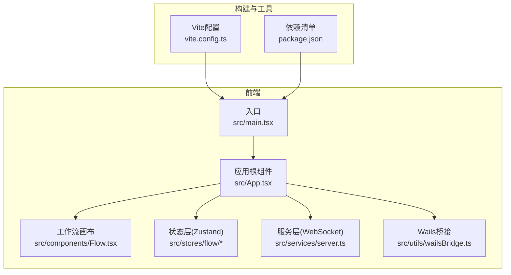
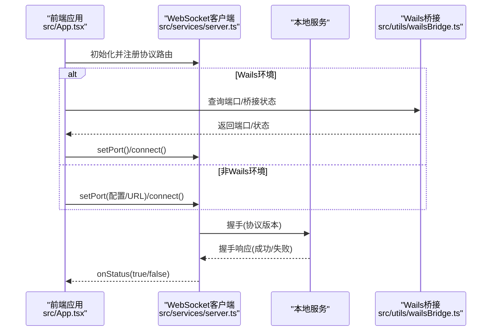
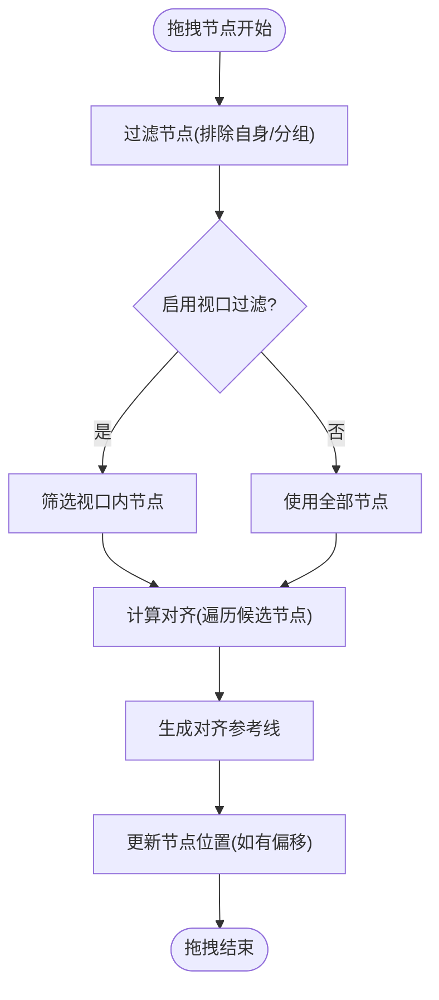
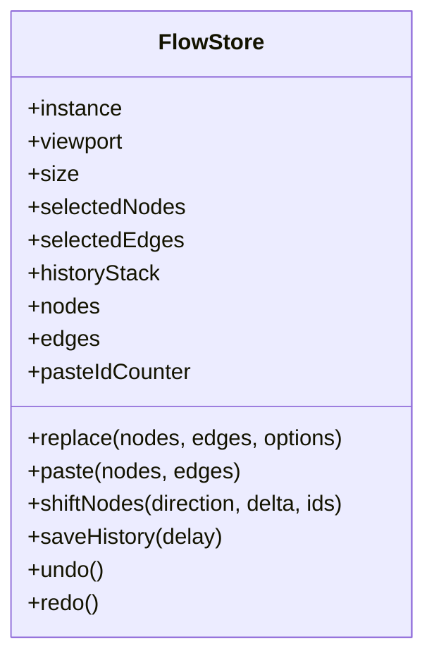
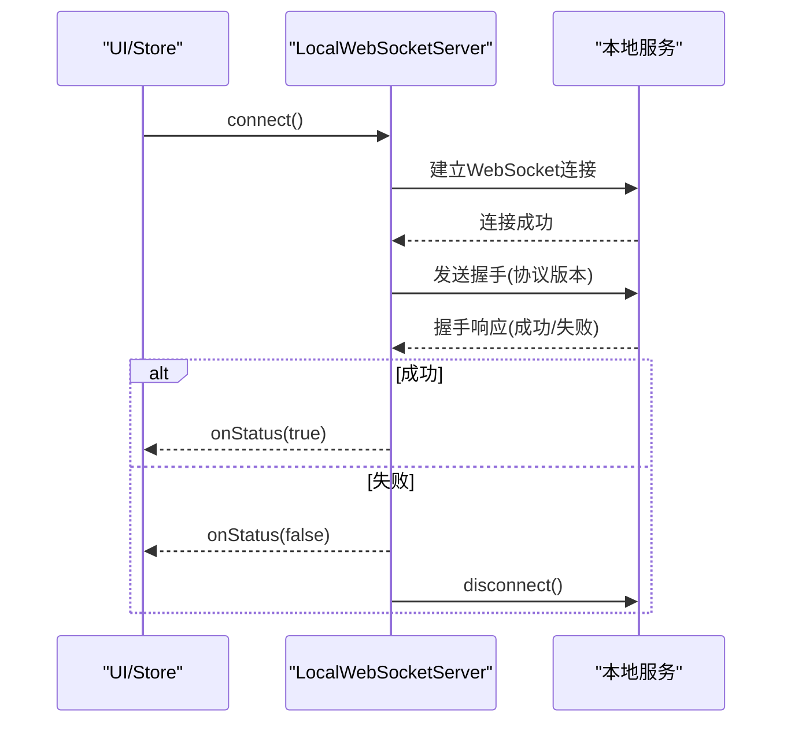
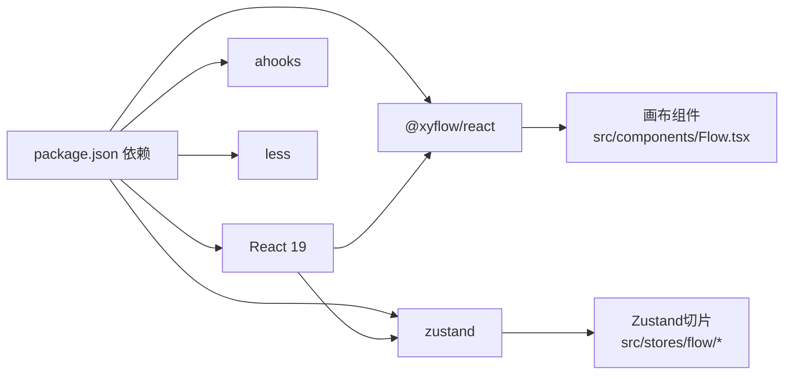
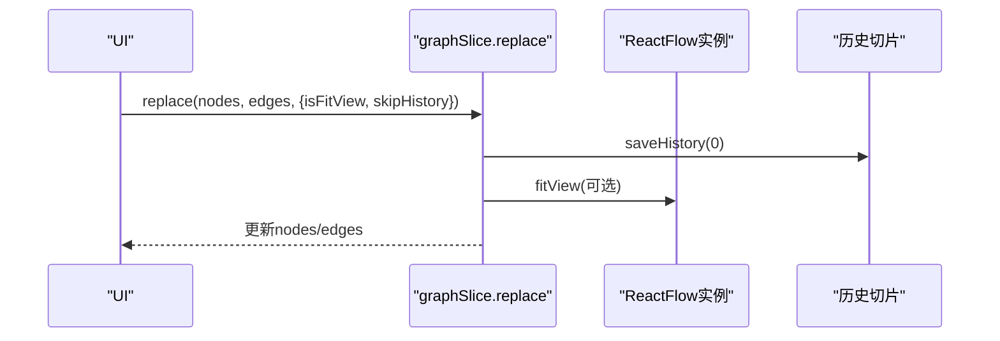

# 性能问题排查

<cite>
**本文引用的文件**   
- [package.json](file://package.json)
- [vite.config.ts](file://vite.config.ts)
- [src/main.tsx](file://src/main.tsx)
- [src/App.tsx](file://src/App.tsx)
- [src/components/Flow.tsx](file://src/components/Flow.tsx)
- [src/stores/flow/types.ts](file://src/stores/flow/types.ts)
- [src/stores/flow/slices/graphSlice.ts](file://src/stores/flow/slices/graphSlice.ts)
- [src/services/server.ts](file://src/services/server.ts)
- [src/utils/wailsBridge.ts](file://src/utils/wailsBridge.ts)
- [src/hooks/useCanvasViewport.ts](file://src/hooks/useCanvasViewport.ts)
- [src/stores/flow/utils/nodeUtils.ts](file://src/stores/flow/utils/nodeUtils.ts)
- [src/stores/flow/utils/viewportUtils.ts](file://src/stores/flow/utils/viewportUtils.ts)
- [src/core/snapUtils.ts](file://src/core/snapUtils.ts)
</cite>

## 目录
1. [简介](#简介)
2. [项目结构](#项目结构)
3. [核心组件](#核心组件)
4. [架构总览](#架构总览)
5. [详细组件分析](#详细组件分析)
6. [依赖分析](#依赖分析)
7. [性能考量](#性能考量)
8. [故障排查指南](#故障排查指南)
9. [结论](#结论)
10. [附录](#附录)

## 简介
本指南面向MaaPipelineEditor的性能问题排查与优化，聚焦以下方面：
- 常见性能瓶颈：大工作流加载缓慢、渲染卡顿、内存占用过高
- 性能监控工具：浏览器性能面板、内存分析器、网络监控
- 渲染性能优化：组件重渲染优化、虚拟滚动、懒加载
- 内存泄漏检测与修复：常见泄漏场景与预防
- 系统资源优化：CPU、GPU、磁盘I/O
- 基准测试与回归检测流程

## 项目结构
前端基于React 19与Vite构建，使用XYFlow进行画布交互，Zustand管理状态，Ant Design提供UI组件。后端通过WebSocket与本地服务通信，Wails桥接提供原生能力。

**图表来源**
- [src/main.tsx:1-18](file://src/main.tsx#L1-L18)
- [src/App.tsx:111-333](file://src/App.tsx#L111-L333)
- [src/components/Flow.tsx:462-542](file://src/components/Flow.tsx#L462-L542)
- [src/services/server.ts:20-373](file://src/services/server.ts#L20-L373)
- [src/utils/wailsBridge.ts:41-131](file://src/utils/wailsBridge.ts#L41-L131)
- [vite.config.ts:1-41](file://vite.config.ts#L1-L41)
- [package.json:1-65](file://package.json#L1-L65)

**章节来源**
- [src/main.tsx:1-18](file://src/main.tsx#L1-L18)
- [vite.config.ts:1-41](file://vite.config.ts#L1-L41)
- [package.json:1-65](file://package.json#L1-L65)

## 核心组件
- 入口与初始化：应用启动时初始化WebSocket并挂载根组件。
- 画布与交互：基于@xyflow/react实现节点拖拽、连线、视口控制与磁吸对齐。
- 状态管理：Zustand切片管理节点、边、选择、历史、视口与路径等状态。
- 本地服务通信：封装WebSocket客户端，注册协议路由，处理握手与错误。
- Wails桥接：检测环境、事件监听、端口获取、桥接状态查询与重启。

**章节来源**
- [src/main.tsx:7-17](file://src/main.tsx#L7-L17)
- [src/App.tsx:111-293](file://src/App.tsx#L111-L293)
- [src/components/Flow.tsx:193-542](file://src/components/Flow.tsx#L193-L542)
- [src/stores/flow/types.ts:247-362](file://src/stores/flow/types.ts#L247-L362)
- [src/services/server.ts:20-373](file://src/services/server.ts#L20-L373)
- [src/utils/wailsBridge.ts:41-131](file://src/utils/wailsBridge.ts#L41-L131)

## 架构总览
前端通过WebSocket与本地服务通信，支持协议版本握手、路由注册与错误处理；应用根据URL参数或配置自动连接，Wails环境下通过桥接事件动态获取端口并建立连接。

**图表来源**
- [src/App.tsx:215-279](file://src/App.tsx#L215-L279)
- [src/services/server.ts:105-251](file://src/services/server.ts#L105-L251)
- [src/utils/wailsBridge.ts:79-113](file://src/utils/wailsBridge.ts#L79-L113)

## 详细组件分析

### 画布与渲染性能（MainFlow）
- 使用@xyflow/react渲染节点与边，支持视口变更、节点拖拽、连线、选择与背景绘制。
- 通过防抖与节流减少频繁更新：视口保存、尺寸变更、选择变更均有防抖策略。
- 磁吸对齐在拖拽过程中计算对齐线，需注意节点数量增长带来的复杂度上升。
- 选区右键菜单、节点添加面板、内联面板等均在画布容器内渲染，避免不必要的重渲染。

**图表来源**
- [src/components/Flow.tsx:297-413](file://src/components/Flow.tsx#L297-L413)
- [src/core/snapUtils.ts:100-162](file://src/core/snapUtils.ts#L100-L162)

**章节来源**
- [src/components/Flow.tsx:193-542](file://src/components/Flow.tsx#L193-L542)
- [src/core/snapUtils.ts:1-162](file://src/core/snapUtils.ts#L1-162)

### 状态模型与历史快照（FlowStore）
- FlowStore包含视口、选择、历史、节点、边、图操作与路径等切片，统一管理画布状态。
- 历史切片提供undo/redo与快照保存，替换与粘贴操作均会触发历史记录保存。
- 节点与边的批量更新、粘贴与排序逻辑集中在graphSlice中，注意大数据量时的深拷贝与顺序维护成本。

**图表来源**
- [src/stores/flow/types.ts:247-362](file://src/stores/flow/types.ts#L247-L362)
- [src/stores/flow/slices/graphSlice.ts:18-305](file://src/stores/flow/slices/graphSlice.ts#L18-L305)

**章节来源**
- [src/stores/flow/types.ts:1-362](file://src/stores/flow/types.ts#L1-L362)
- [src/stores/flow/slices/graphSlice.ts:1-305](file://src/stores/flow/slices/graphSlice.ts#L1-L305)

### 本地服务通信（WebSocket）
- 支持连接超时、握手校验、错误提示与断开通知；连接状态与“正在连接”状态通过回调暴露给UI。
- 提供批量路由注册与消息发送接口，便于扩展协议。

**图表来源**
- [src/services/server.ts:105-251](file://src/services/server.ts#L105-L251)
- [src/services/server.ts:37-65](file://src/services/server.ts#L37-L65)

**章节来源**
- [src/services/server.ts:20-373](file://src/services/server.ts#L20-L373)

### Wails环境桥接
- 提供事件监听、端口获取、桥接状态查询与重启等能力，Wails环境下自动监听后端事件以获取端口并建立连接。

**章节来源**
- [src/utils/wailsBridge.ts:41-131](file://src/utils/wailsBridge.ts#L41-L131)
- [src/App.tsx:215-279](file://src/App.tsx#L215-L279)

### 视口与图像缩放（useCanvasViewport）
- 封装滚轮缩放、空格拖拽、中键拖拽、初始适配等行为，提供缩放控制与重置逻辑，避免大图导致的重绘压力。

**章节来源**
- [src/hooks/useCanvasViewport.ts:1-307](file://src/hooks/useCanvasViewport.ts#L1-L307)

## 依赖分析
- React 19 + React DOM 19：最新版本带来更好的并发与调度能力。
- @xyflow/react：高性能画布渲染与交互。
- zustand：轻量状态管理，切片化设计降低耦合。
- ahooks：提供useDebounceEffect/useDebounceFn等工具，减少高频更新。
- less：样式模块化，避免全局污染。

**图表来源**
- [package.json:20-40](file://package.json#L20-L40)
- [src/components/Flow.tsx:1-542](file://src/components/Flow.tsx#L1-L542)
- [src/stores/flow/types.ts:1-362](file://src/stores/flow/types.ts#L1-L362)

**章节来源**
- [package.json:1-65](file://package.json#L1-L65)
- [vite.config.ts:1-41](file://vite.config.ts#L1-L41)

## 性能考量

### 大工作流加载缓慢
- 现象：替换/粘贴大量节点时卡顿。
- 根因：深拷贝、顺序维护、fitView动画、历史快照写入。
- 优化建议：
  - 批处理替换/粘贴时禁用历史保存与视图聚焦，完成后一次性保存。
  - 使用ensureGroupNodeOrder保证父子顺序，避免后续重排。
  - 控制fitView动画时长与插值方式，必要时延迟执行。
  - 对节点数据进行必要的字段裁剪，减少序列化体积。

**章节来源**
- [src/stores/flow/slices/graphSlice.ts:18-50](file://src/stores/flow/slices/graphSlice.ts#L18-L50)
- [src/stores/flow/slices/graphSlice.ts:52-248](file://src/stores/flow/slices/graphSlice.ts#L52-L248)
- [src/stores/flow/utils/viewportUtils.ts:21-53](file://src/stores/flow/utils/viewportUtils.ts#L21-L53)

### 渲染卡顿
- 现象：拖拽节点、磁吸对齐、视口变化时卡顿。
- 根因：每次拖拽计算对齐线，节点多时遍历成本高；频繁触发选择/尺寸更新。
- 优化建议：
  - 限制磁吸对齐范围：启用“仅视口内对齐”，减少候选节点数量。
  - 使用memo与浅比较：确保FlowStore选择状态与节点/边列表使用浅比较，避免无关重渲染。
  - 减少不必要的ResizeObserver回调：合理设置防抖间隔。
  - 将内联面板与右键菜单改为条件渲染，避免常驻DOM。

**章节来源**
- [src/components/Flow.tsx:297-413](file://src/components/Flow.tsx#L297-L413)
- [src/core/snapUtils.ts:38-78](file://src/core/snapUtils.ts#L38-L78)
- [src/stores/flow/types.ts:257-269](file://src/stores/flow/types.ts#L257-L269)

### 内存占用过高
- 现象：长时间编辑后内存持续上涨。
- 根因：历史栈过大、未清理的事件监听、WebSocket连接未释放、图片/截图未释放。
- 优化建议：
  - 控制历史栈深度与快照频率，提供清理接口。
  - 在组件卸载时清理事件监听（如键盘、窗口大小、Wails事件）。
  - 断开WebSocket连接并清空路由表。
  - 图像缩放面板使用后重置视口状态，释放图片引用。

**章节来源**
- [src/services/server.ts:324-331](file://src/services/server.ts#L324-L331)
- [src/utils/wailsBridge.ts:51-73](file://src/utils/wailsBridge.ts#L51-L73)
- [src/hooks/useCanvasViewport.ts:251-307](file://src/hooks/useCanvasViewport.ts#L251-L307)

### CPU/GPU与磁盘I/O
- CPU：磁吸对齐算法、fitView动画、频繁状态更新。
- GPU：画布渲染、背景网格、缩放与位移。
- 磁盘：工作流文件读写、缓存保存、日志输出。
- 优化建议：
  - 降低动画时长与插值复杂度。
  - 合理设置最小/最大缩放，避免过度缩放导致的像素化与重绘。
  - 使用本地缓存策略，减少频繁写盘。

**章节来源**
- [src/stores/flow/utils/viewportUtils.ts:21-53](file://src/stores/flow/utils/viewportUtils.ts#L21-L53)
- [src/components/Flow.tsx:474-487](file://src/components/Flow.tsx#L474-L487)

## 故障排查指南

### 性能监控工具
- 浏览器性能面板：记录帧时间、布局与脚本耗时，定位卡顿阶段。
- 内存分析器：观察堆快照差异，识别未释放对象。
- 网络监控：检查WebSocket连接状态、消息往返与错误码。

### 渲染性能问题排查
- 使用React DevTools Profiler观察组件重渲染次数与热点。
- 通过useMemo/useCallback包裹昂贵计算与回调，减少重渲染。
- 对节点列表与边列表采用浅比较，避免无关更新。
- 虚拟滚动与懒加载：对于长列表（如文件列表、识别历史）采用虚拟化方案。

**章节来源**
- [src/stores/flow/types.ts:257-269](file://src/stores/flow/types.ts#L257-L269)
- [src/components/Flow.tsx:462-542](file://src/components/Flow.tsx#L462-L542)

### 内存泄漏检测与修复
- 常见场景：
  - 未移除的事件监听（键盘、窗口、Wails事件）。
  - WebSocket连接未断开，路由表未清空。
  - 图像缩放面板未重置，图片引用未释放。
- 修复步骤：
  - 在组件卸载时统一清理事件监听。
  - 调用disconnect并清空路由表。
  - 重置视口状态，释放图片引用。

**章节来源**
- [src/App.tsx:284-293](file://src/App.tsx#L284-L293)
- [src/services/server.ts:324-331](file://src/services/server.ts#L324-L331)
- [src/hooks/useCanvasViewport.ts:251-307](file://src/hooks/useCanvasViewport.ts#L251-L307)

### 系统资源监控与优化
- CPU：减少磁吸对齐候选集、降低fitView动画复杂度。
- GPU：控制缩放范围、避免过度绘制。
- 磁盘：批量写入、延迟保存、清理日志。

**章节来源**
- [src/core/snapUtils.ts:38-78](file://src/core/snapUtils.ts#L38-L78)
- [src/stores/flow/utils/viewportUtils.ts:21-53](file://src/stores/flow/utils/viewportUtils.ts#L21-L53)

### 基准测试与回归检测
- 基准测试：
  - 节点规模：100/500/1000节点，测量替换/粘贴耗时与内存峰值。
  - 交互压力：连续拖拽、磁吸对齐、视口缩放，记录帧时间分布。
- 回归检测：
  - 每次重大改动后运行基准测试，对比CPU/内存/帧时间指标。
  - 使用自动化测试覆盖关键交互路径，防止性能退化。

[本节为通用指导，无需特定文件引用]

## 结论
通过合理的状态切片设计、防抖与节流策略、磁吸对齐范围控制以及资源清理机制，可显著缓解大工作流加载与渲染卡顿问题。配合浏览器性能工具与基准测试，可建立持续的性能保障体系。

## 附录

### 关键流程时序图：大工作流替换

**图表来源**
- [src/stores/flow/slices/graphSlice.ts:18-50](file://src/stores/flow/slices/graphSlice.ts#L18-L50)