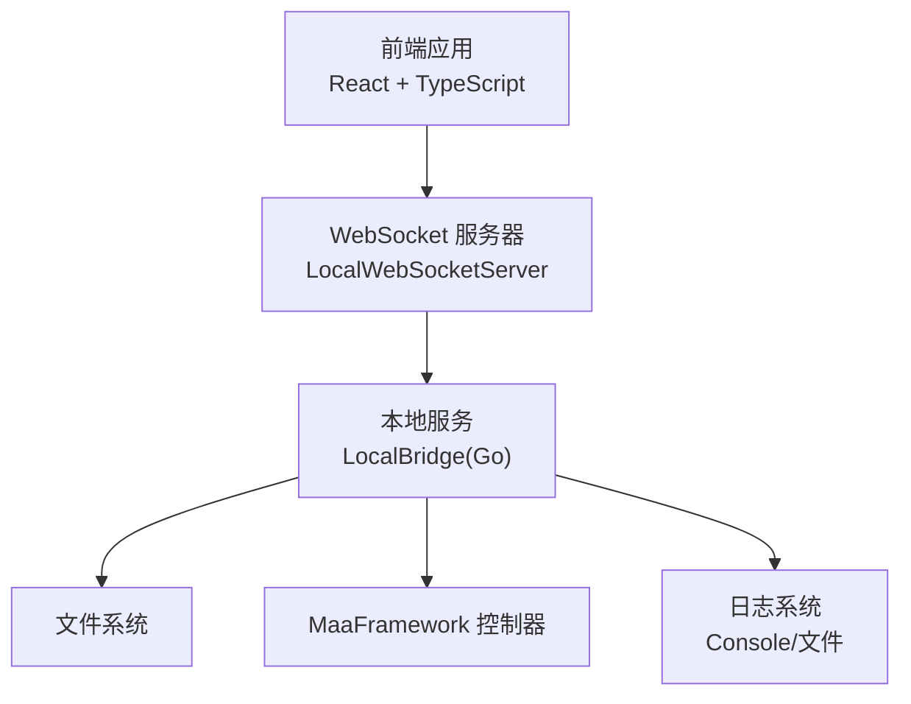
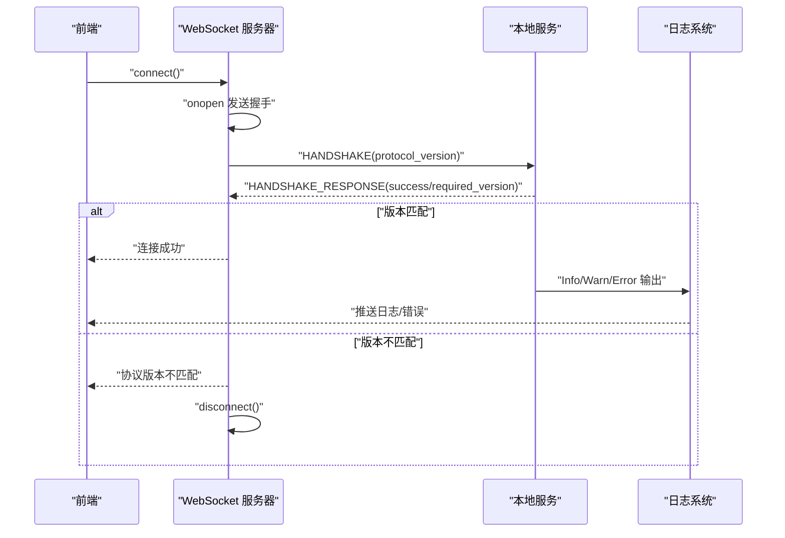
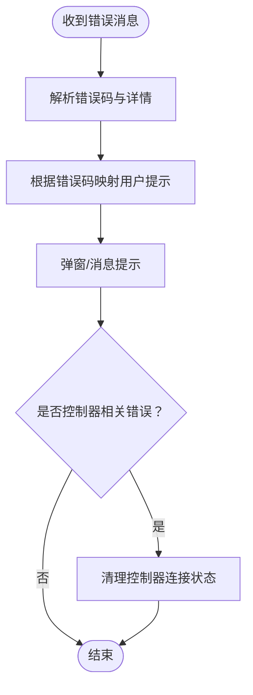
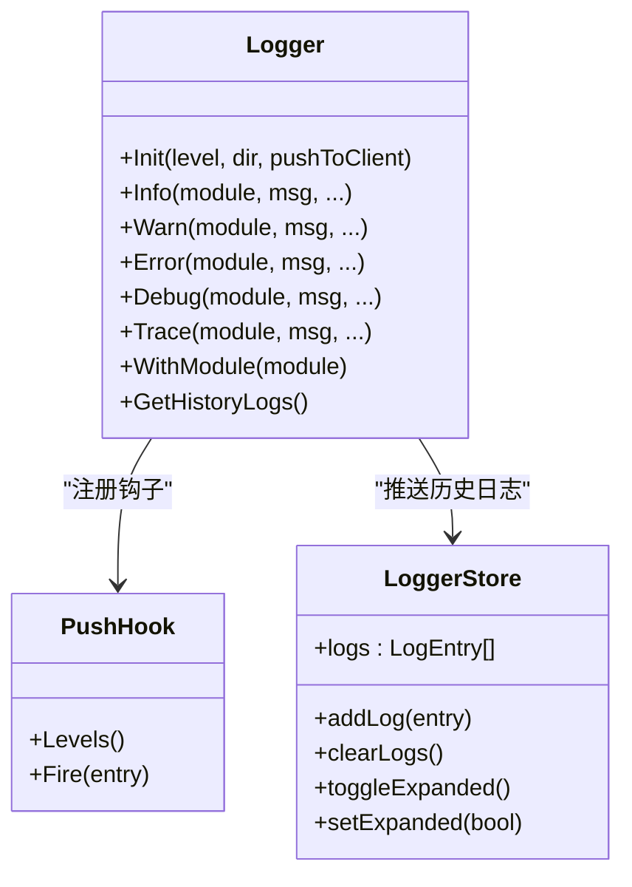
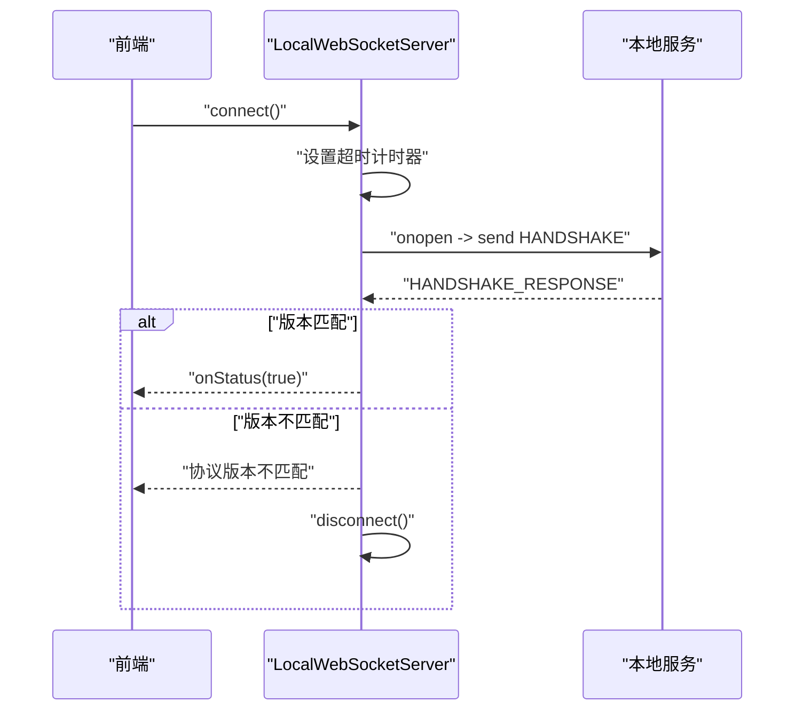
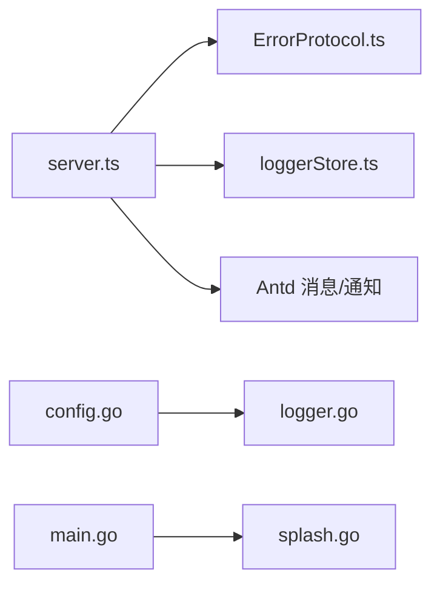

# 故障排除

<cite>
**本文引用的文件**   
- [README.md](file://README.md)
- [main.go](file://Extremer/main.go)
- [splash.go](file://Extremer/internal/splash/splash.go)
- [errors.go](file://LocalBridge/internal/errors/errors.go)
- [logger.go](file://LocalBridge/internal/logger/logger.go)
- [ErrorProtocol.ts](file://src/services/protocols/ErrorProtocol.ts)
- [loggerStore.ts](file://src/stores/loggerStore.ts)
- [server.ts](file://src/services/server.ts)
- [config.go](file://LocalBridge/internal/config/config.go)
- [install.bat](file://tools/install.bat)
- [install.ps1](file://tools/install.ps1)
- [handler.go](file://LocalBridge/internal/protocol/utility/handler.go)
- [error.go](file://LocalBridge/internal/mfw/error.go)
- [README.md](file://LocalBridge/test-json/base/model/ocr/README.md)
- [keys.txt](file://LocalBridge/test-json/base/model/ocr/keys.txt)
- [det.onnx](file://LocalBridge/test-json/base/model/ocr/det.onnx)
- [rec.onnx](file://LocalBridge/test-json/base/model/ocr/rec.onnx)
- [default.json](file://Extremer/config/default.json)
</cite>

## 目录
1. [简介](#简介)
2. [项目结构](#项目结构)
3. [核心组件](#核心组件)
4. [架构总览](#架构总览)
5. [详细组件分析](#详细组件分析)
6. [依赖关系分析](#依赖关系分析)
7. [性能考虑](#性能考虑)
8. [故障排除指南](#故障排除指南)
9. [结论](#结论)
10. [附录](#附录)

## 简介
本指南面向使用 MaaPipelineEditor（MPE）的用户与维护者，聚焦于本地服务（LocalBridge/LB）与前端之间的连接、错误处理、日志分析、调试技巧、兼容性与预防性维护等方面。文档基于仓库中的实际实现进行梳理，帮助快速定位与解决安装、启动、功能异常、性能问题等常见故障。

## 项目结构
MPE 采用前后端分离架构：前端为 React + TypeScript，后端为 Go（Wails 应用），通过 WebSocket 协议进行通信。本地服务负责文件管理、资源管理、MaaFramework 控制器等能力，并通过统一的协议层向前端推送消息与状态。



**图表来源**
- [server.ts:20-331](file://src/services/server.ts#L20-L331)
- [main.go:26-84](file://Extremer/main.go#L26-L84)
- [logger.go:43-100](file://LocalBridge/internal/logger/logger.go#L43-L100)

**章节来源**
- [README.md:31-90](file://README.md#L31-L90)
- [server.ts:18-373](file://src/services/server.ts#L18-L373)
- [main.go:1-90](file://Extremer/main.go#L1-L90)

## 核心组件
- 本地 WebSocket 服务器：负责建立与本地服务的连接、握手校验、消息路由与状态通知。
- 错误协议处理器：统一接收并展示来自本地服务的错误码与消息，必要时清理控制器连接状态。
- 日志系统：支持控制台与文件双通道输出，具备推送钩子与历史日志缓存。
- 配置系统：提供服务器、文件扫描、日志、MaaFramework 等配置项的加载、校验与安全检查。
- 启动画面：Windows 平台提供启动画面以改善首屏体验。
- 安装脚本：提供 Windows 平台一键安装本地服务的批处理与 PowerShell 脚本。

**章节来源**
- [server.ts:20-373](file://src/services/server.ts#L20-L373)
- [ErrorProtocol.ts:10-67](file://src/services/protocols/ErrorProtocol.ts#L10-L67)
- [logger.go:13-251](file://LocalBridge/internal/logger/logger.go#L13-L251)
- [config.go:42-123](file://LocalBridge/internal/config/config.go#L42-L123)
- [splash.go:4-35](file://Extremer/internal/splash/splash.go#L4-L35)
- [install.bat:1-115](file://tools/install.bat#L1-L115)
- [install.ps1:1-74](file://tools/install.ps1#L1-L74)

## 架构总览
前端通过 LocalWebSocketServer 连接本地服务，握手阶段验证协议版本；连接成功后，各协议处理器（文件、MFW、调试、资源、日志、错误）注册路由并处理消息。本地服务内部通过日志系统输出运行状态，同时根据配置决定日志级别与输出位置。



**图表来源**
- [server.ts:37-65](file://src/services/server.ts#L37-L65)
- [server.ts:104-251](file://src/services/server.ts#L104-L251)
- [logger.go:136-162](file://LocalBridge/internal/logger/logger.go#L136-L162)

## 详细组件分析

### 组件A：错误码与错误处理
- 错误码分类：文件类（不存在、读取失败、写入失败、命名冲突、非法 JSON）、权限类、请求类、连接类、内部类；MFW 相关错误（未初始化、控制器创建/连接失败、设备刷新失败、OCR 资源未配置、OCR 资源加载失败）。
- 错误展示策略：前端 ErrorProtocol 将错误码映射为用户可读提示，并在控制器相关错误时清理连接状态。
- 原始错误包装：Go 层通过 LBError 包裹底层错误并携带可选 Detail，便于前端与日志定位。



**图表来源**
- [ErrorProtocol.ts:26-66](file://src/services/protocols/ErrorProtocol.ts#L26-L66)
- [errors.go:10-20](file://LocalBridge/internal/errors/errors.go#L10-L20)
- [errors.go:77-141](file://LocalBridge/internal/errors/errors.go#L77-L141)

**章节来源**
- [ErrorProtocol.ts:10-67](file://src/services/protocols/ErrorProtocol.ts#L10-L67)
- [errors.go:1-141](file://LocalBridge/internal/errors/errors.go#L1-L141)

### 组件B：日志系统与历史日志
- 日志级别：支持 TRACE/INFO/WARN/ERROR 等级别，文件日志默认开启全级别记录。
- 推送机制：通过 PushHook 将 INFO/WARN/ERROR 推送到前端，同时写入控制台与文件。
- 历史缓存：前端使用 loggerStore 保留最近 N 条日志，便于问题回溯。



**图表来源**
- [logger.go:43-100](file://LocalBridge/internal/logger/logger.go#L43-L100)
- [logger.go:136-162](file://LocalBridge/internal/logger/logger.go#L136-L162)
- [loggerStore.ts:21-45](file://src/stores/loggerStore.ts#L21-L45)

**章节来源**
- [logger.go:1-251](file://LocalBridge/internal/logger/logger.go#L1-L251)
- [loggerStore.ts:1-46](file://src/stores/loggerStore.ts#L1-L46)

### 组件C：WebSocket 连接与握手
- 连接流程：超时控制、状态回调、错误提示、断开处理。
- 握手校验：前端发送协议版本，若与本地服务不一致则提示并断开。
- 路由注册：错误、文件、MFW、调试、资源、日志等协议在连接建立后注册。



**图表来源**
- [server.ts:104-251](file://src/services/server.ts#L104-L251)
- [server.ts:37-65](file://src/services/server.ts#L37-L65)

**章节来源**
- [server.ts:18-373](file://src/services/server.ts#L18-L373)

### 组件D：配置与安全检查
- 配置项：服务器（host/port）、文件扫描（root/exclude/extensions/max_depth/max_files）、日志（level/dir/push_to_client）、MaaFramework（enabled/lib_dir/resource_dir）。
- 路径规范化：相对路径转绝对路径并校验存在性。
- 安全检查：对高风险目录（系统目录、驱动器根、用户主目录）与无限制扫描（max_depth/max_files=0）给出风险提示与建议。

**章节来源**
- [config.go:13-48](file://LocalBridge/internal/config/config.go#L13-L48)
- [config.go:103-123](file://LocalBridge/internal/config/config.go#L103-L123)
- [config.go:126-153](file://LocalBridge/internal/config/config.go#L126-L153)
- [config.go:234-296](file://LocalBridge/internal/config/config.go#L234-L296)
- [default.json:22-32](file://Extremer/config/default.json#L22-L32)

### 组件E：启动画面（Windows）
- 接口抽象：Show/Close/SetMessage。
- 默认配置：标题、消息、尺寸。
- 主程序集成：Windows 平台显示启动画面并在其失败时降级为直接显示主窗口。

**章节来源**
- [splash.go:4-35](file://Extremer/internal/splash/splash.go#L4-L35)
- [main.go:34-44](file://Extremer/main.go#L34-L44)

### 组件F：安装脚本（Windows）
- 批处理脚本：自动获取最新发布、下载二进制、添加到 PATH 并提示使用方式。
- PowerShell 脚本：同功能，使用现代 PowerShell API，提供更友好的输出与错误处理。

**章节来源**
- [install.bat:1-115](file://tools/install.bat#L1-L115)
- [install.ps1:1-74](file://tools/install.ps1#L1-L74)

## 依赖关系分析
- 前端依赖：Ant Design 消息与通知组件用于错误提示；Zustand 状态管理用于日志与错误存储。
- 后端依赖：Viper 用于配置加载；Logrus 用于日志；平台特定的启动画面实现。
- 协议层：统一的错误码与消息格式，保证前后端一致性。



**图表来源**
- [server.ts:9-16](file://src/services/server.ts#L9-L16)
- [ErrorProtocol.ts:1-6](file://src/services/protocols/ErrorProtocol.ts#L1-L6)
- [loggerStore.ts:1-46](file://src/stores/loggerStore.ts#L1-L46)
- [config.go:54-95](file://LocalBridge/internal/config/config.go#L54-L95)
- [logger.go:43-100](file://LocalBridge/internal/logger/logger.go#L43-L100)
- [main.go:26-84](file://Extremer/main.go#L26-L84)
- [splash.go:31-35](file://Extremer/internal/splash/splash.go#L31-L35)

**章节来源**
- [server.ts:18-373](file://src/services/server.ts#L18-L373)
- [logger.go:1-251](file://LocalBridge/internal/logger/logger.go#L1-L251)
- [config.go:1-339](file://LocalBridge/internal/config/config.go#L1-L339)

## 性能考虑
- 日志级别：生产环境建议 INFO/WARN/ERROR，避免过度 TRACE/DEBUG 导致 I/O 压力。
- 扫描限制：合理设置 max_depth 与 max_files，避免大规模目录扫描造成卡顿。
- 连接超时：前端已内置超时与重连提示，避免长时间阻塞。
- 历史日志上限：前端日志队列限制在固定数量，防止内存占用过高。

## 故障排除指南

### 一、安装问题
- 症状
  - Windows 下命令不可用或找不到可执行文件。
  - 下载失败或网络受限。
- 原因分析
  - PATH 未正确添加安装目录。
  - 网络受限导致 GitHub API 或下载失败。
- 修复步骤
  - 使用提供的安装脚本自动完成下载与 PATH 添加。
  - 若脚本失败，手动下载对应平台二进制并放置到安装目录，随后将安装目录加入 PATH。
  - 重启终端或重新加载环境变量后重试。

**章节来源**
- [install.bat:83-112](file://tools/install.bat#L83-L112)
- [install.ps1:47-74](file://tools/install.ps1#L47-L74)

### 二、启动失败
- 症状
  - 应用启动画面显示失败或直接退出。
  - Windows 平台启动黑屏或白屏。
- 原因分析
  - 启动画面初始化失败，主窗口被隐藏。
  - Wails 应用初始化失败（端口、资源、主题等）。
- 修复步骤
  - 关闭应用后重试；若仍失败，检查系统日志与杀毒软件拦截。
  - 确认资源文件嵌入正常，避免路径错误导致初始化失败。

**章节来源**
- [main.go:34-44](file://Extremer/main.go#L34-L44)
- [main.go:49-84](file://Extremer/main.go#L49-L84)

### 三、功能异常
- 症状
  - 无法连接本地服务，出现"连接超时/失败"提示。
  - 协议版本不匹配，提示需要更新。
  - 文件操作报错（不存在、读写失败、命名冲突、非法 JSON）。
  - MFW 控制器相关错误（未初始化、创建/连接失败、设备刷新失败、OCR 资源未配置、OCR 资源加载失败）。
- 原因分析
  - 本地服务未启动或端口被占用。
  - 前后端协议版本不一致。
  - 文件路径权限不足或路径非法。
  - MFW 路径未正确配置或资源缺失。
  - OCR 资源目录结构不正确或文件缺失。
- 修复步骤
  - 确认本地服务已启动且端口可用，默认端口为 9066。
  - 检查协议版本，必要时升级前端或后端以保持一致。
  - 校验文件根目录与日志目录的可访问性与合法性。
  - 配置 MaaFramework 的库目录与资源目录，确保路径有效且可读。
  - 出现控制器错误时，前端会自动清理连接状态，重新连接或检查设备。
  - 对于 OCR 资源问题，检查资源目录结构与文件完整性。

**章节来源**
- [server.ts:104-251](file://src/services/server.ts#L104-L251)
- [server.ts:37-65](file://src/services/server.ts#L37-L65)
- [ErrorProtocol.ts:26-66](file://src/services/protocols/ErrorProtocol.ts#L26-L66)
- [errors.go:77-141](file://LocalBridge/internal/errors/errors.go#L77-L141)
- [config.go:13-48](file://LocalBridge/internal/config/config.go#L13-L48)

### 四、性能问题
- 症状
  - 页面卡顿、日志过多导致滚动缓慢。
  - 文件扫描耗时长、CPU 占用高。
- 原因分析
  - 日志级别过低（TRACE/DEBUG）导致大量 I/O。
  - 扫描深度与文件数量无限制，导致遍历范围过大。
- 修复步骤
  - 调整日志级别为 INFO/WARN/ERROR。
  - 设置合理的 max_depth 与 max_files，缩小扫描范围。
  - 将文件根目录指向具体项目目录，避免扫描系统目录或驱动器根。

**章节来源**
- [logger.go:43-100](file://LocalBridge/internal/logger/logger.go#L43-L100)
- [config.go:108-123](file://LocalBridge/internal/config/config.go#L108-L123)
- [config.go:278-296](file://LocalBridge/internal/config/config.go#L278-L296)

### 五、OCR 资源加载失败故障排除

#### 5.1 错误代码与分类
- OCR 资源未配置：MFW_OCR_RESOURCE_NOT_CONFIGURED
- OCR 资源加载失败：MFW_RESOURCE_LOAD_FAILED
- OCR 初始化失败：MFW_TASK_SUBMIT_FAILED

**章节来源**
- [error.go:15-21](file://LocalBridge/internal/mfw/error.go#L15-L21)

#### 5.2 常见症状与诊断
- OCR 功能完全不可用，提示"OCR 资源加载失败"
- OCR 识别结果为空或错误
- 启动时出现资源加载异常日志
- Windows 系统中中文路径导致加载失败

#### 5.3 诊断步骤
1. **检查资源目录配置**
   - 确认 MaaFramework 资源目录已正确设置
   - 验证目录路径存在且可访问
   - 检查路径中是否包含非 ASCII 字符

2. **验证目录结构**
   ```
   <resource_dir>/
   └── model/
       └── ocr/
           ├── det.onnx
           ├── rec.onnx
           └── keys.txt
   ```

3. **检查文件完整性**
   - 确认所有必需文件存在
   - 验证 ONNX 模型文件完整性
   - 检查 keys.txt 内容是否正确

4. **查看详细错误信息**
   - 前端会显示详细的错误诊断信息
   - 查看日志中的具体失败原因
   - 关注资源加载状态和路径信息

#### 5.4 修复步骤
1. **配置正确的资源目录**
   ```bash
   # 使用命令行设置资源目录
   mpelb config set-resource "C:\path\to\your\resource"
   ```

2. **验证目录结构**
   - 确保 model/ocr 目录结构正确
   - 检查文件权限设置
   - 避免使用包含特殊字符的路径

3. **处理 Windows 中文路径问题**
   - 系统会自动尝试转换为短路径
   - 如果转换失败，会切换到工作目录模式
   - 确保资源目录可被当前工作目录访问

4. **重新加载资源**
   - 重启本地服务
   - 在前端重新触发 OCR 识别
   - 检查资源加载状态

#### 5.5 预防措施
- 定期备份 OCR 模型文件
- 使用稳定的存储介质
- 避免频繁移动资源目录
- 定期检查文件完整性

**章节来源**
- [handler.go:175-249](file://LocalBridge/internal/protocol/utility/handler.go#L175-L249)
- [handler.go:287-301](file://LocalBridge/internal/protocol/utility/handler.go#L287-L301)
- [README.md:1-24](file://LocalBridge/test-json/base/model/ocr/README.md#L1-L24)
- [keys.txt:1-800](file://LocalBridge/test-json/base/model/ocr/keys.txt#L1-L800)
- [det.onnx:1-200](file://LocalBridge/test-json/base/model/ocr/det.onnx#L1-L200)
- [rec.onnx:1-200](file://LocalBridge/test-json/base/model/ocr/rec.onnx#L1-L200)

### 六、错误代码参考
- 文件类错误
  - FILE_NOT_FOUND：文件不存在或已被删除。
  - FILE_READ_ERROR：文件读取失败，检查权限与路径。
  - FILE_WRITE_ERROR：文件保存失败，检查权限与磁盘空间。
  - FILE_NAME_CONFLICT：文件名冲突，更换名称。
  - INVALID_JSON：JSON 格式无效，检查语法与编码。
  - PERMISSION_DENIED：权限不足或路径非法。
- 请求与连接类错误
  - INVALID_REQUEST：请求参数无效。
  - CONNECTION_FAILED：连接失败。
  - INTERNAL_ERROR：内部错误。
- MFW 相关错误
  - MFW_NOT_INITIALIZED：MaaFramework 未初始化。
  - MFW_CONTROLLER_CREATE_FAIL：控制器创建失败。
  - MFW_CONTROLLER_NOT_FOUND：控制器不存在。
  - MFW_CONTROLLER_CONNECT_FAIL：控制器连接失败。
  - MFW_CONTROLLER_NOT_CONNECTED：控制器未连接。
  - MFW_DEVICE_NOT_FOUND：设备列表刷新失败。
  - MFW_OCR_RESOURCE_NOT_CONFIGURED：OCR 资源未配置。
  - MFW_RESOURCE_LOAD_FAILED：OCR 资源加载失败。
  - MFW_TASK_SUBMIT_FAILED：OCR 初始化失败。

**章节来源**
- [errors.go:10-20](file://LocalBridge/internal/errors/errors.go#L10-L20)
- [errors.go:77-141](file://LocalBridge/internal/errors/errors.go#L77-L141)
- [ErrorProtocol.ts:30-50](file://src/services/protocols/ErrorProtocol.ts#L30-L50)
- [error.go:15-21](file://LocalBridge/internal/mfw/error.go#L15-L21)

### 七、日志分析方法
- 日志级别
  - 控制台：INFO/WARN/ERROR（可选 DEBUG/TRACE）。
  - 文件：默认全级别记录，便于离线分析。
- 关键信息识别
  - 模块字段（module）：区分系统、文件、MFW 等模块。
  - 时间戳：定位事件发生顺序。
  - 错误码与 Detail：快速定位问题类型与上下文。
- 问题定位技巧
  - 使用前端日志面板筛选模块与级别。
  - 结合历史日志缓存回溯问题发生前后的操作链路。
  - 将日志目录与配置文件路径纳入问题描述，便于复现。

**章节来源**
- [logger.go:43-100](file://LocalBridge/internal/logger/logger.go#L43-L100)
- [logger.go:164-201](file://LocalBridge/internal/logger/logger.go#L164-L201)
- [loggerStore.ts:21-45](file://src/stores/loggerStore.ts#L21-L45)

### 八、调试技巧与工具使用
- 浏览器开发者工具
  - Console：查看 WebSocket 错误、握手失败、消息解析异常。
  - Network：确认 WebSocket 连接与消息收发。
- 网络监控
  - 检查端口占用与防火墙策略，确保 9066 可用。
- 性能分析
  - 关注日志 I/O 与扫描开销，必要时降低日志级别与扫描范围。
- 协议调试
  - 通过错误协议映射与前端提示，快速定位控制器与资源问题。

**章节来源**
- [server.ts:166-179](file://src/services/server.ts#L166-L179)
- [ErrorProtocol.ts:26-66](file://src/services/protocols/ErrorProtocol.ts#L26-L66)

### 九、系统兼容性问题
- 操作系统差异
  - Windows：支持启动画面与系统主题；注意 PATH 更新需重启终端。
  - Linux/macOS：遵循平台路径规范与权限模型。
- 浏览器兼容性
  - 前端基于现代浏览器特性，建议使用最新稳定版 Chrome/Firefox/Edge。
- 硬件要求
  - 本地服务运行依赖可执行文件与配置文件；确保磁盘空间充足与权限正确。

**章节来源**
- [main.go:73-83](file://Extremer/main.go#L73-L83)
- [install.bat:100-112](file://tools/install.bat#L100-L112)
- [install.ps1:66-74](file://tools/install.ps1#L66-L74)

### 十、预防性维护建议
- 定期清理
  - 清理旧日志文件，避免日志目录膨胀。
  - 清理临时文件与缓存，释放磁盘空间。
- 性能优化
  - 合理设置扫描深度与文件数量上限。
  - 降低日志级别，减少 I/O 压力。
- 安全更新
  - 及时更新本地服务与前端版本，修复已知漏洞。
  - 避免扫描高风险目录，遵循最小权限原则。
- OCR 资源维护
  - 定期备份 OCR 模型文件
  - 检查资源目录权限
  - 避免资源文件被意外修改或删除

**章节来源**
- [logger.go:208-250](file://LocalBridge/internal/logger/logger.go#L208-L250)
- [config.go:278-296](file://LocalBridge/internal/config/config.go#L278-L296)

### 十一、技术支持与问题报告
- 技术支持渠道
  - 可在 MaaFramework 集成/开发交流群（QQ 群：595990173）咨询与反馈。
- 问题报告流程
  - 提供：前端版本、本地服务版本、协议版本、操作系统、日志片段、复现步骤。
  - 附带：配置文件路径、日志目录、错误码与用户提示信息。

**章节来源**
- [README.md:123-126](file://README.md#L123-L126)

## 结论
通过理解本地服务与前端的通信机制、掌握错误码与日志分析方法、结合安装脚本与配置安全检查，可以高效定位并解决 MPE 使用过程中的大多数问题。新增的 OCR 资源加载故障排除指南提供了针对 OCR 功能的专门诊断与修复方法，包括详细的错误代码、诊断步骤和预防措施。建议在日常使用中遵循预防性维护建议，以获得更稳定与高效的编辑体验。

## 附录
- 快速检查清单
  - 本地服务是否启动且端口可用？
  - 协议版本是否匹配？
  - 文件根目录与日志目录权限是否正确？
  - MFW 路径与资源是否配置正确？
  - OCR 资源目录结构是否符合要求？
  - OCR 模型文件是否完整且可访问？
  - 日志级别与扫描范围是否合理？