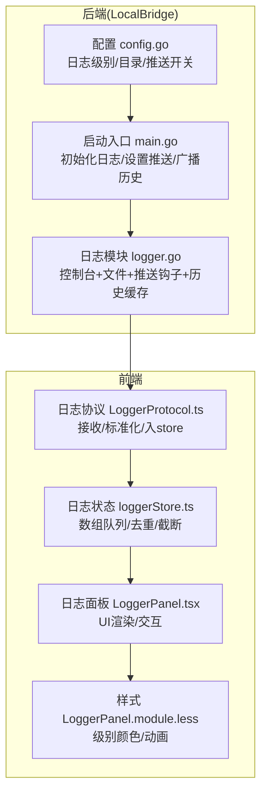
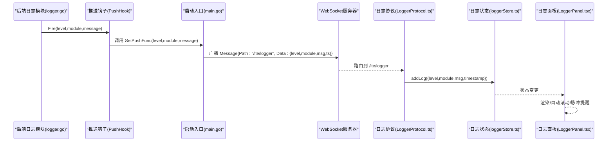
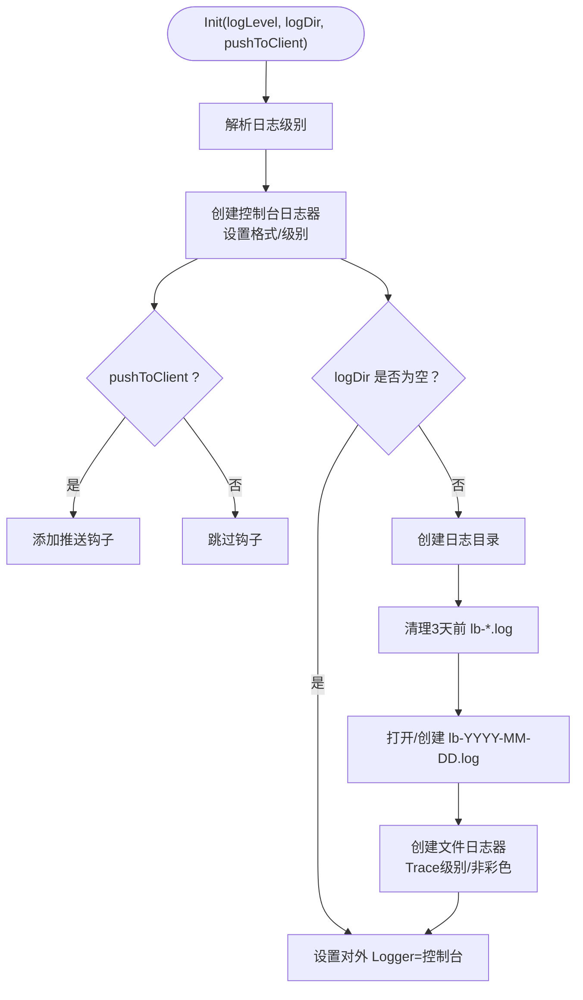
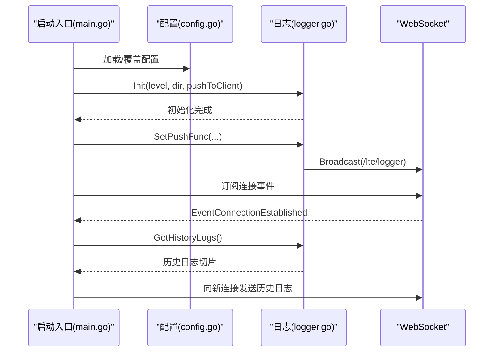
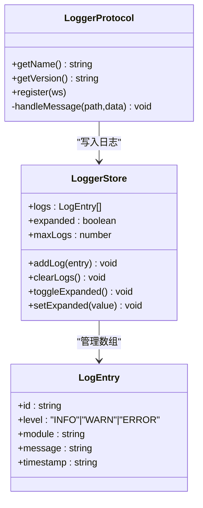
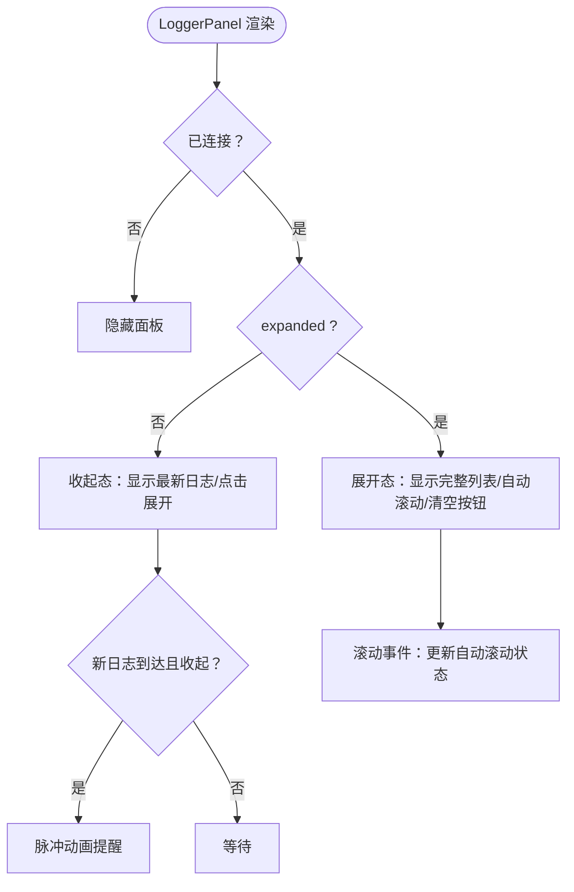
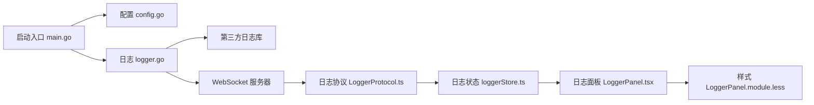

# 日志分析

<cite>
**本文引用的文件**
- [LocalBridge 内部日志模块 logger.go](file://LocalBridge/internal/logger/logger.go)
- [LocalBridge 启动入口 main.go](file://LocalBridge/cmd/lb/main.go)
- [LocalBridge 配置 config.go](file://LocalBridge/internal/config/config.go)
- [前端日志面板 LoggerPanel.tsx](file://src/components/panels/tools/LoggerPanel.tsx)
- [前端日志状态 loggerStore.ts](file://src/stores/loggerStore.ts)
- [前端日志协议 LoggerProtocol.ts](file://src/services/protocols/LoggerProtocol.ts)
- [前端样式 LoggerPanel.module.less](file://src/styles/LoggerPanel.module.less)
- [后端配置弹窗 BackendConfigModal.tsx](file://src/components/modals/BackendConfigModal.tsx)
- [后端工具协议 utility/handler.go（日志目录打开）](file://LocalBridge/internal/protocol/utility/handler.go)
</cite>

## 目录
1. [简介](#简介)
2. [项目结构](#项目结构)
3. [核心组件](#核心组件)
4. [架构总览](#架构总览)
5. [详细组件分析](#详细组件分析)
6. [依赖关系分析](#依赖关系分析)
7. [性能考量](#性能考量)
8. [故障排查指南](#故障排查指南)
9. [结论](#结论)
10. [附录](#附录)

## 简介
本指南面向 MaaPipelineEditor 的日志系统，聚焦于后端 LocalBridge 的日志记录与前端 Logger 面板的联动展示。文档涵盖日志系统架构、日志级别分类、启用与配置方法、前端日志面板使用、关键日志信息识别技巧、常见问题分析案例、日志收集与导出最佳实践，以及推荐的日志分析工具使用方法。

## 项目结构
日志系统由三部分组成：
- 后端日志模块：负责日志初始化、级别过滤、文件落盘、历史缓存与推送钩子。
- 前端日志协议与存储：负责接收后端推送、标准化日志级别、持久化到状态管理，并渲染到 UI。
- 前端日志面板：提供可视化日志查看、展开/收起、自动滚动、清空等功能。

图表来源
- [LocalBridge 启动入口 main.go:200-399](file://LocalBridge/cmd/lb/main.go#L200-L399)
- [LocalBridge 配置 config.go:28-48](file://LocalBridge/internal/config/config.go#L28-L48)
- [LocalBridge 内部日志模块 logger.go:43-100](file://LocalBridge/internal/logger/logger.go#L43-L100)
- [前端日志协议 LoggerProtocol.ts:16-57](file://src/services/protocols/LoggerProtocol.ts#L16-L57)
- [前端日志状态 loggerStore.ts:21-45](file://src/stores/loggerStore.ts#L21-L45)
- [前端日志面板 LoggerPanel.tsx:55-182](file://src/components/panels/tools/LoggerPanel.tsx#L55-L182)
- [前端样式 LoggerPanel.module.less:1-272](file://src/styles/LoggerPanel.module.less#L1-L272)

章节来源
- [LocalBridge 启动入口 main.go:200-399](file://LocalBridge/cmd/lb/main.go#L200-L399)
- [LocalBridge 内部日志模块 logger.go:43-100](file://LocalBridge/internal/logger/logger.go#L43-L100)
- [LocalBridge 配置 config.go:28-48](file://LocalBridge/internal/config/config.go#L28-L48)
- [前端日志协议 LoggerProtocol.ts:16-57](file://src/services/protocols/LoggerProtocol.ts#L16-L57)
- [前端日志状态 loggerStore.ts:21-45](file://src/stores/loggerStore.ts#L21-L45)
- [前端日志面板 LoggerPanel.tsx:55-182](file://src/components/panels/tools/LoggerPanel.tsx#L55-L182)
- [前端样式 LoggerPanel.module.less:1-272](file://src/styles/LoggerPanel.module.less#L1-L272)

## 核心组件
- 后端日志模块
  - 初始化：解析日志级别、创建控制台与文件日志器、设置文本格式、注册推送钩子、清理旧日志、创建当日日志文件。
  - 推送钩子：在 Info/Warn/Error 级别触发，将日志加入内存历史缓存并调用推送函数。
  - 历史缓存：固定容量上限的环形缓冲，保证前端首次连接能拉取最近日志。
  - 文件落盘：Trace 级别以上写入 lb-YYYY-MM-DD.log，保留最近 3 天。
- 前端日志协议
  - 接收后端通过 WebSocket 推送的 /lte/logger 消息，标准化级别为 INFO/WARN/ERROR，补充模块与时间戳，写入状态管理。
- 前端日志面板
  - 展示 INFO/WARN/ERROR 三类日志，支持展开/收起、自动滚动、清空、脉冲提醒新日志。
  - 时间显示为本地时间字符串；模块名与消息内容清晰分层。

章节来源
- [LocalBridge 内部日志模块 logger.go:43-100](file://LocalBridge/internal/logger/logger.go#L43-L100)
- [LocalBridge 内部日志模块 logger.go:136-162](file://LocalBridge/internal/logger/logger.go#L136-L162)
- [LocalBridge 内部日志模块 logger.go:107-134](file://LocalBridge/internal/logger/logger.go#L107-L134)
- [LocalBridge 启动入口 main.go:320-352](file://LocalBridge/cmd/lb/main.go#L320-L352)
- [前端日志协议 LoggerProtocol.ts:32-56](file://src/services/protocols/LoggerProtocol.ts#L32-L56)
- [前端日志状态 loggerStore.ts:21-45](file://src/stores/loggerStore.ts#L21-L45)
- [前端日志面板 LoggerPanel.tsx:55-182](file://src/components/panels/tools/LoggerPanel.tsx#L55-L182)

## 架构总览
后端日志系统通过钩子在关键事件产生日志，同时将日志推送到前端。前端协议处理器将日志标准化并写入状态，日志面板订阅状态进行渲染。

图表来源
- [LocalBridge 内部日志模块 logger.go:136-162](file://LocalBridge/internal/logger/logger.go#L136-L162)
- [LocalBridge 启动入口 main.go:320-352](file://LocalBridge/cmd/lb/main.go#L320-L352)
- [前端日志协议 LoggerProtocol.ts:25-56](file://src/services/protocols/LoggerProtocol.ts#L25-L56)
- [前端日志状态 loggerStore.ts:26-38](file://src/stores/loggerStore.ts#L26-L38)
- [前端日志面板 LoggerPanel.tsx:55-182](file://src/components/panels/tools/LoggerPanel.tsx#L55-L182)

## 详细组件分析

### 后端日志模块（logger.go）
- 初始化流程
  - 解析日志级别字符串，非法则回退到 INFO。
  - 控制台日志：彩色文本，秒级时间戳，按级别输出。
  - 文件日志：Trace 级别，非彩色，完整日期时间戳，当日文件 lb-YYYY-MM-DD.log。
  - 注册推送钩子：仅在 Info/Warn/Error 时触发推送。
  - 清理旧日志：保留最近 3 天 lb-*.log。
- 历史缓存
  - 固定上限 100 条，先进先出，保证首次连接可看到最近日志。
- 推送钩子
  - 提取模块字段，若缺失使用默认值；将日志加入历史缓存并调用推送函数。
- 便捷方法
  - Info/Warn/Error/Debug/Trace 均会同时写入控制台与文件（文件仅 Trace 及以上）。

图表来源
- [LocalBridge 内部日志模块 logger.go:43-100](file://LocalBridge/internal/logger/logger.go#L43-L100)

章节来源
- [LocalBridge 内部日志模块 logger.go:43-100](file://LocalBridge/internal/logger/logger.go#L43-L100)
- [LocalBridge 内部日志模块 logger.go:136-162](file://LocalBridge/internal/logger/logger.go#L136-L162)
- [LocalBridge 内部日志模块 logger.go:107-134](file://LocalBridge/internal/logger/logger.go#L107-L134)

### 启动入口（main.go）
- 初始化日志系统：根据配置调用 Init。
- 设置推送函数：将日志通过 WebSocket 广播到前端。
- 连接建立事件：向新连接推送历史日志。
- 配置重载事件：记录重载过程中的关键信息。

图表来源
- [LocalBridge 启动入口 main.go:200-399](file://LocalBridge/cmd/lb/main.go#L200-L399)
- [LocalBridge 配置 config.go:114-123](file://LocalBridge/internal/config/config.go#L114-L123)
- [LocalBridge 内部日志模块 logger.go:102-105](file://LocalBridge/internal/logger/logger.go#L102-L105)
- [LocalBridge 内部日志模块 logger.go:107-115](file://LocalBridge/internal/logger/logger.go#L107-L115)

章节来源
- [LocalBridge 启动入口 main.go:200-399](file://LocalBridge/cmd/lb/main.go#L200-L399)

### 前端日志协议与状态（LoggerProtocol.ts / loggerStore.ts）
- 协议处理器
  - 注册 /lte/logger 路由，接收后端推送。
  - 校验数据结构，标准化级别为大写枚举，补全模块与时间戳，写入状态。
- 状态管理
  - 维护日志数组，自动生成唯一 id，限制最大长度，支持清空与展开状态切换。

图表来源
- [前端日志协议 LoggerProtocol.ts:16-57](file://src/services/protocols/LoggerProtocol.ts#L16-L57)
- [前端日志状态 loggerStore.ts:3-9](file://src/stores/loggerStore.ts#L3-L9)
- [前端日志状态 loggerStore.ts:21-45](file://src/stores/loggerStore.ts#L21-L45)

章节来源
- [前端日志协议 LoggerProtocol.ts:16-57](file://src/services/protocols/LoggerProtocol.ts#L16-L57)
- [前端日志状态 loggerStore.ts:21-45](file://src/stores/loggerStore.ts#L21-L45)

### 前端日志面板（LoggerPanel.tsx / LoggerPanel.module.less）
- UI 行为
  - 收起态：显示最新一条日志的图标、模块与简要消息，点击展开。
  - 展开态：显示完整列表，自动滚动至底部，支持清空与收起。
  - 新日志到达时，若面板收起，触发脉冲动画提醒。
- 样式与交互
  - 不同级别使用不同颜色与图标；时间显示本地化；模块名与消息内容分层展示。

图表来源
- [前端日志面板 LoggerPanel.tsx:55-182](file://src/components/panels/tools/LoggerPanel.tsx#L55-L182)
- [前端样式 LoggerPanel.module.less:1-272](file://src/styles/LoggerPanel.module.less#L1-L272)

章节来源
- [前端日志面板 LoggerPanel.tsx:55-182](file://src/components/panels/tools/LoggerPanel.tsx#L55-L182)
- [前端样式 LoggerPanel.module.less:1-272](file://src/styles/LoggerPanel.module.less#L1-L272)

### 日志级别与特点
- DEBUG：调试细节，后端文件日志包含 Trace 级别，便于深入排查。
- INFO：关键流程与状态，如启动、端口、扫描限制等。
- WARN：潜在问题或可恢复异常，如扫描范围较大、OCR 资源未配置等。
- ERROR：严重错误，导致功能不可用或进程退出，如安全警告、MFW 初始化失败、服务启动失败等。

章节来源
- [LocalBridge 启动入口 main.go:222-254](file://LocalBridge/cmd/lb/main.go#L222-L254)
- [LocalBridge 启动入口 main.go:256-304](file://LocalBridge/cmd/lb/main.go#L256-L304)
- [LocalBridge 内部日志模块 logger.go:164-201](file://LocalBridge/internal/logger/logger.go#L164-L201)

### 启用与配置日志输出
- 后端配置项
  - 日志级别：DEBUG/INFO/WARN/ERROR。
  - 日志目录：绝对或相对路径，启动时会规范化为绝对路径。
  - 推送日志：是否将日志推送到前端。
- 前端配置入口
  - 在后端配置弹窗中设置日志级别、日志目录与推送开关。
- 启动流程
  - 启动入口加载配置，调用 Init 初始化日志系统。
  - 若启用推送，设置推送函数并通过 WebSocket 广播。
  - 新连接建立时，推送历史日志。

章节来源
- [LocalBridge 配置 config.go:28-48](file://LocalBridge/internal/config/config.go#L28-L48)
- [LocalBridge 配置 config.go:114-123](file://LocalBridge/internal/config/config.go#L114-L123)
- [LocalBridge 配置 config.go:143-150](file://LocalBridge/internal/config/config.go#L143-L150)
- [LocalBridge 启动入口 main.go:200-213](file://LocalBridge/cmd/lb/main.go#L200-L213)
- [LocalBridge 启动入口 main.go:320-352](file://LocalBridge/cmd/lb/main.go#L320-L352)
- [后端配置弹窗 BackendConfigModal.tsx:380-406](file://src/components/modals/BackendConfigModal.tsx#L380-L406)

### 前端日志面板使用方法
- 展示内容
  - 仅展示 INFO/WARN/ERROR 三类日志；DEBUG/TRACE 仅落盘，不推送。
- 交互功能
  - 展开/收起：点击面板标题或按钮切换。
  - 自动滚动：展开时自动滚动到底部；滚动至底部时开启自动滚动。
  - 清空：清空当前日志列表。
  - 脉冲提醒：新日志到达且面板收起时，顶部条目闪烁提示。

章节来源
- [前端日志协议 LoggerProtocol.ts:44-47](file://src/services/protocols/LoggerProtocol.ts#L44-L47)
- [前端日志面板 LoggerPanel.tsx:55-182](file://src/components/panels/tools/LoggerPanel.tsx#L55-L182)
- [前端样式 LoggerPanel.module.less:105-107](file://src/styles/LoggerPanel.module.less#L105-L107)

### 关键日志信息识别技巧
- 时间戳
  - 后端控制台：秒级时间戳；文件：完整日期时间戳。
  - 前端：本地时间字符串，便于快速定位。
- 模块
  - 由调用方传入，如 Main、Utility、MFW 等，用于区分来源。
- 级别
  - 前端协议标准化为 INFO/WARN/ERROR；注意与后端级别差异（后端还包含 DEBUG/TRACE）。
- 错误堆栈
  - 当前实现未直接打印堆栈，遇到异常应结合上下文与模块定位。
- 参数值
  - 启动参数、端口、扫描限制、资源路径等关键参数会在 INFO/WARN 中出现，便于核对配置。

章节来源
- [LocalBridge 内部日志模块 logger.go:54-58](file://LocalBridge/internal/logger/logger.go#L54-L58)
- [LocalBridge 内部日志模块 logger.go:89-93](file://LocalBridge/internal/logger/logger.go#L89-L93)
- [前端日志协议 LoggerProtocol.ts:44-55](file://src/services/protocols/LoggerProtocol.ts#L44-L55)
- [LocalBridge 启动入口 main.go:214-221](file://LocalBridge/cmd/lb/main.go#L214-L221)

### 常见问题的日志分析案例
- 安全警告与启动中止
  - 现象：高风险目录检测，输出多条 ERROR 并终止启动。
  - 分析：关注 Main 模块的 ERROR 日志，确认扫描范围过大或路径不当。
  - 处理：调整根目录或排除列表，避免高风险路径。
- MaaFramework 初始化失败
  - 现象：MFW 初始化失败，可能伴随库版本不匹配或 panic。
  - 分析：查看 Main 模块的 ERROR/WARN 日志，确认资源路径与库版本。
  - 处理：更新 MaaFramework 或修正资源路径。
- 服务启动失败
  - 现象：文件服务或资源扫描服务启动失败。
  - 分析：查看对应模块的 ERROR/WARN 日志，确认权限与路径。
  - 处理：修正权限与路径，重试启动。
- 打开日志目录失败
  - 现象：前端请求打开日志目录，后端返回失败消息。
  - 分析：查看 Utility 模块的 DEBUG/ERROR 日志，确认目录存在性与平台命令。
  - 处理：确保日志目录存在，或手动打开相应平台的目录。

章节来源
- [LocalBridge 启动入口 main.go:222-254](file://LocalBridge/cmd/lb/main.go#L222-L254)
- [LocalBridge 启动入口 main.go:256-304](file://LocalBridge/cmd/lb/main.go#L256-L304)
- [后端工具协议 utility/handler.go:609-693](file://LocalBridge/internal/protocol/utility/handler.go#L609-L693)

### 日志收集与导出最佳实践
- 后端文件日志
  - 位置：按日期命名的 lb-YYYY-MM-DD.log，默认位于日志目录。
  - 保留策略：自动清理 3 天前的日志文件。
  - 建议：在问题复现期间保持日志目录可访问，必要时复制当日日志文件。
- 前端日志面板
  - 展开面板，滚动至底部，复制可见日志。
  - 建议：在问题复现前后分别截图或复制日志，标注时间点。
- 导出与归档
  - 将后端 lb-*.log 与前端日志一起打包，附带配置文件路径与版本信息，便于后续分析。

章节来源
- [LocalBridge 内部日志模块 logger.go:76-94](file://LocalBridge/internal/logger/logger.go#L76-L94)
- [LocalBridge 内部日志模块 logger.go:208-249](file://LocalBridge/internal/logger/logger.go#L208-L249)
- [前端日志面板 LoggerPanel.tsx:130-182](file://src/components/panels/tools/LoggerPanel.tsx#L130-L182)

### 日志分析工具推荐
- 文本编辑器
  - VS Code/Notepad++：支持高亮搜索、正则筛选、按模块/级别过滤。
- 日志分析工具
  - Splunk/ELK：集中采集、检索与可视化（需自行搭建）。
- 浏览器开发者工具
  - Network 面板：观察 /lte/logger 消息频率与延迟。
- 命令行
  - tail/follow：实时查看 lb-*.log。
  - grep：按模块或关键字过滤。

[本节为通用指导，不直接分析具体文件]

## 依赖关系分析
- 后端
  - 启动入口依赖配置模块与日志模块；日志模块依赖第三方日志库；日志模块通过推送函数与 WebSocket 服务器解耦。
- 前端
  - 日志协议依赖 WebSocket 服务器与状态管理；日志面板依赖协议与样式。

图表来源
- [LocalBridge 启动入口 main.go:200-399](file://LocalBridge/cmd/lb/main.go#L200-L399)
- [LocalBridge 内部日志模块 logger.go:10-11](file://LocalBridge/internal/logger/logger.go#L10-L11)
- [前端日志协议 LoggerProtocol.ts:1-4](file://src/services/protocols/LoggerProtocol.ts#L1-L4)
- [前端日志状态 loggerStore.ts:1-1](file://src/stores/loggerStore.ts#L1-L1)
- [前端日志面板 LoggerPanel.tsx:1-11](file://src/components/panels/tools/LoggerPanel.tsx#L1-L11)
- [前端样式 LoggerPanel.module.less:1-1](file://src/styles/LoggerPanel.module.less#L1-L1)

章节来源
- [LocalBridge 启动入口 main.go:200-399](file://LocalBridge/cmd/lb/main.go#L200-L399)
- [LocalBridge 内部日志模块 logger.go:10-11](file://LocalBridge/internal/logger/logger.go#L10-L11)
- [前端日志协议 LoggerProtocol.ts:1-4](file://src/services/protocols/LoggerProtocol.ts#L1-L4)
- [前端日志状态 loggerStore.ts:1-1](file://src/stores/loggerStore.ts#L1-L1)
- [前端日志面板 LoggerPanel.tsx:1-11](file://src/components/panels/tools/LoggerPanel.tsx#L1-L11)

## 性能考量
- 日志级别
  - DEBUG/TRACE 仅落盘，不推送，减少前端压力；生产环境建议使用 INFO/WARN/ERROR。
- 历史缓存
  - 固定上限 100 条，避免内存膨胀；首次连接推送历史，兼顾实时性与性能。
- 文件落盘
  - 使用追加写入，避免频繁创建文件；定期清理旧日志，控制磁盘占用。
- 前端渲染
  - 列表截断与自动滚动优化长日志场景；脉冲提醒避免频繁刷新。

[本节为通用指导，不直接分析具体文件]

## 故障排查指南
- 无法看到日志
  - 检查后端配置的“推送日志”开关是否开启。
  - 确认前端已连接 WebSocket，面板未隐藏。
- 日志过多影响体验
  - 调整后端日志级别为 WARN/ERROR，减少 INFO 输出。
- 日志目录为空
  - 确认日志目录存在且有写权限；执行一次调试任务后再打开。
- 日志时间不正确
  - 前端时间基于浏览器本地时间；后端文件时间基于服务器时间。

章节来源
- [LocalBridge 启动入口 main.go:320-352](file://LocalBridge/cmd/lb/main.go#L320-L352)
- [后端配置弹窗 BackendConfigModal.tsx:380-406](file://src/components/modals/BackendConfigModal.tsx#L380-L406)
- [后端工具协议 utility/handler.go:609-693](file://LocalBridge/internal/protocol/utility/handler.go#L609-L693)
- [前端日志面板 LoggerPanel.tsx:95-98](file://src/components/panels/tools/LoggerPanel.tsx#L95-L98)

## 结论
MaaPipelineEditor 的日志系统采用“后端落盘 + 前端推送”的双通道设计，既满足离线分析，又提供实时可观测性。通过合理配置日志级别与目录、利用前端面板的交互能力，可以高效定位问题根因。建议在问题复现场景下同时保留后端 lb-*.log 与前端日志快照，并附带配置与版本信息，以提升分析效率。

## 附录
- 关键实现路径参考
  - 后端初始化与推送：[LocalBridge 启动入口 main.go:200-213](file://LocalBridge/cmd/lb/main.go#L200-L213)，[LocalBridge 启动入口 main.go:320-352](file://LocalBridge/cmd/lb/main.go#L320-L352)
  - 日志模块与历史缓存：[LocalBridge 内部日志模块 logger.go:43-100](file://LocalBridge/internal/logger/logger.go#L43-L100)，[LocalBridge 内部日志模块 logger.go:107-134](file://LocalBridge/internal/logger/logger.go#L107-L134)
  - 前端协议与状态：[前端日志协议 LoggerProtocol.ts:16-57](file://src/services/protocols/LoggerProtocol.ts#L16-L57)，[前端日志状态 loggerStore.ts:21-45](file://src/stores/loggerStore.ts#L21-L45)
  - 前端面板与样式：[前端日志面板 LoggerPanel.tsx:55-182](file://src/components/panels/tools/LoggerPanel.tsx#L55-L182)，[前端样式 LoggerPanel.module.less:1-272](file://src/styles/LoggerPanel.module.less#L1-L272)
  - 配置项与默认值：[LocalBridge 配置 config.go:114-123](file://LocalBridge/internal/config/config.go#L114-L123)，[LocalBridge 配置 config.go:143-150](file://LocalBridge/internal/config/config.go#L143-L150)
  - 打开日志目录：[后端工具协议 utility/handler.go:609-693](file://LocalBridge/internal/protocol/utility/handler.go#L609-L693)