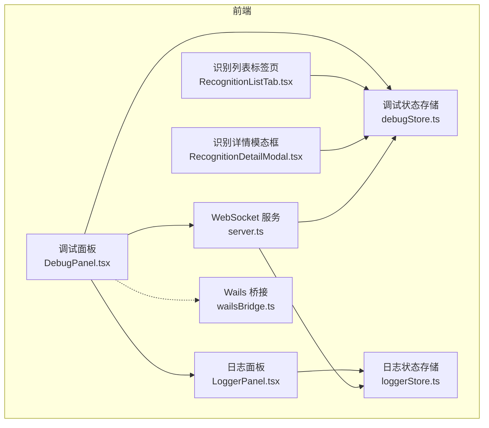
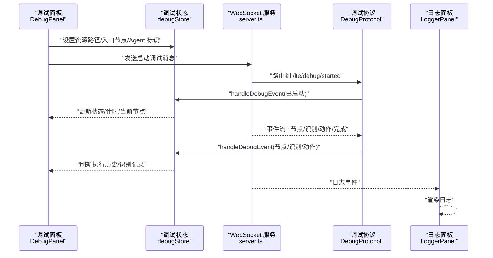
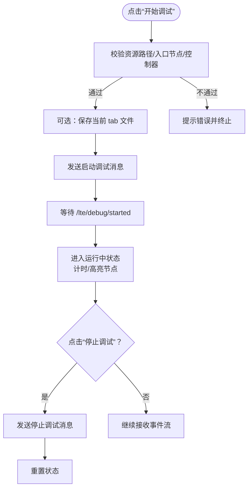
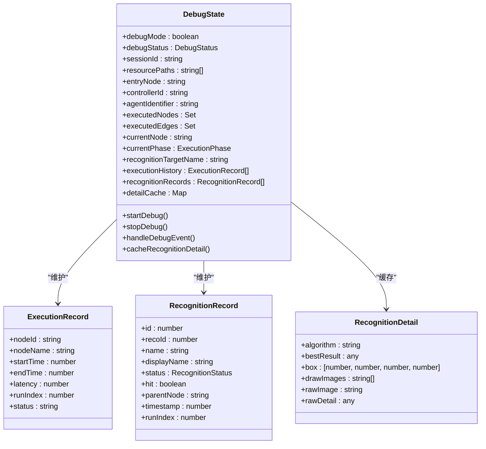
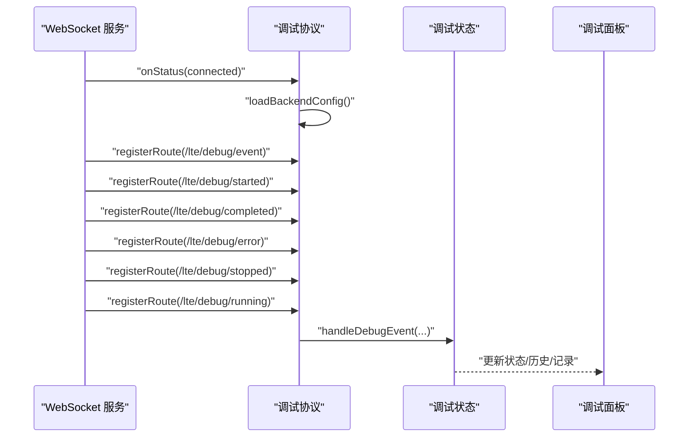
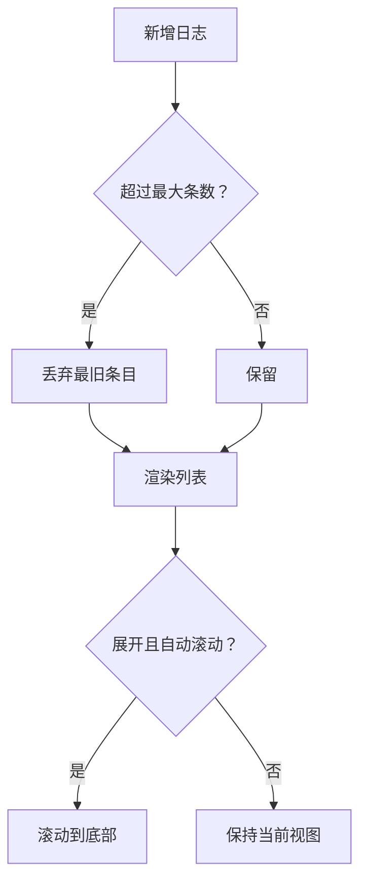
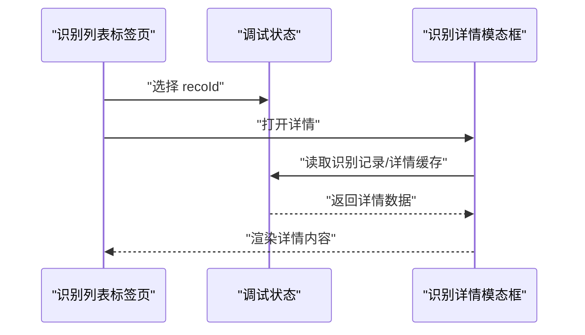
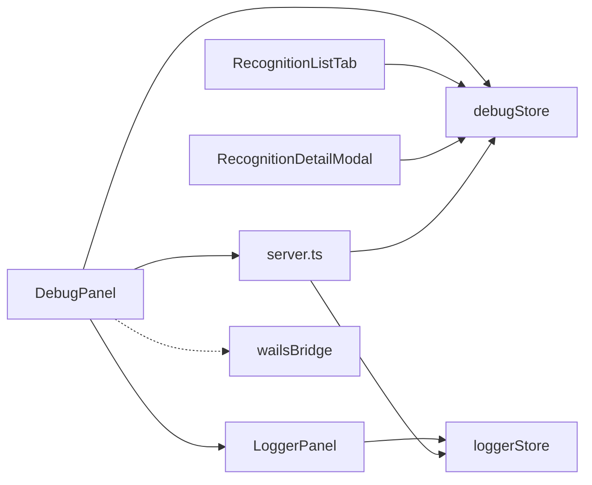

# 调试工具

<cite>
**本文引用的文件**   
- [DebugPanel.tsx](file://src/components/panels/tools/DebugPanel.tsx)
- [debugStore.ts](file://src/stores/debugStore.ts)
- [DebugProtocol.ts](file://src/services/protocols/DebugProtocol.ts)
- [LoggerPanel.tsx](file://src/components/panels/tools/LoggerPanel.tsx)
- [loggerStore.ts](file://src/stores/loggerStore.ts)
- [RecognitionListTab.tsx](file://src/components/panels/tools/RecognitionListTab.tsx)
- [RecognitionDetailModal.tsx](file://src/components/panels/tools/RecognitionDetailModal.tsx)
- [server.ts](file://src/services/server.ts)
- [wsStore.ts](file://src/stores/wsStore.ts)
- [wailsBridge.ts](file://src/utils/wailsBridge.ts)
- [DebugPanel.module.less](file://src/styles/DebugPanel.module.less)
- [LoggerPanel.module.less](file://src/styles/LoggerPanel.module.less)
</cite>

## 目录
1. [简介](#简介)
2. [项目结构](#项目结构)
3. [核心组件](#核心组件)
4. [架构总览](#架构总览)
5. [详细组件分析](#详细组件分析)
6. [依赖关系分析](#依赖关系分析)
7. [性能考量](#性能考量)
8. [故障排查指南](#故障排查指南)
9. [结论](#结论)
10. [附录](#附录)

## 简介
本指南面向使用 MaaPipelineEditor 的开发者与高级用户，聚焦“调试工具”的使用与扩展。内容涵盖：
- 内置调试面板的功能与使用方法：实时调试状态监控、执行流程跟踪、识别记录与详情查看、日志面板联动等
- 如何使用浏览器开发者工具进行前端调试：React DevTools、网络面板、控制台调试等
- WebSocket 通信调试：消息监听、协议验证、连接状态检查
- 性能分析工具的使用建议：内存泄漏检测、渲染性能监控、CPU 使用率分析
- 第三方调试工具集成建议：提升问题排查效率

## 项目结构
调试工具相关的核心位置如下：
- 调试面板与工具：src/components/panels/tools/
- 调试状态与数据：src/stores/debugStore.ts
- WebSocket 服务与协议：src/services/server.ts、src/services/protocols/DebugProtocol.ts
- 日志面板与状态：src/components/panels/tools/LoggerPanel.tsx、src/stores/loggerStore.ts
- 样式：src/styles/DebugPanel.module.less、src/styles/LoggerPanel.module.less
- Wails 桥接：src/utils/wailsBridge.ts

**图表来源**
- [DebugPanel.tsx:1-493](file://src/components/panels/tools/DebugPanel.tsx#L1-L493)
- [debugStore.ts:1-897](file://src/stores/debugStore.ts#L1-L897)
- [server.ts:1-373](file://src/services/server.ts#L1-L373)
- [LoggerPanel.tsx:1-182](file://src/components/panels/tools/LoggerPanel.tsx#L1-L182)
- [loggerStore.ts:1-46](file://src/stores/loggerStore.ts#L1-L46)
- [RecognitionListTab.tsx:1-291](file://src/components/panels/tools/RecognitionListTab.tsx#L1-L291)
- [RecognitionDetailModal.tsx:1-261](file://src/components/panels/tools/RecognitionDetailModal.tsx#L1-L261)
- [wailsBridge.ts:1-197](file://src/utils/wailsBridge.ts#L1-L197)

**章节来源**
- [DebugPanel.tsx:1-493](file://src/components/panels/tools/DebugPanel.tsx#L1-L493)
- [debugStore.ts:1-897](file://src/stores/debugStore.ts#L1-L897)
- [server.ts:1-373](file://src/services/server.ts#L1-L373)
- [LoggerPanel.tsx:1-182](file://src/components/panels/tools/LoggerPanel.tsx#L1-L182)
- [loggerStore.ts:1-46](file://src/stores/loggerStore.ts#L1-L46)
- [RecognitionListTab.tsx:1-291](file://src/components/panels/tools/RecognitionListTab.tsx#L1-L291)
- [RecognitionDetailModal.tsx:1-261](file://src/components/panels/tools/RecognitionDetailModal.tsx#L1-L261)
- [wailsBridge.ts:1-197](file://src/utils/wailsBridge.ts#L1-L197)

## 核心组件
- 调试面板（DebugPanel）：提供调试配置、启动/停止调试、打开日志、切换识别记录面板等入口；实时显示调试状态、耗时、当前节点等
- 调试状态存储（debugStore）：集中管理调试状态、执行历史、识别记录、详情缓存、单节点测试等
- WebSocket 服务与协议（server.ts、DebugProtocol）：负责与本地服务建立连接、握手校验、事件路由、调试事件处理
- 日志面板（LoggerPanel）：展示后端日志，支持展开/收起、自动滚动、清空
- 识别记录与详情（RecognitionListTab、RecognitionDetailModal）：以列表与模态框形式展示识别记录及详情（命中与否、算法、绘制图、最佳结果、识别框、原始详情与图像）

**章节来源**
- [DebugPanel.tsx:1-493](file://src/components/panels/tools/DebugPanel.tsx#L1-L493)
- [debugStore.ts:1-897](file://src/stores/debugStore.ts#L1-L897)
- [server.ts:1-373](file://src/services/server.ts#L1-L373)
- [LoggerPanel.tsx:1-182](file://src/components/panels/tools/LoggerPanel.tsx#L1-L182)
- [loggerStore.ts:1-46](file://src/stores/loggerStore.ts#L1-L46)
- [RecognitionListTab.tsx:1-291](file://src/components/panels/tools/RecognitionListTab.tsx#L1-L291)
- [RecognitionDetailModal.tsx:1-261](file://src/components/panels/tools/RecognitionDetailModal.tsx#L1-L261)

## 架构总览
调试工具的前端架构围绕“状态存储 + 协议处理 + 视图组件”三层展开，通过 WebSocket 与本地服务交互，形成闭环。

**图表来源**
- [DebugPanel.tsx:288-332](file://src/components/panels/tools/DebugPanel.tsx#L288-L332)
- [debugStore.ts:437-795](file://src/stores/debugStore.ts#L437-L795)
- [server.ts:348-373](file://src/services/server.ts#L348-L373)
- [DebugProtocol.ts:574-666](file://src/services/protocols/DebugProtocol.ts#L574-L666)
- [LoggerPanel.tsx:55-182](file://src/components/panels/tools/LoggerPanel.tsx#L55-L182)

## 详细组件分析

### 调试面板（DebugPanel）
- 功能要点
  - 调试配置：资源路径（可多路径）、Agent 标识、入口节点选择
  - 调试控制：开始/停止调试、打开日志、切换识别记录面板
  - 实时状态：状态标签、耗时、当前节点、识别目标
  - 自动填充：连接成功后自动请求后端配置并填充资源路径
- 关键交互
  - 开始调试前校验：资源路径、入口节点、控制器连接、必要时自动保存文件
  - 发送启动消息：携带资源路径、入口节点全名、控制器 ID、Agent 标识
  - 停止调试：发送停止消息并回滚状态
  - 打开日志：请求后端打开 maa.log 并提示结果

**图表来源**
- [DebugPanel.tsx:288-351](file://src/components/panels/tools/DebugPanel.tsx#L288-L351)
- [debugStore.ts:295-398](file://src/stores/debugStore.ts#L295-L398)

**章节来源**
- [DebugPanel.tsx:1-493](file://src/components/panels/tools/DebugPanel.tsx#L1-L493)
- [DebugPanel.module.less:1-798](file://src/styles/DebugPanel.module.less#L1-L798)

### 调试状态存储（debugStore）
- 数据模型
  - 调试状态：idle/preparing/running/paused/completed
  - 执行历史：节点级事件（开始/成功/失败），含耗时、运行索引
  - 识别记录：识别开始/成功/失败，命中与否，父节点，runIndex
  - 详情缓存：按 recoId 缓存识别详情（算法、绘制图、最佳结果、识别框、原始详情/图像）
  - 单节点测试：测试模式、结果聚合与展示
- 事件处理
  - 节点事件：更新执行历史、当前节点、执行状态
  - 识别事件：创建/更新识别记录，命中与详情缓存
  - 动作事件：更新执行历史与当前节点状态
  - 完成/错误：重置状态、清理资源
- 内存与性能
  - 识别记录与执行历史上限控制，定期清理最旧条目
  - 详情缓存上限控制，避免大体积 base64 图像长期驻留

**图表来源**
- [debugStore.ts:143-221](file://src/stores/debugStore.ts#L143-L221)
- [debugStore.ts:80-137](file://src/stores/debugStore.ts#L80-L137)
- [debugStore.ts:105-122](file://src/stores/debugStore.ts#L105-L122)

**章节来源**
- [debugStore.ts:1-897](file://src/stores/debugStore.ts#L1-L897)

### WebSocket 服务与协议（server.ts、DebugProtocol）
- 连接与握手
  - 自动连接本地服务，发送协议版本握手，校验失败则断开并提示
  - 连接状态变更时回调 UI，断线自动停止调试
- 调试事件路由
  - 注册 /lte/debug/* 路由，统一处理启动、停止、运行中、事件流、完成、错误
  - 事件名映射到 store 的 handleDebugEvent，驱动 UI 更新
- 节点名称转换
  - 将后端事件中的“全名”转换为前端 Flow ID，用于断点、高亮、状态更新
- 错误处理
  - 资源加载失败等特定错误弹窗提示，并引导检查资源路径

**图表来源**
- [server.ts:25-75](file://src/services/server.ts#L25-L75)
- [DebugProtocol.ts:25-75](file://src/services/protocols/DebugProtocol.ts#L25-L75)
- [DebugProtocol.ts:136-232](file://src/services/protocols/DebugProtocol.ts#L136-L232)

**章节来源**
- [server.ts:1-373](file://src/services/server.ts#L1-L373)
- [DebugProtocol.ts:1-1004](file://src/services/protocols/DebugProtocol.ts#L1-L1004)

### 日志面板（LoggerPanel）与日志状态（loggerStore）
- 日志面板
  - 收起态：仅显示最新日志条目的模块与消息，带脉冲提示
  - 展开态：完整日志列表，自动滚动至底部，支持清空
- 日志状态
  - 限制最大日志条数，超过上限丢弃最旧条目
  - 提供添加、清空、展开/收起控制

**图表来源**
- [loggerStore.ts:26-45](file://src/stores/loggerStore.ts#L26-L45)
- [LoggerPanel.tsx:64-93](file://src/components/panels/tools/LoggerPanel.tsx#L64-L93)

**章节来源**
- [LoggerPanel.tsx:1-182](file://src/components/panels/tools/LoggerPanel.tsx#L1-L182)
- [loggerStore.ts:1-46](file://src/stores/loggerStore.ts#L1-L46)
- [LoggerPanel.module.less:1-272](file://src/styles/LoggerPanel.module.less#L1-L272)

### 识别记录与详情（RecognitionListTab、RecognitionDetailModal）
- 识别列表
  - 分页展示识别记录，支持倒序/正序切换、清空
  - 每条记录显示状态、命中、父节点、时间戳、runIndex
  - 点击“查看详情”打开模态框
- 识别详情
  - 基本信息：节点名、识别ID、状态、命中、runIndex、时间戳、父节点
  - 算法信息、绘制图像、最佳结果、识别框、原始详情、原始图像（若缓存）
  - 无详情时提示“详细信息尚未加载”

**图表来源**
- [RecognitionListTab.tsx:184-196](file://src/components/panels/tools/RecognitionListTab.tsx#L184-L196)
- [RecognitionDetailModal.tsx:35-44](file://src/components/panels/tools/RecognitionDetailModal.tsx#L35-L44)

**章节来源**
- [RecognitionListTab.tsx:1-291](file://src/components/panels/tools/RecognitionListTab.tsx#L1-L291)
- [RecognitionDetailModal.tsx:1-261](file://src/components/panels/tools/RecognitionDetailModal.tsx#L1-L261)
- [DebugPanel.module.less:297-798](file://src/styles/DebugPanel.module.less#L297-L798)

## 依赖关系分析
- 组件耦合
  - DebugPanel 依赖 debugStore、server、mfwProtocol、configProtocol
  - LoggerPanel 依赖 loggerStore、wsStore
  - 识别相关组件依赖 debugStore
- 外部依赖
  - WebSocket 服务负责与本地服务通信
  - Wails 桥接提供环境检测与事件监听能力

**图表来源**
- [DebugPanel.tsx:1-493](file://src/components/panels/tools/DebugPanel.tsx#L1-L493)
- [server.ts:1-373](file://src/services/server.ts#L1-L373)
- [LoggerPanel.tsx:1-182](file://src/components/panels/tools/LoggerPanel.tsx#L1-L182)
- [loggerStore.ts:1-46](file://src/stores/loggerStore.ts#L1-L46)
- [RecognitionListTab.tsx:1-291](file://src/components/panels/tools/RecognitionListTab.tsx#L1-L291)
- [RecognitionDetailModal.tsx:1-261](file://src/components/panels/tools/RecognitionDetailModal.tsx#L1-L261)
- [wailsBridge.ts:1-197](file://src/utils/wailsBridge.ts#L1-L197)

**章节来源**
- [DebugPanel.tsx:1-493](file://src/components/panels/tools/DebugPanel.tsx#L1-L493)
- [server.ts:1-373](file://src/services/server.ts#L1-L373)
- [LoggerPanel.tsx:1-182](file://src/components/panels/tools/LoggerPanel.tsx#L1-L182)
- [loggerStore.ts:1-46](file://src/stores/loggerStore.ts#L1-L46)
- [RecognitionListTab.tsx:1-291](file://src/components/panels/tools/RecognitionListTab.tsx#L1-L291)
- [RecognitionDetailModal.tsx:1-261](file://src/components/panels/tools/RecognitionDetailModal.tsx#L1-L261)
- [wailsBridge.ts:1-197](file://src/utils/wailsBridge.ts#L1-L197)

## 性能考量
- 内存管理
  - 识别记录与执行历史上限控制，定期清理最旧条目，避免无限增长
  - 详情缓存上限控制，避免 base64 图像占用过多内存
- 渲染优化
  - 识别列表采用分页与倒序展示，减少 DOM 节点数量
  - 日志面板展开态自动滚动至底部，避免频繁重排
- CPU 使用
  - 事件处理集中在 store，避免在 UI 层做重型计算
  - WebSocket 事件解析与路由在协议层统一处理，降低 UI 压力

[本节为通用指导，无需列出具体文件来源]

## 故障排查指南
- WebSocket 连接问题
  - 检查本地服务是否启动、端口是否正确
  - 查看握手版本是否匹配，不匹配需按提示更新
  - 监控连接状态回调，断线自动停止调试
- 调试启动失败
  - 确认资源路径有效、入口节点存在、控制器已连接
  - 若提示“资源加载失败”，检查资源路径是否指向包含 pipeline 的目录
- 识别记录异常
  - 确认识别事件流正常，查看识别列表与详情缓存
  - 若详情未显示，等待后端事件推送或检查缓存命中
- 日志异常
  - 确认日志面板已展开，检查自动滚动与清空按钮
  - 若无日志，确认 WebSocket 已连接

**章节来源**
- [server.ts:37-65](file://src/services/server.ts#L37-L65)
- [server.ts:104-251](file://src/services/server.ts#L104-L251)
- [DebugProtocol.ts:444-540](file://src/services/protocols/DebugProtocol.ts#L444-L540)
- [DebugPanel.tsx:92-128](file://src/components/panels/tools/DebugPanel.tsx#L92-L128)
- [LoggerPanel.tsx:95-98](file://src/components/panels/tools/LoggerPanel.tsx#L95-L98)

## 结论
MaaPipelineEditor 的调试工具通过“状态存储 + 协议处理 + 视图组件”的清晰分层，提供了从连接、启动、事件流到日志与识别详情的完整调试体验。配合浏览器开发者工具与 WebSocket 调试，可高效定位问题并优化性能。建议在日常开发中充分利用识别记录与日志面板，结合 Wails 桥接能力进行跨端调试。

[本节为总结性内容，无需列出具体文件来源]

## 附录

### 使用浏览器开发者工具进行前端调试
- React DevTools
  - 安装 React DevTools 扩展，定位组件树、查看 props 与 state
  - 在调试面板、识别列表、日志面板中观察状态变化
- 网络面板
  - 观察 WebSocket 握手与消息路由，确认路径与数据结构
  - 检查握手版本、事件流、停止/完成消息
- 控制台调试
  - 在协议层与 store 层打印关键事件，辅助定位问题
  - 使用断点观察事件处理顺序与状态更新

[本节为通用指导，无需列出具体文件来源]

### WebSocket 通信调试方法
- 消息监听
  - 在协议注册处监听路由，确认事件名与数据结构
- 协议验证
  - 握手版本校验失败时断开并提示，确保前后端一致
- 连接状态检查
  - 监听连接状态回调，断线自动停止调试，避免状态不一致

**章节来源**
- [server.ts:37-65](file://src/services/server.ts#L37-L65)
- [server.ts:104-251](file://src/services/server.ts#L104-L251)
- [DebugProtocol.ts:25-75](file://src/services/protocols/DebugProtocol.ts#L25-L75)

### 性能分析工具使用建议
- 内存泄漏检测
  - 使用浏览器内存快照对比，关注识别记录与详情缓存的增长趋势
- 渲染性能监控
  - 使用性能面板记录帧率，观察识别列表与日志面板的滚动性能
- CPU 使用率分析
  - 在事件密集时段观察 CPU 占用，避免在 UI 层做重型计算

[本节为通用指导，无需列出具体文件来源]

### 第三方调试工具集成建议
- Wails 环境检测与事件监听
  - 使用 wailsBridge 检测运行环境，监听后端事件，便于跨端调试
- 日志输出
  - 通过 wailsLog 输出日志，结合前端日志面板统一查看

**章节来源**
- [wailsBridge.ts:1-197](file://src/utils/wailsBridge.ts#L1-L197)