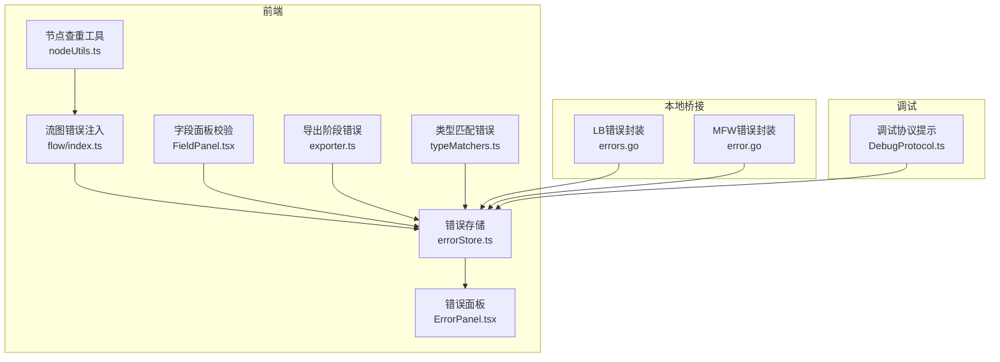
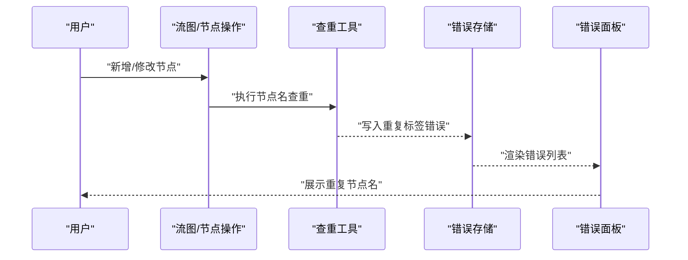
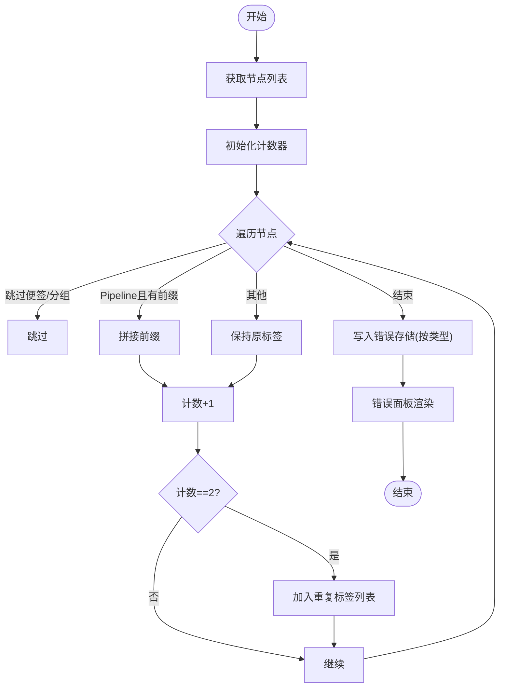
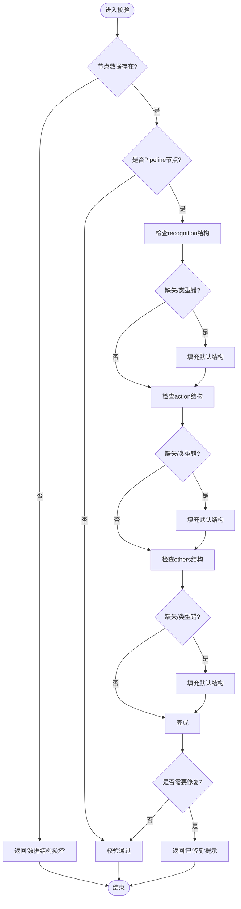
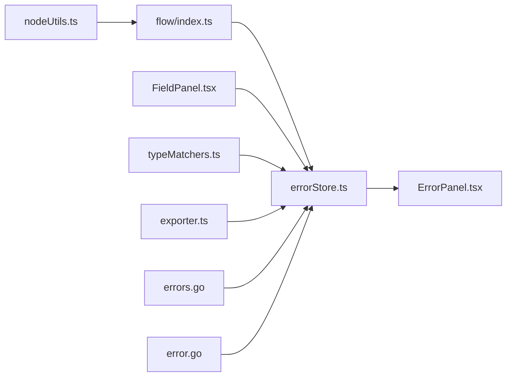

# 错误代码参考

<cite>
**本文引用的文件**
- [errorStore.ts](file://src/stores/errorStore.ts)
- [flow/index.ts](file://src/stores/flow/index.ts)
- [nodeUtils.ts](file://src/stores/flow/utils/nodeUtils.ts)
- [ErrorPanel.tsx](file://src/components/panels/main/ErrorPanel.tsx)
- [FieldPanel.tsx](file://src/components/panels/main/FieldPanel.tsx)
- [errors.go](file://LocalBridge/internal/errors/errors.go)
- [error.go](file://LocalBridge/internal/mfw/error.go)
- [exporter.ts](file://src/core/parser/exporter.ts)
- [typeMatchers.ts](file://src/core/parser/typeMatchers.ts)
- [DebugProtocol.ts](file://src/services/protocols/DebugProtocol.ts)
</cite>

## 目录
1. [简介](#简介)
2. [项目结构](#项目结构)
3. [核心组件](#核心组件)
4. [架构总览](#架构总览)
5. [详细组件分析](#详细组件分析)
6. [依赖分析](#依赖分析)
7. [性能考虑](#性能考虑)
8. [故障排查指南](#故障排查指南)
9. [结论](#结论)
10. [附录](#附录)

## 简介
本手册面向MaaPipelineEditor的开发者与高级用户，系统性整理并解释“运行期错误”与“编译/解析期错误”的类型、含义、触发条件、错误消息格式与影响范围，并提供错误处理最佳实践与恢复策略。重点覆盖以下内容：
- 错误类型枚举与语义
- 错误来源与传播链路
- 错误消息格式与展示方式
- 与实际问题的对应关系表
- 在代码中正确捕获、分类与恢复的方法

## 项目结构
围绕错误体系的关键模块如下：
- 前端状态与展示
  - 错误存储与查询：src/stores/errorStore.ts
  - 流图节点查重与错误注入：src/stores/flow/index.ts、src/stores/flow/utils/nodeUtils.ts
  - 错误面板展示：src/components/panels/main/ErrorPanel.tsx
  - 节点数据完整性校验与修复：src/components/panels/main/FieldPanel.tsx
- 编译/解析期错误
  - 类型匹配失败提示：src/core/parser/typeMatchers.ts
  - 导出阶段错误收集与上报：src/core/parser/exporter.ts
- 本地桥接(LB)与MFW错误
  - LB错误码与封装：LocalBridge/internal/errors/errors.go
  - MFW错误码与封装：LocalBridge/internal/mfw/error.go
- 调试与提示
  - 调试协议中的资源加载错误提示：src/services/protocols/DebugProtocol.ts

图表来源
- [errorStore.ts:1-39](file://src/stores/errorStore.ts#L1-L39)
- [flow/index.ts:69-89](file://src/stores/flow/index.ts#L69-L89)
- [nodeUtils.ts:248-275](file://src/stores/flow/utils/nodeUtils.ts#L248-L275)
- [ErrorPanel.tsx:1-38](file://src/components/panels/main/ErrorPanel.tsx#L1-L38)
- [FieldPanel.tsx:54-119](file://src/components/panels/main/FieldPanel.tsx#L54-L119)
- [exporter.ts:1-43](file://src/core/parser/exporter.ts#L1-L43)
- [typeMatchers.ts:300-339](file://src/core/parser/typeMatchers.ts#L300-L339)
- [errors.go:1-141](file://LocalBridge/internal/errors/errors.go#L1-L141)
- [error.go:1-53](file://LocalBridge/internal/mfw/error.go#L1-L53)
- [DebugProtocol.ts:510-659](file://src/services/protocols/DebugProtocol.ts#L510-L659)

章节来源
- [errorStore.ts:1-39](file://src/stores/errorStore.ts#L1-L39)
- [flow/index.ts:69-89](file://src/stores/flow/index.ts#L69-L89)
- [nodeUtils.ts:248-275](file://src/stores/flow/utils/nodeUtils.ts#L248-L275)
- [ErrorPanel.tsx:1-38](file://src/components/panels/main/ErrorPanel.tsx#L1-L38)
- [FieldPanel.tsx:54-119](file://src/components/panels/main/FieldPanel.tsx#L54-L119)
- [exporter.ts:1-43](file://src/core/parser/exporter.ts#L1-L43)
- [typeMatchers.ts:300-339](file://src/core/parser/typeMatchers.ts#L300-L339)
- [errors.go:1-141](file://LocalBridge/internal/errors/errors.go#L1-L141)
- [error.go:1-53](file://LocalBridge/internal/mfw/error.go#L1-L53)
- [DebugProtocol.ts:510-659](file://src/services/protocols/DebugProtocol.ts#L510-L659)

## 核心组件
- 错误类型枚举与存储
  - 枚举：节点名重复(NodeNameRepeat)
  - 存储：统一在前端错误存储中管理，支持按类型过滤与批量更新
- 节点查重与错误注入
  - 在流图变更后执行查重，将重复标签以错误条目形式写入错误存储
- 错误展示
  - 错误面板根据错误存储渲染列表，支持点击交互
- 数据校验与修复
  - 字段面板对节点数据进行完整性校验，必要时自动修复并提示
- 编译/解析期错误
  - 类型匹配失败时弹出通知；导出阶段可汇总错误并上报
- 本地桥接与MFW错误
  - LB与MFW分别定义错误码与封装结构，便于跨层传递与统一处理

章节来源
- [errorStore.ts:3-11](file://src/stores/errorStore.ts#L3-L11)
- [flow/index.ts:75-86](file://src/stores/flow/index.ts#L75-L86)
- [nodeUtils.ts:248-275](file://src/stores/flow/utils/nodeUtils.ts#L248-L275)
- [ErrorPanel.tsx:20-35](file://src/components/panels/main/ErrorPanel.tsx#L20-L35)
- [FieldPanel.tsx:54-119](file://src/components/panels/main/FieldPanel.tsx#L54-L119)
- [typeMatchers.ts:324-335](file://src/core/parser/typeMatchers.ts#L324-L335)
- [exporter.ts:5-10](file://src/core/parser/exporter.ts#L5-L10)
- [errors.go:10-20](file://LocalBridge/internal/errors/errors.go#L10-L20)
- [error.go:6-21](file://LocalBridge/internal/mfw/error.go#L6-L21)

## 架构总览
错误在系统内的流转路径如下：
- 前端
  - 节点查重 → 写入错误存储 → 错误面板展示
  - 字段面板校验 → 自动修复/提示 → 更新错误存储
  - 类型匹配失败 → 通知提示 → 更新错误存储
  - 导出阶段 → 收集错误 → 统一上报
- 本地桥接
  - LB/MFW错误封装 → 统一错误数据结构 → 前端接收并显示

图表来源
- [flow/index.ts:75-86](file://src/stores/flow/index.ts#L75-L86)
- [nodeUtils.ts:248-275](file://src/stores/flow/utils/nodeUtils.ts#L248-L275)
- [errorStore.ts:24-38](file://src/stores/errorStore.ts#L24-L38)
- [ErrorPanel.tsx:20-35](file://src/components/panels/main/ErrorPanel.tsx#L20-L35)

## 详细组件分析

### 错误类型枚举与含义
- 节点名重复(NodeNameRepeat)
  - 含义：在同一画布中存在多个同名节点（按导出配置与前缀规则合并后的标签）
  - 触发条件：节点查重返回非空集合
  - 影响范围：可能导致导出配置引用歧义、调试定位困难
  - 错误消息格式：错误条目的msg字段即为重复的标签文本
  - 修复建议：为重复节点更改标签或调整导出前缀配置

章节来源
- [errorStore.ts:3-5](file://src/stores/errorStore.ts#L3-L5)
- [nodeUtils.ts:248-275](file://src/stores/flow/utils/nodeUtils.ts#L248-L275)
- [flow/index.ts:75-86](file://src/stores/flow/index.ts#L75-L86)

### 节点查重与错误注入流程
- 查重逻辑
  - 遍历节点，跳过便签与分组节点
  - 若处于导出配置且存在前缀，则对Pipeline节点标签加前缀再计数
  - 首次出现两次即记录为重复标签
- 注入错误
  - 使用错误存储的setError按类型写入重复标签
- 展示
  - 错误面板遍历错误存储并渲染

图表来源
- [nodeUtils.ts:248-275](file://src/stores/flow/utils/nodeUtils.ts#L248-L275)
- [flow/index.ts:75-86](file://src/stores/flow/index.ts#L75-L86)
- [errorStore.ts:24-38](file://src/stores/errorStore.ts#L24-L38)
- [ErrorPanel.tsx:20-35](file://src/components/panels/main/ErrorPanel.tsx#L20-L35)

章节来源
- [nodeUtils.ts:248-275](file://src/stores/flow/utils/nodeUtils.ts#L248-L275)
- [flow/index.ts:75-86](file://src/stores/flow/index.ts#L75-L86)
- [errorStore.ts:24-38](file://src/stores/errorStore.ts#L24-L38)
- [ErrorPanel.tsx:20-35](file://src/components/panels/main/ErrorPanel.tsx#L20-L35)

### 字段面板校验与自动修复
- 校验目标：Pipeline节点的recognition/action/others字段完整性
- 修复策略：缺失或类型不符时填充默认结构并标记“已修复”
- 错误存储：若修复发生，会写入相应提示（由调用方决定是否作为错误）

图表来源
- [FieldPanel.tsx:54-119](file://src/components/panels/main/FieldPanel.tsx#L54-L119)

章节来源
- [FieldPanel.tsx:54-119](file://src/components/panels/main/FieldPanel.tsx#L54-L119)

### 类型匹配失败与导出阶段错误
- 类型匹配失败
  - 当参数类型无法匹配任何预定义类型时，弹出“类型错误”通知
  - 描述信息包含“可能的参数”提示，辅助定位
- 导出阶段错误
  - 导出器引入错误存储依赖，可在导出前/中收集并统一上报

章节来源
- [typeMatchers.ts:324-335](file://src/core/parser/typeMatchers.ts#L324-L335)
- [exporter.ts:5-10](file://src/core/parser/exporter.ts#L5-L10)

### 本地桥接与MFW错误
- LB错误
  - 错误码常量：文件不存在、读写失败、文件名冲突、JSON无效、权限不足、请求无效、连接失败、内部错误
  - 封装结构：包含Code、Message、Detail、Err，支持Wrap与WithDetail
- MFW错误
  - 错误码常量：控制器创建/未找到/连接失败、未连接、连接失败、截图失败、操作失败、任务提交失败、资源加载失败、参数无效、设备未找到、未初始化、OCR资源未配置
  - 封装结构：包含code、message、detail

章节来源
- [errors.go:10-20](file://LocalBridge/internal/errors/errors.go#L10-L20)
- [errors.go:23-50](file://LocalBridge/internal/errors/errors.go#L23-L50)
- [errors.go:75-141](file://LocalBridge/internal/errors/errors.go#L75-L141)
- [error.go:6-21](file://LocalBridge/internal/mfw/error.go#L6-L21)
- [error.go:34-52](file://LocalBridge/internal/mfw/error.go#L34-L52)

### 调试协议中的资源加载错误提示
- 当检测到资源相关错误时，弹出模态框，给出路径与重名等检查要点
- 非资源类错误则直接以消息提示

章节来源
- [DebugProtocol.ts:598-659](file://src/services/protocols/DebugProtocol.ts#L598-L659)

## 依赖分析
- 错误存储与展示
  - 错误存储被多处模块依赖：流图查重、字段面板、类型匹配、导出器
- 本地桥接错误
  - 前端通过统一错误数据结构接收LB/MFW错误，便于集中处理

图表来源
- [nodeUtils.ts:248-275](file://src/stores/flow/utils/nodeUtils.ts#L248-L275)
- [flow/index.ts:75-86](file://src/stores/flow/index.ts#L75-L86)
- [errorStore.ts:24-38](file://src/stores/errorStore.ts#L24-L38)
- [FieldPanel.tsx:54-119](file://src/components/panels/main/FieldPanel.tsx#L54-L119)
- [typeMatchers.ts:324-335](file://src/core/parser/typeMatchers.ts#L324-L335)
- [exporter.ts:5-10](file://src/core/parser/exporter.ts#L5-L10)
- [errors.go:44-50](file://LocalBridge/internal/errors/errors.go#L44-L50)
- [error.go:34-52](file://LocalBridge/internal/mfw/error.go#L34-L52)
- [ErrorPanel.tsx:20-35](file://src/components/panels/main/ErrorPanel.tsx#L20-L35)

## 性能考虑
- 节点查重复杂度
  - 时间复杂度：O(N)，空间复杂度：O(U)（U为唯一标签数）
  - 建议：仅在节点/边关键变更后触发，避免频繁全量扫描
- 错误存储更新
  - 采用按类型替换策略，减少不必要的渲染
- 类型匹配
  - 对每个参数尝试多种类型，注意在大规模节点场景下的开销

## 故障排查指南
- 节点名重复
  - 现象：错误面板显示重复标签
  - 检查点：导出配置前缀、Pipeline节点标签、是否存在手动重名
  - 处理：修改标签或调整前缀；确认导出配置后再次查重
- 节点数据结构损坏
  - 现象：字段面板返回“数据结构损坏”，可能伴随自动修复提示
  - 检查点：recognition/action/others字段是否存在且为对象
  - 处理：根据提示修复或重新生成节点
- 类型匹配失败
  - 现象：弹出“类型错误”通知
  - 检查点：参数类型与协议定义是否一致；查看“可能的参数”提示
  - 处理：修正字段类型或删除不兼容字段
- 资源加载失败
  - 现象：调试协议弹出资源加载失败提示
  - 检查点：资源路径是否指向包含pipeline的目录；是否存在重名
  - 处理：修正资源路径与命名，确保可访问性

章节来源
- [ErrorPanel.tsx:20-35](file://src/components/panels/main/ErrorPanel.tsx#L20-L35)
- [FieldPanel.tsx:54-119](file://src/components/panels/main/FieldPanel.tsx#L54-L119)
- [typeMatchers.ts:324-335](file://src/core/parser/typeMatchers.ts#L324-L335)
- [DebugProtocol.ts:598-659](file://src/services/protocols/DebugProtocol.ts#L598-L659)

## 结论
本手册梳理了MaaPipelineEditor的错误体系：从前端运行期错误（节点名重复、数据结构损坏、类型匹配失败），到编译/解析期错误提示，再到本地桥接与MFW错误封装。通过统一的错误存储与面板展示，开发者可以快速定位问题并采取针对性修复策略。

## 附录

### 错误类型与对应关系表
- 节点名重复(NodeNameRepeat)
  - 触发：节点查重发现重复标签
  - 消息：重复标签文本
  - 影响：导出/调试引用歧义
  - 修复：改名或调整前缀
- 节点数据结构损坏
  - 触发：字段面板校验发现recognition/action/others缺失或类型错误
  - 消息：固定提示文本
  - 影响：节点不可用或行为异常
  - 修复：自动修复或手动修正
- 类型匹配失败
  - 触发：参数类型无法匹配协议定义
  - 消息：类型错误 + 可能的参数提示
  - 影响：导出/运行时参数不生效
  - 修复：修正类型或删除不兼容字段
- 资源加载失败
  - 触发：调试协议检测到资源路径或命名问题
  - 消息：资源加载失败 + 操作指引
  - 影响：调试/运行时资源不可用
  - 修复：修正路径与命名

章节来源
- [errorStore.ts:3-5](file://src/stores/errorStore.ts#L3-L5)
- [FieldPanel.tsx:54-119](file://src/components/panels/main/FieldPanel.tsx#L54-L119)
- [typeMatchers.ts:324-335](file://src/core/parser/typeMatchers.ts#L324-L335)
- [DebugProtocol.ts:598-659](file://src/services/protocols/DebugProtocol.ts#L598-L659)