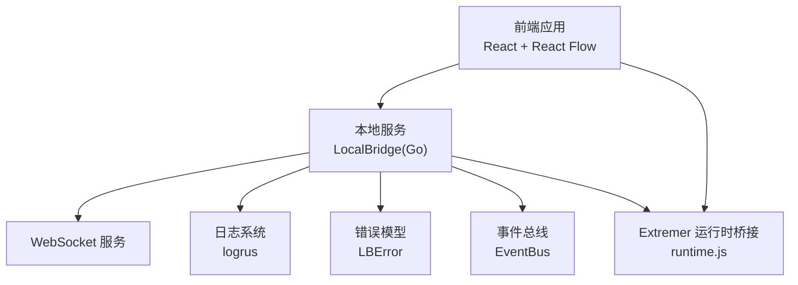
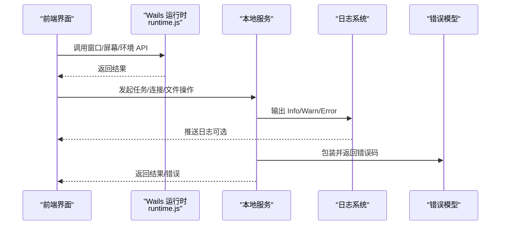
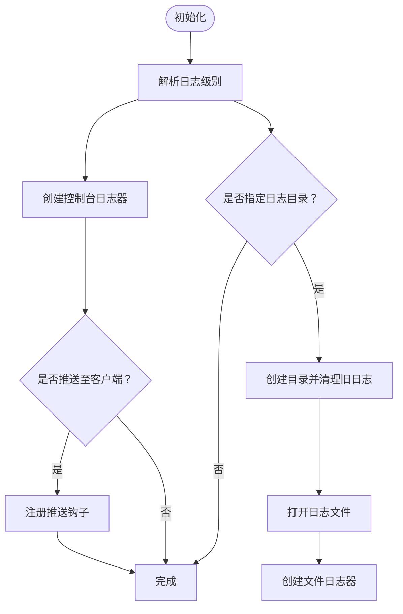
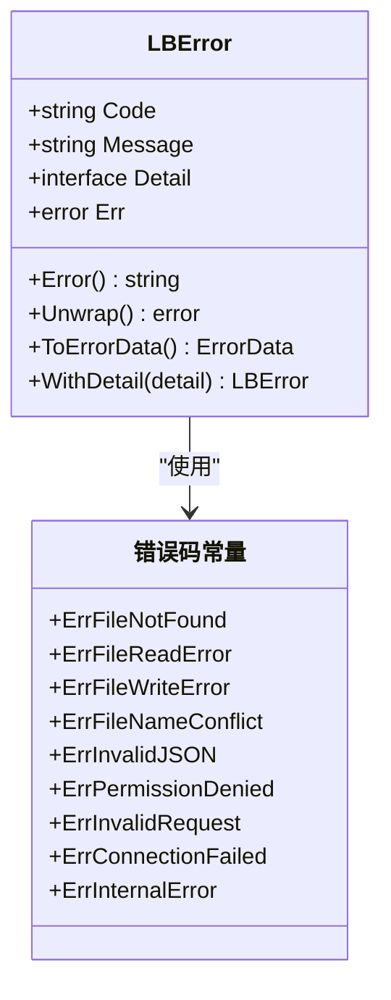
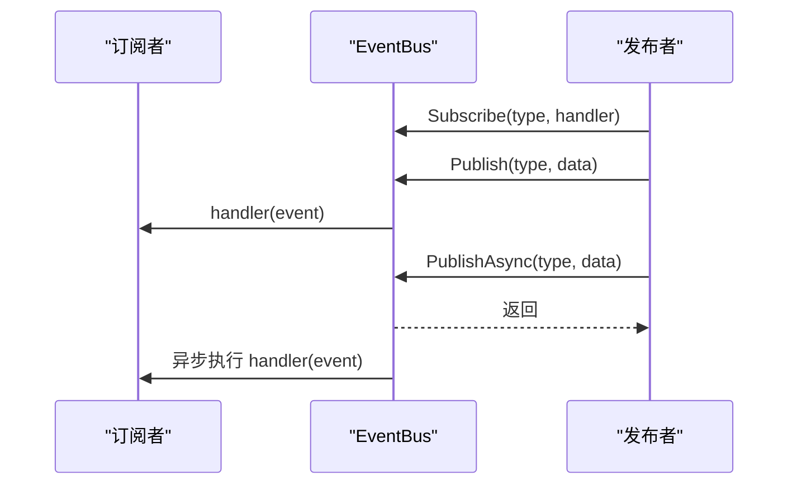
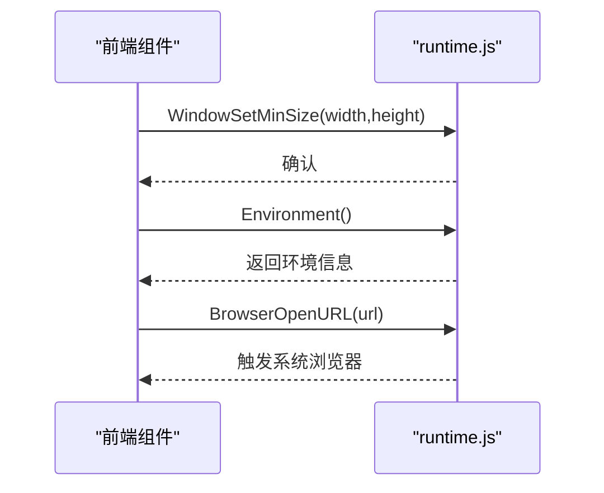
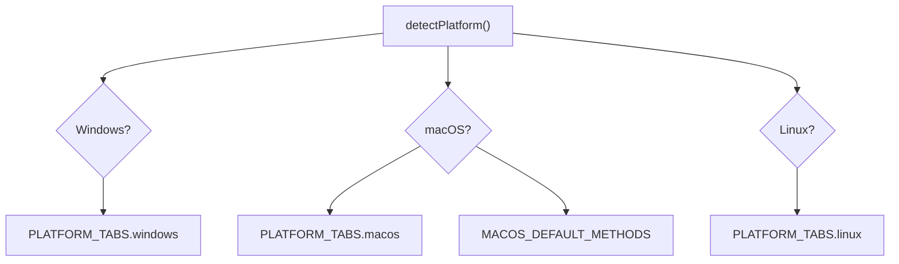
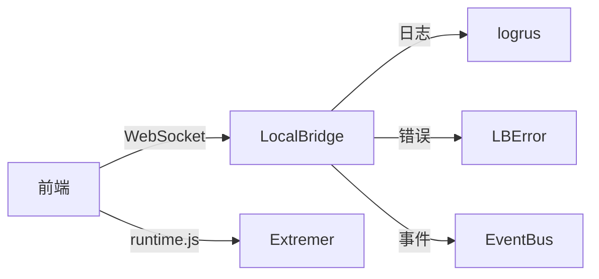

# 故障排除与常见问题

<cite>
**本文引用的文件**   
- [README.md](file://README.md)
- [logger.go](file://LocalBridge/internal/logger/logger.go)
- [errors.go](file://LocalBridge/internal/errors/errors.go)
- [eventbus.go](file://LocalBridge/internal/eventbus/eventbus.go)
- [runtime.js](file://Extremer/frontend/wailsjs/runtime/runtime.js)
- [utils.ts](file://src/components/panels/main/connection/utils.ts)
- [ConnectionPanel.tsx](file://src/components/panels/main/ConnectionPanel.tsx)
- [Error Handling.md](file://dev/instructions/maafw-golang-binding/Error Handling.md)
- [log.mdx](file://dev/instructions/wails/reference/runtimelog.mdx)
- [windows.mdx](file://dev/instructions/wails/guides/windows.mdx)
- [linux.mdx](file://dev/instructions/wails/guides/linux.mdx)
- [compatible-style.zh-CN.md](file://dev/instructions/ant-design/react/compatible-style.zh-CN.md)
- [introduce.zh-CN.md](file://dev/instructions/ant-design/react/introduce.zh-CN.md)
- [05.开发者工具.md](file://docsite/docs/01.指南/95.开发与调试/05.开发者工具.md)
- [40.流程级调试.md](file://docsite/docs/01.指南/20.本地服务/40.流程级调试.md)
</cite>

## 目录
1. [简介](#简介)
2. [项目结构](#项目结构)
3. [核心组件](#核心组件)
4. [架构总览](#架构总览)
5. [详细组件分析](#详细组件分析)
6. [依赖关系分析](#依赖关系分析)
7. [性能考虑](#性能考虑)
8. [故障排除指南](#故障排除指南)
9. [结论](#结论)
10. [附录](#附录)

## 简介
本指南面向使用者与维护者，系统性地梳理常见问题与故障排除方法，覆盖本地服务日志与错误模型、性能诊断与优化、跨平台兼容性处理、调试工具与日志分析、社区支持与反馈渠道、问题报告与缺陷提交流程，以及预防性维护与最佳实践。内容基于仓库内的日志系统、错误模型、事件总线、前端运行时桥接、连接面板与平台适配、以及官方文档与指南。

## 项目结构
- 前端与可视化编辑器：React + React Flow，负责节点编辑、连接、字段面板、调试与日志面板等。
- 本地服务（LocalBridge）：Go 实现，提供文件扫描、资源管理、设备连接、WebSocket 服务、日志与错误模型、事件总线等。
- Extremer：Wails 打包层，提供窗口、屏幕、环境信息等运行时 API 的 JS 封装。
- 文档与指南：docsite 提供使用与开发文档，dev/instructions 提供框架绑定、Wails、Ant Design 等兼容性与调试指南。

图表来源
- [logger.go:1-251](file://LocalBridge/internal/logger/logger.go#L1-L251)
- [errors.go:1-141](file://LocalBridge/internal/errors/errors.go#L1-L141)
- [eventbus.go:1-83](file://LocalBridge/internal/eventbus/eventbus.go#L1-L83)
- [runtime.js:120-186](file://Extremer/frontend/wailsjs/runtime/runtime.js#L120-L186)

章节来源
- [README.md:1-161](file://README.md#L1-L161)

## 核心组件
- 日志系统（LocalBridge）：统一控制台与文件日志输出，支持模块化字段、历史日志缓存、按天清理旧日志、向客户端推送日志。
- 错误模型（LocalBridge）：标准化错误码与包装器，便于前端统一展示与定位。
- 事件总线（LocalBridge）：同步/异步事件发布与订阅，用于文件扫描、连接状态、配置重载等跨模块通信。
- Extremer 运行时桥接（Wails）：封装窗口、屏幕、环境等底层能力，供前端调用。
- 设备连接面板与平台适配：根据浏览器平台动态显示可用连接方式，并提供 macOS 默认方法配置。

章节来源
- [logger.go:1-251](file://LocalBridge/internal/logger/logger.go#L1-L251)
- [errors.go:1-141](file://LocalBridge/internal/errors/errors.go#L1-L141)
- [eventbus.go:1-83](file://LocalBridge/internal/eventbus/eventbus.go#L1-L83)
- [runtime.js:120-186](file://Extremer/frontend/wailsjs/runtime/runtime.js#L120-L186)
- [utils.ts:1-25](file://src/components/panels/main/connection/utils.ts#L1-L25)
- [ConnectionPanel.tsx:862-881](file://src/components/panels/main/ConnectionPanel.tsx#L862-L881)

## 架构总览
本地服务作为中枢，承载日志、错误、事件与文件/资源/设备等能力；前端通过 Wails 运行时桥接访问底层能力，并通过 WebSocket 与本地服务交互；日志与错误模型贯穿两端，保证可观测性与一致性。

图表来源
- [runtime.js:120-186](file://Extremer/frontend/wailsjs/runtime/runtime.js#L120-L186)
- [logger.go:164-201](file://LocalBridge/internal/logger/logger.go#L164-L201)
- [errors.go:22-74](file://LocalBridge/internal/errors/errors.go#L22-L74)

## 详细组件分析

### 组件A：日志系统（LocalBridge）
- 功能要点
  - 控制台与文件双通道输出，支持模块字段与时间戳。
  - 历史日志缓存（固定上限），便于前端回显。
  - 定期清理旧日志文件（按天保留）。
  - 可选推送至客户端，用于实时日志面板。
- 关键行为
  - 初始化时解析日志级别，创建文件句柄并设置格式。
  - 推送钩子在 Info/Warn/Error 级别触发，同时写入缓存。
  - 文件日志全级别记录，便于深度排查。

图表来源
- [logger.go:43-100](file://LocalBridge/internal/logger/logger.go#L43-L100)
- [logger.go:136-162](file://LocalBridge/internal/logger/logger.go#L136-L162)
- [logger.go:208-250](file://LocalBridge/internal/logger/logger.go#L208-L250)

章节来源
- [logger.go:1-251](file://LocalBridge/internal/logger/logger.go#L1-L251)

### 组件B：错误模型（LocalBridge）
- 功能要点
  - 标准化错误码与描述，支持包装原始错误与附加详情。
  - 提供常用错误构造函数（文件不存在、读写失败、权限不足、JSON 无效等）。
  - 统一转换为前端可用的 ErrorData 结构。
- 关键行为
  - New/Wrap 构造错误对象。
  - WithDetail 附加上下文详情。
  - ToErrorData 用于序列化传输。

图表来源
- [errors.go:9-20](file://LocalBridge/internal/errors/errors.go#L9-L20)
- [errors.go:22-74](file://LocalBridge/internal/errors/errors.go#L22-L74)

章节来源
- [errors.go:1-141](file://LocalBridge/internal/errors/errors.go#L1-L141)

### 组件C：事件总线（LocalBridge）
- 功能要点
  - 支持订阅/发布/取消订阅，同步与异步发布。
  - 全局事件总线实例，内置常用事件类型（文件扫描完成、连接建立/关闭、资源扫描完成、配置重载等）。
- 关键行为
  - Publish 遍历处理器列表顺序执行。
  - PublishAsync 使用 goroutine 异步执行，避免阻塞。

图表来源
- [eventbus.go:29-64](file://LocalBridge/internal/eventbus/eventbus.go#L29-L64)

章节来源
- [eventbus.go:1-83](file://LocalBridge/internal/eventbus/eventbus.go#L1-L83)

### 组件D：Extremer 运行时桥接（Wails）
- 功能要点
  - 提供窗口尺寸、位置、最小化/最大化、背景色、屏幕枚举、环境信息、浏览器打开 URL 等 API。
  - 供前端在本地打包环境中调用系统能力。
- 关键行为
  - 通过 window.runtime.* 方法暴露运行时能力。
  - 与前端组件协作，实现窗口管理与系统交互。

图表来源
- [runtime.js:120-186](file://Extremer/frontend/wailsjs/runtime/runtime.js#L120-L186)

章节来源
- [runtime.js:120-186](file://Extremer/frontend/wailsjs/runtime/runtime.js#L120-L186)

### 组件E：设备连接面板与平台适配
- 功能要点
  - 根据浏览器平台（Windows/macOS/Linux）动态展示可用连接类型（ADB、Win32、PlayCover、Gamepad、Wlroots、macOS 原生等）。
  - 提供 macOS 默认方法配置（截屏、输入）。
- 关键行为
  - detectPlatform 判断平台。
  - PLATFORM_TABS 映射平台到可用连接类型。
  - MACOS_DEFAULT_METHODS 提供默认方法集合。

图表来源
- [utils.ts:1-25](file://src/components/panels/main/connection/utils.ts#L1-L25)
- [ConnectionPanel.tsx:862-881](file://src/components/panels/main/ConnectionPanel.tsx#L862-L881)

章节来源
- [utils.ts:1-25](file://src/components/panels/main/connection/utils.ts#L1-L25)
- [ConnectionPanel.tsx:862-881](file://src/components/panels/main/ConnectionPanel.tsx#L862-L881)

## 依赖关系分析
- 前端与本地服务：通过 WebSocket 交互，日志与错误模型贯穿两端，确保一致的可观测性。
- 本地服务内部：日志系统与错误模型相互独立但共同服务于事件总线与文件/资源/设备能力。
- Extremer 运行时桥接：为前端提供系统级能力，降低平台差异带来的复杂度。

图表来源
- [logger.go:164-201](file://LocalBridge/internal/logger/logger.go#L164-L201)
- [errors.go:44-50](file://LocalBridge/internal/errors/errors.go#L44-L50)
- [eventbus.go:38-56](file://LocalBridge/internal/eventbus/eventbus.go#L38-L56)
- [runtime.js:120-186](file://Extremer/frontend/wailsjs/runtime/runtime.js#L120-L186)

章节来源
- [logger.go:1-251](file://LocalBridge/internal/logger/logger.go#L1-L251)
- [errors.go:1-141](file://LocalBridge/internal/errors/errors.go#L1-L141)
- [eventbus.go:1-83](file://LocalBridge/internal/eventbus/eventbus.go#L1-L83)
- [runtime.js:120-186](file://Extremer/frontend/wailsjs/runtime/runtime.js#L120-L186)

## 性能考虑
- 日志级别与输出
  - 控制台日志级别可在初始化时设置，建议在生产环境使用 Info/Warn，避免过多 Trace/Debug 输出影响性能。
  - 文件日志全级别记录，仅在排查问题时开启，日常运行建议限制级别。
- 历史日志缓存
  - 固定上限的内存缓存有助于前端快速回显，但需注意内存占用；可根据场景调整上限。
- 事件总线异步发布
  - 对耗时操作采用 PublishAsync，避免阻塞主线程；对强一致需求使用 Publish。
- 平台依赖与系统调用
  - 截图、输入模拟等系统调用成本较高，应尽量减少不必要的重复调用，结合缓存与节流策略。
- 前端渲染与布局
  - 大规模节点与边时，优先使用虚拟滚动、延迟加载与合理的布局算法，避免一次性渲染过多元素。

## 故障排除指南

### 通用排查步骤
- 确认本地服务状态
  - 检查日志是否正常输出，确认历史日志缓存是否更新。
  - 若日志为空，检查日志目录与权限，确认清理策略未误删。
- 统一错误定位
  - 使用错误模型的错误码与详情字段，快速判断是文件、网络、权限还是参数问题。
  - 对包装的原始错误进行溯源，结合日志定位具体模块。
- 事件链路验证
  - 确认事件订阅是否正确，发布是否触发，异步事件是否超时或丢失。

章节来源
- [logger.go:43-100](file://LocalBridge/internal/logger/logger.go#L43-L100)
- [errors.go:22-74](file://LocalBridge/internal/errors/errors.go#L22-L74)
- [eventbus.go:29-64](file://LocalBridge/internal/eventbus/eventbus.go#L29-L64)

### 常见问题与解决方案

- 无法连接设备或连接不稳定
  - 平台适配：确认当前平台映射的可用连接类型是否正确，必要时切换到其他可用方法。
  - macOS 默认方法：检查截屏与输入方法是否符合预期，默认配置可参考平台工具函数。
  - Windows WebView2：若出现运行时缺失或版本不匹配，按指南安装或捆绑固定版本运行时。
  - Linux GStreamer：若遇到 WebKitGTK 相关问题，按指南安装对应插件包并检查依赖。

章节来源
- [utils.ts:11-25](file://src/components/panels/main/connection/utils.ts#L11-L25)
- [ConnectionPanel.tsx:862-881](file://src/components/panels/main/ConnectionPanel.tsx#L862-L881)
- [windows.mdx:27-57](file://dev/instructions/wails/guides/windows.mdx#L27-L57)
- [linux.mdx:43-72](file://dev/instructions/wails/guides/linux.mdx#L43-L72)

- 日志不显示或日志文件异常
  - 检查日志初始化参数（级别、目录），确认目录存在且有写权限。
  - 查看旧日志清理策略是否误删当日日志。
  - 确认是否启用推送钩子，以便前端实时接收日志。

章节来源
- [logger.go:43-100](file://LocalBridge/internal/logger/logger.go#L43-L100)
- [logger.go:208-250](file://LocalBridge/internal/logger/logger.go#L208-L250)
- [logger.go:136-162](file://LocalBridge/internal/logger/logger.go#L136-L162)

- 前端样式或兼容性问题
  - Ant Design 版本与浏览器兼容性：根据指南确认最低浏览器版本与降级兼容方案。
  - 若出现选择器或逻辑属性不兼容，按指南使用 StyleProvider 降级处理。

章节来源
- [compatible-style.zh-CN.md:1-25](file://dev/instructions/ant-design/react/compatible-style.zh-CN.md#L1-L25)
- [introduce.zh-CN.md:35-43](file://dev/instructions/ant-design/react/introduce.zh-CN.md#L35-L43)

- 调试与流程级问题
  - 使用文档站提供的开发者工具与流程级调试指南，结合日志与错误模型定位问题。
  - 对于框架绑定错误处理，遵循立即检查错误的最佳实践，避免错误累积。

章节来源
- [05.开发者工具.md](file://docsite/docs/01.指南/95.开发与调试/05.开发者工具.md)
- [40.流程级调试.md](file://docsite/docs/01.指南/20.本地服务/40.流程级调试.md)
- [Error Handling.md:597-607](file://dev/instructions/maafw-golang-binding/Error Handling.md#L597-L607)

### 性能问题诊断与优化
- 日志开销
  - 减少 Trace/Debug 级别输出，仅在问题定位阶段开启。
  - 控制历史日志缓存大小，避免内存压力。
- 事件风暴
  - 对高频事件采用异步发布，必要时引入节流/去抖。
- 平台依赖
  - 截图/输入模拟等操作应合并与复用，避免重复调用。
- 前端渲染
  - 大图预览与节点渲染采用懒加载与虚拟化策略。

### 兼容性问题处理与适配策略
- 浏览器与框架版本
  - 严格遵循 Ant Design 与 React 的版本兼容矩阵，避免使用不受支持的组合。
- WebView2（Windows）
  - 按指南安装或捆绑固定版本运行时，确保最小版本满足要求。
- Linux
  - 安装 GStreamer 插件包，解决上游 WebKitGTK 问题。
- 平台特定能力
  - 使用平台工具函数动态适配可用连接类型，避免硬编码。

章节来源
- [introduce.zh-CN.md:35-43](file://dev/instructions/ant-design/react/introduce.zh-CN.md#L35-L43)
- [windows.mdx:27-57](file://dev/instructions/wails/guides/windows.mdx#L27-L57)
- [linux.mdx:43-72](file://dev/instructions/wails/guides/linux.mdx#L43-L72)
- [utils.ts:11-25](file://src/components/panels/main/connection/utils.ts#L11-L25)

### 调试工具与日志分析方法
- 前端日志
  - 使用 Wails 运行时日志 API 输出 Info/Warn/Error/Fatal 级别日志，便于前端侧定位。
- 本地服务日志
  - 通过日志系统输出模块化日志，结合历史缓存与文件日志进行交叉验证。
- 错误模型
  - 统一错误码与详情，前端可据此提示用户或自动重试。

章节来源
- [log.mdx:56-110](file://dev/instructions/wails/reference/runtimelog.mdx#L56-L110)
- [logger.go:164-201](file://LocalBridge/internal/logger/logger.go#L164-L201)
- [errors.go:44-50](file://LocalBridge/internal/errors/errors.go#L44-L50)

### 社区支持与反馈渠道
- 项目未设单独交流群，可在 MaaFramework 集成/开发交流 QQ 群中提问或参与讨论。
- 提交 Issue 或 PR 以反馈问题或改进意见，项目鼓励开发者体验反馈。

章节来源
- [README.md:124-127](file://README.md#L124-L127)

### 问题报告与 Bug 提交规范流程
- 准备信息
  - 环境信息：操作系统、浏览器版本、本地服务版本、相关依赖版本。
  - 复现步骤：清晰的操作步骤与期望/实际结果。
  - 日志与错误：附上相关日志片段与错误码详情。
- 提交渠道
  - 在项目仓库提交 Issue 或 PR；如涉及框架绑定问题，参考相应指南。
- 跟进与协作
  - 根据维护者反馈补充信息或提供修复方案。

章节来源
- [README.md:124-127](file://README.md#L124-L127)
- [Error Handling.md:597-607](file://dev/instructions/maafw-golang-binding/Error Handling.md#L597-L607)

### 预防性维护与最佳实践
- 日志与监控
  - 生产环境使用合适的日志级别，定期清理旧日志，保留必要的 Trace/Debug 以便快速定位。
- 错误处理
  - 遵循“立即检查错误”的最佳实践，避免错误累积与传播。
- 事件总线
  - 对耗时操作使用异步发布，避免阻塞；对关键事件使用同步发布并做好超时处理。
- 平台与依赖
  - 严格遵循各平台与框架的兼容性要求，提前在目标环境验证运行时依赖。
- 前端性能
  - 对大规模节点与图像预览采用懒加载与虚拟化，减少一次性渲染压力。

## 结论
通过统一的日志系统、标准化的错误模型、事件总线与运行时桥接，本项目在跨平台与本地能力集成方面具备良好的可观测性与可维护性。结合本文的故障排除流程、性能优化建议与兼容性策略，可有效提升稳定性与用户体验。建议在日常维护中持续关注日志与错误趋势，及时响应平台与依赖变更，确保系统长期稳定运行。

## 附录
- 相关文档与指南
  - 本地服务与流程级调试：参见文档站相应章节。
  - 框架绑定错误处理与最佳实践：参见 maafw-golang-binding 指南。
  - Wails 平台运行时与兼容性：参见 Wails 官方指南与兼容性说明。